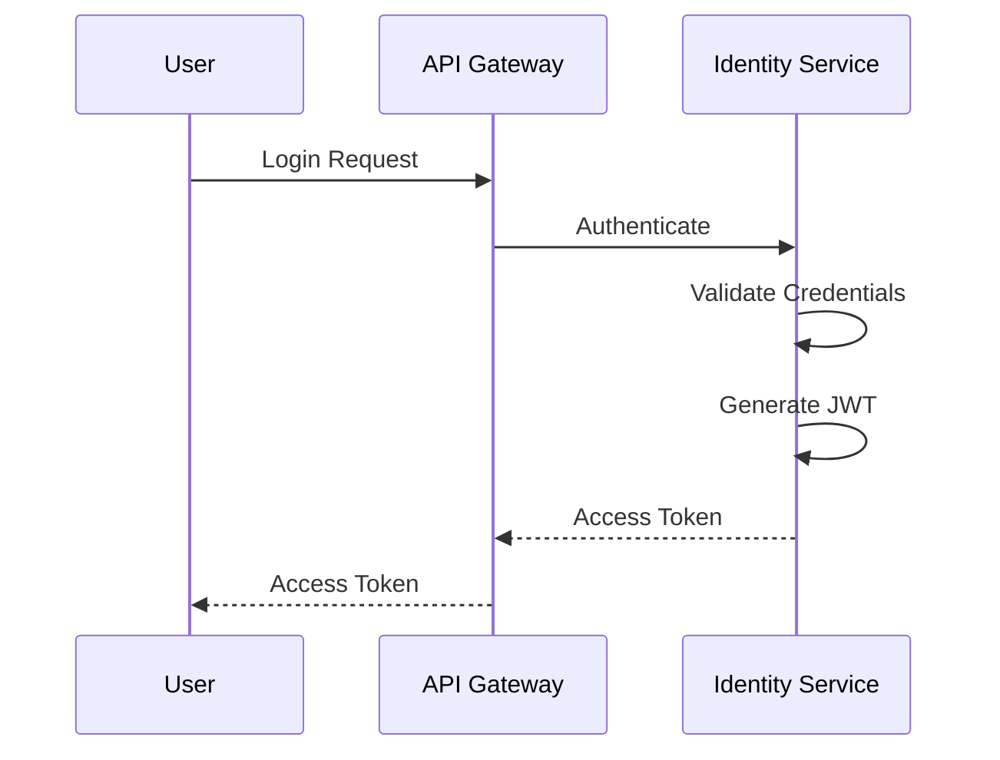
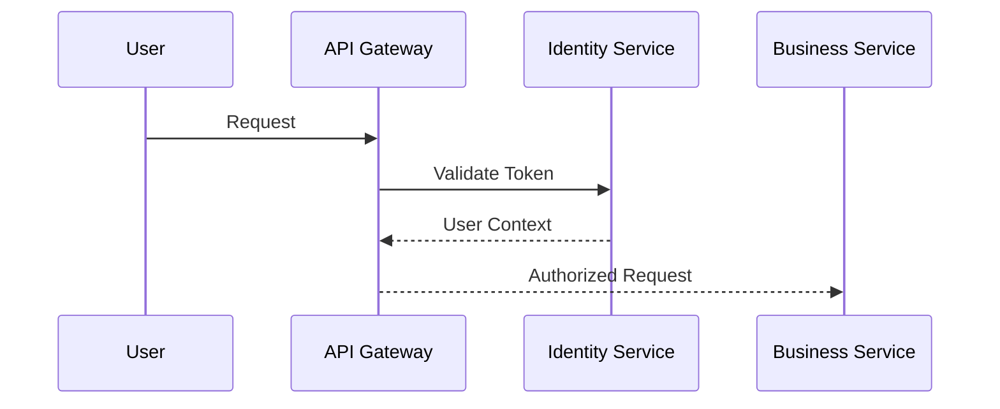

# FRD-001: Identity & Access Management (IAM)

## 1. Title Page

| Field         | Value                                    |
| ------------- | ---------------------------------------- |
| Project Name  | Distributed Hub and Sales (DHS) Platform |
| Document ID   | FRD-001                                  |
| Module Name   | Identity & Access Management (IAM)       |
| Domain        | Security & Platform Foundation           |
| Document Type | Functional Requirements Document         |
| Version       | v1.0.0                                   |
| Author        | Sachin Salunke                           |
| Status        | Draft                                    |
| Date          | 2026-06-19                               |

---

# 2. Document Metadata

| Field         | Value                            |
| ------------- | -------------------------------- |
| Document ID   | FRD-001                          |
| Domain        | Security & Platform Foundation   |
| Document Type | Functional Requirements Document |
| Version       | v1.0.0                           |
| Author        | Sachin Salunke                   |
| Status        | Draft                            |
| Date          | 2026-01-01                       |
| Linked BRD    | BRD-001                          |
| Linked PRD    | PRD-001                          |
| Linked HLD    | HLD-001                          |
| Linked SRS | SRS-001 |
| Linked RTM | RTM-001 |
| Linked CONTEXT | CONTEXT-001 |
| Linked DOMAIN | DOMAIN-001 |
| Linked ADRs | ADR-001 to ADR-007 |

---

# 3. Revision History

| Version | Date       | Author         | Description                                                   |
| ------- | ---------- | -------------- | ------------------------------------------------------------- |
| v1.0.0  | 2026-06-19 | Sachin Salunke | Initial Identity & Access Management functional specification |
| v1.1.0 | 2026-06-20 | Sachin Salunke | Updated for Cloud-Native Monorepo-Based Multi-Module Microservices Architecture |
---

# 4. References

| Reference ID | Document |
|-------------|-----------|
| BRD-001 | Business Requirements Document |
| PRD-001 | Product Requirements Document |
| SRS-001 | Software Requirements Specification |
| HLD-001 | High-Level Design |
| RTM-001 | Requirements Traceability Matrix |
| CONTEXT-001 | System Context Document |
| DOMAIN-001 | Domain Model |
| ADR-001 | Monorepo-Based Multi-Module Microservices Architecture |
| ADR-002 | Database per Service Strategy |
| ADR-003 | Hybrid Communication Architecture |
| ADR-004 | Service Discovery Architecture |
| ADR-005 | API Gateway Strategy |
| ADR-006 | Saga-Based Distributed Transaction Strategy |
| ADR-007 | Security Architecture |

---

# 5. Sign-Off Table

| Role               | Name           | Status  |
| ------------------ | -------------- | ------- |
| Product Owner      | Sachin Salunke | Pending |
| Solution Architect | Sachin Salunke | Pending |
| Technical Lead     | TBD            | Pending |
| Security Lead      | TBD            | Pending |

---

# 6. Functional Overview

The Identity & Access Management (IAM) module provides centralized authentication and authorization services for the DHS Platform.

Responsibilities:

- User Authentication
- User Management
- Role Management
- Permission Management
- JWT Token Management
- Session Management
- Password Management
- Account Security
- Audit Logging

This module serves as the foundation for all DHS business modules.

## Implementation Characteristics:

- Cloud-Native Architecture
- Monorepo-Based Multi-Module Maven Structure
- Independently Deployable Microservice
- Database per Service
- JWT Authentication
- Role-Based Access Control (RBAC)
- Service Discovery Integration
- API Gateway Integration
- Event-Driven Audit Logging

---

# 7. Service Ownership

## Owning Service

identity-service

## Database

iam-db

## Communication

### Inbound

- API Gateway
- OpenFeign Clients

### Outbound

- Kafka Events
- Audit Service
- Notification Service

### Service Dependencies

- API Gateway
- Service Discovery
- Kafka
- Redis

---

# 8. Functional Requirements

## FR-IAM-001

### Requirement Name

User Authentication

### Description

The system shall authenticate users using username/email and password credentials.

### Priority

Critical

### Actors

- Super Admin
- Company Admin
- Branch Manager
- Sales Executive
- Inventory Operator
- Billing Executive
- Dispatch Executive
- Finance Executive
- Customer

---

## FR-IAM-002

### Requirement Name

JWT Token Generation

### Description

The system shall issue JWT Access Tokens and Refresh Tokens after successful authentication.

### Priority

Critical

---

## FR-IAM-003

### Requirement Name

User Management

### Description

The system shall provide user creation, modification, activation, deactivation, and search capabilities.

### Priority

Critical

---

## FR-IAM-004

### Requirement Name

Role Management

### Description

The system shall support creation and management of business roles.

### Priority

Critical

---

## FR-IAM-005

### Requirement Name

Permission Management

### Description

The system shall support granular permission assignment to roles.

### Priority

Critical

---

## FR-IAM-006

### Requirement Name

Password Management

### Description

The system shall provide password creation, reset, and change capabilities.

### Priority

Critical

---

## FR-IAM-007

### Requirement Name

Session Management

### Description

The system shall manage user login sessions and token refresh operations.

### Priority

High

---

## FR-IAM-008

### Requirement Name

Audit Logging

### Description

The system shall audit all authentication and authorization activities.

### Priority

High

---

# 8. User Roles

| Role               | Responsibilities              |
| ------------------ | ----------------------------- |
| Super Admin        | Platform administration       |
| Company Admin      | Company administration        |
| Hub Manager        | Operational administration    |
| Branch Manager     | Branch administration         |
| Sales Executive    | Customer and order activities |
| Inventory Operator | Inventory operations          |
| Billing Executive  | Invoice operations            |
| Dispatch Executive | Shipment operations           |
| Finance Executive  | Financial reporting           |
| Customer           | Order request and tracking    |

---

# 9. Business Rules

## BR-IAM-001

Every user must belong to at least one role.

---

## BR-IAM-002

A role may contain multiple permissions.

---

## BR-IAM-003

Permissions may be assigned to multiple roles.

---

## BR-IAM-004

Passwords shall be encrypted.

---

## BR-IAM-005

Disabled users shall not be authenticated.

---

## BR-IAM-006

Inactive users shall not receive access tokens.

---

## BR-IAM-007

Every authentication activity must be audited.

---

## BR-IAM-008

Customers can access only their own data.

---

# 10. Functional Workflows

## Authentication Workflow


---

## Authorization Workflow


---

## User Management Workflow


---

# 11. Functional Flow

## Login Flow



---

## Authorization Flow



---

## Synchronous Communication

Technologies:

- REST APIs
- OpenFeign
- Service Discovery

Used For:

- Authentication
- Token Validation
- User Lookup
- Permission Lookup

## Asynchronous Communication

Technologies:

- Apache Kafka
- Domain Events

Used For:

- User Audit Events
- Security Events
- Notification Events

## Published Events

```text
UserCreated
UserUpdated
UserDisabled
UserEnabled
PasswordChanged
PasswordReset
RoleAssigned
PermissionUpdated
UserAuthenticated
TokenRefreshed
AccessDenied
```

## Consumed Events

```text
NotificationSent
AuditRecorded
```

---

# 12. Screen Requirements

## Login Screen

Fields:

- Username / Email
- Password
- Remember Me

Buttons:

- Login
- Forgot Password

---

## User Management Screen

Fields:

- User ID
- Username
- First Name
- Last Name
- Email
- Mobile Number
- Status
- Role Assignment

Actions:

- Create
- Update
- Activate
- Deactivate
- Search

---

## Role Management Screen

Fields:

- Role Name
- Description
- Permissions

Actions:

- Create
- Update
- Delete
- Assign Permissions

---

# 13. Field Validations

## Username

- Required
- Minimum 4 characters
- Maximum 50 characters
- Unique

---

## Email

- Required
- Valid email format
- Unique

---

## Password

- Required
- Minimum 8 characters
- Maximum 128 characters
- Must contain:

  - Uppercase letter
  - Lowercase letter
  - Number
  - Special character

---

## Mobile Number

- Optional
- Numeric
- Maximum 15 digits

---

# 14. Exception Scenarios

## Invalid Credentials

Response:

```text
Invalid username or password.
```

---

## User Disabled

Response:

```text
User account is disabled.
```

---

## User Not Found

Response:

```text
User does not exist.
```

---

## Access Denied

Response:

```text
Access denied.
```

---

## Expired Token

Response:

```text
Session expired. Please login again.
```

---

# 15. Audit Requirements

Audit Events:

```text
USER_LOGIN
USER_LOGOUT
USER_CREATED
USER_UPDATED
USER_DISABLED
ROLE_CREATED
ROLE_UPDATED
ROLE_ASSIGNED
PERMISSION_ASSIGNED
PASSWORD_CHANGED
PASSWORD_RESET
TOKEN_REFRESHED
ACCESS_DENIED
AUTHENTICATION_FAILED
TOKEN_VALIDATED
TOKEN_EXPIRED
USER_ENABLED
```

---

# 16. APIs

## Authentication APIs

```text
POST /api/v1/auth/login
POST /api/v1/auth/refresh
POST /api/v1/auth/logout
POST /api/v1/auth/validate
```
## User APIs

```text
POST /api/v1/users
PUT /api/v1/users/{id}
GET /api/v1/users/{id}
GET /api/v1/users
PATCH /api/v1/users/{id}/status
```

## Role APIs

```text
POST /api/v1/roles
PUT /api/v1/roles/{id}
GET /api/v1/roles
```

## Permission APIs

```text
GET /api/v1/permissions
PUT /api/v1/roles/{id}/permissions
```

---

# 17. Notifications

System notifications:

- Password Reset Email
- Account Activation Email
- Password Change Notification
- Account Lock Notification

---

# 18. Non-Functional Requirements

```text
- JWT Authentication
- RBAC Authorization
- TLS 1.3
- Service Discovery
- API Gateway Integration
- Distributed Tracing
- Correlation IDs
- Structured Logging
- Horizontal Scalability
- High Availability
- Retry Policies
- Circuit Breakers
- Audit Logging
- Event Idempotency
```

---

# 19. Reporting Requirements

Reports:

- Active Users Report
- Login Activity Report
- Failed Login Report
- Role Assignment Report
- Permission Matrix Report
- User Audit Report

---

# 20. High-Level Data Entities

## User

```text
User
├── UserId
├── Username
├── Email
├── Mobile
├── Status
├── PasswordHash
├── CreatedAt
└── UpdatedAt
```

---

## Role

```text
Role
├── RoleId
├── Name
├── Description
└── Status
```

---

## Permission

```text
Permission
├── PermissionId
├── Name
├── Description
└── Module
```

---

## Session

```text
Session
├── SessionId
├── UserId
├── TokenId
├── LoginAt
├── ExpiresAt
└── Status
```

---

# 21. Success Criteria

- Users can authenticate successfully.
- JWT tokens are generated securely.
- Users can be managed by administrators.
- Roles and permissions are configurable.
- Authentication events are audited.
- Unauthorized access is prevented.
- Password management workflows operate correctly.
- Service registers successfully with Service Discovery.
- JWT validation works through API Gateway.
- Authentication APIs remain independently deployable.
- Authentication events are published successfully.
- Audit and notification integrations function correctly.
- Distributed tracing is available for authentication workflows.

---

# 22. Traceability

| BR     | FR         |
| ------ | ---------- |
| BR-001 | FR-IAM-001 |
| BR-001 | FR-IAM-002 |
| BR-001 | FR-IAM-003 |
| BR-001 | FR-IAM-004 |
| BR-001 | FR-IAM-005 |
| BR-001 | FR-IAM-006 |
| BR-001 | FR-IAM-007 |
| BR-012 | FR-IAM-008 |

---

