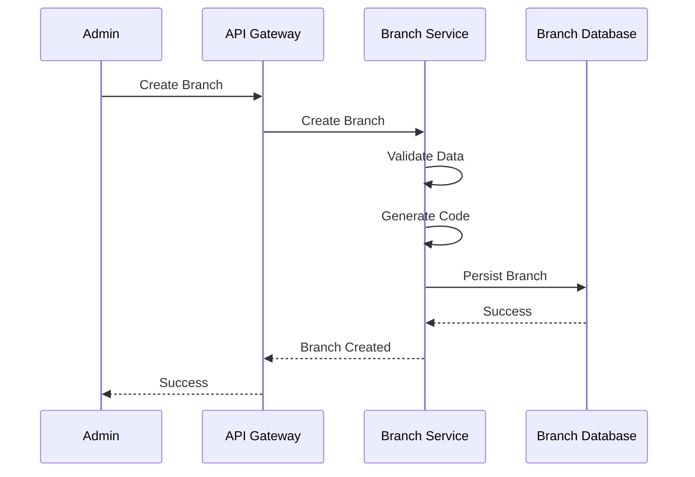
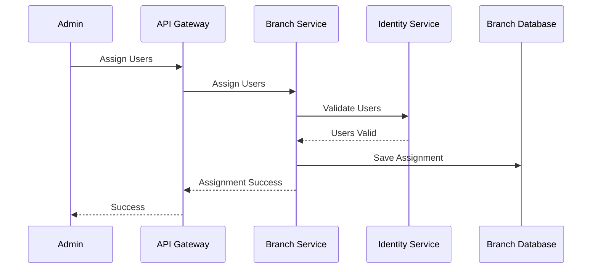

# FRD-002: Branch Management

## 1. Title Page

| Field         | Value                                    |
| ------------- | ---------------------------------------- |
| Project Name  | Distributed Hub and Sales (DHS) Platform |
| Document ID   | FRD-002                                  |
| Module Name   | Branch Management                        |
| Domain        | Branch Administration & Operations       |
| Document Type | Functional Requirements Document         |
| Version       | v1.1.0                                   |
| Author        | Sachin Salunke                           |
| Status        | Draft                                    |
| Date          | 2026-01-01                               |

---

# 2. Document Metadata

| Field          | Value                              |
| -------------- | ---------------------------------- |
| Document ID    | FRD-002                            |
| Domain         | Branch Administration & Operations |
| Document Type  | Functional Requirements Document   |
| Version        | v1.0.0                             |
| Author         | Sachin Salunke                     |
| Status         | Draft                              |
| Date           | 2026-06-19                         |
| Linked BRD     | BRD-001                            |
| Linked PRD     | PRD-001                            |
| Linked HLD     | HLD-001                            |
| Linked SRS     | SRS-001                            |
| Linked RTM     | RTM-001                            |
| Linked CONTEXT | CONTEXT-001                        |
| Linked DOMAIN  | DOMAIN-001                         |
| Linked ADRs    | ADR-001 to ADR-007                 |

---

# 3. Revision History

| Version | Date       | Author         | Description                                                                     |
| ------- | ---------- | -------------- | ------------------------------------------------------------------------------- |
| v1.0.0  | 2026-06-19 | Sachin Salunke | Initial Branch Management functional specification                              |
| v1.1.0  | 2026-06-20 | Sachin Salunke | Updated for Cloud-Native Monorepo-Based Multi-Module Microservices Architecture |

---

# 4. References

| Reference ID | Document                                               |
| ------------ | ------------------------------------------------------ |
| BRD-001      | Business Requirements Document                         |
| PRD-001      | Product Requirements Document                          |
| SRS-001      | Software Requirements Specification                    |
| HLD-001      | High-Level Design                                      |
| RTM-001      | Requirements Traceability Matrix                       |
| CONTEXT-001  | System Context Document                                |
| DOMAIN-001   | Domain Model                                           |
| ADR-001      | Monorepo-Based Multi-Module Microservices Architecture |
| ADR-002      | Database per Service Strategy                          |
| ADR-003      | Hybrid Communication Architecture                      |
| ADR-004      | Service Discovery Architecture                         |
| ADR-005      | API Gateway Strategy                                   |
| ADR-006      | Saga-Based Distributed Transaction Strategy            |
| ADR-007      | Security Architecture                                  |

---

# 5. Sign-Off Table

| Role                 | Name           | Status  |
| -------------------- | -------------- | ------- |
| Product Owner        | Sachin Salunke | Pending |
| Solution Architect   | Sachin Salunke | Pending |
| Technical Lead       | TBD            | Pending |
| Business Stakeholder | TBD            | Pending |

---

# 6. Functional Overview

The Branch Management module provides centralized administration and operational management of business branches within the DHS platform.

Responsibilities:

- Branch Registration
- Branch Configuration
- Branch Status Management
- Branch Contact Management
- Branch Address Management
- Branch Operational Settings
- Branch User Association
- Branch Search and Reporting
- Branch Audit Logging
  Implementation Characteristics:

- Cloud-Native Architecture
- Monorepo-Based Multi-Module Maven Structure
- Independently Deployable Microservice
- Database per Service
- API Gateway Integration
- Service Discovery Integration
- REST APIs and OpenFeign Communication
- Event-Driven Audit Logging
- JWT Authentication and RBAC Authorization

The module acts as the organizational context for:

- Users
- Customers
- Orders
- Inventory
- Reporting

---

# 7. Service Ownership

## Owning Service

branch-service

## Database

branch-db

## Communication

### Inbound

- API Gateway
- OpenFeign Clients

### Outbound

- Identity Service
- Customer Service
- Inventory Service
- Reporting Service
- Audit Service
- Kafka Events

### Platform Dependencies

- API Gateway
- Service Discovery
- Kafka
- Redis

---

# 8. Functional Requirements

---

## FR-BR-001

### Requirement Name

Create Branch

### Description

The system shall allow authorized users to create and register new branches.

### Priority

Critical

### Actors

- Super Admin
- Company Admin

---

## FR-BR-002

### Requirement Name

Update Branch

### Description

The system shall allow authorized users to update branch details.

### Priority

Critical

### Actors

- Super Admin
- Company Admin

---

## FR-BR-003

### Requirement Name

Activate Branch

### Description

The system shall allow authorized users to activate branches.

### Priority

Critical

---

## FR-BR-004

### Requirement Name

Deactivate Branch

### Description

The system shall allow authorized users to deactivate branches.

### Priority

Critical

---

## FR-BR-005

### Requirement Name

Configure Branch

### Description

The system shall support operational configuration of branches.

### Priority

Critical

---

## FR-BR-006

### Requirement Name

Assign Users to Branch

### Description

The system shall support assignment of users to branches.

### Priority

Critical

---

## FR-BR-007

### Requirement Name

Search Branches

### Description

The system shall provide search capabilities for branches.

### Priority

High

---

## FR-BR-008

### Requirement Name

View Branch Details

### Description

The system shall provide detailed branch information.

### Priority

High

---

## FR-BR-009

### Requirement Name

Audit Branch Activities

### Description

The system shall audit all branch management activities.

### Priority

High

---

# 9. User Roles

| Role                | Responsibilities                  |
| ------------------- | --------------------------------- |
| Super Admin         | Full branch administration        |
| Company Admin       | Business branch administration    |
| Hub Manager         | View and manage branch operations |
| Branch Manager      | View and manage assigned branch   |
| Operation Executive | Branch operational activities     |

---

# 10. Business Rules

## BR-BR-001

Every branch shall have a unique branch code.

---

## BR-BR-002

Every branch shall belong to the company.

---

## BR-BR-003

Every branch shall have at least one address.

---

## BR-BR-004

A branch may have multiple contacts.

---

## BR-BR-005

Only active branches can perform business transactions.

---

## BR-BR-006

A branch cannot be deleted if:

- Active users exist
- Active inventory exists
- Active orders exist

---

## BR-BR-007

Branch deactivation shall preserve historical records.

---

## BR-BR-008

Every branch activity shall be audited.

---

## BR-BR-009

A branch shall be uniquely identifiable across the platform.

---

## BR-BR-010

Cross-service interactions shall occur through published APIs and domain events.

---

## BR-BR-011

Branch data ownership belongs exclusively to Branch Service.

---

# 11. Functional Workflows

## Branch Registration Workflow


---

## Branch User Assignment Workflow


---

## Branch Deactivation Workflow


---

# 12. Functional Flow

## Branch Creation Flow



---

## User Assignment Flow



---

## Synchronous Communication

**Technologies**:

- REST APIs
- OpenFeign
- Service Discovery

**Used For**:

- User Validation
- Branch Lookup
- Branch Validation
- Branch Search

## Asynchronous Communication

**Technologies**:

- Apache Kafka
- Domain Events

**Used For**:

- Audit Events
- Reporting Events
- Branch Lifecycle Events

## Published Events

```text
BranchCreated
BranchUpdated
BranchActivated
BranchDeactivated
BranchConfigurationUpdated
BranchUserAssigned
BranchUserRemoved
```

## Consumed Events

```text
UserCreated
UserUpdated
UserDisabled
```

---

# 13. Screen Requirements

## Branch Management Screen

Fields:

- Branch Code
- Branch Name
- Branch Type
- Status
- Email
- Mobile Number
- Address
- City
- State
- Country
- Postal Code

Actions:

- Create
- Update
- Activate
- Deactivate
- Search
- View Details

---

## Branch Configuration Screen

Fields:

- Branch Status
- Time Zone
- Currency
- GST Number
- Operational Settings

Actions:

- Save Configuration
- Update Configuration

---

## User Assignment Screen

Fields:

- Branch
- Users
- Roles

Actions:

- Assign
- Remove
- Search

---

# 14. Field Validations

## Branch Code

- Required
- Unique
- Maximum 20 characters
- Uppercase only

---

## Branch Name

- Required
- Maximum 150 characters

---

## Email

- Optional
- Valid email format

---

## Mobile Number

- Optional
- Numeric
- Maximum 15 digits

---

## GST Number

- Optional
- Valid GST format

---

# 15. Exception Scenarios

## Duplicate Branch Code

Response:

```text
Branch code already exists.
```

---

## Branch Not Found

Response:

```text
Branch does not exist.
```

---

## Branch Has Active Dependencies

Response:

```text
Branch cannot be deactivated because active dependencies exist.
```

---

## Invalid User Assignment

Response:

```text
Selected user does not exist.
```

---

# 16. Audit Requirements

Audit Events:

```text
BRANCH_CREATED
BRANCH_UPDATED
BRANCH_ACTIVATED
BRANCH_DEACTIVATED
BRANCH_CONFIGURATION_UPDATED
BRANCH_USER_ASSIGNED
BRANCH_USER_REMOVED
BRANCH_VIEWED
BRANCH_SEARCHED
BRANCH_CONFIGURATION_VIEWED
```

---

# 17. APIs

## Branch APIs

```text
POST   /api/v1/branches
PUT    /api/v1/branches/{id}
GET    /api/v1/branches/{id}
GET    /api/v1/branches
PATCH  /api/v1/branches/{id}/activate
PATCH  /api/v1/branches/{id}/deactivate
```

## Branch Configuration APIs

```text
PUT /api/v1/branches/{id}/configuration
GET /api/v1/branches/{id}/configuration
```

## Branch User APIs

```text
POST   /api/v1/branches/{id}/users
DELETE /api/v1/branches/{id}/users/{userId}
GET    /api/v1/branches/{id}/users
```

---

# 18. Notifications

System notifications:

- Branch Created
- Branch Activated
- Branch Deactivated
- User Assignment Completed
- Branch Configuration Updated

---

# 19. Reporting Requirements

Reports:

- Branch List Report
- Active Branch Report
- Inactive Branch Report
- Branch User Report
- Branch Activity Report
- Branch Audit Report

---

# 20. High-Level Data Entities

## Branch

```text
Branch
├── BranchId
├── BranchCode
├── BranchName
├── BranchType
├── Status
├── Email
├── MobileNumber
├── GSTNumber
├── CreatedAt
└── UpdatedAt
```

---

## Branch Address

```text
BranchAddress
├── AddressId
├── BranchId
├── AddressLine1
├── AddressLine2
├── City
├── State
├── Country
├── PostalCode
└── Type
```

---

## Branch Configuration

```text
BranchConfiguration
├── ConfigurationId
├── BranchId
├── TimeZone
├── Currency
├── OperationalSettings
└── UpdatedAt
```

---

## Branch User

```text
BranchUser
├── BranchId
├── UserId
├── RoleId
├── AssignedAt
└── Status
```

---

## Data Ownership:

- Branch Service exclusively owns:
  - Branch
  - BranchAddress
  - BranchConfiguration
  - BranchUser

---

# 21. Non-Functional Requirements

- JWT Authentication
- RBAC Authorization
- TLS 1.3
- Service Discovery
- API Gateway Integration
- Distributed Tracing
- Correlation IDs
- Structured Logging
- Horizontal Scalability
- High Availability
- Retry Policies
- Circuit Breakers
- Event Idempotency
- Audit Logging

---

# 22. Success Criteria

- Branches can be created and managed successfully.
- Branch codes remain unique.
- Branch configurations are maintained.
- Users can be assigned to branches.
- Inactive branches cannot participate in business transactions.
- Branch activities are fully audited.
- Reporting capabilities are available.

- Branch Service registers successfully with Service Discovery.
- Branch APIs are accessible through API Gateway.
- Branch events are published successfully to Kafka.
- User validation works through Identity Service.
- Distributed tracing is available for branch workflows.
- Branch Service remains independently deployable.

---

# 23. Traceability

| BR     | FR        |
| ------ | --------- |
| BR-002 | FR-BR-001 |
| BR-002 | FR-BR-002 |
| BR-002 | FR-BR-003 |
| BR-002 | FR-BR-004 |
| BR-002 | FR-BR-005 |
| BR-002 | FR-BR-006 |
| BR-002 | FR-BR-007 |
| BR-012 | FR-BR-009 |

---
