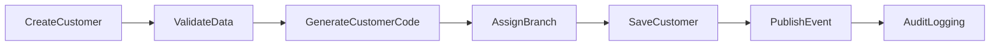
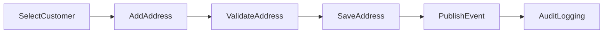
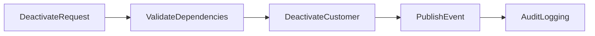
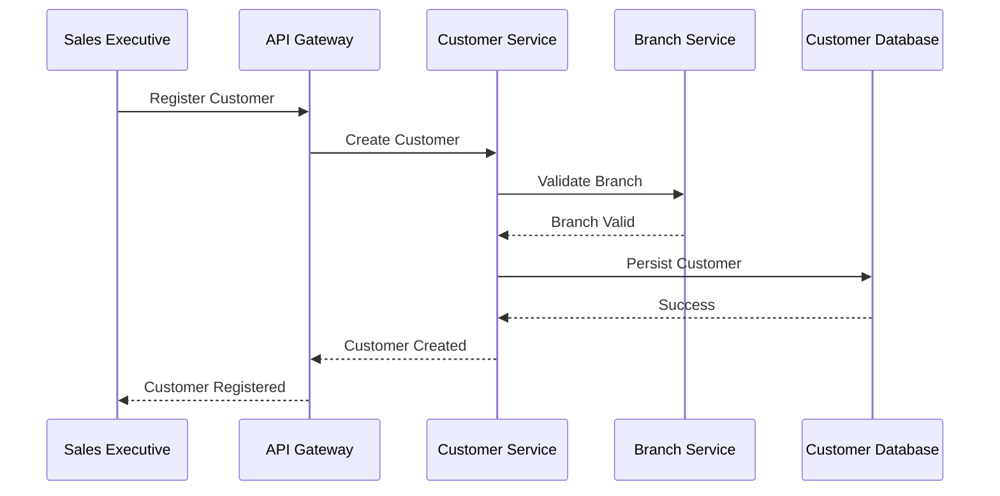
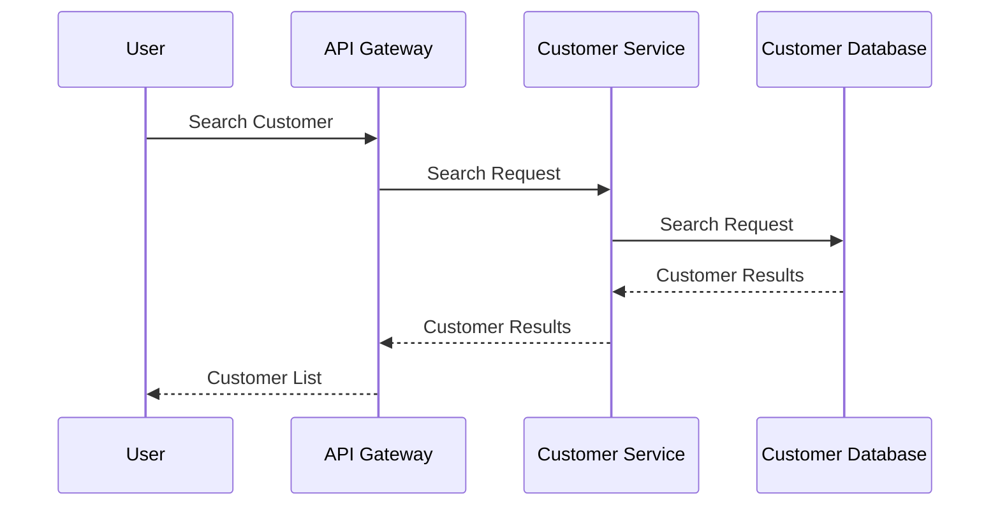
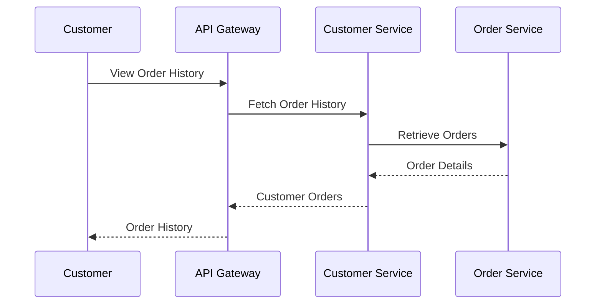

# FRD-003: Customer Management

## 1. Title Page

| Field         | Value                                             |
| ------------- | ------------------------------------------------- |
| Project Name  | Distributed Hub and Sales (DHS) Platform          |
| Document ID   | FRD-003                                           |
| Service Name  | Customer Service                                  |
| Domain        | Customer Administration & Relationship Management |
| Document Type | Functional Requirements Document                  |
| Version       | v1.1.0                                            |
| Author        | Sachin Salunke                                    |
| Status        | Draft                                             |
| Date          | 2026-06-20                                        |

---

# 2. Document Metadata

| Field          | Value                                             |
| -------------- | ------------------------------------------------- |
| Document ID    | FRD-003                                           |
| Domain         | Customer Administration & Relationship Management |
| Document Type  | Functional Requirements Document                  |
| Version        | v1.1.0                                            |
| Author         | Sachin Salunke                                    |
| Status         | Draft                                             |
| Date           | 2026-06-20                                        |
| Linked BRD     | BRD-001                                           |
| Linked PRD     | PRD-001                                           |
| Linked SRS     | SRS-001                                           |
| Linked HLD     | HLD-001                                           |
| Linked RTM     | RTM-001                                           |
| Linked CONTEXT | CONTEXT-001                                       |
| Linked DOMAIN  | DOMAIN-001                                        |
| Linked ADRs    | ADR-001 to ADR-007                                |

---

# 3. Revision History

| Version | Date       | Author         | Description                                                                     |
| ------- | ---------- | -------------- | ------------------------------------------------------------------------------- |
| v1.0.0  | 2026-06-19 | Sachin Salunke | Initial Customer Management functional specification                            |
| v1.1.0  | 2026-06-20 | Sachin Salunke | Updated for Cloud-Native Monorepo-Based Multi-Module Microservices Architecture |

---

# 4. References

| Reference ID | Document                                               |
| ------------ | ------------------------------------------------------ |
| BRD-001      | Business Requirements Document                         |
| PRD-001      | Product Requirements Document                          |
| SRS-001      | Software Requirements Specification                    |
| HLD-001      | High-Level Design                                      |
| RTM-001      | Requirements Traceability Matrix                       |
| CONTEXT-001  | System Context Document                                |
| DOMAIN-001   | Domain Model                                           |
| ADR-001      | Monorepo-Based Multi-Module Microservices Architecture |
| ADR-002      | Database per Service Strategy                          |
| ADR-003      | Hybrid Communication Architecture                      |
| ADR-004      | Service Discovery Architecture                         |
| ADR-005      | API Gateway Strategy                                   |
| ADR-006      | Saga-Based Distributed Transaction Strategy            |
| ADR-007      | Security Architecture                                  |

---

# 5. Sign-Off Table

| Role                 | Name           | Status  |
| -------------------- | -------------- | ------- |
| Product Owner        | Sachin Salunke | Pending |
| Solution Architect   | Sachin Salunke | Pending |
| Technical Lead       | TBD            | Pending |
| Business Stakeholder | TBD            | Pending |

---

# 6. Functional Overview

The Customer Service provides centralized customer lifecycle management capabilities for the DHS Platform.

Responsibilities:

- Customer Registration
- Customer Profile Management
- Customer Address Management
- Customer Contact Management
- Customer Classification
- Customer Search
- Customer Status Management
- Customer Branch Association
- Customer Order Visibility
- Customer Audit Logging

The service acts as the primary business entity driving:

- Orders
- Billing
- Dispatch
- Notifications
- Reporting
- Analytics

---

## Implementation Characteristics

- Cloud-Native Architecture
- Monorepo-Based Multi-Module Maven Structure
- Independently Deployable Microservice
- Database per Service
- API Gateway Integration
- Service Discovery Integration
- REST APIs and OpenFeign Communication
- Event-Driven Architecture
- Kafka Integration
- JWT Authentication and RBAC Authorization
- Distributed Tracing and Observability

---

# 7. Service Ownership

## Owning Service

```text
customer-service
```

---

## Database

```text
customer-db
```

---

## Platform Dependencies

- API Gateway
- Service Discovery
- Kafka
- Redis
- Observability Platform

---

## Service Dependencies

### Synchronous Dependencies

- branch-service
- order-service

### Asynchronous Dependencies

- reporting-service
- audit-service
- notification-service

---

# 8. Functional Requirements

---

## FR-CUST-001

### Requirement Name

Register Customer

### Description

The system shall allow authorized users to register customers.

### Priority

Critical

### Actors

- Company Admin
- Branch Manager
- Sales Executive

---

## FR-CUST-002

### Requirement Name

Update Customer

### Description

The system shall allow authorized users to update customer information.

### Priority

Critical

---

## FR-CUST-003

### Requirement Name

Activate Customer

### Description

The system shall allow authorized users to activate customers.

### Priority

Critical

---

## FR-CUST-004

### Requirement Name

Deactivate Customer

### Description

The system shall allow authorized users to deactivate customers.

### Priority

Critical

---

## FR-CUST-005

### Requirement Name

Search Customers

### Description

The system shall provide customer search capabilities.

### Priority

High

---

## FR-CUST-006

### Requirement Name

Manage Customer Addresses

### Description

The system shall support multiple customer addresses.

### Priority

High

---

## FR-CUST-007

### Requirement Name

Manage Customer Contacts

### Description

The system shall support customer contact management.

### Priority

High

---

## FR-CUST-008

### Requirement Name

View Customer Order History

### Description

The system shall provide customer order visibility.

### Priority

High

---

## FR-CUST-009

### Requirement Name

Associate Customer with Branch

### Description

The system shall support customer association with branches.

### Priority

Critical

---

## FR-CUST-010

### Requirement Name

Audit Customer Activities

### Description

The system shall audit customer activities.

### Priority

High

---

# 9. User Roles

| Role            | Responsibilities                   |
| --------------- | ---------------------------------- |
| Company Admin   | Customer administration            |
| Branch Manager  | Branch customer management         |
| Sales Executive | Customer onboarding and management |
| Customer        | View own profile and order history |

---

# 10. Business Rules

## BR-CUST-001

Every customer shall have a unique customer code.

---

## BR-CUST-002

Every customer shall belong to at least one branch.

---

## BR-CUST-003

A customer may have multiple addresses.

---

## BR-CUST-004

A customer may have multiple contact persons.

---

## BR-CUST-005

Only active customers can place order requests.

---

## BR-CUST-006

Customer deactivation shall preserve historical transactions.

---

## BR-CUST-007

Customers cannot access information belonging to other customers.

---

## BR-CUST-008

Every customer activity shall be audited.

---

## BR-CUST-009

Cross-service interactions shall occur through published APIs and domain events.

---

## BR-CUST-010

Customer data ownership belongs exclusively to Customer Service.

---

# 11. Functional Workflows

## Customer Registration Workflow



---

## Customer Address Workflow



---

## Customer Deactivation Workflow



---

# 12. Functional Flow

## Customer Registration Flow



---

## Customer Search Flow



---

## Customer Order Visibility Flow



---

# 13. Service Communication

## Synchronous Communication

Technologies:

- REST APIs
- OpenFeign
- Service Discovery

Used For:

- Branch Validation
- Branch Lookup
- Customer Lookup
- Customer Search
- Customer Order Visibility

---

## Asynchronous Communication

Technologies:

- Apache Kafka
- Domain Events
- Consumer Groups
- Dead Letter Topics

Used For:

- Customer Lifecycle Events
- Reporting Events
- Audit Events
- Notification Events
- Analytics Events

# 14. Published Events

## Customer Lifecycle Events

```text
CustomerCreated
CustomerUpdated
CustomerActivated
CustomerDeactivated
CustomerProfileUpdated
```

---

## Customer Address Events

```text
CustomerAddressAdded
CustomerAddressUpdated
CustomerAddressRemoved
```

---

## Customer Contact Events

```text
CustomerContactAdded
CustomerContactUpdated
CustomerContactRemoved
```

---

## Customer Branch Events

```text
CustomerBranchAssigned
CustomerBranchRemoved
```

---

# 15. Consumed Events

## Branch Events

```text
BranchCreated
BranchUpdated
BranchActivated
BranchDeactivated
```

---

## Order Events

```text
OrderCreated
OrderCancelled
OrderCompleted
```

---

## Notification Events

```text
NotificationSent
NotificationFailed
```

---

## Audit Events

```text
AuditRecorded
```

---

# 16. APIs

## Customer APIs

```text
POST   /api/v1/customers
PUT    /api/v1/customers/{id}
GET    /api/v1/customers/{id}
GET    /api/v1/customers
PATCH  /api/v1/customers/{id}/activate
PATCH  /api/v1/customers/{id}/deactivate
```

---

## Customer Address APIs

```text
POST   /api/v1/customers/{id}/addresses
PUT    /api/v1/customers/{id}/addresses/{addressId}
DELETE /api/v1/customers/{id}/addresses/{addressId}
GET    /api/v1/customers/{id}/addresses
```

---

## Customer Contact APIs

```text
POST   /api/v1/customers/{id}/contacts
PUT    /api/v1/customers/{id}/contacts/{contactId}
DELETE /api/v1/customers/{id}/contacts/{contactId}
GET    /api/v1/customers/{id}/contacts
```

---

## Customer Branch APIs

```text
POST /api/v1/customers/{id}/branches
GET  /api/v1/customers/{id}/branches
```

---

## Order Visibility APIs

```text
GET /api/v1/customers/{id}/orders
GET /api/v1/customers/{id}/orders/{orderId}
```

---

# 17. Screen Requirements

## Customer Registration Screen

Fields:

- Customer Code
- Customer Name
- Customer Type
- Email
- Mobile Number
- GST Number
- Branch
- Status

Actions:

- Create
- Update
- Activate
- Deactivate
- Search

---

## Customer Address Screen

Fields:

- Address Type
- Address Line 1
- Address Line 2
- City
- State
- Country
- Postal Code

Actions:

- Add
- Update
- Remove

---

## Customer Contact Screen

Fields:

- Contact Person Name
- Designation
- Email
- Mobile Number

Actions:

- Add
- Update
- Remove

---

## Customer Order History Screen

Fields:

- Order Number
- Order Date
- Status
- Invoice Number
- Shipment Number

Actions:

- View Details
- Search
- Filter

---

# 18. Field Validations

## Customer Code

- Required
- Unique
- Maximum 20 characters
- Uppercase only

---

## Customer Name

- Required
- Maximum 150 characters

---

## Email

- Optional
- Valid email format

---

## Mobile Number

- Required
- Numeric
- Maximum 15 digits

---

## GST Number

- Optional
- Valid GST format

---

# 19. Exception Scenarios

## Duplicate Customer Code

Response:

```text
Customer code already exists.
```

---

## Customer Not Found

Response:

```text
Customer does not exist.
```

---

## Invalid Branch

Response:

```text
Selected branch does not exist.
```

---

## Customer Inactive

Response:

```text
Customer account is inactive.
```

---

## Unauthorized Access

Response:

```text
Access denied.
```

---

# 20. Audit Requirements

Audit Events:

```text
CUSTOMER_CREATED
CUSTOMER_UPDATED
CUSTOMER_ACTIVATED
CUSTOMER_DEACTIVATED
CUSTOMER_ADDRESS_ADDED
CUSTOMER_ADDRESS_UPDATED
CUSTOMER_ADDRESS_REMOVED
CUSTOMER_CONTACT_ADDED
CUSTOMER_CONTACT_UPDATED
CUSTOMER_CONTACT_REMOVED
CUSTOMER_BRANCH_ASSIGNED
CUSTOMER_BRANCH_REMOVED
CUSTOMER_PROFILE_VIEWED
CUSTOMER_SEARCHED
```

---

# 21. Notifications

System notifications:

- Customer Registration Completed
- Customer Activation Completed
- Customer Deactivation Completed
- Customer Profile Updated
- Customer Branch Assignment Completed

---

# 22. Reporting Requirements

Reports:

- Customer List Report
- Active Customer Report
- Inactive Customer Report
- Customer by Branch Report
- Customer Order History Report
- Customer Activity Report
- Customer Audit Report

---

# 23. High-Level Data Entities

## Customer

```text
Customer
├── CustomerId
├── CustomerCode
├── CustomerName
├── CustomerType
├── Email
├── MobileNumber
├── GSTNumber
├── Status
├── CreatedAt
└── UpdatedAt
```

---

## Customer Address

```text
CustomerAddress
├── AddressId
├── CustomerId
├── AddressType
├── AddressLine1
├── AddressLine2
├── City
├── State
├── Country
└── PostalCode
```

---

## Customer Contact

```text
CustomerContact
├── ContactId
├── CustomerId
├── Name
├── Designation
├── Email
├── MobileNumber
└── Status
```

---

## Customer Branch Association

```text
CustomerBranch
├── CustomerId
├── BranchId
├── AssignedAt
└── Status
```

---

## Data Ownership

Customer Service exclusively owns:

- Customer
- CustomerAddress
- CustomerContact
- CustomerBranch

---

# 24. Non-Functional Requirements

- JWT Authentication
- RBAC Authorization
- TLS 1.3
- API Gateway Integration
- Service Discovery
- Distributed Tracing
- Correlation IDs
- Structured Logging
- Horizontal Scalability
- High Availability
- Retry Policies
- Circuit Breakers
- Event Idempotency
- Audit Logging
- Database per Service
- Independent Deployments
- Observability Integration

---

# 25. Success Criteria

- Customers can be registered successfully.
- Customer codes remain unique.
- Customers can be associated with branches.
- Customer addresses and contacts are maintained.
- Customers can view their own order history.
- Inactive customers cannot initiate new order requests.
- Customer activities are fully audited.
- Customer reports are available.
- Customer Service registers successfully with Service Discovery.
- Customer APIs are accessible through API Gateway.
- Customer events are published successfully to Kafka.
- Branch validation works through Branch Service APIs.
- Distributed tracing is available for customer workflows.
- Customer Service remains independently deployable.

---

# 26. Traceability

| BR     | FR          |
| ------ | ----------- |
| BR-003 | FR-CUST-001 |
| BR-003 | FR-CUST-002 |
| BR-003 | FR-CUST-003 |
| BR-003 | FR-CUST-004 |
| BR-003 | FR-CUST-005 |
| BR-003 | FR-CUST-006 |
| BR-003 | FR-CUST-007 |
| BR-003 | FR-CUST-008 |
| BR-003 | FR-CUST-009 |
| BR-011 | FR-CUST-010 |

---
