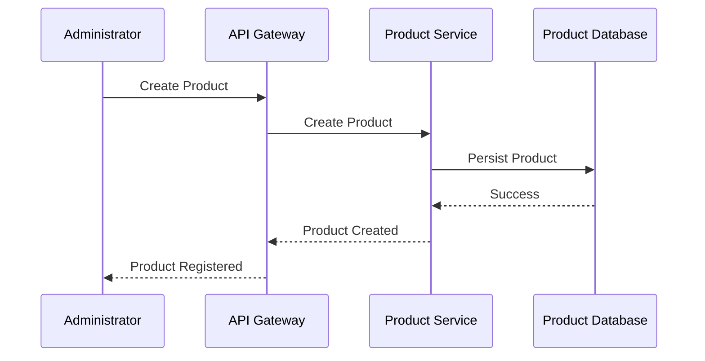
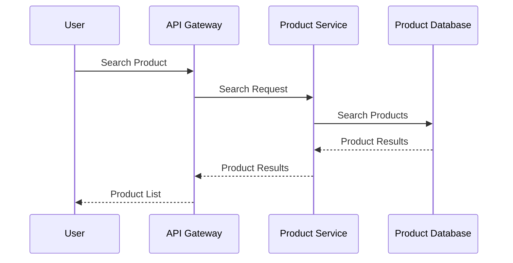
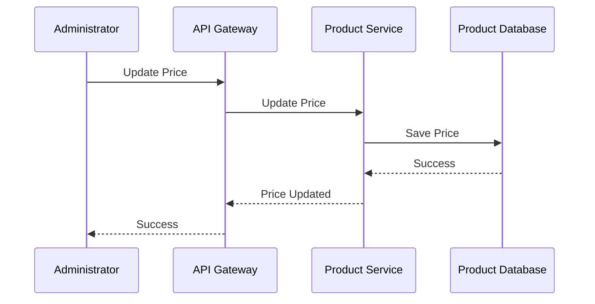

# FRD-004: Product Catalog Management

## 1. Title Page

| Field         | Value                                    |
| ------------- | ---------------------------------------- |
| Project Name  | Distributed Hub and Sales (DHS) Platform |
| Document ID   | FRD-004                                  |
| Service Name  | Product Service                          |
| Domain        | Product Catalog Management               |
| Document Type | Functional Requirements Document         |
| Version       | v1.1.0                                   |
| Author        | Sachin Salunke                           |
| Status        | Draft                                    |
| Date          | 2026-06-20                               |

---

# 2. Document Metadata

| Field          | Value                            |
| -------------- | -------------------------------- |
| Document ID    | FRD-004                          |
| Domain         | Product Catalog Management       |
| Document Type  | Functional Requirements Document |
| Version        | v1.1.0                           |
| Author         | Sachin Salunke                   |
| Status         | Draft                            |
| Date           | 2026-06-20                       |
| Linked BRD     | BRD-001                          |
| Linked PRD     | PRD-001                          |
| Linked SRS     | SRS-001                          |
| Linked HLD     | HLD-001                          |
| Linked RTM     | RTM-001                          |
| Linked CONTEXT | CONTEXT-001                      |
| Linked DOMAIN  | DOMAIN-001                       |
| Linked ADRs    | ADR-001 to ADR-007               |

---

# 3. Revision History

| Version | Date       | Author         | Description                                                                     |
| ------- | ---------- | -------------- | ------------------------------------------------------------------------------- |
| v1.0.0  | 2026-06-19 | Sachin Salunke | Initial Product Catalog Management functional specification                     |
| v1.1.0  | 2026-06-20 | Sachin Salunke | Updated for Cloud-Native Monorepo-Based Multi-Module Microservices Architecture |

---

# 4. References

| Reference ID | Document                                               |
| ------------ | ------------------------------------------------------ |
| BRD-001      | Business Requirements Document                         |
| PRD-001      | Product Requirements Document                          |
| SRS-001      | Software Requirements Specification                    |
| HLD-001      | High-Level Design                                      |
| RTM-001      | Requirements Traceability Matrix                       |
| CONTEXT-001  | System Context Document                                |
| DOMAIN-001   | Domain Model                                           |
| ADR-001      | Monorepo-Based Multi-Module Microservices Architecture |
| ADR-002      | Database per Service Strategy                          |
| ADR-003      | Hybrid Communication Architecture                      |
| ADR-004      | Service Discovery Architecture                         |
| ADR-005      | API Gateway Strategy                                   |
| ADR-006      | Saga-Based Distributed Transaction Strategy            |
| ADR-007      | Security Architecture                                  |

---

# 5. Sign-Off Table

| Role                 | Name           | Status  |
| -------------------- | -------------- | ------- |
| Product Owner        | Sachin Salunke | Pending |
| Solution Architect   | Sachin Salunke | Pending |
| Technical Lead       | TBD            | Pending |
| Business Stakeholder | TBD            | Pending |

---

# 6. Functional Overview

The Product Service provides centralized product catalog management capabilities for the DHS Platform.

Responsibilities:

- Product Management
- Product Categorization
- Product Pricing Management
- Product Attribute Management
- Product Barcode Management
- Product Search
- Product Activation and Deactivation
- Product Lifecycle Management
- Product Audit Logging

The Product Service acts as the master source of product information for:

- Inventory Management
- Order Management
- Billing
- Dispatch
- Reporting
- Analytics

---

## Implementation Characteristics

- Cloud-Native Architecture
- Monorepo-Based Multi-Module Maven Structure
- Independently Deployable Microservice
- Database per Service
- API Gateway Integration
- Service Discovery Integration
- REST APIs and OpenFeign Communication
- Event-Driven Architecture
- Kafka Integration
- JWT Authentication and RBAC Authorization
- Distributed Tracing and Observability

---

# 7. Service Ownership

## Owning Service

```text
product-service
```

---

## Database

```text
product-db
```

---

## Platform Dependencies

- API Gateway
- Service Discovery
- Kafka
- Redis
- Observability Platform

---

## Service Dependencies

### Synchronous Dependencies

- inventory-service
- order-service

### Asynchronous Dependencies

- reporting-service
- audit-service
- notification-service

---

# 8. Functional Requirements

## FR-PROD-001

### Requirement Name

Create Product

### Description

The system shall allow authorized users to create products.

### Priority

Critical

### Actors

- Company Admin
- Product Administrator

---

## FR-PROD-002

### Requirement Name

Update Product

### Description

The system shall allow authorized users to update product information.

### Priority

Critical

---

## FR-PROD-003

### Requirement Name

Activate Product

### Description

The system shall allow authorized users to activate products.

### Priority

Critical

---

## FR-PROD-004

### Requirement Name

Deactivate Product

### Description

The system shall allow authorized users to deactivate products.

### Priority

Critical

---

## FR-PROD-005

### Requirement Name

Search Products

### Description

The system shall provide product search capabilities.

### Priority

High

---

## FR-PROD-006

### Requirement Name

Manage Product Categories

### Description

The system shall support product category management.

### Priority

High

---

## FR-PROD-007

### Requirement Name

Manage Product Pricing

### Description

The system shall support product pricing management.

### Priority

Critical

---

## FR-PROD-008

### Requirement Name

Manage Product Attributes

### Description

The system shall support product attribute management.

### Priority

High

---

## FR-PROD-009

### Requirement Name

Manage Product Barcodes

### Description

The system shall support barcode management.

### Priority

High

---

## FR-PROD-010

### Requirement Name

Audit Product Activities

### Description

The system shall audit product activities.

### Priority

High

---

# 9. User Roles

| Role                  | Responsibilities             |
| --------------------- | ---------------------------- |
| Company Admin         | Product administration       |
| Product Administrator | Product lifecycle management |
| Inventory Operator    | Product lookup               |
| Sales Executive       | Product search               |
| Billing Executive     | Product lookup               |

---

# 10. Business Rules

## BR-PROD-001

Every product shall have a unique product code.

---

## BR-PROD-002

Every product shall belong to at least one category.

---

## BR-PROD-003

Every product shall have at least one price.

---

## BR-PROD-004

Inactive products cannot participate in business transactions.

---

## BR-PROD-005

Products referenced by inventory records cannot be physically deleted.

---

## BR-PROD-006

Every product activity shall be audited.

---

## BR-PROD-007

Product data ownership belongs exclusively to Product Service.

---

## BR-PROD-008

Cross-service interactions shall occur through published APIs and domain events.

---

# 11. Functional Workflows

## Product Creation Workflow


---

## Product Pricing Workflow


---

## Product Deactivation Workflow


---

# 12. Functional Flow

## Product Creation Flow



---

## Product Search Flow



---

## Product Pricing Flow



---

# 13. Service Communication

## Synchronous Communication

Technologies:

- REST APIs
- OpenFeign
- Service Discovery

Used For:

- Product Lookup
- Product Search
- Product Validation
- Product Pricing Retrieval

---

## Asynchronous Communication

Technologies:

- Apache Kafka
- Domain Events
- Consumer Groups
- Dead Letter Topics

Used For:

- Product Lifecycle Events
- Reporting Events
- Audit Events
- Analytics Events

# 14. Published Events

## Product Lifecycle Events

```text
ProductCreated
ProductUpdated
ProductActivated
ProductDeactivated
ProductDeleted
```

---

## Product Category Events

```text
ProductCategoryAssigned
ProductCategoryUpdated
ProductCategoryRemoved
```

---

## Product Pricing Events

```text
ProductPriceCreated
ProductPriceUpdated
ProductPriceActivated
ProductPriceExpired
```

---

## Product Attribute Events

```text
ProductAttributeAdded
ProductAttributeUpdated
ProductAttributeRemoved
```

---

## Product Barcode Events

```text
ProductBarcodeAssigned
ProductBarcodeUpdated
ProductBarcodeRemoved
```

---

# 15. Consumed Events

## Inventory Events

```text
InventoryCreated
InventoryUpdated
StockAdjusted
```

---

## Order Events

```text
OrderCreated
OrderCancelled
```

---

## Audit Events

```text
AuditRecorded
```

---

# 16. APIs

## Product APIs

```text
POST   /api/v1/products
PUT    /api/v1/products/{id}
GET    /api/v1/products/{id}
GET    /api/v1/products
PATCH  /api/v1/products/{id}/activate
PATCH  /api/v1/products/{id}/deactivate
DELETE /api/v1/products/{id}
```

---

## Product Category APIs

```text
POST   /api/v1/categories
PUT    /api/v1/categories/{id}
GET    /api/v1/categories
GET    /api/v1/categories/{id}
DELETE /api/v1/categories/{id}
```

---

## Product Pricing APIs

```text
POST   /api/v1/products/{id}/prices
PUT    /api/v1/products/{id}/prices/{priceId}
GET    /api/v1/products/{id}/prices
```

---

## Product Attribute APIs

```text
POST   /api/v1/products/{id}/attributes
PUT    /api/v1/products/{id}/attributes/{attributeId}
DELETE /api/v1/products/{id}/attributes/{attributeId}
GET    /api/v1/products/{id}/attributes
```

---

## Product Barcode APIs

```text
POST   /api/v1/products/{id}/barcodes
PUT    /api/v1/products/{id}/barcodes/{barcodeId}
DELETE /api/v1/products/{id}/barcodes/{barcodeId}
GET    /api/v1/products/{id}/barcodes
```

---

# 17. Screen Requirements

## Product Management Screen

Fields:

- Product Code
- Product Name
- Description
- Category
- Status
- Barcode
- Base Price

Actions:

- Create
- Update
- Activate
- Deactivate
- Search
- View

---

## Category Management Screen

Fields:

- Category Code
- Category Name
- Description
- Status

Actions:

- Create
- Update
- Delete
- Search

---

## Pricing Management Screen

Fields:

- Product
- Price Type
- Amount
- Effective Date
- Expiry Date
- Status

Actions:

- Add
- Update
- Activate
- Deactivate

---

## Product Attribute Screen

Fields:

- Attribute Name
- Attribute Value
- Status

Actions:

- Add
- Update
- Remove

---

# 18. Field Validations

## Product Code

- Required
- Unique
- Maximum 50 characters
- Uppercase only

---

## Product Name

- Required
- Maximum 200 characters

---

## Barcode

- Optional
- Unique
- Maximum 50 characters

---

## Price

- Required
- Greater than zero

---

## Category Name

- Required
- Maximum 100 characters

---

# 19. Exception Scenarios

## Duplicate Product Code

Response:

```text
Product code already exists.
```

---

## Product Not Found

Response:

```text
Product does not exist.
```

---

## Invalid Category

Response:

```text
Selected category does not exist.
```

---

## Product Inactive

Response:

```text
Product is inactive.
```

---

## Product Referenced by Inventory

Response:

```text
Product cannot be deleted because inventory records exist.
```

---

## Unauthorized Access

Response:

```text
Access denied.
```

---

# 20. Audit Requirements

Audit Events:

```text
PRODUCT_CREATED
PRODUCT_UPDATED
PRODUCT_ACTIVATED
PRODUCT_DEACTIVATED
PRODUCT_DELETED
PRODUCT_SEARCHED
PRODUCT_VIEWED
PRODUCT_CATEGORY_ASSIGNED
PRODUCT_CATEGORY_UPDATED
PRODUCT_PRICE_CREATED
PRODUCT_PRICE_UPDATED
PRODUCT_ATTRIBUTE_ADDED
PRODUCT_ATTRIBUTE_UPDATED
PRODUCT_BARCODE_ASSIGNED
PRODUCT_BARCODE_UPDATED
```

---

# 21. Notifications

System Notifications:

- Product Created
- Product Updated
- Product Activated
- Product Deactivated
- Product Price Updated
- Product Category Updated

---

# 22. Reporting Requirements

Reports:

- Product Catalog Report
- Active Product Report
- Inactive Product Report
- Product Category Report
- Product Price Report
- Product Barcode Report
- Product Audit Report

---

# 23. High-Level Data Entities

## Product

```text
Product
├── ProductId
├── ProductCode
├── ProductName
├── Description
├── Status
├── CreatedAt
└── UpdatedAt
```

---

## Product Category

```text
ProductCategory
├── CategoryId
├── CategoryCode
├── CategoryName
├── Description
└── Status
```

---

## Product Price

```text
ProductPrice
├── PriceId
├── ProductId
├── PriceType
├── Amount
├── EffectiveDate
├── ExpiryDate
└── Status
```

---

## Product Attribute

```text
ProductAttribute
├── AttributeId
├── ProductId
├── Name
├── Value
└── Status
```

---

## Product Barcode

```text
ProductBarcode
├── BarcodeId
├── ProductId
├── Barcode
└── Status
```

---

## Data Ownership

Product Service exclusively owns:

- Product
- ProductCategory
- ProductPrice
- ProductAttribute
- ProductBarcode

---

# 24. Non-Functional Requirements

- JWT Authentication
- RBAC Authorization
- TLS 1.3
- API Gateway Integration
- Service Discovery
- Distributed Tracing
- Correlation IDs
- Structured Logging
- Horizontal Scalability
- High Availability
- Retry Policies
- Circuit Breakers
- Event Idempotency
- Audit Logging
- Database per Service
- Independent Deployments
- Observability Integration

---

# 25. Success Criteria

- Products can be created successfully.
- Product codes remain unique.
- Products can be categorized correctly.
- Product prices can be managed.
- Product attributes can be maintained.
- Product barcodes can be managed.
- Product activities are fully audited.
- Product reports are available.
- Product Service registers successfully with Service Discovery.
- Product APIs are accessible through API Gateway.
- Product events are published successfully to Kafka.
- Distributed tracing is available for product workflows.
- Product Service remains independently deployable.

---

# 26. Traceability

| BR     | FR          |
| ------ | ----------- |
| BR-004 | FR-PROD-001 |
| BR-004 | FR-PROD-002 |
| BR-004 | FR-PROD-003 |
| BR-004 | FR-PROD-004 |
| BR-004 | FR-PROD-005 |
| BR-004 | FR-PROD-006 |
| BR-004 | FR-PROD-007 |
| BR-004 | FR-PROD-008 |
| BR-004 | FR-PROD-009 |
| BR-011 | FR-PROD-010 |

---
