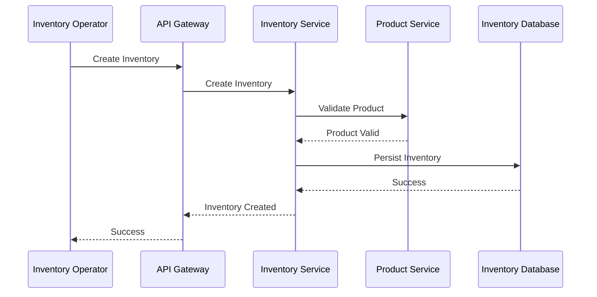
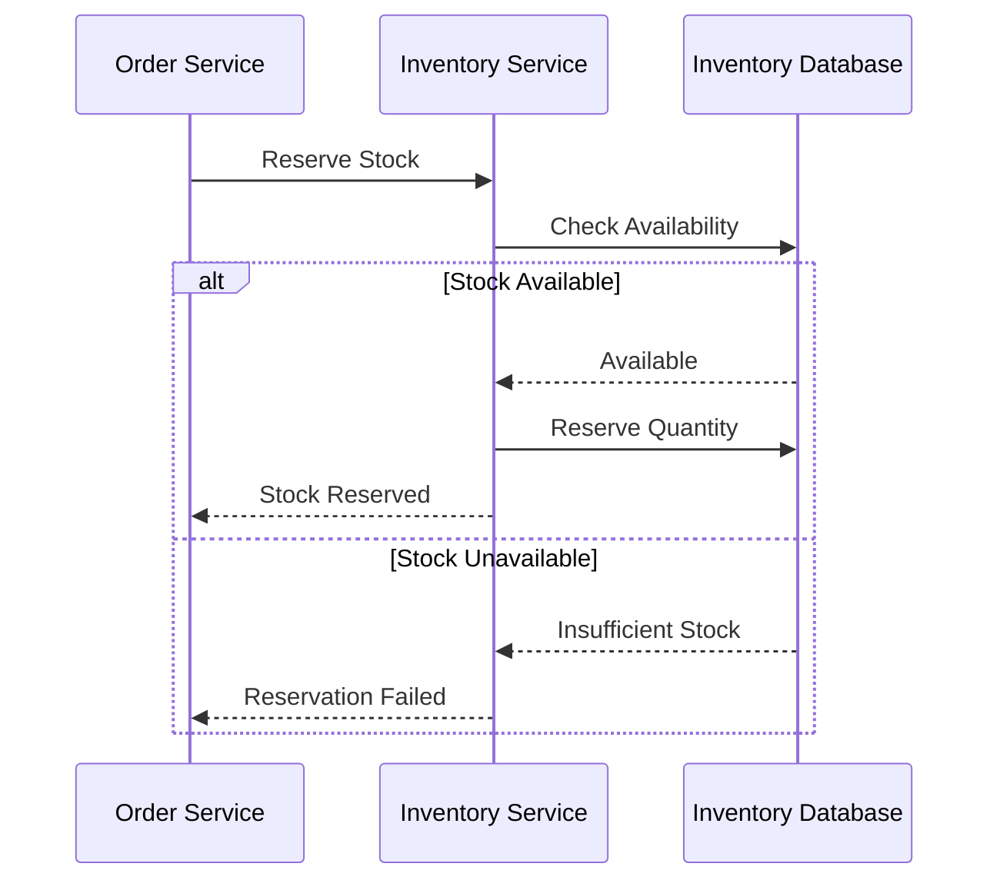
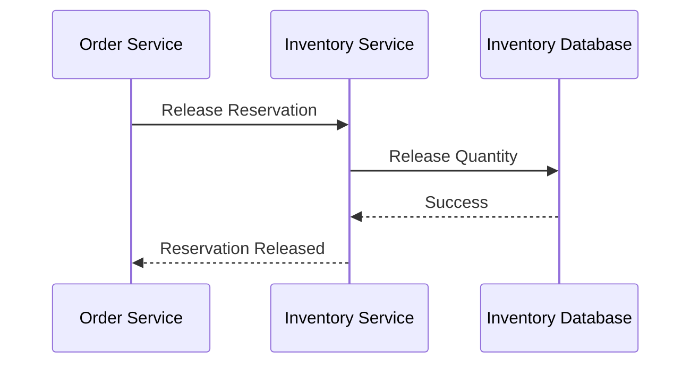

# FRD-005: Inventory Management

## 1. Title Page

| Field         | Value                                    |
| ------------- | ---------------------------------------- |
| Project Name  | Distributed Hub and Sales (DHS) Platform |
| Document ID   | FRD-005                                  |
| Service Name  | Inventory Service                        |
| Domain        | Inventory Management                     |
| Document Type | Functional Requirements Document         |
| Version       | v1.1.0                                   |
| Author        | Sachin Salunke                           |
| Status        | Draft                                    |
| Date          | 2026-06-20                               |

---

# 2. Document Metadata

| Field          | Value                            |
| -------------- | -------------------------------- |
| Document ID    | FRD-005                          |
| Domain         | Inventory Management             |
| Document Type  | Functional Requirements Document |
| Version        | v1.1.0                           |
| Author         | Sachin Salunke                   |
| Status         | Draft                            |
| Date           | 2026-06-20                       |
| Linked BRD     | BRD-001                          |
| Linked PRD     | PRD-001                          |
| Linked SRS     | SRS-001                          |
| Linked HLD     | HLD-001                          |
| Linked RTM     | RTM-001                          |
| Linked CONTEXT | CONTEXT-001                      |
| Linked DOMAIN  | DOMAIN-001                       |
| Linked ADRs    | ADR-001 to ADR-007               |

---

# 3. Revision History

| Version | Date       | Author         | Description                                                                     |
| ------- | ---------- | -------------- | ------------------------------------------------------------------------------- |
| v1.0.0  | 2026-06-19 | Sachin Salunke | Initial Inventory Management functional specification                           |
| v1.1.0  | 2026-06-20 | Sachin Salunke | Updated for Cloud-Native Monorepo-Based Multi-Module Microservices Architecture |

---

# 4. References

| Reference ID | Document                                               |
| ------------ | ------------------------------------------------------ |
| BRD-001      | Business Requirements Document                         |
| PRD-001      | Product Requirements Document                          |
| SRS-001      | Software Requirements Specification                    |
| HLD-001      | High-Level Design                                      |
| RTM-001      | Requirements Traceability Matrix                       |
| CONTEXT-001  | System Context Document                                |
| DOMAIN-001   | Domain Model                                           |
| ADR-001      | Monorepo-Based Multi-Module Microservices Architecture |
| ADR-002      | Database per Service Strategy                          |
| ADR-003      | Hybrid Communication Architecture                      |
| ADR-004      | Service Discovery Architecture                         |
| ADR-005      | API Gateway Strategy                                   |
| ADR-006      | Saga-Based Distributed Transaction Strategy            |
| ADR-007      | Security Architecture                                  |

---

# 5. Sign-Off Table

| Role                 | Name           | Status  |
| -------------------- | -------------- | ------- |
| Product Owner        | Sachin Salunke | Pending |
| Solution Architect   | Sachin Salunke | Pending |
| Technical Lead       | TBD            | Pending |
| Business Stakeholder | TBD            | Pending |

---

# 6. Functional Overview

The Inventory Service provides centralized inventory management capabilities for the DHS Platform.

Responsibilities:

* Inventory Creation
* Stock Management
* Stock Reservation
* Stock Release
* Stock Adjustment
* Stock Transfers
* Barcode Management
* Inventory Search
* Inventory Visibility
* Inventory Audit Logging

The service acts as the system of record for product stock availability and fulfillment operations.

The Inventory Service supports:

* Product Availability
* Order Processing
* Billing
* Dispatch
* Reporting
* Analytics

---

## Implementation Characteristics

* Cloud-Native Architecture
* Monorepo-Based Multi-Module Maven Structure
* Independently Deployable Microservice
* Database per Service
* API Gateway Integration
* Service Discovery Integration
* REST APIs and OpenFeign Communication
* Event-Driven Architecture
* Kafka Integration
* Saga Participation
* JWT Authentication and RBAC Authorization
* Distributed Tracing and Observability

---

# 7. Service Ownership

## Owning Service

```text id="dyvr4a"
inventory-service
```

---

## Database

```text id="lkikgb"
inventory-db
```

---

## Platform Dependencies

* API Gateway
* Service Discovery
* Kafka
* Redis
* Observability Platform

---

## Service Dependencies

### Synchronous Dependencies

* product-service
* branch-service
* order-service

### Asynchronous Dependencies

* billing-service
* dispatch-service
* reporting-service
* audit-service

---

# 8. Functional Requirements

## FR-INV-001

### Requirement Name

Create Inventory

### Description

The system shall allow authorized users to create inventory records.

### Priority

Critical

---

## FR-INV-002

### Requirement Name

Update Inventory

### Description

The system shall allow authorized users to update inventory information.

### Priority

Critical

---

## FR-INV-003

### Requirement Name

Reserve Stock

### Description

The system shall reserve stock quantities during order processing.

### Priority

Critical

---

## FR-INV-004

### Requirement Name

Release Reserved Stock

### Description

The system shall release reserved stock during order cancellation or transaction compensation.

### Priority

Critical

---

## FR-INV-005

### Requirement Name

Adjust Stock

### Description

The system shall support stock adjustments.

### Priority

High

---

## FR-INV-006

### Requirement Name

Transfer Stock

### Description

The system shall support inventory transfers between branches.

### Priority

High

---

## FR-INV-007

### Requirement Name

Search Inventory

### Description

The system shall provide inventory search capabilities.

### Priority

High

---

## FR-INV-008

### Requirement Name

Barcode Operations

### Description

The system shall support barcode generation and scanning operations.

### Priority

High

---

## FR-INV-009

### Requirement Name

Inventory Visibility

### Description

The system shall provide real-time inventory visibility.

### Priority

High

---

## FR-INV-010

### Requirement Name

Audit Inventory Activities

### Description

The system shall audit inventory activities.

### Priority

High

---

# 9. User Roles

| Role               | Responsibilities            |
| ------------------ | --------------------------- |
| Company Admin      | Inventory administration    |
| Hub Manager        | Inventory oversight         |
| Branch Manager     | Branch inventory management |
| Inventory Operator | Inventory operations        |
| Sales Executive    | Inventory lookup            |

---

# 10. Business Rules

## BR-INV-001

Every inventory record shall reference an active product.

---

## BR-INV-002

Inventory quantities shall never become negative.

---

## BR-INV-003

Reserved stock shall not be available for new reservations.

---

## BR-INV-004

Inventory adjustments shall be auditable.

---

## BR-INV-005

Stock releases shall occur during transaction compensation.

---

## BR-INV-006

Inventory transfers shall maintain quantity consistency.

---

## BR-INV-007

Inventory data ownership belongs exclusively to Inventory Service.

---

## BR-INV-008

Cross-service interactions shall occur through published APIs and domain events.

---

# 11. Functional Workflows

## Inventory Creation Workflow


---

## Stock Reservation Workflow


---

## Stock Adjustment Workflow


---

## Stock Transfer Workflow


---

# 12. Functional Flow

## Inventory Creation Flow



---

## Stock Reservation Flow



---

## Stock Release Flow



---

# 13. Service Communication

## Synchronous Communication

Technologies:

* REST APIs
* OpenFeign
* Service Discovery

Used For:

* Product Validation
* Inventory Lookup
* Stock Availability
* Inventory Search
* Branch Validation

---

## Asynchronous Communication

Technologies:

* Apache Kafka
* Domain Events
* Consumer Groups
* Dead Letter Topics

Used For:

* Stock Reservation Events
* Inventory Adjustment Events
* Inventory Transfer Events
* Reporting Events
* Audit Events
* Saga Coordination

# 14. Published Events

## Inventory Lifecycle Events

```text id="6bixb7"
InventoryCreated
InventoryUpdated
InventoryActivated
InventoryDeactivated
```

---

## Stock Reservation Events

```text id="sdw5ev"
StockReserved
StockReleased
ReservationFailed
ReservationExpired
```

---

## Stock Adjustment Events

```text id="g31mjm"
StockAdjusted
StockIncreased
StockDecreased
```

---

## Stock Transfer Events

```text id="3gcgrf"
StockTransferInitiated
StockTransferCompleted
StockTransferFailed
```

---

## Barcode Events

```text id="lwh76t"
BarcodeGenerated
BarcodeUpdated
BarcodeScanned
```

---

# 15. Consumed Events

## Product Events

```text id="g7rpxv"
ProductCreated
ProductUpdated
ProductActivated
ProductDeactivated
```

---

## Order Events

```text id="53qeh1"
OrderCreated
OrderCancelled
BackOrderCreated
OrderCompleted
```

---

## Billing Events

```text id="u0tnh9"
InvoiceGenerated
PartialInvoiceGenerated
InvoiceCancelled
```

---

## Audit Events

```text id="ecr5is"
AuditRecorded
```

---

# 16. APIs

## Inventory APIs

```text id="khqel5"
POST   /api/v1/inventories
PUT    /api/v1/inventories/{id}
GET    /api/v1/inventories/{id}
GET    /api/v1/inventories
PATCH  /api/v1/inventories/{id}/activate
PATCH  /api/v1/inventories/{id}/deactivate
```

---

## Stock Reservation APIs

```text id="5zklyq"
POST /api/v1/inventories/reservations
POST /api/v1/inventories/reservations/release
GET  /api/v1/inventories/reservations/{id}
```

---

## Stock Adjustment APIs

```text id="t0tovm"
POST /api/v1/inventories/adjustments
GET  /api/v1/inventories/adjustments
GET  /api/v1/inventories/adjustments/{id}
```

---

## Stock Transfer APIs

```text id="u3v8w5"
POST /api/v1/inventories/transfers
GET  /api/v1/inventories/transfers
GET  /api/v1/inventories/transfers/{id}
```

---

## Barcode APIs

```text id="6lpkho"
POST /api/v1/inventories/barcodes
GET  /api/v1/inventories/barcodes/{barcode}
POST /api/v1/inventories/barcodes/scan
```

---

# 17. Screen Requirements

## Inventory Management Screen

Fields:

* Product
* Branch
* Available Quantity
* Reserved Quantity
* Status

Actions:

* Create
* Update
* Search
* View

---

## Stock Reservation Screen

Fields:

* Product
* Requested Quantity
* Available Quantity
* Reserved Quantity

Actions:

* Reserve
* Release
* View

---

## Stock Adjustment Screen

Fields:

* Product
* Branch
* Adjustment Type
* Quantity
* Reason

Actions:

* Adjust
* Search
* View

---

## Stock Transfer Screen

Fields:

* Product
* Source Branch
* Destination Branch
* Quantity
* Transfer Status

Actions:

* Create
* Approve
* Search
* View

---

# 18. Field Validations

## Product

* Required
* Must exist
* Must be active

---

## Branch

* Required
* Must exist
* Must be active

---

## Quantity

* Required
* Numeric
* Greater than zero

---

## Reserved Quantity

* Cannot exceed available quantity

---

## Adjustment Reason

* Required
* Maximum 500 characters

---

# 19. Exception Scenarios

## Inventory Not Found

Response:

```text id="14d3ny"
Inventory does not exist.
```

---

## Product Not Found

Response:

```text id="2pj3lq"
Product does not exist.
```

---

## Branch Not Found

Response:

```text id="9kpd7z"
Branch does not exist.
```

---

## Insufficient Stock

Response:

```text id="um1j9u"
Insufficient inventory available.
```

---

## Invalid Reservation

Response:

```text id="2a7zxh"
Reservation request is invalid.
```

---

## Transfer Failure

Response:

```text id="8s93a6"
Stock transfer could not be completed.
```

---

## Unauthorized Access

Response:

```text id="h1xvfa"
Access denied.
```

---

# 20. Audit Requirements

Audit Events:

```text id="jhj2r0"
INVENTORY_CREATED
INVENTORY_UPDATED
INVENTORY_ACTIVATED
INVENTORY_DEACTIVATED
STOCK_RESERVED
STOCK_RELEASED
STOCK_ADJUSTED
STOCK_TRANSFERRED
BARCODE_GENERATED
BARCODE_SCANNED
INVENTORY_VIEWED
INVENTORY_SEARCHED
```

---

# 21. Notifications

System Notifications:

* Inventory Created
* Stock Reserved
* Reservation Failed
* Stock Released
* Stock Adjusted
* Stock Transfer Completed
* Inventory Threshold Reached

---

# 22. Reporting Requirements

Reports:

* Inventory Report
* Inventory by Branch Report
* Inventory Availability Report
* Stock Reservation Report
* Stock Adjustment Report
* Stock Transfer Report
* Inventory Audit Report

---

# 23. High-Level Data Entities

## Inventory

```text id="cw9s5x"
Inventory
├── InventoryId
├── ProductId
├── BranchId
├── AvailableQuantity
├── ReservedQuantity
├── Status
├── CreatedAt
└── UpdatedAt
```

---

## Reservation

```text id="mw5vdw"
Reservation
├── ReservationId
├── InventoryId
├── OrderId
├── Quantity
├── Status
├── ReservedAt
└── ReleasedAt
```

---

## Stock Adjustment

```text id="xtrj5u"
StockAdjustment
├── AdjustmentId
├── InventoryId
├── AdjustmentType
├── Quantity
├── Reason
├── CreatedAt
└── CreatedBy
```

---

## Stock Transfer

```text id="3v5ggo"
StockTransfer
├── TransferId
├── ProductId
├── SourceBranchId
├── DestinationBranchId
├── Quantity
├── Status
├── CreatedAt
└── CompletedAt
```

---

## Barcode

```text id="4m7xl0"
Barcode
├── BarcodeId
├── InventoryId
├── Barcode
├── Status
└── CreatedAt
```

---

## Data Ownership

Inventory Service exclusively owns:

* Inventory
* Reservation
* StockAdjustment
* StockTransfer
* Barcode

---

# 24. Non-Functional Requirements

* JWT Authentication
* RBAC Authorization
* TLS 1.3
* API Gateway Integration
* Service Discovery
* Distributed Tracing
* Correlation IDs
* Structured Logging
* Horizontal Scalability
* High Availability
* Retry Policies
* Circuit Breakers
* Event Idempotency
* Audit Logging
* Database per Service
* Independent Deployments
* Observability Integration
* Saga Participation Support
* Dead Letter Topic Support

---

# 25. Success Criteria

* Inventory records can be created successfully.
* Products and branches are validated successfully.
* Stock reservations work correctly.
* Stock releases support compensation workflows.
* Inventory adjustments are auditable.
* Inventory transfers maintain quantity consistency.
* Real-time inventory visibility is available.
* Inventory reports are generated successfully.
* Inventory Service registers successfully with Service Discovery.
* Inventory APIs are accessible through API Gateway.
* Inventory events are published successfully to Kafka.
* Distributed tracing is available for inventory workflows.
* Inventory Service participates successfully in Saga workflows.
* Inventory Service remains independently deployable.

---

# 26. Traceability

| BR     | FR         |
| ------ | ---------- |
| BR-005 | FR-INV-001 |
| BR-005 | FR-INV-002 |
| BR-005 | FR-INV-003 |
| BR-005 | FR-INV-004 |
| BR-005 | FR-INV-005 |
| BR-005 | FR-INV-006 |
| BR-005 | FR-INV-007 |
| BR-005 | FR-INV-008 |
| BR-005 | FR-INV-009 |
| BR-011 | FR-INV-010 |

---

