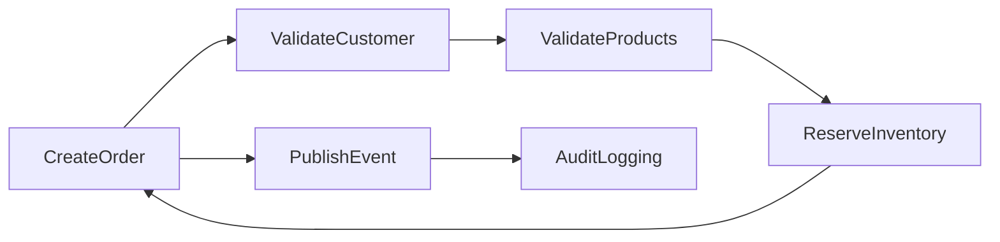
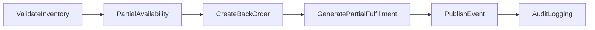
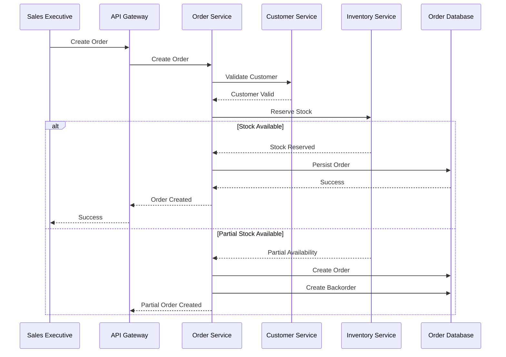
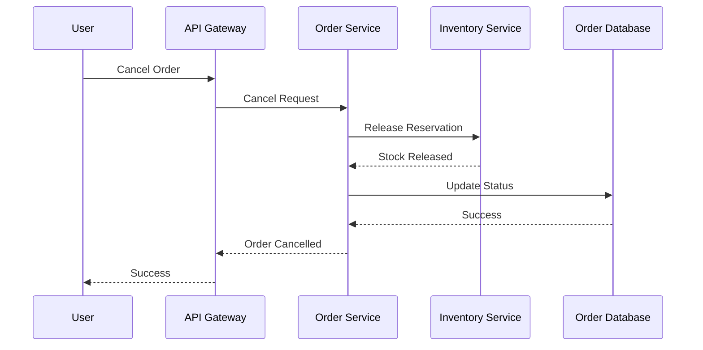
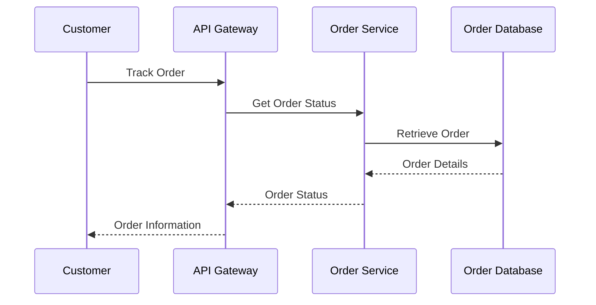

# FRD-006: Order Management

## 1. Title Page

| Field         | Value                                    |
| ------------- | ---------------------------------------- |
| Project Name  | Distributed Hub and Sales (DHS) Platform |
| Document ID   | FRD-006                                  |
| Service Name  | Order Service                            |
| Domain        | Order Management                         |
| Document Type | Functional Requirements Document         |
| Version       | v1.1.0                                   |
| Author        | Sachin Salunke                           |
| Status        | Draft                                    |
| Date          | 2026-06-20                               |

---

# 2. Document Metadata

| Field          | Value                            |
| -------------- | -------------------------------- |
| Document ID    | FRD-006                          |
| Domain         | Order Management                 |
| Document Type  | Functional Requirements Document |
| Version        | v1.1.0                           |
| Author         | Sachin Salunke                   |
| Status         | Draft                            |
| Date           | 2026-06-20                       |
| Linked BRD     | BRD-001                          |
| Linked PRD     | PRD-001                          |
| Linked SRS     | SRS-001                          |
| Linked HLD     | HLD-001                          |
| Linked RTM     | RTM-001                          |
| Linked CONTEXT | CONTEXT-001                      |
| Linked DOMAIN  | DOMAIN-001                       |
| Linked ADRs    | ADR-001 to ADR-007               |

---

# 3. Revision History

| Version | Date       | Author         | Description                                                                     |
| ------- | ---------- | -------------- | ------------------------------------------------------------------------------- |
| v1.0.0  | 2026-06-19 | Sachin Salunke | Initial Order Management functional specification                               |
| v1.1.0  | 2026-06-20 | Sachin Salunke | Updated for Cloud-Native Monorepo-Based Multi-Module Microservices Architecture |

---

# 4. References

| Reference ID | Document                                               |
| ------------ | ------------------------------------------------------ |
| BRD-001      | Business Requirements Document                         |
| PRD-001      | Product Requirements Document                          |
| SRS-001      | Software Requirements Specification                    |
| HLD-001      | High-Level Design                                      |
| RTM-001      | Requirements Traceability Matrix                       |
| CONTEXT-001  | System Context Document                                |
| DOMAIN-001   | Domain Model                                           |
| ADR-001      | Monorepo-Based Multi-Module Microservices Architecture |
| ADR-002      | Database per Service Strategy                          |
| ADR-003      | Hybrid Communication Architecture                      |
| ADR-004      | Service Discovery Architecture                         |
| ADR-005      | API Gateway Strategy                                   |
| ADR-006      | Saga-Based Distributed Transaction Strategy            |
| ADR-007      | Security Architecture                                  |

---

# 5. Sign-Off Table

| Role                 | Name           | Status  |
| -------------------- | -------------- | ------- |
| Product Owner        | Sachin Salunke | Pending |
| Solution Architect   | Sachin Salunke | Pending |
| Technical Lead       | TBD            | Pending |
| Business Stakeholder | TBD            | Pending |

---

# 6. Functional Overview

The Order Service provides centralized order lifecycle management capabilities for the DHS Platform.

Responsibilities:

- Order Creation
- Order Validation
- Order Updates
- Order Cancellation
- Order Search
- Order Tracking
- Order Status Management
- Partial Fulfillment
- Backorder Management
- Order Audit Logging

The service acts as the orchestration service for business fulfillment workflows involving:

- Customer Management
- Product Management
- Inventory Management
- Billing
- Dispatch
- Notifications
- Reporting
- Audit

---

## Implementation Characteristics

- Cloud-Native Architecture
- Monorepo-Based Multi-Module Maven Structure
- Independently Deployable Microservice
- Database per Service
- API Gateway Integration
- Service Discovery Integration
- REST APIs and OpenFeign Communication
- Event-Driven Architecture
- Kafka Integration
- Saga-Based Distributed Transactions
- JWT Authentication and RBAC Authorization
- Distributed Tracing and Observability

---

# 7. Service Ownership

## Owning Service

```text id="i5y3wh"
order-service
```

---

## Database

```text id="6ltjcu"
order-db
```

---

## Platform Dependencies

- API Gateway
- Service Discovery
- Kafka
- Redis
- Observability Platform

---

## Service Dependencies

### Synchronous Dependencies

- customer-service
- product-service
- inventory-service

### Asynchronous Dependencies

- billing-service
- dispatch-service
- notification-service
- reporting-service
- audit-service

---

# 8. Functional Requirements

## FR-ORD-001

### Requirement Name

Create Order

### Description

The system shall allow authorized users to create orders.

### Priority

Critical

---

## FR-ORD-002

### Requirement Name

Update Order

### Description

The system shall allow authorized users to update orders before fulfillment processing.

### Priority

High

---

## FR-ORD-003

### Requirement Name

Cancel Order

### Description

The system shall allow authorized users to cancel orders.

### Priority

Critical

---

## FR-ORD-004

### Requirement Name

Search Orders

### Description

The system shall provide order search capabilities.

### Priority

High

---

## FR-ORD-005

### Requirement Name

Track Orders

### Description

The system shall provide real-time order tracking.

### Priority

High

---

## FR-ORD-006

### Requirement Name

Manage Order Status

### Description

The system shall manage order lifecycle statuses.

### Priority

Critical

---

## FR-ORD-007

### Requirement Name

Support Partial Fulfillment

### Description

The system shall support partial order fulfillment when full inventory is unavailable.

### Priority

Critical

---

## FR-ORD-008

### Requirement Name

Create Backorders

### Description

The system shall create backorders for unavailable quantities.

### Priority

Critical

---

## FR-ORD-009

### Requirement Name

Manage Order History

### Description

The system shall maintain complete order history.

### Priority

High

---

## FR-ORD-010

### Requirement Name

Audit Order Activities

### Description

The system shall audit order activities.

### Priority

High

---

# 9. User Roles

| Role               | Responsibilities             |
| ------------------ | ---------------------------- |
| Company Admin      | Order administration         |
| Branch Manager     | Order monitoring             |
| Sales Executive    | Order creation and tracking  |
| Billing Executive  | Order fulfillment visibility |
| Dispatch Executive | Shipment visibility          |
| Customer           | Order tracking               |

---

# 10. Business Rules

## BR-ORD-001

Every order shall belong to a valid customer.

---

## BR-ORD-002

Every order shall contain at least one order item.

---

## BR-ORD-003

Only active products may be ordered.

---

## BR-ORD-004

Orders may be partially fulfilled.

---

## BR-ORD-005

Unfulfilled quantities shall generate backorders.

---

## BR-ORD-006

Cancelled orders shall release reserved inventory.

---

## BR-ORD-007

Order history shall be immutable.

---

## BR-ORD-008

Order data ownership belongs exclusively to Order Service.

---

## BR-ORD-009

Cross-service interactions shall occur through published APIs and domain events.

---

# 11. Functional Workflows

## Order Creation Workflow



---

## Partial Fulfillment Workflow



---

## Order Cancellation Workflow


---

# 12. Functional Flow

## Order Creation Flow



---

## Order Cancellation Flow



---

## Order Tracking Flow



---

# 13. Service Communication

## Synchronous Communication

Technologies:

- REST APIs
- OpenFeign
- Service Discovery

Used For:

- Customer Validation
- Product Validation
- Inventory Reservation
- Order Lookup
- Order Search

---

## Asynchronous Communication

Technologies:

- Apache Kafka
- Domain Events
- Consumer Groups
- Dead Letter Topics

Used For:

- Order Lifecycle Events
- Billing Events
- Dispatch Events
- Notification Events
- Reporting Events
- Audit Events
- Saga Coordination

# 14. Published Events

## Order Lifecycle Events

```text id="ordevt1"
OrderCreated
OrderUpdated
OrderCancelled
OrderCompleted
OrderExpired
```

---

## Fulfillment Events

```text id="ordevt2"
OrderPartiallyFulfilled
OrderFullyFulfilled
BackOrderCreated
BackOrderCompleted
BackOrderCancelled
```

---

## Status Events

```text id="ordevt3"
OrderConfirmed
OrderProcessingStarted
OrderReadyForBilling
OrderReadyForDispatch
OrderDelivered
```

---

# 15. Consumed Events

## Inventory Events

```text id="ordevt4"
StockReserved
ReservationFailed
StockReleased
InventoryUpdated
```

---

## Billing Events

```text id="ordevt5"
InvoiceGenerated
PartialInvoiceGenerated
InvoiceCancelled
BillingFailed
```

---

## Dispatch Events

```text id="ordevt6"
ShipmentCreated
ShipmentDispatched
ShipmentDelivered
ShipmentFailed
```

---

## Notification Events

```text id="ordevt7"
NotificationSent
NotificationFailed
```

---

## Audit Events

```text id="ordevt8"
AuditRecorded
```

---

# 16. APIs

## Order APIs

```text id="ordapi1"
POST   /api/v1/orders
PUT    /api/v1/orders/{id}
GET    /api/v1/orders/{id}
GET    /api/v1/orders
DELETE /api/v1/orders/{id}
```

---

## Order Status APIs

```text id="ordapi2"
PATCH /api/v1/orders/{id}/confirm
PATCH /api/v1/orders/{id}/cancel
PATCH /api/v1/orders/{id}/complete
PATCH /api/v1/orders/{id}/status
```

---

## Order Tracking APIs

```text id="ordapi3"
GET /api/v1/orders/{id}/tracking
GET /api/v1/orders/{id}/history
```

---

## Backorder APIs

```text id="ordapi4"
GET   /api/v1/backorders
GET   /api/v1/backorders/{id}
PATCH /api/v1/backorders/{id}/complete
PATCH /api/v1/backorders/{id}/cancel
```

---

# 17. Screen Requirements

## Order Management Screen

Fields:

- Order Number
- Customer
- Order Date
- Branch
- Order Status
- Total Amount

Actions:

- Create
- Update
- Cancel
- Search
- View

---

## Order Details Screen

Fields:

- Product
- Quantity
- Reserved Quantity
- Unit Price
- Tax
- Total Price

Actions:

- Add Item
- Update Item
- Remove Item

---

## Backorder Screen

Fields:

- Backorder Number
- Original Order
- Product
- Pending Quantity
- Status

Actions:

- View
- Complete
- Cancel

---

## Order Tracking Screen

Fields:

- Order Number
- Status
- Invoice Status
- Shipment Status
- Delivery Status

Actions:

- Track
- View History

---

# 18. Field Validations

## Order Number

- System generated
- Unique
- Read-only

---

## Customer

- Required
- Must exist
- Must be active

---

## Product

- Required
- Must exist
- Must be active

---

## Quantity

- Required
- Numeric
- Greater than zero

---

## Order Date

- Required
- Cannot be future dated

---

# 19. Exception Scenarios

## Customer Not Found

Response:

```text id="ordexc1"
Customer does not exist.
```

---

## Product Not Found

Response:

```text id="ordexc2"
Product does not exist.
```

---

## Insufficient Stock

Response:

```text id="ordexc3"
Requested quantity is not available.
```

---

## Order Not Found

Response:

```text id="ordexc4"
Order does not exist.
```

---

## Order Cannot Be Cancelled

Response:

```text id="ordexc5"
Order cannot be cancelled in current status.
```

---

## Unauthorized Access

Response:

```text id="ordexc6"
Access denied.
```

---

# 20. Audit Requirements

Audit Events:

```text id="ordaudit1"
ORDER_CREATED
ORDER_UPDATED
ORDER_CANCELLED
ORDER_COMPLETED
ORDER_SEARCHED
ORDER_VIEWED
ORDER_TRACKED
BACKORDER_CREATED
BACKORDER_COMPLETED
BACKORDER_CANCELLED
ORDER_STATUS_UPDATED
```

---

# 21. Notifications

System Notifications:

- Order Created
- Order Updated
- Order Cancelled
- Partial Fulfillment Completed
- Backorder Created
- Order Dispatched
- Order Delivered

---

# 22. Reporting Requirements

Reports:

- Order Report
- Orders by Customer Report
- Orders by Branch Report
- Order Status Report
- Partial Fulfillment Report
- Backorder Report
- Order Audit Report

---

# 23. High-Level Data Entities

## Order

```text id="ordent1"
Order
├── OrderId
├── OrderNumber
├── CustomerId
├── BranchId
├── OrderDate
├── Status
├── TotalAmount
├── CreatedAt
└── UpdatedAt
```

---

## Order Item

```text id="ordent2"
OrderItem
├── OrderItemId
├── OrderId
├── ProductId
├── Quantity
├── UnitPrice
├── TaxAmount
└── TotalAmount
```

---

## BackOrder

```text id="ordent3"
BackOrder
├── BackOrderId
├── OrderId
├── ProductId
├── PendingQuantity
├── Status
├── CreatedAt
└── UpdatedAt
```

---

## Order History

```text id="ordent4"
OrderHistory
├── HistoryId
├── OrderId
├── Status
├── EventType
├── EventTimestamp
└── UpdatedBy
```

---

## Data Ownership

Order Service exclusively owns:

- Order
- OrderItem
- BackOrder
- OrderHistory

---

# 24. Non-Functional Requirements

- JWT Authentication
- RBAC Authorization
- TLS 1.3
- API Gateway Integration
- Service Discovery
- Distributed Tracing
- Correlation IDs
- Structured Logging
- Horizontal Scalability
- High Availability
- Retry Policies
- Circuit Breakers
- Event Idempotency
- Audit Logging
- Database per Service
- Independent Deployments
- Observability Integration
- Saga Participation Support
- Dead Letter Topic Support

---

# 25. Success Criteria

- Orders can be created successfully.
- Customers and products are validated successfully.
- Inventory reservations work correctly.
- Partial fulfillment is supported.
- Backorders are generated correctly.
- Order history remains immutable.
- Order tracking provides real-time visibility.
- Order reports are generated successfully.
- Order Service registers successfully with Service Discovery.
- Order APIs are accessible through API Gateway.
- Order events are published successfully to Kafka.
- Distributed tracing is available for order workflows.
- Order Service participates successfully in Saga workflows.
- Order Service remains independently deployable.

---

# 26. Traceability

| BR     | FR         |
| ------ | ---------- |
| BR-006 | FR-ORD-001 |
| BR-006 | FR-ORD-002 |
| BR-006 | FR-ORD-003 |
| BR-006 | FR-ORD-004 |
| BR-006 | FR-ORD-005 |
| BR-006 | FR-ORD-006 |
| BR-006 | FR-ORD-007 |
| BR-006 | FR-ORD-008 |
| BR-006 | FR-ORD-009 |
| BR-011 | FR-ORD-010 |

---
