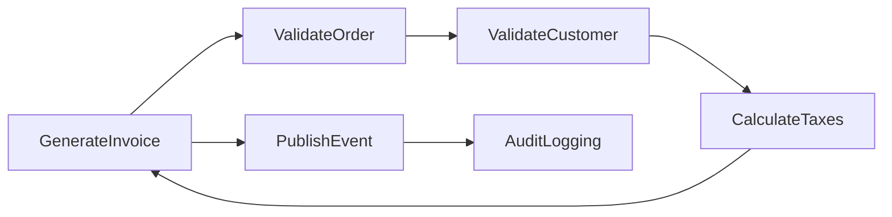
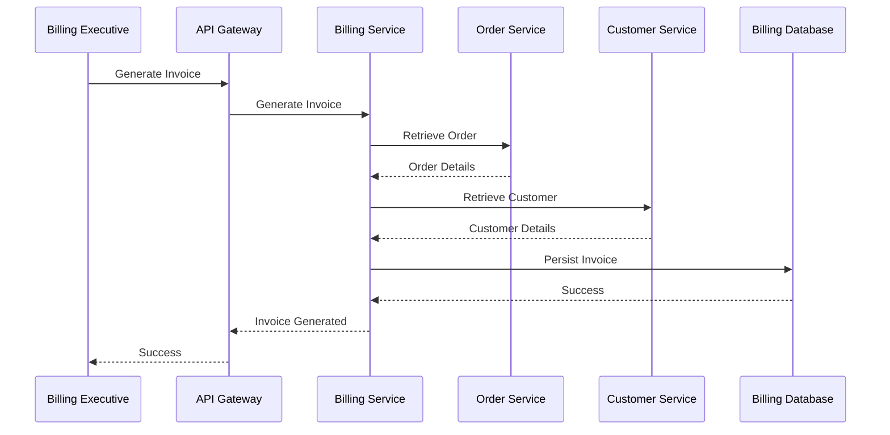
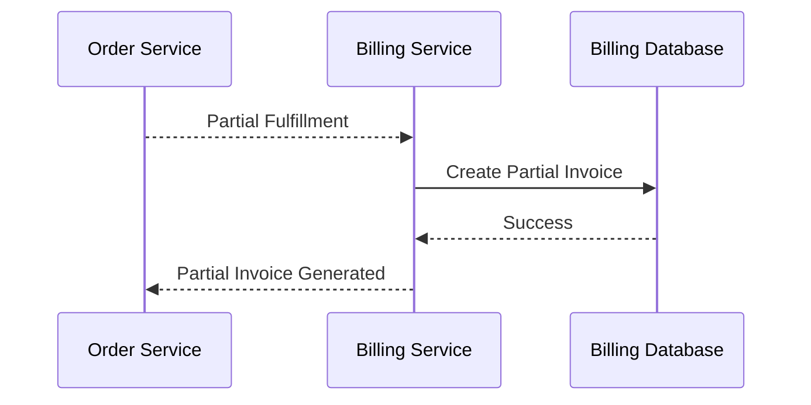
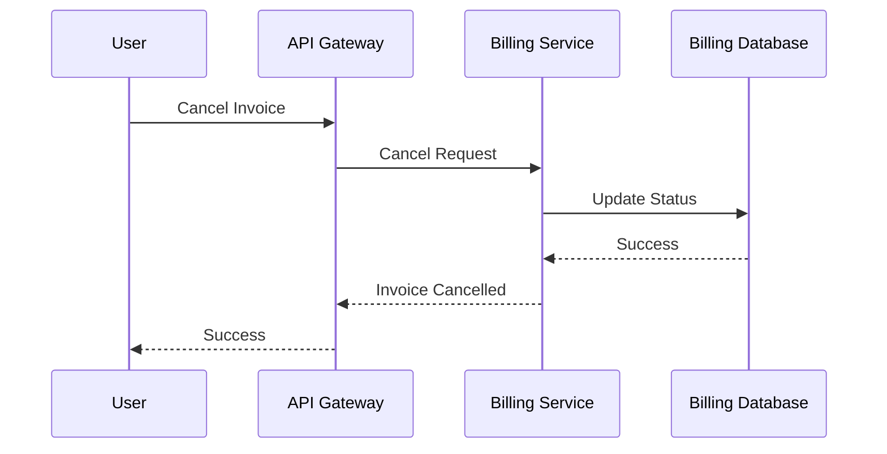

# FRD-007: Billing Management

## 1. Title Page

| Field         | Value                                    |
| ------------- | ---------------------------------------- |
| Project Name  | Distributed Hub and Sales (DHS) Platform |
| Document ID   | FRD-007                                  |
| Service Name  | Billing Service                          |
| Domain        | Billing Management                       |
| Document Type | Functional Requirements Document         |
| Version       | v1.1.0                                   |
| Author        | Sachin Salunke                           |
| Status        | Draft                                    |
| Date          | 2026-06-20                               |

---

# 2. Document Metadata

| Field          | Value                            |
| -------------- | -------------------------------- |
| Document ID    | FRD-007                          |
| Domain         | Billing Management               |
| Document Type  | Functional Requirements Document |
| Version        | v1.1.0                           |
| Author         | Sachin Salunke                   |
| Status         | Draft                            |
| Date           | 2026-06-20                       |
| Linked BRD     | BRD-001                          |
| Linked PRD     | PRD-001                          |
| Linked SRS     | SRS-001                          |
| Linked HLD     | HLD-001                          |
| Linked RTM     | RTM-001                          |
| Linked CONTEXT | CONTEXT-001                      |
| Linked DOMAIN  | DOMAIN-001                       |
| Linked ADRs    | ADR-001 to ADR-007               |

---

# 3. Revision History

| Version | Date       | Author         | Description                                                                     |
| ------- | ---------- | -------------- | ------------------------------------------------------------------------------- |
| v1.0.0  | 2026-06-19 | Sachin Salunke | Initial Billing Management functional specification                             |
| v1.1.0  | 2026-06-20 | Sachin Salunke | Updated for Cloud-Native Monorepo-Based Multi-Module Microservices Architecture |

---

# 4. References

| Reference ID | Document                                               |
| ------------ | ------------------------------------------------------ |
| BRD-001      | Business Requirements Document                         |
| PRD-001      | Product Requirements Document                          |
| SRS-001      | Software Requirements Specification                    |
| HLD-001      | High-Level Design                                      |
| RTM-001      | Requirements Traceability Matrix                       |
| CONTEXT-001  | System Context Document                                |
| DOMAIN-001   | Domain Model                                           |
| ADR-001      | Monorepo-Based Multi-Module Microservices Architecture |
| ADR-002      | Database per Service Strategy                          |
| ADR-003      | Hybrid Communication Architecture                      |
| ADR-004      | Service Discovery Architecture                         |
| ADR-005      | API Gateway Strategy                                   |
| ADR-006      | Saga-Based Distributed Transaction Strategy            |
| ADR-007      | Security Architecture                                  |

---

# 5. Sign-Off Table

| Role                 | Name           | Status  |
| -------------------- | -------------- | ------- |
| Product Owner        | Sachin Salunke | Pending |
| Solution Architect   | Sachin Salunke | Pending |
| Technical Lead       | TBD            | Pending |
| Business Stakeholder | TBD            | Pending |

---

# 6. Functional Overview

The Billing Service provides centralized billing and invoice management capabilities for the DHS Platform.

Responsibilities:

- Invoice Generation
- Partial Billing
- Invoice Cancellation
- Invoice Search
- Invoice Tracking
- Tax Calculation
- GST Validation
- E-Invoice Generation
- Credit Note Management
- Billing Audit Logging

The service acts as the system of record for financial transactions resulting from order fulfillment processes.

The Billing Service supports:

- Order Management
- Partial Fulfillment
- Dispatch
- Notifications
- Reporting
- Analytics
- Financial Compliance

---

## Implementation Characteristics

- Cloud-Native Architecture
- Monorepo-Based Multi-Module Maven Structure
- Independently Deployable Microservice
- Database per Service
- API Gateway Integration
- Service Discovery Integration
- REST APIs and OpenFeign Communication
- Event-Driven Architecture
- Kafka Integration
- Saga-Based Distributed Transactions
- JWT Authentication and RBAC Authorization
- Distributed Tracing and Observability

---

# 7. Service Ownership

## Owning Service

```text id="billsvc1"
billing-service
```

---

## Database

```text id="billsvc2"
billing-db
```

---

## Platform Dependencies

- API Gateway
- Service Discovery
- Kafka
- Redis
- Observability Platform

---

## Service Dependencies

### Synchronous Dependencies

- order-service
- customer-service

### Asynchronous Dependencies

- dispatch-service
- notification-service
- reporting-service
- audit-service

---

# 8. Functional Requirements

## FR-BILL-001

### Requirement Name

Generate Invoice

### Description

The system shall generate invoices for fulfilled orders.

### Priority

Critical

---

## FR-BILL-002

### Requirement Name

Generate Partial Invoice

### Description

The system shall generate partial invoices for partially fulfilled orders.

### Priority

Critical

---

## FR-BILL-003

### Requirement Name

Cancel Invoice

### Description

The system shall support invoice cancellation.

### Priority

Critical

---

## FR-BILL-004

### Requirement Name

Search Invoices

### Description

The system shall provide invoice search capabilities.

### Priority

High

---

## FR-BILL-005

### Requirement Name

Track Invoice Status

### Description

The system shall provide invoice status visibility.

### Priority

High

---

## FR-BILL-006

### Requirement Name

Calculate Taxes

### Description

The system shall calculate applicable taxes during invoice generation.

### Priority

Critical

---

## FR-BILL-007

### Requirement Name

Validate GST

### Description

The system shall validate GST information before invoice generation.

### Priority

Critical

---

## FR-BILL-008

### Requirement Name

Generate E-Invoice

### Description

The system shall generate e-invoices using government integration APIs.

### Priority

Critical

---

## FR-BILL-009

### Requirement Name

Manage Credit Notes

### Description

The system shall support credit note generation and management.

### Priority

High

---

## FR-BILL-010

### Requirement Name

Audit Billing Activities

### Description

The system shall audit billing activities.

### Priority

High

---

# 9. User Roles

| Role              | Responsibilities                  |
| ----------------- | --------------------------------- |
| Company Admin     | Billing administration            |
| Finance Executive | Billing operations                |
| Billing Executive | Invoice generation and management |
| Branch Manager    | Billing visibility                |
| Customer          | Invoice visibility                |

---

# 10. Business Rules

## BR-BILL-001

Every invoice shall belong to a valid order.

---

## BR-BILL-002

Every invoice shall belong to a valid customer.

---

## BR-BILL-003

Taxes shall be calculated before invoice generation.

---

## BR-BILL-004

Partial fulfillment shall generate partial invoices.

---

## BR-BILL-005

Cancelled invoices shall preserve historical records.

---

## BR-BILL-006

E-Invoices shall comply with regulatory requirements.

---

## BR-BILL-007

Billing data ownership belongs exclusively to Billing Service.

---

## BR-BILL-008

Cross-service interactions shall occur through published APIs and domain events.

---

# 11. Functional Workflows

## Invoice Generation Workflow



---

## Partial Invoice Workflow


---

## E-Invoice Workflow


---

# 12. Functional Flow

## Invoice Generation Flow



---

## Partial Invoice Flow



---

## Invoice Cancellation Flow



---

# 13. Service Communication

## Synchronous Communication

Technologies:

- REST APIs
- OpenFeign
- Service Discovery

Used For:

- Order Validation
- Customer Validation
- Invoice Lookup
- Invoice Search
- GST Validation
- E-Invoice Generation

---

## Asynchronous Communication

Technologies:

- Apache Kafka
- Domain Events
- Consumer Groups
- Dead Letter Topics

Used For:

- Invoice Lifecycle Events
- Dispatch Events
- Notification Events
- Reporting Events
- Audit Events
- Saga Coordination

# 14. Published Events

## Invoice Lifecycle Events

```text id="billevt1"
InvoiceGenerated
InvoiceUpdated
InvoiceCancelled
InvoiceCompleted
InvoiceFailed
```

---

## Partial Billing Events

```text id="billevt2"
PartialInvoiceGenerated
PartialInvoiceCancelled
PartialBillingCompleted
```

---

## Tax Events

```text id="billevt3"
TaxCalculated
GSTValidated
GSTValidationFailed
```

---

## E-Invoice Events

```text id="billevt4"
EInvoiceGenerated
EInvoiceRegistered
EInvoiceGenerationFailed
```

---

## Credit Note Events

```text id="billevt5"
CreditNoteGenerated
CreditNoteApproved
CreditNoteCancelled
```

---

# 15. Consumed Events

## Order Events

```text id="billevt6"
OrderCreated
OrderCompleted
OrderPartiallyFulfilled
OrderCancelled
BackOrderCreated
```

---

## Inventory Events

```text id="billevt7"
StockReserved
StockReleased
```

---

## Dispatch Events

```text id="billevt8"
ShipmentCreated
ShipmentDispatched
ShipmentDelivered
```

---

## Audit Events

```text id="billevt9"
AuditRecorded
```

---

# 16. APIs

## Invoice APIs

```text id="billapi1"
POST   /api/v1/invoices
PUT    /api/v1/invoices/{id}
GET    /api/v1/invoices/{id}
GET    /api/v1/invoices
PATCH  /api/v1/invoices/{id}/cancel
PATCH  /api/v1/invoices/{id}/complete
```

---

## Partial Invoice APIs

```text id="billapi2"
POST /api/v1/invoices/partial
GET  /api/v1/invoices/partial
GET  /api/v1/invoices/partial/{id}
```

---

## E-Invoice APIs

```text id="billapi3"
POST /api/v1/e-invoices
GET  /api/v1/e-invoices/{id}
GET  /api/v1/e-invoices
```

---

## Credit Note APIs

```text id="billapi4"
POST   /api/v1/credit-notes
PUT    /api/v1/credit-notes/{id}
GET    /api/v1/credit-notes/{id}
GET    /api/v1/credit-notes
PATCH  /api/v1/credit-notes/{id}/cancel
```

---

# 17. Screen Requirements

## Invoice Management Screen

Fields:

- Invoice Number
- Customer
- Order Number
- Invoice Date
- Invoice Status
- Total Amount

Actions:

- Generate
- View
- Search
- Cancel

---

## Partial Invoice Screen

Fields:

- Invoice Number
- Order Number
- Available Quantity
- Invoice Amount
- Status

Actions:

- Generate
- View
- Search

---

## E-Invoice Screen

Fields:

- Invoice Number
- IRN Number
- Acknowledgement Number
- Generation Date
- Status

Actions:

- Generate
- View
- Download

---

## Credit Note Screen

Fields:

- Credit Note Number
- Invoice Number
- Amount
- Reason
- Status

Actions:

- Create
- Approve
- Cancel
- Search

---

# 18. Field Validations

## Invoice Number

- System generated
- Unique
- Read-only

---

## Order Number

- Required
- Must exist
- Must be active

---

## Customer

- Required
- Must exist
- Must be active

---

## Invoice Amount

- Required
- Greater than zero

---

## GST Number

- Required
- Must be valid

---

## Credit Note Amount

- Cannot exceed invoice amount

---

# 19. Exception Scenarios

## Order Not Found

Response:

```text id="billexc1"
Order does not exist.
```

---

## Customer Not Found

Response:

```text id="billexc2"
Customer does not exist.
```

---

## Invoice Not Found

Response:

```text id="billexc3"
Invoice does not exist.
```

---

## Invalid GST Information

Response:

```text id="billexc4"
GST information is invalid.
```

---

## E-Invoice Generation Failed

Response:

```text id="billexc5"
Unable to generate e-invoice.
```

---

## Invoice Cannot Be Cancelled

Response:

```text id="billexc6"
Invoice cannot be cancelled in current status.
```

---

## Unauthorized Access

Response:

```text id="billexc7"
Access denied.
```

---

# 20. Audit Requirements

Audit Events:

```text id="billaudit1"
INVOICE_GENERATED
INVOICE_UPDATED
INVOICE_CANCELLED
INVOICE_COMPLETED
PARTIAL_INVOICE_GENERATED
CREDIT_NOTE_GENERATED
GST_VALIDATED
E_INVOICE_GENERATED
INVOICE_VIEWED
INVOICE_SEARCHED
```

---

# 21. Notifications

System Notifications:

- Invoice Generated
- Partial Invoice Generated
- Invoice Cancelled
- E-Invoice Generated
- Credit Note Generated
- Invoice Delivered to Customer

---

# 22. Reporting Requirements

Reports:

- Invoice Report
- Invoices by Customer Report
- Invoices by Branch Report
- Partial Invoice Report
- Credit Note Report
- Tax Report
- GST Report
- Billing Audit Report

---

# 23. High-Level Data Entities

## Invoice

```text id="billent1"
Invoice
├── InvoiceId
├── InvoiceNumber
├── OrderId
├── CustomerId
├── InvoiceDate
├── Status
├── TotalAmount
├── TaxAmount
├── CreatedAt
└── UpdatedAt
```

---

## Invoice Item

```text id="billent2"
InvoiceItem
├── InvoiceItemId
├── InvoiceId
├── ProductId
├── Quantity
├── UnitPrice
├── TaxAmount
└── TotalAmount
```

---

## Partial Invoice

```text id="billent3"
PartialInvoice
├── PartialInvoiceId
├── InvoiceId
├── OrderId
├── FulfilledQuantity
├── PendingQuantity
├── Status
└── CreatedAt
```

---

## Credit Note

```text id="billent4"
CreditNote
├── CreditNoteId
├── CreditNoteNumber
├── InvoiceId
├── Amount
├── Reason
├── Status
└── CreatedAt
```

---

## E-Invoice

```text id="billent5"
EInvoice
├── EInvoiceId
├── InvoiceId
├── IRNNumber
├── AcknowledgementNumber
├── Status
├── GeneratedAt
└── PayloadReference
```

---

## Data Ownership

Billing Service exclusively owns:

- Invoice
- InvoiceItem
- PartialInvoice
- CreditNote
- EInvoice

---

# 24. Non-Functional Requirements

- JWT Authentication
- RBAC Authorization
- TLS 1.3
- API Gateway Integration
- Service Discovery
- Distributed Tracing
- Correlation IDs
- Structured Logging
- Horizontal Scalability
- High Availability
- Retry Policies
- Circuit Breakers
- Event Idempotency
- Audit Logging
- Database per Service
- Independent Deployments
- Observability Integration
- Saga Participation Support
- Dead Letter Topic Support
- Regulatory Compliance Support

---

# 25. Success Criteria

- Invoices can be generated successfully.
- Partial billing workflows operate correctly.
- Taxes are calculated accurately.
- GST validation works successfully.
- E-invoices are generated successfully.
- Credit notes are managed correctly.
- Invoice history remains immutable.
- Billing reports are generated successfully.
- Billing Service registers successfully with Service Discovery.
- Billing APIs are accessible through API Gateway.
- Billing events are published successfully to Kafka.
- Distributed tracing is available for billing workflows.
- Billing Service participates successfully in Saga workflows.
- Billing Service remains independently deployable.

---

# 26. Traceability

| BR     | FR          |
| ------ | ----------- |
| BR-007 | FR-BILL-001 |
| BR-007 | FR-BILL-002 |
| BR-007 | FR-BILL-003 |
| BR-007 | FR-BILL-004 |
| BR-007 | FR-BILL-005 |
| BR-007 | FR-BILL-006 |
| BR-007 | FR-BILL-007 |
| BR-007 | FR-BILL-008 |
| BR-007 | FR-BILL-009 |
| BR-011 | FR-BILL-010 |

---
