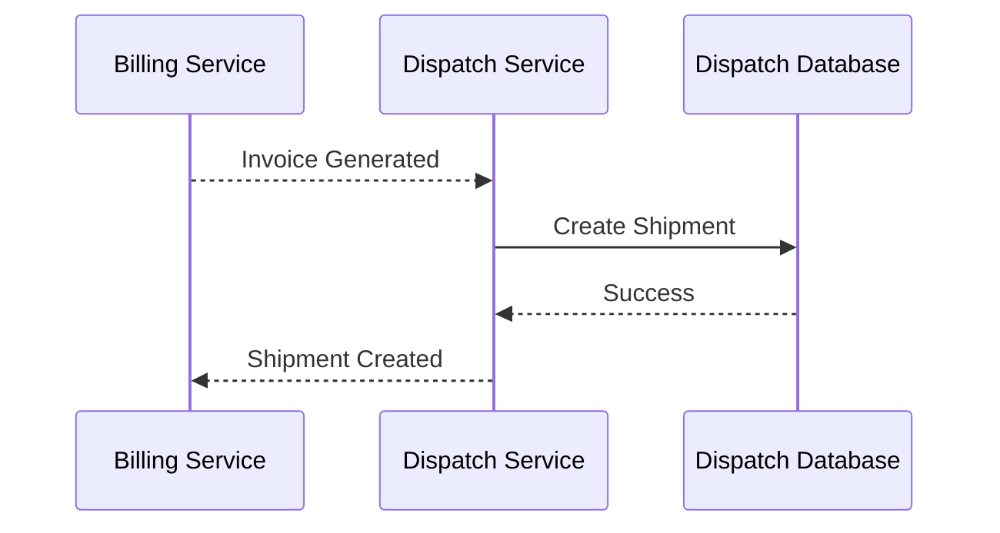
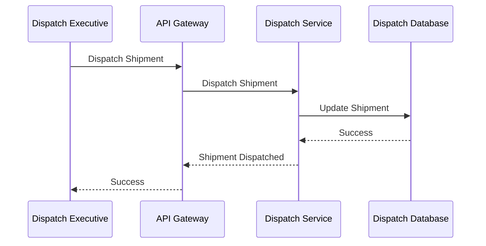
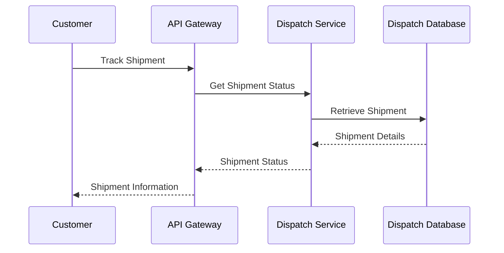

# FRD-008: Dispatch Management

## 1. Title Page

| Field         | Value                                    |
| ------------- | ---------------------------------------- |
| Project Name  | Distributed Hub and Sales (DHS) Platform |
| Document ID   | FRD-008                                  |
| Service Name  | Dispatch Service                         |
| Domain        | Dispatch Management                      |
| Document Type | Functional Requirements Document         |
| Version       | v1.1.0                                   |
| Author        | Sachin Salunke                           |
| Status        | Draft                                    |
| Date          | 2026-06-20                               |

---

# 2. Document Metadata

| Field          | Value                            |
| -------------- | -------------------------------- |
| Document ID    | FRD-008                          |
| Domain         | Dispatch Management              |
| Document Type  | Functional Requirements Document |
| Version        | v1.1.0                           |
| Author         | Sachin Salunke                   |
| Status         | Draft                            |
| Date           | 2026-06-20                       |
| Linked BRD     | BRD-001                          |
| Linked PRD     | PRD-001                          |
| Linked SRS     | SRS-001                          |
| Linked HLD     | HLD-001                          |
| Linked RTM     | RTM-001                          |
| Linked CONTEXT | CONTEXT-001                      |
| Linked DOMAIN  | DOMAIN-001                       |
| Linked ADRs    | ADR-001 to ADR-007               |

---

# 3. Revision History

| Version | Date       | Author         | Description                                                                     |
| ------- | ---------- | -------------- | ------------------------------------------------------------------------------- |
| v1.0.0  | 2026-06-19 | Sachin Salunke | Initial Dispatch Management functional specification                            |
| v1.1.0  | 2026-06-20 | Sachin Salunke | Updated for Cloud-Native Monorepo-Based Multi-Module Microservices Architecture |

---

# 4. References

| Reference ID | Document                                               |
| ------------ | ------------------------------------------------------ |
| BRD-001      | Business Requirements Document                         |
| PRD-001      | Product Requirements Document                          |
| SRS-001      | Software Requirements Specification                    |
| HLD-001      | High-Level Design                                      |
| RTM-001      | Requirements Traceability Matrix                       |
| CONTEXT-001  | System Context Document                                |
| DOMAIN-001   | Domain Model                                           |
| ADR-001      | Monorepo-Based Multi-Module Microservices Architecture |
| ADR-002      | Database per Service Strategy                          |
| ADR-003      | Hybrid Communication Architecture                      |
| ADR-004      | Service Discovery Architecture                         |
| ADR-005      | API Gateway Strategy                                   |
| ADR-006      | Saga-Based Distributed Transaction Strategy            |
| ADR-007      | Security Architecture                                  |

---

# 5. Sign-Off Table

| Role                 | Name           | Status  |
| -------------------- | -------------- | ------- |
| Product Owner        | Sachin Salunke | Pending |
| Solution Architect   | Sachin Salunke | Pending |
| Technical Lead       | TBD            | Pending |
| Business Stakeholder | TBD            | Pending |

---

# 6. Functional Overview

The Dispatch Service provides shipment creation and delivery management capabilities for the DHS Platform.

Responsibilities:

- Shipment Creation
- Shipment Scheduling
- Shipment Allocation
- Shipment Tracking
- Shipment Dispatch
- Delivery Confirmation
- Partial Shipment Management
- Shipment Status Management
- Shipment Search
- Dispatch Audit Logging

The service acts as the fulfillment execution service after successful billing.

The Dispatch Service supports:

- Order Management
- Billing Management
- Notifications
- Reporting
- Analytics
- Customer Order Tracking

---

## Implementation Characteristics

- Cloud-Native Architecture
- Monorepo-Based Multi-Module Maven Structure
- Independently Deployable Microservice
- Database per Service
- API Gateway Integration
- Service Discovery Integration
- REST APIs and OpenFeign Communication
- Event-Driven Architecture
- Kafka Integration
- Saga-Based Distributed Transactions
- JWT Authentication and RBAC Authorization
- Distributed Tracing and Observability

---

# 7. Service Ownership

## Owning Service

```text id="dispsvc1"
dispatch-service
```

---

## Database

```text id="dispsvc2"
dispatch-db
```

---

## Platform Dependencies

- API Gateway
- Service Discovery
- Kafka
- Redis
- Observability Platform

---

## Service Dependencies

### Synchronous Dependencies

- order-service
- billing-service
- customer-service

### Asynchronous Dependencies

- notification-service
- reporting-service
- audit-service

---

# 8. Functional Requirements

## FR-DISP-001

### Requirement Name

Create Shipment

### Description

The system shall create shipments for billed orders.

### Priority

Critical

---

## FR-DISP-002

### Requirement Name

Schedule Shipment

### Description

The system shall schedule shipments for delivery.

### Priority

Critical

---

## FR-DISP-003

### Requirement Name

Dispatch Shipment

### Description

The system shall dispatch shipments.

### Priority

Critical

---

## FR-DISP-004

### Requirement Name

Track Shipment

### Description

The system shall provide shipment tracking.

### Priority

High

---

## FR-DISP-005

### Requirement Name

Confirm Delivery

### Description

The system shall confirm shipment deliveries.

### Priority

Critical

---

## FR-DISP-006

### Requirement Name

Manage Shipment Status

### Description

The system shall manage shipment lifecycle statuses.

### Priority

High

---

## FR-DISP-007

### Requirement Name

Manage Partial Shipments

### Description

The system shall support partial shipment processing.

### Priority

Critical

---

## FR-DISP-008

### Requirement Name

Search Shipments

### Description

The system shall provide shipment search capabilities.

### Priority

High

---

## FR-DISP-009

### Requirement Name

Manage Delivery Confirmations

### Description

The system shall maintain proof of delivery information.

### Priority

High

---

## FR-DISP-010

### Requirement Name

Audit Dispatch Activities

### Description

The system shall audit dispatch activities.

### Priority

High

---

# 9. User Roles

| Role               | Responsibilities        |
| ------------------ | ----------------------- |
| Company Admin      | Dispatch administration |
| Dispatch Executive | Shipment management     |
| Branch Manager     | Shipment monitoring     |
| Sales Executive    | Shipment visibility     |
| Customer           | Shipment tracking       |

---

# 10. Business Rules

## BR-DISP-001

Every shipment shall belong to a valid invoice.

---

## BR-DISP-002

Every shipment shall contain at least one shipment item.

---

## BR-DISP-003

Shipments can be partially fulfilled.

---

## BR-DISP-004

Delivery confirmation shall be mandatory.

---

## BR-DISP-005

Shipment history shall be immutable.

---

## BR-DISP-006

Dispatch data ownership belongs exclusively to Dispatch Service.

---

## BR-DISP-007

Cross-service interactions shall occur through published APIs and domain events.

---

# 11. Functional Workflows

## Shipment Creation Workflow


---

## Shipment Dispatch Workflow


---

## Delivery Confirmation Workflow


---

# 12. Functional Flow

## Shipment Creation Flow



---

## Shipment Dispatch Flow



---

## Shipment Tracking Flow



---

# 13. Service Communication

## Synchronous Communication

Technologies:

- REST APIs
- OpenFeign
- Service Discovery

Used For:

- Invoice Validation
- Customer Lookup
- Shipment Search
- Shipment Tracking

---

## Asynchronous Communication

Technologies:

- Apache Kafka
- Domain Events
- Consumer Groups
- Dead Letter Topics

Used For:

- Shipment Lifecycle Events
- Notification Events
- Reporting Events
- Audit Events
- Saga Coordination

# 14. Published Events

## Shipment Lifecycle Events

```text id="dispevt1"
ShipmentCreated
ShipmentUpdated
ShipmentCancelled
ShipmentDispatched
ShipmentDelivered
ShipmentFailed
```

---

## Partial Shipment Events

```text id="dispevt2"
PartialShipmentCreated
PartialShipmentDispatched
PartialShipmentDelivered
PartialShipmentCancelled
```

---

## Delivery Events

```text id="dispevt3"
DeliveryConfirmed
DeliveryFailed
ProofOfDeliveryCaptured
```

---

## Tracking Events

```text id="dispevt4"
ShipmentTrackingUpdated
ShipmentStatusChanged
EstimatedDeliveryUpdated
```

---

# 15. Consumed Events

## Billing Events

```text id="dispevt5"
InvoiceGenerated
PartialInvoiceGenerated
InvoiceCancelled
```

---

## Order Events

```text id="dispevt6"
OrderCreated
OrderCancelled
OrderCompleted
BackOrderCreated
```

---

## Notification Events

```text id="dispevt7"
NotificationSent
NotificationFailed
```

---

## Audit Events

```text id="dispevt8"
AuditRecorded
```

---

# 16. APIs

## Shipment APIs

```text id="dispapi1"
POST   /api/v1/shipments
PUT    /api/v1/shipments/{id}
GET    /api/v1/shipments/{id}
GET    /api/v1/shipments
PATCH  /api/v1/shipments/{id}/dispatch
PATCH  /api/v1/shipments/{id}/deliver
PATCH  /api/v1/shipments/{id}/cancel
```

---

## Shipment Tracking APIs

```text id="dispapi2"
GET   /api/v1/shipments/{id}/tracking
PATCH /api/v1/shipments/{id}/tracking
```

---

## Delivery Confirmation APIs

```text id="dispapi3"
POST /api/v1/shipments/{id}/delivery-confirmation
GET  /api/v1/shipments/{id}/delivery-confirmation
```

---

## Partial Shipment APIs

```text id="dispapi4"
POST  /api/v1/shipments/partial
GET   /api/v1/shipments/partial
GET   /api/v1/shipments/partial/{id}
PATCH /api/v1/shipments/partial/{id}/dispatch
PATCH /api/v1/shipments/partial/{id}/deliver
```

---

# 17. Screen Requirements

## Shipment Management Screen

Fields:

- Shipment Number
- Invoice Number
- Customer
- Shipment Date
- Shipment Status
- Delivery Status

Actions:

- Create
- Update
- Dispatch
- Deliver
- Search
- View

---

## Shipment Tracking Screen

Fields:

- Shipment Number
- Tracking Number
- Current Status
- Estimated Delivery Date
- Actual Delivery Date

Actions:

- Track
- Update Status
- View History

---

## Delivery Confirmation Screen

Fields:

- Shipment Number
- Delivery Date
- Receiver Name
- Receiver Contact
- Proof of Delivery

Actions:

- Confirm Delivery
- Upload Proof
- View

---

## Partial Shipment Screen

Fields:

- Shipment Number
- Order Number
- Dispatched Quantity
- Pending Quantity
- Status

Actions:

- Create
- Dispatch
- Deliver
- View

---

# 18. Field Validations

## Shipment Number

- System generated
- Unique
- Read-only

---

## Invoice Number

- Required
- Must exist
- Must be active

---

## Tracking Number

- Required
- Unique

---

## Delivery Date

- Cannot be earlier than shipment date

---

## Receiver Name

- Required
- Maximum 100 characters

---

## Proof of Delivery

- Optional
- Image or document upload supported

---

# 19. Exception Scenarios

## Shipment Not Found

Response:

```text id="dispexc1"
Shipment does not exist.
```

---

## Invoice Not Found

Response:

```text id="dispexc2"
Invoice does not exist.
```

---

## Shipment Already Delivered

Response:

```text id="dispexc3"
Shipment has already been delivered.
```

---

## Invalid Shipment Status

Response:

```text id="dispexc4"
Shipment cannot be processed in current status.
```

---

## Delivery Confirmation Failed

Response:

```text id="dispexc5"
Unable to confirm delivery.
```

---

## Unauthorized Access

Response:

```text id="dispexc6"
Access denied.
```

---

# 20. Audit Requirements

Audit Events:

```text id="dispaudit1"
SHIPMENT_CREATED
SHIPMENT_UPDATED
SHIPMENT_CANCELLED
SHIPMENT_DISPATCHED
SHIPMENT_DELIVERED
PARTIAL_SHIPMENT_CREATED
PARTIAL_SHIPMENT_DELIVERED
DELIVERY_CONFIRMED
PROOF_OF_DELIVERY_CAPTURED
SHIPMENT_TRACKED
SHIPMENT_SEARCHED
```

---

# 21. Notifications

System Notifications:

- Shipment Created
- Shipment Dispatched
- Shipment Delivered
- Partial Shipment Created
- Delivery Confirmed
- Delivery Failed
- Estimated Delivery Updated

---

# 22. Reporting Requirements

Reports:

- Shipment Report
- Shipment Status Report
- Deliveries by Branch Report
- Partial Shipment Report
- Delivery Confirmation Report
- Shipment Tracking Report
- Dispatch Audit Report

---

# 23. High-Level Data Entities

## Shipment

```text id="dispent1"
Shipment
├── ShipmentId
├── ShipmentNumber
├── InvoiceId
├── CustomerId
├── ShipmentDate
├── Status
├── TrackingNumber
├── CreatedAt
└── UpdatedAt
```

---

## Shipment Item

```text id="dispent2"
ShipmentItem
├── ShipmentItemId
├── ShipmentId
├── ProductId
├── Quantity
└── Status
```

---

## Partial Shipment

```text id="dispent3"
PartialShipment
├── PartialShipmentId
├── ShipmentId
├── DispatchedQuantity
├── PendingQuantity
├── Status
└── CreatedAt
```

---

## Delivery Confirmation

```text id="dispent4"
DeliveryConfirmation
├── ConfirmationId
├── ShipmentId
├── DeliveryDate
├── ReceiverName
├── ReceiverContact
├── ProofReference
└── ConfirmedAt
```

---

## Shipment Tracking

```text id="dispent5"
ShipmentTracking
├── TrackingId
├── ShipmentId
├── Status
├── Location
├── EventTimestamp
└── UpdatedBy
```

---

## Data Ownership

Dispatch Service exclusively owns:

- Shipment
- ShipmentItem
- PartialShipment
- DeliveryConfirmation
- ShipmentTracking

---

# 24. Non-Functional Requirements

- JWT Authentication
- RBAC Authorization
- TLS 1.3
- API Gateway Integration
- Service Discovery
- Distributed Tracing
- Correlation IDs
- Structured Logging
- Horizontal Scalability
- High Availability
- Retry Policies
- Circuit Breakers
- Event Idempotency
- Audit Logging
- Database per Service
- Independent Deployments
- Observability Integration
- Saga Participation Support
- Dead Letter Topic Support

---

# 25. Success Criteria

- Shipments can be created successfully.
- Shipment dispatch workflows operate correctly.
- Partial shipments are supported.
- Delivery confirmations are captured successfully.
- Shipment tracking provides real-time visibility.
- Proof of delivery is maintained.
- Dispatch reports are generated successfully.
- Dispatch Service registers successfully with Service Discovery.
- Dispatch APIs are accessible through API Gateway.
- Dispatch events are published successfully to Kafka.
- Distributed tracing is available for dispatch workflows.
- Dispatch Service participates successfully in Saga workflows.
- Dispatch Service remains independently deployable.

---

# 26. Traceability

| BR     | FR          |
| ------ | ----------- |
| BR-008 | FR-DISP-001 |
| BR-008 | FR-DISP-002 |
| BR-008 | FR-DISP-003 |
| BR-008 | FR-DISP-004 |
| BR-008 | FR-DISP-005 |
| BR-008 | FR-DISP-006 |
| BR-008 | FR-DISP-007 |
| BR-008 | FR-DISP-008 |
| BR-008 | FR-DISP-009 |
| BR-011 | FR-DISP-010 |

---
