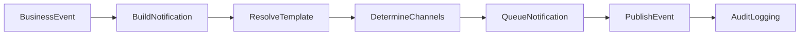
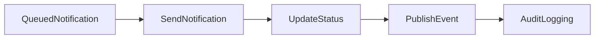
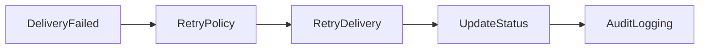
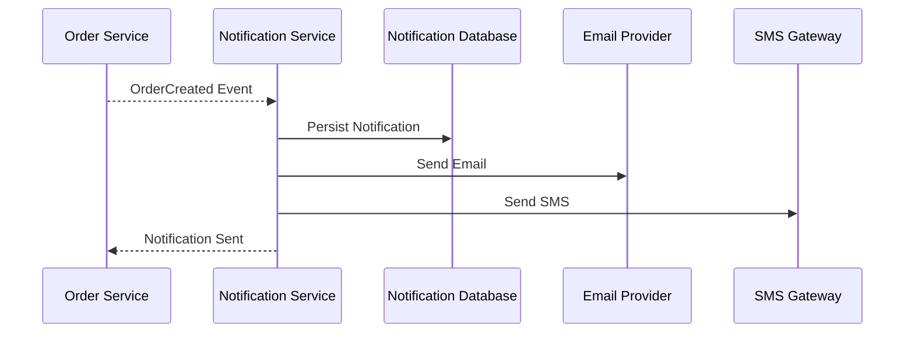
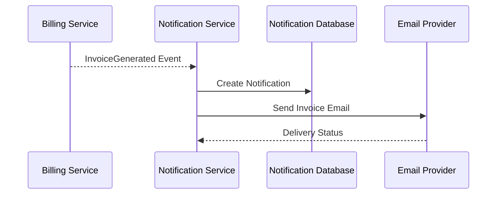
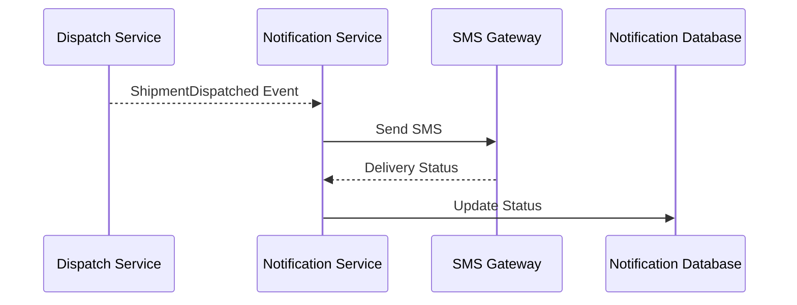

# FRD-009: Notification Management

## 1. Title Page

| Field         | Value                                    |
| ------------- | ---------------------------------------- |
| Project Name  | Distributed Hub and Sales (DHS) Platform |
| Document ID   | FRD-009                                  |
| Service Name  | Notification Service                     |
| Domain        | Notification Management                  |
| Document Type | Functional Requirements Document         |
| Version       | v1.1.0                                   |
| Author        | Sachin Salunke                           |
| Status        | Draft                                    |
| Date          | 2026-06-20                               |

---

# 2. Document Metadata

| Field          | Value                            |
| -------------- | -------------------------------- |
| Document ID    | FRD-009                          |
| Domain         | Notification Management          |
| Document Type  | Functional Requirements Document |
| Version        | v1.1.0                           |
| Author         | Sachin Salunke                   |
| Status         | Draft                            |
| Date           | 2026-06-20                       |
| Linked BRD     | BRD-001                          |
| Linked PRD     | PRD-001                          |
| Linked SRS     | SRS-001                          |
| Linked HLD     | HLD-001                          |
| Linked RTM     | RTM-001                          |
| Linked CONTEXT | CONTEXT-001                      |
| Linked DOMAIN  | DOMAIN-001                       |
| Linked ADRs    | ADR-001 to ADR-007               |

---

# 3. Revision History

| Version | Date       | Author         | Description                                                                     |
| ------- | ---------- | -------------- | ------------------------------------------------------------------------------- |
| v1.0.0  | 2026-06-19 | Sachin Salunke | Initial Notification Management functional specification                        |
| v1.1.0  | 2026-06-20 | Sachin Salunke | Updated for Cloud-Native Monorepo-Based Multi-Module Microservices Architecture |

---

# 4. References

| Reference ID | Document                                               |
| ------------ | ------------------------------------------------------ |
| BRD-001      | Business Requirements Document                         |
| PRD-001      | Product Requirements Document                          |
| SRS-001      | Software Requirements Specification                    |
| HLD-001      | High-Level Design                                      |
| RTM-001      | Requirements Traceability Matrix                       |
| CONTEXT-001  | System Context Document                                |
| DOMAIN-001   | Domain Model                                           |
| ADR-001      | Monorepo-Based Multi-Module Microservices Architecture |
| ADR-002      | Database per Service Strategy                          |
| ADR-003      | Hybrid Communication Architecture                      |
| ADR-004      | Service Discovery Architecture                         |
| ADR-005      | API Gateway Strategy                                   |
| ADR-006      | Saga-Based Distributed Transaction Strategy            |
| ADR-007      | Security Architecture                                  |

---

# 5. Sign-Off Table

| Role                 | Name           | Status  |
| -------------------- | -------------- | ------- |
| Product Owner        | Sachin Salunke | Pending |
| Solution Architect   | Sachin Salunke | Pending |
| Technical Lead       | TBD            | Pending |
| Business Stakeholder | TBD            | Pending |

---

# 6. Functional Overview

The Notification Service provides centralized communication and notification capabilities for the DHS Platform.

Responsibilities:

- Notification Generation
- Email Notifications
- SMS Notifications
- In-App Notifications
- Notification Template Management
- Notification Scheduling
- Notification Delivery Tracking
- Notification Retry Processing
- Notification Preferences Management
- Notification Audit Logging

The service acts as the centralized communication layer for all business services.

The Notification Service supports:

- Order Management
- Billing Management
- Dispatch Management
- Customer Management
- Authentication and Security
- Reporting and Analytics

---

## Implementation Characteristics

- Cloud-Native Architecture
- Monorepo-Based Multi-Module Maven Structure
- Independently Deployable Microservice
- Database per Service
- API Gateway Integration
- Service Discovery Integration
- REST APIs and OpenFeign Communication
- Event-Driven Architecture
- Kafka Integration
- Asynchronous Processing
- JWT Authentication and RBAC Authorization
- Distributed Tracing and Observability

---

# 7. Service Ownership

## Owning Service

```text id="notsvc1"
notification-service
```

---

## Database

```text id="notsvc2"
notification-db
```

---

## Platform Dependencies

- API Gateway
- Service Discovery
- Kafka
- Redis
- Observability Platform

---

## External Dependencies

- Email Provider
- SMS Gateway
- Push Notification Provider

---

## Service Dependencies

### Asynchronous Dependencies

- iam-service
- customer-service
- order-service
- billing-service
- dispatch-service
- audit-service
- reporting-service

---

# 8. Functional Requirements

## FR-NOT-001

### Requirement Name

Generate Notification

### Description

The system shall generate notifications from business events.

### Priority

Critical

---

## FR-NOT-002

### Requirement Name

Send Email Notifications

### Description

The system shall send email notifications.

### Priority

Critical

---

## FR-NOT-003

### Requirement Name

Send SMS Notifications

### Description

The system shall send SMS notifications.

### Priority

Critical

---

## FR-NOT-004

### Requirement Name

Send In-App Notifications

### Description

The system shall send in-app notifications.

### Priority

High

---

## FR-NOT-005

### Requirement Name

Manage Notification Templates

### Description

The system shall support notification template management.

### Priority

High

---

## FR-NOT-006

### Requirement Name

Schedule Notifications

### Description

The system shall support scheduled notification delivery.

### Priority

High

---

## FR-NOT-007

### Requirement Name

Track Notification Delivery

### Description

The system shall provide notification delivery tracking.

### Priority

High

---

## FR-NOT-008

### Requirement Name

Retry Failed Notifications

### Description

The system shall retry failed notifications.

### Priority

High

---

## FR-NOT-009

### Requirement Name

Manage Notification Preferences

### Description

The system shall support customer notification preferences.

### Priority

Medium

---

## FR-NOT-010

### Requirement Name

Audit Notification Activities

### Description

The system shall audit notification activities.

### Priority

High

---

# 9. User Roles

| Role                 | Responsibilities                 |
| -------------------- | -------------------------------- |
| Company Admin        | Notification administration      |
| System Administrator | Template and provider management |
| Customer             | Notification preferences         |
| Branch Manager       | Notification visibility          |

---

# 10. Business Rules

## BR-NOT-001

Every notification shall belong to a valid business event.

---

## BR-NOT-002

Notifications shall support multiple delivery channels.

---

## BR-NOT-003

Failed notifications shall be retried automatically.

---

## BR-NOT-004

Notification templates shall be versioned.

---

## BR-NOT-005

Notification delivery status shall be tracked.

---

## BR-NOT-006

Customers may configure notification preferences.

---

## BR-NOT-007

Notification history shall be immutable.

---

## BR-NOT-008

Notification data ownership belongs exclusively to Notification Service.

---

## BR-NOT-009

Cross-service communication shall occur through published domain events.

---

# 11. Functional Workflows

## Notification Generation Workflow



---

## Notification Delivery Workflow



---

## Retry Workflow



---

# 12. Functional Flow

## Order Notification Flow



---

## Invoice Notification Flow



---

## Dispatch Notification Flow



---

# 13. Service Communication

## Synchronous Communication

Technologies:

- REST APIs
- OpenFeign
- Service Discovery

Used For:

- Template Retrieval
- Notification Status Queries
- Preference Management

---

## Asynchronous Communication

Technologies:

- Apache Kafka
- Domain Events
- Consumer Groups
- Dead Letter Topics

Used For:

- Business Event Consumption
- Notification Generation
- Delivery Events
- Retry Events
- Audit Events
- Reporting Events

# 14. Published Events

## Notification Lifecycle Events

```text id="notevt1"
NotificationCreated
NotificationQueued
NotificationSent
NotificationDelivered
NotificationFailed
NotificationCancelled
```

---

## Email Notification Events

```text id="notevt2"
EmailNotificationCreated
EmailNotificationSent
EmailNotificationDelivered
EmailNotificationFailed
```

---

## SMS Notification Events

```text id="notevt3"
SMSNotificationCreated
SMSNotificationSent
SMSNotificationDelivered
SMSNotificationFailed
```

---

## In-App Notification Events

```text id="notevt4"
InAppNotificationCreated
InAppNotificationDelivered
InAppNotificationRead
```

---

## Retry Events

```text id="notevt5"
NotificationRetryScheduled
NotificationRetryInitiated
NotificationRetryCompleted
NotificationRetryFailed
```

---

# 15. Consumed Events

## IAM Events

```text id="notevt6"
UserCreated
PasswordChanged
UserLocked
PasswordResetRequested
```

---

## Customer Events

```text id="notevt7"
CustomerCreated
CustomerUpdated
CustomerActivated
CustomerDeactivated
```

---

## Order Events

```text id="notevt8"
OrderCreated
OrderCancelled
OrderCompleted
BackOrderCreated
```

---

## Billing Events

```text id="notevt9"
InvoiceGenerated
PartialInvoiceGenerated
InvoiceCancelled
CreditNoteGenerated
```

---

## Dispatch Events

```text id="notevt10"
ShipmentCreated
ShipmentDispatched
ShipmentDelivered
DeliveryConfirmed
```

---

## Audit Events

```text id="notevt11"
AuditRecorded
```

---

# 16. APIs

## Notification APIs

```text id="notapi1"
POST /api/v1/notifications
GET  /api/v1/notifications
GET  /api/v1/notifications/{id}
PATCH /api/v1/notifications/{id}/cancel
```

---

## Email Notification APIs

```text id="notapi2"
POST /api/v1/notifications/email
GET  /api/v1/notifications/email/{id}
```

---

## SMS Notification APIs

```text id="notapi3"
POST /api/v1/notifications/sms
GET  /api/v1/notifications/sms/{id}
```

---

## In-App Notification APIs

```text id="notapi4"
POST /api/v1/notifications/in-app
GET  /api/v1/notifications/in-app
PATCH /api/v1/notifications/in-app/{id}/read
```

---

## Template APIs

```text id="notapi5"
POST   /api/v1/templates
PUT    /api/v1/templates/{id}
GET    /api/v1/templates
GET    /api/v1/templates/{id}
DELETE /api/v1/templates/{id}
```

---

## Preference APIs

```text id="notapi6"
GET   /api/v1/preferences
PUT   /api/v1/preferences
PATCH /api/v1/preferences/{id}
```

---

# 17. Screen Requirements

## Notification Dashboard

Fields:

- Notification Id
- Notification Type
- Recipient
- Channel
- Status
- Created Date

Actions:

- View
- Search
- Cancel
- Retry

---

## Template Management Screen

Fields:

- Template Name
- Channel
- Subject
- Body
- Status
- Version

Actions:

- Create
- Update
- Delete
- Search

---

## Delivery Tracking Screen

Fields:

- Notification Id
- Recipient
- Delivery Channel
- Delivery Status
- Delivery Timestamp

Actions:

- Search
- View
- Retry

---

## Preference Management Screen

Fields:

- Email Notifications
- SMS Notifications
- In-App Notifications
- Preferred Language
- Status

Actions:

- Update
- Save
- Reset

---

# 18. Field Validations

## Recipient

- Required
- Valid email or mobile number

---

## Notification Type

- Required
- Must be a supported notification type

---

## Template Name

- Required
- Unique
- Maximum 100 characters

---

## Subject

- Maximum 250 characters

---

## Message Body

- Required
- Maximum 5000 characters

---

# 19. Exception Scenarios

## Notification Not Found

Response:

```text id="notexc1"
Notification does not exist.
```

---

## Invalid Recipient

Response:

```text id="notexc2"
Recipient information is invalid.
```

---

## Template Not Found

Response:

```text id="notexc3"
Notification template does not exist.
```

---

## Delivery Failure

Response:

```text id="notexc4"
Unable to deliver notification.
```

---

## Notification Channel Unavailable

Response:

```text id="notexc5"
Notification channel is unavailable.
```

---

## Unauthorized Access

Response:

```text id="notexc6"
Access denied.
```

---

# 20. Audit Requirements

Audit Events:

```text id="notaudit1"
NOTIFICATION_CREATED
NOTIFICATION_SENT
NOTIFICATION_DELIVERED
NOTIFICATION_FAILED
NOTIFICATION_CANCELLED
NOTIFICATION_RETRIED
EMAIL_SENT
SMS_SENT
IN_APP_NOTIFICATION_SENT
TEMPLATE_CREATED
TEMPLATE_UPDATED
PREFERENCE_UPDATED
```

---

# 21. Notifications

System Notifications:

- Notification Sent
- Notification Failed
- Notification Retry Completed
- Template Created
- Template Updated
- Preference Updated
- Notification Channel Failure

---

# 22. Reporting Requirements

Reports:

- Notification Summary Report
- Email Delivery Report
- SMS Delivery Report
- In-App Notification Report
- Failed Notification Report
- Retry Report
- Template Usage Report
- Notification Audit Report

---

# 23. High-Level Data Entities

## Notification

```text id="notent1"
Notification
├── NotificationId
├── Recipient
├── Channel
├── Type
├── Status
├── Message
├── CreatedAt
└── UpdatedAt
```

---

## Notification Template

```text id="notent2"
NotificationTemplate
├── TemplateId
├── Name
├── Channel
├── Subject
├── Body
├── Version
└── Status
```

---

## Notification Delivery

```text id="notent3"
NotificationDelivery
├── DeliveryId
├── NotificationId
├── Channel
├── Status
├── AttemptCount
├── DeliveredAt
└── FailureReason
```

---

## Notification Preference

```text id="notent4"
NotificationPreference
├── PreferenceId
├── UserId
├── EmailEnabled
├── SMSEnabled
├── InAppEnabled
├── PreferredLanguage
└── Status
```

---

## Data Ownership

Notification Service exclusively owns:

- Notification
- NotificationTemplate
- NotificationDelivery
- NotificationPreference

---

# 24. Non-Functional Requirements

- JWT Authentication
- RBAC Authorization
- TLS 1.3
- API Gateway Integration
- Service Discovery
- Distributed Tracing
- Correlation IDs
- Structured Logging
- Horizontal Scalability
- High Availability
- Retry Policies
- Circuit Breakers
- Event Idempotency
- Audit Logging
- Database per Service
- Independent Deployments
- Observability Integration
- Dead Letter Topic Support
- Asynchronous Processing Support

---

# 25. Success Criteria

- Notifications are generated successfully.
- Email, SMS, and in-app notifications are delivered successfully.
- Notification templates are managed correctly.
- Delivery tracking provides real-time visibility.
- Failed notifications are retried automatically.
- Notification preferences are honored.
- Notification reports are generated successfully.
- Notification Service registers successfully with Service Discovery.
- Notification APIs are accessible through API Gateway.
- Notification events are published successfully to Kafka.
- Distributed tracing is available for notification workflows.
- Notification Service remains independently deployable.

---

# 26. Traceability

| BR     | FR         |
| ------ | ---------- |
| BR-009 | FR-NOT-001 |
| BR-009 | FR-NOT-002 |
| BR-009 | FR-NOT-003 |
| BR-009 | FR-NOT-004 |
| BR-009 | FR-NOT-005 |
| BR-009 | FR-NOT-006 |
| BR-009 | FR-NOT-007 |
| BR-009 | FR-NOT-008 |
| BR-009 | FR-NOT-009 |
| BR-011 | FR-NOT-010 |

---
