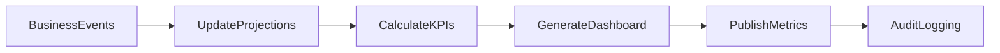
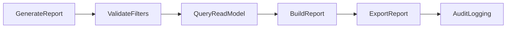
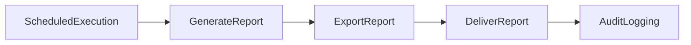
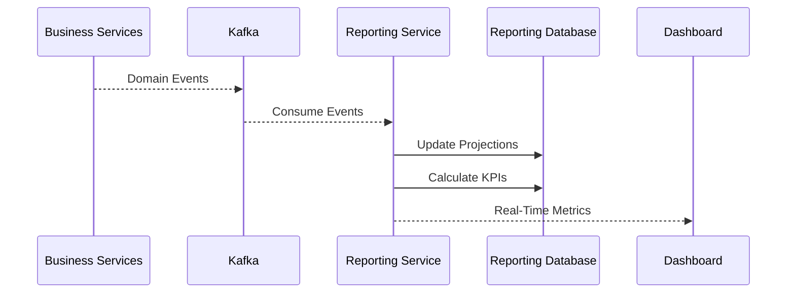
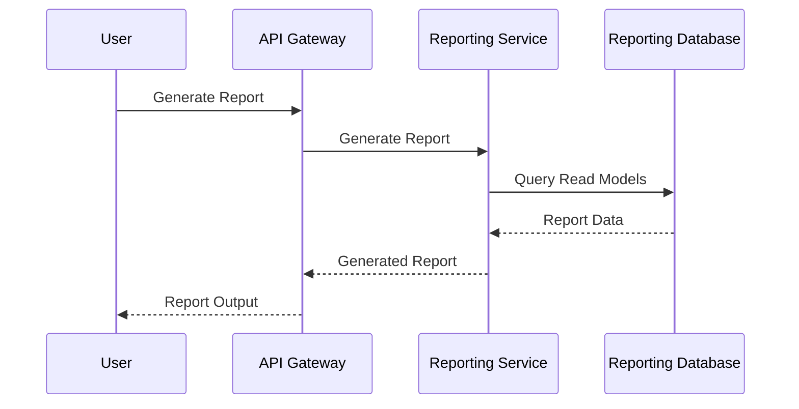
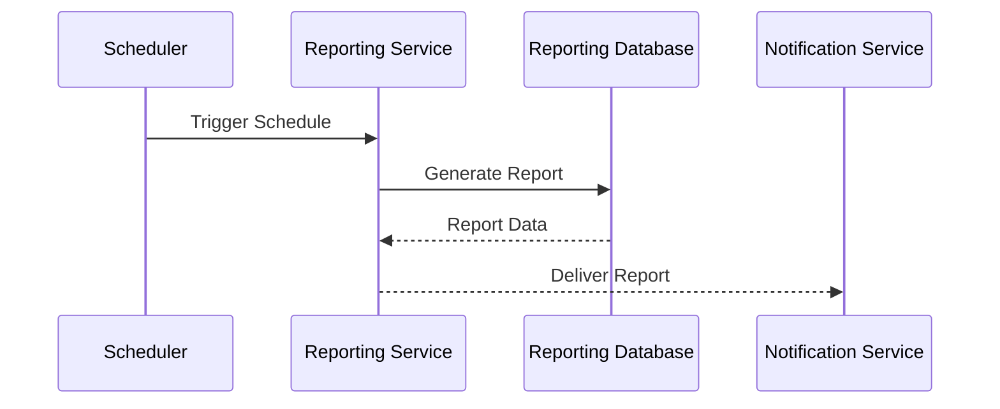

# FRD-010: Reporting & Analytics Management

## 1. Title Page

| Field         | Value                                    |
| ------------- | ---------------------------------------- |
| Project Name  | Distributed Hub and Sales (DHS) Platform |
| Document ID   | FRD-010                                  |
| Service Name  | Reporting Service                        |
| Domain        | Reporting & Analytics Management         |
| Document Type | Functional Requirements Document         |
| Version       | v1.1.0                                   |
| Author        | Sachin Salunke                           |
| Status        | Draft                                    |
| Date          | 2026-06-20                               |

---

# 2. Document Metadata

| Field          | Value                            |
| -------------- | -------------------------------- |
| Document ID    | FRD-010                          |
| Domain         | Reporting & Analytics Management |
| Document Type  | Functional Requirements Document |
| Version        | v1.1.0                           |
| Author         | Sachin Salunke                   |
| Status         | Draft                            |
| Date           | 2026-06-20                       |
| Linked BRD     | BRD-001                          |
| Linked PRD     | PRD-001                          |
| Linked SRS     | SRS-001                          |
| Linked HLD     | HLD-001                          |
| Linked RTM     | RTM-001                          |
| Linked CONTEXT | CONTEXT-001                      |
| Linked DOMAIN  | DOMAIN-001                       |
| Linked ADRs    | ADR-001 to ADR-007               |

---

# 3. Revision History

| Version | Date       | Author         | Description                                                                     |
| ------- | ---------- | -------------- | ------------------------------------------------------------------------------- |
| v1.0.0  | 2026-06-19 | Sachin Salunke | Initial Reporting & Analytics functional specification                          |
| v1.1.0  | 2026-06-20 | Sachin Salunke | Updated for Cloud-Native Monorepo-Based Multi-Module Microservices Architecture |

---

# 4. References

| Reference ID | Document                                               |
| ------------ | ------------------------------------------------------ |
| BRD-001      | Business Requirements Document                         |
| PRD-001      | Product Requirements Document                          |
| SRS-001      | Software Requirements Specification                    |
| HLD-001      | High-Level Design                                      |
| RTM-001      | Requirements Traceability Matrix                       |
| CONTEXT-001  | System Context Document                                |
| DOMAIN-001   | Domain Model                                           |
| ADR-001      | Monorepo-Based Multi-Module Microservices Architecture |
| ADR-002      | Database per Service Strategy                          |
| ADR-003      | Hybrid Communication Architecture                      |
| ADR-004      | Service Discovery Architecture                         |
| ADR-005      | API Gateway Strategy                                   |
| ADR-006      | Saga-Based Distributed Transaction Strategy            |
| ADR-007      | Security Architecture                                  |

---

# 5. Sign-Off Table

| Role                 | Name           | Status  |
| -------------------- | -------------- | ------- |
| Product Owner        | Sachin Salunke | Pending |
| Solution Architect   | Sachin Salunke | Pending |
| Technical Lead       | TBD            | Pending |
| Business Stakeholder | TBD            | Pending |

---

# 6. Functional Overview

The Reporting Service provides centralized reporting, dashboards, metrics, and analytics capabilities for the DHS Platform.

Responsibilities:

* Operational Dashboards
* Business Reports
* KPI Management
* Analytics and Insights
* Report Scheduling
* Report Export
* Real-Time Metrics
* Data Aggregation
* Trend Analysis
* Reporting Audit Logging

The service acts as the read and analytics platform for business decision-making.

The Reporting Service supports:

* Identity & Access Management
* Branch Management
* Customer Management
* Product Management
* Inventory Management
* Order Management
* Billing Management
* Dispatch Management
* Notifications
* Audit & Compliance

---

## Implementation Characteristics

* Cloud-Native Architecture
* Monorepo-Based Multi-Module Maven Structure
* Independently Deployable Microservice
* Database per Service
* API Gateway Integration
* Service Discovery Integration
* Event-Driven Architecture
* Kafka Integration
* Read-Optimized Projections
* CQRS Read Models
* JWT Authentication and RBAC Authorization
* Distributed Tracing and Observability

---

# 7. Service Ownership

## Owning Service

```text id="rptsvc1"
reporting-service
```

---

## Database

```text id="rptsvc2"
reporting-db
```

---

## Platform Dependencies

* API Gateway
* Service Discovery
* Kafka
* Redis
* Observability Platform

---

## Service Dependencies

### Asynchronous Dependencies

* iam-service
* branch-service
* customer-service
* product-service
* inventory-service
* order-service
* billing-service
* dispatch-service
* notification-service
* audit-service

---

# 8. Functional Requirements

## FR-RPT-001

### Requirement Name

Generate Operational Reports

### Description

The system shall generate operational reports.

### Priority

Critical

---

## FR-RPT-002

### Requirement Name

Generate Analytical Reports

### Description

The system shall generate analytical reports.

### Priority

High

---

## FR-RPT-003

### Requirement Name

Generate Dashboards

### Description

The system shall provide interactive dashboards.

### Priority

Critical

---

## FR-RPT-004

### Requirement Name

Manage KPIs

### Description

The system shall provide KPI calculation and visualization.

### Priority

High

---

## FR-RPT-005

### Requirement Name

Schedule Reports

### Description

The system shall support scheduled report generation.

### Priority

High

---

## FR-RPT-006

### Requirement Name

Export Reports

### Description

The system shall support report export functionality.

### Priority

High

---

## FR-RPT-007

### Requirement Name

Generate Real-Time Metrics

### Description

The system shall provide real-time business metrics.

### Priority

Critical

---

## FR-RPT-008

### Requirement Name

Perform Trend Analysis

### Description

The system shall provide trend analysis capabilities.

### Priority

High

---

## FR-RPT-009

### Requirement Name

Maintain Reporting Projections

### Description

The system shall maintain read-optimized projections using business events.

### Priority

Critical

---

## FR-RPT-010

### Requirement Name

Audit Reporting Activities

### Description

The system shall audit reporting activities.

### Priority

High

---

# 9. User Roles

| Role              | Responsibilities              |
| ----------------- | ----------------------------- |
| Company Admin     | Reporting administration      |
| Hub Manager       | Executive dashboards and KPIs |
| Branch Manager    | Branch analytics and reports  |
| Finance Executive | Financial reporting           |
| Sales Executive   | Operational reports           |

---

# 10. Business Rules

## BR-RPT-001

Reports shall be generated using read-optimized projections.

---

## BR-RPT-002

Analytics shall be generated from business events.

---

## BR-RPT-003

Reports shall support export functionality.

---

## BR-RPT-004

Reports shall support scheduling.

---

## BR-RPT-005

KPIs shall be calculated automatically.

---

## BR-RPT-006

Historical reporting data shall be retained.

---

## BR-RPT-007

Reporting data ownership belongs exclusively to Reporting Service.

---

## BR-RPT-008

Reporting projections shall be built using event-driven synchronization.

---

# 11. Functional Workflows

## Dashboard Generation Workflow



---

## Report Generation Workflow



---

## Scheduled Report Workflow



---

# 12. Functional Flow

## Real-Time Dashboard Flow



---

## Report Generation Flow



---

## Scheduled Reporting Flow



---

# 13. Service Communication

## Synchronous Communication

Technologies:

* REST APIs
* Service Discovery

Used For:

* Dashboard Queries
* Report Generation
* Report Export
* KPI Queries

---

## Asynchronous Communication

Technologies:

* Apache Kafka
* Domain Events
* Consumer Groups
* Dead Letter Topics

Used For:

* Projection Updates
* Analytics Processing
* KPI Calculation
* Metrics Aggregation
* Audit Events

# 14. Published Events

## Reporting Lifecycle Events

```text id="rptevt1"
ReportGenerated
ReportExported
ReportScheduled
ReportDelivered
ReportGenerationFailed
```

---

## Dashboard Events

```text id="rptevt2"
DashboardGenerated
DashboardRefreshed
DashboardPublished
```

---

## KPI Events

```text id="rptevt3"
KPICalculated
KPIThresholdExceeded
MetricGenerated
```

---

## Analytics Events

```text id="rptevt4"
AnalyticsGenerated
TrendAnalysisCompleted
ForecastGenerated
```

---

# 15. Consumed Events

## IAM Events

```text id="rptevt5"
UserCreated
UserUpdated
RoleAssigned
```

---

## Branch Events

```text id="rptevt6"
BranchCreated
BranchUpdated
BranchDeactivated
```

---

## Customer Events

```text id="rptevt7"
CustomerCreated
CustomerUpdated
CustomerDeactivated
```

---

## Product Events

```text id="rptevt8"
ProductCreated
ProductUpdated
ProductDeactivated
```

---

## Inventory Events

```text id="rptevt9"
InventoryCreated
StockReserved
StockReleased
StockAdjusted
```

---

## Order Events

```text id="rptevt10"
OrderCreated
OrderCancelled
OrderCompleted
BackOrderCreated
```

---

## Billing Events

```text id="rptevt11"
InvoiceGenerated
PartialInvoiceGenerated
InvoiceCancelled
CreditNoteGenerated
```

---

## Dispatch Events

```text id="rptevt12"
ShipmentCreated
ShipmentDispatched
ShipmentDelivered
DeliveryConfirmed
```

---

## Notification Events

```text id="rptevt13"
NotificationSent
NotificationFailed
```

---

## Audit Events

```text id="rptevt14"
AuditRecorded
```

---

# 16. APIs

## Dashboard APIs

```text id="rptapi1"
GET /api/v1/dashboards
GET /api/v1/dashboards/{id}
GET /api/v1/dashboards/kpis
```

---

## Report APIs

```text id="rptapi2"
POST /api/v1/reports/generate
GET  /api/v1/reports
GET  /api/v1/reports/{id}
```

---

## Export APIs

```text id="rptapi3"
POST /api/v1/reports/{id}/export
GET  /api/v1/reports/{id}/download
```

---

## Schedule APIs

```text id="rptapi4"
POST   /api/v1/report-schedules
PUT    /api/v1/report-schedules/{id}
GET    /api/v1/report-schedules
DELETE /api/v1/report-schedules/{id}
```

---

## KPI APIs

```text id="rptapi5"
GET /api/v1/kpis
GET /api/v1/kpis/{id}
GET /api/v1/metrics
```

---

# 17. Screen Requirements

## Dashboard Screen

Fields:

* Dashboard Name
* KPIs
* Charts
* Metrics
* Last Refreshed

Actions:

* View
* Refresh
* Export

---

## Report Management Screen

Fields:

* Report Name
* Report Type
* Generated Date
* Status
* Export Format

Actions:

* Generate
* View
* Download
* Delete

---

## Report Scheduling Screen

Fields:

* Schedule Name
* Report
* Frequency
* Delivery Channel
* Status

Actions:

* Create
* Update
* Pause
* Delete

---

## KPI Screen

Fields:

* KPI Name
* Current Value
* Previous Value
* Trend
* Threshold

Actions:

* View
* Filter
* Export

---

# 18. Field Validations

## Report Name

* Required
* Maximum 150 characters

---

## Report Type

* Required
* Must be supported

---

## Export Format

Supported formats:

* PDF
* Excel
* CSV

---

## Schedule Frequency

Supported values:

* Hourly
* Daily
* Weekly
* Monthly

---

## KPI Threshold

* Numeric
* Greater than zero

---

# 19. Exception Scenarios

## Report Not Found

Response:

```text id="rptexc1"
Report does not exist.
```

---

## Dashboard Not Found

Response:

```text id="rptexc2"
Dashboard does not exist.
```

---

## Invalid Schedule

Response:

```text id="rptexc3"
Schedule configuration is invalid.
```

---

## Export Failed

Response:

```text id="rptexc4"
Unable to export report.
```

---

## Analytics Generation Failed

Response:

```text id="rptexc5"
Unable to generate analytics.
```

---

## Unauthorized Access

Response:

```text id="rptexc6"
Access denied.
```

---

# 20. Audit Requirements

Audit Events:

```text id="rptaudit1"
REPORT_GENERATED
REPORT_EXPORTED
REPORT_DOWNLOADED
REPORT_DELETED
REPORT_SCHEDULE_CREATED
REPORT_SCHEDULE_UPDATED
DASHBOARD_VIEWED
DASHBOARD_REFRESHED
KPI_VIEWED
METRIC_GENERATED
ANALYTICS_GENERATED
```

---

# 21. Reporting Requirements

Standard Reports:

* Customer Reports
* Product Reports
* Inventory Reports
* Order Reports
* Billing Reports
* Dispatch Reports
* Notification Reports
* Audit Reports

---

Executive Reports:

* Sales Summary
* Revenue Summary
* Inventory Summary
* Order Fulfillment Summary
* Branch Performance Summary
* Customer Analytics Summary

---

Operational Dashboards:

* Orders Dashboard
* Inventory Dashboard
* Billing Dashboard
* Dispatch Dashboard
* Executive Dashboard

---

# 22. High-Level Data Entities

## Dashboard

```text id="rptent1"
Dashboard
├── DashboardId
├── Name
├── Configuration
├── Status
├── CreatedAt
└── UpdatedAt
```

---

## Report

```text id="rptent2"
Report
├── ReportId
├── Name
├── Type
├── Status
├── GeneratedAt
└── FileReference
```

---

## Report Schedule

```text id="rptent3"
ReportSchedule
├── ScheduleId
├── ReportId
├── Frequency
├── DeliveryChannel
├── Status
└── NextExecutionAt
```

---

## KPI

```text id="rptent4"
KPI
├── KPIId
├── Name
├── Value
├── Trend
├── Threshold
└── UpdatedAt
```

---

## Metric

```text id="rptent5"
Metric
├── MetricId
├── Name
├── Value
├── Source
├── CalculatedAt
└── Status
```

---

## Reporting Projection

```text id="rptent6"
ReportingProjection
├── ProjectionId
├── AggregateType
├── AggregateId
├── ProjectionData
├── Version
└── UpdatedAt
```

---

## Data Ownership

Reporting Service exclusively owns:

* Dashboard
* Report
* ReportSchedule
* KPI
* Metric
* ReportingProjection

---

# 23. Non-Functional Requirements

* JWT Authentication
* RBAC Authorization
* TLS 1.3
* API Gateway Integration
* Service Discovery
* Distributed Tracing
* Correlation IDs
* Structured Logging
* Horizontal Scalability
* High Availability
* Retry Policies
* Event Idempotency
* Audit Logging
* Database per Service
* Independent Deployments
* Observability Integration
* CQRS Read Models
* Event-Driven Projections
* Dead Letter Topic Support

---

# 24. Success Criteria

* Dashboards are generated successfully.
* Reports are generated successfully.
* Reports can be exported in supported formats.
* Scheduled reports execute successfully.
* KPIs are calculated accurately.
* Metrics provide near real-time visibility.
* Read projections remain synchronized with business events.
* Reporting Service registers successfully with Service Discovery.
* Reporting APIs are accessible through API Gateway.
* Reporting events are processed successfully from Kafka.
* Distributed tracing is available for reporting workflows.
* Reporting Service remains independently deployable.

---

# 25. Traceability

| BR     | FR         |
| ------ | ---------- |
| BR-010 | FR-RPT-001 |
| BR-010 | FR-RPT-002 |
| BR-010 | FR-RPT-003 |
| BR-010 | FR-RPT-004 |
| BR-010 | FR-RPT-005 |
| BR-010 | FR-RPT-006 |
| BR-010 | FR-RPT-007 |
| BR-010 | FR-RPT-008 |
| BR-010 | FR-RPT-009 |
| BR-011 | FR-RPT-010 |

---