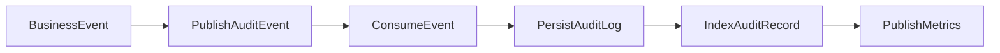
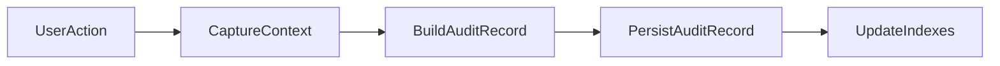
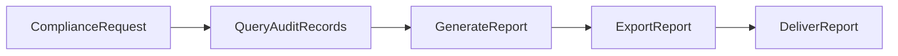
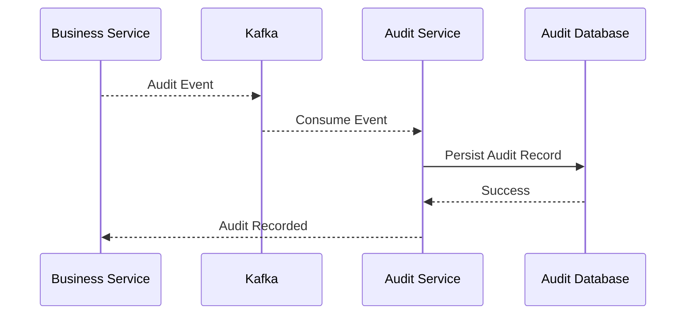
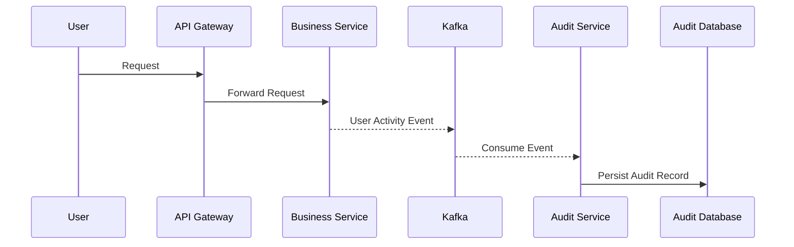
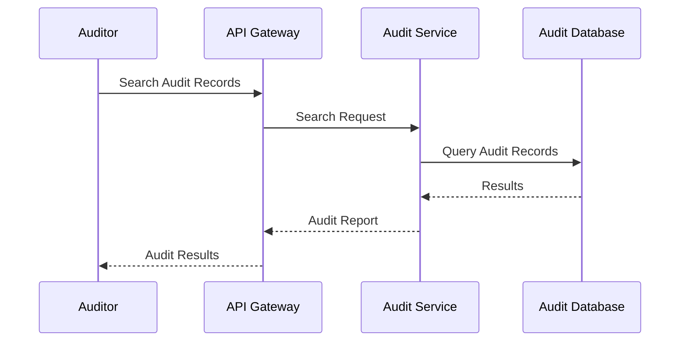

# FRD-011: Audit & Compliance Management

## 1. Title Page

| Field         | Value                                    |
| ------------- | ---------------------------------------- |
| Project Name  | Distributed Hub and Sales (DHS) Platform |
| Document ID   | FRD-011                                  |
| Service Name  | Audit Service                            |
| Domain        | Audit & Compliance Management            |
| Document Type | Functional Requirements Document         |
| Version       | v1.1.0                                   |
| Author        | Sachin Salunke                           |
| Status        | Draft                                    |
| Date          | 2026-06-20                               |

---

# 2. Document Metadata

| Field          | Value                            |
| -------------- | -------------------------------- |
| Document ID    | FRD-011                          |
| Domain         | Audit & Compliance Management    |
| Document Type  | Functional Requirements Document |
| Version        | v1.1.0                           |
| Author         | Sachin Salunke                   |
| Status         | Draft                            |
| Date           | 2026-06-20                       |
| Linked BRD     | BRD-001                          |
| Linked PRD     | PRD-001                          |
| Linked SRS     | SRS-001                          |
| Linked HLD     | HLD-001                          |
| Linked RTM     | RTM-001                          |
| Linked CONTEXT | CONTEXT-001                      |
| Linked DOMAIN  | DOMAIN-001                       |
| Linked ADRs    | ADR-001 to ADR-007               |

---

# 3. Revision History

| Version | Date       | Author         | Description                                                                     |
| ------- | ---------- | -------------- | ------------------------------------------------------------------------------- |
| v1.0.0  | 2026-06-19 | Sachin Salunke | Initial Audit & Compliance functional specification                             |
| v1.1.0  | 2026-06-20 | Sachin Salunke | Updated for Cloud-Native Monorepo-Based Multi-Module Microservices Architecture |

---

# 4. References

| Reference ID | Document                                               |
| ------------ | ------------------------------------------------------ |
| BRD-001      | Business Requirements Document                         |
| PRD-001      | Product Requirements Document                          |
| SRS-001      | Software Requirements Specification                    |
| HLD-001      | High-Level Design                                      |
| RTM-001      | Requirements Traceability Matrix                       |
| CONTEXT-001  | System Context Document                                |
| DOMAIN-001   | Domain Model                                           |
| ADR-001      | Monorepo-Based Multi-Module Microservices Architecture |
| ADR-002      | Database per Service Strategy                          |
| ADR-003      | Hybrid Communication Architecture                      |
| ADR-004      | Service Discovery Architecture                         |
| ADR-005      | API Gateway Strategy                                   |
| ADR-006      | Saga-Based Distributed Transaction Strategy            |
| ADR-007      | Security Architecture                                  |

---

# 5. Sign-Off Table

| Role               | Name           | Status  |
| ------------------ | -------------- | ------- |
| Product Owner      | Sachin Salunke | Pending |
| Solution Architect | Sachin Salunke | Pending |
| Technical Lead     | TBD            | Pending |
| Security Lead      | TBD            | Pending |
| Compliance Lead    | TBD            | Pending |

---

# 6. Functional Overview

The Audit Service provides centralized audit logging, compliance tracking, security event recording, and operational traceability capabilities for the DHS Platform.

Responsibilities:

* Audit Event Collection
* Audit Log Management
* Security Event Logging
* Compliance Event Management
* User Activity Tracking
* API Activity Logging
* Data Change Tracking
* System Activity Monitoring
* Audit Reporting
* Compliance Reporting
* Audit Data Retention Management

The service acts as the centralized system of record for platform observability, compliance, and forensic investigations.

The Audit Service supports:

* Identity & Access Management
* Branch Management
* Customer Management
* Product Management
* Inventory Management
* Order Management
* Billing Management
* Dispatch Management
* Notification Management
* Reporting & Analytics

---

## Implementation Characteristics

* Cloud-Native Architecture
* Monorepo-Based Multi-Module Maven Structure
* Independently Deployable Microservice
* Database per Service
* API Gateway Integration
* Service Discovery Integration
* Event-Driven Architecture
* Kafka Integration
* Asynchronous Processing
* JWT Authentication and RBAC Authorization
* Distributed Tracing and Observability

---

# 7. Service Ownership

## Owning Service

```text id="audsvc1"
audit-service
```

---

## Database

```text id="audsvc2"
audit-db
```

---

## Platform Dependencies

* API Gateway
* Service Discovery
* Kafka
* Redis
* Observability Platform

---

## Service Dependencies

### Asynchronous Dependencies

* iam-service
* branch-service
* customer-service
* product-service
* inventory-service
* order-service
* billing-service
* dispatch-service
* notification-service
* reporting-service

---

# 8. Functional Requirements

## FR-AUD-001

### Requirement Name

Capture Audit Events

### Description

The system shall capture audit events from all platform services.

### Priority

Critical

---

## FR-AUD-002

### Requirement Name

Maintain Audit Logs

### Description

The system shall maintain immutable audit logs.

### Priority

Critical

---

## FR-AUD-003

### Requirement Name

Track User Activities

### Description

The system shall track user activities across all services.

### Priority

Critical

---

## FR-AUD-004

### Requirement Name

Track API Activities

### Description

The system shall record API request and response activities.

### Priority

High

---

## FR-AUD-005

### Requirement Name

Capture Security Events

### Description

The system shall record authentication and authorization activities.

### Priority

Critical

---

## FR-AUD-006

### Requirement Name

Track Data Changes

### Description

The system shall record business entity changes.

### Priority

Critical

---

## FR-AUD-007

### Requirement Name

Generate Audit Reports

### Description

The system shall provide audit reports and search capabilities.

### Priority

High

---

## FR-AUD-008

### Requirement Name

Generate Compliance Reports

### Description

The system shall provide compliance reports.

### Priority

High

---

## FR-AUD-009

### Requirement Name

Manage Audit Retention

### Description

The system shall manage audit data retention policies.

### Priority

High

---

## FR-AUD-010

### Requirement Name

Support Forensic Investigations

### Description

The system shall support forensic investigations through traceability and event correlation.

### Priority

High

---

# 9. User Roles

| Role                   | Responsibilities                       |
| ---------------------- | -------------------------------------- |
| Super Admin            | Platform audit administration          |
| Company Admin          | Operational audit visibility           |
| Security Administrator | Security monitoring and investigations |
| Compliance Officer     | Compliance reporting                   |
| Auditor                | Audit search and reporting             |

---

# 10. Business Rules

## BR-AUD-001

All business services shall publish audit events.

---

## BR-AUD-002

Audit logs shall be immutable.

---

## BR-AUD-003

Audit records shall contain correlation identifiers.

---

## BR-AUD-004

Audit records shall be timestamped.

---

## BR-AUD-005

Audit records shall support traceability across services.

---

## BR-AUD-006

Sensitive information shall be masked.

---

## BR-AUD-007

Audit retention policies shall be configurable.

---

## BR-AUD-008

Audit data ownership belongs exclusively to Audit Service.

---

## BR-AUD-009

Cross-service communication shall occur through published domain events.

---

# 11. Functional Workflows

## Audit Event Collection Workflow



---

## User Activity Tracking Workflow



---

## Compliance Reporting Workflow



---

# 12. Functional Flow

## Audit Event Flow



---

## User Activity Tracking Flow



---

## Audit Search Flow



---

# 13. Service Communication

## Synchronous Communication

Technologies:

* REST APIs
* Service Discovery

Used For:

* Audit Search
* Audit Reporting
* Compliance Reporting
* Investigation Queries

---

## Asynchronous Communication

Technologies:

* Apache Kafka
* Domain Events
* Consumer Groups
* Dead Letter Topics

Used For:

* Audit Event Collection
* Security Event Logging
* User Activity Tracking
* Compliance Events
* Metrics Aggregation

# 14. Published Events

## Audit Lifecycle Events

```text id="audevt1"
AuditRecorded
AuditUpdated
AuditArchived
AuditRetentionApplied
```

---

## User Activity Events

```text id="audevt2"
UserActivityRecorded
UserLoginRecorded
UserLogoutRecorded
UserActionRecorded
```

---

## Security Events

```text id="audevt3"
AuthenticationSuccess
AuthenticationFailure
AuthorizationFailure
AccessDenied
SecurityViolationDetected
AccountLocked
PasswordChanged
PasswordReset
```

---

## Compliance Events

```text id="audevt4"
ComplianceReportGenerated
ComplianceViolationDetected
ComplianceCheckCompleted
RetentionPolicyApplied
```

---

## Investigation Events

```text id="audevt5"
InvestigationInitiated
InvestigationCompleted
EvidenceExported
AuditDataExported
```

---

# 15. Consumed Events

## IAM Events

```text id="audevt6"
UserCreated
UserUpdated
UserDisabled
RoleAssigned
PasswordChanged
UserAuthenticated
```

---

## Branch Events

```text id="audevt7"
BranchCreated
BranchUpdated
BranchActivated
BranchDeactivated
```

---

## Customer Events

```text id="audevt8"
CustomerCreated
CustomerUpdated
CustomerActivated
CustomerDeactivated
```

---

## Product Events

```text id="audevt9"
ProductCreated
ProductUpdated
ProductDeleted
PriceUpdated
```

---

## Inventory Events

```text id="audevt10"
StockReserved
StockReleased
StockAdjusted
InventoryUpdated
```

---

## Order Events

```text id="audevt11"
OrderCreated
OrderUpdated
OrderCancelled
OrderCompleted
BackOrderCreated
```

---

## Billing Events

```text id="audevt12"
InvoiceGenerated
PartialInvoiceGenerated
InvoiceCancelled
CreditNoteGenerated
```

---

## Dispatch Events

```text id="audevt13"
ShipmentCreated
ShipmentDispatched
ShipmentDelivered
DeliveryConfirmed
```

---

## Notification Events

```text id="audevt14"
NotificationSent
NotificationFailed
```

---

## Reporting Events

```text id="audevt15"
ReportGenerated
DashboardViewed
AnalyticsGenerated
```

---

# 16. APIs

## Audit APIs

```text id="audapi1"
GET /api/v1/audits
GET /api/v1/audits/{id}
POST /api/v1/audits/search
POST /api/v1/audits/export
```

---

## User Activity APIs

```text id="audapi2"
GET /api/v1/audits/users
GET /api/v1/audits/users/{userId}
GET /api/v1/audits/users/{userId}/activities
```

---

## Security APIs

```text id="audapi3"
GET /api/v1/security/events
GET /api/v1/security/events/{id}
POST /api/v1/security/events/search
```

---

## Compliance APIs

```text id="audapi4"
GET /api/v1/compliance/reports
POST /api/v1/compliance/reports/generate
GET /api/v1/compliance/reports/{id}
```

---

## Investigation APIs

```text id="audapi5"
POST /api/v1/investigations
GET /api/v1/investigations
GET /api/v1/investigations/{id}
POST /api/v1/investigations/{id}/export
```

---

# 17. Screen Requirements

## Audit Dashboard

Fields:

* Audit Id
* Event Type
* Service Name
* User
* Timestamp
* Status

Actions:

* View
* Search
* Filter
* Export

---

## User Activity Screen

Fields:

* User Id
* Username
* Activity Type
* Service Name
* Timestamp
* Correlation Id

Actions:

* Search
* View Details
* Export

---

## Security Dashboard

Fields:

* Security Event
* Severity
* Service Name
* User
* Timestamp
* Status

Actions:

* Search
* View
* Export

---

## Compliance Dashboard

Fields:

* Compliance Report
* Generated Date
* Report Type
* Status
* Export Format

Actions:

* Generate
* View
* Download

---

## Investigation Dashboard

Fields:

* Investigation Id
* Investigation Name
* Start Date
* Status
* Evidence Count

Actions:

* Create
* Search
* View
* Export

---

# 18. Field Validations

## Event Type

* Required
* Must be a supported event type

---

## Service Name

* Required
* Must be a registered platform service

---

## User Id

* Required for user activity events
* Must exist

---

## Correlation Id

* Required
* Must be UUID format

---

## Timestamp

* Required
* UTC format
* Immutable

---

## Export Format

Supported formats:

* PDF
* Excel
* CSV
* JSON

---

# 19. Exception Scenarios

## Audit Record Not Found

Response:

```text id="audexc1"
Audit record does not exist.
```

---

## Invalid Search Criteria

Response:

```text id="audexc2"
Search criteria is invalid.
```

---

## Compliance Report Generation Failed

Response:

```text id="audexc3"
Unable to generate compliance report.
```

---

## Investigation Not Found

Response:

```text id="audexc4"
Investigation does not exist.
```

---

## Export Failed

Response:

```text id="audexc5"
Unable to export audit data.
```

---

## Unauthorized Access

Response:

```text id="audexc6"
Access denied.
```

---

# 20. Audit Requirements

Audit Events:

```text id="audaudit1"
AUDIT_RECORDED
AUDIT_SEARCHED
AUDIT_EXPORTED
USER_ACTIVITY_RECORDED
SECURITY_EVENT_RECORDED
COMPLIANCE_REPORT_GENERATED
INVESTIGATION_CREATED
INVESTIGATION_COMPLETED
AUDIT_ARCHIVED
RETENTION_POLICY_APPLIED
```

---

# 21. Reporting Requirements

Standard Reports:

* User Activity Report
* Security Events Report
* Authentication Report
* Authorization Report
* Compliance Report
* Audit Trail Report
* API Activity Report
* System Activity Report

---

Investigation Reports:

* Incident Investigation Report
* Security Violation Report
* User Access Report
* Data Change Report
* Forensic Evidence Report

---

Compliance Reports:

* Audit Retention Report
* Regulatory Compliance Report
* Security Compliance Report
* Operational Compliance Report

---

# 22. High-Level Data Entities

## Audit Record

```text id="audent1"
AuditRecord
├── AuditId
├── EventType
├── ServiceName
├── UserId
├── CorrelationId
├── Payload
├── Timestamp
└── Status
```

---

## User Activity

```text id="audent2"
UserActivity
├── ActivityId
├── UserId
├── ActivityType
├── ServiceName
├── CorrelationId
├── Timestamp
└── Status
```

---

## Security Event

```text id="audent3"
SecurityEvent
├── EventId
├── EventType
├── Severity
├── ServiceName
├── UserId
├── CorrelationId
└── Timestamp
```

---

## Compliance Report

```text id="audent4"
ComplianceReport
├── ReportId
├── ReportType
├── GeneratedAt
├── Status
└── FileReference
```

---

## Investigation

```text id="audent5"
Investigation
├── InvestigationId
├── Name
├── Status
├── StartedAt
├── CompletedAt
└── EvidenceReference
```

---

## Data Ownership

Audit Service exclusively owns:

* AuditRecord
* UserActivity
* SecurityEvent
* ComplianceReport
* Investigation

---

# 23. Non-Functional Requirements

* JWT Authentication
* RBAC Authorization
* TLS 1.3
* API Gateway Integration
* Service Discovery
* Distributed Tracing
* Correlation IDs
* Structured Logging
* Horizontal Scalability
* High Availability
* Retry Policies
* Event Idempotency
* Immutable Audit Storage
* Configurable Retention Policies
* Database per Service
* Independent Deployments
* Observability Integration
* Dead Letter Topic Support
* Compliance and Forensic Readiness

---

# 24. Success Criteria

* Audit events are captured from all services.
* User activities are traceable across the platform.
* Security events are recorded successfully.
* Compliance reports are generated successfully.
* Investigation workflows support forensic analysis.
* Audit data remains immutable and searchable.
* Audit reports are generated successfully.
* Audit Service registers successfully with Service Discovery.
* Audit APIs are accessible through API Gateway.
* Audit events are consumed successfully from Kafka.
* Distributed tracing is available for audit workflows.
* Audit Service remains independently deployable.

---

# 25. Traceability

| BR     | FR         |
| ------ | ---------- |
| BR-011 | FR-AUD-001 |
| BR-011 | FR-AUD-002 |
| BR-011 | FR-AUD-003 |
| BR-011 | FR-AUD-004 |
| BR-011 | FR-AUD-005 |
| BR-011 | FR-AUD-006 |
| BR-011 | FR-AUD-007 |
| BR-011 | FR-AUD-008 |
| BR-011 | FR-AUD-009 |
| BR-011 | FR-AUD-010 |

---

