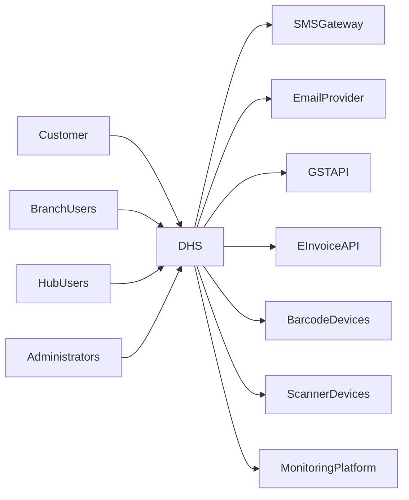
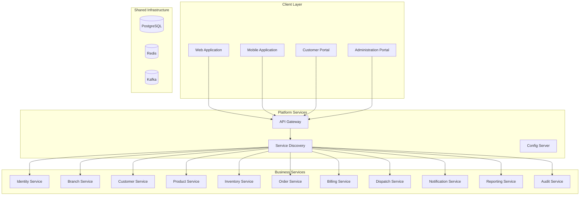
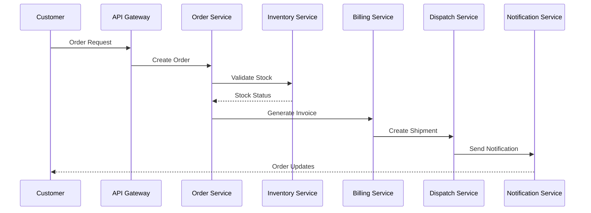
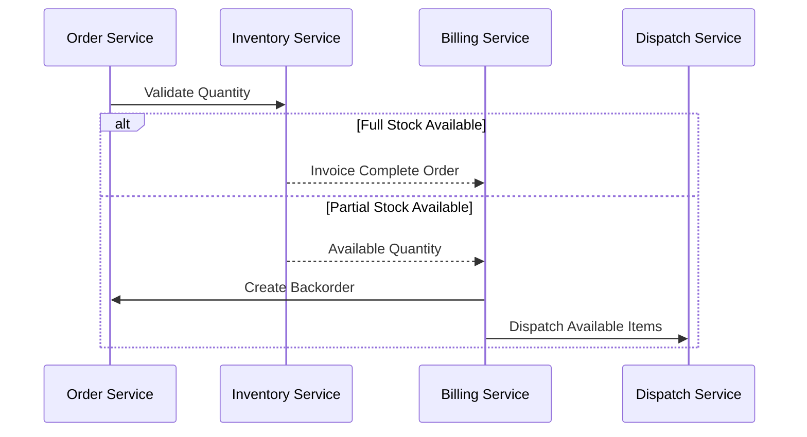
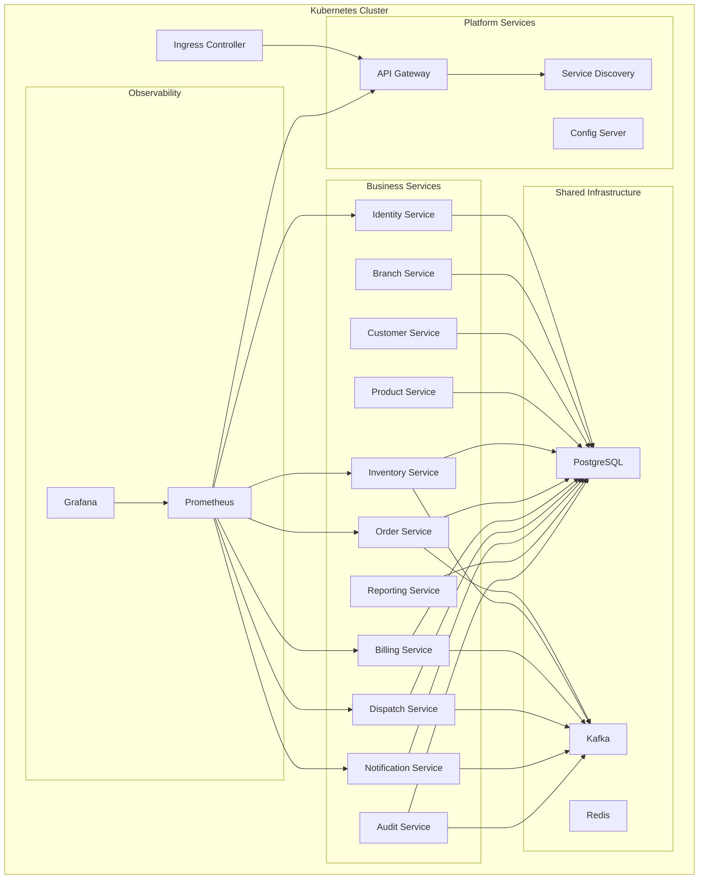

# HLD-001: Distributed Hub and Sales (DHS) Platform

## 1. Title Page

| Field         | Value                                    |
| ------------- | ---------------------------------------- |
| Project Name  | Distributed Hub and Sales (DHS) Platform |
| Document ID   | HLD-001                                  |
| Domain        | OMS / Electronic Distribution Platform   |
| Document Type | High-Level Design (HLD)                  |
| Version       | v1.1.0                                   |
| Author        | Sachin Salunke                           |
| Status        | Draft                                    |
| Date          | 2026-06-20                               |

---

# 2. Document Metadata

| Field           | Value                                  |
| --------------- | -------------------------------------- |
| Document ID     | HLD-001                                |
| Domain          | OMS / Electronic Distribution Platform |
| Document Type   | High-Level Design                      |
| Version         | v1.1.0                                 |
| Author          | Sachin Salunke                         |
| Status          | Draft                                  |
| Date            | 2026-06-20                             |
| Linked BRD      | BRD-001                                |
| Linked PRD      | PRD-001                                |
| Linked SRS      | SRS-001                                |
| Linked RTM      | RTM-001                                |
| Linked Epic     | EPIC-DHS-001 Platform Foundation       |
| Approval Status | Pending                                |

---

# 3. Revision History

| Version | Date       | Author         | Description                                                                                           |
| ------- | ---------- | -------------- | ----------------------------------------------------------------------------------------------------- |
| v1.0.0  | 2026-06-19 | Sachin Salunke | Initial architecture baseline                                                                         |
| v1.1.0  | 2026-06-20 | Sachin Salunke | Updated architecture baseline for cloud-native monorepo-based multi-module microservices architecture |

---

# 4. References

| Reference ID | Document                                               |
| ------------ | ------------------------------------------------------ |
| BRD-001      | Business Requirements Document                         |
| PRD-001      | Product Requirements Document                          |
| SRS-001      | Software Requirements Specification                    |
| RTM-001      | Requirements Traceability Matrix                       |
| ADR-001      | Monorepo-Based Multi-Module Microservices Architecture |
| ADR-002      | Database Strategy Decision                             |
| ADR-003      | Inter-Service Communication Strategy                   |
| ADR-004      | Service Discovery Strategy                             |
| ADR-005      | API Gateway Strategy                                   |
| ADR-006      | Distributed Transaction Strategy                       |

---

# 5. Sign-Off Table

| Role                 | Name           | Status  |
| -------------------- | -------------- | ------- |
| Product Owner        | Sachin Salunke | Pending |
| Enterprise Architect | Sachin Salunke | Pending |
| Solution Architect   | Sachin Salunke | Pending |
| Technical Lead       | TBD            | Pending |
| Security Lead        | TBD            | Pending |
| DevOps Lead          | TBD            | Pending |

---

# 6. Introduction

## 6.1 Purpose

The Distributed Hub and Sales (DHS) Platform is a cloud-native Order Management System designed for electronic distribution businesses operating with a centralized hub and multiple branches.

The platform is implemented using a Monorepo-Based Multi-Module Microservices Architecture that provides:

* Real-time inventory visibility
* Centralized order management
* Billing and dispatch operations
* Customer order tracking
* Operational reporting and analytics
* Audit and compliance capabilities
* Centralized API management
* Service registration and discovery
* Distributed service communication
* Observability and monitoring capabilities
* Independent service deployment and scalability

---

## 6.2 Architectural Goals

### AG-001

Provide a single source of truth.

### AG-002

Support real-time inventory visibility.

### AG-003

Provide highly available and scalable architecture.

### AG-004

Support event-driven business processes.

### AG-005

Enable secure multi-user operations.

### AG-006

Support future business growth and extensibility.

### AG-007

Provide centralized API management capabilities.

### AG-008

Enable service registration and discovery.

### AG-009

Support independent service deployment and scaling.

### AG-010

Provide observability and distributed tracing capabilities.

---

# 7. Architecture Principles

## Business Principles

* Centralized operations
* Real-time information visibility
* Single source of truth
* Process standardization
* Business capability ownership
* Operational transparency

---

## Application Principles

* Microservices architecture
* Domain-driven service boundaries
* Stateless services
* API-first design
* Independent deployability
* Shared platform capabilities
* Contract-first integration
* Service autonomy

---

## Data Principles

* Database per service
* Event-driven synchronization
* Service ownership of data
* No direct cross-service database access
* Immutable audit logs
* Data consistency through events
* Auditability

---

## Technology Principles

* Cloud-native architecture
* Monorepo source control strategy
* Multi-module Maven build strategy
* Container-first deployment
* Infrastructure automation
* Configuration externalization
* Observability by default
* Security by design

---

# 8. Technology Stack

| Layer                 | Technology                         |
| --------------------- | ---------------------------------- |
| Language              | Java 21                            |
| Framework             | Spring Boot 3.x                    |
| Build Tool            | Maven                              |
| Repository Strategy   | Monorepo                           |
| Build Structure       | Multi-Module Maven                 |
| API Gateway           | Spring Cloud Gateway               |
| Service Discovery     | Netflix Eureka                     |
| Service Communication | OpenFeign + REST                   |
| Event Streaming       | Apache Kafka                       |
| Security              | Spring Security                    |
| Authentication        | JWT                                |
| Authorization         | RBAC                               |
| Database              | PostgreSQL                         |
| Cache                 | Redis                              |
| Configuration         | Spring Cloud Config                |
| Documentation         | OpenAPI                            |
| Distributed Tracing   | Micrometer Tracing + OpenTelemetry |
| Monitoring            | Prometheus                         |
| Visualization         | Grafana                            |
| Logging               | Structured JSON Logging            |
| Containerization      | Docker                             |
| Orchestration         | Kubernetes                         |
| CI/CD                 | GitHub Actions                     |

---

# 9. System Context



---

# 10. Architectural Style

## Architecture Pattern

Cloud-Native Monorepo-Based Multi-Module Microservices Architecture

Characteristics:

* Single source repository (Monorepo)
* Multi-module Maven build structure
* Independently deployable services
* API Gateway entry point
* Service registration and discovery
* Shared platform libraries
* Database per service
* Event-driven communication
* API-first integration model
* Configuration externalization
* Observability by default
* Horizontal scalability
* Service autonomy

---

# 11. High-Level System Architecture



---

# 12. Business Service Decomposition

## Identity Service

Responsibilities:

* Authentication
* Authorization
* User Management
* Role Management
* Permission Management
* Session Management
* Token Management

---

## Branch Service

Responsibilities:

* Branch Registration
* Branch Configuration
* Branch Lifecycle Management
* Branch Status Management
* Branch Hierarchy Management

---

## Customer Service

Responsibilities:

* Customer Registration
* Customer Profiles
* Customer Addresses
* Customer Search
* Customer Status Management

---

## Product Service

Responsibilities:

* Product Management
* Categories
* Pricing
* Product Attributes
* Product Search
* Product Availability

---

## Inventory Service

Responsibilities:

* Stock Management
* Reservations
* Adjustments
* Stock Movements
* Barcode Operations
* Inventory Auditing

---

## Order Service

Responsibilities:

* Order Creation
* Order Validation
* Order Tracking
* Order Lifecycle Management
* Backorder Management
* Order State Management

---

## Billing Service

Responsibilities:

* Invoice Generation
* Partial Billing
* Tax Calculation
* Payment Management
* E-Invoicing
* Billing Auditing

---

## Dispatch Service

Responsibilities:

* Shipment Creation
* Shipment Tracking
* Delivery Confirmation
* Dispatch Lifecycle Management
* Carrier Integration

---

## Notification Service

Responsibilities:

* SMS Notifications
* Email Notifications
* Event Notifications
* Template Management
* Notification Tracking

---

## Reporting Service

Responsibilities:

* Operational Dashboards
* KPI Reporting
* Analytics
* Metrics
* Data Aggregation

---

## Audit Service

Responsibilities:

* Audit Logging
* Compliance Tracking
* Security Auditing
* Event Archiving
* Operational Auditing

---

# 13. Order Processing Architecture



# 14. Partial Billing Architecture



---

# 15. Data Architecture

## Service Data Ownership Model

| Service              | Owns                                |
| -------------------- | ----------------------------------- |
| Identity Service     | Users, Roles, Permissions, Sessions |
| Branch Service       | Branches, Branch Configuration      |
| Customer Service     | Customers, Customer Addresses       |
| Product Service      | Products, Categories, Pricing       |
| Inventory Service    | Stocks, Reservations, Adjustments   |
| Order Service        | Orders, Order Items, Backorders     |
| Billing Service      | Invoices, Payments, Taxes           |
| Dispatch Service     | Shipments, Delivery Confirmations   |
| Notification Service | Notification Logs, Templates        |
| Reporting Service    | Aggregated Metrics, Reports         |
| Audit Service        | Audit Events, Compliance Logs       |

---

## Data Principles

* Single ownership of data
* Database per service
* Event-driven synchronization
* Immutable audit logs
* No direct cross-service database access
* Data consistency through events
* Read-only cross-service projections where required
* Service-owned schema evolution

---

# 16. Communication Architecture

## Synchronous Communication

Technology:

* Spring Cloud Gateway
* Netflix Eureka
* OpenFeign
* REST APIs
* OpenAPI Contracts

Used For:

* Authentication
* Master Data Queries
* Search Operations
* Reporting Queries
* Service-to-Service Communication
* Configuration Retrieval

### Communication Pattern

```text
Client
   ↓
API Gateway
   ↓
Service Discovery
   ↓
Target Service
```

---

## Asynchronous Communication

Technology:

* Apache Kafka

Used For:

* Order Events
* Inventory Events
* Billing Events
* Dispatch Events
* Notification Events
* Audit Events
* Reporting Events

### Event Communication Pattern

```text
Producer Service
        ↓
Kafka Topic
        ↓
Consumer Service
```

### Example Topics

```text
order-created
order-updated
inventory-reserved
inventory-adjusted
invoice-generated
shipment-created
notification-sent
audit-created
```

---

# 17. Security Architecture

## Authentication

* JWT Authentication
* Access Tokens
* Refresh Tokens
* Token Validation at Gateway
* Service-to-Service Token Propagation

---

## Authorization

* RBAC
* Permission-Based Access
* Endpoint-Level Authorization
* Method-Level Authorization
* Service-Level Authorization

---

## Transport Security

* TLS 1.3
* HTTPS-only communication
* Secure Inter-Service Communication

---

## Security Controls

* Gateway Authentication Filters
* Gateway Authorization Filters
* Input Validation
* SQL Injection Protection
* XSS Protection
* CSRF Protection
* Rate Limiting
* Correlation ID Propagation
* Structured Audit Logging
* Secrets Externalization
* Configuration Encryption

---

# 18. Non-Functional Architecture

## Availability

* Availability SLA: 99.9%
* Health Monitoring
* Self-Healing Deployments
* Automatic Service Recovery

---

## Performance

* Standard API Response: < 200 ms
* Service Discovery Response: < 50 ms
* Configuration Retrieval: < 100 ms
* Horizontal Service Scalability
* Event Processing Throughput Support

---

## Scalability

* Independent service deployment
* Independent service scaling
* Horizontal service scaling
* Stateless application services
* Independent resource allocation
* Dynamic service registration

---

## Reliability

* Retry mechanisms
* Failure recovery
* Circuit breaker support
* Dead letter queues
* Event replay capabilities
* Graceful degradation
* Fallback mechanisms

---

## Maintainability

* Microservices architecture
* Domain-driven service boundaries
* API-first approach
* Shared platform libraries
* Configuration externalization
* Contract-first communication
* Observability by default

---

## Observability

* Distributed tracing
* Metrics collection
* Structured logging
* Health indicators
* Correlation ID propagation
* Performance monitoring
* Service dependency visibility

---

# 19. Deployment Architecture



---

# 20. Architecture Risks

| Risk                           | Impact | Mitigation                               |
| ------------------------------ | ------ | ---------------------------------------- |
| Service communication failures | High   | Retry mechanisms and circuit breakers    |
| Database bottlenecks           | Medium | Database optimization and caching        |
| Integration outages            | Medium | Fallback mechanisms and retries          |
| Increased transaction volume   | Medium | Independent horizontal service scaling   |
| Event processing failures      | Medium | Dead letter queues and replay mechanisms |
| Service discovery failures     | Medium | High availability Eureka deployment      |
| Configuration failures         | Medium | Configuration versioning and fallback    |
| Distributed tracing overhead   | Low    | Sampling and metrics optimization        |

---

# 21. Architecture Constraints

* Distributed services operating under centralized business governance.
* Cloud-native deployment model.
* Regulatory requirements for GST and E-Invoicing.
* Event-driven business workflows.
* Future multi-branch scalability requirements.
* Services shall communicate only through APIs or events.
* No direct cross-service database access.
* All external traffic shall enter through API Gateway.
* Configuration shall be externally managed.

---

# 22. Architecture Success Criteria

* Real-time inventory visibility.
* Centralized order lifecycle management.
* API response times below 200 ms.
* Platform availability above 99.9%.
* Successful partial billing support.
* Complete auditability of business transactions.
* Services can be deployed independently.
* Service discovery operates successfully.
* Gateway successfully routes requests.
* Platform observability provides end-to-end traceability.
* Services communicate through standardized APIs and events.
* Independent scaling of business services.
* Support for future business growth without architectural redesign.

---

# Architecture Summary

```text
Architecture Style:
Cloud-Native Monorepo-Based Multi-Module Microservices Architecture

Repository Strategy:
Monorepo

Build Strategy:
Multi-Module Maven

Platform Services:
- API Gateway
- Service Discovery
- Configuration Server

Business Services:
- Identity Service
- Branch Service
- Customer Service
- Product Service
- Inventory Service
- Order Service
- Billing Service
- Dispatch Service
- Notification Service
- Reporting Service
- Audit Service

Communication:
- REST
- OpenFeign
- Kafka Events

Data Strategy:
- Database per Service
- Event-Driven Synchronization

Deployment:
- Docker
- Kubernetes

Observability:
- Prometheus
- Grafana
- Distributed Tracing
- Structured Logging
- Metrics Collection
```
