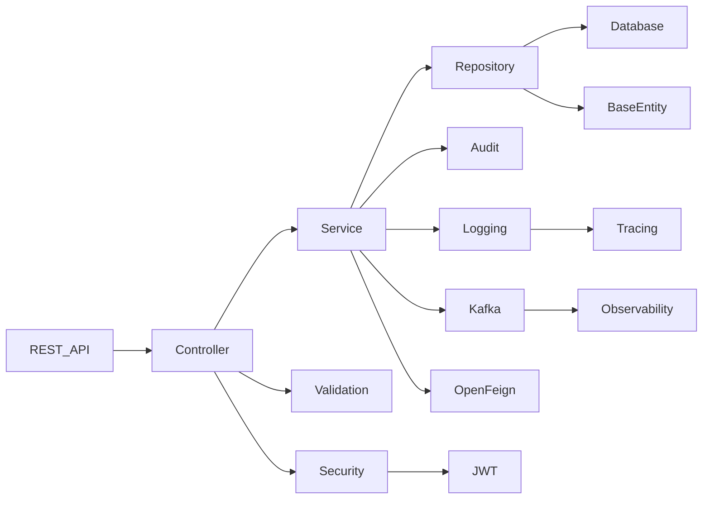
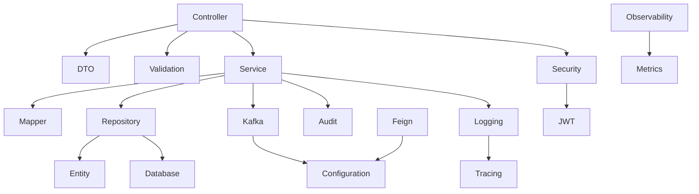
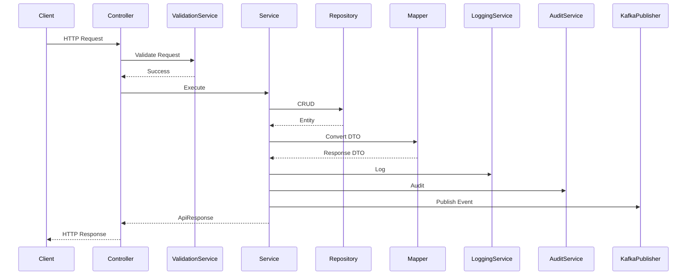
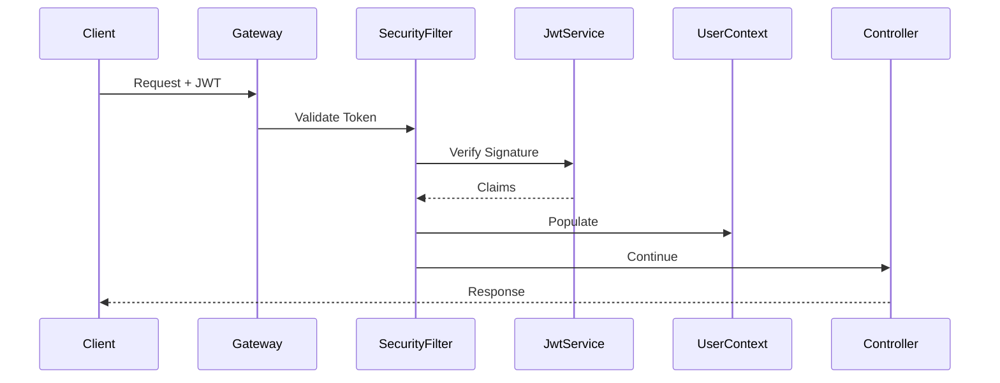
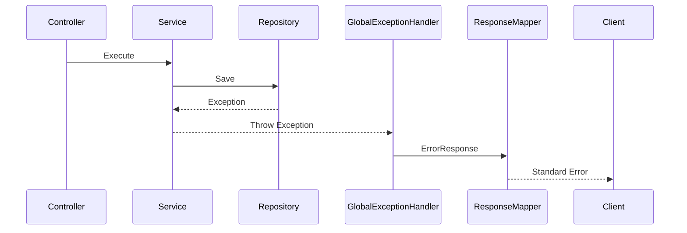
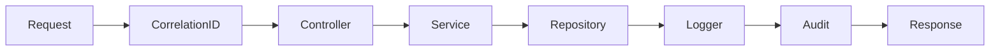
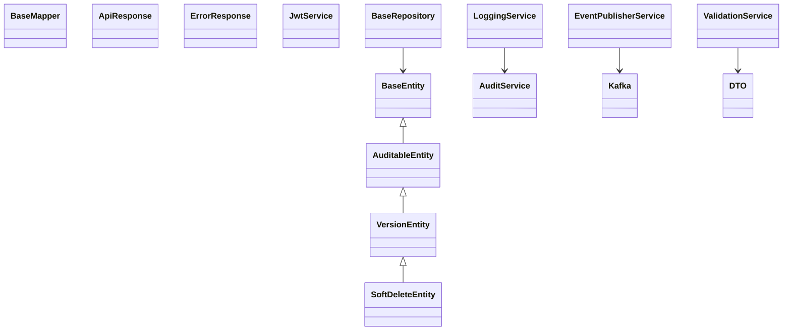
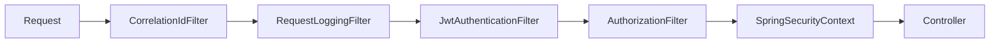
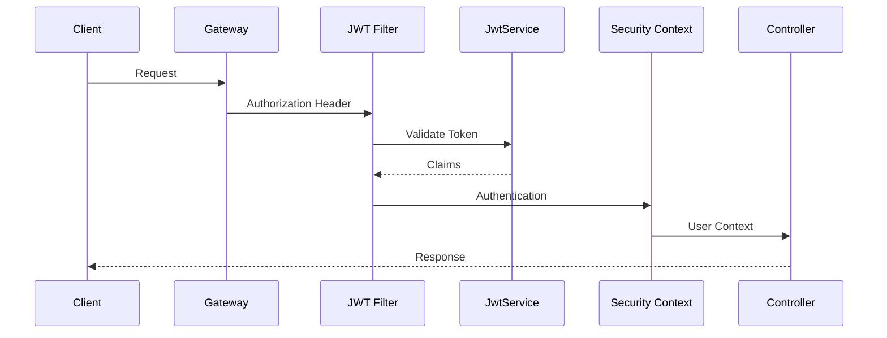
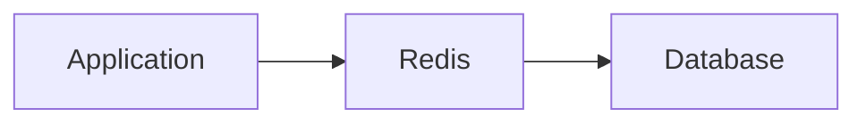

# LLD-001: Platform Foundation

## Part 1 – Architecture, Package Structure, Maven Modules, Layered Design, Component Diagram & Package Diagram

---

# 1. Document Information

| Field | Value |
|--------|-------|
| Project | Distributed Hub & Sales (DHS) Platform |
| Service | Platform Foundation |
| Document | Low Level Design |
| Document ID | LLD-001 |
| Repository | starone-dhs-platform |
| Module | platform-foundation |
| Version | v1.0.0 |
| Status | Draft |
| Standard | IEEE 1016 |
| Owner | Enterprise Architecture |

---

# 2. Purpose

This document defines the implementation design for the **Platform Foundation**.

Unlike business services, Platform Foundation is **not a domain service**.

It provides reusable libraries used by every DHS microservice.

This LLD translates **SRS-001** into implementation-level architecture.

---

# 3. Scope

Platform Foundation provides:

- Common DTOs
- Base Entities
- Exception Framework
- Error Response Models
- Security Libraries
- JWT Support
- Audit Utilities
- Logging Framework
- Correlation ID
- OpenFeign Configuration
- Kafka Configuration
- Observability
- Validation Framework
- Constants
- Utility Classes
- Common Configuration
- Response Wrapper
- Pagination Models

Platform Foundation shall not contain any business logic.

---

# 4. Design Principles

The Platform Foundation shall comply with the following principles.

---

## DP-001

Shared libraries only.

---

## DP-002

No business rules.

---

## DP-003

No business entities.

---

## DP-004

Stateless implementation.

---

## DP-005

Reusable across every service.

---

## DP-006

Spring Boot Auto Configuration.

---

## DP-007

Convention over configuration.

---

## DP-008

Backward compatible.

---

# 5. High Level Package Structure

```text
platform-foundation
│
├── api
├── audit
├── config
├── constants
├── context
├── dto
├── entity
├── enums
├── exception
├── feign
├── kafka
├── logging
├── mapper
├── metrics
├── pagination
├── response
├── security
├── tracing
├── util
└── validation
```

---

# 6. Maven Module Structure

```text
platform-foundation
│
├── foundation-api
├── foundation-security
├── foundation-kafka
├── foundation-feign
├── foundation-audit
├── foundation-logging
├── foundation-validation
├── foundation-observability
├── foundation-common
└── foundation-starter
```

---

## Module Responsibilities

| Module | Responsibility |
|----------|----------------|
| foundation-api | Common REST Models |
| foundation-security | JWT & Security |
| foundation-kafka | Kafka Infrastructure |
| foundation-feign | OpenFeign Configuration |
| foundation-audit | Audit Utilities |
| foundation-logging | Logging Framework |
| foundation-validation | Validation Library |
| foundation-observability | Metrics & Tracing |
| foundation-common | Utilities |
| foundation-starter | Auto Configuration |

---

# 7. Layered Architecture

Every DHS microservice shall inherit the following architecture.

```text
REST API

↓

Controller Layer

↓

Service Layer

↓

Domain Layer

↓

Repository Layer

↓

Database
```

Platform Foundation provides reusable components for each layer.

---

# 8. Package Design

## api

```text
api
│
├── request
├── response
└── pagination
```

Purpose

Reusable API models.

---

## audit

```text
audit
│
├── annotation
├── event
├── publisher
└── model
```

Purpose

Audit framework.

---

## config

```text
config
│
├── jackson
├── security
├── kafka
├── feign
├── cache
├── async
└── openapi
```

Purpose

Spring Configuration.

---

## constants

```text
constants
│
├── ErrorCodes
├── HeaderConstants
├── SecurityConstants
├── KafkaTopics
└── ApplicationConstants
```

Purpose

Application constants.

---

## context

```text
context
│
├── UserContext
├── RequestContext
└── CorrelationContext
```

Purpose

Request context.

---

## dto

```text
dto
│
├── common
├── request
└── response
```

Purpose

Reusable DTOs.

---

## entity

```text
entity
│
├── BaseEntity
├── AuditableEntity
└── VersionEntity
```

Purpose

Base JPA classes.

---

## enums

```text
enums
│
├── Status
├── ErrorType
├── AuditType
└── EventType
```

Purpose

Shared enumerations.

---

## exception

```text
exception
│
├── BusinessException
├── ValidationException
├── AuthenticationException
├── AuthorizationException
├── ResourceNotFoundException
├── ConflictException
├── GlobalExceptionHandler
└── ErrorResponseFactory
```

Purpose

Exception framework.

---

## feign

```text
feign
│
├── interceptor
├── decoder
├── encoder
└── configuration
```

Purpose

Feign support.

---

## kafka

```text
kafka
│
├── producer
├── consumer
├── configuration
├── serializer
└── event
```

Purpose

Kafka infrastructure.

---

## logging

```text
logging
│
├── aspect
├── interceptor
├── model
└── util
```

Purpose

Structured logging.

---

## mapper

```text
mapper
│
└── BaseMapper
```

Purpose

Reusable mapping utilities.

---

## metrics

```text
metrics
│
├── collector
├── registry
└── publisher
```

Purpose

Micrometer integration.

---

## pagination

```text
pagination
│
├── PageRequest
├── PageResponse
└── SortRequest
```

Purpose

Pagination models.

---

## response

```text
response
│
├── ApiResponse
├── ErrorResponse
└── SuccessResponse
```

Purpose

Standard responses.

---

## security

```text
security
│
├── jwt
├── filter
├── annotation
├── permission
├── principal
└── util
```

Purpose

Security framework.

---

## tracing

```text
tracing
│
├── interceptor
├── configuration
└── propagation
```

Purpose

Distributed tracing.

---

## util

```text
util
│
├── DateUtils
├── JsonUtils
├── StringUtils
├── NumberUtils
└── CollectionUtils
```

Purpose

Shared helper utilities.

---

## validation

```text
validation
│
├── annotation
├── validator
└── message
```

Purpose

Bean validation.

---

# 9. Component Diagram



---

# 10. Package Dependency Diagram



---

# 11. Dependency Rules

| Layer | Allowed Dependencies |
|--------|----------------------|
| Controller | Service, DTO, Validation |
| Service | Repository, Mapper, Kafka, Feign |
| Repository | Entity |
| DTO | None |
| Entity | BaseEntity |
| Kafka | Event Models |
| Security | JWT |
| Logging | Tracing |
| Validation | Bean Validation |

---

# 12. Architectural Constraints

- Controllers shall never access repositories directly.
- Services shall encapsulate all business orchestration.
- Repositories shall only handle persistence.
- DTOs shall never expose JPA entities.
- Entities shall never be returned directly by REST APIs.
- Kafka publishers shall be invoked from the service layer.
- OpenFeign clients shall be invoked only from the service layer.
- Common exceptions shall inherit from the shared exception hierarchy.
- All services shall inherit `BaseEntity` and `AuditableEntity` where applicable.
- All APIs shall return standardized `ApiResponse<T>` wrappers.

---

# 13. Coding Conventions

- Java 21
- Spring Boot 3.x
- Constructor Injection only
- Lombok for boilerplate reduction
- MapStruct for object mapping
- Jakarta Validation
- SLF4J + Logback
- Micrometer + OpenTelemetry
- OpenFeign for synchronous service calls
- Kafka for asynchronous messaging

---

# 14. Class Design

The Platform Foundation shall provide reusable base classes, interfaces, DTOs, utility classes, configuration classes, and infrastructure components.

No business-specific implementation shall exist in Platform Foundation.

---

# 15. Controller Layer Design

Platform Foundation does not expose business REST APIs.

It exposes only infrastructure endpoints through Spring Boot Actuator.

## Controllers

```text
controller
│
├── HealthController
├── InfoController
├── MetricsController
└── VersionController
```

---

## HealthController

### Responsibilities

- Health Check
- Readiness
- Liveness

### Endpoints

```text
GET /actuator/health

GET /actuator/health/liveness

GET /actuator/health/readiness
```

---

## InfoController

### Endpoints

```text
GET /actuator/info
```

---

## MetricsController

### Endpoints

```text
GET /actuator/metrics
```

---

## VersionController

### Endpoints

```text
GET /version
```

Returns

- Application Version
- Build Version
- Git Commit
- Build Timestamp

---

# 16. Service Layer Design

Platform Foundation provides reusable services.

---

## Service Classes

```text
service
│
├── JwtService
├── CorrelationIdService
├── AuditService
├── EventPublisherService
├── LoggingService
├── ValidationService
├── PaginationService
├── CacheService
└── EncryptionService
```

---

## JwtService

Responsibilities

- Token Validation
- Claims Extraction
- Expiration Validation

Methods

```java
validateToken()

extractUsername()

extractRoles()

extractClaims()

isExpired()
```

---

## CorrelationIdService

Responsibilities

- Generate Correlation ID
- Retrieve Correlation ID
- Propagate Correlation ID

Methods

```java
generate()

get()

set()
```

---

## AuditService

Responsibilities

- Publish Audit Events
- Create Audit Model
- Track Changes

Methods

```java
publish()

createAudit()

captureChanges()
```

---

## EventPublisherService

Responsibilities

- Publish Kafka Events
- Retry Publishing
- Dead Letter Queue Support

Methods

```java
publish()

publishAsync()

publishWithRetry()
```

---

## LoggingService

Responsibilities

- Structured Logging
- Business Logging
- Error Logging

Methods

```java
info()

warn()

error()

audit()
```

---

## ValidationService

Responsibilities

- Bean Validation
- Custom Validation

Methods

```java
validate()

validateObject()

validateCollection()
```

---

# 17. Repository Layer

Platform Foundation contains reusable repository interfaces only.

```text
repository
│
├── BaseRepository
└── AuditableRepository
```

---

## BaseRepository

```java
interface BaseRepository<T, ID>
```

Responsibilities

- CRUD Operations

---

## AuditableRepository

```java
interface AuditableRepository
```

Responsibilities

- Audit Support

---

# 18. DTO Design

Platform Foundation provides reusable DTOs.

---

## Request DTOs

```text
dto.request
│
├── PageRequestDTO
├── SortRequestDTO
├── SearchRequestDTO
└── FilterRequestDTO
```

---

## Response DTOs

```text
dto.response
│
├── ApiResponse
├── ErrorResponse
├── SuccessResponse
├── PageResponse
└── ValidationResponse
```

---

## ApiResponse<T>

| Field | Type |
|---------|------|
| success | Boolean |
| message | String |
| data | Generic |
| timestamp | Instant |
| correlationId | String |

---

## ErrorResponse

| Field | Type |
|---------|------|
| status | Integer |
| code | String |
| message | String |
| path | String |
| timestamp | Instant |
| correlationId | String |

---

## PageResponse

| Field | Type |
|---------|------|
| content | List<T> |
| page | Integer |
| size | Integer |
| totalElements | Long |
| totalPages | Integer |

---

# 19. Entity Design

Platform Foundation provides base entities only.

---

## BaseEntity

```java
abstract class BaseEntity
```

Attributes

| Attribute | Type |
|------------|------|
| id | UUID |

---

## AuditableEntity

Extends

```java
BaseEntity
```

Attributes

| Attribute | Type |
|------------|------|
| createdBy | UUID |
| createdAt | Instant |
| updatedBy | UUID |
| updatedAt | Instant |

---

## VersionEntity

Extends

```java
AuditableEntity
```

Attributes

| Attribute | Type |
|------------|------|
| version | Long |

Optimistic Locking support.

---

## SoftDeleteEntity

Extends

```java
VersionEntity
```

Attributes

| Attribute | Type |
|------------|------|
| deleted | Boolean |

---

# 20. Mapper Design

Platform Foundation uses MapStruct.

```text
mapper
│
├── BaseMapper
├── PageMapper
└── ResponseMapper
```

---

## BaseMapper

```java
interface BaseMapper
```

Methods

```java
toEntity()

toDto()

updateEntity()
```

---

## PageMapper

Responsibilities

- Page Conversion
- Pagination DTO Mapping

---

## ResponseMapper

Responsibilities

- Standard API Responses

---

# 21. Validation Design

```text
validation
│
├── annotation
├── validator
└── messages
```

---

## Custom Validators

```text
UUIDValidator

EmailValidator

PhoneValidator

GSTValidator

PANValidator

IFSCValidator

PasswordValidator
```

---

# 22. Exception Hierarchy

```text
RuntimeException

│

├── PlatformException

│

├── ValidationException

├── BusinessException

├── AuthenticationException

├── AuthorizationException

├── ConflictException

├── ResourceNotFoundException

├── ExternalServiceException

└── KafkaPublishingException
```

---

# 23. Request Processing Flow



---

# 24. JWT Validation Flow



---

# 25. Exception Handling Flow



---

# 26. Logging Flow



---

# 27. Class Relationships



---

# 28. Design Constraints

- Controllers shall remain stateless.
- Services shall be thread-safe.
- DTOs shall be immutable wherever practical.
- Base entities shall be inherited by domain entities.
- Exception hierarchy shall remain consistent across services.
- All REST responses shall use `ApiResponse<T>`.
- All persistence entities shall extend `AuditableEntity` or `SoftDeleteEntity` as appropriate.
- Kafka publishing shall be asynchronous unless synchronous delivery is explicitly required.
- MapStruct shall be the standard mapping framework.
- Constructor injection shall be used throughout.

---

# 29. Reusable Interfaces

```java
Auditable

Versionable

SoftDeletable

EventPublisher

CurrentUserProvider

CorrelationIdProvider

Encryptor

Decryptor
```

These interfaces shall be implemented by the Platform Foundation and reused consistently across all DHS services.

---

# 30. Security Configuration

The Platform Foundation shall provide a reusable security framework for all DHS microservices.

Every service shall inherit the same security configuration.

---

# 30.1 Security Architecture

```text
Client

↓

API Gateway

↓

JWT Authentication Filter

↓

Authorization Filter

↓

Spring Security Context

↓

REST Controller
```

---

# 30.2 Security Components

```text
security
│
├── config
│   ├── SecurityConfiguration
│   ├── CorsConfiguration
│   ├── PasswordEncoderConfiguration
│   └── MethodSecurityConfiguration
│
├── filter
│   ├── JwtAuthenticationFilter
│   ├── CorrelationIdFilter
│   ├── RequestLoggingFilter
│   └── ExceptionHandlerFilter
│
├── jwt
│   ├── JwtProvider
│   ├── JwtService
│   ├── JwtValidator
│   ├── JwtParser
│   └── JwtClaimsExtractor
│
├── principal
│   └── PlatformUserPrincipal
│
├── permission
│   ├── PermissionEvaluator
│   └── RoleHierarchy
│
└── annotation
    ├── RequirePermission
    ├── RequireRole
    └── AuditAccess
```

---

# 30.3 Security Filter Chain



---

# 30.4 Authentication Flow



---

# 30.5 JWT Claims

```json
{
  "sub":"userId",
  "username":"john.doe",
  "roles":["ADMIN"],
  "permissions":[
      "ORDER_CREATE",
      "ORDER_UPDATE"
  ],
  "tenantId":"UUID",
  "branchId":"UUID",
  "iat":1720000000,
  "exp":1720003600
}
```

---

# 31. JWT Implementation

## JwtProvider

Responsibilities

- Generate Token
- Refresh Token
- Validate Token

Methods

```java
generateToken()

refreshToken()

validateToken()

parseClaims()

extractUsername()

extractRoles()
```

---

## JwtAuthenticationFilter

Responsibilities

- Read Authorization Header
- Validate JWT
- Populate Security Context
- Continue Filter Chain

---

## PlatformUserPrincipal

Attributes

```text
User Id

Username

Roles

Permissions

Tenant Id

Branch Id
```

---

# 32. Authorization Design

Authorization shall use RBAC.

```text
User

↓

Roles

↓

Permissions

↓

REST API
```

Example

```java
@RequirePermission("ORDER_CREATE")
```

or

```java
@PreAuthorize("hasAuthority('ORDER_CREATE')")
```

---

# 33. Kafka Design

Platform Foundation shall provide reusable Kafka infrastructure.

---

## Package Structure

```text
kafka
│
├── configuration
├── producer
├── consumer
├── event
├── serializer
├── deserializer
├── interceptor
├── retry
└── dlq
```

---

## Kafka Components

| Component | Responsibility |
|------------|----------------|
| KafkaConfiguration | Kafka Beans |
| ProducerFactory | Producer Configuration |
| ConsumerFactory | Consumer Configuration |
| KafkaProducer | Publish Events |
| KafkaConsumer | Consume Events |
| RetryHandler | Retry Failed Events |
| DeadLetterPublisher | Publish to DLQ |
| EventSerializer | JSON Serialization |

---

# 33.1 Event Publishing Flow

```mermaid
sequenceDiagram

Service

->>KafkaPublisher

Publish Event

KafkaPublisher

->>Kafka Broker

Topic

Kafka Broker

-->>Consumer

KafkaConsumer

->>Business Service

Handle Event
```

---

# 33.2 Standard Event Model

```java
PlatformEvent<T>
```

Fields

```text
eventId

eventType

eventVersion

correlationId

occurredAt

source

payload
```

---

# 33.3 Kafka Topic Naming

```text
domain.action.version

Examples

order.created.v1

customer.updated.v1

billing.invoice.generated.v1
```

---

# 33.4 Retry Strategy

```text
Attempt 1

↓

Retry

↓

Retry

↓

Retry

↓

Dead Letter Queue
```

---

# 34. OpenFeign Design

Reusable OpenFeign configuration shall be provided.

---

## Package Structure

```text
feign
│
├── config
├── interceptor
├── decoder
├── encoder
├── error
└── client
```

---

## Feign Configuration

Responsibilities

- Authentication
- Correlation ID
- Timeouts
- Retry
- Logging

---

## Request Interceptor

Automatically inject

```text
Authorization

X-Correlation-ID

X-Trace-ID

Tenant-ID
```

---

## Feign Error Decoder

Maps

```text
400

401

403

404

409

422

500
```

Into Platform Exceptions.

---

# 35. Configuration Classes

```text
config
│
├── SecurityConfiguration
├── KafkaConfiguration
├── FeignConfiguration
├── CacheConfiguration
├── JacksonConfiguration
├── ValidationConfiguration
├── OpenApiConfiguration
├── MetricsConfiguration
├── AsyncConfiguration
└── SchedulerConfiguration
```

---

## Responsibilities

| Configuration | Purpose |
|---------------|---------|
| Security | Spring Security |
| Kafka | Kafka |
| Feign | OpenFeign |
| Cache | Redis Cache |
| Jackson | JSON Serialization |
| Validation | Bean Validation |
| OpenAPI | Swagger |
| Metrics | Micrometer |
| Async | Async Executor |
| Scheduler | Scheduled Tasks |

---

# 36. Transaction Design

Platform Foundation shall expose reusable transaction support.

---

## Transaction Types

```text
Read Only

Read Write

Async

Kafka Transaction

Saga Step
```

---

## Spring Transaction

```java
@Transactional
```

Options

```java
readOnly

rollbackFor

timeout

isolation

propagation
```

---

## Recommended Propagation

| Type | Propagation |
|--------|-------------|
| Create | REQUIRED |
| Update | REQUIRED |
| Delete | REQUIRED |
| Read | SUPPORTS |
| Event | REQUIRES_NEW |

---

# 37. Cache Design

Redis shall be the standard cache provider.

---

## Cache Architecture



---

## Cache Configuration

```java
@EnableCaching
```

---

## Cache Types

```text
Reference Data

User Session

Permission Cache

Configuration Cache

JWT Cache
```

---

## Cache Annotation

```java
@Cacheable

@CachePut

@CacheEvict
```

---

# 38. Resilience Patterns

Platform Foundation shall standardize resilience.

---

## Retry

```java
@Retry
```

---

## Circuit Breaker

```java
@CircuitBreaker
```

---

## Bulkhead

```java
@Bulkhead
```

---

## Rate Limiter

```java
@RateLimiter
```

---

## Timeout

```java
@TimeLimiter
```

---

# 39. Resilience Flow

```mermaid
flowchart LR

REST Call

-->

Retry

-->

Circuit Breaker

-->

Fallback

-->

Error Response
```

---

# 40. Scheduler Design

```text
scheduler
│
├── CleanupScheduler
├── RetryScheduler
├── MetricsScheduler
└── HealthScheduler
```

---

# 41. Async Processing

```java
@EnableAsync
```

Executor

```text
PlatformTaskExecutor
```

Responsibilities

- Kafka Publishing
- Email
- Notifications
- Audit Logging

---

# 42. Encryption Framework

Supported Algorithms

```text
AES-256

RSA-4096

BCrypt

PBKDF2
```

---

## Encryption Service

Methods

```java
encrypt()

decrypt()

hash()

verify()
```

---

# 43. Standard Beans

The Platform Foundation Starter shall automatically expose the following Spring beans:

- ObjectMapper
- ModelMapper (optional; MapStruct preferred)
- Validator
- PasswordEncoder
- JwtService
- KafkaTemplate
- ProducerFactory
- ConsumerFactory
- RestTemplate (legacy compatibility)
- OpenFeign RequestInterceptor
- MeterRegistry
- ObservationRegistry
- CorrelationIdProvider
- Clock
- TaskExecutor
- CacheManager

---

# 44. Design Constraints

- JWT validation shall occur before authorization.
- Kafka publishers shall never execute in the controller layer.
- OpenFeign clients shall be invoked only from the service layer.
- Every outbound request shall propagate Correlation ID and Trace ID.
- Transactions shall remain local to a bounded context; distributed workflows shall use Saga orchestration rather than XA/distributed transactions.
- All sensitive configuration shall be externalized via Spring Cloud Config and protected through secure secret management.
- Redis shall be used only for cacheable, non-authoritative data.
- Retry and Circuit Breaker policies shall be configurable and consistently applied across services.

---

# 45. Technology Standards

| Concern | Standard |
|----------|----------|
| Java | Java 21 |
| Framework | Spring Boot 3.x |
| Security | Spring Security 6 |
| Authentication | JWT |
| Authorization | RBAC |
| Messaging | Apache Kafka |
| Service Calls | OpenFeign |
| Persistence | Spring Data JPA |
| Cache | Redis |
| Validation | Jakarta Bean Validation |
| Serialization | Jackson |
| Mapping | MapStruct |
| Metrics | Micrometer |
| Tracing | OpenTelemetry |
| Logging | SLF4J + Logback |

---

# 46. Logging Design

Platform Foundation shall provide a centralized structured logging framework for all DHS microservices.

All services shall use the same logging format, MDC keys, correlation strategy, and log levels.

---

# 46.1 Logging Architecture

```text
Application

↓

Logging Aspect

↓

MDC Context

↓

SLF4J

↓

Logback

↓

Console / File

↓

Log Aggregator (ELK / OpenSearch / Splunk)
```

---

# 46.2 Log Levels

| Level | Usage |
|---------|-------|
| TRACE | Development only |
| DEBUG | Debugging |
| INFO | Business Events |
| WARN | Recoverable Problems |
| ERROR | Business/System Failures |

---

# 46.3 MDC Context

Every log entry shall include:

```text
Correlation ID

Trace ID

Span ID

User ID

Username

Tenant ID

Branch ID

Service Name

Environment

Request URI

HTTP Method

Request ID
```

---

# 46.4 Structured Log Format

```json
{
  "timestamp":"2026-06-27T12:30:00Z",
  "level":"INFO",
  "service":"order-service",
  "correlationId":"UUID",
  "traceId":"TRACE_ID",
  "spanId":"SPAN_ID",
  "userId":"UUID",
  "message":"Order Created"
}
```

---

# 46.5 Logging Rules

- Never log passwords.
- Never log JWT tokens.
- Never log encryption keys.
- Never log card information.
- Never log personally identifiable information unless masked.
- Log every business exception.
- Log every external service failure.
- Log every Kafka publishing failure.

---

# 47. Observability Design

Platform Foundation shall standardize observability.

---

## Components

```text
Micrometer

↓

OpenTelemetry

↓

Prometheus

↓

Grafana

↓

AlertManager
```

---

## Metrics Categories

### JVM

- Heap
- Threads
- GC
- CPU

---

### HTTP

- Requests
- Latency
- Errors

---

### Kafka

- Publish Rate
- Consumer Lag
- Retry Count

---

### Database

- Query Time
- Connection Pool
- Active Connections

---

### Cache

- Hit Ratio
- Miss Ratio

---

### Business

Provided by individual services.

---

# 48. Distributed Tracing

Platform Foundation shall support distributed tracing.

---

## Trace Flow

```mermaid
sequenceDiagram

Client->>Gateway

Gateway->>Order Service

Order Service->>Inventory

Inventory->>Billing

Billing-->>Order Service

Order Service-->>Gateway

Gateway-->>Client
```

Each request shall propagate:

- Trace ID
- Span ID
- Correlation ID

---

# 49. Health Check Design

Spring Boot Actuator shall provide health endpoints.

---

## Liveness

```text
GET /actuator/health/liveness
```

Checks

- JVM
- Thread Pool

---

## Readiness

```text
GET /actuator/health/readiness
```

Checks

- Database
- Kafka
- Redis
- Config Server

---

## Overall Health

```text
GET /actuator/health
```

Returns

```json
{
  "status":"UP"
}
```

---

# 50. Deployment Design

Platform Foundation shall be packaged as reusable Maven artifacts.

---

## Build Pipeline

```text
Developer

↓

GitHub

↓

GitHub Actions

↓

Maven Build

↓

Unit Tests

↓

SonarQube

↓

Artifact Repository

↓

Consumer Services
```

---

## Artifact Structure

```text
foundation-api.jar

foundation-security.jar

foundation-kafka.jar

foundation-feign.jar

foundation-common.jar

foundation-starter.jar
```

---

# 51. Dependency Management

Platform Foundation shall expose a BOM (Bill of Materials).

Example

```xml
<dependencyManagement>

<dependency>

<groupId>com.starone</groupId>

<artifactId>platform-foundation-bom</artifactId>

</dependency>

</dependencyManagement>
```

---

# 52. Coding Standards

All services shall follow common coding standards.

---

## Java

- Java 21
- Records where appropriate
- Sealed classes where applicable

---

## Spring

- Constructor Injection
- Spring Boot 3.x
- Spring Security
- Spring Data JPA

---

## DTO

- Immutable
- Validation annotations

---

## Entity

- Extend BaseEntity
- No business logic

---

## Controller

- Thin Controller

---

## Service

- Business orchestration only

---

## Repository

- Persistence only

---

## Naming

Camel Case

Pascal Case

Meaningful package names

---

# 53. Package Naming Standard

```text
com.starone.foundation

├── api

├── audit

├── config

├── constants

├── context

├── dto

├── entity

├── enums

├── exception

├── feign

├── kafka

├── logging

├── mapper

├── metrics

├── pagination

├── response

├── security

├── tracing

├── util

└── validation
```

---

# 54. Testing Strategy

Platform Foundation shall support automated testing.

---

## Unit Testing

Framework

```text
JUnit 5

Mockito
```

Coverage

Minimum

```text
90%
```

---

## Integration Testing

Framework

```text
Spring Boot Test

Testcontainers
```

---

## Kafka Testing

Embedded Kafka

---

## Security Testing

JWT

Authorization

RBAC

---

## Performance Testing

JMeter

Gatling

---

## Static Analysis

SonarQube

SpotBugs

PMD

Checkstyle

---

# 55. Build Validation

Every Pull Request shall verify

- Compilation
- Unit Tests
- Static Analysis
- Security Scan
- Dependency Scan
- Code Coverage
- Documentation Validation

---

# 56. Quality Gates

| Metric | Threshold |
|---------|-----------|
| Unit Test Coverage | ≥90% |
| Critical Bugs | 0 |
| Vulnerabilities | 0 Critical |
| Code Smells | Reviewed |
| Duplication | <3% |
| Documentation | Mandatory |

---

# 57. Implementation Guidelines

Platform Foundation shall be consumed by every DHS service.

Business services shall never duplicate:

- Security
- JWT
- Kafka Infrastructure
- Exception Handling
- Logging
- Validation
- Common DTOs
- Response Models
- Pagination
- Audit Utilities

---

# 58. Extension Guidelines

Business services may extend:

```text
BaseEntity

AuditableEntity

PlatformException

ApiResponse

BaseMapper

JwtService

AuditService
```

Business services shall not modify Platform Foundation source code.

Enhancements shall be contributed only through the Platform Foundation repository.

---

# 59. Design Checklist

Before implementation verify:

- Package structure follows LLD.
- Constructor injection is used.
- No field injection.
- DTOs are immutable where practical.
- Controllers contain no business logic.
- Services are stateless.
- Repository layer contains persistence only.
- Kafka events follow enterprise event standards.
- Correlation ID propagation is enabled.
- Logging uses structured format.
- Health endpoints are exposed.
- Metrics are published.
- Security filters are configured.
- Configuration is externalized.
- Unit tests satisfy quality gates.

---

# 60. Appendix A – Framework Versions

| Component | Version |
|------------|---------|
| Java | 21 |
| Spring Boot | 3.x |
| Spring Security | 6.x |
| Spring Cloud | 2025.x |
| Kafka Client | Latest Supported |
| PostgreSQL Driver | Latest Supported |
| Redis Client | Latest Supported |
| Micrometer | Latest |
| OpenTelemetry | Latest |
| MapStruct | Latest Stable |
| Lombok | Latest Stable |
| JUnit | 5.x |
| Mockito | 5.x |

---

# 61. Appendix B – Layer Responsibility Matrix

| Layer | Responsibility |
|---------|----------------|
| Controller | Request Handling |
| Validation | Input Validation |
| Service | Business Orchestration |
| Repository | Persistence |
| Mapper | DTO Conversion |
| Kafka | Event Publishing |
| Feign | External Calls |
| Audit | Audit Trail |
| Logging | Structured Logging |
| Security | Authentication & Authorization |

---

# 62. Appendix C – Reusable Components

```text
ApiResponse

ErrorResponse

BaseEntity

AuditableEntity

SoftDeleteEntity

JwtService

AuditService

KafkaPublisher

CorrelationIdProvider

ValidationService

LoggingService

BaseMapper

PageResponse
```

---

# 63. Appendix D – Implementation Sequence

```text
Foundation Modules

↓

Security

↓

Logging

↓

Kafka

↓

Feign

↓

Validation

↓

Audit

↓

Observability

↓

Starter

↓

Business Services
```

---

# 64. Appendix E – Repository Responsibilities

| Repository | Responsibility |
|------------|----------------|
| starone-galaxy-architecture | Standards, Governance, ADRs, Architecture Documentation |
| starone-galaxy-central-config | Configuration Management |
| starone-galaxy-infra | Kubernetes, Helm, CI/CD, Infrastructure |
| starone-dhs-platform | Platform Foundation and Business Microservices |

---

# 65. Conclusion

The Platform Foundation provides the common implementation framework for every DHS microservice. It standardizes security, logging, observability, messaging, validation, error handling, configuration, and reusable infrastructure while remaining free of business-domain logic. All DHS services shall consume these shared components to ensure consistency, maintainability, and compliance with enterprise architecture standards.

---

# End of Document


