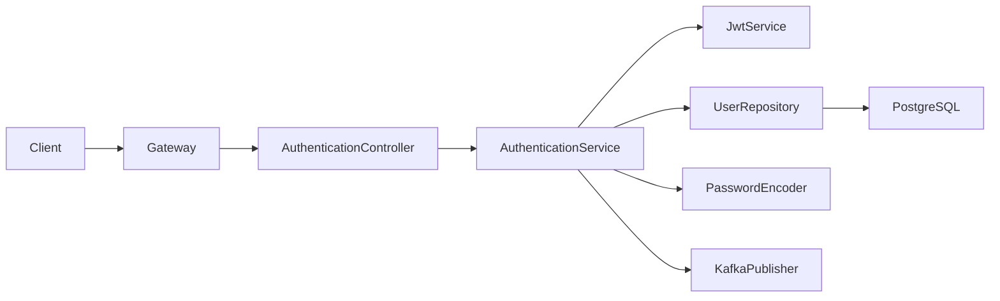
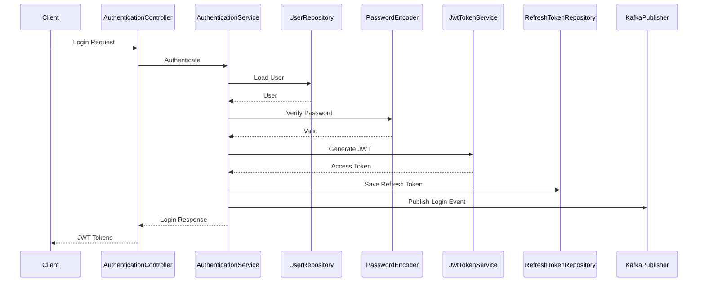
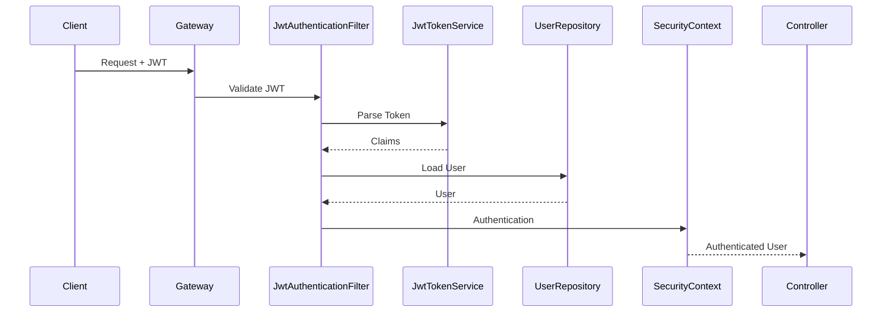
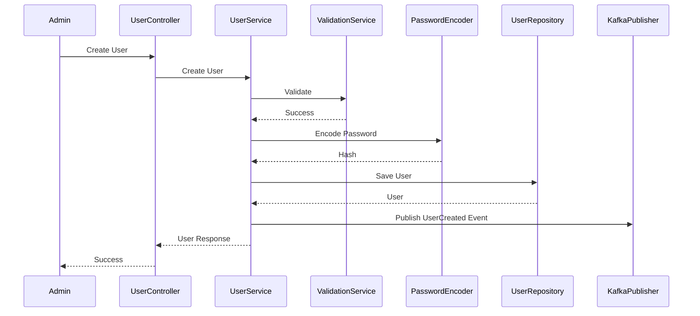
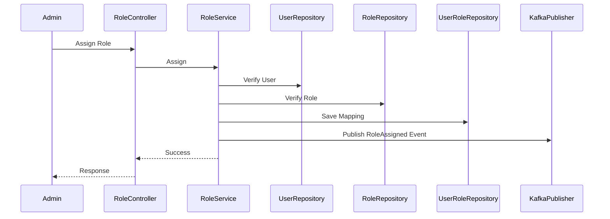
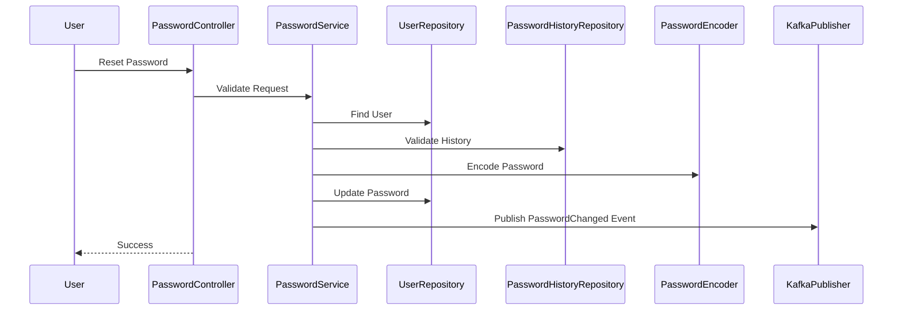
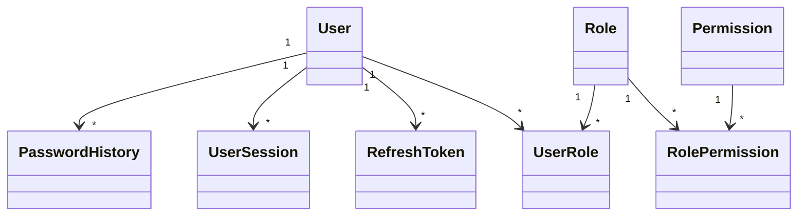
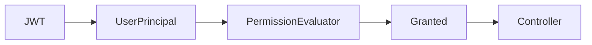

# LLD-002: Identity Service Low Level Design

---

# 1. Document Information

| Field | Value |
|--------|-------|
| Project | Distributed Hub & Sales (DHS) Platform |
| Service | Identity Service |
| Document | Low Level Design |
| Document ID | LLD-002 |
| Repository | starone-dhs-platform |
| Module | identity-service |
| Version | v1.0.0 |
| Status | Draft |
| Standard | IEEE 1016 |
| Owner | Enterprise Architecture |

---

# 2. Purpose

This document defines the implementation-level design for the **Identity Service**.

The Identity Service is responsible for authentication, authorization, user management, role management, permission management, JWT lifecycle, password management, session management, MFA integration, and security policy enforcement.

This document translates **SRS-002 – Identity Service** into implementation architecture.

---

# 3. Scope

The Identity Service provides:

- Authentication
- Authorization
- User Management
- Role Management
- Permission Management
- JWT Access Tokens
- Refresh Tokens
- Password Management
- Session Management
- Multi-Factor Authentication (Future)
- OAuth2/OIDC Integration (Future)
- Account Locking
- Password Policies
- Audit Events

The Identity Service shall not own business-domain entities.

---

# 4. Design Principles

---

## ID-DP-001

Single Responsibility

Identity manages security only.

---

## ID-DP-002

Stateless Authentication

JWT shall be stateless.

---

## ID-DP-003

RBAC Authorization

Authorization shall be permission-based.

---

## ID-DP-004

Password Security

Passwords shall never be reversible.

---

## ID-DP-005

Reuse Platform Foundation

All infrastructure shall use Platform Foundation.

---

## ID-DP-006

Event Driven

Identity publishes security events.

---

# 5. Package Structure

```text
identity-service
│
├── config
├── controller
├── service
├── repository
├── entity
├── dto
├── mapper
├── validation
├── security
├── exception
├── kafka
├── event
├── audit
├── util
└── client
```

---

# 6. Maven Module Structure

```text
identity-service
│
├── api
├── application
├── domain
├── infrastructure
└── bootstrap
```

---

## Module Responsibilities

| Module | Responsibility |
|----------|----------------|
| api | REST APIs |
| application | Business Services |
| domain | Domain Model |
| infrastructure | JPA, Kafka, Security |
| bootstrap | Spring Boot Startup |

---

# 7. Layered Architecture

```text
REST API

↓

Controller Layer

↓

Application Service Layer

↓

Domain Layer

↓

Repository Layer

↓

PostgreSQL
```

Platform Foundation provides:

- Security
- Logging
- Validation
- Kafka
- Exception Handling
- Audit
- OpenFeign

---

# 8. Package Design

## controller

```text
controller
│
├── AuthenticationController
├── UserController
├── RoleController
├── PermissionController
├── SessionController
└── PasswordController
```

Responsibilities

- REST endpoints
- Request validation
- Response mapping

---

## service

```text
service
│
├── AuthenticationService
├── JwtService
├── UserService
├── RoleService
├── PermissionService
├── SessionService
├── PasswordService
└── AuditService
```

Responsibilities

Business orchestration.

---

## repository

```text
repository
│
├── UserRepository
├── RoleRepository
├── PermissionRepository
├── UserRoleRepository
├── RolePermissionRepository
├── RefreshTokenRepository
└── SessionRepository
```

---

## entity

```text
entity
│
├── User
├── Role
├── Permission
├── UserRole
├── RolePermission
├── RefreshToken
└── UserSession
```

---

## dto

```text
dto
│
├── request
├── response
└── event
```

---

## security

```text
security
│
├── jwt
├── filter
├── encoder
├── provider
├── principal
└── config
```

---

## kafka

```text
kafka
│
├── producer
├── consumer
└── configuration
```

---

# 9. Component Diagram



---

# 10. Package Dependency Diagram

```mermaid
flowchart TD

Controller

-->

DTO

Controller

-->

Validation

Controller

-->

Service

Service

-->

Repository

Service

-->

Mapper

Service

-->

Kafka

Service

-->

Audit

Repository

-->

Entity

Security

-->

JWT

JWT

-->

Platform Foundation

Logging

-->

Platform Foundation

Validation

-->

Platform Foundation
```

---

# 11. Domain Responsibilities

| Component | Responsibility |
|------------|----------------|
| Authentication | Login & Logout |
| Authorization | RBAC |
| User | User Lifecycle |
| Role | Role Management |
| Permission | Permission Management |
| Session | Session Tracking |
| Password | Password Lifecycle |
| JWT | Token Management |

---

# 12. Service Boundaries

Identity owns:

- Users
- Roles
- Permissions
- Sessions
- Tokens
- Passwords

Identity does **not** own:

- Employees
- Customers
- Suppliers
- Branches
- Business Profiles

Identity only stores references where required.

---

# 13. Architecture Constraints

- Controllers shall remain stateless.
- Business logic shall exist only in services.
- Password hashing shall use BCrypt or Argon2.
- JWT validation shall use Platform Foundation.
- Controllers shall never access repositories directly.
- Security filters shall execute before controller invocation.
- Events shall be published after successful transactions.
- All entities shall extend `AuditableEntity`.
- All APIs shall return `ApiResponse<T>`.
- Authorization decisions shall be permission-based rather than hard-coded role checks.

---

# 14. Class Design

The Identity Service shall provide implementation classes for authentication, authorization, user management, role management, permission management, password management, session management, and JWT lifecycle.

The implementation shall follow Layered Architecture and Domain-Driven Design principles.

---

# 15. Controller Layer Design

The Controller layer shall expose REST endpoints and delegate business processing to the Service layer.

Controllers shall never contain business logic.

## Package Structure

```text
controller
│
├── AuthenticationController
├── UserController
├── RoleController
├── PermissionController
├── PasswordController
├── SessionController
└── HealthController
```

---

## AuthenticationController

### Responsibilities

- Login
- Logout
- Refresh Token
- Token Validation

### APIs

```text
POST /api/v1/auth/login

POST /api/v1/auth/logout

POST /api/v1/auth/refresh

GET /api/v1/auth/validate
```

---

## UserController

Responsibilities

- Create User
- Update User
- Activate User
- Deactivate User
- Search User
- Get User

---

## RoleController

Responsibilities

- Create Role
- Update Role
- Assign Permissions
- Remove Permissions

---

## PermissionController

Responsibilities

- Create Permission
- Update Permission
- Search Permission

---

## PasswordController

Responsibilities

- Change Password
- Forgot Password
- Reset Password

---

## SessionController

Responsibilities

- List Active Sessions
- Terminate Session
- Terminate All Sessions

---

# 16. Service Layer Design

The Service Layer shall implement all Identity business rules defined in SRS-002.

## Package Structure

```text
service
│
├── AuthenticationService
├── JwtTokenService
├── UserService
├── RoleService
├── PermissionService
├── PasswordService
├── SessionService
├── RefreshTokenService
├── AccountLockService
└── AuditPublisherService
```

---

## AuthenticationService

### Responsibilities

- Authenticate User
- Generate JWT
- Validate Credentials
- Login Audit
- Logout Processing

### Public Methods

```java
LoginResponse login(LoginRequest request)

LogoutResponse logout(UUID sessionId)

RefreshTokenResponse refresh(String refreshToken)

TokenValidationResponse validate(String token)
```

---

## UserService

Responsibilities

- User CRUD
- User Activation
- User Deactivation
- User Search
- User Profile Management

---

## RoleService

Responsibilities

- Role CRUD
- Assign Permissions
- Remove Permissions

---

## PermissionService

Responsibilities

- Permission CRUD
- Permission Lookup

---

## PasswordService

Responsibilities

- Password Change
- Password Reset
- Password Expiration
- Password Validation

---

## SessionService

Responsibilities

- Session Tracking
- Session Expiration
- Force Logout

---

# 17. Repository Layer Design

Repositories shall encapsulate persistence logic only.

## Package Structure

```text
repository
│
├── UserRepository
├── RoleRepository
├── PermissionRepository
├── UserRoleRepository
├── RolePermissionRepository
├── RefreshTokenRepository
├── UserSessionRepository
└── LoginAuditRepository
```

---

## Repository Responsibilities

| Repository | Responsibility |
|------------|----------------|
| UserRepository | User Persistence |
| RoleRepository | Role Persistence |
| PermissionRepository | Permission Persistence |
| UserRoleRepository | User-Role Mapping |
| RolePermissionRepository | Role-Permission Mapping |
| RefreshTokenRepository | Refresh Token Storage |
| UserSessionRepository | Active Sessions |
| LoginAuditRepository | Login History |

---

# 18. DTO Design

## Request DTOs

```text
dto.request
│
├── LoginRequest
├── RefreshTokenRequest
├── CreateUserRequest
├── UpdateUserRequest
├── ChangePasswordRequest
├── ResetPasswordRequest
├── CreateRoleRequest
├── AssignRoleRequest
└── AssignPermissionRequest
```

## Response DTOs

```text
dto.response
│
├── LoginResponse
├── TokenResponse
├── UserResponse
├── RoleResponse
├── PermissionResponse
├── SessionResponse
└── ApiResponse
```

---

# 19. Entity Design

The Identity Service shall own all identity and access management entities.

All entities shall inherit from `AuditableEntity` provided by Platform Foundation.

---

## Package Structure

```text
entity
│
├── User
├── Role
├── Permission
├── UserRole
├── RolePermission
├── RefreshToken
├── UserSession
├── LoginAudit
├── PasswordHistory
└── FailedLoginAttempt
```

---

## User

### Responsibilities

- Identity Profile
- Authentication Information
- Account Status

### Attributes

| Attribute | Type |
|------------|------|
| id | UUID |
| username | String |
| email | String |
| mobileNumber | String |
| passwordHash | String |
| firstName | String |
| lastName | String |
| status | UserStatus |
| accountLocked | Boolean |
| passwordExpired | Boolean |
| failedLoginAttempts | Integer |
| lastLogin | Instant |

---

## Role

### Attributes

| Attribute | Type |
|------------|------|
| id | UUID |
| roleCode | String |
| roleName | String |
| description | String |
| active | Boolean |

---

## Permission

### Attributes

| Attribute | Type |
|------------|------|
| id | UUID |
| permissionCode | String |
| permissionName | String |
| module | String |
| description | String |

---

## UserRole

### Attributes

| Attribute | Type |
|------------|------|
| id | UUID |
| userId | UUID |
| roleId | UUID |

---

## RolePermission

### Attributes

| Attribute | Type |
|------------|------|
| id | UUID |
| roleId | UUID |
| permissionId | UUID |

---

## RefreshToken

### Attributes

| Attribute | Type |
|------------|------|
| id | UUID |
| token | String |
| userId | UUID |
| expiresAt | Instant |
| revoked | Boolean |

---

## UserSession

### Attributes

| Attribute | Type |
|------------|------|
| id | UUID |
| userId | UUID |
| sessionId | UUID |
| ipAddress | String |
| userAgent | String |
| loginTime | Instant |
| logoutTime | Instant |
| active | Boolean |

---

## PasswordHistory

### Attributes

| Attribute | Type |
|------------|------|
| id | UUID |
| userId | UUID |
| passwordHash | String |
| changedAt | Instant |

---

## FailedLoginAttempt

### Attributes

| Attribute | Type |
|------------|------|
| id | UUID |
| username | String |
| ipAddress | String |
| attemptedAt | Instant |
| successful | Boolean |

---

# 20. Mapper Design

The Identity Service shall use MapStruct for DTO-to-Entity mapping.

---

## Package Structure

```text
mapper
│
├── UserMapper
├── RoleMapper
├── PermissionMapper
├── SessionMapper
├── AuthenticationMapper
└── PasswordMapper
```

---

## UserMapper

Responsibilities

- Create User Entity
- Update User Entity
- Convert User to Response DTO

---

## RoleMapper

Responsibilities

- Role DTO Mapping

---

## PermissionMapper

Responsibilities

- Permission DTO Mapping

---

## AuthenticationMapper

Responsibilities

- Login Response Mapping
- JWT Response Mapping

---

## SessionMapper

Responsibilities

- Session DTO Mapping

---

# 21. Validation Design

Validation shall use Jakarta Bean Validation together with custom validators.

---

## Validation Package

```text
validation
│
├── annotation
├── validator
└── groups
```

---

## Custom Validators

```text
UsernameValidator

PasswordStrengthValidator

EmailValidator

MobileNumberValidator

RoleValidator

PermissionValidator

RefreshTokenValidator
```

---

## Validation Rules

| Validator | Purpose |
|------------|---------|
| UsernameValidator | Username Format |
| PasswordStrengthValidator | Password Policy |
| EmailValidator | Email Format |
| MobileNumberValidator | Mobile Format |
| RoleValidator | Valid Role Assignment |
| PermissionValidator | Permission Validation |
| RefreshTokenValidator | Refresh Token Integrity |

---

# 22. Exception Hierarchy

```text
RuntimeException
        │
        └── PlatformException
                │
                ├── AuthenticationException
                ├── AuthorizationException
                ├── InvalidCredentialsException
                ├── InvalidJwtException
                ├── RefreshTokenExpiredException
                ├── AccountLockedException
                ├── PasswordExpiredException
                ├── DuplicateUserException
                ├── UserNotFoundException
                ├── RoleNotFoundException
                ├── PermissionNotFoundException
                └── SessionExpiredException
```

---

# 23. Login Request Processing Flow



---

# 24. JWT Authentication Flow



---

# 25. User Registration Flow



---

# 26. Role Assignment Flow



---

# 27. Password Reset Flow



---

# 28. Class Diagram



---

# 29. Design Constraints

- Controllers shall never contain authentication logic.
- Passwords shall always be stored as one-way hashes.
- JWT Access Tokens shall never be persisted.
- Refresh Tokens shall be securely stored and revocable.
- Account locking shall be configurable.
- Password history shall prevent password reuse.
- User sessions shall support forced termination.
- Role-Permission mappings shall be many-to-many.
- Authentication events shall be published asynchronously using Kafka.
- All mappings shall use MapStruct.
- Business services shall not bypass the Identity Service for authentication or authorization.

---

# 30. Security Configuration

The Identity Service shall implement authentication and authorization using Spring Security 6, JWT, and Role-Based Access Control (RBAC).

All security components shall leverage the Platform Foundation libraries.

---

## 30.1 Security Architecture

```text
Client

↓

API Gateway

↓

JWT Authentication Filter

↓

Authorization Filter

↓

Spring Security Context

↓

REST Controller
```

---

## 30.2 Security Package Structure

```text
security
│
├── config
│   ├── SecurityConfiguration
│   ├── CorsConfiguration
│   ├── PasswordEncoderConfiguration
│   └── MethodSecurityConfiguration
│
├── filter
│   ├── JwtAuthenticationFilter
│   ├── AuthorizationFilter
│   ├── CorrelationIdFilter
│   └── ExceptionHandlerFilter
│
├── jwt
│   ├── JwtTokenProvider
│   ├── JwtTokenValidator
│   ├── JwtClaimsExtractor
│   └── JwtAuthenticationEntryPoint
│
├── principal
│   └── IdentityUserPrincipal
│
└── permission
    ├── PermissionEvaluator
    └── RoleHierarchyConfiguration
```

---

## Security Responsibilities

| Component | Responsibility |
|------------|----------------|
| JwtAuthenticationFilter | Validate JWT |
| AuthorizationFilter | Permission Validation |
| IdentityUserPrincipal | Authenticated User |
| JwtTokenProvider | Token Generation |
| JwtTokenValidator | Signature Validation |
| PermissionEvaluator | RBAC Enforcement |

---

# 31. JWT Implementation

JWT shall be the default authentication mechanism.

---

## Access Token

Purpose

- Authenticate API Requests

Expiration

```text
15 Minutes
```

---

## Refresh Token

Purpose

- Issue New Access Tokens

Expiration

```text
30 Days
```

---

## JWT Claims

```json
{
  "sub":"UUID",
  "username":"john.doe",
  "roles":["ADMIN"],
  "permissions":[
      "USER_CREATE",
      "ROLE_ASSIGN"
  ],
  "tenantId":"UUID",
  "branchId":"UUID",
  "iat":1710000000,
  "exp":1710000900
}
```

---

## JwtTokenProvider

Methods

```java
generateAccessToken()

generateRefreshToken()

validateToken()

extractClaims()

extractUsername()

extractRoles()

extractPermissions()
```

---

# 32. Authentication Provider Design

Authentication shall use Spring Security AuthenticationManager.

---

## Authentication Flow

```mermaid
sequenceDiagram

Client->>AuthenticationManager

AuthenticationManager->>UserDetailsService

UserDetailsService->>UserRepository

UserRepository-->>UserDetailsService

UserDetailsService-->>AuthenticationManager

AuthenticationManager->>PasswordEncoder

PasswordEncoder-->>AuthenticationManager

AuthenticationManager-->>JwtTokenProvider

JwtTokenProvider-->>Client
```

---

## UserDetailsService

Responsibilities

- Load User
- Load Roles
- Load Permissions
- Build UserPrincipal

---

# 33. Authorization Design

Authorization shall be Permission-Based.

Roles shall aggregate permissions.

---

## Authorization Hierarchy

```text
User

↓

Roles

↓

Permissions

↓

Protected API
```

---

## Method Security

```java
@PreAuthorize("hasAuthority('USER_CREATE')")
```

---

## Custom Annotation

```java
@RequirePermission("USER_UPDATE")
```

---

## Permission Evaluation Flow



---

# 34. Password Encoding Strategy

Passwords shall never be stored in plain text.

---

## Supported Encoder

```text
BCryptPasswordEncoder
```

Future Support

```text
Argon2PasswordEncoder
```

---

## Password Policy

Minimum

```text
Length : 12

Uppercase : Required

Lowercase : Required

Digit : Required

Special Character : Required
```

---

## Password History

Previous

```text
5 Passwords
```

shall not be reused.

---

# 35. Session Management

Although authentication is stateless, refresh tokens and active sessions shall be tracked.

---

## Session Components

```text
UserSession

RefreshToken

LoginAudit
```

---

## Session States

```text
Created

↓

Active

↓

Expired

↓

Revoked
```

---

## Session Expiration

Inactive Session

```text
30 Minutes
```

Configurable.

---

# 36. Kafka Design

Identity shall publish security lifecycle events.

---

## Published Events

```text
identity.user.created.v1

identity.user.updated.v1

identity.user.locked.v1

identity.user.unlocked.v1

identity.role.created.v1

identity.permission.created.v1

identity.login.success.v1

identity.login.failed.v1

identity.logout.v1

identity.password.changed.v1
```

---

## Consumed Events

```text
employee.created.v1

employee.updated.v1
```

(Used when employee provisioning is enabled.)

---

## Kafka Package

```text
kafka
│
├── producer
├── consumer
├── event
├── mapper
└── configuration
```

---

# 37. OpenFeign Design

The Identity Service shall use OpenFeign only when synchronous validation is required.

---

## Feign Clients

```text
client
│
├── EmployeeClient
├── NotificationClient
└── AuditClient
```

---

## Responsibilities

| Client | Purpose |
|---------|----------|
| EmployeeClient | Employee Validation |
| NotificationClient | OTP / Email |
| AuditClient | Audit Submission |

---

# 38. Configuration Classes

```text
config
│
├── SecurityConfiguration
├── JwtConfiguration
├── PasswordConfiguration
├── KafkaConfiguration
├── FeignConfiguration
├── OpenApiConfiguration
├── JacksonConfiguration
├── CacheConfiguration
├── SchedulerConfiguration
└── MetricsConfiguration
```

---

## Configuration Responsibilities

| Configuration | Purpose |
|---------------|---------|
| Security | Spring Security |
| JWT | Token Properties |
| Password | BCrypt |
| Kafka | Event Infrastructure |
| Feign | Client Configuration |
| OpenAPI | Swagger |
| Cache | Redis |
| Scheduler | Cleanup Jobs |
| Metrics | Micrometer |

---

# 39. Transaction Design

Identity transactions shall remain local to the service.

Distributed workflows shall use asynchronous events.

---

## Transaction Types

| Operation | Transaction |
|------------|-------------|
| User Create | REQUIRED |
| Role Create | REQUIRED |
| Password Change | REQUIRED |
| Login Audit | REQUIRES_NEW |
| Event Publish | AFTER_COMMIT |

---

## Transaction Flow

```mermaid
flowchart LR

Controller

-->

Service

-->

Repository

-->

Commit

-->

Kafka Publish
```

---

# 40. Cache Design

Redis shall cache security-related reference data.

---

## Cache Types

```text
Permission Cache

Role Cache

User Cache

JWT Blacklist

Configuration Cache
```

---

## Cache Annotations

```java
@Cacheable

@CachePut

@CacheEvict
```

---

# 41. Resilience Patterns

The Identity Service shall implement Resilience4j.

---

## Retry

Authentication notifications.

---

## Circuit Breaker

Notification Service.

Audit Service.

Employee Service.

---

## Rate Limiter

Login API.

Password Reset API.

OTP API.

---

## Bulkhead

External integrations.

---

## Timeout

Feign Clients.

---

# 42. Scheduler Design

Scheduled jobs shall execute background maintenance.

---

## Schedulers

```text
scheduler
│
├── ExpiredSessionCleanupScheduler
├── RefreshTokenCleanupScheduler
├── AccountUnlockScheduler
├── PasswordExpiryScheduler
└── LoginAuditCleanupScheduler
```

---

# 43. Encryption Strategy

Supported Algorithms

```text
BCrypt

AES-256

RSA-4096
```

---

## Encryption Responsibilities

- Password Hashing
- Sensitive Configuration
- Refresh Token Encryption
- Secret Protection

---

# 44. Design Constraints

- JWT Access Tokens shall never be persisted.
- Refresh Tokens shall always be revocable.
- Passwords shall always be hashed.
- Account lock thresholds shall be configurable.
- Permission checks shall be centralized.
- Kafka events shall publish only after successful commits.
- Authentication shall remain stateless.
- Refresh Token revocation shall invalidate active sessions.
- All outbound requests shall propagate Correlation ID.
- All configuration shall be externalized.

---

# 45. Technology Standards

| Concern | Technology |
|----------|------------|
| Java | Java 21 |
| Framework | Spring Boot 3.x |
| Security | Spring Security 6 |
| Authentication | JWT |
| Authorization | RBAC |
| Password | BCrypt |
| Messaging | Kafka |
| Database | PostgreSQL |
| Cache | Redis |
| API Docs | OpenAPI 3 |
| Mapping | MapStruct |
| Logging | SLF4J + Logback |
| Metrics | Micrometer |
| Tracing | OpenTelemetry |
| Service Calls | OpenFeign |

---

# 46. Logging Design

The Identity Service shall implement centralized, structured logging using the Platform Foundation logging framework.

All authentication, authorization, and identity management activities shall be logged for auditability and security monitoring.

---

## 46.1 Logging Architecture

```text
REST Request

↓

Correlation Filter

↓

Logging Aspect

↓

SLF4J

↓

Logback

↓

ELK / OpenSearch / Splunk
```

---

## 46.2 Log Levels

| Level | Purpose |
|---------|---------|
| TRACE | Internal Framework Diagnostics |
| DEBUG | Development & Troubleshooting |
| INFO | Business Events |
| WARN | Recoverable Errors |
| ERROR | Failures & Exceptions |

---

## 46.3 MDC Context

Every log shall include

```text
Correlation ID

Trace ID

Span ID

User ID

Username

Session ID

Tenant ID

Branch ID

Request URI

HTTP Method

Service Name

Environment
```

---

## 46.4 Security Logging

The following events shall always be logged.

- Successful Login
- Failed Login
- Account Locked
- Account Unlocked
- Password Changed
- Password Reset
- User Created
- User Updated
- User Disabled
- Role Assigned
- Role Removed
- Permission Assigned
- Permission Revoked
- Token Refreshed
- Logout
- Session Expired

---

## 46.5 Sensitive Data

The following information shall never be logged.

- Password
- Password Hash
- JWT Access Token
- Refresh Token
- Encryption Keys
- OTP Values
- Secret Keys

---

# 47. Observability

Identity Service shall publish operational metrics through Micrometer.

---

## JVM Metrics

- Heap Usage
- Thread Count
- Garbage Collection
- CPU Usage

---

## Authentication Metrics

- Login Success Count
- Login Failure Count
- Login Latency
- Active Sessions
- Locked Accounts
- Password Reset Requests
- JWT Generation Count
- Refresh Token Usage

---

## Infrastructure Metrics

- Kafka Publish Rate
- Kafka Consumer Lag
- Redis Cache Hit Ratio
- Database Connections
- API Response Time

---

# 48. Distributed Tracing

The Identity Service shall propagate distributed tracing information.

---

## Trace Flow

```mermaid
sequenceDiagram

Client->>Gateway

Gateway->>Identity

Identity->>Audit

Identity->>Notification

Identity-->>Gateway

Gateway-->>Client
```

Every request shall propagate

- Correlation ID
- Trace ID
- Span ID

---

# 49. Health Checks

The Identity Service shall expose Spring Boot Actuator endpoints.

---

## Liveness Probe

```text
GET /actuator/health/liveness
```

Checks

- JVM
- Thread Pool

---

## Readiness Probe

```text
GET /actuator/health/readiness
```

Checks

- PostgreSQL
- Redis
- Kafka
- Config Server

---

## Metrics Endpoint

```text
GET /actuator/metrics
```

---

## Prometheus Endpoint

```text
GET /actuator/prometheus
```

---

# 50. Deployment Design

The Identity Service shall be containerized.

---

## Deployment Architecture

```text
API Gateway

↓

Identity Service

↓

PostgreSQL

↓

Redis

↓

Kafka
```

---

## Kubernetes Resources

```text
Deployment

Service

ConfigMap

Secret

HorizontalPodAutoscaler

Ingress

ServiceMonitor
```

---

# 51. Dependency Management

The service shall inherit the Platform BOM.

```xml
<dependencyManagement>

<dependency>

<groupId>com.starone</groupId>

<artifactId>platform-foundation-bom</artifactId>

</dependency>

</dependencyManagement>
```

---

## Primary Dependencies

- Spring Boot
- Spring Security
- Spring Data JPA
- Spring Validation
- Spring Kafka
- OpenFeign
- PostgreSQL Driver
- Redis
- Micrometer
- OpenTelemetry
- MapStruct
- Lombok

---

# 52. Coding Standards

The Identity Service shall comply with enterprise coding standards.

---

## General

- Java 21
- Spring Boot 3.x
- Constructor Injection
- No Field Injection
- Immutable DTOs
- Records where appropriate

---

## Controller

- Thin Controllers
- Validation Only
- No Business Logic

---

## Service

- Stateless
- Transactional
- Business Orchestration

---

## Repository

- Persistence Only
- No Business Rules

---

## Security

- Password Hashing Only
- No Plain Text Password Storage

---

# 53. Package Naming Standards

```text
com.starone.identity

├── controller
├── service
├── repository
├── entity
├── dto
├── mapper
├── validation
├── security
├── kafka
├── config
├── exception
├── audit
├── util
└── client
```

---

# 54. Testing Strategy

## Unit Testing

Framework

```text
JUnit 5

Mockito
```

Minimum Coverage

```text
90%
```

---

## Integration Testing

- Spring Boot Test
- Testcontainers
- Embedded Kafka

---

## Security Testing

- Login
- JWT Validation
- RBAC
- Permission Evaluation
- Token Expiration
- Refresh Token Flow

---

## Performance Testing

- Login Throughput
- Token Generation
- Concurrent Authentication
- Session Validation

---

## Static Analysis

- SonarQube
- SpotBugs
- PMD
- Checkstyle

---

# 55. Build Validation

Every Pull Request shall verify

- Compilation
- Unit Tests
- Integration Tests
- Static Analysis
- Security Scan
- Dependency Scan
- Documentation Validation
- Code Coverage

---

# 56. Quality Gates

| Metric | Target |
|---------|--------|
| Unit Test Coverage | ≥90% |
| Integration Tests | 100% Pass |
| Critical Bugs | 0 |
| Critical Vulnerabilities | 0 |
| Code Duplication | <3% |
| Documentation | Mandatory |

---

# 57. Implementation Guidelines

The Identity Service shall reuse Platform Foundation components.

Business code shall never duplicate

- JWT Framework
- Logging
- Validation
- Kafka Infrastructure
- Exception Handling
- Audit Framework
- Response Models

---

# 58. Extension Guidelines

Business extensions shall be implemented through service-level components only.

The following Platform Foundation components may be extended.

- AuditableEntity
- PlatformException
- ApiResponse
- BaseMapper
- JwtService
- AuditService

Platform Foundation source code shall never be modified by the Identity Service.

---

# 59. Design Checklist

Before implementation verify

- Package structure complies with LLD
- Controllers contain no business logic
- Services are stateless
- Constructor injection is used
- Passwords are hashed
- JWT implementation follows enterprise standard
- RBAC is enforced
- Refresh tokens are revocable
- Kafka events publish after transaction commit
- Correlation ID propagation is enabled
- Health endpoints are exposed
- Metrics are published
- Configuration is externalized
- Unit test coverage meets quality gates

---

# 60. Appendix A – Framework Versions

| Component | Version |
|------------|---------|
| Java | 21 |
| Spring Boot | 3.x |
| Spring Security | 6.x |
| Spring Cloud | 2025.x |
| PostgreSQL | Latest Supported |
| Redis | Latest Supported |
| Kafka | Latest Supported |
| OpenFeign | Latest Supported |
| Micrometer | Latest Supported |
| OpenTelemetry | Latest Supported |
| MapStruct | Latest Stable |
| Lombok | Latest Stable |
| JUnit | 5.x |

---

# 61. Appendix B – Layer Responsibility Matrix

| Layer | Responsibility |
|---------|----------------|
| Controller | Request Handling |
| Service | Authentication & Authorization Logic |
| Repository | Persistence |
| Security | JWT & RBAC |
| Kafka | Security Events |
| Mapper | DTO Conversion |
| Validation | Request Validation |
| Audit | Security Audit |

---

# 62. Appendix C – Identity Components

```text
AuthenticationController

UserController

RoleController

PermissionController

PasswordController

SessionController

AuthenticationService

JwtTokenService

UserService

RoleService

PermissionService

PasswordService

SessionService

UserRepository

RoleRepository

PermissionRepository

RefreshTokenRepository

UserSessionRepository
```

---

# 63. Appendix D – Authentication Sequence Summary

```text
Client

↓

Gateway

↓

JWT Authentication

↓

Authorization

↓

Controller

↓

Service

↓

Repository

↓

JWT Generation

↓

Kafka Event

↓

Response
```

---

# 64. Appendix E – Repository Responsibilities

| Repository | Responsibility |
|------------|----------------|
| starone-galaxy-architecture | Enterprise Standards & Architecture |
| starone-galaxy-central-config | Configuration |
| starone-galaxy-infra | Infrastructure & CI/CD |
| starone-dhs-platform | Identity Service Implementation |

---

# 65. Conclusion

The Identity Service provides centralized authentication, authorization, user lifecycle management, role and permission management, JWT lifecycle, password management, and security event publishing. It builds upon the Platform Foundation to deliver a secure, scalable, and enterprise-compliant identity solution for all DHS services.

---

# End of Document


