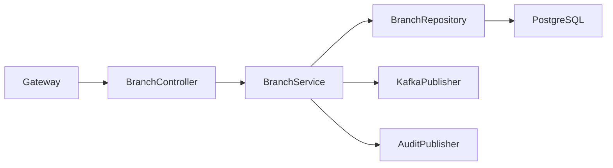
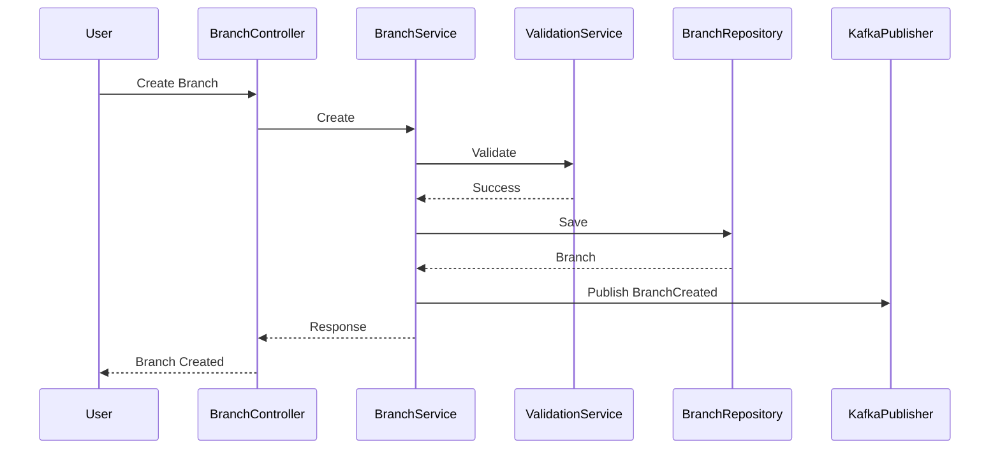
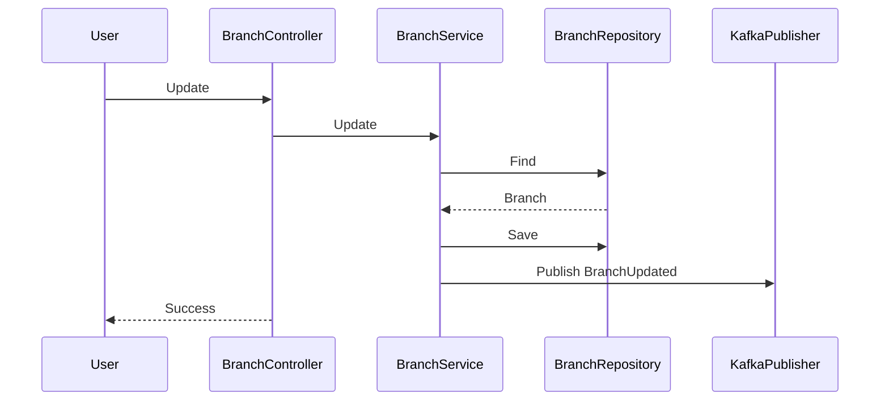
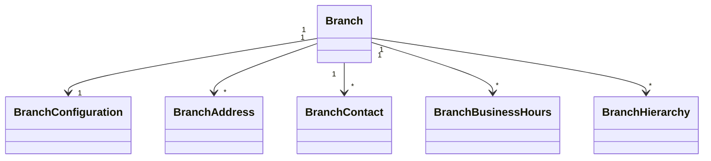
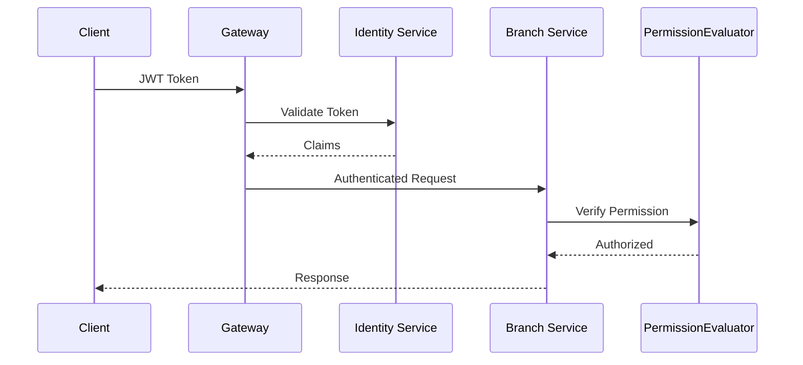

# LLD-003: Branch Service

# 1. Document Information

| Field | Value |
|--------|-------|
| Project | Distributed Hub & Sales (DHS) Platform |
| Service | Branch Service |
| Document | Low Level Design |
| Document ID | LLD-003 |
| Repository | starone-dhs-platform |
| Module | branch-service |
| Version | v1.0.0 |
| Status | Draft |
| Standard | IEEE 1016 |
| Owner | Enterprise Architecture |

---

# 2. Purpose

This document defines the implementation-level design for the Branch Service.

The Branch Service is responsible for maintaining organizational branch master data, branch hierarchy, regional mapping, operational configuration, warehouse associations, business hours, and branch lifecycle.

This document translates **SRS-003 – Branch Service** into implementation-level architecture.

---

# 3. Scope

The Branch Service provides:

- Branch Master Management
- Branch Hierarchy
- Region & Zone Mapping
- Branch Configuration
- Warehouse Association
- Address Management
- Contact Information
- Business Hours
- Operational Status
- Branch Search
- Branch Event Publishing

The Branch Service shall not own:

- Employees
- Inventory
- Products
- Orders
- Customers
- Suppliers

These services shall reference Branch using **branchId** only.

---

# 4. Design Principles

---

## BR-DP-001

Single Source of Truth

Branch master information shall exist only in Branch Service.

---

## BR-DP-002

Reference Data

Branch information shall be reusable across all DHS services.

---

## BR-DP-003

Event Driven

Branch lifecycle changes shall publish Kafka events.

---

## BR-DP-004

Immutable Identity

Branch Code shall never change after creation.

---

## BR-DP-005

Soft Delete

Branches shall never be physically deleted.

---

## BR-DP-006

Reuse Platform Foundation

Infrastructure concerns shall reuse Platform Foundation.

---

# 5. Package Structure

```text
branch-service
│
├── config
├── controller
├── service
├── repository
├── entity
├── dto
├── mapper
├── validation
├── exception
├── kafka
├── event
├── audit
├── util
└── client
```

---

# 6. Maven Module Structure

```text
branch-service
│
├── api
├── application
├── domain
├── infrastructure
└── bootstrap
```

---

## Module Responsibilities

| Module | Responsibility |
|----------|----------------|
| api | REST APIs |
| application | Business Services |
| domain | Domain Model |
| infrastructure | Database, Kafka |
| bootstrap | Spring Boot Startup |

---

# 7. Layered Architecture

```text
REST API

↓

Controller Layer

↓

Application Service Layer

↓

Domain Layer

↓

Repository Layer

↓

PostgreSQL
```

The Branch Service shall inherit:

- Security
- Logging
- Validation
- Kafka
- Audit
- Exception Handling
- OpenFeign

from Platform Foundation.

---

# 8. Package Design

## controller

```text
controller
│
├── BranchController
├── BranchHierarchyController
├── BranchConfigurationController
└── BranchSearchController
```

Responsibilities

- Request Validation
- Response Mapping
- REST Endpoints

---

## service

```text
service
│
├── BranchService
├── BranchHierarchyService
├── BranchConfigurationService
├── BranchSearchService
└── BranchAuditService
```

Responsibilities

Business orchestration.

---

## repository

```text
repository
│
├── BranchRepository
├── BranchHierarchyRepository
├── BranchConfigurationRepository
└── BranchAddressRepository
```

---

## entity

```text
entity
│
├── Branch
├── BranchHierarchy
├── BranchConfiguration
├── BranchAddress
├── BranchContact
├── BranchBusinessHours
└── BranchAudit
```

---

## dto

```text
dto
│
├── request
├── response
└── event
```

---

## kafka

```text
kafka
│
├── producer
├── consumer
└── configuration
```

---

## validation

```text
validation
│
├── annotation
├── validator
└── groups
```

---

# 9. Component Diagram



---

# 10. Package Dependency Diagram

```mermaid
flowchart TD

Controller

-->

DTO

Controller

-->

Validation

Controller

-->

Service

Service

-->

Repository

Service

-->

Mapper

Service

-->

Kafka

Service

-->

Audit

Repository

-->

Entity

Kafka

-->

Platform Foundation

Audit

-->

Platform Foundation

Logging

-->

Platform Foundation
```

---

# 11. Domain Responsibilities

| Component | Responsibility |
|------------|----------------|
| Branch | Branch Master |
| BranchHierarchy | Parent/Child Structure |
| BranchConfiguration | Operational Settings |
| BranchAddress | Address Details |
| BranchContact | Contact Information |
| BusinessHours | Working Hours |
| Audit | Change Tracking |

---

# 12. Service Boundaries

Branch Service owns:

- Branch Master
- Branch Configuration
- Branch Hierarchy
- Branch Address
- Branch Contacts
- Business Hours

Branch Service does not own:

- Employees
- Warehouses
- Inventory
- Products
- Customers
- Orders
- Suppliers

Other services shall reference Branch using **branchId**.

---

# 13. Architecture Constraints

- Controllers shall never access repositories directly.
- Services shall contain all business logic.
- Repositories shall only perform persistence operations.
- DTOs shall never expose JPA entities.
- Branch Code shall be immutable.
- Branch deletion shall be implemented as Soft Delete.
- Branch hierarchy shall prevent circular references.
- Kafka events shall publish only after successful transactions.
- All entities shall extend `AuditableEntity`.
- APIs shall return `ApiResponse<T>`.
- Business configuration shall remain externalized.

---

# 14. Class Design

The Branch Service shall provide implementation classes for branch lifecycle management, hierarchy management, configuration management, address management, business hours, and branch search.

The implementation shall follow Layered Architecture and Domain-Driven Design (DDD).

---

# 15. Controller Layer Design

The Controller layer shall expose REST APIs and delegate business processing to the Service layer.

Controllers shall remain stateless.

## Package Structure

```text
controller
│
├── BranchController
├── BranchHierarchyController
├── BranchConfigurationController
├── BranchAddressController
├── BranchBusinessHoursController
└── BranchSearchController
```

---

## BranchController

### Responsibilities

- Create Branch
- Update Branch
- Activate Branch
- Deactivate Branch
- Get Branch
- Delete Branch (Soft Delete)

### APIs

```text
POST   /api/v1/branches

PUT    /api/v1/branches/{branchId}

GET    /api/v1/branches/{branchId}

DELETE /api/v1/branches/{branchId}

PUT    /api/v1/branches/{branchId}/activate

PUT    /api/v1/branches/{branchId}/deactivate
```

---

## BranchHierarchyController

Responsibilities

- Assign Parent Branch
- View Hierarchy
- Move Branch

---

## BranchConfigurationController

Responsibilities

- Manage Operational Configuration
- Business Settings
- Tax Settings
- Time Zone
- Currency

---

## BranchAddressController

Responsibilities

- Create Address
- Update Address
- Manage Contacts

---

## BranchSearchController

Responsibilities

- Search Branches
- Filter Branches
- Branch Lookup

---

# 16. Service Layer Design

Business logic shall reside in the Service layer.

## Package Structure

```text
service
│
├── BranchService
├── BranchHierarchyService
├── BranchConfigurationService
├── BranchAddressService
├── BranchBusinessHoursService
├── BranchSearchService
├── BranchValidationService
└── BranchAuditService
```

---

## BranchService

### Responsibilities

- Create Branch
- Update Branch
- Activate Branch
- Deactivate Branch
- Soft Delete Branch

### Public Methods

```java
createBranch()

updateBranch()

getBranch()

activateBranch()

deactivateBranch()

deleteBranch()
```

---

## BranchHierarchyService

Responsibilities

- Build Hierarchy
- Validate Parent Branch
- Prevent Circular References

---

## BranchConfigurationService

Responsibilities

- Branch Configuration
- Working Configuration
- Tax Configuration
- Regional Configuration

---

## BranchAddressService

Responsibilities

- Address CRUD
- Contact CRUD

---

## BranchBusinessHoursService

Responsibilities

- Working Hours
- Holiday Calendar
- Shift Configuration

---

## BranchSearchService

Responsibilities

- Search
- Filter
- Pagination
- Sorting

---

# 17. Repository Layer Design

Repositories shall encapsulate persistence logic only.

## Package Structure

```text
repository
│
├── BranchRepository
├── BranchHierarchyRepository
├── BranchConfigurationRepository
├── BranchAddressRepository
├── BranchContactRepository
└── BranchBusinessHoursRepository
```

---

## Repository Responsibilities

| Repository | Responsibility |
|------------|----------------|
| BranchRepository | Branch Master |
| BranchHierarchyRepository | Hierarchy |
| BranchConfigurationRepository | Configuration |
| BranchAddressRepository | Address |
| BranchContactRepository | Contacts |
| BranchBusinessHoursRepository | Business Hours |

---

# 18. DTO Design

## Request DTOs

```text
dto.request
│
├── CreateBranchRequest
├── UpdateBranchRequest
├── BranchConfigurationRequest
├── BranchAddressRequest
├── BranchContactRequest
├── BusinessHoursRequest
├── BranchSearchRequest
└── BranchHierarchyRequest
```

---

## Response DTOs

```text
dto.response
│
├── BranchResponse
├── BranchHierarchyResponse
├── BranchConfigurationResponse
├── BranchAddressResponse
├── BranchSearchResponse
└── BranchSummaryResponse
```

---

## BranchResponse

| Field | Type |
|---------|------|
| id | UUID |
| branchCode | String |
| branchName | String |
| status | BranchStatus |
| region | String |
| zone | String |

---

## BranchHierarchyResponse

| Field | Type |
|---------|------|
| branchId | UUID |
| parentBranchId | UUID |
| level | Integer |
| children | List |

---

# 19. Entity Design

All entities shall extend **AuditableEntity**.

---

## Package Structure

```text
entity
│
├── Branch
├── BranchHierarchy
├── BranchConfiguration
├── BranchAddress
├── BranchContact
├── BranchBusinessHours
└── BranchHoliday
```

---

## Branch

### Attributes

| Attribute | Type |
|------------|------|
| id | UUID |
| branchCode | String |
| branchName | String |
| branchType | BranchType |
| status | BranchStatus |
| region | String |
| zone | String |
| currency | String |
| timezone | String |

---

## BranchHierarchy

| Attribute | Type |
|------------|------|
| id | UUID |
| branchId | UUID |
| parentBranchId | UUID |
| hierarchyLevel | Integer |

---

## BranchConfiguration

| Attribute | Type |
|------------|------|
| id | UUID |
| branchId | UUID |
| allowSales | Boolean |
| allowPurchase | Boolean |
| allowInventory | Boolean |
| timezone | String |
| currency | String |

---

## BranchAddress

| Attribute | Type |
|------------|------|
| id | UUID |
| branchId | UUID |
| addressLine1 | String |
| city | String |
| state | String |
| postalCode | String |
| country | String |

---

## BranchContact

| Attribute | Type |
|------------|------|
| id | UUID |
| branchId | UUID |
| contactName | String |
| mobile | String |
| email | String |

---

## BranchBusinessHours

| Attribute | Type |
|------------|------|
| id | UUID |
| branchId | UUID |
| dayOfWeek | DayOfWeek |
| openingTime | LocalTime |
| closingTime | LocalTime |

---

# 20. Mapper Design

MapStruct shall be used.

## Package Structure

```text
mapper
│
├── BranchMapper
├── BranchConfigurationMapper
├── BranchHierarchyMapper
├── BranchAddressMapper
└── BranchContactMapper
```

---

## Responsibilities

- Entity → DTO
- DTO → Entity
- Partial Update Mapping
- Page Mapping

---

# 21. Validation Design

## Package Structure

```text
validation
│
├── annotation
├── validator
└── groups
```

---

## Validators

```text
BranchCodeValidator

BranchHierarchyValidator

BusinessHoursValidator

AddressValidator

BranchConfigurationValidator
```

---

## Validation Rules

| Validator | Purpose |
|------------|----------|
| BranchCodeValidator | Unique Branch Code |
| BranchHierarchyValidator | Prevent Circular Hierarchy |
| BusinessHoursValidator | Opening < Closing |
| AddressValidator | Address Validation |
| BranchConfigurationValidator | Configuration Validation |

---

# 22. Exception Hierarchy

```text
RuntimeException
        │
        └── PlatformException
                │
                ├── BranchNotFoundException
                ├── DuplicateBranchCodeException
                ├── InvalidHierarchyException
                ├── ParentBranchNotFoundException
                ├── BranchAlreadyActiveException
                ├── BranchAlreadyInactiveException
                ├── InvalidBusinessHoursException
                └── BranchConfigurationException
```

---

# 23. Branch Creation Flow



---

# 24. Branch Update Flow



---

# 25. Branch Hierarchy Flow

```mermaid
sequenceDiagram

Admin->>BranchHierarchyController: Assign Parent

BranchHierarchyController->>BranchHierarchyService

BranchHierarchyService->>HierarchyValidator

HierarchyValidator-->>BranchHierarchyService

BranchHierarchyService->>Repository

Repository-->>BranchHierarchyService

BranchHierarchyService-->>Controller

Controller-->>Admin
```

---

# 26. Branch Search Flow

```mermaid
sequenceDiagram

Client->>BranchSearchController

BranchSearchController->>BranchSearchService

BranchSearchService->>BranchRepository

BranchRepository-->>BranchSearchService

BranchSearchService-->>Controller

Controller-->>Client
```

---

# 27. Branch Configuration Flow

```mermaid
sequenceDiagram

Admin->>ConfigurationController

ConfigurationController->>ConfigurationService

ConfigurationService->>Repository

Repository-->>ConfigurationService

ConfigurationService-->>Controller

Controller-->>Admin
```

---

# 28. Class Diagram



---

# 29. Design Constraints

- Branch Code shall be immutable.
- Branch Name shall be editable.
- Soft Delete shall be supported.
- Circular hierarchy shall never be allowed.
- Services shall contain all business logic.
- Controllers shall remain thin.
- Repository layer shall only perform persistence.
- Events shall be published only after successful commit.
- DTOs shall never expose JPA entities.
- All APIs shall return `ApiResponse<T>`.
- MapStruct shall be used for object mapping.
- All entities shall extend `AuditableEntity`.

---

# 30. Security Configuration

The Branch Service shall inherit the enterprise security framework from the Platform Foundation.

Authentication and authorization shall be delegated to the Identity Service.

The Branch Service shall only enforce authorization for Branch resources.

---

## 30.1 Security Architecture

```text
Client

↓

API Gateway

↓

JWT Authentication Filter

↓

Authorization Filter

↓

Branch Controller

↓

Branch Service
```

---

## 30.2 Security Components

```text
security
│
├── config
│   ├── SecurityConfiguration
│   ├── MethodSecurityConfiguration
│   └── CorsConfiguration
│
├── filter
│   ├── JwtAuthenticationFilter
│   ├── AuthorizationFilter
│   └── CorrelationIdFilter
│
├── permission
│   ├── BranchPermissionEvaluator
│   └── BranchAccessValidator
│
└── annotation
    └── RequireBranchPermission
```

---

## 30.3 Required Permissions

| Permission | Description |
|------------|-------------|
| BRANCH_CREATE | Create Branch |
| BRANCH_UPDATE | Update Branch |
| BRANCH_DELETE | Soft Delete Branch |
| BRANCH_VIEW | View Branch |
| BRANCH_SEARCH | Search Branches |
| BRANCH_CONFIGURE | Manage Configuration |
| BRANCH_HIERARCHY | Manage Hierarchy |

---

## 30.4 Authorization Flow



---

# 31. JWT Implementation

JWT authentication shall be provided by the Platform Foundation.

The Branch Service shall consume authenticated user information from the Spring Security Context.

---

## Required JWT Claims

```json
{
  "sub":"UUID",
  "username":"admin",
  "roles":["ADMIN"],
  "permissions":[
      "BRANCH_CREATE",
      "BRANCH_UPDATE"
  ],
  "tenantId":"UUID",
  "branchId":"UUID"
}
```

---

## User Context

Every request shall populate

```text
UserId

Username

Roles

Permissions

TenantId

BranchId

CorrelationId
```

---

# 32. Authorization Design

Branch APIs shall use permission-based authorization.

---

## Example

```java
@PreAuthorize("hasAuthority('BRANCH_CREATE')")
```

or

```java
@RequireBranchPermission("BRANCH_CREATE")
```

---

## Permission Matrix

| API | Permission |
|-----|------------|
| Create Branch | BRANCH_CREATE |
| Update Branch | BRANCH_UPDATE |
| Delete Branch | BRANCH_DELETE |
| View Branch | BRANCH_VIEW |
| Search Branch | BRANCH_SEARCH |
| Configure Branch | BRANCH_CONFIGURE |
| Manage Hierarchy | BRANCH_HIERARCHY |

---

# 33. Kafka Design

The Branch Service shall publish branch lifecycle events.

---

## Published Topics

```text
branch.created.v1

branch.updated.v1

branch.activated.v1

branch.deactivated.v1

branch.deleted.v1

branch.configuration.updated.v1

branch.hierarchy.updated.v1
```

---

## Consumed Topics

```text
identity.user.created.v1

identity.role.updated.v1
```

(Used only when branch administration workflows require synchronization.)

---

## Event Package

```text
kafka
│
├── producer
├── consumer
├── configuration
├── event
└── mapper
```

---

## Standard Event

```json
{
  "eventId":"UUID",
  "eventType":"BranchCreated",
  "eventVersion":"1.0",
  "occurredAt":"2026-06-27T10:00:00Z",
  "correlationId":"UUID",
  "payload":{}
}
```

---

# 34. OpenFeign Design

Branch Service shall use synchronous calls only where immediate validation is required.

---

## Feign Clients

```text
client
│
├── IdentityClient
├── WarehouseClient
└── AuditClient
```

---

## Responsibilities

| Client | Purpose |
|---------|----------|
| IdentityClient | Validate User |
| WarehouseClient | Validate Warehouse Association |
| AuditClient | Publish Audit Logs |

---

# 35. Configuration Classes

```text
config
│
├── SecurityConfiguration
├── KafkaConfiguration
├── FeignConfiguration
├── JacksonConfiguration
├── CacheConfiguration
├── OpenApiConfiguration
├── MetricsConfiguration
├── SchedulerConfiguration
└── ValidationConfiguration
```

---

## Responsibilities

| Configuration | Purpose |
|---------------|---------|
| Security | Spring Security |
| Kafka | Kafka Infrastructure |
| Feign | OpenFeign |
| Cache | Redis |
| Jackson | JSON |
| Metrics | Micrometer |
| Scheduler | Scheduled Tasks |
| Validation | Bean Validation |

---

# 36. Transaction Design

Branch transactions shall remain local.

Distributed business workflows shall communicate using Kafka events.

---

## Transaction Types

| Operation | Propagation |
|------------|-------------|
| Create Branch | REQUIRED |
| Update Branch | REQUIRED |
| Delete Branch | REQUIRED |
| Update Configuration | REQUIRED |
| Publish Event | AFTER_COMMIT |

---

## Transaction Flow

```mermaid
flowchart LR

Controller

-->

Service

-->

Repository

-->

Commit

-->

Kafka Event
```

---

# 37. Cache Design

Redis shall cache branch reference data.

---

## Cached Objects

```text
Branch

Branch Configuration

Branch Hierarchy

Business Hours

Regional Mapping
```

---

## Cache Annotations

```java
@Cacheable

@CachePut

@CacheEvict
```

---

# 38. Resilience Patterns

The Branch Service shall use Resilience4j.

---

## Retry

Warehouse validation.

---

## Circuit Breaker

Warehouse Service.

Audit Service.

---

## Bulkhead

External integrations.

---

## Rate Limiter

Search API.

Configuration API.

---

## Timeout

Feign clients.

---

# 39. Scheduler Design

Scheduled jobs shall support operational maintenance.

---

## Schedulers

```text
scheduler
│
├── BranchStatusScheduler
├── CacheRefreshScheduler
├── ConfigurationValidationScheduler
└── AuditCleanupScheduler
```

---

# 40. External Integration Design

The Branch Service integrates with

| Service | Purpose |
|----------|---------|
| Identity Service | Authentication |
| Warehouse Service | Warehouse Validation |
| Audit Service | Audit Logging |
| Notification Service | Administrative Notifications |
| Reporting Service | Branch Analytics |

---

# 41. Configuration Properties

| Property | Default |
|----------|----------|
| branch.cache.enabled | true |
| branch.cache.ttl | 3600 |
| branch.search.max-page-size | 100 |
| branch.kafka.retry | 3 |
| branch.audit.enabled | true |

---

# 42. Data Consistency Strategy

- Branch Code shall be unique.
- Branch hierarchy shall remain acyclic.
- Events shall publish only after transaction commit.
- Reference integrity shall be validated before persistence.
- Soft-deleted branches shall not appear in operational searches.

---

# 43. Performance Considerations

- Frequently accessed branch master data shall be cached.
- Search endpoints shall support pagination.
- Configuration updates shall invalidate cache automatically.
- Hierarchy retrieval shall minimize recursive database access.

---

# 44. Design Constraints

- Branch Code is immutable.
- Soft Delete only.
- JWT authentication is mandatory.
- Authorization shall be permission-based.
- Kafka events shall be published after successful commit.
- OpenFeign shall be used only for synchronous validation.
- All outbound requests shall propagate Correlation ID.
- Configuration shall be externalized using Spring Cloud Config.
- Repository layer shall never invoke external services.

---

# 45. Technology Standards

| Concern | Technology |
|----------|------------|
| Java | Java 21 |
| Framework | Spring Boot 3.x |
| Security | Spring Security 6 |
| Authentication | JWT |
| Authorization | RBAC |
| Database | PostgreSQL |
| Messaging | Apache Kafka |
| Cache | Redis |
| Service Discovery | Eureka |
| Service Calls | OpenFeign |
| Validation | Jakarta Bean Validation |
| Mapping | MapStruct |
| Logging | SLF4J + Logback |
| Metrics | Micrometer |
| Tracing | OpenTelemetry |

---

# 46. Logging Design

The Branch Service shall implement centralized structured logging using the Platform Foundation logging framework.

Every request, branch lifecycle event, and integration call shall be logged using standardized MDC attributes.

---

## 46.1 Logging Architecture

```text
REST Request

↓

Correlation Filter

↓

Logging Aspect

↓

SLF4J

↓

Logback

↓

ELK / OpenSearch
```

---

## 46.2 Log Levels

| Level | Purpose |
|---------|---------|
| TRACE | Framework Diagnostics |
| DEBUG | Development |
| INFO | Business Events |
| WARN | Recoverable Problems |
| ERROR | Failures |

---

## 46.3 MDC Context

Every log entry shall include

```text
Correlation ID

Trace ID

Span ID

User ID

Branch ID

Tenant ID

Service Name

HTTP Method

Request URI

Environment
```

---

## 46.4 Business Events

The following operations shall always be logged.

- Branch Created
- Branch Updated
- Branch Activated
- Branch Deactivated
- Branch Deleted
- Branch Configuration Updated
- Branch Hierarchy Updated
- Branch Address Updated
- Business Hours Updated

---

## 46.5 Sensitive Data

The following shall never be logged.

- JWT Tokens
- Authorization Headers
- Passwords
- Secrets
- Encryption Keys

---

# 47. Observability

The Branch Service shall publish operational metrics using Micrometer.

---

## JVM Metrics

- Heap Usage
- CPU Usage
- Thread Count
- Garbage Collection

---

## Business Metrics

- Total Branches
- Active Branches
- Inactive Branches
- Branch Creation Rate
- Branch Update Rate
- Search Requests
- Configuration Updates
- Hierarchy Changes

---

## Infrastructure Metrics

- Database Connections
- Kafka Publish Rate
- Kafka Consumer Lag
- Redis Cache Hit Ratio
- API Response Time

---

# 48. Distributed Tracing

Every request shall propagate distributed tracing information.

---

## Trace Flow

```mermaid
sequenceDiagram

Client->>Gateway

Gateway->>Branch Service

Branch Service->>Warehouse Service

Branch Service->>Audit Service

Branch Service-->>Gateway

Gateway-->>Client
```

---

## Trace Context

Every request shall propagate

- Correlation ID
- Trace ID
- Span ID

---

# 49. Health Checks

The Branch Service shall expose Spring Boot Actuator endpoints.

---

## Health

```text
GET /actuator/health
```

---

## Liveness

```text
GET /actuator/health/liveness
```

---

## Readiness

```text
GET /actuator/health/readiness
```

Dependencies

- PostgreSQL
- Kafka
- Redis
- Config Server

---

## Metrics

```text
GET /actuator/metrics
```

---

## Prometheus

```text
GET /actuator/prometheus
```

---

# 50. Deployment Design

The Branch Service shall be deployed as a containerized microservice.

---

## Deployment Architecture

```text
Gateway

↓

Branch Service

↓

PostgreSQL

↓

Redis

↓

Kafka
```

---

## Kubernetes Resources

```text
Deployment

Service

ConfigMap

Secret

HorizontalPodAutoscaler

Ingress

ServiceMonitor

PodDisruptionBudget
```

---

# 51. Dependency Management

The Branch Service shall inherit the enterprise BOM.

```xml
<dependencyManagement>

<dependency>

<groupId>com.starone</groupId>

<artifactId>platform-foundation-bom</artifactId>

</dependency>

</dependencyManagement>
```

---

## Primary Dependencies

- Spring Boot
- Spring Security
- Spring Data JPA
- Spring Kafka
- OpenFeign
- Redis
- PostgreSQL
- Micrometer
- OpenTelemetry
- MapStruct
- Lombok

---

# 52. Coding Standards

The Branch Service shall comply with enterprise coding standards.

---

## Controller

- Stateless
- Validation Only
- No Business Logic

---

## Service

- Stateless
- Transactional
- Business Orchestration

---

## Repository

- Persistence Only
- No External Calls

---

## DTO

- Immutable
- Validation Annotations
- No Business Logic

---

## Entity

- Extend AuditableEntity
- Soft Delete Support
- No API Exposure

---

# 53. Package Naming Standards

```text
com.starone.branch

├── controller
├── service
├── repository
├── entity
├── dto
├── mapper
├── validation
├── config
├── kafka
├── exception
├── audit
├── util
└── client
```

---

# 54. Testing Strategy

## Unit Testing

Framework

```text
JUnit 5

Mockito
```

Coverage

```text
Minimum 90%
```

---

## Integration Testing

- Spring Boot Test
- Testcontainers
- Embedded Kafka

---

## API Testing

- REST Assured
- Spring MockMvc

---

## Performance Testing

- Branch Search
- Hierarchy Retrieval
- Configuration Updates

---

## Static Analysis

- SonarQube
- SpotBugs
- PMD
- Checkstyle

---

# 55. Build Validation

Every Pull Request shall verify

- Compilation
- Unit Tests
- Integration Tests
- Static Analysis
- Security Scan
- Dependency Scan
- Documentation Validation
- Code Coverage

---

# 56. Quality Gates

| Metric | Target |
|---------|--------|
| Unit Test Coverage | ≥90% |
| Integration Tests | 100% Pass |
| Critical Bugs | 0 |
| Critical Vulnerabilities | 0 |
| Code Duplication | <3% |
| Documentation | Mandatory |

---

# 57. Implementation Guidelines

The Branch Service shall reuse Platform Foundation components.

Business code shall not duplicate

- Security
- Logging
- Validation
- Kafka Infrastructure
- Exception Handling
- Audit Framework
- API Response Models
- Pagination Framework

---

# 58. Extension Guidelines

Business-specific functionality shall extend Platform Foundation components where appropriate.

Permitted extensions include

- AuditableEntity
- PlatformException
- ApiResponse
- BaseMapper
- AuditService

Platform Foundation source code shall not be modified by the Branch Service.

---

# 59. Design Checklist

Before implementation verify

- Branch Code uniqueness enforced
- Soft Delete implemented
- Circular hierarchy prevention enabled
- Controllers contain no business logic
- Services are stateless
- Repository layer contains persistence only
- Events publish after transaction commit
- Redis cache configured
- Correlation ID propagation enabled
- Health endpoints exposed
- Metrics published
- Configuration externalized
- Unit test coverage meets quality gates

---

# 60. Appendix A – Framework Versions

| Component | Version |
|------------|---------|
| Java | 21 |
| Spring Boot | 3.x |
| Spring Security | 6.x |
| Spring Cloud | 2025.x |
| PostgreSQL | Latest Supported |
| Redis | Latest Supported |
| Kafka | Latest Supported |
| OpenFeign | Latest Supported |
| Micrometer | Latest Supported |
| OpenTelemetry | Latest Supported |
| MapStruct | Latest Stable |
| Lombok | Latest Stable |
| JUnit | 5.x |

---

# 61. Appendix B – Layer Responsibility Matrix

| Layer | Responsibility |
|---------|----------------|
| Controller | Request Handling |
| Service | Branch Business Logic |
| Repository | Persistence |
| Kafka | Event Publishing |
| Mapper | DTO Conversion |
| Validation | Input Validation |
| Audit | Audit Trail |

---

# 62. Appendix C – Branch Components

```text
BranchController

BranchHierarchyController

BranchConfigurationController

BranchAddressController

BranchBusinessHoursController

BranchSearchController

BranchService

BranchHierarchyService

BranchConfigurationService

BranchAddressService

BranchBusinessHoursService

BranchRepository

BranchHierarchyRepository

BranchConfigurationRepository

BranchAddressRepository

BranchContactRepository
```

---

# 63. Appendix D – Branch Processing Summary

```text
Client

↓

Gateway

↓

JWT Authentication

↓

Authorization

↓

Controller

↓

Service

↓

Repository

↓

Kafka Event

↓

Audit Event

↓

Response
```

---

# 64. Appendix E – Repository Responsibilities

| Repository | Responsibility |
|------------|----------------|
| starone-galaxy-architecture | Enterprise Architecture, Standards & Governance |
| starone-galaxy-central-config | Centralized Configuration |
| starone-galaxy-infra | Kubernetes, CI/CD & Infrastructure |
| starone-dhs-platform | Branch Service Implementation |

---

# 65. Conclusion

The Branch Service provides centralized branch master data management, hierarchy management, operational configuration, and branch lifecycle management for the DHS platform. It serves as the authoritative source for branch information consumed by all business services, while leveraging the Platform Foundation for security, logging, observability, messaging, and other cross-cutting concerns. The design ensures consistency, scalability, maintainability, and alignment with the enterprise architecture.

---

# End of Document