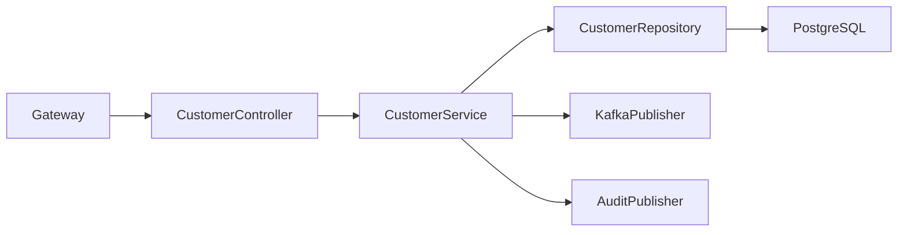
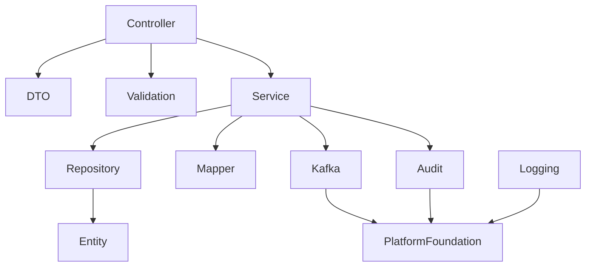
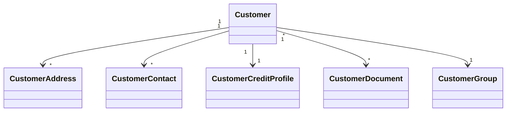

# LLD-004: Customer Service

# 1. Document Information

| Field       | Value                                  |
| ----------- | -------------------------------------- |
| Project     | Distributed Hub & Sales (DHS) Platform |
| Service     | Customer Service                       |
| Document    | Low Level Design                       |
| Document ID | LLD-004                                |
| Repository  | starone-dhs-platform                   |
| Module      | customer-service                       |
| Version     | v1.0.0                                 |
| Status      | Draft                                  |
| Standard    | IEEE 1016                              |
| Owner       | Enterprise Architecture                |

---

# 2. Purpose

This document defines the implementation-level design of the Customer Service.

The Customer Service is the master data service responsible for customer registration, profile management, customer lifecycle, addresses, contacts, customer groups, credit information, and customer master maintenance.

This document implements the requirements defined in **SRS-004 – Customer Service**.

---

# 3. Scope

Customer Service provides:

- Customer Master
- Customer Registration
- Customer Profile
- Customer Address
- Customer Contact
- Customer Group
- Credit Profile
- Customer Status
- Customer Search
- Customer Lifecycle
- Customer Event Publishing

Customer Service shall not own:

- Orders
- Billing
- Products
- Inventory
- Branches
- Identity

---

# 4. Design Principles

## CU-DP-001

Customer Master shall be the single source of truth.

---

## CU-DP-002

Customer Code shall be immutable.

---

## CU-DP-003

Customer lifecycle shall be event-driven.

---

## CU-DP-004

Customer deletion shall use Soft Delete.

---

## CU-DP-005

Customer Service shall remain stateless.

---

## CU-DP-006

Platform Foundation shall provide all infrastructure concerns.

---

# 5. Package Structure

```text
customer-service
│
├── config
├── controller
├── service
├── repository
├── entity
├── dto
├── mapper
├── validation
├── kafka
├── exception
├── audit
├── util
└── client
```

---

# 6. Maven Module Structure

```text
customer-service
│
├── api
├── application
├── domain
├── infrastructure
└── bootstrap
```

---

# 7. Layered Architecture

```text
REST API

↓

Controller

↓

Application Service

↓

Domain

↓

Repository

↓

PostgreSQL
```

Platform Foundation provides

- Security
- Kafka
- Logging
- Validation
- Exception Handling
- OpenFeign
- Audit

---

# 8. Package Design

## controller

```text
controller
│
├── CustomerController
├── CustomerAddressController
├── CustomerContactController
├── CustomerGroupController
└── CustomerSearchController
```

---

## service

```text
service
│
├── CustomerService
├── CustomerAddressService
├── CustomerContactService
├── CustomerGroupService
├── CustomerCreditService
├── CustomerSearchService
├── CustomerValidationService
└── CustomerAuditService
```

---

## repository

```text
repository
│
├── CustomerRepository
├── CustomerAddressRepository
├── CustomerContactRepository
├── CustomerGroupRepository
└── CustomerCreditRepository
```

---

## entity

```text
entity
│
├── Customer
├── CustomerAddress
├── CustomerContact
├── CustomerGroup
├── CustomerCreditProfile
└── CustomerAudit
```

---

## dto

```text
dto
│
├── request
├── response
└── event
```

---

## kafka

```text
kafka
│
├── producer
├── consumer
└── configuration
```

---

# 9. Component Diagram



---

# 10. Package Dependency Diagram



---

# 11. Domain Responsibilities

| Component      | Responsibility          |
| -------------- | ----------------------- |
| Customer       | Customer Master         |
| Address        | Customer Address        |
| Contact        | Contact Information     |
| Customer Group | Customer Classification |
| Credit Profile | Credit Control          |
| Audit          | Change Tracking         |

---

# 12. Service Boundaries

Customer Service owns

- Customer Master
- Address
- Contact
- Customer Group
- Credit Profile

Customer Service does not own

- Orders
- Products
- Inventory
- Billing
- Identity
- Branch

Other services shall reference Customer using **customerId**.

---

# 13. Architecture Constraints

- Controllers shall remain stateless.
- Controllers shall never access repositories directly.
- Services shall contain business logic.
- Repositories shall contain persistence only.
- Customer Code shall be immutable.
- Soft Delete shall be supported.
- Kafka events shall publish after successful commit.
- DTOs shall never expose entities.
- All entities shall extend AuditableEntity.
- APIs shall return ApiResponse<T>.

---

# 14. Class Design

The Customer Service shall implement classes for customer lifecycle management, customer profile management, address management, contact management, customer grouping, credit profile management, and customer search.

The implementation shall follow Layered Architecture and Domain-Driven Design (DDD).

---

# 15. Controller Layer Design

The Controller layer shall expose REST APIs and delegate business processing to the Service layer.

Controllers shall remain stateless.

## Package Structure

```text
controller
│
├── CustomerController
├── CustomerAddressController
├── CustomerContactController
├── CustomerGroupController
├── CustomerCreditController
└── CustomerSearchController
```

---

## CustomerController

### Responsibilities

- Register Customer
- Update Customer
- Activate Customer
- Suspend Customer
- Deactivate Customer
- Get Customer

### APIs

```text
POST   /api/v1/customers

PUT    /api/v1/customers/{customerId}

GET    /api/v1/customers/{customerId}

PUT    /api/v1/customers/{customerId}/activate

PUT    /api/v1/customers/{customerId}/suspend

PUT    /api/v1/customers/{customerId}/deactivate

DELETE /api/v1/customers/{customerId}
```

---

## CustomerAddressController

Responsibilities

- Create Address
- Update Address
- Delete Address
- Set Primary Address

---

## CustomerContactController

Responsibilities

- Create Contact
- Update Contact
- Delete Contact
- Set Primary Contact

---

## CustomerGroupController

Responsibilities

- Assign Customer Group
- Update Customer Group

---

## CustomerCreditController

Responsibilities

- Update Credit Limit
- Block Credit
- Release Credit

---

## CustomerSearchController

Responsibilities

- Search Customer
- Filter Customer
- Customer Lookup

---

# 16. Service Layer Design

Business logic shall reside in the Service layer.

## Package Structure

```text
service
│
├── CustomerService
├── CustomerAddressService
├── CustomerContactService
├── CustomerGroupService
├── CustomerCreditService
├── CustomerSearchService
├── CustomerValidationService
└── CustomerAuditService
```

---

## CustomerService

### Responsibilities

- Register Customer
- Update Customer
- Activate Customer
- Suspend Customer
- Deactivate Customer
- Soft Delete Customer

### Public Methods

```java
createCustomer()

updateCustomer()

getCustomer()

activateCustomer()

suspendCustomer()

deactivateCustomer()

deleteCustomer()
```

---

## CustomerAddressService

Responsibilities

- Address CRUD
- Primary Address Management

---

## CustomerContactService

Responsibilities

- Contact CRUD
- Primary Contact Management

---

## CustomerGroupService

Responsibilities

- Customer Group Assignment
- Customer Classification

---

## CustomerCreditService

Responsibilities

- Credit Profile
- Credit Limit
- Credit Blocking

---

## CustomerSearchService

Responsibilities

- Search
- Filter
- Pagination
- Sorting

---

# 17. Repository Layer Design

Repositories shall encapsulate persistence logic only.

## Package Structure

```text
repository
│
├── CustomerRepository
├── CustomerAddressRepository
├── CustomerContactRepository
├── CustomerGroupRepository
└── CustomerCreditRepository
```

---

## Repository Responsibilities

| Repository                | Responsibility     |
| ------------------------- | ------------------ |
| CustomerRepository        | Customer Master    |
| CustomerAddressRepository | Customer Addresses |
| CustomerContactRepository | Customer Contacts  |
| CustomerGroupRepository   | Customer Groups    |
| CustomerCreditRepository  | Credit Profiles    |

---

# 18. DTO Design

## Request DTOs

```text
dto.request
│
├── CreateCustomerRequest
├── UpdateCustomerRequest
├── CustomerAddressRequest
├── CustomerContactRequest
├── CustomerGroupRequest
├── CustomerCreditRequest
└── CustomerSearchRequest
```

---

## Response DTOs

```text
dto.response
│
├── CustomerResponse
├── CustomerSummaryResponse
├── CustomerAddressResponse
├── CustomerContactResponse
├── CustomerCreditResponse
└── CustomerSearchResponse
```

---

## CustomerResponse

| Field         | Type           |
| ------------- | -------------- |
| id            | UUID           |
| customerCode  | String         |
| customerName  | String         |
| customerType  | CustomerType   |
| status        | CustomerStatus |
| customerGroup | String         |
| creditLimit   | BigDecimal     |

---

# 19. Entity Design

All entities shall extend **AuditableEntity**.

---

## Package Structure

```text
entity
│
├── Customer
├── CustomerAddress
├── CustomerContact
├── CustomerGroup
├── CustomerCreditProfile
├── CustomerDocument
└── CustomerAudit
```

---

## Customer

| Attribute        | Type             |
| ---------------- | ---------------- |
| id               | UUID             |
| customerCode     | String           |
| customerName     | String           |
| customerType     | CustomerType     |
| customerCategory | CustomerCategory |
| customerStatus   | CustomerStatus   |
| gstNumber        | String           |
| panNumber        | String           |
| email            | String           |
| mobileNumber     | String           |
| branchId         | UUID             |

---

## CustomerAddress

| Attribute      | Type        |
| -------------- | ----------- |
| id             | UUID        |
| customerId     | UUID        |
| addressType    | AddressType |
| addressLine1   | String      |
| city           | String      |
| state          | String      |
| postalCode     | String      |
| country        | String      |
| primaryAddress | Boolean     |

---

## CustomerContact

| Attribute      | Type    |
| -------------- | ------- |
| id             | UUID    |
| customerId     | UUID    |
| contactName    | String  |
| designation    | String  |
| email          | String  |
| mobileNumber   | String  |
| primaryContact | Boolean |

---

## CustomerGroup

| Attribute        | Type    |
| ---------------- | ------- |
| id               | UUID    |
| groupCode        | String  |
| groupName        | String  |
| discountEligible | Boolean |

---

## CustomerCreditProfile

| Attribute       | Type       |
| --------------- | ---------- |
| id              | UUID       |
| customerId      | UUID       |
| creditLimit     | BigDecimal |
| availableCredit | BigDecimal |
| creditBlocked   | Boolean    |
| paymentTerms    | String     |

---

## CustomerDocument

| Attribute        | Type         |
| ---------------- | ------------ |
| id               | UUID         |
| customerId       | UUID         |
| documentType     | DocumentType |
| documentName     | String       |
| documentLocation | String       |

---

# 20. Mapper Design

MapStruct shall be the standard mapping framework.

## Package Structure

```text
mapper
│
├── CustomerMapper
├── CustomerAddressMapper
├── CustomerContactMapper
├── CustomerGroupMapper
├── CustomerCreditMapper
└── CustomerDocumentMapper
```

---

## Responsibilities

- DTO → Entity
- Entity → DTO
- Partial Updates
- Page Mapping

---

# 21. Validation Design

## Package Structure

```text
validation
│
├── annotation
├── validator
└── groups
```

---

## Validators

```text
CustomerCodeValidator

GSTValidator

PANValidator

CreditLimitValidator

AddressValidator

ContactValidator

CustomerGroupValidator
```

---

## Validation Rules

| Validator              | Purpose              |
| ---------------------- | -------------------- |
| CustomerCodeValidator  | Unique Customer Code |
| GSTValidator           | GST Validation       |
| PANValidator           | PAN Validation       |
| CreditLimitValidator   | Credit Rules         |
| AddressValidator       | Address Validation   |
| ContactValidator       | Contact Validation   |
| CustomerGroupValidator | Group Validation     |

---

# 22. Exception Hierarchy

```text
RuntimeException
        │
        └── PlatformException
                │
                ├── CustomerNotFoundException
                ├── DuplicateCustomerCodeException
                ├── DuplicateGSTException
                ├── DuplicatePANException
                ├── CustomerAlreadyActiveException
                ├── CustomerAlreadyInactiveException
                ├── CustomerCreditExceededException
                ├── InvalidCustomerStatusException
                └── CustomerGroupNotFoundException
```

---

# 23. Customer Registration Flow

```mermaid
sequenceDiagram

User->>CustomerController: Register Customer

CustomerController->>CustomerService

CustomerService->>ValidationService

ValidationService-->>CustomerService

CustomerService->>CustomerRepository

CustomerRepository-->>CustomerService

CustomerService->>KafkaPublisher

CustomerService-->>CustomerController

CustomerController-->>User
```

---

# 24. Customer Update Flow

```mermaid
sequenceDiagram

User->>CustomerController: Update Customer

CustomerController->>CustomerService

CustomerService->>CustomerRepository

CustomerRepository-->>CustomerService

CustomerService->>KafkaPublisher

CustomerController-->>User
```

---

# 25. Customer Credit Update Flow

```mermaid
sequenceDiagram

Finance->>CustomerCreditController

CustomerCreditController->>CustomerCreditService

CustomerCreditService->>CustomerCreditRepository

CustomerCreditRepository-->>CustomerCreditService

CustomerCreditService->>KafkaPublisher

CustomerCreditController-->>Finance
```

---

# 26. Customer Address Flow

```mermaid
sequenceDiagram

User->>CustomerAddressController

CustomerAddressController->>CustomerAddressService

CustomerAddressService->>Repository

Repository-->>CustomerAddressService

CustomerAddressService-->>Controller

Controller-->>User
```

---

# 27. Customer Search Flow

```mermaid
sequenceDiagram

Client->>CustomerSearchController

CustomerSearchController->>CustomerSearchService

CustomerSearchService->>CustomerRepository

CustomerRepository-->>CustomerSearchService

CustomerSearchService-->>Controller

Controller-->>Client
```

---

# 28. Class Diagram



---

# 29. Design Constraints

- Customer Code shall be immutable.
- Customer lifecycle shall use Soft Delete.
- Customer credit shall never become negative.
- Primary Address shall be unique.
- Primary Contact shall be unique.
- Controllers shall remain stateless.
- Services shall contain all business logic.
- Repository layer shall contain persistence only.
- Kafka events shall publish after successful transaction commit.
- DTOs shall never expose JPA entities.
- All entities shall extend `AuditableEntity`.
- APIs shall return `ApiResponse<T>`.

---

# 30. Security Configuration

The Customer Service shall inherit the enterprise security framework from the Platform Foundation.

Authentication shall be delegated to the Identity Service.

Authorization shall be enforced using Role-Based Access Control (RBAC).

---

## 30.1 Security Architecture

```text
Client

↓

API Gateway

↓

JWT Authentication Filter

↓

Authorization Filter

↓

Customer Controller

↓

Customer Service
```

---

## 30.2 Security Components

```text
security
│
├── config
│   ├── SecurityConfiguration
│   ├── MethodSecurityConfiguration
│   └── CorsConfiguration
│
├── filter
│   ├── JwtAuthenticationFilter
│   ├── AuthorizationFilter
│   └── CorrelationIdFilter
│
├── permission
│   ├── CustomerPermissionEvaluator
│   └── CustomerAccessValidator
│
└── annotation
    └── RequireCustomerPermission
```

---

## 30.3 Permissions

| Permission             | Description           |
| ---------------------- | --------------------- |
| CUSTOMER_CREATE        | Register Customer     |
| CUSTOMER_UPDATE        | Update Customer       |
| CUSTOMER_DELETE        | Delete Customer       |
| CUSTOMER_VIEW          | View Customer         |
| CUSTOMER_SEARCH        | Search Customers      |
| CUSTOMER_CREDIT_UPDATE | Update Credit Profile |
| CUSTOMER_GROUP_ASSIGN  | Assign Customer Group |

---

## 30.4 Authorization Flow

```mermaid
sequenceDiagram

Client->>Gateway: JWT Token

Gateway->>Identity Service: Validate Token

Identity Service-->>Gateway: Claims

Gateway->>Customer Service

Customer Service->>PermissionEvaluator

PermissionEvaluator-->>Customer Service

Customer Service-->>Client
```

---

# 31. JWT Implementation

Customer Service shall consume JWT claims generated by the Identity Service.

JWT validation shall be performed by Platform Foundation.

---

## Required Claims

```json
{
  "sub": "UUID",
  "username": "sales.user",
  "roles": ["SALES_EXECUTIVE"],
  "permissions": ["CUSTOMER_CREATE", "CUSTOMER_VIEW"],
  "tenantId": "UUID",
  "branchId": "UUID"
}
```

---

## User Context

Every request shall populate

```text
UserId

Username

Roles

Permissions

TenantId

BranchId

CorrelationId
```

---

# 32. Authorization Design

Permission-based authorization shall be implemented.

---

## Example

```java
@PreAuthorize("hasAuthority('CUSTOMER_CREATE')")
```

or

```java
@RequireCustomerPermission("CUSTOMER_CREATE")
```

---

## Permission Matrix

| API             | Permission             |
| --------------- | ---------------------- |
| Create Customer | CUSTOMER_CREATE        |
| Update Customer | CUSTOMER_UPDATE        |
| Delete Customer | CUSTOMER_DELETE        |
| View Customer   | CUSTOMER_VIEW          |
| Search Customer | CUSTOMER_SEARCH        |
| Update Credit   | CUSTOMER_CREDIT_UPDATE |
| Assign Group    | CUSTOMER_GROUP_ASSIGN  |

---

# 33. Kafka Design

Customer Service shall publish customer lifecycle events.

---

## Published Topics

```text
customer.created.v1

customer.updated.v1

customer.activated.v1

customer.deactivated.v1

customer.deleted.v1

customer.group.updated.v1

customer.credit.updated.v1
```

---

## Consumed Topics

```text
branch.updated.v1

identity.user.updated.v1
```

---

## Package Structure

```text
kafka
│
├── producer
├── consumer
├── configuration
├── event
└── mapper
```

---

## Standard Event

```json
{
  "eventId": "UUID",
  "eventType": "CustomerCreated",
  "eventVersion": "1.0",
  "occurredAt": "2026-06-27T10:00:00Z",
  "correlationId": "UUID",
  "payload": {}
}
```

---

# 34. OpenFeign Design

Customer Service shall use synchronous communication only when immediate validation is required.

---

## Feign Clients

```text
client
│
├── BranchClient
├── IdentityClient
├── NotificationClient
└── AuditClient
```

---

## Responsibilities

| Client             | Purpose               |
| ------------------ | --------------------- |
| BranchClient       | Validate Branch       |
| IdentityClient     | User Validation       |
| NotificationClient | Welcome Notifications |
| AuditClient        | Audit Submission      |

---

# 35. Configuration Classes

```text
config
│
├── SecurityConfiguration
├── KafkaConfiguration
├── FeignConfiguration
├── CacheConfiguration
├── JacksonConfiguration
├── ValidationConfiguration
├── MetricsConfiguration
├── SchedulerConfiguration
└── OpenApiConfiguration
```

---

## Responsibilities

| Configuration | Responsibility       |
| ------------- | -------------------- |
| Security      | Spring Security      |
| Kafka         | Kafka Infrastructure |
| Feign         | OpenFeign            |
| Cache         | Redis Cache          |
| Jackson       | JSON Serialization   |
| Validation    | Bean Validation      |
| Metrics       | Micrometer           |
| Scheduler     | Background Jobs      |
| OpenAPI       | Swagger              |

---

# 36. Transaction Design

Customer transactions shall remain local.

Distributed workflows shall communicate using Kafka.

---

## Transaction Types

| Operation             | Propagation  |
| --------------------- | ------------ |
| Customer Registration | REQUIRED     |
| Customer Update       | REQUIRED     |
| Credit Update         | REQUIRED     |
| Group Assignment      | REQUIRED     |
| Event Publish         | AFTER_COMMIT |

---

## Transaction Flow

```mermaid
flowchart LR

Controller

-->

Service

-->

Repository

-->

Commit

-->

Kafka Event
```

---

# 37. Cache Design

Redis shall cache frequently accessed customer reference data.

---

## Cached Objects

```text
Customer Summary

Customer Group

Credit Profile

Customer Search

Reference Data
```

---

## Cache Annotations

```java
@Cacheable

@CachePut

@CacheEvict
```

---

# 38. Resilience Patterns

The Customer Service shall use Resilience4j.

---

## Retry

Notification Service

---

## Circuit Breaker

Branch Service

Notification Service

Audit Service

---

## Rate Limiter

Customer Search

Customer Registration

---

## Bulkhead

Feign Integrations

---

## Timeout

External Service Calls

---

# 39. Scheduler Design

Scheduled jobs shall support operational maintenance.

---

## Scheduled Jobs

```text
scheduler
│
├── CustomerCacheRefreshScheduler
├── CreditProfileValidationScheduler
├── CustomerStatusScheduler
└── AuditCleanupScheduler
```

---

# 40. External Integration Design

| Service              | Purpose               |
| -------------------- | --------------------- |
| Identity Service     | Authentication        |
| Branch Service       | Branch Validation     |
| Notification Service | Welcome Notifications |
| Audit Service        | Audit Logging         |
| Reporting Service    | Customer Analytics    |

---

# 41. Configuration Properties

| Property                      | Default |
| ----------------------------- | ------- |
| customer.cache.enabled        | true    |
| customer.cache.ttl            | 3600    |
| customer.search.max-page-size | 100     |
| customer.credit.validation    | true    |
| customer.kafka.retry          | 3       |

---

# 42. Data Consistency Strategy

- Customer Code shall remain unique.
- Customer Group shall exist before assignment.
- Credit Profile shall always exist.
- Events shall publish after successful commit.
- Soft Deleted customers shall not appear in searches.

---

# 43. Performance Considerations

- Customer search shall support pagination.
- Frequently accessed customer summaries shall be cached.
- Credit Profile lookup shall use Redis cache.
- Search queries shall use indexed columns.

---

# 44. Design Constraints

- Customer Code shall never change.
- Customer deletion shall be Soft Delete.
- JWT authentication shall be mandatory.
- Authorization shall use permissions.
- Kafka events shall publish after commit.
- Repository layer shall never invoke external services.
- Configuration shall be externalized.
- OpenFeign shall be used only for synchronous validation.
- All outbound requests shall propagate Correlation ID.

---

# 45. Technology Standards

| Concern           | Technology              |
| ----------------- | ----------------------- |
| Java              | Java 21                 |
| Spring Boot       | 3.x                     |
| Spring Security   | Spring Security 6       |
| Authentication    | JWT                     |
| Authorization     | RBAC                    |
| Database          | PostgreSQL              |
| Cache             | Redis                   |
| Messaging         | Apache Kafka            |
| Service Calls     | OpenFeign               |
| Validation        | Jakarta Bean Validation |
| Mapping           | MapStruct               |
| Logging           | SLF4J + Logback         |
| Metrics           | Micrometer              |
| Tracing           | OpenTelemetry           |
| Service Discovery | Eureka                  |

---

# 46. Logging Design

The Customer Service shall implement centralized structured logging using the Platform Foundation logging framework.

Every customer operation, integration, and business event shall be logged using standardized MDC attributes.

---

## 46.1 Logging Architecture

```text
REST Request

↓

Correlation Filter

↓

Logging Aspect

↓

SLF4J

↓

Logback

↓

ELK / OpenSearch / Splunk
```

---

## 46.2 Log Levels

| Level | Purpose                  |
| ----- | ------------------------ |
| TRACE | Framework Diagnostics    |
| DEBUG | Development              |
| INFO  | Business Events          |
| WARN  | Recoverable Errors       |
| ERROR | Business/System Failures |

---

## 46.3 MDC Context

Every log entry shall include

```text
Correlation ID

Trace ID

Span ID

User ID

Customer ID

Branch ID

Tenant ID

Request URI

HTTP Method

Service Name

Environment
```

---

## 46.4 Business Events

The following events shall always be logged.

- Customer Registered
- Customer Updated
- Customer Activated
- Customer Suspended
- Customer Deactivated
- Customer Deleted
- Customer Address Updated
- Customer Contact Updated
- Customer Credit Updated
- Customer Group Assigned

---

## 46.5 Sensitive Data

The following shall never be logged.

- JWT Tokens
- Passwords
- Authorization Headers
- Credit Card Information
- Bank Details
- Personally Identifiable Information (PII)
- Encryption Keys

---

# 47. Observability

Customer Service shall expose metrics through Micrometer.

---

## JVM Metrics

- Heap Usage
- CPU Usage
- Thread Count
- Garbage Collection

---

## Business Metrics

- Customers Registered
- Active Customers
- Suspended Customers
- Customer Searches
- Customer Updates
- Credit Profile Updates
- Customer Group Assignments

---

## Infrastructure Metrics

- Database Connections
- Kafka Publish Rate
- Redis Cache Hit Ratio
- API Response Time
- Kafka Consumer Lag

---

# 48. Distributed Tracing

Every request shall propagate distributed tracing metadata.

---

## Trace Flow

```mermaid
sequenceDiagram

Client->>Gateway

Gateway->>Customer Service

Customer Service->>Branch Service

Customer Service->>Notification Service

Customer Service->>Audit Service

Customer Service-->>Gateway

Gateway-->>Client
```

---

## Trace Context

Every request shall propagate

- Correlation ID
- Trace ID
- Span ID

---

# 49. Health Checks

Customer Service shall expose Spring Boot Actuator endpoints.

---

## Health

```text
GET /actuator/health
```

---

## Liveness

```text
GET /actuator/health/liveness
```

---

## Readiness

```text
GET /actuator/health/readiness
```

Dependencies

- PostgreSQL
- Kafka
- Redis
- Config Server

---

## Metrics

```text
GET /actuator/metrics
```

---

## Prometheus

```text
GET /actuator/prometheus
```

---

# 50. Deployment Design

Customer Service shall be deployed as an independent containerized microservice.

---

## Deployment Architecture

```text
Gateway

↓

Customer Service

↓

PostgreSQL

↓

Redis

↓

Kafka
```

---

## Kubernetes Resources

```text
Deployment

Service

Ingress

ConfigMap

Secret

HorizontalPodAutoscaler

ServiceMonitor

PodDisruptionBudget
```

---

# 51. Dependency Management

Customer Service shall inherit the enterprise Platform BOM.

```xml
<dependencyManagement>

<dependency>

<groupId>com.starone</groupId>

<artifactId>platform-foundation-bom</artifactId>

</dependency>

</dependencyManagement>
```

---

## Primary Dependencies

- Spring Boot
- Spring Security
- Spring Data JPA
- Spring Kafka
- Spring Validation
- PostgreSQL Driver
- Redis
- OpenFeign
- Micrometer
- OpenTelemetry
- MapStruct
- Lombok

---

# 52. Coding Standards

Customer Service shall comply with enterprise coding standards.

---

## Controller

- Stateless
- Validation Only
- No Business Logic

---

## Service

- Stateless
- Transactional
- Business Orchestration

---

## Repository

- Persistence Only
- No External Calls

---

## DTO

- Immutable
- Validation Annotations

---

## Entity

- Extend AuditableEntity
- Soft Delete Support
- Never Exposed Directly

---

# 53. Package Naming Standards

```text
com.starone.customer

├── controller
├── service
├── repository
├── entity
├── dto
├── mapper
├── validation
├── config
├── kafka
├── exception
├── audit
├── util
└── client
```

---

# 54. Testing Strategy

## Unit Testing

Framework

```text
JUnit 5

Mockito
```

Coverage

```text
Minimum 90%
```

---

## Integration Testing

- Spring Boot Test
- Testcontainers
- Embedded Kafka

---

## API Testing

- REST Assured
- Spring MockMvc

---

## Performance Testing

- Customer Registration
- Customer Search
- Credit Update
- Bulk Customer Search

---

## Static Analysis

- SonarQube
- SpotBugs
- PMD
- Checkstyle

---

# 55. Build Validation

Every Pull Request shall verify

- Compilation
- Unit Tests
- Integration Tests
- Static Analysis
- Security Scan
- Dependency Scan
- Documentation Validation
- Code Coverage

---

# 56. Quality Gates

| Metric                   | Target    |
| ------------------------ | --------- |
| Unit Test Coverage       | ≥90%      |
| Integration Tests        | 100% Pass |
| Critical Bugs            | 0         |
| Critical Vulnerabilities | 0         |
| Code Duplication         | <3%       |
| Documentation            | Mandatory |

---

# 57. Implementation Guidelines

Customer Service shall reuse Platform Foundation components.

Business code shall never duplicate

- JWT Security
- Logging
- Validation
- Kafka Infrastructure
- Exception Handling
- Audit Framework
- API Response Models
- Pagination Framework

---

# 58. Extension Guidelines

Business-specific functionality shall extend Platform Foundation components where applicable.

Permitted extensions include

- AuditableEntity
- PlatformException
- ApiResponse
- BaseMapper
- AuditService

Platform Foundation source code shall never be modified by Customer Service.

---

# 59. Design Checklist

Before implementation verify

- Customer Code uniqueness enforced
- Soft Delete implemented
- Customer Group validation enabled
- Credit Profile validation implemented
- Controllers contain no business logic
- Services are stateless
- Repository layer contains persistence only
- Kafka events publish after transaction commit
- Redis cache configured
- Correlation ID propagation enabled
- Health endpoints exposed
- Metrics published
- Configuration externalized
- Unit test coverage meets quality gates

---

# 60. Appendix A – Framework Versions

| Component       | Version          |
| --------------- | ---------------- |
| Java            | 21               |
| Spring Boot     | 3.x              |
| Spring Security | 6.x              |
| Spring Cloud    | 2025.x           |
| PostgreSQL      | Latest Supported |
| Redis           | Latest Supported |
| Kafka           | Latest Supported |
| OpenFeign       | Latest Supported |
| Micrometer      | Latest Supported |
| OpenTelemetry   | Latest Supported |
| MapStruct       | Latest Stable    |
| Lombok          | Latest Stable    |
| JUnit           | 5.x              |

---

# 61. Appendix B – Layer Responsibility Matrix

| Layer      | Responsibility          |
| ---------- | ----------------------- |
| Controller | Request Handling        |
| Service    | Customer Business Logic |
| Repository | Persistence             |
| Kafka      | Event Publishing        |
| Mapper     | DTO Conversion          |
| Validation | Request Validation      |
| Audit      | Audit Trail             |

---

# 62. Appendix C – Customer Components

```text
CustomerController

CustomerAddressController

CustomerContactController

CustomerGroupController

CustomerCreditController

CustomerSearchController

CustomerService

CustomerAddressService

CustomerContactService

CustomerGroupService

CustomerCreditService

CustomerRepository

CustomerAddressRepository

CustomerContactRepository

CustomerGroupRepository

CustomerCreditRepository
```

---

# 63. Appendix D – Customer Processing Summary

```text
Client

↓

Gateway

↓

JWT Authentication

↓

Authorization

↓

Controller

↓

Service

↓

Repository

↓

Kafka Event

↓

Audit Event

↓

Response
```

---

# 64. Appendix E – Repository Responsibilities

| Repository                    | Responsibility                      |
| ----------------------------- | ----------------------------------- |
| starone-galaxy-architecture   | Enterprise Standards & Architecture |
| starone-galaxy-central-config | Configuration Management            |
| starone-galaxy-infra          | Infrastructure & CI/CD              |
| starone-dhs-platform          | Customer Service Implementation     |

---

# 65. Conclusion

The Customer Service provides centralized customer master management for the DHS platform, including customer lifecycle, profile management, address management, contact management, customer grouping, and credit profile management. It serves as the authoritative source for customer information across all business services while leveraging the Platform Foundation for security, logging, observability, messaging, validation, and other cross-cutting capabilities. The implementation ensures consistency, scalability, maintainability, and compliance with enterprise architecture standards.

---

# End of Document
