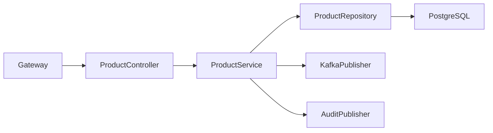
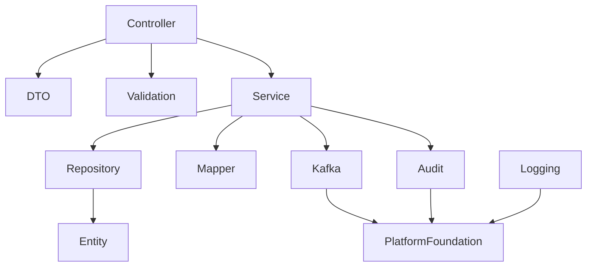
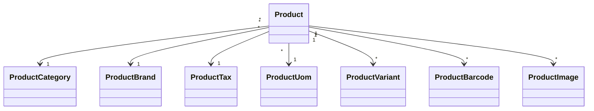

# LLD-005: Product Service

# 1. Document Information

| Field | Value |
|--------|-------|
| Project | Distributed Hub & Sales (DHS) Platform |
| Service | Product Service |
| Document | Low Level Design |
| Document ID | LLD-005 |
| Repository | starone-dhs-platform |
| Module | product-service |
| Version | v1.0.0 |
| Status | Draft |
| Standard | IEEE 1016 |
| Owner | Enterprise Architecture |

---

# 2. Purpose

This document defines the implementation-level architecture of the Product Service.

The Product Service is the enterprise Product Master responsible for product lifecycle management, category management, brand management, UOM management, pricing references, tax classification, product variants, barcode management, and product search.

This document implements the requirements defined in **SRS-005 – Product Service**.

---

# 3. Scope

The Product Service provides

- Product Master
- Product Category
- Product Brand
- Product Variant
- Product SKU
- Barcode Management
- Unit of Measure (UOM)
- Product Tax Classification
- Product Images
- Product Search
- Product Lifecycle
- Product Event Publishing

Product Service shall not own

- Inventory
- Pricing Engine
- Procurement
- Orders
- Billing

Those services shall reference Product using **productId**.

---

# 4. Design Principles

## PRD-DP-001

Product Master shall be the enterprise source of truth.

---

## PRD-DP-002

SKU shall be immutable.

---

## PRD-DP-003

Barcode shall be globally unique.

---

## PRD-DP-004

Product lifecycle shall be event-driven.

---

## PRD-DP-005

Soft Delete shall be used.

---

## PRD-DP-006

Infrastructure concerns shall reuse Platform Foundation.

---

# 5. Package Structure

```text
product-service
│
├── config
├── controller
├── service
├── repository
├── entity
├── dto
├── mapper
├── validation
├── kafka
├── exception
├── audit
├── util
└── client
```

---

# 6. Maven Module Structure

```text
product-service
│
├── api
├── application
├── domain
├── infrastructure
└── bootstrap
```

---

# 7. Layered Architecture

```text
REST API

↓

Controller

↓

Application Service

↓

Domain

↓

Repository

↓

PostgreSQL
```

Platform Foundation provides

- Security
- Logging
- Validation
- Kafka
- OpenFeign
- Exception Handling
- Audit

---

# 8. Package Design

## controller

```text
controller
│
├── ProductController
├── ProductCategoryController
├── ProductBrandController
├── ProductVariantController
├── ProductImageController
├── ProductBarcodeController
├── ProductUomController
└── ProductSearchController
```

---

## service

```text
service
│
├── ProductService
├── ProductCategoryService
├── ProductBrandService
├── ProductVariantService
├── ProductBarcodeService
├── ProductImageService
├── ProductUomService
├── ProductSearchService
├── ProductValidationService
└── ProductAuditService
```

---

## repository

```text
repository
│
├── ProductRepository
├── ProductCategoryRepository
├── ProductBrandRepository
├── ProductVariantRepository
├── ProductBarcodeRepository
├── ProductImageRepository
└── ProductUomRepository
```

---

## entity

```text
entity
│
├── Product
├── ProductCategory
├── ProductBrand
├── ProductVariant
├── ProductBarcode
├── ProductImage
├── ProductUom
├── ProductTax
└── ProductAudit
```

---

## dto

```text
dto
│
├── request
├── response
└── event
```

---

## kafka

```text
kafka
│
├── producer
├── consumer
└── configuration
```

---

# 9. Component Diagram



---

# 10. Package Dependency Diagram



---

# 11. Domain Responsibilities

| Component | Responsibility |
|------------|----------------|
| Product | Product Master |
| Category | Category Master |
| Brand | Brand Master |
| Variant | Product Variants |
| Barcode | Barcode Management |
| Image | Product Images |
| UOM | Unit of Measure |
| Tax | Product Tax Classification |

---

# 12. Service Boundaries

Product Service owns

- Product Master
- Categories
- Brands
- Variants
- Barcodes
- Images
- UOM
- Tax Classification

Product Service does not own

- Inventory
- Orders
- Procurement
- Pricing Engine
- Billing
- Supplier

Other services shall reference Product using **productId**.

---

# 13. Architecture Constraints

- Controllers shall remain stateless.
- Controllers shall never access repositories directly.
- Services shall contain business logic.
- Repositories shall contain persistence only.
- SKU shall be immutable.
- Barcode shall remain globally unique.
- Product deletion shall use Soft Delete.
- DTOs shall never expose entities.
- Kafka events shall publish after successful transaction commit.
- All entities shall extend AuditableEntity.
- APIs shall return ApiResponse<T>.

---

# 14. Class Design

The Product Service shall implement classes for product lifecycle management, category management, brand management, product variants, barcode management, unit of measure management, tax classification, product images, and product search.

The implementation shall follow Layered Architecture and Domain-Driven Design (DDD).

---

# 15. Controller Layer Design

The Controller layer shall expose REST APIs and delegate business processing to the Service layer.

Controllers shall remain stateless.

## Package Structure

```text
controller
│
├── ProductController
├── ProductCategoryController
├── ProductBrandController
├── ProductVariantController
├── ProductBarcodeController
├── ProductImageController
├── ProductUomController
├── ProductTaxController
└── ProductSearchController
```

---

## ProductController

### Responsibilities

- Create Product
- Update Product
- Activate Product
- Discontinue Product
- Archive Product
- Get Product

### APIs

```text
POST   /api/v1/products

PUT    /api/v1/products/{productId}

GET    /api/v1/products/{productId}

PUT    /api/v1/products/{productId}/activate

PUT    /api/v1/products/{productId}/discontinue

PUT    /api/v1/products/{productId}/archive

DELETE /api/v1/products/{productId}
```

---

## ProductCategoryController

Responsibilities

- Create Category
- Update Category
- Delete Category
- Search Categories

---

## ProductBrandController

Responsibilities

- Create Brand
- Update Brand
- Delete Brand

---

## ProductVariantController

Responsibilities

- Create Variant
- Update Variant
- Activate Variant

---

## ProductBarcodeController

Responsibilities

- Assign Barcode
- Replace Barcode
- Validate Barcode

---

## ProductImageController

Responsibilities

- Upload Image
- Delete Image
- Set Primary Image

---

## ProductUomController

Responsibilities

- Create UOM
- Update UOM
- Search UOM

---

## ProductTaxController

Responsibilities

- Assign Tax Classification
- Update Tax Classification

---

## ProductSearchController

Responsibilities

- Product Search
- Product Lookup
- Advanced Filtering

---

# 16. Service Layer Design

Business logic shall reside in the Service layer.

## Package Structure

```text
service
│
├── ProductService
├── ProductCategoryService
├── ProductBrandService
├── ProductVariantService
├── ProductBarcodeService
├── ProductImageService
├── ProductUomService
├── ProductTaxService
├── ProductSearchService
├── ProductValidationService
└── ProductAuditService
```

---

## ProductService

### Responsibilities

- Create Product
- Update Product
- Activate Product
- Archive Product
- Soft Delete Product

### Public Methods

```java
createProduct()

updateProduct()

getProduct()

activateProduct()

discontinueProduct()

archiveProduct()

deleteProduct()
```

---

## ProductCategoryService

Responsibilities

- Category CRUD
- Category Hierarchy

---

## ProductBrandService

Responsibilities

- Brand CRUD

---

## ProductVariantService

Responsibilities

- Variant CRUD
- SKU Variant Management

---

## ProductBarcodeService

Responsibilities

- Barcode Assignment
- Barcode Validation

---

## ProductImageService

Responsibilities

- Image Upload
- Primary Image Management

---

## ProductUomService

Responsibilities

- Unit of Measure Management

---

## ProductTaxService

Responsibilities

- GST/HSN Classification
- Tax Validation

---

## ProductSearchService

Responsibilities

- Search
- Filtering
- Pagination
- Sorting

---

# 17. Repository Layer Design

Repositories shall encapsulate persistence logic only.

## Package Structure

```text
repository
│
├── ProductRepository
├── ProductCategoryRepository
├── ProductBrandRepository
├── ProductVariantRepository
├── ProductBarcodeRepository
├── ProductImageRepository
├── ProductUomRepository
└── ProductTaxRepository
```

---

## Repository Responsibilities

| Repository | Responsibility |
|------------|----------------|
| ProductRepository | Product Master |
| ProductCategoryRepository | Categories |
| ProductBrandRepository | Brands |
| ProductVariantRepository | Variants |
| ProductBarcodeRepository | Barcodes |
| ProductImageRepository | Images |
| ProductUomRepository | UOM |
| ProductTaxRepository | Tax Classification |

---

# 18. DTO Design

## Request DTOs

```text
dto.request
│
├── CreateProductRequest
├── UpdateProductRequest
├── ProductCategoryRequest
├── ProductBrandRequest
├── ProductVariantRequest
├── ProductBarcodeRequest
├── ProductImageRequest
├── ProductUomRequest
├── ProductTaxRequest
└── ProductSearchRequest
```

---

## Response DTOs

```text
dto.response
│
├── ProductResponse
├── ProductSummaryResponse
├── ProductCategoryResponse
├── ProductBrandResponse
├── ProductVariantResponse
├── ProductBarcodeResponse
├── ProductImageResponse
├── ProductUomResponse
└── ProductSearchResponse
```

---

## ProductResponse

| Field | Type |
|---------|------|
| id | UUID |
| sku | String |
| productName | String |
| category | String |
| brand | String |
| status | ProductStatus |
| uom | String |
| hsnCode | String |

---

# 19. Entity Design

All entities shall extend **AuditableEntity**.

---

## Package Structure

```text
entity
│
├── Product
├── ProductCategory
├── ProductBrand
├── ProductVariant
├── ProductBarcode
├── ProductImage
├── ProductUom
├── ProductTax
└── ProductDocument
```

---

## Product

| Attribute | Type |
|------------|------|
| id | UUID |
| sku | String |
| productName | String |
| shortDescription | String |
| longDescription | String |
| categoryId | UUID |
| brandId | UUID |
| taxId | UUID |
| uomId | UUID |
| status | ProductStatus |

---

## ProductCategory

| Attribute | Type |
|------------|------|
| id | UUID |
| categoryCode | String |
| categoryName | String |
| parentCategoryId | UUID |

---

## ProductBrand

| Attribute | Type |
|------------|------|
| id | UUID |
| brandCode | String |
| brandName | String |

---

## ProductVariant

| Attribute | Type |
|------------|------|
| id | UUID |
| productId | UUID |
| variantCode | String |
| variantName | String |
| sku | String |

---

## ProductBarcode

| Attribute | Type |
|------------|------|
| id | UUID |
| productId | UUID |
| barcode | String |
| barcodeType | BarcodeType |

---

## ProductImage

| Attribute | Type |
|------------|------|
| id | UUID |
| productId | UUID |
| imageUrl | String |
| primaryImage | Boolean |

---

## ProductUom

| Attribute | Type |
|------------|------|
| id | UUID |
| uomCode | String |
| uomName | String |
| decimalPrecision | Integer |

---

## ProductTax

| Attribute | Type |
|------------|------|
| id | UUID |
| hsnCode | String |
| gstRate | BigDecimal |
| cessRate | BigDecimal |

---

# 20. Mapper Design

MapStruct shall be the standard mapping framework.

## Package Structure

```text
mapper
│
├── ProductMapper
├── ProductCategoryMapper
├── ProductBrandMapper
├── ProductVariantMapper
├── ProductBarcodeMapper
├── ProductImageMapper
├── ProductUomMapper
└── ProductTaxMapper
```

---

## Responsibilities

- DTO → Entity
- Entity → DTO
- Partial Updates
- Page Mapping

---

# 21. Validation Design

## Package Structure

```text
validation
│
├── annotation
├── validator
└── groups
```

---

## Validators

```text
SkuValidator

BarcodeValidator

CategoryValidator

BrandValidator

VariantValidator

HsnValidator

UomValidator
```

---

## Validation Rules

| Validator | Purpose |
|------------|----------|
| SkuValidator | SKU Uniqueness |
| BarcodeValidator | Barcode Uniqueness |
| CategoryValidator | Category Validation |
| BrandValidator | Brand Validation |
| VariantValidator | Variant Validation |
| HsnValidator | HSN Validation |
| UomValidator | UOM Validation |

---

# 22. Exception Hierarchy

```text
RuntimeException
        │
        └── PlatformException
                │
                ├── ProductNotFoundException
                ├── DuplicateSkuException
                ├── DuplicateBarcodeException
                ├── CategoryNotFoundException
                ├── BrandNotFoundException
                ├── VariantNotFoundException
                ├── InvalidTaxClassificationException
                ├── InvalidUomException
                └── ProductAlreadyArchivedException
```

---

# 23. Product Creation Flow

```mermaid
sequenceDiagram

User->>ProductController: Create Product

ProductController->>ProductService

ProductService->>ValidationService

ValidationService-->>ProductService

ProductService->>ProductRepository

ProductRepository-->>ProductService

ProductService->>KafkaPublisher

ProductService-->>ProductController

ProductController-->>User
```

---

# 24. Product Update Flow

```mermaid
sequenceDiagram

User->>ProductController: Update Product

ProductController->>ProductService

ProductService->>ProductRepository

ProductRepository-->>ProductService

ProductService->>KafkaPublisher

ProductController-->>User
```

---

# 25. Variant Creation Flow

```mermaid
sequenceDiagram

Admin->>ProductVariantController

ProductVariantController->>ProductVariantService

ProductVariantService->>Repository

Repository-->>ProductVariantService

ProductVariantService->>KafkaPublisher

ProductVariantController-->>Admin
```

---

# 26. Barcode Assignment Flow

```mermaid
sequenceDiagram

Admin->>ProductBarcodeController

ProductBarcodeController->>ProductBarcodeService

ProductBarcodeService->>ValidationService

ValidationService-->>ProductBarcodeService

ProductBarcodeService->>Repository

Repository-->>ProductBarcodeService

ProductBarcodeController-->>Admin
```

---

# 27. Product Search Flow

```mermaid
sequenceDiagram

Client->>ProductSearchController

ProductSearchController->>ProductSearchService

ProductSearchService->>ProductRepository

ProductRepository-->>ProductSearchService

ProductSearchService-->>ProductSearchController

ProductSearchController-->>Client
```

---

# 28. Class Diagram



---

# 29. Design Constraints

- SKU shall be immutable.
- Barcode shall remain globally unique.
- Product lifecycle shall use Soft Delete.
- Product variants shall inherit the parent Product.
- Controllers shall remain stateless.
- Services shall contain all business logic.
- Repository layer shall contain persistence only.
- Kafka events shall publish after successful transaction commit.
- DTOs shall never expose JPA entities.
- All entities shall extend `AuditableEntity`.
- APIs shall return `ApiResponse<T>`.

---

# 30. Security Configuration

The Product Service shall inherit the enterprise security framework from the Platform Foundation.

Authentication shall be delegated to the Identity Service.

Authorization shall be enforced using Role-Based Access Control (RBAC).

---

## 30.1 Security Architecture

```text
Client

↓

API Gateway

↓

JWT Authentication Filter

↓

Authorization Filter

↓

Product Controller

↓

Product Service
```

---

## 30.2 Security Components

```text
security
│
├── config
│   ├── SecurityConfiguration
│   ├── MethodSecurityConfiguration
│   └── CorsConfiguration
│
├── filter
│   ├── JwtAuthenticationFilter
│   ├── AuthorizationFilter
│   └── CorrelationIdFilter
│
├── permission
│   ├── ProductPermissionEvaluator
│   └── ProductAccessValidator
│
└── annotation
    └── RequireProductPermission
```

---

## 30.3 Permissions

| Permission | Description |
|------------|-------------|
| PRODUCT_CREATE | Create Product |
| PRODUCT_UPDATE | Update Product |
| PRODUCT_DELETE | Archive Product |
| PRODUCT_VIEW | View Product |
| PRODUCT_SEARCH | Search Products |
| PRODUCT_CATEGORY_MANAGE | Manage Categories |
| PRODUCT_BRAND_MANAGE | Manage Brands |
| PRODUCT_VARIANT_MANAGE | Manage Variants |
| PRODUCT_BARCODE_MANAGE | Manage Barcodes |
| PRODUCT_IMAGE_MANAGE | Manage Images |
| PRODUCT_UOM_MANAGE | Manage UOM |
| PRODUCT_TAX_MANAGE | Manage Tax Classification |

---

## 30.4 Authorization Flow

```mermaid
sequenceDiagram

Client->>Gateway: JWT

Gateway->>Identity Service: Validate

Identity Service-->>Gateway: Claims

Gateway->>Product Service

Product Service->>PermissionEvaluator

PermissionEvaluator-->>Product Service

Product Service-->>Client
```

---

# 31. JWT Implementation

JWT validation shall be handled by Platform Foundation.

Product Service shall consume authenticated user context.

---

## Required Claims

```json
{
  "sub":"UUID",
  "username":"product.manager",
  "roles":["PRODUCT_MANAGER"],
  "permissions":[
      "PRODUCT_CREATE",
      "PRODUCT_UPDATE"
  ],
  "tenantId":"UUID",
  "branchId":"UUID"
}
```

---

## User Context

Every request shall expose

```text
UserId

Username

Roles

Permissions

TenantId

BranchId

CorrelationId
```

---

# 32. Authorization Design

Permission-based authorization shall be implemented.

---

## Example

```java
@PreAuthorize("hasAuthority('PRODUCT_CREATE')")
```

or

```java
@RequireProductPermission("PRODUCT_CREATE")
```

---

## Permission Matrix

| API | Permission |
|-----|------------|
| Create Product | PRODUCT_CREATE |
| Update Product | PRODUCT_UPDATE |
| Archive Product | PRODUCT_DELETE |
| View Product | PRODUCT_VIEW |
| Search Product | PRODUCT_SEARCH |
| Manage Categories | PRODUCT_CATEGORY_MANAGE |
| Manage Brands | PRODUCT_BRAND_MANAGE |
| Manage Variants | PRODUCT_VARIANT_MANAGE |
| Manage Barcodes | PRODUCT_BARCODE_MANAGE |
| Manage Images | PRODUCT_IMAGE_MANAGE |
| Manage UOM | PRODUCT_UOM_MANAGE |
| Manage Tax | PRODUCT_TAX_MANAGE |

---

# 33. Kafka Design

The Product Service shall publish product lifecycle events.

---

## Published Topics

```text
product.created.v1

product.updated.v1

product.archived.v1

product.activated.v1

product.deactivated.v1

product.category.created.v1

product.category.updated.v1

product.brand.created.v1

product.brand.updated.v1

product.variant.created.v1

product.variant.updated.v1

product.barcode.assigned.v1

product.image.uploaded.v1

product.tax.updated.v1
```

---

## Consumed Topics

```text
supplier.updated.v1

procurement.item.created.v1
```

---

## Kafka Package

```text
kafka
│
├── producer
├── consumer
├── configuration
├── mapper
└── event
```

---

## Event Envelope

```json
{
  "eventId":"UUID",
  "eventType":"ProductCreated",
  "eventVersion":"1.0",
  "occurredAt":"2026-06-27T10:00:00Z",
  "correlationId":"UUID",
  "payload":{}
}
```

---

# 34. OpenFeign Design

Product Service shall communicate synchronously only where immediate validation is required.

---

## Feign Clients

```text
client
│
├── SupplierClient
├── InventoryClient
├── AuditClient
└── NotificationClient
```

---

## Responsibilities

| Client | Responsibility |
|---------|----------------|
| SupplierClient | Preferred Supplier Validation |
| InventoryClient | Inventory Availability Lookup |
| AuditClient | Audit Submission |
| NotificationClient | Product Notifications |

---

# 35. Configuration Classes

```text
config
│
├── SecurityConfiguration
├── KafkaConfiguration
├── FeignConfiguration
├── CacheConfiguration
├── JacksonConfiguration
├── ValidationConfiguration
├── SchedulerConfiguration
├── MetricsConfiguration
└── OpenApiConfiguration
```

---

## Responsibilities

| Configuration | Responsibility |
|---------------|----------------|
| Security | Spring Security |
| Kafka | Kafka Infrastructure |
| Feign | OpenFeign |
| Cache | Redis |
| Validation | Bean Validation |
| Scheduler | Background Jobs |
| Metrics | Micrometer |
| OpenAPI | Swagger |

---

# 36. Transaction Design

Product transactions shall remain local.

Distributed workflows shall use Kafka events.

---

## Transaction Types

| Operation | Propagation |
|------------|-------------|
| Create Product | REQUIRED |
| Update Product | REQUIRED |
| Archive Product | REQUIRED |
| Variant Update | REQUIRED |
| Category Update | REQUIRED |
| Publish Event | AFTER_COMMIT |

---

## Transaction Flow

```mermaid
flowchart LR

Controller

-->

Service

-->

Repository

-->

Commit

-->

Kafka Publish
```

---

# 37. Cache Design

Redis shall cache frequently accessed product reference data.

---

## Cached Objects

```text
Product Master

Product Category

Brand

UOM

Tax Classification

Product Search

Product Summary
```

---

## Cache Annotations

```java
@Cacheable

@CachePut

@CacheEvict
```

---

# 38. Resilience Patterns

Product Service shall implement Resilience4j.

---

## Retry

Supplier Validation

---

## Circuit Breaker

Supplier Service

Inventory Service

Audit Service

Notification Service

---

## Bulkhead

Feign Integrations

---

## Rate Limiter

Search API

Barcode Validation API

---

## Timeout

Feign Clients

---

# 39. Scheduler Design

Scheduled jobs shall support operational maintenance.

---

## Scheduled Jobs

```text
scheduler
│
├── ProductCacheRefreshScheduler
├── ProductStatusScheduler
├── ProductImageCleanupScheduler
├── ProductSearchIndexScheduler
└── AuditCleanupScheduler
```

---

# 40. External Integration Design

| Service | Purpose |
|----------|---------|
| Identity Service | Authentication |
| Supplier Service | Supplier Validation |
| Inventory Service | Stock Validation |
| Audit Service | Audit Logging |
| Notification Service | Product Notifications |
| Reporting Service | Product Analytics |

---

# 41. Configuration Properties

| Property | Default |
|----------|----------|
| product.cache.enabled | true |
| product.cache.ttl | 3600 |
| product.search.max-page-size | 100 |
| product.image.max-size | 5MB |
| product.kafka.retry | 3 |

---

# 42. Data Consistency Strategy

- SKU shall remain unique.
- Barcode shall remain globally unique.
- Product Category shall exist before assignment.
- Brand shall exist before assignment.
- Tax Classification shall exist before assignment.
- Kafka events shall publish only after successful transaction commit.
- Archived products shall not appear in operational searches.

---

# 43. Performance Considerations

- Product search shall use indexed fields.
- Frequently accessed products shall be cached.
- Category and Brand shall be cached.
- Search shall support pagination.
- Image metadata shall be lazy loaded.

---

# 44. Design Constraints

- SKU shall never change.
- Barcode shall never be duplicated.
- Product deletion shall use Soft Delete.
- JWT authentication shall be mandatory.
- Authorization shall be permission-based.
- Repository layer shall never invoke external services.
- Configuration shall be externalized.
- Kafka events shall publish after transaction commit.
- Correlation ID shall propagate to all outbound requests.

---

# 45. Technology Standards

| Concern | Technology |
|----------|------------|
| Java | Java 21 |
| Framework | Spring Boot 3.x |
| Security | Spring Security 6 |
| Authentication | JWT |
| Authorization | RBAC |
| Database | PostgreSQL |
| Cache | Redis |
| Messaging | Apache Kafka |
| Service Calls | OpenFeign |
| Validation | Jakarta Bean Validation |
| Mapping | MapStruct |
| Logging | SLF4J + Logback |
| Metrics | Micrometer |
| Tracing | OpenTelemetry |
| Service Discovery | Eureka |

---

# 46. Logging Design

The Product Service shall implement centralized structured logging using the Platform Foundation logging framework.

Every product operation, integration, and business event shall be logged using standardized MDC attributes.

---

## 46.1 Logging Architecture

```text
REST Request

↓

Correlation Filter

↓

Logging Aspect

↓

SLF4J

↓

Logback

↓

ELK / OpenSearch / Splunk
```

---

## 46.2 Log Levels

| Level | Purpose |
|---------|---------|
| TRACE | Framework Diagnostics |
| DEBUG | Development |
| INFO | Business Events |
| WARN | Recoverable Errors |
| ERROR | Business/System Failures |

---

## 46.3 MDC Context

Every log entry shall include

```text
Correlation ID

Trace ID

Span ID

User ID

Product ID

Branch ID

Tenant ID

Request URI

HTTP Method

Service Name

Environment
```

---

## 46.4 Business Events

The following events shall always be logged.

- Product Created
- Product Updated
- Product Activated
- Product Deactivated
- Product Archived
- Category Created
- Category Updated
- Brand Created
- Brand Updated
- Variant Created
- Variant Updated
- Barcode Assigned
- Product Image Uploaded
- Product Image Deleted
- Tax Classification Updated

---

## 46.5 Sensitive Data

The following shall never be logged.

- JWT Tokens
- Authorization Headers
- Internal Secrets
- Encryption Keys
- Product Cost Price (unless explicitly enabled for audit)
- Supplier Confidential Information

---

# 47. Observability

The Product Service shall expose metrics through Micrometer.

---

## JVM Metrics

- Heap Usage
- CPU Usage
- Thread Count
- Garbage Collection

---

## Business Metrics

- Products Created
- Products Updated
- Active Products
- Archived Products
- Categories Created
- Brands Created
- Variants Created
- Barcode Assignments
- Product Searches
- Product Image Uploads

---

## Infrastructure Metrics

- Database Connections
- Kafka Publish Rate
- Redis Cache Hit Ratio
- API Response Time
- Kafka Consumer Lag

---

# 48. Distributed Tracing

Every request shall propagate distributed tracing metadata.

---

## Trace Flow

```mermaid
sequenceDiagram

Client->>Gateway

Gateway->>Product Service

Product Service->>Supplier Service

Product Service->>Inventory Service

Product Service->>Audit Service

Product Service-->>Gateway

Gateway-->>Client
```

---

## Trace Context

Every request shall propagate

- Correlation ID
- Trace ID
- Span ID

---

# 49. Health Checks

The Product Service shall expose Spring Boot Actuator endpoints.

---

## Health

```text
GET /actuator/health
```

---

## Liveness

```text
GET /actuator/health/liveness
```

---

## Readiness

```text
GET /actuator/health/readiness
```

Dependencies

- PostgreSQL
- Redis
- Kafka
- Config Server

---

## Metrics

```text
GET /actuator/metrics
```

---

## Prometheus

```text
GET /actuator/prometheus
```

---

# 50. Deployment Design

The Product Service shall be deployed as an independent containerized microservice.

---

## Deployment Architecture

```text
Gateway

↓

Product Service

↓

PostgreSQL

↓

Redis

↓

Kafka
```

---

## Kubernetes Resources

```text
Deployment

Service

Ingress

ConfigMap

Secret

HorizontalPodAutoscaler

ServiceMonitor

PodDisruptionBudget
```

---

# 51. Dependency Management

The Product Service shall inherit the Platform Foundation BOM.

```xml
<dependencyManagement>

<dependency>

<groupId>com.starone</groupId>

<artifactId>platform-foundation-bom</artifactId>

</dependency>

</dependencyManagement>
```

---

## Primary Dependencies

- Spring Boot
- Spring Security
- Spring Data JPA
- Spring Kafka
- Spring Validation
- PostgreSQL Driver
- Redis
- OpenFeign
- Micrometer
- OpenTelemetry
- MapStruct
- Lombok

---

# 52. Coding Standards

The Product Service shall comply with enterprise coding standards.

---

## Controller

- Stateless
- Validation Only
- No Business Logic

---

## Service

- Stateless
- Transactional
- Business Orchestration

---

## Repository

- Persistence Only
- No External Calls

---

## DTO

- Immutable
- Validation Annotations

---

## Entity

- Extend AuditableEntity
- Soft Delete Support
- Never Exposed Directly

---

# 53. Package Naming Standards

```text
com.starone.product

├── controller
├── service
├── repository
├── entity
├── dto
├── mapper
├── validation
├── config
├── kafka
├── exception
├── audit
├── util
├── client
└── scheduler
```

---

# 54. Testing Strategy

## Unit Testing

Framework

```text
JUnit 5

Mockito
```

Coverage

```text
Minimum 90%
```

---

## Integration Testing

- Spring Boot Test
- Testcontainers
- Embedded Kafka

---

## API Testing

- REST Assured
- Spring MockMvc

---

## Performance Testing

- Product Search
- Product Creation
- Variant Management
- Barcode Lookup
- Bulk Product Import

---

## Static Analysis

- SonarQube
- SpotBugs
- PMD
- Checkstyle

---

# 55. Build Validation

Every Pull Request shall verify

- Compilation
- Unit Tests
- Integration Tests
- Static Analysis
- Security Scan
- Dependency Scan
- Documentation Validation
- Code Coverage

---

# 56. Quality Gates

| Metric | Target |
|---------|--------|
| Unit Test Coverage | ≥90% |
| Integration Tests | 100% Pass |
| Critical Bugs | 0 |
| Critical Vulnerabilities | 0 |
| Code Duplication | <3% |
| Documentation | Mandatory |

---

# 57. Implementation Guidelines

The Product Service shall reuse Platform Foundation components.

Business code shall never duplicate

- JWT Security
- Logging
- Validation
- Kafka Infrastructure
- Exception Handling
- Audit Framework
- API Response Models
- Pagination Framework

---

# 58. Extension Guidelines

Business-specific functionality shall extend Platform Foundation components where applicable.

Permitted extensions include

- AuditableEntity
- PlatformException
- ApiResponse
- BaseMapper
- AuditService

Platform Foundation source code shall never be modified by Product Service.

---

# 59. Design Checklist

Before implementation verify

- SKU uniqueness enforced
- Barcode uniqueness enforced
- Product lifecycle implemented
- Category hierarchy validated
- Brand validation enabled
- Tax classification validated
- Product images managed correctly
- Controllers contain no business logic
- Services are stateless
- Repository layer contains persistence only
- Kafka events publish after transaction commit
- Redis cache configured
- Correlation ID propagation enabled
- Health endpoints exposed
- Metrics published
- Configuration externalized
- Unit test coverage meets quality gates

---

# 60. Appendix A – Framework Versions

| Component | Version |
|------------|---------|
| Java | 21 |
| Spring Boot | 3.x |
| Spring Security | 6.x |
| Spring Cloud | 2025.x |
| PostgreSQL | Latest Supported |
| Redis | Latest Supported |
| Kafka | Latest Supported |
| OpenFeign | Latest Supported |
| Micrometer | Latest Supported |
| OpenTelemetry | Latest Supported |
| MapStruct | Latest Stable |
| Lombok | Latest Stable |
| JUnit | 5.x |

---

# 61. Appendix B – Layer Responsibility Matrix

| Layer | Responsibility |
|---------|----------------|
| Controller | Request Handling |
| Service | Product Business Logic |
| Repository | Persistence |
| Kafka | Event Publishing |
| Mapper | DTO Conversion |
| Validation | Request Validation |
| Audit | Audit Trail |

---

# 62. Appendix C – Product Components

```text
ProductController

ProductCategoryController

ProductBrandController

ProductVariantController

ProductBarcodeController

ProductImageController

ProductUomController

ProductTaxController

ProductSearchController

ProductService

ProductCategoryService

ProductBrandService

ProductVariantService

ProductBarcodeService

ProductImageService

ProductUomService

ProductTaxService

ProductRepository

ProductCategoryRepository

ProductBrandRepository

ProductVariantRepository

ProductBarcodeRepository

ProductImageRepository

ProductUomRepository

ProductTaxRepository
```

---

# 63. Appendix D – Product Processing Summary

```text
Client

↓

Gateway

↓

JWT Authentication

↓

Authorization

↓

Controller

↓

Service

↓

Repository

↓

Kafka Event

↓

Audit Event

↓

Response
```

---

# 64. Appendix E – Repository Responsibilities

| Repository | Responsibility |
|------------|----------------|
| starone-galaxy-architecture | Enterprise Architecture, Standards & Governance |
| starone-galaxy-central-config | Configuration Management |
| starone-galaxy-infra | Kubernetes, CI/CD & Infrastructure |
| starone-dhs-platform | Product Service Implementation |

---

# 65. Conclusion

The Product Service provides centralized enterprise product master management for the DHS platform, including product lifecycle, categories, brands, variants, SKU management, barcode management, UOM, tax classification, product media, and product search. It serves as the authoritative source for all product-related master data while leveraging the Platform Foundation for security, logging, observability, messaging, validation, and other cross-cutting concerns. The implementation ensures consistency, scalability, maintainability, and compliance with enterprise architecture standards.

---

# End of Document