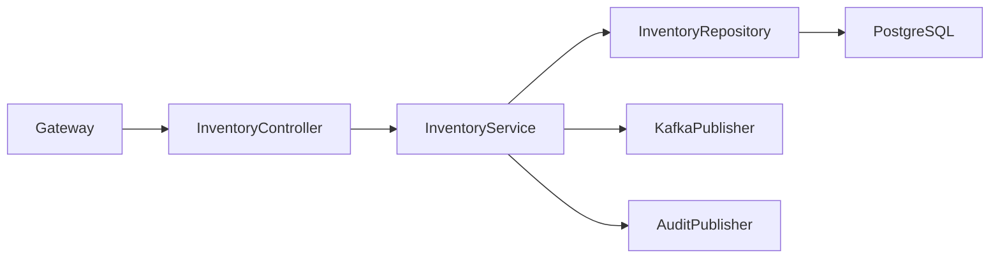
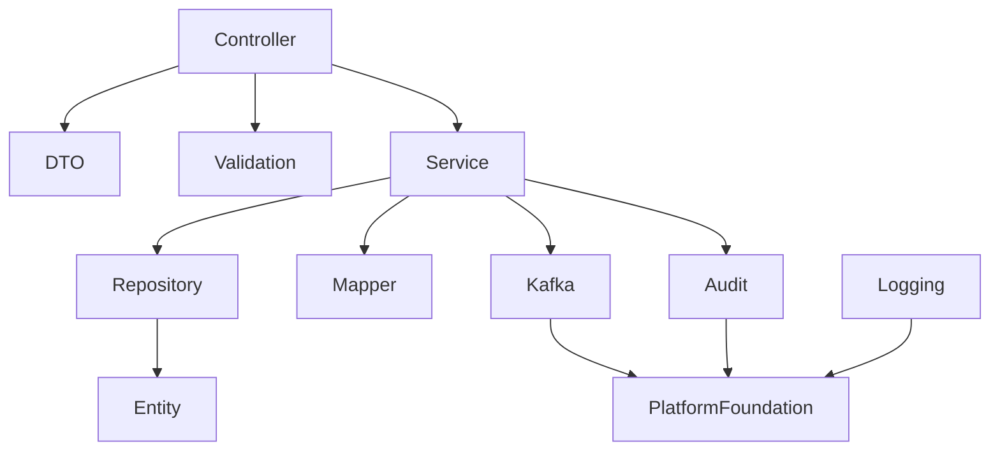
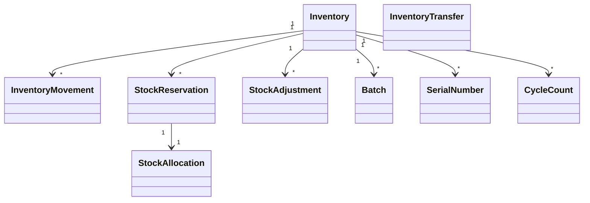

# LLD-006: Inventory Service

# 1. Document Information

| Field       | Value                                  |
| ----------- | -------------------------------------- |
| Project     | Distributed Hub & Sales (DHS) Platform |
| Service     | Inventory Service                      |
| Document    | Low Level Design                       |
| Document ID | LLD-006                                |
| Repository  | starone-dhs-platform                   |
| Module      | inventory-service                      |
| Version     | v1.0.0                                 |
| Status      | Draft                                  |
| Standard    | IEEE 1016                              |
| Owner       | Enterprise Architecture                |

---

# 2. Purpose

This document defines the implementation-level architecture of the Inventory Service.

The Inventory Service is responsible for enterprise inventory management including stock availability, stock movements, warehouse inventory, batch management, serial number tracking, reservations, stock adjustments, inventory valuation references, and inventory event publishing.

This document implements the requirements defined in **SRS-006 – Inventory Service**.

---

# 3. Scope

Inventory Service provides

- Inventory Master
- Warehouse Inventory
- Batch Inventory
- Serial Inventory
- Stock Reservation
- Stock Allocation
- Stock Movement
- Stock Adjustment
- Cycle Count
- Inventory Search
- Inventory Event Publishing

Inventory Service shall not own

- Product Master
- Warehouse Master
- Orders
- Procurement
- Billing

Inventory Service shall consume Product and Warehouse as reference masters.

---

# 4. Design Principles

## INV-DP-001

Inventory quantities shall always remain consistent.

---

## INV-DP-002

Every inventory movement shall be auditable.

---

## INV-DP-003

Reservations shall prevent overselling.

---

## INV-DP-004

Inventory lifecycle shall be event-driven.

---

## INV-DP-005

Inventory adjustments shall require authorization.

---

## INV-DP-006

Infrastructure concerns shall reuse Platform Foundation.

---

# 5. Package Structure

```text
inventory-service
│
├── config
├── controller
├── service
├── repository
├── entity
├── dto
├── mapper
├── validation
├── kafka
├── exception
├── audit
├── scheduler
├── util
└── client
```

---

# 6. Maven Module Structure

```text
inventory-service
│
├── api
├── application
├── domain
├── infrastructure
└── bootstrap
```

---

# 7. Layered Architecture

```text
REST API

↓

Controller

↓

Application Service

↓

Domain

↓

Repository

↓

PostgreSQL
```

Platform Foundation provides

- Security
- Logging
- Validation
- Kafka
- OpenFeign
- Exception Handling
- Audit
- Observability

---

# 8. Package Design

## controller

```text
controller
│
├── InventoryController
├── StockReservationController
├── StockMovementController
├── StockAdjustmentController
├── BatchController
├── SerialNumberController
├── CycleCountController
└── InventorySearchController
```

---

## service

```text
service
│
├── InventoryService
├── StockReservationService
├── StockMovementService
├── StockAdjustmentService
├── BatchService
├── SerialNumberService
├── CycleCountService
├── InventorySearchService
├── InventoryValidationService
└── InventoryAuditService
```

---

## repository

```text
repository
│
├── InventoryRepository
├── InventoryMovementRepository
├── StockReservationRepository
├── BatchRepository
├── SerialNumberRepository
├── StockAdjustmentRepository
├── CycleCountRepository
└── InventoryAuditRepository
```

---

## entity

```text
entity
│
├── Inventory
├── InventoryMovement
├── StockReservation
├── Batch
├── SerialNumber
├── StockAdjustment
├── CycleCount
├── InventorySnapshot
└── InventoryAudit
```

---

## dto

```text
dto
│
├── request
├── response
└── event
```

---

## kafka

```text
kafka
│
├── producer
├── consumer
└── configuration
```

---

# 9. Component Diagram



---

# 10. Package Dependency Diagram



---

# 11. Domain Responsibilities

| Component          | Responsibility        |
| ------------------ | --------------------- |
| Inventory          | Current Stock         |
| Inventory Movement | Stock Transactions    |
| Reservation        | Reserved Stock        |
| Batch              | Batch Inventory       |
| Serial Number      | Serialized Inventory  |
| Stock Adjustment   | Inventory Corrections |
| Cycle Count        | Physical Verification |
| Inventory Snapshot | Inventory History     |

---

# 12. Service Boundaries

Inventory Service owns

- Inventory
- Stock Movements
- Reservations
- Batches
- Serial Numbers
- Adjustments
- Cycle Counts

Inventory Service does not own

- Product Master
- Warehouse Master
- Orders
- Procurement
- Billing
- Supplier

Other services shall reference inventory through Inventory APIs and Kafka events.

---

# 13. Architecture Constraints

- Controllers shall remain stateless.
- Controllers shall never access repositories directly.
- Services shall contain business logic.
- Repository layer shall contain persistence only.
- Inventory quantities shall never become negative unless explicitly permitted.
- Every stock movement shall generate an audit record.
- Reservation shall precede allocation.
- Batch and Serial inventory shall be configurable per product.
- DTOs shall never expose entities.
- Kafka events shall publish after successful transaction commit.
- All entities shall extend AuditableEntity.
- APIs shall return ApiResponse<T>.

---

# 14. Class Design

The Inventory Service shall implement classes for inventory management, stock movements, stock reservations, inventory adjustments, batch management, serial number tracking, cycle counting, inventory valuation references, and inventory search.

The implementation shall follow Layered Architecture and Domain-Driven Design (DDD).

---

# 15. Controller Layer Design

The Controller layer shall expose REST APIs and delegate business processing to the Service layer.

Controllers shall remain stateless.

## Package Structure

```text
controller
│
├── InventoryController
├── StockMovementController
├── StockReservationController
├── StockAllocationController
├── StockAdjustmentController
├── BatchController
├── SerialNumberController
├── CycleCountController
├── InventoryTransferController
└── InventorySearchController
```

---

## InventoryController

### Responsibilities

- Create Inventory
- Update Inventory
- Get Inventory
- Inventory Availability
- Inventory Summary

### APIs

```text
POST   /api/v1/inventory

PUT    /api/v1/inventory/{inventoryId}

GET    /api/v1/inventory/{inventoryId}

GET    /api/v1/inventory/availability

GET    /api/v1/inventory/summary
```

---

## StockMovementController

Responsibilities

- Stock In
- Stock Out
- Internal Transfer
- Goods Receipt
- Goods Issue

---

## StockReservationController

Responsibilities

- Reserve Stock
- Release Reservation
- View Reservations

---

## StockAllocationController

Responsibilities

- Allocate Reserved Stock
- Cancel Allocation

---

## StockAdjustmentController

Responsibilities

- Increase Stock
- Decrease Stock
- Inventory Correction

---

## BatchController

Responsibilities

- Create Batch
- Batch Lookup
- Batch Expiry

---

## SerialNumberController

Responsibilities

- Register Serial Numbers
- Serial Lookup
- Serial Tracking

---

## CycleCountController

Responsibilities

- Start Cycle Count
- Submit Count
- Approve Variance

---

## InventoryTransferController

Responsibilities

- Branch Transfer
- Warehouse Transfer
- Stock Receipt

---

## InventorySearchController

Responsibilities

- Inventory Search
- Inventory Lookup
- Advanced Filtering

---

# 16. Service Layer Design

Business logic shall reside in the Service layer.

## Package Structure

```text
service
│
├── InventoryService
├── StockMovementService
├── StockReservationService
├── StockAllocationService
├── StockAdjustmentService
├── BatchService
├── SerialNumberService
├── CycleCountService
├── InventoryTransferService
├── InventorySearchService
├── InventoryValidationService
└── InventoryAuditService
```

---

## InventoryService

### Responsibilities

- Create Inventory
- Update Inventory
- Calculate Available Quantity
- Inventory Summary

### Public Methods

```java
createInventory()

updateInventory()

getInventory()

getInventoryAvailability()

getInventorySummary()
```

---

## StockMovementService

Responsibilities

- Stock In
- Stock Out
- Movement Validation
- Movement Recording

---

## StockReservationService

Responsibilities

- Reserve Stock
- Release Reservation
- Expire Reservations

---

## StockAllocationService

Responsibilities

- Allocate Reserved Stock
- Cancel Allocation

---

## StockAdjustmentService

Responsibilities

- Adjustment Approval
- Stock Correction
- Variance Recording

---

## BatchService

Responsibilities

- Batch Creation
- Batch Validation
- Batch Expiry

---

## SerialNumberService

Responsibilities

- Serial Registration
- Serial Validation
- Serial History

---

## CycleCountService

Responsibilities

- Physical Count
- Variance Calculation
- Approval Workflow

---

## InventoryTransferService

Responsibilities

- Warehouse Transfer
- Branch Transfer
- Stock Receipt Confirmation

---

## InventorySearchService

Responsibilities

- Search
- Pagination
- Sorting
- Filtering

---

# 17. Repository Layer Design

Repositories shall encapsulate persistence logic only.

## Package Structure

```text
repository
│
├── InventoryRepository
├── InventoryMovementRepository
├── StockReservationRepository
├── StockAllocationRepository
├── StockAdjustmentRepository
├── BatchRepository
├── SerialNumberRepository
├── CycleCountRepository
└── InventoryTransferRepository
```

---

## Repository Responsibilities

| Repository                  | Responsibility       |
| --------------------------- | -------------------- |
| InventoryRepository         | Inventory Master     |
| InventoryMovementRepository | Stock Movements      |
| StockReservationRepository  | Reservations         |
| StockAllocationRepository   | Allocations          |
| StockAdjustmentRepository   | Adjustments          |
| BatchRepository             | Batch Inventory      |
| SerialNumberRepository      | Serialized Inventory |
| CycleCountRepository        | Physical Counts      |
| InventoryTransferRepository | Transfers            |

---

# 18. DTO Design

## Request DTOs

```text
dto.request
│
├── CreateInventoryRequest
├── UpdateInventoryRequest
├── StockMovementRequest
├── StockReservationRequest
├── StockAllocationRequest
├── StockAdjustmentRequest
├── BatchRequest
├── SerialNumberRequest
├── CycleCountRequest
├── InventoryTransferRequest
└── InventorySearchRequest
```

---

## Response DTOs

```text
dto.response
│
├── InventoryResponse
├── InventoryAvailabilityResponse
├── InventorySummaryResponse
├── StockMovementResponse
├── ReservationResponse
├── AllocationResponse
├── BatchResponse
├── SerialNumberResponse
├── CycleCountResponse
└── InventoryTransferResponse
```

---

## InventoryResponse

| Field             | Type            |
| ----------------- | --------------- |
| inventoryId       | UUID            |
| productId         | UUID            |
| warehouseId       | UUID            |
| availableQuantity | BigDecimal      |
| reservedQuantity  | BigDecimal      |
| allocatedQuantity | BigDecimal      |
| damagedQuantity   | BigDecimal      |
| status            | InventoryStatus |

---

# 19. Entity Design

All entities shall extend **AuditableEntity**.

---

## Package Structure

```text
entity
│
├── Inventory
├── InventoryMovement
├── StockReservation
├── StockAllocation
├── StockAdjustment
├── Batch
├── SerialNumber
├── CycleCount
├── InventoryTransfer
└── InventorySnapshot
```

---

## Inventory

| Attribute         | Type            |
| ----------------- | --------------- |
| id                | UUID            |
| productId         | UUID            |
| warehouseId       | UUID            |
| availableQuantity | BigDecimal      |
| reservedQuantity  | BigDecimal      |
| allocatedQuantity | BigDecimal      |
| damagedQuantity   | BigDecimal      |
| reorderLevel      | BigDecimal      |
| safetyStock       | BigDecimal      |
| inventoryStatus   | InventoryStatus |

---

## InventoryMovement

| Attribute         | Type         |
| ----------------- | ------------ |
| id                | UUID         |
| inventoryId       | UUID         |
| movementType      | MovementType |
| quantity          | BigDecimal   |
| referenceDocument | String       |
| movementDate      | Instant      |

---

## StockReservation

| Attribute         | Type              |
| ----------------- | ----------------- |
| id                | UUID              |
| inventoryId       | UUID              |
| orderId           | UUID              |
| reservedQuantity  | BigDecimal        |
| reservationExpiry | Instant           |
| reservationStatus | ReservationStatus |

---

## StockAllocation

| Attribute         | Type             |
| ----------------- | ---------------- |
| id                | UUID             |
| reservationId     | UUID             |
| allocatedQuantity | BigDecimal       |
| allocationStatus  | AllocationStatus |

---

## StockAdjustment

| Attribute      | Type           |
| -------------- | -------------- |
| id             | UUID           |
| inventoryId    | UUID           |
| adjustmentType | AdjustmentType |
| quantity       | BigDecimal     |
| reason         | String         |
| approvedBy     | UUID           |

---

## Batch

| Attribute         | Type       |
| ----------------- | ---------- |
| id                | UUID       |
| inventoryId       | UUID       |
| batchNumber       | String     |
| manufacturingDate | LocalDate  |
| expiryDate        | LocalDate  |
| availableQuantity | BigDecimal |

---

## SerialNumber

| Attribute    | Type         |
| ------------ | ------------ |
| id           | UUID         |
| inventoryId  | UUID         |
| serialNumber | String       |
| serialStatus | SerialStatus |

---

## CycleCount

| Attribute        | Type        |
| ---------------- | ----------- |
| id               | UUID        |
| inventoryId      | UUID        |
| expectedQuantity | BigDecimal  |
| countedQuantity  | BigDecimal  |
| variance         | BigDecimal  |
| countStatus      | CountStatus |

---

## InventoryTransfer

| Attribute              | Type           |
| ---------------------- | -------------- |
| id                     | UUID           |
| sourceWarehouseId      | UUID           |
| destinationWarehouseId | UUID           |
| transferStatus         | TransferStatus |

---

# 20. Mapper Design

MapStruct shall be the standard mapping framework.

## Package Structure

```text
mapper
│
├── InventoryMapper
├── InventoryMovementMapper
├── StockReservationMapper
├── StockAllocationMapper
├── StockAdjustmentMapper
├── BatchMapper
├── SerialNumberMapper
├── CycleCountMapper
└── InventoryTransferMapper
```

---

## Responsibilities

- DTO → Entity
- Entity → DTO
- Partial Updates
- Page Mapping

---

# 21. Validation Design

## Package Structure

```text
validation
│
├── annotation
├── validator
└── groups
```

---

## Validators

```text
InventoryValidator

StockReservationValidator

StockAdjustmentValidator

BatchValidator

SerialNumberValidator

TransferValidator

CycleCountValidator
```

---

## Validation Rules

| Validator                 | Purpose                       |
| ------------------------- | ----------------------------- |
| InventoryValidator        | Inventory Integrity           |
| StockReservationValidator | Reservation Validation        |
| StockAdjustmentValidator  | Adjustment Rules              |
| BatchValidator            | Batch Validation              |
| SerialNumberValidator     | Serial Number Uniqueness      |
| TransferValidator         | Warehouse Transfer Validation |
| CycleCountValidator       | Physical Count Validation     |

---

# 22. Exception Hierarchy

```text
RuntimeException
        │
        └── PlatformException
                │
                ├── InventoryNotFoundException
                ├── InsufficientStockException
                ├── StockReservationException
                ├── DuplicateSerialNumberException
                ├── DuplicateBatchException
                ├── InvalidStockAdjustmentException
                ├── InventoryTransferException
                ├── BatchExpiredException
                └── CycleCountMismatchException
```

---

# 23. Inventory Creation Flow

```mermaid
sequenceDiagram

User->>InventoryController: Create Inventory

InventoryController->>InventoryService

InventoryService->>ValidationService

ValidationService-->>InventoryService

InventoryService->>InventoryRepository

InventoryRepository-->>InventoryService

InventoryService->>KafkaPublisher

InventoryService-->>InventoryController

InventoryController-->>User
```

---

# 24. Stock Reservation Flow

```mermaid
sequenceDiagram

Order Service->>StockReservationController

StockReservationController->>StockReservationService

StockReservationService->>InventoryRepository

InventoryRepository-->>StockReservationService

StockReservationService->>ReservationRepository

StockReservationService->>KafkaPublisher

StockReservationController-->>Order Service
```

---

# 25. Stock Movement Flow

```mermaid
sequenceDiagram

Goods Receipt->>StockMovementController

StockMovementController->>StockMovementService

StockMovementService->>InventoryRepository

InventoryRepository-->>StockMovementService

StockMovementService->>MovementRepository

StockMovementService->>KafkaPublisher

StockMovementController-->>Goods Receipt
```

---

# 26. Stock Adjustment Flow

```mermaid
sequenceDiagram

Manager->>StockAdjustmentController

StockAdjustmentController->>StockAdjustmentService

StockAdjustmentService->>ApprovalWorkflow

ApprovalWorkflow-->>StockAdjustmentService

StockAdjustmentService->>Repository

StockAdjustmentController-->>Manager
```

---

# 27. Inventory Transfer Flow

```mermaid
sequenceDiagram

Warehouse->>InventoryTransferController

InventoryTransferController->>InventoryTransferService

InventoryTransferService->>InventoryRepository

InventoryRepository-->>InventoryTransferService

InventoryTransferService->>KafkaPublisher

InventoryTransferController-->>Warehouse
```

---

# 28. Class Diagram



---

# 29. Design Constraints

- Inventory quantity shall never become negative.
- Reservation shall occur before allocation.
- Batch tracking shall be configurable per product.
- Serial tracking shall be configurable per product.
- Stock adjustments shall require authorization.
- Inventory movements shall be immutable.
- Controllers shall remain stateless.
- Services shall contain all business logic.
- Repository layer shall contain persistence only.
- Kafka events shall publish after successful transaction commit.
- DTOs shall never expose JPA entities.
- All entities shall extend `AuditableEntity`.
- APIs shall return `ApiResponse<T>`.

---

# 30. Security Configuration

The Inventory Service shall inherit the enterprise security framework from the Platform Foundation.

Authentication shall be delegated to the Identity Service.

Authorization shall be enforced using Role-Based Access Control (RBAC).

---

## 30.1 Security Architecture

```text
Client

↓

API Gateway

↓

JWT Authentication Filter

↓

Authorization Filter

↓

Inventory Controller

↓

Inventory Service
```

---

## 30.2 Security Components

```text
security
│
├── config
│   ├── SecurityConfiguration
│   ├── MethodSecurityConfiguration
│   └── CorsConfiguration
│
├── filter
│   ├── JwtAuthenticationFilter
│   ├── AuthorizationFilter
│   └── CorrelationIdFilter
│
├── permission
│   ├── InventoryPermissionEvaluator
│   └── WarehouseAccessValidator
│
└── annotation
    └── RequireInventoryPermission
```

---

## 30.3 Permissions

| Permission        | Description         |
| ----------------- | ------------------- |
| INVENTORY_CREATE  | Create Inventory    |
| INVENTORY_UPDATE  | Update Inventory    |
| INVENTORY_VIEW    | View Inventory      |
| INVENTORY_SEARCH  | Search Inventory    |
| STOCK_RESERVE     | Reserve Stock       |
| STOCK_ALLOCATE    | Allocate Stock      |
| STOCK_ADJUST      | Adjust Inventory    |
| STOCK_TRANSFER    | Transfer Inventory  |
| CYCLE_COUNT       | Perform Cycle Count |
| INVENTORY_APPROVE | Approve Adjustments |

---

## 30.4 Authorization Flow

```mermaid
sequenceDiagram

Client->>Gateway: JWT

Gateway->>Identity Service: Validate

Identity Service-->>Gateway: Claims

Gateway->>Inventory Service

Inventory Service->>PermissionEvaluator

PermissionEvaluator-->>Inventory Service

Inventory Service-->>Client
```

---

# 31. JWT Implementation

JWT validation shall be performed by Platform Foundation.

Inventory Service shall consume authenticated user context.

---

## Required Claims

```json
{
  "sub": "UUID",
  "username": "warehouse.manager",
  "roles": ["WAREHOUSE_MANAGER"],
  "permissions": ["STOCK_RESERVE", "STOCK_TRANSFER"],
  "tenantId": "UUID",
  "branchId": "UUID"
}
```

---

## User Context

Every request shall expose

```text
UserId

Username

Roles

Permissions

TenantId

BranchId

CorrelationId
```

---

# 32. Authorization Design

Permission-based authorization shall be implemented.

---

## Example

```java
@PreAuthorize("hasAuthority('STOCK_RESERVE')")
```

or

```java
@RequireInventoryPermission("STOCK_RESERVE")
```

---

## Permission Matrix

| API                | Permission        |
| ------------------ | ----------------- |
| Create Inventory   | INVENTORY_CREATE  |
| Update Inventory   | INVENTORY_UPDATE  |
| View Inventory     | INVENTORY_VIEW    |
| Search Inventory   | INVENTORY_SEARCH  |
| Reserve Stock      | STOCK_RESERVE     |
| Allocate Stock     | STOCK_ALLOCATE    |
| Adjust Inventory   | STOCK_ADJUST      |
| Transfer Inventory | STOCK_TRANSFER    |
| Cycle Count        | CYCLE_COUNT       |
| Approve Adjustment | INVENTORY_APPROVE |

---

# 33. Kafka Design

Inventory Service shall publish inventory lifecycle events.

---

## Published Topics

```text
inventory.created.v1

inventory.updated.v1

inventory.stock.in.v1

inventory.stock.out.v1

inventory.stock.reserved.v1

inventory.stock.released.v1

inventory.stock.allocated.v1

inventory.adjusted.v1

inventory.transfer.initiated.v1

inventory.transfer.completed.v1

inventory.batch.created.v1

inventory.batch.expired.v1

inventory.serial.registered.v1

inventory.cycle.count.completed.v1
```

---

## Consumed Topics

```text
product.created.v1

product.updated.v1

warehouse.created.v1

procurement.goods.received.v1

order.confirmed.v1

order.cancelled.v1

returns.received.v1

dispatch.completed.v1
```

---

## Kafka Package

```text
kafka
│
├── producer
├── consumer
├── event
├── mapper
└── configuration
```

---

## Event Envelope

```json
{
  "eventId": "UUID",
  "eventType": "InventoryReserved",
  "eventVersion": "1.0",
  "occurredAt": "2026-06-27T10:00:00Z",
  "correlationId": "UUID",
  "payload": {}
}
```

---

# 34. OpenFeign Design

Inventory Service shall use synchronous communication only when immediate validation is required.

---

## Feign Clients

```text
client
│
├── ProductClient
├── WarehouseClient
├── SupplierClient
├── AuditClient
└── NotificationClient
```

---

## Responsibilities

| Client             | Responsibility       |
| ------------------ | -------------------- |
| ProductClient      | Product Validation   |
| WarehouseClient    | Warehouse Validation |
| SupplierClient     | Supplier Lookup      |
| AuditClient        | Audit Submission     |
| NotificationClient | Inventory Alerts     |

---

# 35. Configuration Classes

```text
config
│
├── SecurityConfiguration
├── KafkaConfiguration
├── FeignConfiguration
├── CacheConfiguration
├── JacksonConfiguration
├── ValidationConfiguration
├── SchedulerConfiguration
├── MetricsConfiguration
└── OpenApiConfiguration
```

---

## Responsibilities

| Configuration | Responsibility       |
| ------------- | -------------------- |
| Security      | Spring Security      |
| Kafka         | Kafka Infrastructure |
| Feign         | OpenFeign            |
| Cache         | Redis Cache          |
| Validation    | Bean Validation      |
| Scheduler     | Background Jobs      |
| Metrics       | Micrometer           |
| OpenAPI       | Swagger              |

---

# 36. Transaction Design

Inventory transactions shall remain local.

Distributed inventory workflows shall communicate using Kafka events.

---

## Transaction Types

| Operation        | Propagation  |
| ---------------- | ------------ |
| Inventory Create | REQUIRED     |
| Stock Movement   | REQUIRED     |
| Reservation      | REQUIRED     |
| Allocation       | REQUIRED     |
| Adjustment       | REQUIRED     |
| Transfer         | REQUIRED     |
| Cycle Count      | REQUIRED     |
| Publish Event    | AFTER_COMMIT |

---

## Transaction Flow

```mermaid
flowchart LR

Controller

-->

Service

-->

Repository

-->

Commit

-->

Kafka Publish
```

---

# 37. Cache Design

Redis shall cache frequently accessed inventory information.

---

## Cached Objects

```text
Inventory Summary

Available Stock

Reserved Stock

Batch Information

Serial Numbers

Warehouse Inventory
```

---

## Cache Annotations

```java
@Cacheable

@CachePut

@CacheEvict
```

---

# 38. Resilience Patterns

Inventory Service shall implement Resilience4j.

---

## Retry

Warehouse Validation

Product Validation

---

## Circuit Breaker

Warehouse Service

Product Service

Supplier Service

Audit Service

---

## Bulkhead

External Integrations

---

## Rate Limiter

Inventory Search

Availability API

Reservation API

---

## Timeout

Feign Clients

---

# 39. Scheduler Design

Scheduled jobs shall support inventory maintenance.

---

## Scheduled Jobs

```text
scheduler
│
├── ExpiredReservationScheduler
├── BatchExpiryScheduler
├── InventoryReconciliationScheduler
├── InventorySnapshotScheduler
├── CycleCountReminderScheduler
├── CacheRefreshScheduler
└── AuditCleanupScheduler
```

---

# 40. External Integration Design

| Service              | Purpose              |
| -------------------- | -------------------- |
| Product Service      | Product Validation   |
| Warehouse Service    | Warehouse Validation |
| Procurement Service  | Goods Receipt        |
| Order Service        | Stock Reservation    |
| Dispatch Service     | Stock Deduction      |
| Returns Service      | Stock Return         |
| Audit Service        | Audit Logging        |
| Notification Service | Low Stock Alerts     |

---

# 41. Configuration Properties

| Property                      | Default |
| ----------------------------- | ------- |
| inventory.cache.enabled       | true    |
| inventory.cache.ttl           | 3600    |
| inventory.low-stock.enabled   | true    |
| inventory.batch.expiry.days   | 30      |
| inventory.reservation.timeout | 30m     |
| inventory.kafka.retry         | 3       |

---

# 42. Data Consistency Strategy

- Inventory quantity shall never become negative.
- Reservation quantity shall never exceed available quantity.
- Allocation shall never exceed reserved quantity.
- Batch quantity shall equal inventory quantity.
- Serialized inventory shall maintain one serial per item.
- Events shall publish only after successful transaction commit.
- Transfers shall use two-phase inventory updates.

---

# 43. Performance Considerations

- Frequently accessed inventory shall be cached.
- Availability lookup shall use Redis.
- Inventory search shall support pagination.
- Batch lookup shall use indexed queries.
- Inventory movement history shall support partitioning.
- Snapshot generation shall execute asynchronously.

---

# 44. Design Constraints

- Inventory movements shall be immutable.
- Stock adjustments shall require approval.
- JWT authentication shall be mandatory.
- Authorization shall be permission-based.
- Repository layer shall never invoke external services.
- Configuration shall be externalized.
- Kafka events shall publish after successful transaction commit.
- Correlation ID shall propagate across all outbound requests.
- Reservation expiration shall be scheduler-driven.

---

# 45. Technology Standards

| Concern           | Technology              |
| ----------------- | ----------------------- |
| Java              | Java 21                 |
| Framework         | Spring Boot 3.x         |
| Security          | Spring Security 6       |
| Authentication    | JWT                     |
| Authorization     | RBAC                    |
| Database          | PostgreSQL              |
| Cache             | Redis                   |
| Messaging         | Apache Kafka            |
| Service Calls     | OpenFeign               |
| Validation        | Jakarta Bean Validation |
| Mapping           | MapStruct               |
| Logging           | SLF4J + Logback         |
| Metrics           | Micrometer              |
| Tracing           | OpenTelemetry           |
| Service Discovery | Eureka                  |

---

# 46. Logging Design

The Inventory Service shall implement centralized structured logging using the Platform Foundation logging framework.

Every inventory operation, stock movement, reservation, allocation, adjustment, and integration shall be logged using standardized MDC attributes.

---

## 46.1 Logging Architecture

```text
REST Request

↓

Correlation Filter

↓

Logging Aspect

↓

SLF4J

↓

Logback

↓

ELK / OpenSearch / Splunk
```

---

## 46.2 Log Levels

| Level | Purpose                  |
| ----- | ------------------------ |
| TRACE | Framework Diagnostics    |
| DEBUG | Development              |
| INFO  | Business Events          |
| WARN  | Recoverable Errors       |
| ERROR | Business/System Failures |

---

## 46.3 MDC Context

Every log entry shall include

```text
Correlation ID

Trace ID

Span ID

User ID

Inventory ID

Product ID

Warehouse ID

Branch ID

Tenant ID

Request URI

HTTP Method

Service Name

Environment
```

---

## 46.4 Business Events

The following operations shall always be logged.

- Inventory Created
- Inventory Updated
- Stock Reserved
- Reservation Released
- Stock Allocated
- Stock Received
- Stock Issued
- Stock Adjusted
- Warehouse Transfer Initiated
- Warehouse Transfer Completed
- Batch Created
- Batch Expired
- Serial Registered
- Cycle Count Started
- Cycle Count Approved
- Inventory Snapshot Generated

---

## 46.5 Sensitive Data

The following shall never be logged.

- JWT Tokens
- Authorization Headers
- Internal Secrets
- Encryption Keys
- Database Credentials
- Sensitive Supplier Information

---

# 47. Observability

Inventory Service shall expose operational metrics using Micrometer.

---

## JVM Metrics

- Heap Usage
- CPU Usage
- Thread Count
- Garbage Collection

---

## Business Metrics

- Total Inventory Records
- Available Quantity
- Reserved Quantity
- Allocated Quantity
- Inventory Transfers
- Inventory Adjustments
- Batch Expiry Count
- Cycle Count Variances
- Low Stock Alerts
- Reservation Count

---

## Infrastructure Metrics

- Database Connections
- Kafka Publish Rate
- Kafka Consumer Lag
- Redis Cache Hit Ratio
- API Response Time

---

# 48. Distributed Tracing

Every request shall propagate distributed tracing metadata.

---

## Trace Flow

```mermaid
sequenceDiagram

Client->>Gateway

Gateway->>Inventory Service

Inventory Service->>Product Service

Inventory Service->>Warehouse Service

Inventory Service->>Procurement Service

Inventory Service->>Audit Service

Inventory Service-->>Gateway

Gateway-->>Client
```

---

## Trace Context

Every request shall propagate

- Correlation ID
- Trace ID
- Span ID

---

# 49. Health Checks

Inventory Service shall expose Spring Boot Actuator endpoints.

---

## Health

```text
GET /actuator/health
```

---

## Liveness

```text
GET /actuator/health/liveness
```

---

## Readiness

```text
GET /actuator/health/readiness
```

Dependencies

- PostgreSQL
- Redis
- Kafka
- Config Server

---

## Metrics

```text
GET /actuator/metrics
```

---

## Prometheus

```text
GET /actuator/prometheus
```

---

# 50. Deployment Design

Inventory Service shall be deployed as an independent containerized microservice.

---

## Deployment Architecture

```text
Gateway

↓

Inventory Service

↓

PostgreSQL

↓

Redis

↓

Kafka
```

---

## Kubernetes Resources

```text
Deployment

Service

Ingress

ConfigMap

Secret

HorizontalPodAutoscaler

ServiceMonitor

PodDisruptionBudget
```

---

# 51. Dependency Management

Inventory Service shall inherit the enterprise Platform Foundation BOM.

```xml
<dependencyManagement>

<dependency>

<groupId>com.starone</groupId>

<artifactId>platform-foundation-bom</artifactId>

</dependency>

</dependencyManagement>
```

---

## Primary Dependencies

- Spring Boot
- Spring Security
- Spring Data JPA
- Spring Kafka
- Spring Validation
- PostgreSQL Driver
- Redis
- OpenFeign
- Micrometer
- OpenTelemetry
- MapStruct
- Lombok

---

# 52. Coding Standards

Inventory Service shall comply with enterprise coding standards.

---

## Controller

- Stateless
- Validation Only
- No Business Logic

---

## Service

- Stateless
- Transactional
- Business Orchestration

---

## Repository

- Persistence Only
- No External Calls

---

## DTO

- Immutable
- Validation Annotations

---

## Entity

- Extend AuditableEntity
- Optimistic Locking
- Never Exposed Directly

---

# 53. Package Naming Standards

```text
com.starone.inventory

├── controller
├── service
├── repository
├── entity
├── dto
├── mapper
├── validation
├── config
├── kafka
├── exception
├── scheduler
├── audit
├── util
└── client
```

---

# 54. Testing Strategy

## Unit Testing

Framework

```text
JUnit 5

Mockito
```

Coverage

```text
Minimum 90%
```

---

## Integration Testing

- Spring Boot Test
- Testcontainers
- Embedded Kafka

---

## API Testing

- REST Assured
- Spring MockMvc

---

## Performance Testing

- Inventory Availability
- Reservation Processing
- Stock Transfer
- Inventory Search
- Batch Processing
- Cycle Count

---

## Static Analysis

- SonarQube
- SpotBugs
- PMD
- Checkstyle

---

# 55. Build Validation

Every Pull Request shall verify

- Compilation
- Unit Tests
- Integration Tests
- Static Analysis
- Security Scan
- Dependency Scan
- Documentation Validation
- Code Coverage

---

# 56. Quality Gates

| Metric                   | Target    |
| ------------------------ | --------- |
| Unit Test Coverage       | ≥90%      |
| Integration Tests        | 100% Pass |
| Critical Bugs            | 0         |
| Critical Vulnerabilities | 0         |
| Code Duplication         | <3%       |
| Documentation            | Mandatory |

---

# 57. Implementation Guidelines

Inventory Service shall reuse Platform Foundation components.

Business code shall never duplicate

- JWT Security
- Logging
- Validation
- Kafka Infrastructure
- Exception Handling
- Audit Framework
- API Response Models
- Pagination Framework

Inventory updates shall always occur through domain services.

Repositories shall never modify inventory quantities directly.

---

# 58. Extension Guidelines

Business-specific functionality shall extend Platform Foundation components where applicable.

Permitted extensions include

- AuditableEntity
- PlatformException
- ApiResponse
- BaseMapper
- AuditService
- DomainEventPublisher

Platform Foundation source code shall never be modified by Inventory Service.

---

# 59. Design Checklist

Before implementation verify

- Inventory quantity consistency enforced
- Reservation logic validated
- Allocation logic validated
- Stock movement immutable
- Batch tracking implemented
- Serial tracking implemented
- Cycle Count workflow completed
- Transfer workflow validated
- Controllers contain no business logic
- Services are stateless
- Repository layer contains persistence only
- Kafka events publish after transaction commit
- Redis cache configured
- Correlation ID propagation enabled
- Health endpoints exposed
- Metrics published
- Configuration externalized
- Unit test coverage meets quality gates

---

# 60. Appendix A – Framework Versions

| Component       | Version          |
| --------------- | ---------------- |
| Java            | 21               |
| Spring Boot     | 3.x              |
| Spring Security | 6.x              |
| Spring Cloud    | 2025.x           |
| PostgreSQL      | Latest Supported |
| Redis           | Latest Supported |
| Kafka           | Latest Supported |
| OpenFeign       | Latest Supported |
| Micrometer      | Latest Supported |
| OpenTelemetry   | Latest Supported |
| MapStruct       | Latest Stable    |
| Lombok          | Latest Stable    |
| JUnit           | 5.x              |

---

# 61. Appendix B – Layer Responsibility Matrix

| Layer      | Responsibility           |
| ---------- | ------------------------ |
| Controller | Request Handling         |
| Service    | Inventory Business Logic |
| Repository | Persistence              |
| Kafka      | Event Publishing         |
| Mapper     | DTO Conversion           |
| Validation | Request Validation       |
| Audit      | Inventory Audit          |

---

# 62. Appendix C – Inventory Components

```text
InventoryController

StockMovementController

StockReservationController

StockAllocationController

StockAdjustmentController

BatchController

SerialNumberController

CycleCountController

InventoryTransferController

InventorySearchController

InventoryService

StockMovementService

StockReservationService

StockAllocationService

StockAdjustmentService

BatchService

SerialNumberService

CycleCountService

InventoryTransferService

InventoryRepository

InventoryMovementRepository

StockReservationRepository

StockAllocationRepository

StockAdjustmentRepository

BatchRepository

SerialNumberRepository

CycleCountRepository

InventoryTransferRepository
```

---

# 63. Appendix D – Inventory Processing Summary

```text
Client

↓

Gateway

↓

JWT Authentication

↓

Authorization

↓

Controller

↓

Service

↓

Repository

↓

Kafka Event

↓

Audit Event

↓

Response
```

---

# 64. Appendix E – Repository Responsibilities

| Repository                    | Responsibility                                  |
| ----------------------------- | ----------------------------------------------- |
| starone-galaxy-architecture   | Enterprise Standards, Governance & Architecture |
| starone-galaxy-central-config | Centralized Configuration                       |
| starone-galaxy-infra          | Kubernetes, Infrastructure & CI/CD              |
| starone-dhs-platform          | Inventory Service Implementation                |

---

# 65. Conclusion

The Inventory Service is the authoritative inventory management component of the DHS platform, responsible for stock availability, reservations, allocations, movements, warehouse transfers, batch management, serial number tracking, cycle counting, and inventory reconciliation. It ensures inventory integrity through transactional consistency, event-driven integration, and comprehensive auditability while leveraging the Platform Foundation for security, observability, logging, messaging, and cross-cutting infrastructure capabilities.

---

# End of Document
