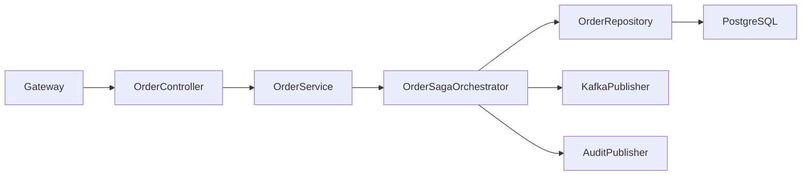
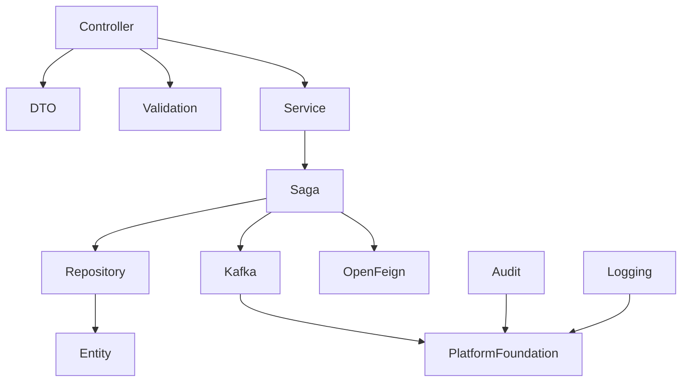
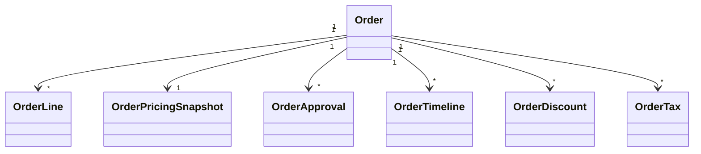

# LLD-007: Order Service

# 1. Document Information

| Field | Value |
|--------|-------|
| Project | Distributed Hub & Sales (DHS) Platform |
| Service | Order Service |
| Document | Low Level Design |
| Document ID | LLD-007 |
| Repository | starone-dhs-platform |
| Module | order-service |
| Version | v1.0.0 |
| Status | Draft |
| Standard | IEEE 1016 |
| Owner | Enterprise Architecture |

---

# 2. Purpose

This document defines the implementation-level architecture of the Order Service.

The Order Service is responsible for complete Sales Order lifecycle management including quotation conversion, sales order creation, order validation, order approval, pricing snapshot, reservation orchestration, fulfillment orchestration, cancellation, and order event publishing.

This document implements the requirements defined in **SRS-007 – Order Service**.

---

# 3. Scope

The Order Service provides

- Sales Order Management
- Order Lines
- Order Pricing Snapshot
- Order Discounts
- Taxes
- Order Approval
- Order Reservation
- Order Fulfillment Orchestration
- Order Cancellation
- Order Search
- Order Timeline
- Order Event Publishing

Order Service shall not own

- Customer Master
- Product Master
- Inventory
- Billing
- Dispatch
- Notification

Order Service shall orchestrate these services through synchronous APIs and Kafka events.

---

# 4. Design Principles

## ORD-DP-001

Order shall be the authoritative sales transaction.

---

## ORD-DP-002

Pricing shall be snapshotted during order confirmation.

---

## ORD-DP-003

Orders shall never modify inventory directly.

---

## ORD-DP-004

Inventory reservation shall be delegated to Inventory Service.

---

## ORD-DP-005

Order fulfillment shall follow Saga orchestration.

---

## ORD-DP-006

Infrastructure concerns shall reuse Platform Foundation.

---

# 5. Package Structure

```text
order-service
│
├── config
├── controller
├── service
├── repository
├── entity
├── dto
├── mapper
├── validation
├── saga
├── kafka
├── exception
├── audit
├── scheduler
├── util
└── client
```

---

# 6. Maven Module Structure

```text
order-service
│
├── api
├── application
├── domain
├── infrastructure
└── bootstrap
```

---

# 7. Layered Architecture

```text
REST API

↓

Controller

↓

Application Service

↓

Domain

↓

Saga Orchestrator

↓

Repository

↓

PostgreSQL
```

Platform Foundation provides

- Security
- Logging
- Validation
- Kafka
- OpenFeign
- Exception Handling
- Audit
- Observability

---

# 8. Package Design

## controller

```text
controller
│
├── OrderController
├── OrderApprovalController
├── OrderCancellationController
├── OrderFulfillmentController
├── OrderReservationController
├── OrderSearchController
└── OrderTimelineController
```

---

## service

```text
service
│
├── OrderService
├── OrderApprovalService
├── OrderPricingService
├── OrderReservationService
├── OrderFulfillmentService
├── OrderCancellationService
├── OrderSearchService
├── OrderTimelineService
├── OrderValidationService
└── OrderAuditService
```

---

## repository

```text
repository
│
├── OrderRepository
├── OrderLineRepository
├── OrderApprovalRepository
├── OrderTimelineRepository
├── OrderPricingRepository
└── OrderAuditRepository
```

---

## entity

```text
entity
│
├── Order
├── OrderLine
├── OrderPricingSnapshot
├── OrderApproval
├── OrderTimeline
├── OrderDiscount
├── OrderTax
└── OrderAudit
```

---

## saga

```text
saga
│
├── OrderSagaOrchestrator
├── OrderSagaContext
├── OrderSagaStep
├── CompensationHandler
└── SagaEventHandler
```

---

## dto

```text
dto
│
├── request
├── response
└── event
```

---

## kafka

```text
kafka
│
├── producer
├── consumer
└── configuration
```

---

# 9. Component Diagram



---

# 10. Package Dependency Diagram



---

# 11. Domain Responsibilities

| Component | Responsibility |
|------------|----------------|
| Order | Sales Order |
| Order Line | Ordered Products |
| Pricing Snapshot | Price Lock |
| Discount | Discount Snapshot |
| Tax | Tax Snapshot |
| Approval | Approval Workflow |
| Timeline | Order History |
| Saga | Distributed Transaction |

---

# 12. Service Boundaries

Order Service owns

- Sales Orders
- Order Lines
- Pricing Snapshot
- Discount Snapshot
- Tax Snapshot
- Order Timeline
- Approval Workflow
- Saga Orchestration

Order Service does not own

- Customer Master
- Product Master
- Inventory
- Billing
- Dispatch
- Notification
- Supplier

Other services shall reference orders using **orderId**.

---

# 13. Architecture Constraints

- Controllers shall remain stateless.
- Controllers shall never access repositories directly.
- Services shall contain business logic.
- Saga Orchestrator shall coordinate distributed transactions.
- Repositories shall contain persistence only.
- Orders shall never modify inventory directly.
- Pricing shall be immutable after confirmation.
- Order Lines shall be immutable after fulfillment starts.
- DTOs shall never expose entities.
- Kafka events shall publish only after successful transaction commit.
- All entities shall extend AuditableEntity.
- APIs shall return ApiResponse<T>.

---

# 14. Class Design

The Order Service shall implement classes for order lifecycle management, pricing snapshot management, approval workflow, reservation orchestration, fulfillment orchestration, cancellation processing, timeline management, and Saga orchestration.

The implementation shall follow Layered Architecture and Domain-Driven Design (DDD).

---

# 15. Controller Layer Design

The Controller layer shall expose REST APIs and delegate business processing to the Service layer.

Controllers shall remain stateless.

## Package Structure

```text
controller
│
├── OrderController
├── OrderApprovalController
├── OrderReservationController
├── OrderFulfillmentController
├── OrderCancellationController
├── OrderTimelineController
└── OrderSearchController
```

---

## OrderController

### Responsibilities

- Create Order
- Update Order
- Confirm Order
- Get Order
- Cancel Draft Order

### APIs

```text
POST   /api/v1/orders

PUT    /api/v1/orders/{orderId}

GET    /api/v1/orders/{orderId}

PUT    /api/v1/orders/{orderId}/confirm

DELETE /api/v1/orders/{orderId}
```

---

## OrderApprovalController

Responsibilities

- Submit Approval
- Approve Order
- Reject Order
- View Approval History

---

## OrderReservationController

Responsibilities

- Reserve Inventory
- Release Reservation
- Reservation Status

---

## OrderFulfillmentController

Responsibilities

- Start Fulfillment
- Complete Fulfillment
- Fulfillment Status

---

## OrderCancellationController

Responsibilities

- Cancel Order
- Cancel Line
- Compensation Status

---

## OrderTimelineController

Responsibilities

- Order History
- Timeline Events
- Activity Tracking

---

## OrderSearchController

Responsibilities

- Search Orders
- Order Lookup
- Advanced Filtering

---

# 16. Service Layer Design

Business logic shall reside in the Service layer.

## Package Structure

```text
service
│
├── OrderService
├── OrderApprovalService
├── OrderPricingService
├── OrderReservationService
├── OrderFulfillmentService
├── OrderCancellationService
├── OrderTimelineService
├── OrderSearchService
├── OrderValidationService
└── OrderAuditService
```

---

## OrderService

### Responsibilities

- Create Order
- Update Order
- Confirm Order
- Validate Order
- Cancel Draft Order

### Public Methods

```java
createOrder()

updateOrder()

confirmOrder()

cancelOrder()

getOrder()
```

---

## OrderApprovalService

Responsibilities

- Approval Workflow
- Multi-level Approval
- Approval Audit

---

## OrderPricingService

Responsibilities

- Pricing Snapshot
- Discount Snapshot
- Tax Snapshot
- Total Calculation

---

## OrderReservationService

Responsibilities

- Reserve Inventory
- Release Inventory
- Reservation Validation

---

## OrderFulfillmentService

Responsibilities

- Fulfillment Orchestration
- Dispatch Request
- Completion Handling

---

## OrderCancellationService

Responsibilities

- Cancellation
- Compensation
- Inventory Release

---

## OrderTimelineService

Responsibilities

- Timeline Recording
- Activity Tracking

---

## OrderSearchService

Responsibilities

- Search
- Filter
- Pagination
- Sorting

---

# 17. Repository Layer Design

Repositories shall encapsulate persistence logic only.

## Package Structure

```text
repository
│
├── OrderRepository
├── OrderLineRepository
├── OrderPricingRepository
├── OrderApprovalRepository
├── OrderTimelineRepository
├── OrderDiscountRepository
└── OrderTaxRepository
```

---

## Repository Responsibilities

| Repository | Responsibility |
|------------|----------------|
| OrderRepository | Order Master |
| OrderLineRepository | Order Lines |
| OrderPricingRepository | Pricing Snapshot |
| OrderApprovalRepository | Approval Workflow |
| OrderTimelineRepository | Timeline |
| OrderDiscountRepository | Discount Snapshot |
| OrderTaxRepository | Tax Snapshot |

---

# 18. DTO Design

## Request DTOs

```text
dto.request
│
├── CreateOrderRequest
├── UpdateOrderRequest
├── ConfirmOrderRequest
├── ApproveOrderRequest
├── CancelOrderRequest
├── ReserveInventoryRequest
├── FulfillmentRequest
└── OrderSearchRequest
```

---

## Response DTOs

```text
dto.response
│
├── OrderResponse
├── OrderSummaryResponse
├── OrderPricingResponse
├── OrderApprovalResponse
├── OrderTimelineResponse
├── ReservationResponse
├── FulfillmentResponse
└── OrderSearchResponse
```

---

## OrderResponse

| Field | Type |
|---------|------|
| orderId | UUID |
| orderNumber | String |
| customerId | UUID |
| branchId | UUID |
| orderStatus | OrderStatus |
| subtotal | BigDecimal |
| discountAmount | BigDecimal |
| taxAmount | BigDecimal |
| totalAmount | BigDecimal |

---

# 19. Entity Design

All entities shall extend **AuditableEntity**.

---

## Package Structure

```text
entity
│
├── Order
├── OrderLine
├── OrderPricingSnapshot
├── OrderApproval
├── OrderTimeline
├── OrderDiscount
├── OrderTax
├── OrderReference
└── OrderAudit
```

---

## Order

| Attribute | Type |
|------------|------|
| id | UUID |
| orderNumber | String |
| customerId | UUID |
| branchId | UUID |
| orderDate | Instant |
| orderStatus | OrderStatus |
| currency | String |
| subtotal | BigDecimal |
| discountAmount | BigDecimal |
| taxAmount | BigDecimal |
| totalAmount | BigDecimal |

---

## OrderLine

| Attribute | Type |
|------------|------|
| id | UUID |
| orderId | UUID |
| productId | UUID |
| quantity | BigDecimal |
| reservedQuantity | BigDecimal |
| unitPrice | BigDecimal |
| discountAmount | BigDecimal |
| taxAmount | BigDecimal |
| lineTotal | BigDecimal |

---

## OrderPricingSnapshot

| Attribute | Type |
|------------|------|
| id | UUID |
| orderId | UUID |
| pricingVersion | String |
| subtotal | BigDecimal |
| discountAmount | BigDecimal |
| taxAmount | BigDecimal |
| totalAmount | BigDecimal |

---

## OrderApproval

| Attribute | Type |
|------------|------|
| id | UUID |
| orderId | UUID |
| approvalLevel | Integer |
| approverId | UUID |
| approvalStatus | ApprovalStatus |
| approvedAt | Instant |

---

## OrderTimeline

| Attribute | Type |
|------------|------|
| id | UUID |
| orderId | UUID |
| eventType | String |
| eventTimestamp | Instant |
| remarks | String |

---

## OrderDiscount

| Attribute | Type |
|------------|------|
| id | UUID |
| orderId | UUID |
| discountType | DiscountType |
| discountPercentage | BigDecimal |
| discountAmount | BigDecimal |

---

## OrderTax

| Attribute | Type |
|------------|------|
| id | UUID |
| orderId | UUID |
| taxCode | String |
| taxRate | BigDecimal |
| taxAmount | BigDecimal |

---

# 20. Mapper Design

MapStruct shall be the standard mapping framework.

## Package Structure

```text
mapper
│
├── OrderMapper
├── OrderLineMapper
├── OrderPricingMapper
├── OrderApprovalMapper
├── OrderTimelineMapper
├── OrderDiscountMapper
└── OrderTaxMapper
```

---

## Responsibilities

- DTO → Entity
- Entity → DTO
- Partial Updates
- Page Mapping

---

# 21. Validation Design

## Package Structure

```text
validation
│
├── annotation
├── validator
└── groups
```

---

## Validators

```text
OrderValidator

OrderLineValidator

PricingValidator

ReservationValidator

ApprovalValidator

CancellationValidator
```

---

## Validation Rules

| Validator | Purpose |
|------------|----------|
| OrderValidator | Order Integrity |
| OrderLineValidator | Product & Quantity Validation |
| PricingValidator | Pricing Validation |
| ReservationValidator | Inventory Reservation Validation |
| ApprovalValidator | Approval Rules |
| CancellationValidator | Cancellation Rules |

---

# 22. Exception Hierarchy

```text
RuntimeException
        │
        └── PlatformException
                │
                ├── OrderNotFoundException
                ├── DuplicateOrderException
                ├── InvalidOrderStateException
                ├── OrderApprovalException
                ├── InventoryReservationException
                ├── PricingCalculationException
                ├── FulfillmentException
                ├── OrderCancellationException
                └── SagaExecutionException
```

---

# 23. Order Creation Flow

```mermaid
sequenceDiagram

Customer->>OrderController: Create Order

OrderController->>OrderService

OrderService->>ValidationService

ValidationService-->>OrderService

OrderService->>PricingService

PricingService-->>OrderService

OrderService->>OrderRepository

OrderRepository-->>OrderService

OrderService->>KafkaPublisher

OrderController-->>Customer
```

---

# 24. Order Confirmation Flow

```mermaid
sequenceDiagram

User->>OrderController: Confirm Order

OrderController->>OrderService

OrderService->>SagaOrchestrator

SagaOrchestrator->>Inventory Service: Reserve Stock

Inventory Service-->>SagaOrchestrator

SagaOrchestrator->>Repository

SagaOrchestrator-->>OrderService

OrderController-->>User
```

---

# 25. Order Approval Flow

```mermaid
sequenceDiagram

Manager->>OrderApprovalController

OrderApprovalController->>OrderApprovalService

OrderApprovalService->>Repository

Repository-->>OrderApprovalService

OrderApprovalService->>TimelineService

OrderApprovalController-->>Manager
```

---

# 26. Order Cancellation Flow

```mermaid
sequenceDiagram

User->>OrderCancellationController

OrderCancellationController->>OrderCancellationService

OrderCancellationService->>SagaOrchestrator

SagaOrchestrator->>Inventory Service: Release Reservation

SagaOrchestrator->>Billing Service: Cancel Invoice

SagaOrchestrator-->>OrderCancellationService

OrderCancellationController-->>User
```

---

# 27. Order Search Flow

```mermaid
sequenceDiagram

Client->>OrderSearchController

OrderSearchController->>OrderSearchService

OrderSearchService->>OrderRepository

OrderRepository-->>OrderSearchService

OrderSearchService-->>OrderSearchController

OrderSearchController-->>Client
```

---

# 28. Class Diagram



---

# 29. Design Constraints

- Order Number shall be immutable.
- Pricing snapshot shall be immutable after confirmation.
- Orders shall never update inventory directly.
- Inventory shall be reserved through Saga orchestration.
- Order lines shall not be modified after fulfillment starts.
- Controllers shall remain stateless.
- Services shall contain all business logic.
- Saga Orchestrator shall coordinate distributed transactions.
- Repository layer shall contain persistence only.
- Kafka events shall publish after successful transaction commit.
- DTOs shall never expose JPA entities.
- All entities shall extend `AuditableEntity`.
- APIs shall return `ApiResponse<T>`.

---

# 30. Security Configuration

The Order Service shall inherit the enterprise security framework from the Platform Foundation.

Authentication shall be delegated to the Identity Service.

Authorization shall be enforced using Role-Based Access Control (RBAC).

---

## 30.1 Security Architecture

```text
Client

↓

API Gateway

↓

JWT Authentication Filter

↓

Authorization Filter

↓

Order Controller

↓

Order Service

↓

Saga Orchestrator
```

---

## 30.2 Security Components

```text
security
│
├── config
│   ├── SecurityConfiguration
│   ├── MethodSecurityConfiguration
│   └── CorsConfiguration
│
├── filter
│   ├── JwtAuthenticationFilter
│   ├── AuthorizationFilter
│   └── CorrelationIdFilter
│
├── permission
│   ├── OrderPermissionEvaluator
│   └── OrderAccessValidator
│
└── annotation
    └── RequireOrderPermission
```

---

## 30.3 Permissions

| Permission | Description |
|------------|-------------|
| ORDER_CREATE | Create Order |
| ORDER_UPDATE | Update Order |
| ORDER_CONFIRM | Confirm Order |
| ORDER_CANCEL | Cancel Order |
| ORDER_APPROVE | Approve Order |
| ORDER_VIEW | View Order |
| ORDER_SEARCH | Search Orders |
| ORDER_FULFILL | Fulfill Order |
| ORDER_TIMELINE_VIEW | View Timeline |

---

## 30.4 Authorization Flow

```mermaid
sequenceDiagram

Client->>Gateway: JWT

Gateway->>Identity Service: Validate Token

Identity Service-->>Gateway: Claims

Gateway->>Order Service

Order Service->>PermissionEvaluator

PermissionEvaluator-->>Order Service

Order Service-->>Client
```

---

# 31. JWT Implementation

JWT validation shall be handled by Platform Foundation.

Order Service shall consume authenticated user context from Spring Security.

---

## Required Claims

```json
{
  "sub":"UUID",
  "username":"sales.executive",
  "roles":["SALES_EXECUTIVE"],
  "permissions":[
      "ORDER_CREATE",
      "ORDER_VIEW",
      "ORDER_CONFIRM"
  ],
  "tenantId":"UUID",
  "branchId":"UUID"
}
```

---

## User Context

Every request shall expose

```text
UserId

Username

Roles

Permissions

TenantId

BranchId

CorrelationId
```

---

# 32. Authorization Design

Permission-based authorization shall be implemented.

---

## Example

```java
@PreAuthorize("hasAuthority('ORDER_CREATE')")
```

or

```java
@RequireOrderPermission("ORDER_CREATE")
```

---

## Permission Matrix

| API | Permission |
|-----|------------|
| Create Order | ORDER_CREATE |
| Update Order | ORDER_UPDATE |
| Confirm Order | ORDER_CONFIRM |
| Cancel Order | ORDER_CANCEL |
| Approve Order | ORDER_APPROVE |
| View Order | ORDER_VIEW |
| Search Orders | ORDER_SEARCH |
| Fulfill Order | ORDER_FULFILL |
| View Timeline | ORDER_TIMELINE_VIEW |

---

# 33. Kafka Design

Order Service shall publish order lifecycle events.

---

## Published Topics

```text
order.created.v1

order.updated.v1

order.confirmed.v1

order.approved.v1

order.rejected.v1

order.cancelled.v1

order.fulfillment.started.v1

order.fulfillment.completed.v1

order.completed.v1
```

---

## Consumed Topics

```text
inventory.stock.reserved.v1

inventory.stock.released.v1

billing.invoice.generated.v1

billing.payment.received.v1

dispatch.shipment.created.v1

dispatch.shipment.delivered.v1

notification.sent.v1
```

---

## Kafka Package

```text
kafka
│
├── producer
├── consumer
├── configuration
├── mapper
└── event
```

---

## Event Envelope

```json
{
  "eventId":"UUID",
  "eventType":"OrderConfirmed",
  "eventVersion":"1.0",
  "occurredAt":"2026-06-27T10:00:00Z",
  "correlationId":"UUID",
  "payload":{}
}
```

---

# 34. OpenFeign Design

OpenFeign shall be used only for synchronous validation before Saga execution.

---

## Feign Clients

```text
client
│
├── CustomerClient
├── ProductClient
├── InventoryClient
├── PricingClient
├── BranchClient
├── BillingClient
├── AuditClient
└── NotificationClient
```

---

## Responsibilities

| Client | Responsibility |
|----------|----------------|
| CustomerClient | Customer Validation |
| ProductClient | Product Validation |
| InventoryClient | Inventory Availability |
| PricingClient | Price Calculation |
| BranchClient | Branch Validation |
| BillingClient | Billing Validation |
| AuditClient | Audit Submission |
| NotificationClient | Customer Notifications |

---

# 35. Configuration Classes

```text
config
│
├── SecurityConfiguration
├── KafkaConfiguration
├── FeignConfiguration
├── SagaConfiguration
├── JacksonConfiguration
├── CacheConfiguration
├── ValidationConfiguration
├── SchedulerConfiguration
├── MetricsConfiguration
└── OpenApiConfiguration
```

---

## Responsibilities

| Configuration | Responsibility |
|---------------|----------------|
| Security | Spring Security |
| Kafka | Kafka Infrastructure |
| Feign | OpenFeign |
| Saga | Saga Configuration |
| Cache | Redis Cache |
| Validation | Bean Validation |
| Scheduler | Background Jobs |
| Metrics | Micrometer |
| OpenAPI | Swagger |

---

# 36. Transaction Design

Local database transactions shall be used inside Order Service.

Distributed transactions shall be coordinated using Saga orchestration.

---

## Transaction Types

| Operation | Propagation |
|------------|-------------|
| Create Order | REQUIRED |
| Update Order | REQUIRED |
| Confirm Order | REQUIRED |
| Approval | REQUIRED |
| Cancellation | REQUIRED |
| Timeline Update | REQUIRED |
| Publish Event | AFTER_COMMIT |

---

## Saga Steps

1. Validate Customer
2. Validate Products
3. Snapshot Pricing
4. Persist Order
5. Reserve Inventory
6. Generate Invoice
7. Initiate Dispatch
8. Publish Order Confirmed Event

---

## Compensation Steps

- Release Inventory
- Cancel Invoice
- Cancel Dispatch
- Update Order Status
- Publish Order Cancelled Event

---

## Transaction Flow

```mermaid
flowchart LR

Controller

-->

OrderService

-->

SagaOrchestrator

-->

Repository

-->

Commit

-->

Kafka Publish
```

---

# 37. Cache Design

Redis shall cache frequently accessed order information.

---

## Cached Objects

```text
Order Summary

Order Timeline

Order Search

Order Status

Pricing Snapshot
```

---

## Cache Annotations

```java
@Cacheable

@CachePut

@CacheEvict
```

---

# 38. Resilience Patterns

Order Service shall implement Resilience4j.

---

## Retry

Inventory Validation

Pricing Service

---

## Circuit Breaker

Inventory Service

Billing Service

Dispatch Service

Notification Service

---

## Bulkhead

External Service Calls

---

## Rate Limiter

Order Search

Order Creation

---

## Timeout

All Feign Clients

---

# 39. Scheduler Design

Scheduled jobs shall support order lifecycle management.

---

## Scheduled Jobs

```text
scheduler
│
├── PendingApprovalScheduler
├── ReservationTimeoutScheduler
├── OrderExpiryScheduler
├── OrderReminderScheduler
├── SagaRecoveryScheduler
├── CacheRefreshScheduler
└── AuditCleanupScheduler
```

---

# 40. External Integration Design

| Service | Purpose |
|----------|---------|
| Customer Service | Customer Validation |
| Product Service | Product Validation |
| Inventory Service | Reservation & Availability |
| Billing Service | Invoice Generation |
| Dispatch Service | Shipment Creation |
| Notification Service | Customer Notification |
| Audit Service | Audit Logging |
| Reporting Service | Analytics |

---

# 41. Configuration Properties

| Property | Default |
|----------|----------|
| order.cache.enabled | true |
| order.cache.ttl | 3600 |
| order.saga.timeout | 5m |
| order.approval.enabled | true |
| order.kafka.retry | 3 |
| order.max.lines | 100 |

---

# 42. Data Consistency Strategy

- Order Number shall be unique.
- Pricing Snapshot shall never change after confirmation.
- Order Line totals shall equal Order total.
- Inventory reservation shall occur only through Inventory Service.
- Billing shall start only after reservation succeeds.
- Dispatch shall start only after billing succeeds.
- Saga compensation shall restore consistency after failures.
- Events shall publish only after successful transaction commit.

---

# 43. Performance Considerations

- Order Search shall support pagination.
- Timeline retrieval shall be cached.
- Pricing calculations shall execute asynchronously where possible.
- Saga state shall be persisted.
- Frequently accessed orders shall use Redis caching.

---

# 44. Design Constraints

- Order Number shall never change.
- Controllers shall remain stateless.
- Services shall contain business logic only.
- Saga Orchestrator shall manage distributed transactions.
- Repository layer shall never invoke external services.
- JWT authentication shall be mandatory.
- Authorization shall be permission-based.
- Configuration shall be externalized.
- Kafka events shall publish after successful commit.
- Correlation ID shall propagate across all outbound requests.

---

# 45. Technology Standards

| Concern | Technology |
|----------|------------|
| Java | Java 21 |
| Framework | Spring Boot 3.x |
| Security | Spring Security 6 |
| Authentication | JWT |
| Authorization | RBAC |
| Database | PostgreSQL |
| Cache | Redis |
| Messaging | Apache Kafka |
| Saga | Orchestration Pattern |
| Service Calls | OpenFeign |
| Validation | Jakarta Bean Validation |
| Mapping | MapStruct |
| Logging | SLF4J + Logback |
| Metrics | Micrometer |
| Tracing | OpenTelemetry |
| Service Discovery | Eureka |

---

# 46. Logging Design

The Order Service shall implement centralized structured logging using the Platform Foundation logging framework.

Every order operation, Saga execution, approval workflow, fulfillment request, cancellation, and external integration shall be logged using standardized MDC attributes.

---

## 46.1 Logging Architecture

```text
REST Request

↓

Correlation Filter

↓

Logging Aspect

↓

SLF4J

↓

Logback

↓

ELK / OpenSearch / Splunk
```

---

## 46.2 Log Levels

| Level | Purpose |
|---------|---------|
| TRACE | Framework Diagnostics |
| DEBUG | Development |
| INFO | Business Events |
| WARN | Recoverable Business Errors |
| ERROR | System Failures |

---

## 46.3 MDC Context

Every log entry shall include

```text
Correlation ID

Trace ID

Span ID

Order ID

Order Number

Customer ID

Branch ID

Tenant ID

User ID

Request URI

HTTP Method

Service Name

Environment
```

---

## 46.4 Business Events

The following operations shall always be logged.

- Order Created
- Order Updated
- Order Submitted
- Order Confirmed
- Order Approved
- Order Rejected
- Inventory Reserved
- Reservation Released
- Invoice Requested
- Dispatch Requested
- Order Fulfilled
- Order Cancelled
- Saga Started
- Saga Completed
- Saga Failed
- Compensation Executed

---

## 46.5 Sensitive Data

The following shall never be logged.

- JWT Tokens
- Authorization Headers
- Passwords
- Payment Information
- Internal Secrets
- Encryption Keys

---

# 47. Observability

Order Service shall expose operational metrics through Micrometer.

---

## JVM Metrics

- Heap Usage
- CPU Usage
- Thread Count
- Garbage Collection

---

## Business Metrics

- Orders Created
- Orders Confirmed
- Orders Approved
- Orders Cancelled
- Pending Orders
- Fulfilled Orders
- Failed Sagas
- Successful Sagas
- Reservation Requests
- Invoice Requests
- Dispatch Requests

---

## Infrastructure Metrics

- Database Connections
- Kafka Publish Rate
- Kafka Consumer Lag
- Redis Cache Hit Ratio
- API Response Time

---

# 48. Distributed Tracing

Every request shall propagate distributed tracing metadata.

---

## Trace Flow

```mermaid
sequenceDiagram

Client->>Gateway

Gateway->>Order Service

Order Service->>Inventory Service

Inventory Service-->>Order Service

Order Service->>Billing Service

Billing Service-->>Order Service

Order Service->>Dispatch Service

Dispatch Service-->>Order Service

Order Service-->>Gateway

Gateway-->>Client
```

---

## Trace Context

Every request shall propagate

- Correlation ID
- Trace ID
- Span ID

---

# 49. Health Checks

Order Service shall expose Spring Boot Actuator endpoints.

---

## Health

```text
GET /actuator/health
```

---

## Liveness

```text
GET /actuator/health/liveness
```

---

## Readiness

```text
GET /actuator/health/readiness
```

Dependencies

- PostgreSQL
- Kafka
- Redis
- Config Server

---

## Metrics

```text
GET /actuator/metrics
```

---

## Prometheus

```text
GET /actuator/prometheus
```

---

# 50. Deployment Design

Order Service shall be deployed as an independent containerized microservice.

---

## Deployment Architecture

```text
Gateway

↓

Order Service

↓

PostgreSQL

↓

Redis

↓

Kafka
```

---

## Kubernetes Resources

```text
Deployment

Service

Ingress

ConfigMap

Secret

HorizontalPodAutoscaler

ServiceMonitor

PodDisruptionBudget
```

---

# 51. Dependency Management

Order Service shall inherit the Platform Foundation BOM.

```xml
<dependencyManagement>

<dependency>

<groupId>com.starone</groupId>

<artifactId>platform-foundation-bom</artifactId>

</dependency>

</dependencyManagement>
```

---

## Primary Dependencies

- Spring Boot
- Spring Security
- Spring Data JPA
- Spring Kafka
- Spring Validation
- PostgreSQL Driver
- Redis
- OpenFeign
- Micrometer
- OpenTelemetry
- MapStruct
- Lombok

---

# 52. Coding Standards

Order Service shall comply with enterprise coding standards.

---

## Controller

- Stateless
- Validation Only
- No Business Logic

---

## Service

- Stateless
- Transactional
- Business Orchestration

---

## Saga

- Single Responsibility
- Idempotent Execution
- Persist Saga State
- Compensating Transactions

---

## Repository

- Persistence Only
- No External Calls

---

## DTO

- Immutable
- Validation Annotations

---

## Entity

- Extend AuditableEntity
- Never Exposed Directly

---

# 53. Package Naming Standards

```text
com.starone.order

├── controller
├── service
├── repository
├── entity
├── dto
├── mapper
├── validation
├── config
├── kafka
├── saga
├── exception
├── scheduler
├── audit
├── util
└── client
```

---

# 54. Testing Strategy

## Unit Testing

Framework

```text
JUnit 5

Mockito
```

Coverage

```text
Minimum 90%
```

---

## Integration Testing

- Spring Boot Test
- Testcontainers
- Embedded Kafka

---

## API Testing

- REST Assured
- Spring MockMvc

---

## Saga Testing

- Happy Path
- Inventory Failure
- Billing Failure
- Dispatch Failure
- Compensation Execution
- Duplicate Event Handling
- Retry Validation

---

## Performance Testing

- Order Creation
- Confirmation
- Search
- Approval
- Fulfillment

---

## Static Analysis

- SonarQube
- SpotBugs
- PMD
- Checkstyle

---

# 55. Build Validation

Every Pull Request shall verify

- Compilation
- Unit Tests
- Integration Tests
- Saga Tests
- Static Analysis
- Security Scan
- Dependency Scan
- Documentation Validation
- Code Coverage

---

# 56. Quality Gates

| Metric | Target |
|---------|--------|
| Unit Test Coverage | ≥90% |
| Integration Tests | 100% Pass |
| Saga Tests | 100% Pass |
| Critical Bugs | 0 |
| Critical Vulnerabilities | 0 |
| Code Duplication | <3% |
| Documentation | Mandatory |

---

# 57. Implementation Guidelines

Order Service shall reuse Platform Foundation components.

Business code shall never duplicate

- JWT Security
- Logging
- Validation
- Kafka Infrastructure
- Exception Handling
- Audit Framework
- API Response Models
- Pagination Framework

Saga orchestration shall remain inside the Order Service.

Business services shall never directly invoke Saga compensation.

---

# 58. Extension Guidelines

Business-specific functionality shall extend Platform Foundation components where applicable.

Permitted extensions include

- AuditableEntity
- PlatformException
- ApiResponse
- BaseMapper
- AuditService
- SagaFramework

Platform Foundation source code shall never be modified by Order Service.

---

# 59. Design Checklist

Before implementation verify

- Order Number uniqueness enforced
- Pricing Snapshot immutable
- Inventory Reservation through Saga
- Billing initiated only after reservation success
- Dispatch initiated only after billing success
- Compensation workflows implemented
- Saga persistence enabled
- Controllers contain no business logic
- Services remain stateless
- Repository layer contains persistence only
- Kafka events publish after successful transaction commit
- Redis cache configured
- Correlation ID propagation enabled
- Health endpoints exposed
- Metrics published
- Configuration externalized
- Unit test coverage meets quality gates

---

# 60. Appendix A – Framework Versions

| Component | Version |
|------------|---------|
| Java | 21 |
| Spring Boot | 3.x |
| Spring Security | 6.x |
| Spring Cloud | 2025.x |
| PostgreSQL | Latest Supported |
| Redis | Latest Supported |
| Kafka | Latest Supported |
| OpenFeign | Latest Supported |
| Micrometer | Latest Supported |
| OpenTelemetry | Latest Supported |
| MapStruct | Latest Stable |
| Lombok | Latest Stable |
| JUnit | 5.x |

---

# 61. Appendix B – Layer Responsibility Matrix

| Layer | Responsibility |
|---------|----------------|
| Controller | Request Handling |
| Service | Order Business Logic |
| Saga | Distributed Transaction Orchestration |
| Repository | Persistence |
| Kafka | Event Publishing |
| Mapper | DTO Conversion |
| Validation | Request Validation |
| Audit | Order Audit |

---

# 62. Appendix C – Order Components

```text
OrderController

OrderApprovalController

OrderReservationController

OrderFulfillmentController

OrderCancellationController

OrderTimelineController

OrderSearchController

OrderService

OrderApprovalService

OrderPricingService

OrderReservationService

OrderFulfillmentService

OrderCancellationService

OrderTimelineService

OrderSagaOrchestrator

CompensationHandler

SagaEventHandler

OrderRepository

OrderLineRepository

OrderPricingRepository

OrderApprovalRepository

OrderTimelineRepository
```

---

# 63. Appendix D – Order Processing Summary

```text
Client

↓

Gateway

↓

JWT Authentication

↓

Authorization

↓

Controller

↓

Service

↓

Saga Orchestrator

↓

Repository

↓

Kafka Events

↓

Audit Events

↓

Response
```

---

# 64. Appendix E – Repository Responsibilities

| Repository | Responsibility |
|------------|----------------|
| starone-galaxy-architecture | Enterprise Architecture, Standards & Governance |
| starone-galaxy-central-config | Configuration Management |
| starone-galaxy-infra | Kubernetes, Infrastructure & CI/CD |
| starone-dhs-platform | Order Service Implementation |

---

# 65. Conclusion

The Order Service is the central business orchestration service of the DHS platform, responsible for managing the complete sales order lifecycle. It coordinates distributed transactions using Saga orchestration across Inventory, Billing, Dispatch, Notification, and other downstream services while maintaining transactional consistency, immutable pricing snapshots, comprehensive auditability, and enterprise-grade observability. The implementation leverages the Platform Foundation for all cross-cutting concerns and adheres to enterprise architecture standards.

---

# End of Document