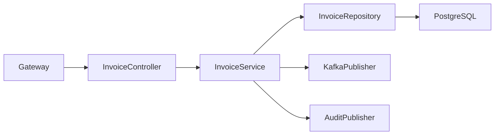
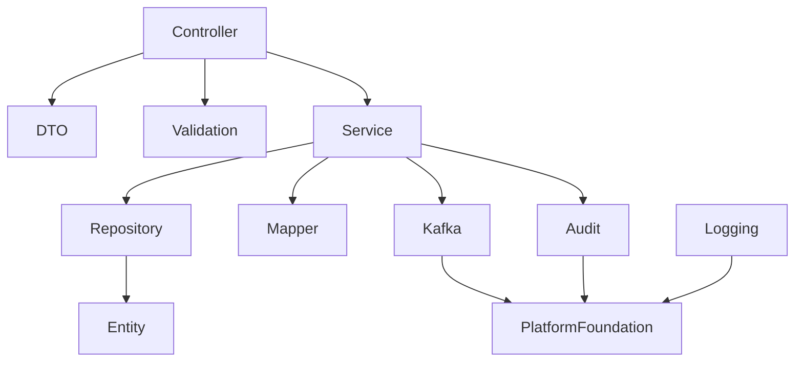
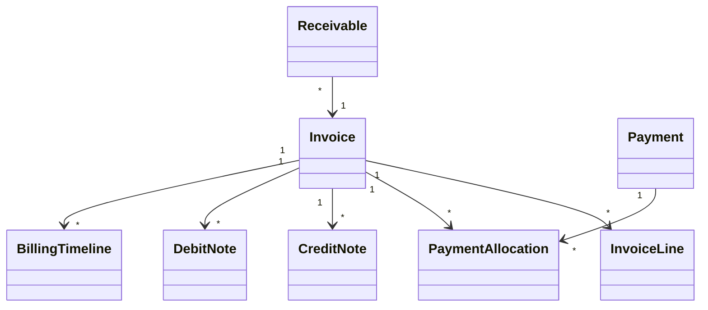

# LLD-008: Billing Service

# 1. Document Information

| Field       | Value                                  |
| ----------- | -------------------------------------- |
| Project     | Distributed Hub & Sales (DHS) Platform |
| Service     | Billing Service                        |
| Document    | Low Level Design                       |
| Document ID | LLD-008                                |
| Repository  | starone-dhs-platform                   |
| Module      | billing-service                        |
| Version     | v1.0.0                                 |
| Status      | Draft                                  |
| Standard    | IEEE 1016                              |
| Owner       | Enterprise Architecture                |

---

# 2. Purpose

This document defines the implementation-level architecture of the Billing Service.

The Billing Service is responsible for invoice generation, taxation, payment processing, payment allocation, credit notes, debit notes, invoice lifecycle management, customer receivables integration, and billing event publishing.

This document implements the requirements defined in **SRS-008 – Billing Service**.

---

# 3. Scope

The Billing Service provides

- Invoice Management
- Invoice Lines
- Invoice Tax Calculation
- Payment Management
- Payment Allocation
- Credit Notes
- Debit Notes
- Invoice Settlement
- Outstanding Receivables
- Billing Search
- Billing Timeline
- Billing Event Publishing

Billing Service shall not own

- Customer Master
- Product Master
- Order Master
- Payment Gateway Configuration
- General Ledger

Billing Service shall consume Order Service as the billing source.

---

# 4. Design Principles

## BILL-DP-001

Invoice shall be generated only from confirmed Orders.

---

## BILL-DP-002

Invoice numbers shall be immutable.

---

## BILL-DP-003

Invoice totals shall never change after posting.

---

## BILL-DP-004

Payments shall be independently tracked.

---

## BILL-DP-005

Invoice lifecycle shall be event-driven.

---

## BILL-DP-006

Infrastructure concerns shall reuse Platform Foundation.

---

# 5. Package Structure

```text
billing-service
│
├── config
├── controller
├── service
├── repository
├── entity
├── dto
├── mapper
├── validation
├── kafka
├── exception
├── audit
├── scheduler
├── util
└── client
```

---

# 6. Maven Module Structure

```text
billing-service
│
├── api
├── application
├── domain
├── infrastructure
└── bootstrap
```

---

# 7. Layered Architecture

```text
REST API

↓

Controller

↓

Application Service

↓

Domain

↓

Repository

↓

PostgreSQL
```

Platform Foundation provides

- Security
- Logging
- Validation
- Kafka
- OpenFeign
- Exception Handling
- Audit
- Observability

---

# 8. Package Design

## controller

```text
controller
│
├── InvoiceController
├── PaymentController
├── CreditNoteController
├── DebitNoteController
├── ReceivableController
├── BillingSearchController
└── BillingTimelineController
```

---

## service

```text
service
│
├── InvoiceService
├── PaymentService
├── PaymentAllocationService
├── CreditNoteService
├── DebitNoteService
├── ReceivableService
├── BillingSearchService
├── BillingTimelineService
├── BillingValidationService
└── BillingAuditService
```

---

## repository

```text
repository
│
├── InvoiceRepository
├── InvoiceLineRepository
├── PaymentRepository
├── PaymentAllocationRepository
├── CreditNoteRepository
├── DebitNoteRepository
├── ReceivableRepository
└── BillingTimelineRepository
```

---

## entity

```text
entity
│
├── Invoice
├── InvoiceLine
├── Payment
├── PaymentAllocation
├── CreditNote
├── DebitNote
├── Receivable
├── BillingTimeline
└── BillingAudit
```

---

## dto

```text
dto
│
├── request
├── response
└── event
```

---

## kafka

```text
kafka
│
├── producer
├── consumer
└── configuration
```

---

# 9. Component Diagram



---

# 10. Package Dependency Diagram



---

# 11. Domain Responsibilities

| Component          | Responsibility      |
| ------------------ | ------------------- |
| Invoice            | Customer Invoice    |
| Invoice Line       | Invoice Items       |
| Payment            | Customer Payments   |
| Payment Allocation | Invoice Settlement  |
| Credit Note        | Credit Adjustment   |
| Debit Note         | Debit Adjustment    |
| Receivable         | Outstanding Balance |
| Billing Timeline   | Billing History     |

---

# 12. Service Boundaries

Billing Service owns

- Invoice
- Invoice Lines
- Payment
- Payment Allocation
- Credit Note
- Debit Note
- Receivables
- Billing Timeline

Billing Service does not own

- Customer Master
- Product Master
- Order Master
- Payment Gateway Configuration
- General Ledger
- Supplier

Other services shall reference invoices using **invoiceId**.

---

# 13. Architecture Constraints

- Controllers shall remain stateless.
- Controllers shall never access repositories directly.
- Services shall contain business logic.
- Repositories shall contain persistence only.
- Invoice Number shall be immutable.
- Invoice totals shall never change after posting.
- Payments shall never exceed outstanding balance.
- Credit Notes shall reference posted invoices.
- DTOs shall never expose entities.
- Kafka events shall publish after successful transaction commit.
- All entities shall extend AuditableEntity.
- APIs shall return ApiResponse<T>.

---

# LLD-008: Billing Service

# 1. Document Information

| Field       | Value                                  |
| ----------- | -------------------------------------- |
| Project     | Distributed Hub & Sales (DHS) Platform |
| Service     | Billing Service                        |
| Document    | Low Level Design                       |
| Document ID | LLD-008                                |
| Repository  | starone-dhs-platform                   |
| Module      | billing-service                        |
| Version     | v1.0.0                                 |
| Status      | Draft                                  |
| Standard    | IEEE 1016                              |
| Owner       | Enterprise Architecture                |

---

# 2. Purpose

This document defines the implementation-level architecture of the Billing Service.

The Billing Service is responsible for invoice generation, taxation, payment processing, payment allocation, credit notes, debit notes, invoice lifecycle management, customer receivables integration, and billing event publishing.

This document implements the requirements defined in **SRS-008 – Billing Service**.

---

# 3. Scope

The Billing Service provides

- Invoice Management
- Invoice Lines
- Invoice Tax Calculation
- Payment Management
- Payment Allocation
- Credit Notes
- Debit Notes
- Invoice Settlement
- Outstanding Receivables
- Billing Search
- Billing Timeline
- Billing Event Publishing

Billing Service shall not own

- Customer Master
- Product Master
- Order Master
- Payment Gateway Configuration
- General Ledger

Billing Service shall consume Order Service as the billing source.

---

# 4. Design Principles

## BILL-DP-001

Invoice shall be generated only from confirmed Orders.

---

## BILL-DP-002

Invoice numbers shall be immutable.

---

## BILL-DP-003

Invoice totals shall never change after posting.

---

## BILL-DP-004

Payments shall be independently tracked.

---

## BILL-DP-005

Invoice lifecycle shall be event-driven.

---

## BILL-DP-006

Infrastructure concerns shall reuse Platform Foundation.

---

# 5. Package Structure

```text
billing-service
│
├── config
├── controller
├── service
├── repository
├── entity
├── dto
├── mapper
├── validation
├── kafka
├── exception
├── audit
├── scheduler
├── util
└── client
```

---

# 6. Maven Module Structure

```text
billing-service
│
├── api
├── application
├── domain
├── infrastructure
└── bootstrap
```

---

# 7. Layered Architecture

```text
REST API

↓

Controller

↓

Application Service

↓

Domain

↓

Repository

↓

PostgreSQL
```

Platform Foundation provides

- Security
- Logging
- Validation
- Kafka
- OpenFeign
- Exception Handling
- Audit
- Observability

---

# 8. Package Design

## controller

```text
controller
│
├── InvoiceController
├── PaymentController
├── CreditNoteController
├── DebitNoteController
├── ReceivableController
├── BillingSearchController
└── BillingTimelineController
```

---

## service

```text
service
│
├── InvoiceService
├── PaymentService
├── PaymentAllocationService
├── CreditNoteService
├── DebitNoteService
├── ReceivableService
├── BillingSearchService
├── BillingTimelineService
├── BillingValidationService
└── BillingAuditService
```

---

## repository

```text
repository
│
├── InvoiceRepository
├── InvoiceLineRepository
├── PaymentRepository
├── PaymentAllocationRepository
├── CreditNoteRepository
├── DebitNoteRepository
├── ReceivableRepository
└── BillingTimelineRepository
```

---

## entity

```text
entity
│
├── Invoice
├── InvoiceLine
├── Payment
├── PaymentAllocation
├── CreditNote
├── DebitNote
├── Receivable
├── BillingTimeline
└── BillingAudit
```

---

## dto

```text
dto
│
├── request
├── response
└── event
```

---

## kafka

```text
kafka
│
├── producer
├── consumer
└── configuration
```

---

# 9. Component Diagram


---

# 10. Package Dependency Diagram


---

# 11. Domain Responsibilities

| Component          | Responsibility      |
| ------------------ | ------------------- |
| Invoice            | Customer Invoice    |
| Invoice Line       | Invoice Items       |
| Payment            | Customer Payments   |
| Payment Allocation | Invoice Settlement  |
| Credit Note        | Credit Adjustment   |
| Debit Note         | Debit Adjustment    |
| Receivable         | Outstanding Balance |
| Billing Timeline   | Billing History     |

---

# 12. Service Boundaries

Billing Service owns

- Invoice
- Invoice Lines
- Payment
- Payment Allocation
- Credit Note
- Debit Note
- Receivables
- Billing Timeline

Billing Service does not own

- Customer Master
- Product Master
- Order Master
- Payment Gateway Configuration
- General Ledger
- Supplier

Other services shall reference invoices using **invoiceId**.

---

# 13. Architecture Constraints

- Controllers shall remain stateless.
- Controllers shall never access repositories directly.
- Services shall contain business logic.
- Repositories shall contain persistence only.
- Invoice Number shall be immutable.
- Invoice totals shall never change after posting.
- Payments shall never exceed outstanding balance.
- Credit Notes shall reference posted invoices.
- DTOs shall never expose entities.
- Kafka events shall publish after successful transaction commit.
- All entities shall extend AuditableEntity.
- APIs shall return ApiResponse<T>.

---

# 14. Class Design

The Billing Service shall implement classes for invoice lifecycle management, payment processing, payment allocation, credit note management, debit note management, receivables management, billing timeline management, and billing search.

The implementation shall follow Layered Architecture and Domain-Driven Design (DDD).

---

# 15. Controller Layer Design

The Controller layer shall expose REST APIs and delegate business processing to the Service layer.

Controllers shall remain stateless.

## Package Structure

```text
controller
│
├── InvoiceController
├── PaymentController
├── PaymentAllocationController
├── CreditNoteController
├── DebitNoteController
├── ReceivableController
├── BillingTimelineController
└── BillingSearchController
```

---

## InvoiceController

### Responsibilities

- Generate Invoice
- View Invoice
- Update Draft Invoice
- Post Invoice
- Cancel Invoice
- Print Invoice

### APIs

```text
POST   /api/v1/invoices

PUT    /api/v1/invoices/{invoiceId}

GET    /api/v1/invoices/{invoiceId}

PUT    /api/v1/invoices/{invoiceId}/post

PUT    /api/v1/invoices/{invoiceId}/cancel

GET    /api/v1/invoices/{invoiceId}/print
```

---

## PaymentController

Responsibilities

- Receive Payment
- Reverse Payment
- View Payment
- Payment History

---

## PaymentAllocationController

Responsibilities

- Allocate Payment
- Reallocate Payment
- Remove Allocation

---

## CreditNoteController

Responsibilities

- Create Credit Note
- Approve Credit Note
- Cancel Credit Note

---

## DebitNoteController

Responsibilities

- Create Debit Note
- Approve Debit Note
- Cancel Debit Note

---

## ReceivableController

Responsibilities

- Outstanding Balance
- Customer Receivables
- Aging Summary

---

## BillingTimelineController

Responsibilities

- Invoice Timeline
- Payment Timeline
- Billing Events

---

## BillingSearchController

Responsibilities

- Invoice Search
- Payment Search
- Credit Note Search
- Debit Note Search

---

# 16. Service Layer Design

Business logic shall reside in the Service layer.

## Package Structure

```text
service
│
├── InvoiceService
├── PaymentService
├── PaymentAllocationService
├── CreditNoteService
├── DebitNoteService
├── ReceivableService
├── BillingTimelineService
├── BillingSearchService
├── BillingValidationService
└── BillingAuditService
```

---

## InvoiceService

### Responsibilities

- Generate Invoice
- Post Invoice
- Cancel Invoice
- Validate Invoice

### Public Methods

```java
generateInvoice()

updateInvoice()

postInvoice()

cancelInvoice()

getInvoice()
```

---

## PaymentService

Responsibilities

- Receive Payment
- Reverse Payment
- Validate Payment

---

## PaymentAllocationService

Responsibilities

- Allocate Payment
- Remove Allocation
- Validate Allocation

---

## CreditNoteService

Responsibilities

- Credit Note Processing
- Approval Workflow

---

## DebitNoteService

Responsibilities

- Debit Note Processing
- Approval Workflow

---

## ReceivableService

Responsibilities

- Outstanding Calculation
- Aging Calculation

---

## BillingTimelineService

Responsibilities

- Timeline Recording
- Billing Audit Trail

---

## BillingSearchService

Responsibilities

- Search
- Filtering
- Pagination
- Sorting

---

# 17. Repository Layer Design

Repositories shall encapsulate persistence logic only.

## Package Structure

```text
repository
│
├── InvoiceRepository
├── InvoiceLineRepository
├── PaymentRepository
├── PaymentAllocationRepository
├── CreditNoteRepository
├── DebitNoteRepository
├── ReceivableRepository
└── BillingTimelineRepository
```

---

## Repository Responsibilities

| Repository                  | Responsibility       |
| --------------------------- | -------------------- |
| InvoiceRepository           | Invoice Master       |
| InvoiceLineRepository       | Invoice Lines        |
| PaymentRepository           | Payments             |
| PaymentAllocationRepository | Payment Allocation   |
| CreditNoteRepository        | Credit Notes         |
| DebitNoteRepository         | Debit Notes          |
| ReceivableRepository        | Customer Receivables |
| BillingTimelineRepository   | Timeline             |

---

# 18. DTO Design

## Request DTOs

```text
dto.request
│
├── GenerateInvoiceRequest
├── UpdateInvoiceRequest
├── PaymentRequest
├── PaymentAllocationRequest
├── CreditNoteRequest
├── DebitNoteRequest
├── InvoiceSearchRequest
└── ReceivableSearchRequest
```

---

## Response DTOs

```text
dto.response
│
├── InvoiceResponse
├── InvoiceSummaryResponse
├── PaymentResponse
├── PaymentAllocationResponse
├── CreditNoteResponse
├── DebitNoteResponse
├── ReceivableResponse
└── BillingTimelineResponse
```

---

## InvoiceResponse

| Field             | Type          |
| ----------------- | ------------- |
| invoiceId         | UUID          |
| invoiceNumber     | String        |
| orderId           | UUID          |
| customerId        | UUID          |
| invoiceStatus     | InvoiceStatus |
| invoiceDate       | Instant       |
| subtotal          | BigDecimal    |
| taxAmount         | BigDecimal    |
| totalAmount       | BigDecimal    |
| outstandingAmount | BigDecimal    |

---

# 19. Entity Design

All entities shall extend **AuditableEntity**.

---

## Package Structure

```text
entity
│
├── Invoice
├── InvoiceLine
├── Payment
├── PaymentAllocation
├── CreditNote
├── DebitNote
├── Receivable
├── BillingTimeline
└── BillingAudit
```

---

## Invoice

| Attribute         | Type          |
| ----------------- | ------------- |
| id                | UUID          |
| invoiceNumber     | String        |
| orderId           | UUID          |
| customerId        | UUID          |
| invoiceStatus     | InvoiceStatus |
| invoiceDate       | Instant       |
| dueDate           | LocalDate     |
| subtotal          | BigDecimal    |
| taxAmount         | BigDecimal    |
| totalAmount       | BigDecimal    |
| outstandingAmount | BigDecimal    |

---

## InvoiceLine

| Attribute | Type       |
| --------- | ---------- |
| id        | UUID       |
| invoiceId | UUID       |
| productId | UUID       |
| quantity  | BigDecimal |
| unitPrice | BigDecimal |
| taxAmount | BigDecimal |
| lineTotal | BigDecimal |

---

## Payment

| Attribute        | Type          |
| ---------------- | ------------- |
| id               | UUID          |
| paymentReference | String        |
| customerId       | UUID          |
| paymentMethod    | PaymentMethod |
| paymentDate      | Instant       |
| paymentAmount    | BigDecimal    |
| paymentStatus    | PaymentStatus |

---

## PaymentAllocation

| Attribute       | Type       |
| --------------- | ---------- |
| id              | UUID       |
| paymentId       | UUID       |
| invoiceId       | UUID       |
| allocatedAmount | BigDecimal |
| allocationDate  | Instant    |

---

## CreditNote

| Attribute        | Type             |
| ---------------- | ---------------- |
| id               | UUID             |
| creditNoteNumber | String           |
| invoiceId        | UUID             |
| creditAmount     | BigDecimal       |
| reason           | String           |
| status           | CreditNoteStatus |

---

## DebitNote

| Attribute       | Type            |
| --------------- | --------------- |
| id              | UUID            |
| debitNoteNumber | String          |
| invoiceId       | UUID            |
| debitAmount     | BigDecimal      |
| reason          | String          |
| status          | DebitNoteStatus |

---

## Receivable

| Attribute         | Type        |
| ----------------- | ----------- |
| id                | UUID        |
| customerId        | UUID        |
| invoiceId         | UUID        |
| outstandingAmount | BigDecimal  |
| agingBucket       | AgingBucket |

---

## BillingTimeline

| Attribute      | Type    |
| -------------- | ------- |
| id             | UUID    |
| invoiceId      | UUID    |
| eventType      | String  |
| eventTimestamp | Instant |
| remarks        | String  |

---

# 20. Mapper Design

MapStruct shall be the standard mapping framework.

## Package Structure

```text
mapper
│
├── InvoiceMapper
├── InvoiceLineMapper
├── PaymentMapper
├── PaymentAllocationMapper
├── CreditNoteMapper
├── DebitNoteMapper
├── ReceivableMapper
└── BillingTimelineMapper
```

---

## Responsibilities

- DTO → Entity
- Entity → DTO
- Partial Updates
- Page Mapping

---

# 21. Validation Design

## Package Structure

```text
validation
│
├── annotation
├── validator
└── groups
```

---

## Validators

```text
InvoiceValidator

InvoicePostingValidator

PaymentValidator

PaymentAllocationValidator

CreditNoteValidator

DebitNoteValidator

ReceivableValidator
```

---

## Validation Rules

| Validator                  | Purpose               |
| -------------------------- | --------------------- |
| InvoiceValidator           | Invoice Validation    |
| InvoicePostingValidator    | Posting Rules         |
| PaymentValidator           | Payment Validation    |
| PaymentAllocationValidator | Allocation Validation |
| CreditNoteValidator        | Credit Note Rules     |
| DebitNoteValidator         | Debit Note Rules      |
| ReceivableValidator        | Receivable Validation |

---

# 22. Exception Hierarchy

```text
RuntimeException
        │
        └── PlatformException
                │
                ├── InvoiceNotFoundException
                ├── DuplicateInvoiceException
                ├── InvalidInvoiceStateException
                ├── PaymentNotFoundException
                ├── PaymentAllocationException
                ├── CreditNoteException
                ├── DebitNoteException
                ├── OutstandingAmountException
                └── BillingValidationException
```

---

# 23. Invoice Generation Flow

```mermaid
sequenceDiagram

Order Service->>InvoiceController: Generate Invoice

InvoiceController->>InvoiceService

InvoiceService->>BillingValidationService

BillingValidationService-->>InvoiceService

InvoiceService->>InvoiceRepository

InvoiceRepository-->>InvoiceService

InvoiceService->>KafkaPublisher

InvoiceController-->>Order Service
```

---

# 24. Invoice Posting Flow

```mermaid
sequenceDiagram

Finance->>InvoiceController: Post Invoice

InvoiceController->>InvoiceService

InvoiceService->>InvoiceRepository

InvoiceRepository-->>InvoiceService

InvoiceService->>ReceivableService

ReceivableService-->>InvoiceService

InvoiceService->>KafkaPublisher

InvoiceController-->>Finance
```

---

# 25. Payment Processing Flow

```mermaid
sequenceDiagram

Cashier->>PaymentController

PaymentController->>PaymentService

PaymentService->>PaymentRepository

PaymentRepository-->>PaymentService

PaymentService->>PaymentAllocationService

PaymentAllocationService-->>PaymentService

PaymentController-->>Cashier
```

---

# 26. Credit Note Flow

```mermaid
sequenceDiagram

Finance->>CreditNoteController

CreditNoteController->>CreditNoteService

CreditNoteService->>InvoiceRepository

InvoiceRepository-->>CreditNoteService

CreditNoteService->>CreditNoteRepository

CreditNoteController-->>Finance
```

---

# 27. Billing Search Flow

```mermaid
sequenceDiagram

Client->>BillingSearchController

BillingSearchController->>BillingSearchService

BillingSearchService->>InvoiceRepository

InvoiceRepository-->>BillingSearchService

BillingSearchService-->>BillingSearchController

BillingSearchController-->>Client
```

---

# 28. Class Diagram



---

# 29. Design Constraints

- Invoice Number shall be immutable.
- Posted invoices shall never be modified.
- Payments shall never exceed outstanding balance.
- Credit Notes shall reference posted invoices.
- Debit Notes shall reference posted invoices.
- Controllers shall remain stateless.
- Services shall contain all business logic.
- Repository layer shall contain persistence only.
- Kafka events shall publish after successful transaction commit.
- DTOs shall never expose JPA entities.
- All entities shall extend `AuditableEntity`.
- APIs shall return `ApiResponse<T>`.

---

# 30. Security Configuration

The Billing Service shall inherit the enterprise security framework from the Platform Foundation.

Authentication shall be delegated to the Identity Service.

Authorization shall be enforced using Role-Based Access Control (RBAC).

---

## 30.1 Security Architecture

```text
Client

↓

API Gateway

↓

JWT Authentication Filter

↓

Authorization Filter

↓

Billing Controller

↓

Billing Service
```

---

## 30.2 Security Components

```text
security
│
├── config
│   ├── SecurityConfiguration
│   ├── MethodSecurityConfiguration
│   └── CorsConfiguration
│
├── filter
│   ├── JwtAuthenticationFilter
│   ├── AuthorizationFilter
│   └── CorrelationIdFilter
│
├── permission
│   ├── BillingPermissionEvaluator
│   └── BillingAccessValidator
│
└── annotation
    └── RequireBillingPermission
```

---

## 30.3 Permissions

| Permission         | Description          |
| ------------------ | -------------------- |
| INVOICE_CREATE     | Generate Invoice     |
| INVOICE_UPDATE     | Update Draft Invoice |
| INVOICE_POST       | Post Invoice         |
| INVOICE_CANCEL     | Cancel Invoice       |
| INVOICE_VIEW       | View Invoice         |
| PAYMENT_RECEIVE    | Receive Payment      |
| PAYMENT_ALLOCATE   | Allocate Payment     |
| CREDIT_NOTE_CREATE | Create Credit Note   |
| DEBIT_NOTE_CREATE  | Create Debit Note    |
| RECEIVABLE_VIEW    | View Receivables     |

---

## 30.4 Authorization Flow

```mermaid
sequenceDiagram

Client->>Gateway: JWT

Gateway->>Identity Service: Validate Token

Identity Service-->>Gateway: Claims

Gateway->>Billing Service

Billing Service->>PermissionEvaluator

PermissionEvaluator-->>Billing Service

Billing Service-->>Client
```

---

# 31. JWT Implementation

JWT validation shall be handled by Platform Foundation.

Billing Service shall consume authenticated user information from Spring Security.

---

## Required Claims

```json
{
  "sub": "UUID",
  "username": "finance.manager",
  "roles": ["FINANCE_MANAGER"],
  "permissions": ["INVOICE_POST", "PAYMENT_RECEIVE"],
  "tenantId": "UUID",
  "branchId": "UUID"
}
```

---

## User Context

Every request shall expose

```text
UserId

Username

Roles

Permissions

TenantId

BranchId

CorrelationId
```

---

# 32. Authorization Design

Permission-based authorization shall be implemented.

---

## Example

```java
@PreAuthorize("hasAuthority('INVOICE_POST')")
```

or

```java
@RequireBillingPermission("INVOICE_POST")
```

---

## Permission Matrix

| API                | Permission         |
| ------------------ | ------------------ |
| Generate Invoice   | INVOICE_CREATE     |
| Update Invoice     | INVOICE_UPDATE     |
| Post Invoice       | INVOICE_POST       |
| Cancel Invoice     | INVOICE_CANCEL     |
| View Invoice       | INVOICE_VIEW       |
| Receive Payment    | PAYMENT_RECEIVE    |
| Allocate Payment   | PAYMENT_ALLOCATE   |
| Create Credit Note | CREDIT_NOTE_CREATE |
| Create Debit Note  | DEBIT_NOTE_CREATE  |
| View Receivables   | RECEIVABLE_VIEW    |

---

# 33. Kafka Design

Billing Service shall publish billing lifecycle events.

---

## Published Topics

```text
invoice.generated.v1

invoice.posted.v1

invoice.cancelled.v1

invoice.paid.v1

invoice.partially.paid.v1

payment.received.v1

payment.reversed.v1

payment.allocated.v1

credit.note.created.v1

credit.note.approved.v1

debit.note.created.v1

receivable.updated.v1
```

---

## Consumed Topics

```text
order.confirmed.v1

order.cancelled.v1

returns.completed.v1

payment.gateway.success.v1

payment.gateway.failed.v1
```

---

## Kafka Package

```text
kafka
│
├── producer
├── consumer
├── configuration
├── mapper
└── event
```

---

## Event Envelope

```json
{
  "eventId": "UUID",
  "eventType": "InvoiceGenerated",
  "eventVersion": "1.0",
  "occurredAt": "2026-06-27T10:00:00Z",
  "correlationId": "UUID",
  "payload": {}
}
```

---

# 34. OpenFeign Design

Billing Service shall use synchronous communication only where immediate validation is required.

---

## Feign Clients

```text
client
│
├── OrderClient
├── CustomerClient
├── NotificationClient
├── AuditClient
└── PaymentGatewayClient
```

---

## Responsibilities

| Client               | Responsibility        |
| -------------------- | --------------------- |
| OrderClient          | Order Validation      |
| CustomerClient       | Customer Validation   |
| NotificationClient   | Invoice Notification  |
| AuditClient          | Audit Submission      |
| PaymentGatewayClient | Payment Authorization |

---

# 35. Configuration Classes

```text
config
│
├── SecurityConfiguration
├── KafkaConfiguration
├── FeignConfiguration
├── CacheConfiguration
├── JacksonConfiguration
├── ValidationConfiguration
├── SchedulerConfiguration
├── MetricsConfiguration
└── OpenApiConfiguration
```

---

## Responsibilities

| Configuration | Responsibility       |
| ------------- | -------------------- |
| Security      | Spring Security      |
| Kafka         | Kafka Infrastructure |
| Feign         | OpenFeign            |
| Cache         | Redis                |
| Validation    | Bean Validation      |
| Scheduler     | Background Jobs      |
| Metrics       | Micrometer           |
| OpenAPI       | Swagger              |

---

# 36. Transaction Design

Billing transactions shall remain local.

Distributed workflows shall communicate using Kafka events.

---

## Transaction Types

| Operation          | Propagation  |
| ------------------ | ------------ |
| Generate Invoice   | REQUIRED     |
| Post Invoice       | REQUIRED     |
| Receive Payment    | REQUIRED     |
| Allocate Payment   | REQUIRED     |
| Create Credit Note | REQUIRED     |
| Create Debit Note  | REQUIRED     |
| Publish Event      | AFTER_COMMIT |

---

## Transaction Flow

```mermaid
flowchart LR

Controller

-->

BillingService

-->

Repository

-->

Commit

-->

Kafka Publish
```

---

# 37. Cache Design

Redis shall cache frequently accessed billing information.

---

## Cached Objects

```text
Invoice Summary

Outstanding Balance

Customer Receivables

Invoice Timeline

Billing Search
```

---

## Cache Annotations

```java
@Cacheable

@CachePut

@CacheEvict
```

---

# 38. Resilience Patterns

Billing Service shall implement Resilience4j.

---

## Retry

Payment Gateway

Notification Service

---

## Circuit Breaker

Payment Gateway

Notification Service

Audit Service

Order Service

---

## Bulkhead

External Integrations

---

## Rate Limiter

Invoice Search

Payment APIs

---

## Timeout

Feign Clients

---

# 39. Scheduler Design

Scheduled jobs shall support billing operations.

---

## Scheduled Jobs

```text
scheduler
│
├── InvoiceDueReminderScheduler
├── ReceivableAgingScheduler
├── PaymentReconciliationScheduler
├── BillingCacheRefreshScheduler
├── FailedPaymentRetryScheduler
└── AuditCleanupScheduler
```

---

# 40. External Integration Design

| Service              | Purpose                         |
| -------------------- | ------------------------------- |
| Order Service        | Invoice Generation              |
| Customer Service     | Customer Validation             |
| Notification Service | Invoice & Payment Notifications |
| Audit Service        | Audit Logging                   |
| Reporting Service    | Financial Analytics             |
| Payment Gateway      | Payment Processing              |

---

# 41. Configuration Properties

| Property                 | Default |
| ------------------------ | ------- |
| billing.cache.enabled    | true    |
| billing.cache.ttl        | 3600    |
| billing.invoice.due.days | 30      |
| billing.payment.retry    | 3       |
| billing.kafka.retry      | 3       |

---

# 42. Data Consistency Strategy

- Invoice Number shall remain unique.
- Invoice totals shall never change after posting.
- Outstanding balance shall never become negative.
- Payment allocations shall never exceed payment amount.
- Credit Notes shall reduce outstanding balance.
- Debit Notes shall increase outstanding balance.
- Events shall publish only after successful transaction commit.

---

# 43. Performance Considerations

- Invoice search shall support pagination.
- Frequently accessed invoices shall be cached.
- Receivable aging shall execute asynchronously.
- Payment allocation shall use indexed queries.
- Timeline retrieval shall use Redis cache.

---

# 44. Design Constraints

- Invoice Number shall never change.
- Posted invoices shall be immutable.
- JWT authentication shall be mandatory.
- Authorization shall be permission-based.
- Repository layer shall never invoke external services.
- Configuration shall be externalized.
- Kafka events shall publish after transaction commit.
- Correlation ID shall propagate across outbound requests.

---

# 45. Technology Standards

| Concern           | Technology              |
| ----------------- | ----------------------- |
| Java              | Java 21                 |
| Framework         | Spring Boot 3.x         |
| Security          | Spring Security 6       |
| Authentication    | JWT                     |
| Authorization     | RBAC                    |
| Database          | PostgreSQL              |
| Cache             | Redis                   |
| Messaging         | Apache Kafka            |
| Service Calls     | OpenFeign               |
| Validation        | Jakarta Bean Validation |
| Mapping           | MapStruct               |
| Logging           | SLF4J + Logback         |
| Metrics           | Micrometer              |
| Tracing           | OpenTelemetry           |
| Service Discovery | Eureka                  |

---

# 46. Logging Design

The Billing Service shall implement centralized structured logging using the Platform Foundation logging framework.

Every invoice, payment, receivable, credit note, debit note, and external integration shall be logged using standardized MDC attributes.

---

## 46.1 Logging Architecture

```text
REST Request

↓

Correlation Filter

↓

Logging Aspect

↓

SLF4J

↓

Logback

↓

ELK / OpenSearch / Splunk
```

---

## 46.2 Log Levels

| Level | Purpose                     |
| ----- | --------------------------- |
| TRACE | Framework Diagnostics       |
| DEBUG | Development                 |
| INFO  | Business Events             |
| WARN  | Recoverable Business Errors |
| ERROR | System Failures             |

---

## 46.3 MDC Context

Every log entry shall include

```text
Correlation ID

Trace ID

Span ID

Invoice ID

Invoice Number

Payment ID

Customer ID

Branch ID

Tenant ID

User ID

Request URI

HTTP Method

Service Name

Environment
```

---

## 46.4 Business Events

The following operations shall always be logged.

- Invoice Generated
- Invoice Updated
- Invoice Posted
- Invoice Cancelled
- Invoice Fully Paid
- Invoice Partially Paid
- Payment Received
- Payment Reversed
- Payment Allocated
- Credit Note Created
- Credit Note Approved
- Debit Note Created
- Debit Note Approved
- Receivable Updated
- Outstanding Balance Updated

---

## 46.5 Sensitive Data

The following shall never be logged.

- JWT Tokens
- Authorization Headers
- Payment Gateway Tokens
- Bank Account Numbers
- Card Numbers
- CVV
- Encryption Keys
- Internal Secrets

---

# 47. Observability

Billing Service shall expose operational metrics using Micrometer.

---

## JVM Metrics

- Heap Usage
- CPU Usage
- Thread Count
- Garbage Collection

---

## Business Metrics

- Invoices Generated
- Posted Invoices
- Cancelled Invoices
- Payments Received
- Payments Reversed
- Credit Notes Issued
- Debit Notes Issued
- Outstanding Receivables
- Overdue Invoices
- Collection Success Rate

---

## Infrastructure Metrics

- Database Connections
- Kafka Publish Rate
- Kafka Consumer Lag
- Redis Cache Hit Ratio
- API Response Time

---

# 48. Distributed Tracing

Every request shall propagate distributed tracing metadata.

---

## Trace Flow

```mermaid
sequenceDiagram

Client->>Gateway

Gateway->>Billing Service

Billing Service->>Order Service

Billing Service->>Customer Service

Billing Service->>Payment Gateway

Billing Service->>Notification Service

Billing Service-->>Gateway

Gateway-->>Client
```

---

## Trace Context

Every request shall propagate

- Correlation ID
- Trace ID
- Span ID

---

# 49. Health Checks

Billing Service shall expose Spring Boot Actuator endpoints.

---

## Health

```text
GET /actuator/health
```

---

## Liveness

```text
GET /actuator/health/liveness
```

---

## Readiness

```text
GET /actuator/health/readiness
```

Dependencies

- PostgreSQL
- Redis
- Kafka
- Config Server
- Payment Gateway Connectivity

---

## Metrics

```text
GET /actuator/metrics
```

---

## Prometheus

```text
GET /actuator/prometheus
```

---

# 50. Deployment Design

Billing Service shall be deployed as an independent containerized microservice.

---

## Deployment Architecture

```text
Gateway

↓

Billing Service

↓

PostgreSQL

↓

Redis

↓

Kafka

↓

Payment Gateway
```

---

## Kubernetes Resources

```text
Deployment

Service

Ingress

ConfigMap

Secret

HorizontalPodAutoscaler

ServiceMonitor

PodDisruptionBudget
```

---

# 51. Dependency Management

Billing Service shall inherit the Platform Foundation BOM.

```xml
<dependencyManagement>

<dependency>

<groupId>com.starone</groupId>

<artifactId>platform-foundation-bom</artifactId>

</dependency>

</dependencyManagement>
```

---

## Primary Dependencies

- Spring Boot
- Spring Security
- Spring Data JPA
- Spring Kafka
- Spring Validation
- PostgreSQL Driver
- Redis
- OpenFeign
- Micrometer
- OpenTelemetry
- MapStruct
- Lombok

---

# 52. Coding Standards

Billing Service shall comply with enterprise coding standards.

---

## Controller

- Stateless
- Validation Only
- No Business Logic

---

## Service

- Stateless
- Transactional
- Business Orchestration

---

## Repository

- Persistence Only
- No External Calls

---

## DTO

- Immutable
- Validation Annotations

---

## Entity

- Extend AuditableEntity
- Never Exposed Directly

---

# 53. Package Naming Standards

```text
com.starone.billing

├── controller
├── service
├── repository
├── entity
├── dto
├── mapper
├── validation
├── config
├── kafka
├── exception
├── scheduler
├── audit
├── util
└── client
```

---

# 54. Testing Strategy

## Unit Testing

Framework

```text
JUnit 5

Mockito
```

Coverage

```text
Minimum 90%
```

---

## Integration Testing

- Spring Boot Test
- Testcontainers
- Embedded Kafka

---

## API Testing

- REST Assured
- Spring MockMvc

---

## Performance Testing

- Invoice Generation
- Invoice Posting
- Payment Processing
- Payment Allocation
- Receivable Aging
- Invoice Search

---

## Static Analysis

- SonarQube
- SpotBugs
- PMD
- Checkstyle

---

# 55. Build Validation

Every Pull Request shall verify

- Compilation
- Unit Tests
- Integration Tests
- Static Analysis
- Security Scan
- Dependency Scan
- Documentation Validation
- Code Coverage

---

# 56. Quality Gates

| Metric                   | Target    |
| ------------------------ | --------- |
| Unit Test Coverage       | ≥90%      |
| Integration Tests        | 100% Pass |
| Critical Bugs            | 0         |
| Critical Vulnerabilities | 0         |
| Code Duplication         | <3%       |
| Documentation            | Mandatory |

---

# 57. Implementation Guidelines

Billing Service shall reuse Platform Foundation components.

Business code shall never duplicate

- JWT Security
- Logging
- Validation
- Kafka Infrastructure
- Exception Handling
- Audit Framework
- API Response Models
- Pagination Framework

Invoice posting shall always be transactional.

Receivable updates shall occur atomically with invoice posting and payment allocation.

---

# 58. Extension Guidelines

Business-specific functionality shall extend Platform Foundation components where applicable.

Permitted extensions include

- AuditableEntity
- PlatformException
- ApiResponse
- BaseMapper
- AuditService

Platform Foundation source code shall never be modified by Billing Service.

---

# 59. Design Checklist

Before implementation verify

- Invoice Number uniqueness enforced
- Invoice totals immutable after posting
- Outstanding balance calculation validated
- Payment allocation validated
- Credit Note workflow implemented
- Debit Note workflow implemented
- Receivable aging scheduler implemented
- Controllers contain no business logic
- Services remain stateless
- Repository layer contains persistence only
- Kafka events publish after successful transaction commit
- Redis cache configured
- Correlation ID propagation enabled
- Health endpoints exposed
- Metrics published
- Configuration externalized
- Unit test coverage meets quality gates

---

# 60. Appendix A – Framework Versions

| Component       | Version          |
| --------------- | ---------------- |
| Java            | 21               |
| Spring Boot     | 3.x              |
| Spring Security | 6.x              |
| Spring Cloud    | 2025.x           |
| PostgreSQL      | Latest Supported |
| Redis           | Latest Supported |
| Kafka           | Latest Supported |
| OpenFeign       | Latest Supported |
| Micrometer      | Latest Supported |
| OpenTelemetry   | Latest Supported |
| MapStruct       | Latest Stable    |
| Lombok          | Latest Stable    |
| JUnit           | 5.x              |

---

# 61. Appendix B – Layer Responsibility Matrix

| Layer      | Responsibility         |
| ---------- | ---------------------- |
| Controller | Request Handling       |
| Service    | Billing Business Logic |
| Repository | Persistence            |
| Kafka      | Event Publishing       |
| Mapper     | DTO Conversion         |
| Validation | Request Validation     |
| Audit      | Billing Audit          |

---

# 62. Appendix C – Billing Components

```text
InvoiceController

PaymentController

PaymentAllocationController

CreditNoteController

DebitNoteController

ReceivableController

BillingTimelineController

BillingSearchController

InvoiceService

PaymentService

PaymentAllocationService

CreditNoteService

DebitNoteService

ReceivableService

BillingTimelineService

BillingSearchService

InvoiceRepository

InvoiceLineRepository

PaymentRepository

PaymentAllocationRepository

CreditNoteRepository

DebitNoteRepository

ReceivableRepository

BillingTimelineRepository
```

---

# 63. Appendix D – Billing Processing Summary

```text
Client

↓

Gateway

↓

JWT Authentication

↓

Authorization

↓

Controller

↓

Service

↓

Repository

↓

Kafka Events

↓

Audit Events

↓

Response
```

---

# 64. Appendix E – Repository Responsibilities

| Repository                    | Responsibility                                  |
| ----------------------------- | ----------------------------------------------- |
| starone-galaxy-architecture   | Enterprise Standards, Governance & Architecture |
| starone-galaxy-central-config | Configuration Management                        |
| starone-galaxy-infra          | Kubernetes, Infrastructure & CI/CD              |
| starone-dhs-platform          | Billing Service Implementation                  |

---

# 65. Conclusion

The Billing Service is the authoritative financial transaction component of the DHS platform, responsible for invoice generation, payment processing, receivables management, payment allocation, credit and debit note processing, and billing lifecycle management. It provides immutable financial records, maintains transactional consistency, publishes billing domain events, and integrates with Order, Customer, Notification, Reporting, and Payment Gateway services while leveraging the Platform Foundation for security, observability, logging, messaging, validation, and other cross-cutting enterprise capabilities.

---

# End of Document
