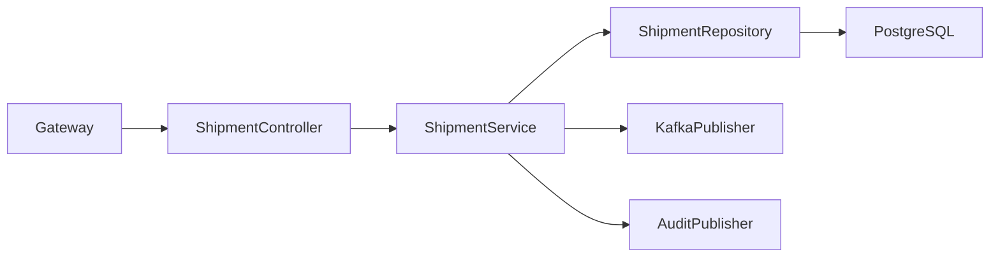
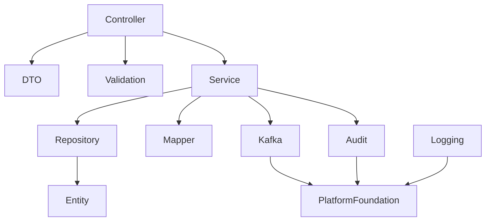
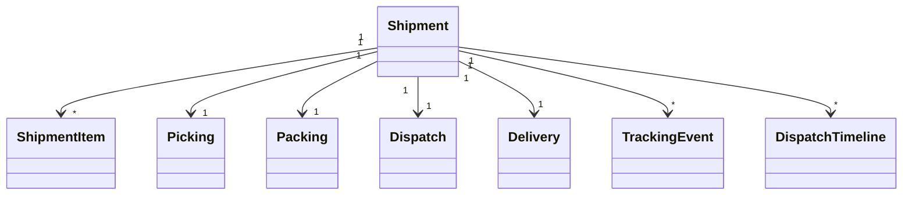

# LLD-009: Dispatch Service

# 1. Document Information

| Field | Value |
|--------|-------|
| Project | Distributed Hub & Sales (DHS) Platform |
| Service | Dispatch Service |
| Document | Low Level Design |
| Document ID | LLD-009 |
| Repository | starone-dhs-platform |
| Module | dispatch-service |
| Version | v1.0.0 |
| Status | Draft |
| Standard | IEEE 1016 |
| Owner | Enterprise Architecture |

---

# 2. Purpose

This document defines the implementation-level architecture of the Dispatch Service.

The Dispatch Service is responsible for shipment creation, shipment planning, picking, packing, dispatch execution, shipment tracking, proof of delivery, shipment completion, and dispatch event publishing.

This document implements the requirements defined in **SRS-009 – Dispatch Service**.

---

# 3. Scope

The Dispatch Service provides

- Shipment Management
- Picking
- Packing
- Shipment Allocation
- Shipment Scheduling
- Vehicle Assignment
- Delivery Assignment
- Shipment Tracking
- Proof of Delivery
- Dispatch Timeline
- Dispatch Event Publishing

Dispatch Service shall not own

- Orders
- Inventory
- Billing
- Customer Master
- Warehouse Master
- Vehicle Master

Dispatch Service shall orchestrate fulfillment activities using Inventory, Order, and Notification services.

---

# 4. Design Principles

## DSP-DP-001

Shipment shall always originate from confirmed orders.

---

## DSP-DP-002

Dispatch shall occur only after inventory allocation.

---

## DSP-DP-003

Shipment shall be fully traceable.

---

## DSP-DP-004

Proof of Delivery shall complete shipment lifecycle.

---

## DSP-DP-005

Shipment lifecycle shall be event-driven.

---

## DSP-DP-006

Infrastructure concerns shall reuse Platform Foundation.

---

# 5. Package Structure

```text
dispatch-service
│
├── config
├── controller
├── service
├── repository
├── entity
├── dto
├── mapper
├── validation
├── kafka
├── exception
├── audit
├── scheduler
├── util
└── client
```

---

# 6. Maven Module Structure

```text
dispatch-service
│
├── api
├── application
├── domain
├── infrastructure
└── bootstrap
```

---

# 7. Layered Architecture

```text
REST API

↓

Controller

↓

Application Service

↓

Domain

↓

Repository

↓

PostgreSQL
```

Platform Foundation provides

- Security
- Logging
- Validation
- Kafka
- OpenFeign
- Exception Handling
- Audit
- Observability

---

# 8. Package Design

## controller

```text
controller
│
├── ShipmentController
├── PickingController
├── PackingController
├── DispatchController
├── TrackingController
├── DeliveryController
├── DispatchSearchController
└── DispatchTimelineController
```

---

## service

```text
service
│
├── ShipmentService
├── PickingService
├── PackingService
├── DispatchService
├── TrackingService
├── DeliveryService
├── DispatchTimelineService
├── DispatchSearchService
├── DispatchValidationService
└── DispatchAuditService
```

---

## repository

```text
repository
│
├── ShipmentRepository
├── ShipmentItemRepository
├── PickingRepository
├── PackingRepository
├── DispatchRepository
├── DeliveryRepository
├── TrackingRepository
└── DispatchTimelineRepository
```

---

## entity

```text
entity
│
├── Shipment
├── ShipmentItem
├── Picking
├── Packing
├── Dispatch
├── Delivery
├── TrackingEvent
├── DispatchTimeline
└── DispatchAudit
```

---

## dto

```text
dto
│
├── request
├── response
└── event
```

---

## kafka

```text
kafka
│
├── producer
├── consumer
└── configuration
```

---

# 9. Component Diagram



---

# 10. Package Dependency Diagram



---

# 11. Domain Responsibilities

| Component | Responsibility |
|------------|----------------|
| Shipment | Shipment Lifecycle |
| Shipment Item | Products to Deliver |
| Picking | Warehouse Picking |
| Packing | Packaging |
| Dispatch | Dispatch Execution |
| Delivery | Delivery Confirmation |
| Tracking Event | Shipment Tracking |
| Dispatch Timeline | Shipment History |

---

# 12. Service Boundaries

Dispatch Service owns

- Shipment
- Picking
- Packing
- Dispatch
- Delivery
- Tracking Events
- Shipment Timeline

Dispatch Service does not own

- Orders
- Inventory
- Billing
- Customer
- Warehouse
- Vehicle Master
- Supplier

Other services shall reference shipments using **shipmentId**.

---

# 13. Architecture Constraints

- Controllers shall remain stateless.
- Controllers shall never access repositories directly.
- Services shall contain business logic.
- Repository layer shall contain persistence only.
- Shipment Number shall be immutable.
- Shipment shall originate from confirmed Orders.
- Picking shall precede Packing.
- Packing shall precede Dispatch.
- Delivery shall require Proof of Delivery.
- DTOs shall never expose entities.
- Kafka events shall publish after successful transaction commit.
- All entities shall extend AuditableEntity.
- APIs shall return ApiResponse<T>.

---

# 14. Class Design

The Dispatch Service shall implement classes for shipment lifecycle management, warehouse picking, packing, dispatch execution, shipment tracking, proof of delivery, delivery confirmation, and shipment search.

The implementation shall follow Layered Architecture and Domain-Driven Design (DDD).

---

# 15. Controller Layer Design

The Controller layer shall expose REST APIs and delegate business processing to the Service layer.

Controllers shall remain stateless.

## Package Structure

```text
controller
│
├── ShipmentController
├── PickingController
├── PackingController
├── DispatchController
├── DeliveryController
├── TrackingController
├── DispatchTimelineController
└── DispatchSearchController
```

---

## ShipmentController

### Responsibilities

- Create Shipment
- Update Shipment
- View Shipment
- Cancel Shipment
- Shipment Summary

### APIs

```text
POST   /api/v1/shipments

PUT    /api/v1/shipments/{shipmentId}

GET    /api/v1/shipments/{shipmentId}

PUT    /api/v1/shipments/{shipmentId}/cancel

GET    /api/v1/shipments/{shipmentId}/summary
```

---

## PickingController

Responsibilities

- Create Pick List
- Start Picking
- Complete Picking
- View Pick Status

---

## PackingController

Responsibilities

- Create Packing List
- Complete Packing
- Generate Package Labels

---

## DispatchController

Responsibilities

- Dispatch Shipment
- Assign Vehicle
- Assign Driver
- Dispatch Status

---

## DeliveryController

Responsibilities

- Record Delivery
- Upload Proof of Delivery
- Delivery Confirmation
- Delivery Failure

---

## TrackingController

Responsibilities

- Shipment Tracking
- Tracking History
- Update Shipment Location

---

## DispatchSearchController

Responsibilities

- Shipment Search
- Delivery Search
- Dispatch Search
- Advanced Filtering

---

## DispatchTimelineController

Responsibilities

- Shipment Timeline
- Dispatch Activity
- Delivery Events

---

# 16. Service Layer Design

Business logic shall reside in the Service layer.

## Package Structure

```text
service
│
├── ShipmentService
├── PickingService
├── PackingService
├── DispatchService
├── DeliveryService
├── TrackingService
├── DispatchTimelineService
├── DispatchSearchService
├── DispatchValidationService
└── DispatchAuditService
```

---

## ShipmentService

### Responsibilities

- Create Shipment
- Update Shipment
- Validate Shipment
- Cancel Shipment

### Public Methods

```java
createShipment()

updateShipment()

cancelShipment()

getShipment()

getShipmentSummary()
```

---

## PickingService

Responsibilities

- Generate Pick List
- Start Picking
- Complete Picking
- Validate Pick Quantities

---

## PackingService

Responsibilities

- Create Package
- Validate Packed Quantity
- Generate Shipping Labels

---

## DispatchService

Responsibilities

- Assign Driver
- Assign Vehicle
- Dispatch Shipment
- Complete Dispatch

---

## DeliveryService

Responsibilities

- Delivery Confirmation
- Proof of Delivery
- Failed Delivery Handling

---

## TrackingService

Responsibilities

- Shipment Tracking
- Status Updates
- GPS Tracking Events

---

## DispatchTimelineService

Responsibilities

- Shipment Timeline
- Activity Recording

---

## DispatchSearchService

Responsibilities

- Search
- Filtering
- Pagination
- Sorting

---

# 17. Repository Layer Design

Repositories shall encapsulate persistence logic only.

## Package Structure

```text
repository
│
├── ShipmentRepository
├── ShipmentItemRepository
├── PickingRepository
├── PackingRepository
├── DispatchRepository
├── DeliveryRepository
├── TrackingRepository
└── DispatchTimelineRepository
```

---

## Repository Responsibilities

| Repository | Responsibility |
|------------|----------------|
| ShipmentRepository | Shipment Master |
| ShipmentItemRepository | Shipment Items |
| PickingRepository | Picking Operations |
| PackingRepository | Packing Operations |
| DispatchRepository | Dispatch Execution |
| DeliveryRepository | Delivery Records |
| TrackingRepository | Tracking Events |
| DispatchTimelineRepository | Timeline |

---

# 18. DTO Design

## Request DTOs

```text
dto.request
│
├── CreateShipmentRequest
├── UpdateShipmentRequest
├── PickingRequest
├── PackingRequest
├── DispatchRequest
├── DeliveryRequest
├── TrackingUpdateRequest
└── ShipmentSearchRequest
```

---

## Response DTOs

```text
dto.response
│
├── ShipmentResponse
├── ShipmentSummaryResponse
├── PickingResponse
├── PackingResponse
├── DispatchResponse
├── DeliveryResponse
├── TrackingResponse
└── DispatchTimelineResponse
```

---

## ShipmentResponse

| Field | Type |
|---------|------|
| shipmentId | UUID |
| shipmentNumber | String |
| orderId | UUID |
| warehouseId | UUID |
| shipmentStatus | ShipmentStatus |
| dispatchDate | Instant |
| expectedDeliveryDate | LocalDate |
| deliveredDate | Instant |

---

# 19. Entity Design

All entities shall extend **AuditableEntity**.

---

## Package Structure

```text
entity
│
├── Shipment
├── ShipmentItem
├── Picking
├── Packing
├── Dispatch
├── Delivery
├── TrackingEvent
├── DispatchTimeline
└── DispatchAudit
```

---

## Shipment

| Attribute | Type |
|------------|------|
| id | UUID |
| shipmentNumber | String |
| orderId | UUID |
| warehouseId | UUID |
| shipmentStatus | ShipmentStatus |
| dispatchDate | Instant |
| expectedDeliveryDate | LocalDate |
| deliveredDate | Instant |

---

## ShipmentItem

| Attribute | Type |
|------------|------|
| id | UUID |
| shipmentId | UUID |
| productId | UUID |
| orderedQuantity | BigDecimal |
| pickedQuantity | BigDecimal |
| packedQuantity | BigDecimal |
| dispatchedQuantity | BigDecimal |

---

## Picking

| Attribute | Type |
|------------|------|
| id | UUID |
| shipmentId | UUID |
| pickerId | UUID |
| pickingStatus | PickingStatus |
| pickedAt | Instant |

---

## Packing

| Attribute | Type |
|------------|------|
| id | UUID |
| shipmentId | UUID |
| packageNumber | String |
| packageCount | Integer |
| packingStatus | PackingStatus |

---

## Dispatch

| Attribute | Type |
|------------|------|
| id | UUID |
| shipmentId | UUID |
| vehicleId | UUID |
| driverId | UUID |
| dispatchStatus | DispatchStatus |
| dispatchedAt | Instant |

---

## Delivery

| Attribute | Type |
|------------|------|
| id | UUID |
| shipmentId | UUID |
| deliveredBy | UUID |
| deliveredAt | Instant |
| proofOfDeliveryUrl | String |
| deliveryStatus | DeliveryStatus |

---

## TrackingEvent

| Attribute | Type |
|------------|------|
| id | UUID |
| shipmentId | UUID |
| trackingStatus | TrackingStatus |
| latitude | BigDecimal |
| longitude | BigDecimal |
| eventTime | Instant |

---

## DispatchTimeline

| Attribute | Type |
|------------|------|
| id | UUID |
| shipmentId | UUID |
| eventType | String |
| eventTimestamp | Instant |
| remarks | String |

---

# 20. Mapper Design

MapStruct shall be the standard mapping framework.

## Package Structure

```text
mapper
│
├── ShipmentMapper
├── ShipmentItemMapper
├── PickingMapper
├── PackingMapper
├── DispatchMapper
├── DeliveryMapper
├── TrackingMapper
└── DispatchTimelineMapper
```

---

## Responsibilities

- DTO → Entity
- Entity → DTO
- Partial Updates
- Page Mapping

---

# 21. Validation Design

## Package Structure

```text
validation
│
├── annotation
├── validator
└── groups
```

---

## Validators

```text
ShipmentValidator

PickingValidator

PackingValidator

DispatchValidator

DeliveryValidator

TrackingValidator
```

---

## Validation Rules

| Validator | Purpose |
|------------|----------|
| ShipmentValidator | Shipment Validation |
| PickingValidator | Picking Validation |
| PackingValidator | Packing Validation |
| DispatchValidator | Dispatch Validation |
| DeliveryValidator | Delivery Validation |
| TrackingValidator | Tracking Validation |

---

# 22. Exception Hierarchy

```text
RuntimeException
        │
        └── PlatformException
                │
                ├── ShipmentNotFoundException
                ├── DuplicateShipmentException
                ├── InvalidShipmentStateException
                ├── PickingException
                ├── PackingException
                ├── DispatchException
                ├── DeliveryException
                ├── ProofOfDeliveryException
                └── TrackingException
```

---

# 23. Shipment Creation Flow

```mermaid
sequenceDiagram

Order Service->>ShipmentController: Create Shipment

ShipmentController->>ShipmentService

ShipmentService->>DispatchValidationService

DispatchValidationService-->>ShipmentService

ShipmentService->>ShipmentRepository

ShipmentRepository-->>ShipmentService

ShipmentService->>KafkaPublisher

ShipmentController-->>Order Service
```

---

# 24. Picking Flow

```mermaid
sequenceDiagram

Warehouse->>PickingController

PickingController->>PickingService

PickingService->>PickingRepository

PickingRepository-->>PickingService

PickingService->>ShipmentRepository

PickingController-->>Warehouse
```

---

# 25. Packing Flow

```mermaid
sequenceDiagram

Warehouse->>PackingController

PackingController->>PackingService

PackingService->>PackingRepository

PackingRepository-->>PackingService

PackingService->>ShipmentRepository

PackingController-->>Warehouse
```

---

# 26. Dispatch Flow

```mermaid
sequenceDiagram

Dispatcher->>DispatchController

DispatchController->>DispatchService

DispatchService->>DispatchRepository

DispatchRepository-->>DispatchService

DispatchService->>TrackingService

DispatchController-->>Dispatcher
```

---

# 27. Delivery Confirmation Flow

```mermaid
sequenceDiagram

Driver->>DeliveryController

DeliveryController->>DeliveryService

DeliveryService->>DeliveryRepository

DeliveryRepository-->>DeliveryService

DeliveryService->>KafkaPublisher

DeliveryController-->>Driver
```

---

# 28. Class Diagram



---

# 29. Design Constraints

- Shipment Number shall be immutable.
- Picking shall complete before packing.
- Packing shall complete before dispatch.
- Dispatch shall complete before delivery.
- Proof of Delivery shall be mandatory for successful delivery.
- Controllers shall remain stateless.
- Services shall contain all business logic.
- Repository layer shall contain persistence only.
- Kafka events shall publish after successful transaction commit.
- DTOs shall never expose JPA entities.
- All entities shall extend `AuditableEntity`.
- APIs shall return `ApiResponse<T>`.

---
# 30. Security Configuration

The Dispatch Service shall inherit the enterprise security framework from the Platform Foundation.

Authentication shall be delegated to the Identity Service.

Authorization shall be enforced using Role-Based Access Control (RBAC).

---

## 30.1 Security Architecture

```text
Client

↓

API Gateway

↓

JWT Authentication Filter

↓

Authorization Filter

↓

Dispatch Controller

↓

Dispatch Service
```

---

## 30.2 Security Components

```text
security
│
├── config
│   ├── SecurityConfiguration
│   ├── MethodSecurityConfiguration
│   └── CorsConfiguration
│
├── filter
│   ├── JwtAuthenticationFilter
│   ├── AuthorizationFilter
│   └── CorrelationIdFilter
│
├── permission
│   ├── DispatchPermissionEvaluator
│   └── ShipmentAccessValidator
│
└── annotation
    └── RequireDispatchPermission
```

---

## 30.3 Permissions

| Permission | Description |
|------------|-------------|
| SHIPMENT_CREATE | Create Shipment |
| SHIPMENT_UPDATE | Update Shipment |
| SHIPMENT_VIEW | View Shipment |
| SHIPMENT_CANCEL | Cancel Shipment |
| PICKING_EXECUTE | Execute Picking |
| PACKING_EXECUTE | Execute Packing |
| DISPATCH_EXECUTE | Dispatch Shipment |
| DELIVERY_CONFIRM | Confirm Delivery |
| TRACKING_UPDATE | Update Shipment Tracking |
| SHIPMENT_SEARCH | Search Shipments |

---

## 30.4 Authorization Flow

```mermaid
sequenceDiagram

Client->>Gateway: JWT

Gateway->>Identity Service: Validate Token

Identity Service-->>Gateway: Claims

Gateway->>Dispatch Service

Dispatch Service->>PermissionEvaluator

PermissionEvaluator-->>Dispatch Service

Dispatch Service-->>Client
```

---

# 31. JWT Implementation

JWT validation shall be handled by Platform Foundation.

Dispatch Service shall consume authenticated user information from Spring Security.

---

## Required Claims

```json
{
  "sub":"UUID",
  "username":"warehouse.operator",
  "roles":["WAREHOUSE_OPERATOR"],
  "permissions":[
      "PICKING_EXECUTE",
      "PACKING_EXECUTE",
      "DISPATCH_EXECUTE"
  ],
  "tenantId":"UUID",
  "branchId":"UUID"
}
```

---

## User Context

Every request shall expose

```text
UserId

Username

Roles

Permissions

TenantId

BranchId

CorrelationId
```

---

# 32. Authorization Design

Permission-based authorization shall be implemented.

---

## Example

```java
@PreAuthorize("hasAuthority('DISPATCH_EXECUTE')")
```

or

```java
@RequireDispatchPermission("DISPATCH_EXECUTE")
```

---

## Permission Matrix

| API | Permission |
|-----|------------|
| Create Shipment | SHIPMENT_CREATE |
| Update Shipment | SHIPMENT_UPDATE |
| View Shipment | SHIPMENT_VIEW |
| Cancel Shipment | SHIPMENT_CANCEL |
| Execute Picking | PICKING_EXECUTE |
| Execute Packing | PACKING_EXECUTE |
| Dispatch Shipment | DISPATCH_EXECUTE |
| Confirm Delivery | DELIVERY_CONFIRM |
| Update Tracking | TRACKING_UPDATE |
| Search Shipments | SHIPMENT_SEARCH |

---

# 33. Kafka Design

Dispatch Service shall publish shipment lifecycle events.

---

## Published Topics

```text
shipment.created.v1

shipment.updated.v1

shipment.cancelled.v1

shipment.picking.started.v1

shipment.picking.completed.v1

shipment.packed.v1

shipment.dispatched.v1

shipment.in.transit.v1

shipment.out.for.delivery.v1

shipment.delivered.v1

shipment.delivery.failed.v1

shipment.pod.uploaded.v1
```

---

## Consumed Topics

```text
order.confirmed.v1

inventory.stock.allocated.v1

billing.invoice.posted.v1

returns.requested.v1
```

---

## Kafka Package

```text
kafka
│
├── producer
├── consumer
├── configuration
├── mapper
└── event
```

---

## Event Envelope

```json
{
  "eventId":"UUID",
  "eventType":"ShipmentDispatched",
  "eventVersion":"1.0",
  "occurredAt":"2026-06-27T10:00:00Z",
  "correlationId":"UUID",
  "payload":{}
}
```

---

# 34. OpenFeign Design

Dispatch Service shall use synchronous communication only where immediate validation is required.

---

## Feign Clients

```text
client
│
├── OrderClient
├── InventoryClient
├── CustomerClient
├── NotificationClient
├── AuditClient
└── WarehouseClient
```

---

## Responsibilities

| Client | Responsibility |
|----------|----------------|
| OrderClient | Order Validation |
| InventoryClient | Allocation Validation |
| CustomerClient | Delivery Address Validation |
| WarehouseClient | Warehouse Validation |
| NotificationClient | Delivery Notifications |
| AuditClient | Audit Submission |

---

# 35. Configuration Classes

```text
config
│
├── SecurityConfiguration
├── KafkaConfiguration
├── FeignConfiguration
├── CacheConfiguration
├── JacksonConfiguration
├── ValidationConfiguration
├── SchedulerConfiguration
├── MetricsConfiguration
└── OpenApiConfiguration
```

---

## Responsibilities

| Configuration | Responsibility |
|---------------|----------------|
| Security | Spring Security |
| Kafka | Kafka Infrastructure |
| Feign | OpenFeign |
| Cache | Redis |
| Validation | Bean Validation |
| Scheduler | Background Jobs |
| Metrics | Micrometer |
| OpenAPI | Swagger |

---

# 36. Transaction Design

Dispatch transactions shall remain local.

Distributed fulfillment shall communicate through Kafka events.

---

## Transaction Types

| Operation | Propagation |
|------------|-------------|
| Create Shipment | REQUIRED |
| Picking | REQUIRED |
| Packing | REQUIRED |
| Dispatch | REQUIRED |
| Delivery Confirmation | REQUIRED |
| Tracking Update | REQUIRED |
| Publish Event | AFTER_COMMIT |

---

## Transaction Flow

```mermaid
flowchart LR

Controller

-->

DispatchService

-->

Repository

-->

Commit

-->

Kafka Publish
```

---

# 37. Cache Design

Redis shall cache frequently accessed shipment information.

---

## Cached Objects

```text
Shipment Summary

Shipment Tracking

Delivery Status

Shipment Timeline

Dispatch Dashboard
```

---

## Cache Annotations

```java
@Cacheable

@CachePut

@CacheEvict
```

---

# 38. Resilience Patterns

Dispatch Service shall implement Resilience4j.

---

## Retry

Order Validation

Inventory Validation

---

## Circuit Breaker

Order Service

Inventory Service

Notification Service

Audit Service

---

## Bulkhead

External Service Calls

---

## Rate Limiter

Shipment Search

Tracking API

Delivery Confirmation API

---

## Timeout

Feign Clients

---

# 39. Scheduler Design

Scheduled jobs shall support shipment lifecycle management.

---

## Scheduled Jobs

```text
scheduler
│
├── ShipmentStatusScheduler
├── DeliveryReminderScheduler
├── FailedDeliveryRetryScheduler
├── TrackingSyncScheduler
├── CacheRefreshScheduler
└── AuditCleanupScheduler
```

---

# 40. External Integration Design

| Service | Purpose |
|----------|---------|
| Order Service | Shipment Creation |
| Inventory Service | Allocation Validation |
| Warehouse Service | Warehouse Validation |
| Customer Service | Delivery Validation |
| Notification Service | Delivery Notifications |
| Audit Service | Audit Logging |
| Reporting Service | Shipment Analytics |

---

# 41. Configuration Properties

| Property | Default |
|----------|----------|
| dispatch.cache.enabled | true |
| dispatch.cache.ttl | 3600 |
| dispatch.tracking.interval | 5m |
| dispatch.delivery.retry | 3 |
| dispatch.kafka.retry | 3 |

---

# 42. Data Consistency Strategy

- Shipment Number shall remain unique.
- Shipment shall reference one Order.
- Picking quantity shall equal packed quantity.
- Packed quantity shall equal dispatched quantity.
- Delivery shall require Proof of Delivery.
- Shipment events shall publish only after successful transaction commit.

---

# 43. Performance Considerations

- Shipment search shall support pagination.
- Shipment tracking shall use Redis caching.
- Timeline retrieval shall be cached.
- Tracking events shall support partitioning.
- Delivery updates shall execute asynchronously.

---

# 44. Design Constraints

- Shipment Number shall never change.
- Proof of Delivery shall be mandatory.
- JWT authentication shall be mandatory.
- Authorization shall be permission-based.
- Repository layer shall never invoke external services.
- Configuration shall be externalized.
- Kafka events shall publish after transaction commit.
- Correlation ID shall propagate across outbound requests.

---

# 45. Technology Standards

| Concern | Technology |
|----------|------------|
| Java | Java 21 |
| Framework | Spring Boot 3.x |
| Security | Spring Security 6 |
| Authentication | JWT |
| Authorization | RBAC |
| Database | PostgreSQL |
| Cache | Redis |
| Messaging | Apache Kafka |
| Service Calls | OpenFeign |
| Validation | Jakarta Bean Validation |
| Mapping | MapStruct |
| Logging | SLF4J + Logback |
| Metrics | Micrometer |
| Tracing | OpenTelemetry |
| Service Discovery | Eureka |

---

# 46. Logging Design

The Dispatch Service shall implement centralized structured logging using the Platform Foundation logging framework.

Every shipment, picking, packing, dispatch, delivery, tracking update, and external integration shall be logged using standardized MDC attributes.

---

## 46.1 Logging Architecture

```text
REST Request

↓

Correlation Filter

↓

Logging Aspect

↓

SLF4J

↓

Logback

↓

ELK / OpenSearch / Splunk
```

---

## 46.2 Log Levels

| Level | Purpose |
|---------|---------|
| TRACE | Framework Diagnostics |
| DEBUG | Development |
| INFO | Business Events |
| WARN | Recoverable Business Errors |
| ERROR | System Failures |

---

## 46.3 MDC Context

Every log entry shall include

```text
Correlation ID

Trace ID

Span ID

Shipment ID

Shipment Number

Order ID

Warehouse ID

Driver ID

Vehicle ID

Branch ID

Tenant ID

User ID

Request URI

HTTP Method

Service Name

Environment
```

---

## 46.4 Business Events

The following operations shall always be logged.

- Shipment Created
- Shipment Updated
- Shipment Cancelled
- Picking Started
- Picking Completed
- Packing Started
- Packing Completed
- Vehicle Assigned
- Driver Assigned
- Shipment Dispatched
- Shipment In Transit
- Delivery Attempted
- Delivery Completed
- Delivery Failed
- Proof of Delivery Uploaded
- Tracking Updated

---

## 46.5 Sensitive Data

The following shall never be logged.

- JWT Tokens
- Authorization Headers
- Driver Personal Information
- Customer Personal Information
- GPS Secrets
- Internal Secrets
- Encryption Keys

---

# 47. Observability

Dispatch Service shall expose operational metrics through Micrometer.

---

## JVM Metrics

- Heap Usage
- CPU Usage
- Thread Count
- Garbage Collection

---

## Business Metrics

- Shipments Created
- Shipments Dispatched
- Shipments Delivered
- Failed Deliveries
- Picking Duration
- Packing Duration
- Dispatch Duration
- Delivery Success Rate
- Proof of Delivery Uploads
- Active Shipments

---

## Infrastructure Metrics

- Database Connections
- Kafka Publish Rate
- Kafka Consumer Lag
- Redis Cache Hit Ratio
- API Response Time

---

# 48. Distributed Tracing

Every request shall propagate distributed tracing metadata.

---

## Trace Flow

```mermaid
sequenceDiagram

Client->>Gateway

Gateway->>Dispatch Service

Dispatch Service->>Order Service

Dispatch Service->>Inventory Service

Dispatch Service->>Warehouse Service

Dispatch Service->>Notification Service

Dispatch Service-->>Gateway

Gateway-->>Client
```

---

## Trace Context

Every request shall propagate

- Correlation ID
- Trace ID
- Span ID

---

# 49. Health Checks

Dispatch Service shall expose Spring Boot Actuator endpoints.

---

## Health

```text
GET /actuator/health
```

---

## Liveness

```text
GET /actuator/health/liveness
```

---

## Readiness

```text
GET /actuator/health/readiness
```

Dependencies

- PostgreSQL
- Redis
- Kafka
- Config Server

---

## Metrics

```text
GET /actuator/metrics
```

---

## Prometheus

```text
GET /actuator/prometheus
```

---

# 50. Deployment Design

Dispatch Service shall be deployed as an independent containerized microservice.

---

## Deployment Architecture

```text
Gateway

↓

Dispatch Service

↓

PostgreSQL

↓

Redis

↓

Kafka
```

---

## Kubernetes Resources

```text
Deployment

Service

Ingress

ConfigMap

Secret

HorizontalPodAutoscaler

ServiceMonitor

PodDisruptionBudget
```

---

# 51. Dependency Management

Dispatch Service shall inherit the Platform Foundation BOM.

```xml
<dependencyManagement>

<dependency>

<groupId>com.starone</groupId>

<artifactId>platform-foundation-bom</artifactId>

</dependency>

</dependencyManagement>
```

---

## Primary Dependencies

- Spring Boot
- Spring Security
- Spring Data JPA
- Spring Kafka
- Spring Validation
- PostgreSQL Driver
- Redis
- OpenFeign
- Micrometer
- OpenTelemetry
- MapStruct
- Lombok

---

# 52. Coding Standards

Dispatch Service shall comply with enterprise coding standards.

---

## Controller

- Stateless
- Validation Only
- No Business Logic

---

## Service

- Stateless
- Transactional
- Business Orchestration

---

## Repository

- Persistence Only
- No External Calls

---

## DTO

- Immutable
- Validation Annotations

---

## Entity

- Extend AuditableEntity
- Never Exposed Directly

---

# 53. Package Naming Standards

```text
com.starone.dispatch

├── controller
├── service
├── repository
├── entity
├── dto
├── mapper
├── validation
├── config
├── kafka
├── exception
├── scheduler
├── audit
├── util
└── client
```

---

# 54. Testing Strategy

## Unit Testing

Framework

```text
JUnit 5

Mockito
```

Coverage

```text
Minimum 90%
```

---

## Integration Testing

- Spring Boot Test
- Testcontainers
- Embedded Kafka

---

## API Testing

- REST Assured
- Spring MockMvc

---

## Performance Testing

- Shipment Creation
- Picking
- Packing
- Dispatch
- Delivery Confirmation
- Tracking Updates

---

## Static Analysis

- SonarQube
- SpotBugs
- PMD
- Checkstyle

---

# 55. Build Validation

Every Pull Request shall verify

- Compilation
- Unit Tests
- Integration Tests
- Static Analysis
- Security Scan
- Dependency Scan
- Documentation Validation
- Code Coverage

---

# 56. Quality Gates

| Metric | Target |
|---------|--------|
| Unit Test Coverage | ≥90% |
| Integration Tests | 100% Pass |
| Critical Bugs | 0 |
| Critical Vulnerabilities | 0 |
| Code Duplication | <3% |
| Documentation | Mandatory |

---

# 57. Implementation Guidelines

Dispatch Service shall reuse Platform Foundation components.

Business code shall never duplicate

- JWT Security
- Logging
- Validation
- Kafka Infrastructure
- Exception Handling
- Audit Framework
- API Response Models
- Pagination Framework

Shipment state transitions shall always be validated before execution.

Proof of Delivery shall be persisted before shipment completion.

---

# 58. Extension Guidelines

Business-specific functionality shall extend Platform Foundation components where applicable.

Permitted extensions include

- AuditableEntity
- PlatformException
- ApiResponse
- BaseMapper
- AuditService

Platform Foundation source code shall never be modified by Dispatch Service.

---

# 59. Design Checklist

Before implementation verify

- Shipment Number uniqueness enforced
- Picking workflow completed
- Packing workflow completed
- Dispatch workflow validated
- Delivery workflow validated
- Proof of Delivery mandatory
- Tracking events persisted
- Controllers contain no business logic
- Services remain stateless
- Repository layer contains persistence only
- Kafka events publish after successful transaction commit
- Redis cache configured
- Correlation ID propagation enabled
- Health endpoints exposed
- Metrics published
- Configuration externalized
- Unit test coverage meets quality gates

---

# 60. Appendix A – Framework Versions

| Component | Version |
|------------|---------|
| Java | 21 |
| Spring Boot | 3.x |
| Spring Security | 6.x |
| Spring Cloud | 2025.x |
| PostgreSQL | Latest Supported |
| Redis | Latest Supported |
| Kafka | Latest Supported |
| OpenFeign | Latest Supported |
| Micrometer | Latest Supported |
| OpenTelemetry | Latest Supported |
| MapStruct | Latest Stable |
| Lombok | Latest Stable |
| JUnit | 5.x |

---

# 61. Appendix B – Layer Responsibility Matrix

| Layer | Responsibility |
|---------|----------------|
| Controller | Request Handling |
| Service | Dispatch Business Logic |
| Repository | Persistence |
| Kafka | Event Publishing |
| Mapper | DTO Conversion |
| Validation | Request Validation |
| Audit | Dispatch Audit |

---

# 62. Appendix C – Dispatch Components

```text
ShipmentController

PickingController

PackingController

DispatchController

DeliveryController

TrackingController

DispatchTimelineController

DispatchSearchController

ShipmentService

PickingService

PackingService

DispatchService

DeliveryService

TrackingService

DispatchTimelineService

DispatchSearchService

ShipmentRepository

ShipmentItemRepository

PickingRepository

PackingRepository

DispatchRepository

DeliveryRepository

TrackingRepository

DispatchTimelineRepository
```

---

# 63. Appendix D – Dispatch Processing Summary

```text
Client

↓

Gateway

↓

JWT Authentication

↓

Authorization

↓

Controller

↓

Service

↓

Repository

↓

Kafka Events

↓

Audit Events

↓

Response
```

---

# 64. Appendix E – Repository Responsibilities

| Repository | Responsibility |
|------------|----------------|
| starone-galaxy-architecture | Enterprise Standards, Governance & Architecture |
| starone-galaxy-central-config | Configuration Management |
| starone-galaxy-infra | Kubernetes, Infrastructure & CI/CD |
| starone-dhs-platform | Dispatch Service Implementation |

---

# 65. Conclusion

The Dispatch Service is the fulfillment execution component of the DHS platform, responsible for managing shipment creation, warehouse picking, packing, dispatch execution, shipment tracking, proof of delivery, and delivery completion. It ensures end-to-end shipment traceability, integrates with Order, Inventory, Warehouse, Notification, Audit, and Reporting services, and leverages the Platform Foundation for security, logging, observability, messaging, validation, and enterprise-wide cross-cutting concerns.

---

# End of Document