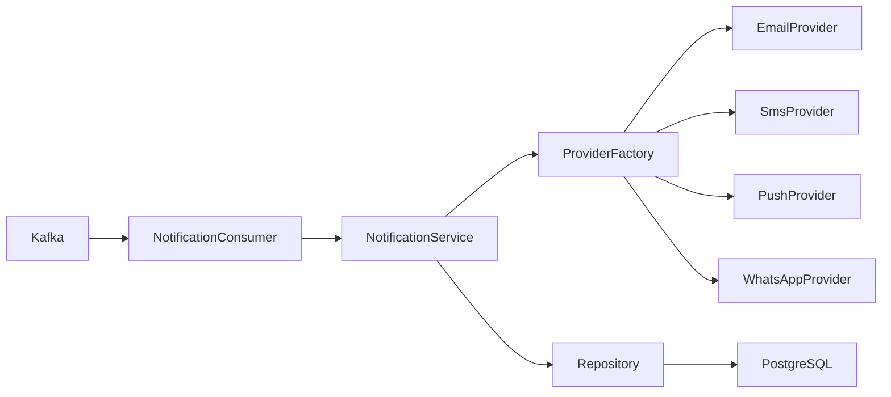
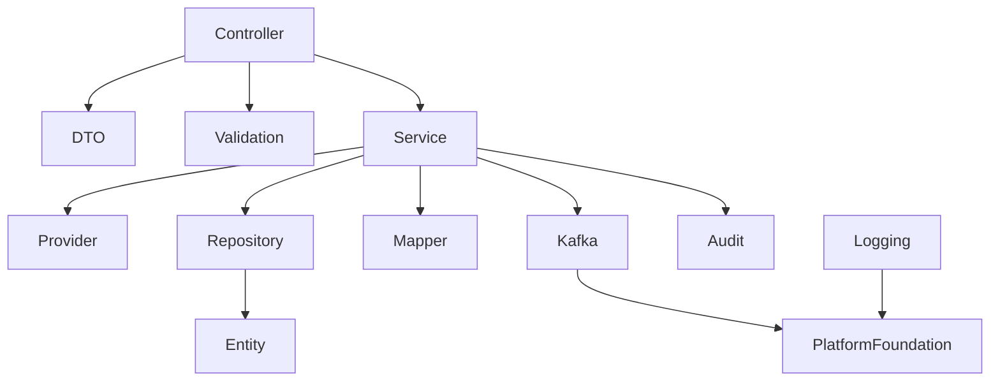
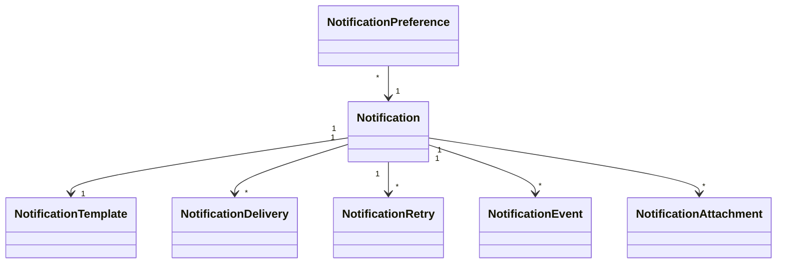

# LLD-010: Notification Service

# 1. Document Information

| Field | Value |
|--------|-------|
| Project | Distributed Hub & Sales (DHS) Platform |
| Service | Notification Service |
| Document | Low Level Design |
| Document ID | LLD-010 |
| Repository | starone-dhs-platform |
| Module | notification-service |
| Version | v1.0.0 |
| Status | Draft |
| Standard | IEEE 1016 |
| Owner | Enterprise Architecture |

---

# 2. Purpose

This document defines the implementation-level architecture of the Notification Service.

The Notification Service is responsible for enterprise notification orchestration including Email, SMS, Push Notifications, WhatsApp notifications, In-App notifications, template management, notification preferences, retry management, delivery tracking, and notification event publishing.

This document implements the requirements defined in **SRS-010 – Notification Service**.

---

# 3. Scope

The Notification Service provides

- Email Notifications
- SMS Notifications
- Push Notifications
- WhatsApp Notifications
- In-App Notifications
- Notification Templates
- Notification Preferences
- Notification Queue
- Retry Management
- Delivery Tracking
- Notification Event Publishing

Notification Service shall not own

- Customer Master
- User Master
- Order Master
- Billing
- Authentication
- Third-party Provider Accounts

Notification Service consumes business events and delivers notifications.

---

# 4. Design Principles

## NOT-DP-001

Notification delivery shall be asynchronous.

---

## NOT-DP-002

Templates shall be reusable.

---

## NOT-DP-003

Notification channels shall be pluggable.

---

## NOT-DP-004

Notification retries shall be automatic.

---

## NOT-DP-005

Delivery status shall be fully traceable.

---

## NOT-DP-006

Infrastructure concerns shall reuse Platform Foundation.

---

# 5. Package Structure

```text
notification-service
│
├── config
├── controller
├── service
├── repository
├── entity
├── dto
├── mapper
├── validation
├── kafka
├── provider
├── template
├── exception
├── audit
├── scheduler
├── util
└── client
```

---

# 6. Maven Module Structure

```text
notification-service
│
├── api
├── application
├── domain
├── infrastructure
└── bootstrap
```

---

# 7. Layered Architecture

```text
REST API

↓

Controller

↓

Application Service

↓

Notification Engine

↓

Repository

↓

PostgreSQL
```

Platform Foundation provides

- Security
- Logging
- Validation
- Kafka
- OpenFeign
- Exception Handling
- Audit
- Observability

---

# 8. Package Design

## controller

```text
controller
│
├── NotificationController
├── EmailController
├── SmsController
├── PushNotificationController
├── WhatsAppController
├── TemplateController
├── PreferenceController
└── NotificationSearchController
```

---

## service

```text
service
│
├── NotificationService
├── EmailService
├── SmsService
├── PushNotificationService
├── WhatsAppService
├── TemplateService
├── PreferenceService
├── DeliveryTrackingService
├── NotificationSearchService
├── NotificationValidationService
└── NotificationAuditService
```

---

## repository

```text
repository
│
├── NotificationRepository
├── TemplateRepository
├── PreferenceRepository
├── DeliveryRepository
├── RetryRepository
├── NotificationEventRepository
└── NotificationAuditRepository
```

---

## entity

```text
entity
│
├── Notification
├── NotificationTemplate
├── NotificationPreference
├── NotificationDelivery
├── NotificationRetry
├── NotificationEvent
├── NotificationAudit
└── NotificationAttachment
```

---

## provider

```text
provider
│
├── EmailProvider
├── SmsProvider
├── PushProvider
├── WhatsAppProvider
└── ProviderFactory
```

---

## dto

```text
dto
│
├── request
├── response
└── event
```

---

## kafka

```text
kafka
│
├── producer
├── consumer
└── configuration
```

---

# 9. Component Diagram



---

# 10. Package Dependency Diagram



---

# 11. Domain Responsibilities

| Component | Responsibility |
|------------|----------------|
| Notification | Notification Lifecycle |
| Template | Template Management |
| Preference | User Preferences |
| Delivery | Delivery Tracking |
| Retry | Retry Processing |
| Provider | Channel Integration |
| Event | Notification Events |
| Attachment | Attachments |

---

# 12. Service Boundaries

Notification Service owns

- Notification
- Templates
- Preferences
- Delivery Status
- Retry Queue
- Provider Integrations

Notification Service does not own

- Customer Master
- User Master
- Authentication
- Orders
- Billing
- Supplier

Other services shall publish Kafka events for notification processing.

---

# 13. Architecture Constraints

- Controllers shall remain stateless.
- Controllers shall never access repositories directly.
- Services shall contain business logic.
- Notification delivery shall be asynchronous.
- Repository layer shall contain persistence only.
- Templates shall be version controlled.
- Provider implementations shall be pluggable.
- Retry mechanism shall be configurable.
- DTOs shall never expose entities.
- Kafka events shall publish after successful transaction commit.
- All entities shall extend AuditableEntity.
- APIs shall return ApiResponse<T>.

---

# 14. Class Design

The Notification Service shall implement classes for notification orchestration, template management, provider abstraction, retry management, delivery tracking, user preferences, and notification search.

The implementation shall follow Layered Architecture and Domain-Driven Design (DDD).

---

# 15. Controller Layer Design

The Controller layer shall expose REST APIs and delegate business processing to the Service layer.

Controllers shall remain stateless.

## Package Structure

```text
controller
│
├── NotificationController
├── EmailController
├── SmsController
├── PushNotificationController
├── WhatsAppController
├── TemplateController
├── PreferenceController
└── NotificationSearchController
```

---

## NotificationController

### Responsibilities

- Send Notification
- Get Notification
- Cancel Notification
- Retry Notification
- Notification Status

### APIs

```text
POST   /api/v1/notifications

GET    /api/v1/notifications/{notificationId}

PUT    /api/v1/notifications/{notificationId}/retry

PUT    /api/v1/notifications/{notificationId}/cancel

GET    /api/v1/notifications/{notificationId}/status
```

---

## EmailController

Responsibilities

- Send Email
- Email Status
- Email Preview

---

## SmsController

Responsibilities

- Send SMS
- SMS Status

---

## PushNotificationController

Responsibilities

- Send Push Notification
- Push Status

---

## WhatsAppController

Responsibilities

- Send WhatsApp Message
- WhatsApp Status

---

## TemplateController

Responsibilities

- Create Template
- Update Template
- Publish Template
- Template Search

---

## PreferenceController

Responsibilities

- Create Preferences
- Update Preferences
- Notification Opt-In
- Notification Opt-Out

---

## NotificationSearchController

Responsibilities

- Search Notifications
- Search Delivery History
- Search Failures

---

# 16. Service Layer Design

Business logic shall reside in the Service layer.

## Package Structure

```text
service
│
├── NotificationService
├── EmailService
├── SmsService
├── PushNotificationService
├── WhatsAppService
├── TemplateService
├── PreferenceService
├── DeliveryTrackingService
├── RetryService
├── NotificationSearchService
├── NotificationValidationService
└── NotificationAuditService
```

---

## NotificationService

### Responsibilities

- Send Notification
- Cancel Notification
- Retry Notification
- Notification Status

### Public Methods

```java
sendNotification()

cancelNotification()

retryNotification()

getNotification()

getNotificationStatus()
```

---

## EmailService

Responsibilities

- Email Rendering
- Email Delivery
- Attachment Processing

---

## SmsService

Responsibilities

- SMS Delivery
- SMS Status Tracking

---

## PushNotificationService

Responsibilities

- Push Delivery
- Device Token Validation

---

## WhatsAppService

Responsibilities

- WhatsApp Delivery
- Media Messages

---

## TemplateService

Responsibilities

- Template CRUD
- Template Versioning
- Template Rendering

---

## PreferenceService

Responsibilities

- User Preferences
- Subscription Management

---

## DeliveryTrackingService

Responsibilities

- Delivery Tracking
- Provider Response Processing

---

## RetryService

Responsibilities

- Retry Scheduling
- Exponential Backoff
- Dead Letter Queue Handling

---

## NotificationSearchService

Responsibilities

- Search
- Filtering
- Pagination
- Sorting

---

# 17. Repository Layer Design

Repositories shall encapsulate persistence logic only.

## Package Structure

```text
repository
│
├── NotificationRepository
├── NotificationTemplateRepository
├── NotificationPreferenceRepository
├── NotificationDeliveryRepository
├── NotificationRetryRepository
├── NotificationEventRepository
└── NotificationAuditRepository
```

---

## Repository Responsibilities

| Repository | Responsibility |
|------------|----------------|
| NotificationRepository | Notification Master |
| NotificationTemplateRepository | Templates |
| NotificationPreferenceRepository | User Preferences |
| NotificationDeliveryRepository | Delivery Tracking |
| NotificationRetryRepository | Retry Queue |
| NotificationEventRepository | Notification Events |
| NotificationAuditRepository | Audit Records |

---

# 18. DTO Design

## Request DTOs

```text
dto.request
│
├── SendNotificationRequest
├── EmailRequest
├── SmsRequest
├── PushNotificationRequest
├── WhatsAppRequest
├── NotificationTemplateRequest
├── NotificationPreferenceRequest
└── NotificationSearchRequest
```

---

## Response DTOs

```text
dto.response
│
├── NotificationResponse
├── EmailResponse
├── SmsResponse
├── PushNotificationResponse
├── WhatsAppResponse
├── TemplateResponse
├── PreferenceResponse
└── NotificationDeliveryResponse
```

---

## NotificationResponse

| Field | Type |
|---------|------|
| notificationId | UUID |
| notificationType | NotificationType |
| channel | NotificationChannel |
| recipient | String |
| templateId | UUID |
| notificationStatus | NotificationStatus |
| scheduledAt | Instant |
| deliveredAt | Instant |

---

# 19. Entity Design

All entities shall extend **AuditableEntity**.

---

## Package Structure

```text
entity
│
├── Notification
├── NotificationTemplate
├── NotificationPreference
├── NotificationDelivery
├── NotificationRetry
├── NotificationEvent
├── NotificationAttachment
└── NotificationAudit
```

---

## Notification

| Attribute | Type |
|------------|------|
| id | UUID |
| notificationType | NotificationType |
| channel | NotificationChannel |
| recipient | String |
| templateId | UUID |
| subject | String |
| notificationStatus | NotificationStatus |
| scheduledAt | Instant |
| deliveredAt | Instant |

---

## NotificationTemplate

| Attribute | Type |
|------------|------|
| id | UUID |
| templateCode | String |
| templateName | String |
| channel | NotificationChannel |
| subject | String |
| body | Text |
| version | Integer |
| status | TemplateStatus |

---

## NotificationPreference

| Attribute | Type |
|------------|------|
| id | UUID |
| userId | UUID |
| emailEnabled | Boolean |
| smsEnabled | Boolean |
| pushEnabled | Boolean |
| whatsappEnabled | Boolean |

---

## NotificationDelivery

| Attribute | Type |
|------------|------|
| id | UUID |
| notificationId | UUID |
| provider | String |
| providerMessageId | String |
| deliveryStatus | DeliveryStatus |
| deliveredAt | Instant |

---

## NotificationRetry

| Attribute | Type |
|------------|------|
| id | UUID |
| notificationId | UUID |
| retryCount | Integer |
| nextRetryAt | Instant |
| retryStatus | RetryStatus |

---

## NotificationEvent

| Attribute | Type |
|------------|------|
| id | UUID |
| notificationId | UUID |
| eventType | String |
| eventTime | Instant |
| remarks | String |

---

## NotificationAttachment

| Attribute | Type |
|------------|------|
| id | UUID |
| notificationId | UUID |
| fileName | String |
| contentType | String |
| storagePath | String |

---

# 20. Mapper Design

MapStruct shall be the standard mapping framework.

## Package Structure

```text
mapper
│
├── NotificationMapper
├── NotificationTemplateMapper
├── NotificationPreferenceMapper
├── NotificationDeliveryMapper
├── NotificationRetryMapper
├── NotificationEventMapper
└── NotificationAttachmentMapper
```

---

## Responsibilities

- DTO → Entity
- Entity → DTO
- Partial Updates
- Page Mapping

---

# 21. Validation Design

## Package Structure

```text
validation
│
├── annotation
├── validator
└── groups
```

---

## Validators

```text
NotificationValidator

TemplateValidator

PreferenceValidator

DeliveryValidator

RetryValidator

AttachmentValidator
```

---

## Validation Rules

| Validator | Purpose |
|------------|----------|
| NotificationValidator | Notification Validation |
| TemplateValidator | Template Validation |
| PreferenceValidator | Preference Validation |
| DeliveryValidator | Delivery Validation |
| RetryValidator | Retry Policy Validation |
| AttachmentValidator | Attachment Validation |

---

# 22. Exception Hierarchy

```text
RuntimeException
        │
        └── PlatformException
                │
                ├── NotificationNotFoundException
                ├── TemplateNotFoundException
                ├── DuplicateTemplateException
                ├── InvalidChannelException
                ├── DeliveryFailedException
                ├── RetryLimitExceededException
                ├── ProviderUnavailableException
                ├── NotificationPreferenceException
                └── AttachmentUploadException
```

---

# 23. Notification Processing Flow

```mermaid
sequenceDiagram

Kafka->>NotificationService: Notification Event

NotificationService->>TemplateService

TemplateService-->>NotificationService

NotificationService->>ProviderFactory

ProviderFactory-->>NotificationService

NotificationService->>NotificationRepository

NotificationService->>KafkaPublisher
```

---

# 24. Email Delivery Flow

```mermaid
sequenceDiagram

NotificationService->>EmailService

EmailService->>EmailProvider

EmailProvider-->>EmailService

EmailService->>DeliveryRepository

EmailService-->>NotificationService
```

---

# 25. SMS Delivery Flow

```mermaid
sequenceDiagram

NotificationService->>SmsService

SmsService->>SmsProvider

SmsProvider-->>SmsService

SmsService->>DeliveryRepository

SmsService-->>NotificationService
```

---

# 26. Retry Flow

```mermaid
sequenceDiagram

RetryScheduler->>RetryService

RetryService->>ProviderFactory

ProviderFactory-->>RetryService

RetryService->>NotificationRepository

RetryService-->>RetryScheduler
```

---

# 27. Template Rendering Flow

```mermaid
sequenceDiagram

NotificationService->>TemplateService

TemplateService->>TemplateRepository

TemplateRepository-->>TemplateService

TemplateService-->>NotificationService
```

---

# 28. Class Diagram



---

# 29. Design Constraints

- Notification delivery shall always be asynchronous.
- Template versions shall be immutable after publishing.
- Notification channels shall use provider abstraction.
- Retry execution shall follow configurable retry policies.
- Delivery tracking shall record every provider response.
- Controllers shall remain stateless.
- Services shall contain all business logic.
- Repository layer shall contain persistence only.
- Kafka events shall publish after successful transaction commit.
- DTOs shall never expose JPA entities.
- All entities shall extend `AuditableEntity`.
- APIs shall return `ApiResponse<T>`.

---

# 30. Security Configuration

The Notification Service shall inherit the enterprise security framework from the Platform Foundation.

Authentication shall be delegated to the Identity Service.

Authorization shall be enforced using Role-Based Access Control (RBAC).

---

## 30.1 Security Architecture

```text
Client

↓

API Gateway

↓

JWT Authentication Filter

↓

Authorization Filter

↓

Notification Controller

↓

Notification Service
```

---

## 30.2 Security Components

```text
security
│
├── config
│   ├── SecurityConfiguration
│   ├── MethodSecurityConfiguration
│   └── CorsConfiguration
│
├── filter
│   ├── JwtAuthenticationFilter
│   ├── AuthorizationFilter
│   └── CorrelationIdFilter
│
├── permission
│   ├── NotificationPermissionEvaluator
│   └── NotificationAccessValidator
│
└── annotation
    └── RequireNotificationPermission
```

---

## 30.3 Permissions

| Permission | Description |
|------------|-------------|
| NOTIFICATION_SEND | Send Notification |
| NOTIFICATION_VIEW | View Notification |
| NOTIFICATION_CANCEL | Cancel Notification |
| NOTIFICATION_RETRY | Retry Notification |
| TEMPLATE_CREATE | Create Template |
| TEMPLATE_UPDATE | Update Template |
| TEMPLATE_PUBLISH | Publish Template |
| PREFERENCE_MANAGE | Manage Preferences |
| DELIVERY_VIEW | View Delivery Status |
| NOTIFICATION_SEARCH | Search Notifications |

---

## 30.4 Authorization Flow

```mermaid
sequenceDiagram

Client->>Gateway: JWT

Gateway->>Identity Service: Validate Token

Identity Service-->>Gateway: Claims

Gateway->>Notification Service

Notification Service->>PermissionEvaluator

PermissionEvaluator-->>Notification Service

Notification Service-->>Client
```

---

# 31. JWT Implementation

JWT validation shall be handled by Platform Foundation.

Notification Service shall consume authenticated user information from Spring Security.

---

## Required Claims

```json
{
  "sub":"UUID",
  "username":"notification.admin",
  "roles":["NOTIFICATION_ADMIN"],
  "permissions":[
      "NOTIFICATION_SEND",
      "TEMPLATE_PUBLISH"
  ],
  "tenantId":"UUID",
  "branchId":"UUID"
}
```

---

## User Context

Every request shall expose

```text
UserId

Username

Roles

Permissions

TenantId

BranchId

CorrelationId
```

---

# 32. Authorization Design

Permission-based authorization shall be implemented.

---

## Example

```java
@PreAuthorize("hasAuthority('NOTIFICATION_SEND')")
```

or

```java
@RequireNotificationPermission("NOTIFICATION_SEND")
```

---

## Permission Matrix

| API | Permission |
|-----|------------|
| Send Notification | NOTIFICATION_SEND |
| View Notification | NOTIFICATION_VIEW |
| Cancel Notification | NOTIFICATION_CANCEL |
| Retry Notification | NOTIFICATION_RETRY |
| Create Template | TEMPLATE_CREATE |
| Update Template | TEMPLATE_UPDATE |
| Publish Template | TEMPLATE_PUBLISH |
| Manage Preferences | PREFERENCE_MANAGE |
| View Delivery Status | DELIVERY_VIEW |
| Search Notifications | NOTIFICATION_SEARCH |

---

# 33. Kafka Design

Notification Service shall publish notification lifecycle events.

---

## Published Topics

```text
notification.created.v1

notification.queued.v1

notification.sent.v1

notification.delivered.v1

notification.failed.v1

notification.retry.started.v1

notification.retry.completed.v1

notification.cancelled.v1

notification.template.created.v1

notification.template.updated.v1

notification.template.published.v1

notification.preference.updated.v1
```

---

## Consumed Topics

```text
order.confirmed.v1

order.cancelled.v1

invoice.generated.v1

invoice.paid.v1

shipment.dispatched.v1

shipment.delivered.v1

supplier.created.v1

customer.created.v1

returns.completed.v1
```

---

## Kafka Package

```text
kafka
│
├── producer
├── consumer
├── configuration
├── mapper
└── event
```

---

## Event Envelope

```json
{
  "eventId":"UUID",
  "eventType":"NotificationDelivered",
  "eventVersion":"1.0",
  "occurredAt":"2026-06-27T10:00:00Z",
  "correlationId":"UUID",
  "payload":{}
}
```

---

# 34. OpenFeign Design

Notification Service shall use synchronous communication only where immediate validation is required.

---

## Feign Clients

```text
client
│
├── CustomerClient
├── IdentityClient
├── TemplateClient
├── AuditClient
└── FileStorageClient
```

---

## Responsibilities

| Client | Responsibility |
|----------|----------------|
| CustomerClient | Recipient Validation |
| IdentityClient | User Lookup |
| TemplateClient | Shared Template Validation |
| AuditClient | Audit Submission |
| FileStorageClient | Attachment Retrieval |

---

# 35. Configuration Classes

```text
config
│
├── SecurityConfiguration
├── KafkaConfiguration
├── FeignConfiguration
├── CacheConfiguration
├── JacksonConfiguration
├── ValidationConfiguration
├── SchedulerConfiguration
├── MetricsConfiguration
├── ProviderConfiguration
└── OpenApiConfiguration
```

---

## Responsibilities

| Configuration | Responsibility |
|---------------|----------------|
| Security | Spring Security |
| Kafka | Kafka Infrastructure |
| Feign | OpenFeign |
| Cache | Redis |
| Validation | Bean Validation |
| Scheduler | Background Jobs |
| Metrics | Micrometer |
| Provider | Provider Registration |
| OpenAPI | Swagger |

---

# 36. Transaction Design

Notification transactions shall remain local.

Notification delivery shall be asynchronous through Kafka consumers.

---

## Transaction Types

| Operation | Propagation |
|------------|-------------|
| Create Notification | REQUIRED |
| Template Update | REQUIRED |
| Preference Update | REQUIRED |
| Delivery Status Update | REQUIRED |
| Retry Scheduling | REQUIRED |
| Publish Event | AFTER_COMMIT |

---

## Transaction Flow

```mermaid
flowchart LR

Kafka Consumer

-->

NotificationService

-->

Repository

-->

Commit

-->

Kafka Publish
```

---

# 37. Cache Design

Redis shall cache frequently accessed notification metadata.

---

## Cached Objects

```text
Notification Templates

Notification Preferences

Provider Configuration

Delivery Summary

Notification Dashboard
```

---

## Cache Annotations

```java
@Cacheable

@CachePut

@CacheEvict
```

---

# 38. Resilience Patterns

Notification Service shall implement Resilience4j.

---

## Retry

Email Provider

SMS Provider

Push Provider

WhatsApp Provider

---

## Circuit Breaker

Email Provider

SMS Provider

Push Provider

WhatsApp Provider

File Storage

---

## Bulkhead

Provider Integrations

---

## Rate Limiter

Notification API

Template API

---

## Timeout

All Provider Clients

---

# 39. Scheduler Design

Scheduled jobs shall support notification processing.

---

## Scheduled Jobs

```text
scheduler
│
├── NotificationRetryScheduler
├── FailedDeliveryScheduler
├── TemplateCacheRefreshScheduler
├── DeliveryCleanupScheduler
├── DeadLetterQueueScheduler
└── AuditCleanupScheduler
```

---

# 40. External Integration Design

| Service | Purpose |
|----------|---------|
| Customer Service | Recipient Lookup |
| Identity Service | User Lookup |
| Audit Service | Audit Logging |
| File Storage Service | Attachment Retrieval |
| Reporting Service | Notification Analytics |
| Email Provider | Email Delivery |
| SMS Provider | SMS Delivery |
| Push Provider | Push Delivery |
| WhatsApp Provider | WhatsApp Delivery |

---

# 41. Configuration Properties

| Property | Default |
|----------|----------|
| notification.retry.enabled | true |
| notification.retry.max-attempts | 5 |
| notification.cache.ttl | 3600 |
| notification.provider.timeout | 30s |
| notification.kafka.retry | 3 |

---

# 42. Data Consistency Strategy

- Template Code shall remain unique.
- Published templates shall be immutable.
- Every notification shall reference one template version.
- Delivery status shall record every provider response.
- Retry execution shall update retry count atomically.
- Kafka events shall publish only after successful transaction commit.

---

# 43. Performance Considerations

- Template rendering shall use Redis caching.
- Preferences shall be cached.
- Bulk notification processing shall be asynchronous.
- Delivery status updates shall execute asynchronously.
- Search shall support pagination.

---

# 44. Design Constraints

- Notification delivery shall always be asynchronous.
- Template versions shall remain immutable after publication.
- JWT authentication shall be mandatory.
- Authorization shall be permission-based.
- Repository layer shall never invoke external services.
- Configuration shall be externalized.
- Kafka events shall publish after successful transaction commit.
- Correlation ID shall propagate across outbound requests.

---

# 45. Technology Standards

| Concern | Technology |
|----------|------------|
| Java | Java 21 |
| Framework | Spring Boot 3.x |
| Security | Spring Security 6 |
| Authentication | JWT |
| Authorization | RBAC |
| Database | PostgreSQL |
| Cache | Redis |
| Messaging | Apache Kafka |
| Service Calls | OpenFeign |
| Validation | Jakarta Bean Validation |
| Mapping | MapStruct |
| Logging | SLF4J + Logback |
| Metrics | Micrometer |
| Tracing | OpenTelemetry |
| Service Discovery | Eureka |

---

# 46. Logging Design

The Notification Service shall implement centralized structured logging using the Platform Foundation logging framework.

Every notification request, template rendering, provider interaction, retry execution, delivery confirmation, and external integration shall be logged using standardized MDC attributes.

---

## 46.1 Logging Architecture

```text
REST Request

↓

Correlation Filter

↓

Logging Aspect

↓

SLF4J

↓

Logback

↓

ELK / OpenSearch / Splunk
```

---

## 46.2 Log Levels

| Level | Purpose |
|---------|---------|
| TRACE | Framework Diagnostics |
| DEBUG | Development |
| INFO | Business Events |
| WARN | Recoverable Delivery Errors |
| ERROR | Provider/System Failures |

---

## 46.3 MDC Context

Every log entry shall include

```text
Correlation ID

Trace ID

Span ID

Notification ID

Template ID

Recipient

Channel

Provider

Tenant ID

Branch ID

User ID

Request URI

HTTP Method

Service Name

Environment
```

---

## 46.4 Business Events

The following operations shall always be logged.

- Notification Created
- Notification Queued
- Template Rendered
- Email Sent
- SMS Sent
- Push Notification Sent
- WhatsApp Message Sent
- Delivery Confirmed
- Delivery Failed
- Retry Scheduled
- Retry Executed
- Retry Exhausted
- Dead Letter Queue Entry
- Preference Updated

---

## 46.5 Sensitive Data

The following shall never be logged.

- JWT Tokens
- Authorization Headers
- OTP Codes
- Email Body
- SMS Body
- WhatsApp Content
- Push Payload
- API Keys
- Provider Secrets
- Encryption Keys

---

# 47. Observability

Notification Service shall expose operational metrics using Micrometer.

---

## JVM Metrics

- Heap Usage
- CPU Usage
- Thread Count
- Garbage Collection

---

## Business Metrics

- Notifications Created
- Notifications Delivered
- Notifications Failed
- Email Success Rate
- SMS Success Rate
- Push Success Rate
- WhatsApp Success Rate
- Retry Count
- Dead Letter Queue Count
- Template Usage

---

## Infrastructure Metrics

- Database Connections
- Kafka Publish Rate
- Kafka Consumer Lag
- Redis Cache Hit Ratio
- Provider Response Time
- API Response Time

---

# 48. Distributed Tracing

Every notification workflow shall propagate distributed tracing metadata.

---

## Trace Flow

```mermaid
sequenceDiagram

Business Service->>Kafka

Kafka->>Notification Service

Notification Service->>Template Service

Notification Service->>Provider

Provider-->>Notification Service

Notification Service-->>Kafka
```

---

## Trace Context

Every request shall propagate

- Correlation ID
- Trace ID
- Span ID

---

# 49. Health Checks

Notification Service shall expose Spring Boot Actuator endpoints.

---

## Health

```text
GET /actuator/health
```

---

## Liveness

```text
GET /actuator/health/liveness
```

---

## Readiness

```text
GET /actuator/health/readiness
```

Dependencies

- PostgreSQL
- Redis
- Kafka
- Config Server
- Provider Connectivity

---

## Metrics

```text
GET /actuator/metrics
```

---

## Prometheus

```text
GET /actuator/prometheus
```

---

# 50. Deployment Design

Notification Service shall be deployed as an independent containerized microservice.

---

## Deployment Architecture

```text
Gateway

↓

Notification Service

↓

PostgreSQL

↓

Redis

↓

Kafka

↓

Notification Providers
```

---

## Kubernetes Resources

```text
Deployment

Service

Ingress

ConfigMap

Secret

HorizontalPodAutoscaler

ServiceMonitor

PodDisruptionBudget
```

---

# 51. Dependency Management

Notification Service shall inherit the Platform Foundation BOM.

```xml
<dependencyManagement>

<dependency>

<groupId>com.starone</groupId>

<artifactId>platform-foundation-bom</artifactId>

</dependency>

</dependencyManagement>
```

---

## Primary Dependencies

- Spring Boot
- Spring Security
- Spring Data JPA
- Spring Kafka
- Spring Validation
- PostgreSQL Driver
- Redis
- OpenFeign
- Micrometer
- OpenTelemetry
- MapStruct
- Lombok

---

# 52. Coding Standards

Notification Service shall comply with enterprise coding standards.

---

## Controller

- Stateless
- Validation Only
- No Business Logic

---

## Service

- Stateless
- Business Orchestration
- Channel Independent

---

## Provider

- Single Responsibility
- Pluggable
- Idempotent

---

## Repository

- Persistence Only
- No Provider Calls

---

## DTO

- Immutable
- Validation Annotations

---

## Entity

- Extend AuditableEntity
- Never Exposed Directly

---

# 53. Package Naming Standards

```text
com.starone.notification

├── controller
├── service
├── repository
├── entity
├── dto
├── mapper
├── validation
├── provider
├── template
├── config
├── kafka
├── exception
├── scheduler
├── audit
├── util
└── client
```

---

# 54. Testing Strategy

## Unit Testing

Framework

```text
JUnit 5

Mockito
```

Coverage

```text
Minimum 90%
```

---

## Integration Testing

- Spring Boot Test
- Testcontainers
- Embedded Kafka

---

## API Testing

- REST Assured
- Spring MockMvc

---

## Provider Testing

- Email Provider
- SMS Provider
- Push Provider
- WhatsApp Provider
- Retry Processing
- Dead Letter Queue

---

## Performance Testing

- Bulk Notification Processing
- Template Rendering
- Provider Throughput
- Retry Performance
- Queue Processing

---

## Static Analysis

- SonarQube
- SpotBugs
- PMD
- Checkstyle

---

# 55. Build Validation

Every Pull Request shall verify

- Compilation
- Unit Tests
- Integration Tests
- Provider Tests
- Static Analysis
- Security Scan
- Dependency Scan
- Documentation Validation
- Code Coverage

---

# 56. Quality Gates

| Metric | Target |
|---------|--------|
| Unit Test Coverage | ≥90% |
| Integration Tests | 100% Pass |
| Provider Tests | 100% Pass |
| Critical Bugs | 0 |
| Critical Vulnerabilities | 0 |
| Code Duplication | <3% |
| Documentation | Mandatory |

---

# 57. Implementation Guidelines

Notification Service shall reuse Platform Foundation components.

Business code shall never duplicate

- JWT Security
- Logging
- Validation
- Kafka Infrastructure
- Exception Handling
- Audit Framework
- API Response Models
- Pagination Framework

Notification providers shall be selected using the Provider Factory.

Retry execution shall be asynchronous.

---

# 58. Extension Guidelines

Business-specific functionality shall extend Platform Foundation components where applicable.

Permitted extensions include

- AuditableEntity
- PlatformException
- ApiResponse
- BaseMapper
- AuditService
- ProviderFactory

Platform Foundation source code shall never be modified by Notification Service.

---

# 59. Design Checklist

Before implementation verify

- Template versioning implemented
- Provider Factory implemented
- Retry mechanism implemented
- Dead Letter Queue configured
- Delivery tracking implemented
- Preference validation enabled
- Controllers contain no business logic
- Services remain stateless
- Repository layer contains persistence only
- Kafka events publish after successful transaction commit
- Redis cache configured
- Correlation ID propagation enabled
- Health endpoints exposed
- Metrics published
- Configuration externalized
- Unit test coverage meets quality gates

---

# 60. Appendix A – Framework Versions

| Component | Version |
|------------|---------|
| Java | 21 |
| Spring Boot | 3.x |
| Spring Security | 6.x |
| Spring Cloud | 2025.x |
| PostgreSQL | Latest Supported |
| Redis | Latest Supported |
| Kafka | Latest Supported |
| OpenFeign | Latest Supported |
| Micrometer | Latest Supported |
| OpenTelemetry | Latest Supported |
| MapStruct | Latest Stable |
| Lombok | Latest Stable |
| JUnit | 5.x |

---

# 61. Appendix B – Layer Responsibility Matrix

| Layer | Responsibility |
|---------|----------------|
| Controller | Request Handling |
| Service | Notification Orchestration |
| Provider | Channel Delivery |
| Repository | Persistence |
| Kafka | Event Processing |
| Mapper | DTO Conversion |
| Validation | Request Validation |
| Audit | Notification Audit |

---

# 62. Appendix C – Notification Components

```text
NotificationController

EmailController

SmsController

PushNotificationController

WhatsAppController

TemplateController

PreferenceController

NotificationSearchController

NotificationService

EmailService

SmsService

PushNotificationService

WhatsAppService

TemplateService

PreferenceService

DeliveryTrackingService

RetryService

NotificationSearchService

NotificationRepository

NotificationTemplateRepository

NotificationPreferenceRepository

NotificationDeliveryRepository

NotificationRetryRepository

NotificationEventRepository
```

---

# 63. Appendix D – Notification Processing Summary

```text
Business Event

↓

Kafka Consumer

↓

Notification Service

↓

Template Engine

↓

Provider Factory

↓

Notification Provider

↓

Delivery Tracking

↓

Kafka Events

↓

Audit Events
```

---

# 64. Appendix E – Repository Responsibilities

| Repository | Responsibility |
|------------|----------------|
| starone-galaxy-architecture | Enterprise Standards, Governance & Architecture |
| starone-galaxy-central-config | Configuration Management |
| starone-galaxy-infra | Kubernetes, Infrastructure & CI/CD |
| starone-dhs-platform | Notification Service Implementation |

---

# 65. Conclusion

The Notification Service is the centralized communication component of the DHS platform, responsible for asynchronous multi-channel notification delivery across Email, SMS, Push Notifications, WhatsApp, and In-App messaging. It provides template management, provider abstraction, retry mechanisms, delivery tracking, user notification preferences, and event-driven processing while integrating with all business services through Kafka and leveraging the Platform Foundation for security, logging, observability, messaging, validation, and enterprise-wide cross-cutting concerns.

---

# End of Document