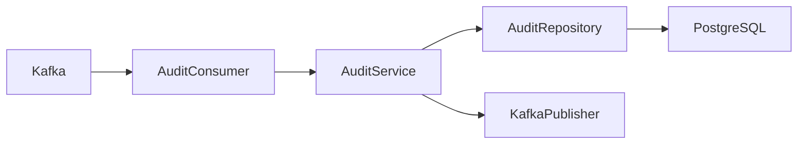
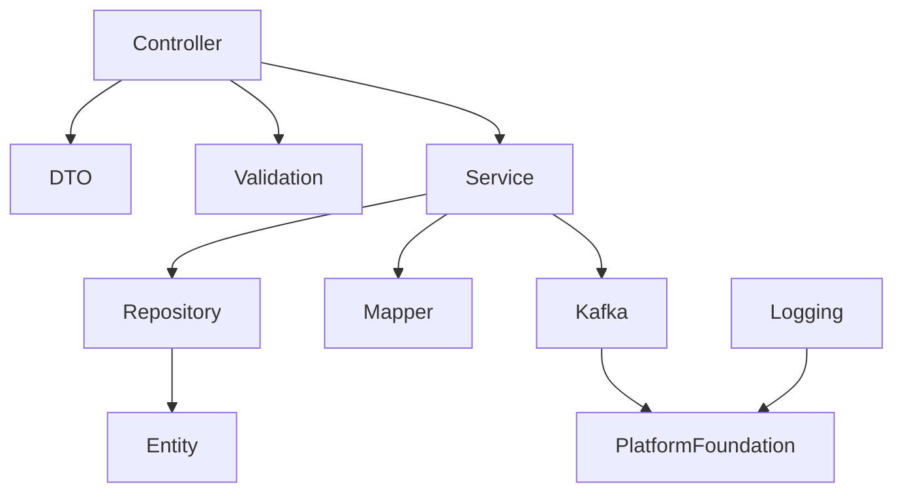
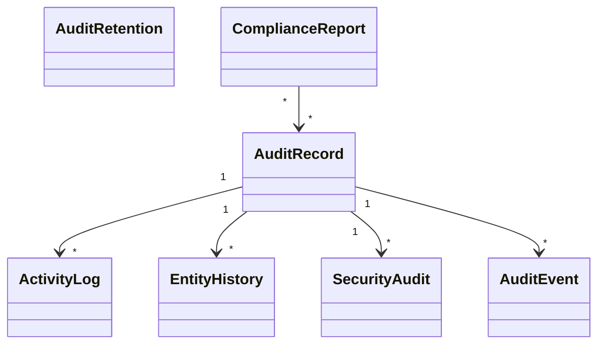

# LLD-011: Audit Service

# 1. Document Information

| Field | Value |
|--------|-------|
| Project | Distributed Hub & Sales (DHS) Platform |
| Service | Audit Service |
| Document | Low Level Design |
| Document ID | LLD-011 |
| Repository | starone-dhs-platform |
| Module | audit-service |
| Version | v1.0.0 |
| Status | Draft |
| Standard | IEEE 1016 |
| Owner | Enterprise Architecture |

---

# 2. Purpose

This document defines the implementation-level architecture of the Audit Service.

The Audit Service is responsible for centralized audit logging, business activity tracking, security auditing, entity change history, compliance reporting, audit search, retention management, and audit event publishing.

This document implements the requirements defined in **SRS-011 – Audit Service**.

---

# 3. Scope

The Audit Service provides

- Business Audit Logging
- Entity Change History
- User Activity Tracking
- Security Audit Logs
- API Audit Logs
- Login & Logout Auditing
- Audit Search
- Audit Reporting
- Retention Management
- Audit Event Publishing

Audit Service shall not own

- Business Transactions
- Orders
- Inventory
- Billing
- Customer Master
- Identity Authentication

Audit Service receives audit events from all DHS services.

---

# 4. Design Principles

## AUD-DP-001

Audit records shall be immutable.

---

## AUD-DP-002

Audit logging shall never block business transactions.

---

## AUD-DP-003

Audit events shall be processed asynchronously.

---

## AUD-DP-004

Every business event shall be traceable.

---

## AUD-DP-005

Audit retention shall follow configurable enterprise policies.

---

## AUD-DP-006

Infrastructure concerns shall reuse Platform Foundation.

---

# 5. Package Structure

```text
audit-service
│
├── config
├── controller
├── service
├── repository
├── entity
├── dto
├── mapper
├── validation
├── kafka
├── retention
├── exception
├── scheduler
├── util
└── client
```

---

# 6. Maven Module Structure

```text
audit-service
│
├── api
├── application
├── domain
├── infrastructure
└── bootstrap
```

---

# 7. Layered Architecture

```text
Kafka / REST

↓

Controller

↓

Application Service

↓

Audit Engine

↓

Repository

↓

PostgreSQL
```

Platform Foundation provides

- Security
- Logging
- Validation
- Kafka
- OpenFeign
- Exception Handling
- Observability

---

# 8. Package Design

## controller

```text
controller
│
├── AuditController
├── ActivityController
├── SecurityAuditController
├── EntityHistoryController
├── AuditSearchController
├── RetentionController
└── ComplianceController
```

---

## service

```text
service
│
├── AuditService
├── ActivityService
├── SecurityAuditService
├── EntityHistoryService
├── AuditSearchService
├── ComplianceService
├── RetentionService
├── AuditValidationService
└── AuditReportService
```

---

## repository

```text
repository
│
├── AuditRepository
├── ActivityRepository
├── EntityHistoryRepository
├── SecurityAuditRepository
├── AuditRetentionRepository
├── ComplianceRepository
└── AuditEventRepository
```

---

## entity

```text
entity
│
├── AuditRecord
├── ActivityLog
├── EntityHistory
├── SecurityAudit
├── AuditRetention
├── ComplianceReport
├── AuditEvent
└── AuditAttachment
```

---

## dto

```text
dto
│
├── request
├── response
└── event
```

---

## kafka

```text
kafka
│
├── producer
├── consumer
└── configuration
```

---

# 9. Component Diagram



---

# 10. Package Dependency Diagram



---

# 11. Domain Responsibilities

| Component | Responsibility |
|------------|----------------|
| Audit Record | Immutable Audit Log |
| Activity Log | User Activities |
| Entity History | Entity Changes |
| Security Audit | Security Events |
| Compliance Report | Audit Reports |
| Retention | Retention Policies |
| Audit Event | Kafka Audit Events |
| Attachment | Supporting Evidence |

---

# 12. Service Boundaries

Audit Service owns

- Audit Records
- Activity Logs
- Entity History
- Security Audit Logs
- Compliance Reports
- Retention Metadata

Audit Service does not own

- Orders
- Inventory
- Billing
- Customer
- Identity
- Supplier

Business services shall publish audit events using Kafka.

---

# 13. Architecture Constraints

- Controllers shall remain stateless.
- Controllers shall never access repositories directly.
- Services shall contain business logic.
- Audit records shall be immutable.
- Repository layer shall contain persistence only.
- Audit processing shall be asynchronous.
- Retention shall be configurable.
- DTOs shall never expose entities.
- Kafka events shall publish after successful transaction commit.
- All entities shall extend AuditableEntity.
- APIs shall return ApiResponse<T>.

---

# 14. Class Design

The Audit Service shall implement classes for centralized audit logging, business activity tracking, entity history management, security auditing, compliance reporting, retention management, and audit search.

The implementation shall follow Layered Architecture and Domain-Driven Design (DDD).

---

# 15. Controller Layer Design

The Controller layer shall expose REST APIs and delegate business processing to the Service layer.

Controllers shall remain stateless.

## Package Structure

```text
controller
│
├── AuditController
├── ActivityController
├── EntityHistoryController
├── SecurityAuditController
├── ComplianceController
├── RetentionController
└── AuditSearchController
```

---

## AuditController

### Responsibilities

- View Audit Record
- Audit Summary
- Export Audit
- Audit Statistics

### APIs

```text
GET /api/v1/audits/{auditId}

GET /api/v1/audits

GET /api/v1/audits/statistics

POST /api/v1/audits/export
```

---

## ActivityController

Responsibilities

- User Activities
- Login History
- Business Activities

---

## EntityHistoryController

Responsibilities

- Entity Change History
- Entity Version History
- Change Comparison

---

## SecurityAuditController

Responsibilities

- Security Events
- Authentication Audit
- Authorization Audit

---

## ComplianceController

Responsibilities

- Compliance Reports
- Audit Reports
- Regulatory Reports

---

## RetentionController

Responsibilities

- Retention Policies
- Archive Audit
- Purge Expired Records

---

## AuditSearchController

Responsibilities

- Audit Search
- Advanced Filters
- Timeline Search

---

# 16. Service Layer Design

Business logic shall reside in the Service layer.

## Package Structure

```text
service
│
├── AuditService
├── ActivityService
├── EntityHistoryService
├── SecurityAuditService
├── ComplianceService
├── RetentionService
├── AuditSearchService
├── AuditValidationService
└── AuditReportService
```

---

## AuditService

### Responsibilities

- Process Audit Event
- Store Audit Record
- Retrieve Audit Record

### Public Methods

```java
createAudit()

getAudit()

searchAudit()

exportAudit()

getAuditStatistics()
```

---

## ActivityService

Responsibilities

- Track User Activity
- Record Business Activity
- Activity Timeline

---

## EntityHistoryService

Responsibilities

- Record Entity Changes
- Version Comparison
- Entity Timeline

---

## SecurityAuditService

Responsibilities

- Login Audit
- Access Audit
- Permission Audit
- Security Event Recording

---

## ComplianceService

Responsibilities

- Compliance Reports
- Regulatory Reports
- Audit Reports

---

## RetentionService

Responsibilities

- Archive Records
- Purge Expired Records
- Retention Validation

---

## AuditSearchService

Responsibilities

- Search
- Filtering
- Pagination
- Sorting

---

# 17. Repository Layer Design

Repositories shall encapsulate persistence logic only.

## Package Structure

```text
repository
│
├── AuditRepository
├── ActivityRepository
├── EntityHistoryRepository
├── SecurityAuditRepository
├── AuditRetentionRepository
├── ComplianceRepository
└── AuditEventRepository
```

---

## Repository Responsibilities

| Repository | Responsibility |
|------------|----------------|
| AuditRepository | Audit Records |
| ActivityRepository | Activity Logs |
| EntityHistoryRepository | Entity History |
| SecurityAuditRepository | Security Audit |
| AuditRetentionRepository | Retention Metadata |
| ComplianceRepository | Compliance Reports |
| AuditEventRepository | Audit Events |

---

# 18. DTO Design

## Request DTOs

```text
dto.request
│
├── AuditSearchRequest
├── ActivitySearchRequest
├── EntityHistoryRequest
├── SecurityAuditSearchRequest
├── ComplianceReportRequest
├── RetentionPolicyRequest
└── AuditExportRequest
```

---

## Response DTOs

```text
dto.response
│
├── AuditResponse
├── ActivityResponse
├── EntityHistoryResponse
├── SecurityAuditResponse
├── ComplianceReportResponse
├── RetentionResponse
└── AuditStatisticsResponse
```

---

## AuditResponse

| Field | Type |
|---------|------|
| auditId | UUID |
| eventType | String |
| entityName | String |
| entityId | UUID |
| operation | String |
| performedBy | UUID |
| eventTimestamp | Instant |
| correlationId | String |

---

# 19. Entity Design

All entities shall extend **AuditableEntity**.

---

## Package Structure

```text
entity
│
├── AuditRecord
├── ActivityLog
├── EntityHistory
├── SecurityAudit
├── AuditRetention
├── ComplianceReport
├── AuditEvent
└── AuditAttachment
```

---

## AuditRecord

| Attribute | Type |
|------------|------|
| id | UUID |
| eventType | String |
| entityName | String |
| entityId | UUID |
| operation | String |
| performedBy | UUID |
| correlationId | String |
| eventTimestamp | Instant |

---

## ActivityLog

| Attribute | Type |
|------------|------|
| id | UUID |
| userId | UUID |
| activityType | String |
| resourceName | String |
| activityTime | Instant |

---

## EntityHistory

| Attribute | Type |
|------------|------|
| id | UUID |
| entityName | String |
| entityId | UUID |
| version | Integer |
| changeSummary | String |
| changedAt | Instant |

---

## SecurityAudit

| Attribute | Type |
|------------|------|
| id | UUID |
| eventType | String |
| username | String |
| ipAddress | String |
| deviceInfo | String |
| occurredAt | Instant |

---

## AuditRetention

| Attribute | Type |
|------------|------|
| id | UUID |
| retentionPolicy | String |
| retentionPeriod | Integer |
| archiveDate | Instant |
| purgeDate | Instant |

---

## ComplianceReport

| Attribute | Type |
|------------|------|
| id | UUID |
| reportName | String |
| generatedBy | UUID |
| generatedAt | Instant |
| reportStatus | ReportStatus |

---

## AuditEvent

| Attribute | Type |
|------------|------|
| id | UUID |
| sourceService | String |
| eventType | String |
| payloadReference | String |
| receivedAt | Instant |

---

# 20. Mapper Design

MapStruct shall be the standard mapping framework.

## Package Structure

```text
mapper
│
├── AuditMapper
├── ActivityMapper
├── EntityHistoryMapper
├── SecurityAuditMapper
├── ComplianceMapper
├── RetentionMapper
└── AuditEventMapper
```

---

## Responsibilities

- DTO → Entity
- Entity → DTO
- Partial Updates
- Page Mapping

---

# 21. Validation Design

## Package Structure

```text
validation
│
├── annotation
├── validator
└── groups
```

---

## Validators

```text
AuditValidator

ActivityValidator

EntityHistoryValidator

SecurityAuditValidator

ComplianceValidator

RetentionValidator
```

---

## Validation Rules

| Validator | Purpose |
|------------|----------|
| AuditValidator | Audit Validation |
| ActivityValidator | Activity Validation |
| EntityHistoryValidator | History Validation |
| SecurityAuditValidator | Security Validation |
| ComplianceValidator | Compliance Validation |
| RetentionValidator | Retention Policy Validation |

---

# 22. Exception Hierarchy

```text
RuntimeException
        │
        └── PlatformException
                │
                ├── AuditNotFoundException
                ├── AuditValidationException
                ├── EntityHistoryNotFoundException
                ├── SecurityAuditException
                ├── ComplianceReportException
                ├── RetentionPolicyException
                ├── AuditExportException
                ├── ImmutableAuditException
                └── AuditSearchException
```

---

# 23. Audit Processing Flow

```mermaid
sequenceDiagram

Business Service->>Kafka

Kafka->>AuditService

AuditService->>AuditRepository

AuditRepository-->>AuditService

AuditService->>KafkaPublisher
```

---

# 24. Activity Logging Flow

```mermaid
sequenceDiagram

Business Service->>ActivityService

ActivityService->>ActivityRepository

ActivityRepository-->>ActivityService
```

---

# 25. Entity History Flow

```mermaid
sequenceDiagram

Business Service->>EntityHistoryService

EntityHistoryService->>EntityHistoryRepository

EntityHistoryRepository-->>EntityHistoryService
```

---

# 26. Compliance Report Flow

```mermaid
sequenceDiagram

ComplianceController->>ComplianceService

ComplianceService->>ComplianceRepository

ComplianceRepository-->>ComplianceService

ComplianceService-->>ComplianceController
```

---

# 27. Audit Search Flow

```mermaid
sequenceDiagram

Client->>AuditSearchController

AuditSearchController->>AuditSearchService

AuditSearchService->>AuditRepository

AuditRepository-->>AuditSearchService

AuditSearchService-->>AuditSearchController
```

---

# 28. Class Diagram



---

# 29. Design Constraints

- Audit records shall be immutable.
- Audit processing shall never block business transactions.
- Entity history shall maintain version history.
- Security audit shall capture authentication and authorization events.
- Retention policy shall be configurable.
- Controllers shall remain stateless.
- Services shall contain all business logic.
- Repository layer shall contain persistence only.
- Kafka events shall publish after successful transaction commit.
- DTOs shall never expose JPA entities.
- All entities shall extend `AuditableEntity`.
- APIs shall return `ApiResponse<T>`.

---

# 30. Security Configuration

The Audit Service shall inherit the enterprise security framework from the Platform Foundation.

Authentication shall be delegated to the Identity Service.

Authorization shall be enforced using Role-Based Access Control (RBAC).

---

## 30.1 Security Architecture

```text
Client

↓

API Gateway

↓

JWT Authentication Filter

↓

Authorization Filter

↓

Audit Controller

↓

Audit Service
```

---

## 30.2 Security Components

```text
security
│
├── config
│   ├── SecurityConfiguration
│   ├── MethodSecurityConfiguration
│   └── CorsConfiguration
│
├── filter
│   ├── JwtAuthenticationFilter
│   ├── AuthorizationFilter
│   └── CorrelationIdFilter
│
├── permission
│   ├── AuditPermissionEvaluator
│   └── AuditAccessValidator
│
└── annotation
    └── RequireAuditPermission
```

---

## 30.3 Permissions

| Permission | Description |
|------------|-------------|
| AUDIT_VIEW | View Audit Records |
| AUDIT_SEARCH | Search Audit Records |
| AUDIT_EXPORT | Export Audit Data |
| ACTIVITY_VIEW | View User Activity |
| ENTITY_HISTORY_VIEW | View Entity History |
| SECURITY_AUDIT_VIEW | View Security Audit |
| COMPLIANCE_REPORT_VIEW | View Compliance Reports |
| RETENTION_MANAGE | Manage Retention Policies |
| AUDIT_STATISTICS | View Audit Statistics |

---

## 30.4 Authorization Flow

```mermaid
sequenceDiagram

Client->>Gateway: JWT

Gateway->>Identity Service: Validate Token

Identity Service-->>Gateway: Claims

Gateway->>Audit Service

Audit Service->>PermissionEvaluator

PermissionEvaluator-->>Audit Service

Audit Service-->>Client
```

---

# 31. JWT Implementation

JWT validation shall be handled by Platform Foundation.

Audit Service shall consume authenticated user information from Spring Security.

---

## Required Claims

```json
{
  "sub":"UUID",
  "username":"audit.admin",
  "roles":["AUDIT_ADMIN"],
  "permissions":[
      "AUDIT_VIEW",
      "AUDIT_EXPORT",
      "COMPLIANCE_REPORT_VIEW"
  ],
  "tenantId":"UUID",
  "branchId":"UUID"
}
```

---

## User Context

Every request shall expose

```text
UserId

Username

Roles

Permissions

TenantId

BranchId

CorrelationId
```

---

# 32. Authorization Design

Permission-based authorization shall be implemented.

---

## Example

```java
@PreAuthorize("hasAuthority('AUDIT_VIEW')")
```

or

```java
@RequireAuditPermission("AUDIT_VIEW")
```

---

## Permission Matrix

| API | Permission |
|-----|------------|
| View Audit | AUDIT_VIEW |
| Search Audit | AUDIT_SEARCH |
| Export Audit | AUDIT_EXPORT |
| View Activity | ACTIVITY_VIEW |
| View Entity History | ENTITY_HISTORY_VIEW |
| View Security Audit | SECURITY_AUDIT_VIEW |
| View Compliance Reports | COMPLIANCE_REPORT_VIEW |
| Manage Retention | RETENTION_MANAGE |
| View Statistics | AUDIT_STATISTICS |

---

# 33. Kafka Design

Audit Service shall consume audit events from all DHS services.

---

## Published Topics

```text
audit.record.created.v1

audit.retention.executed.v1

audit.export.completed.v1

audit.compliance.generated.v1
```

---

## Consumed Topics

```text
customer.audit.v1

branch.audit.v1

product.audit.v1

inventory.audit.v1

order.audit.v1

billing.audit.v1

dispatch.audit.v1

notification.audit.v1

supplier.audit.v1

procurement.audit.v1

returns.audit.v1

identity.audit.v1
```

---

## Kafka Package

```text
kafka
│
├── producer
├── consumer
├── configuration
├── mapper
└── event
```

---

## Event Envelope

```json
{
  "eventId":"UUID",
  "sourceService":"order-service",
  "eventType":"OrderCreated",
  "eventVersion":"1.0",
  "occurredAt":"2026-06-27T10:00:00Z",
  "correlationId":"UUID",
  "payload":{}
}
```

---

# 34. OpenFeign Design

Audit Service shall use synchronous communication only where metadata validation or report generation requires external information.

---

## Feign Clients

```text
client
│
├── IdentityClient
├── ReportingClient
├── FileStorageClient
└── ConfigurationClient
```

---

## Responsibilities

| Client | Responsibility |
|----------|----------------|
| IdentityClient | User Information |
| ReportingClient | Report Integration |
| FileStorageClient | Export Storage |
| ConfigurationClient | Retention Policies |

---

# 35. Configuration Classes

```text
config
│
├── SecurityConfiguration
├── KafkaConfiguration
├── FeignConfiguration
├── CacheConfiguration
├── JacksonConfiguration
├── ValidationConfiguration
├── SchedulerConfiguration
├── MetricsConfiguration
└── OpenApiConfiguration
```

---

## Responsibilities

| Configuration | Responsibility |
|---------------|----------------|
| Security | Spring Security |
| Kafka | Kafka Infrastructure |
| Feign | OpenFeign |
| Cache | Redis |
| Validation | Bean Validation |
| Scheduler | Retention Jobs |
| Metrics | Micrometer |
| OpenAPI | Swagger |

---

# 36. Transaction Design

Audit transactions shall remain local.

Audit processing shall be asynchronous.

---

## Transaction Types

| Operation | Propagation |
|------------|-------------|
| Store Audit | REQUIRED |
| Store Activity | REQUIRED |
| Store Entity History | REQUIRED |
| Generate Report | REQUIRED |
| Export Audit | REQUIRED |
| Publish Event | AFTER_COMMIT |

---

## Transaction Flow

```mermaid
flowchart LR

Kafka Consumer

-->

AuditService

-->

Repository

-->

Commit

-->

Kafka Publish
```

---

# 37. Cache Design

Redis shall cache frequently accessed audit metadata.

---

## Cached Objects

```text
Audit Statistics

Compliance Reports

Retention Policies

Frequently Accessed Audit Records
```

---

## Cache Annotations

```java
@Cacheable

@CachePut

@CacheEvict
```

---

# 38. Resilience Patterns

Audit Service shall implement Resilience4j.

---

## Retry

Identity Service

Reporting Service

---

## Circuit Breaker

Identity Service

Reporting Service

File Storage

---

## Bulkhead

External Service Calls

---

## Rate Limiter

Audit Search

Audit Export

Compliance Report APIs

---

## Timeout

Feign Clients

---

# 39. Scheduler Design

Scheduled jobs shall support audit lifecycle management.

---

## Scheduled Jobs

```text
scheduler
│
├── RetentionScheduler
├── ArchiveScheduler
├── PurgeScheduler
├── ComplianceReportScheduler
├── StatisticsRefreshScheduler
└── AuditCleanupScheduler
```

---

# 40. External Integration Design

| Service | Purpose |
|----------|---------|
| Identity Service | User Information |
| Reporting Service | Report Generation |
| File Storage Service | Export Storage |
| Notification Service | Report Notifications |
| All DHS Services | Audit Event Producers |

---

# 41. Configuration Properties

| Property | Default |
|----------|----------|
| audit.retention.enabled | true |
| audit.retention.days | 3650 |
| audit.archive.enabled | true |
| audit.cache.ttl | 3600 |
| audit.kafka.retry | 3 |

---

# 42. Data Consistency Strategy

- Audit records shall be immutable.
- Entity history versions shall be sequential.
- Every audit event shall include Correlation ID.
- Audit exports shall be generated from immutable records.
- Kafka events shall publish only after successful transaction commit.

---

# 43. Performance Considerations

- Audit search shall support pagination.
- Frequently accessed reports shall be cached.
- Compliance reports shall execute asynchronously.
- Audit exports shall run in background jobs.
- Large audit datasets shall support partitioning.

---

# 44. Design Constraints

- Audit records shall never be updated.
- JWT authentication shall be mandatory.
- Authorization shall be permission-based.
- Repository layer shall never invoke external services.
- Configuration shall be externalized.
- Kafka events shall publish after successful transaction commit.
- Correlation ID shall propagate across all audit records.

---

# 45. Technology Standards

| Concern | Technology |
|----------|------------|
| Java | Java 21 |
| Framework | Spring Boot 3.x |
| Security | Spring Security 6 |
| Authentication | JWT |
| Authorization | RBAC |
| Database | PostgreSQL |
| Cache | Redis |
| Messaging | Apache Kafka |
| Service Calls | OpenFeign |
| Validation | Jakarta Bean Validation |
| Mapping | MapStruct |
| Logging | SLF4J + Logback |
| Metrics | Micrometer |
| Tracing | OpenTelemetry |
| Service Discovery | Eureka |

---

# 46. Logging Design

The Audit Service shall implement centralized structured logging using the Platform Foundation logging framework.

Every audit event, activity record, entity history update, compliance report generation, export request, and retention operation shall be logged using standardized MDC attributes.

---

## 46.1 Logging Architecture

```text
Kafka / REST Request

↓

Correlation Filter

↓

Logging Aspect

↓

SLF4J

↓

Logback

↓

ELK / OpenSearch / Splunk
```

---

## 46.2 Log Levels

| Level | Purpose |
|---------|---------|
| TRACE | Framework Diagnostics |
| DEBUG | Development |
| INFO | Business Audit Events |
| WARN | Recoverable Processing Errors |
| ERROR | Audit Processing Failures |

---

## 46.3 MDC Context

Every log entry shall include

```text
Correlation ID

Trace ID

Span ID

Audit ID

Entity Name

Entity ID

Event Type

Source Service

User ID

Tenant ID

Branch ID

Request URI

HTTP Method

Service Name

Environment
```

---

## 46.4 Business Events

The following operations shall always be logged.

- Audit Record Created
- Activity Logged
- Entity History Recorded
- Security Event Recorded
- Audit Search Executed
- Audit Export Started
- Audit Export Completed
- Compliance Report Generated
- Archive Executed
- Retention Executed
- Audit Purged
- Kafka Audit Event Processed

---

## 46.5 Sensitive Data

The following shall never be logged.

- JWT Tokens
- Authorization Headers
- Passwords
- Secret Keys
- Encryption Keys
- Personally Identifiable Information
- Confidential Payload Data

---

# 47. Observability

Audit Service shall expose operational metrics using Micrometer.

---

## JVM Metrics

- Heap Usage
- CPU Usage
- Thread Count
- Garbage Collection

---

## Business Metrics

- Audit Records Processed
- Audit Events Received
- Audit Events Failed
- Activity Logs Recorded
- Entity History Records
- Compliance Reports Generated
- Audit Exports Completed
- Archive Jobs Executed
- Purge Jobs Executed
- Average Search Time

---

## Infrastructure Metrics

- Database Connections
- Kafka Consumer Lag
- Kafka Publish Rate
- Redis Cache Hit Ratio
- API Response Time

---

# 48. Distributed Tracing

Every audit request shall propagate distributed tracing metadata.

---

## Trace Flow

```mermaid
sequenceDiagram

Business Service->>Kafka

Kafka->>Audit Service

Audit Service->>Repository

Audit Service->>Reporting Service

Reporting Service-->>Audit Service

Audit Service-->>Kafka
```

---

## Trace Context

Every request shall propagate

- Correlation ID
- Trace ID
- Span ID

---

# 49. Health Checks

Audit Service shall expose Spring Boot Actuator endpoints.

---

## Health

```text
GET /actuator/health
```

---

## Liveness

```text
GET /actuator/health/liveness
```

---

## Readiness

```text
GET /actuator/health/readiness
```

Dependencies

- PostgreSQL
- Redis
- Kafka
- Config Server

---

## Metrics

```text
GET /actuator/metrics
```

---

## Prometheus

```text
GET /actuator/prometheus
```

---

# 50. Deployment Design

Audit Service shall be deployed as an independent containerized microservice.

---

## Deployment Architecture

```text
Gateway

↓

Audit Service

↓

PostgreSQL

↓

Redis

↓

Kafka
```

---

## Kubernetes Resources

```text
Deployment

Service

Ingress

ConfigMap

Secret

HorizontalPodAutoscaler

ServiceMonitor

PodDisruptionBudget
```

---

# 51. Dependency Management

Audit Service shall inherit the Platform Foundation BOM.

```xml
<dependencyManagement>

<dependency>

<groupId>com.starone</groupId>

<artifactId>platform-foundation-bom</artifactId>

</dependency>

</dependencyManagement>
```

---

## Primary Dependencies

- Spring Boot
- Spring Security
- Spring Data JPA
- Spring Kafka
- Spring Validation
- PostgreSQL Driver
- Redis
- OpenFeign
- Micrometer
- OpenTelemetry
- MapStruct
- Lombok

---

# 52. Coding Standards

Audit Service shall comply with enterprise coding standards.

---

## Controller

- Stateless
- Validation Only
- No Business Logic

---

## Service

- Stateless
- Business Orchestration
- Immutable Audit Processing

---

## Repository

- Persistence Only
- No External Calls

---

## DTO

- Immutable
- Validation Annotations

---

## Entity

- Extend AuditableEntity
- Never Exposed Directly

---

# 53. Package Naming Standards

```text
com.starone.audit

├── controller
├── service
├── repository
├── entity
├── dto
├── mapper
├── validation
├── config
├── kafka
├── retention
├── exception
├── scheduler
├── util
└── client
```

---

# 54. Testing Strategy

## Unit Testing

Framework

```text
JUnit 5

Mockito
```

Coverage

```text
Minimum 90%
```

---

## Integration Testing

- Spring Boot Test
- Testcontainers
- Embedded Kafka

---

## API Testing

- REST Assured
- Spring MockMvc

---

## Audit Testing

- Kafka Consumer Processing
- Entity History Recording
- Compliance Report Generation
- Audit Export
- Retention Processing
- Archive Processing
- Purge Validation

---

## Performance Testing

- High Volume Audit Ingestion
- Audit Search
- Report Generation
- Export Performance

---

## Static Analysis

- SonarQube
- SpotBugs
- PMD
- Checkstyle

---

# 55. Build Validation

Every Pull Request shall verify

- Compilation
- Unit Tests
- Integration Tests
- Kafka Consumer Tests
- Static Analysis
- Security Scan
- Dependency Scan
- Documentation Validation
- Code Coverage

---

# 56. Quality Gates

| Metric | Target |
|---------|--------|
| Unit Test Coverage | ≥90% |
| Integration Tests | 100% Pass |
| Kafka Consumer Tests | 100% Pass |
| Critical Bugs | 0 |
| Critical Vulnerabilities | 0 |
| Code Duplication | <3% |
| Documentation | Mandatory |

---

# 57. Implementation Guidelines

Audit Service shall reuse Platform Foundation components.

Business code shall never duplicate

- JWT Security
- Logging
- Validation
- Kafka Infrastructure
- Exception Handling
- API Response Models
- Pagination Framework

Audit records shall always be immutable.

All audit processing shall be asynchronous.

---

# 58. Extension Guidelines

Business-specific functionality shall extend Platform Foundation components where applicable.

Permitted extensions include

- AuditableEntity
- PlatformException
- ApiResponse
- BaseMapper

Platform Foundation source code shall never be modified by Audit Service.

---

# 59. Design Checklist

Before implementation verify

- Audit records immutable
- Correlation IDs propagated
- Entity history versioning implemented
- Compliance reporting implemented
- Retention scheduler implemented
- Archive scheduler implemented
- Purge scheduler implemented
- Controllers contain no business logic
- Services remain stateless
- Repository layer contains persistence only
- Kafka events processed asynchronously
- Redis cache configured
- Health endpoints exposed
- Metrics published
- Configuration externalized
- Unit test coverage meets quality gates

---

# 60. Appendix A – Framework Versions

| Component | Version |
|------------|---------|
| Java | 21 |
| Spring Boot | 3.x |
| Spring Security | 6.x |
| Spring Cloud | 2025.x |
| PostgreSQL | Latest Supported |
| Redis | Latest Supported |
| Kafka | Latest Supported |
| OpenFeign | Latest Supported |
| Micrometer | Latest Supported |
| OpenTelemetry | Latest Supported |
| MapStruct | Latest Stable |
| Lombok | Latest Stable |
| JUnit | 5.x |

---

# 61. Appendix B – Layer Responsibility Matrix

| Layer | Responsibility |
|---------|----------------|
| Controller | Request Handling |
| Service | Audit Processing |
| Repository | Persistence |
| Kafka | Event Processing |
| Mapper | DTO Conversion |
| Validation | Request Validation |

---

# 62. Appendix C – Audit Components

```text
AuditController

ActivityController

EntityHistoryController

SecurityAuditController

ComplianceController

RetentionController

AuditSearchController

AuditService

ActivityService

EntityHistoryService

SecurityAuditService

ComplianceService

RetentionService

AuditSearchService

AuditRepository

ActivityRepository

EntityHistoryRepository

SecurityAuditRepository

AuditRetentionRepository

ComplianceRepository

AuditEventRepository
```

---

# 63. Appendix D – Audit Processing Summary

```text
Business Service

↓

Kafka

↓

Audit Consumer

↓

Audit Service

↓

Repository

↓

Compliance Engine

↓

Audit Reports

↓

Response
```

---

# 64. Appendix E – Repository Responsibilities

| Repository | Responsibility |
|------------|----------------|
| starone-galaxy-architecture | Enterprise Standards, Governance & Architecture |
| starone-galaxy-central-config | Configuration Management |
| starone-galaxy-infra | Kubernetes, Infrastructure & CI/CD |
| starone-dhs-platform | Audit Service Implementation |

---

# 65. Conclusion

The Audit Service is the centralized compliance and traceability component of the DHS platform, responsible for immutable audit logging, business activity tracking, entity change history, security auditing, compliance reporting, retention management, and audit event processing. It provides enterprise-grade audit capabilities through asynchronous Kafka event processing while leveraging the Platform Foundation for security, observability, logging, messaging, validation, and other cross-cutting concerns.

---

# End of Document