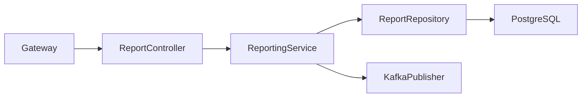
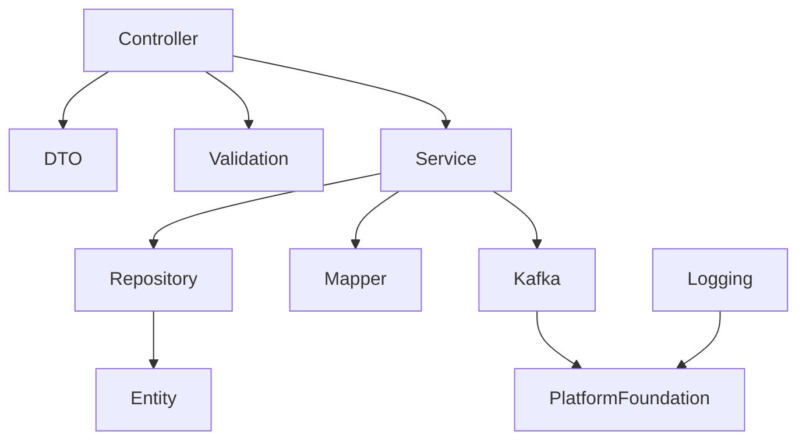
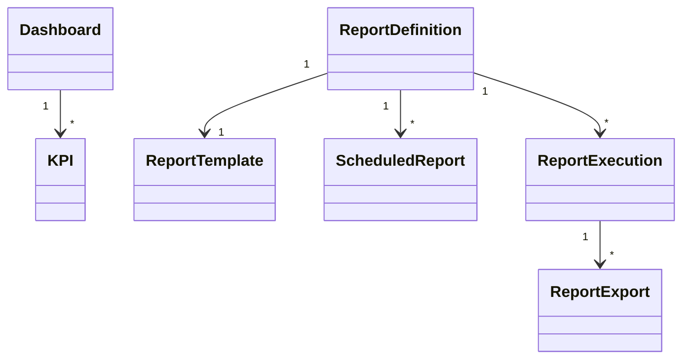

# LLD-012: Reporting Service

# 1. Document Information

| Field | Value |
|--------|-------|
| Project | Distributed Hub & Sales (DHS) Platform |
| Service | Reporting Service |
| Document | Low Level Design |
| Document ID | LLD-012 |
| Repository | starone-dhs-platform |
| Module | reporting-service |
| Version | v1.0.0 |
| Status | Draft |
| Standard | IEEE 1016 |
| Owner | Enterprise Architecture |

---

# 2. Purpose

This document defines the implementation-level architecture of the Reporting Service.

The Reporting Service is responsible for enterprise operational reporting, business analytics, dashboard generation, scheduled reports, report exports, KPI computation, report templates, and reporting event publishing.

This document implements the requirements defined in **SRS-012 – Reporting Service**.

---

# 3. Scope

The Reporting Service provides

- Operational Reports
- Executive Dashboards
- Sales Reports
- Inventory Reports
- Procurement Reports
- Financial Reports
- Customer Reports
- Supplier Reports
- KPI Dashboards
- Scheduled Reports
- Report Export
- Report Templates
- Reporting Event Publishing

Reporting Service shall not own

- Business Transactions
- Orders
- Inventory
- Billing
- Procurement
- Customer Master
- Supplier Master

Reporting Service consumes data from domain services.

---

# 4. Design Principles

## RPT-DP-001

Reports shall be read-only.

---

## RPT-DP-002

Reporting shall never modify business data.

---

## RPT-DP-003

Large reports shall execute asynchronously.

---

## RPT-DP-004

Dashboards shall support caching.

---

## RPT-DP-005

Scheduled reports shall be configurable.

---

## RPT-DP-006

Infrastructure concerns shall reuse Platform Foundation.

---

# 5. Package Structure

```text
reporting-service
│
├── config
├── controller
├── service
├── repository
├── entity
├── dto
├── mapper
├── validation
├── kafka
├── scheduler
├── export
├── dashboard
├── exception
├── util
└── client
```

---

# 6. Maven Module Structure

```text
reporting-service
│
├── api
├── application
├── domain
├── infrastructure
└── bootstrap
```

---

# 7. Layered Architecture

```text
REST API

↓

Controller

↓

Application Service

↓

Reporting Engine

↓

Repository

↓

PostgreSQL
```

Platform Foundation provides

- Security
- Logging
- Validation
- Kafka
- OpenFeign
- Exception Handling
- Observability

---

# 8. Package Design

## controller

```text
controller
│
├── DashboardController
├── SalesReportController
├── InventoryReportController
├── ProcurementReportController
├── FinancialReportController
├── CustomerReportController
├── SupplierReportController
├── ReportExportController
└── ReportScheduleController
```

---

## service

```text
service
│
├── DashboardService
├── SalesReportService
├── InventoryReportService
├── ProcurementReportService
├── FinancialReportService
├── CustomerReportService
├── SupplierReportService
├── ReportExportService
├── ReportScheduleService
├── ReportingValidationService
└── ReportingAuditService
```

---

## repository

```text
repository
│
├── ReportRepository
├── DashboardRepository
├── ReportTemplateRepository
├── ScheduledReportRepository
├── ExportRepository
├── KPIRepository
└── ReportExecutionRepository
```

---

## entity

```text
entity
│
├── ReportDefinition
├── Dashboard
├── KPI
├── ReportTemplate
├── ScheduledReport
├── ReportExecution
├── ReportExport
└── ReportingAudit
```

---

## dto

```text
dto
│
├── request
├── response
└── event
```

---

## kafka

```text
kafka
│
├── producer
├── consumer
└── configuration
```

---

# 9. Component Diagram



---

# 10. Package Dependency Diagram



---

# 11. Domain Responsibilities

| Component | Responsibility |
|------------|----------------|
| Dashboard | Executive Dashboard |
| Report | Business Reports |
| KPI | KPI Calculations |
| Template | Report Templates |
| Export | Report Export |
| Schedule | Scheduled Reports |
| Execution | Report Execution |
| Audit | Reporting Audit |

---

# 12. Service Boundaries

Reporting Service owns

- Report Definitions
- Dashboard Definitions
- KPI Definitions
- Scheduled Reports
- Report Exports
- Report Execution Metadata

Reporting Service does not own

- Orders
- Inventory
- Billing
- Procurement
- Customer
- Supplier

Reporting Service consumes business data through APIs and Kafka events.

---

# 13. Architecture Constraints

- Controllers shall remain stateless.
- Controllers shall never access repositories directly.
- Services shall contain business logic.
- Reports shall be read-only.
- Repository layer shall contain persistence only.
- Report execution shall support asynchronous processing.
- Dashboard caching shall be configurable.
- DTOs shall never expose entities.
- Kafka events shall publish after successful transaction commit.
- All entities shall extend AuditableEntity.
- APIs shall return ApiResponse<T>.

---

# 14. Class Design

The Reporting Service shall implement classes for dashboard generation, report execution, KPI computation, report scheduling, export management, report templates, and analytics processing.

The implementation shall follow Layered Architecture and Domain-Driven Design (DDD).

---

# 15. Controller Layer Design

The Controller layer shall expose REST APIs and delegate business processing to the Service layer.

Controllers shall remain stateless.

## Package Structure

```text
controller
│
├── DashboardController
├── SalesReportController
├── InventoryReportController
├── ProcurementReportController
├── FinancialReportController
├── CustomerReportController
├── SupplierReportController
├── ReportExportController
└── ReportScheduleController
```

---

## DashboardController

### Responsibilities

- Dashboard Summary
- KPI Dashboard
- Executive Dashboard
- Dashboard Refresh

### APIs

```text
GET  /api/v1/dashboard

GET  /api/v1/dashboard/executive

GET  /api/v1/dashboard/kpi

POST /api/v1/dashboard/refresh
```

---

## SalesReportController

Responsibilities

- Sales Summary
- Sales Trend
- Product Sales
- Customer Sales

---

## InventoryReportController

Responsibilities

- Stock Report
- Stock Aging
- Stock Movement
- Inventory Valuation

---

## ProcurementReportController

Responsibilities

- Purchase Report
- Vendor Performance
- Purchase Trend

---

## FinancialReportController

Responsibilities

- Revenue Report
- Payment Report
- Outstanding Report
- Profit Report

---

## CustomerReportController

Responsibilities

- Customer Summary
- Customer Purchase History
- Customer Outstanding

---

## SupplierReportController

Responsibilities

- Supplier Summary
- Supplier Purchase History
- Supplier Performance

---

## ReportExportController

Responsibilities

- Export PDF
- Export Excel
- Export CSV

---

## ReportScheduleController

Responsibilities

- Schedule Report
- Update Schedule
- Cancel Schedule

---

# 16. Service Layer Design

Business logic shall reside in the Service layer.

## Package Structure

```text
service
│
├── DashboardService
├── SalesReportService
├── InventoryReportService
├── ProcurementReportService
├── FinancialReportService
├── CustomerReportService
├── SupplierReportService
├── ReportExportService
├── ReportScheduleService
├── ReportingValidationService
└── ReportingAuditService
```

---

## DashboardService

### Responsibilities

- Dashboard Generation
- KPI Aggregation
- Dashboard Cache Refresh

### Public Methods

```java
getDashboard()

getExecutiveDashboard()

refreshDashboard()

getKpiDashboard()
```

---

## SalesReportService

Responsibilities

- Sales Reports
- Revenue Reports
- Trend Reports

---

## InventoryReportService

Responsibilities

- Stock Reports
- Aging Reports
- Valuation Reports

---

## ProcurementReportService

Responsibilities

- Purchase Reports
- Supplier Reports
- Procurement KPIs

---

## FinancialReportService

Responsibilities

- Revenue Reports
- Outstanding Reports
- Financial KPIs

---

## CustomerReportService

Responsibilities

- Customer Analytics
- Purchase Analytics

---

## SupplierReportService

Responsibilities

- Supplier Analytics
- Vendor Performance

---

## ReportExportService

Responsibilities

- PDF Export
- Excel Export
- CSV Export

---

## ReportScheduleService

Responsibilities

- Schedule Execution
- Schedule Validation
- Notification Trigger

---

# 17. Repository Layer Design

Repositories shall encapsulate persistence logic only.

## Package Structure

```text
repository
│
├── DashboardRepository
├── ReportRepository
├── KPIRepository
├── ReportTemplateRepository
├── ScheduledReportRepository
├── ReportExecutionRepository
└── ReportExportRepository
```

---

## Repository Responsibilities

| Repository | Responsibility |
|------------|----------------|
| DashboardRepository | Dashboard Metadata |
| ReportRepository | Report Definitions |
| KPIRepository | KPI Definitions |
| ReportTemplateRepository | Templates |
| ScheduledReportRepository | Scheduling |
| ReportExecutionRepository | Execution History |
| ReportExportRepository | Export Metadata |

---

# 18. DTO Design

## Request DTOs

```text
dto.request
│
├── DashboardRequest
├── SalesReportRequest
├── InventoryReportRequest
├── ProcurementReportRequest
├── FinancialReportRequest
├── CustomerReportRequest
├── SupplierReportRequest
├── ReportExportRequest
└── ScheduleReportRequest
```

---

## Response DTOs

```text
dto.response
│
├── DashboardResponse
├── KPIResponse
├── SalesReportResponse
├── InventoryReportResponse
├── ProcurementReportResponse
├── FinancialReportResponse
├── CustomerReportResponse
├── SupplierReportResponse
├── ReportExportResponse
└── ScheduledReportResponse
```

---

## DashboardResponse

| Field | Type |
|---------|------|
| dashboardId | UUID |
| dashboardName | String |
| generatedAt | Instant |
| totalWidgets | Integer |
| refreshTime | Instant |

---

# 19. Entity Design

All entities shall extend **AuditableEntity**.

---

## Package Structure

```text
entity
│
├── Dashboard
├── ReportDefinition
├── KPI
├── ReportTemplate
├── ScheduledReport
├── ReportExecution
├── ReportExport
└── ReportingAudit
```

---

## Dashboard

| Attribute | Type |
|------------|------|
| id | UUID |
| dashboardName | String |
| dashboardType | DashboardType |
| refreshInterval | Integer |
| cacheEnabled | Boolean |

---

## ReportDefinition

| Attribute | Type |
|------------|------|
| id | UUID |
| reportCode | String |
| reportName | String |
| reportCategory | ReportCategory |
| queryName | String |
| outputFormat | ReportFormat |

---

## KPI

| Attribute | Type |
|------------|------|
| id | UUID |
| kpiCode | String |
| kpiName | String |
| calculationType | CalculationType |
| refreshInterval | Integer |

---

## ReportTemplate

| Attribute | Type |
|------------|------|
| id | UUID |
| templateCode | String |
| templateName | String |
| templateVersion | Integer |
| reportCategory | ReportCategory |

---

## ScheduledReport

| Attribute | Type |
|------------|------|
| id | UUID |
| reportId | UUID |
| cronExpression | String |
| nextExecution | Instant |
| scheduleStatus | ScheduleStatus |

---

## ReportExecution

| Attribute | Type |
|------------|------|
| id | UUID |
| reportId | UUID |
| executionStatus | ExecutionStatus |
| startedAt | Instant |
| completedAt | Instant |

---

## ReportExport

| Attribute | Type |
|------------|------|
| id | UUID |
| reportExecutionId | UUID |
| exportType | ExportType |
| fileName | String |
| storagePath | String |

---

# 20. Mapper Design

MapStruct shall be the standard mapping framework.

## Package Structure

```text
mapper
│
├── DashboardMapper
├── ReportMapper
├── KPIMapper
├── ReportTemplateMapper
├── ScheduledReportMapper
├── ReportExecutionMapper
└── ReportExportMapper
```

---

## Responsibilities

- DTO → Entity
- Entity → DTO
- Partial Updates
- Page Mapping

---

# 21. Validation Design

## Package Structure

```text
validation
│
├── annotation
├── validator
└── groups
```

---

## Validators

```text
DashboardValidator

ReportValidator

KPIValidator

ScheduleValidator

ExportValidator

TemplateValidator
```

---

## Validation Rules

| Validator | Purpose |
|------------|----------|
| DashboardValidator | Dashboard Validation |
| ReportValidator | Report Validation |
| KPIValidator | KPI Validation |
| ScheduleValidator | Schedule Validation |
| ExportValidator | Export Validation |
| TemplateValidator | Template Validation |

---

# 22. Exception Hierarchy

```text
RuntimeException
        │
        └── PlatformException
                │
                ├── ReportNotFoundException
                ├── DashboardNotFoundException
                ├── InvalidReportParameterException
                ├── KPICalculationException
                ├── ReportExecutionException
                ├── ReportExportException
                ├── ScheduleExecutionException
                ├── TemplateNotFoundException
                └── ReportTimeoutException
```

---

# 23. Dashboard Generation Flow

```mermaid
sequenceDiagram

Client->>DashboardController

DashboardController->>DashboardService

DashboardService->>DashboardRepository

DashboardRepository-->>DashboardService

DashboardService-->>DashboardController
```

---

# 24. Report Generation Flow

```mermaid
sequenceDiagram

Client->>SalesReportController

SalesReportController->>SalesReportService

SalesReportService->>ReportRepository

ReportRepository-->>SalesReportService

SalesReportService-->>SalesReportController
```

---

# 25. Report Export Flow

```mermaid
sequenceDiagram

Client->>ReportExportController

ReportExportController->>ReportExportService

ReportExportService->>ReportExecutionRepository

ReportExecutionRepository-->>ReportExportService

ReportExportService-->>ReportExportController
```

---

# 26. Scheduled Report Flow

```mermaid
sequenceDiagram

Scheduler->>ReportScheduleService

ReportScheduleService->>ReportRepository

ReportRepository-->>ReportScheduleService

ReportScheduleService->>NotificationService
```

---

# 27. KPI Refresh Flow

```mermaid
sequenceDiagram

Scheduler->>DashboardService

DashboardService->>KPIRepository

KPIRepository-->>DashboardService

DashboardService-->>Scheduler
```

---

# 28. Class Diagram



---

# 29. Design Constraints

- Reports shall always be read-only.
- Report execution shall never modify business data.
- Dashboard caching shall be configurable.
- Scheduled reports shall execute asynchronously.
- Controllers shall remain stateless.
- Services shall contain all business logic.
- Repository layer shall contain persistence only.
- Kafka events shall publish after successful transaction commit.
- DTOs shall never expose JPA entities.
- All entities shall extend `AuditableEntity`.
- APIs shall return `ApiResponse<T>`.

---

# 30. Security Configuration

The Reporting Service shall inherit the enterprise security framework from the Platform Foundation.

Authentication shall be delegated to the Identity Service.

Authorization shall be enforced using Role-Based Access Control (RBAC).

---

## 30.1 Security Architecture

```text
Client

↓

API Gateway

↓

JWT Authentication Filter

↓

Authorization Filter

↓

Reporting Controller

↓

Reporting Service
```

---

## 30.2 Security Components

```text
security
│
├── config
│   ├── SecurityConfiguration
│   ├── MethodSecurityConfiguration
│   └── CorsConfiguration
│
├── filter
│   ├── JwtAuthenticationFilter
│   ├── AuthorizationFilter
│   └── CorrelationIdFilter
│
├── permission
│   ├── ReportingPermissionEvaluator
│   └── ReportAccessValidator
│
└── annotation
    └── RequireReportingPermission
```

---

## 30.3 Permissions

| Permission | Description |
|------------|-------------|
| DASHBOARD_VIEW | View Dashboards |
| REPORT_VIEW | View Reports |
| REPORT_EXPORT | Export Reports |
| REPORT_EXECUTE | Execute Reports |
| REPORT_SCHEDULE | Schedule Reports |
| KPI_VIEW | View KPIs |
| TEMPLATE_MANAGE | Manage Report Templates |
| REPORT_ADMIN | Reporting Administration |
| REPORT_AUDIT | View Reporting Audit |

---

## 30.4 Authorization Flow

```mermaid
sequenceDiagram

Client->>Gateway: JWT

Gateway->>Identity Service: Validate Token

Identity Service-->>Gateway: Claims

Gateway->>Reporting Service

Reporting Service->>PermissionEvaluator

PermissionEvaluator-->>Reporting Service

Reporting Service-->>Client
```

---

# 31. JWT Implementation

JWT validation shall be handled by Platform Foundation.

Reporting Service shall consume authenticated user information from Spring Security.

---

## Required Claims

```json
{
  "sub":"UUID",
  "username":"report.manager",
  "roles":["REPORT_MANAGER"],
  "permissions":[
      "REPORT_VIEW",
      "REPORT_EXPORT",
      "REPORT_EXECUTE"
  ],
  "tenantId":"UUID",
  "branchId":"UUID"
}
```

---

## User Context

Every request shall expose

```text
UserId

Username

Roles

Permissions

TenantId

BranchId

CorrelationId
```

---

# 32. Authorization Design

Permission-based authorization shall be implemented.

---

## Example

```java
@PreAuthorize("hasAuthority('REPORT_VIEW')")
```

or

```java
@RequireReportingPermission("REPORT_VIEW")
```

---

## Permission Matrix

| API | Permission |
|-----|------------|
| View Dashboard | DASHBOARD_VIEW |
| Execute Report | REPORT_EXECUTE |
| View Report | REPORT_VIEW |
| Export Report | REPORT_EXPORT |
| Schedule Report | REPORT_SCHEDULE |
| View KPI | KPI_VIEW |
| Manage Templates | TEMPLATE_MANAGE |
| Administration | REPORT_ADMIN |
| Reporting Audit | REPORT_AUDIT |

---

# 33. Kafka Design

Reporting Service shall publish reporting lifecycle events.

---

## Published Topics

```text
report.generated.v1

report.exported.v1

report.execution.completed.v1

report.execution.failed.v1

dashboard.refreshed.v1

kpi.calculated.v1

scheduled.report.executed.v1

scheduled.report.failed.v1
```

---

## Consumed Topics

```text
order.completed.v1

invoice.posted.v1

payment.received.v1

inventory.updated.v1

stock.adjusted.v1

procurement.completed.v1

supplier.updated.v1

customer.updated.v1

shipment.delivered.v1

returns.completed.v1
```

---

## Kafka Package

```text
kafka
│
├── producer
├── consumer
├── configuration
├── mapper
└── event
```

---

## Event Envelope

```json
{
  "eventId":"UUID",
  "eventType":"ReportGenerated",
  "eventVersion":"1.0",
  "occurredAt":"2026-06-27T10:00:00Z",
  "correlationId":"UUID",
  "payload":{}
}
```

---

# 34. OpenFeign Design

Reporting Service shall retrieve operational data from business services where real-time reporting is required.

---

## Feign Clients

```text
client
│
├── OrderClient
├── InventoryClient
├── BillingClient
├── ProcurementClient
├── CustomerClient
├── SupplierClient
├── DispatchClient
├── AuditClient
└── NotificationClient
```

---

## Responsibilities

| Client | Responsibility |
|----------|----------------|
| OrderClient | Sales Reports |
| InventoryClient | Inventory Reports |
| BillingClient | Financial Reports |
| ProcurementClient | Procurement Reports |
| CustomerClient | Customer Reports |
| SupplierClient | Supplier Reports |
| DispatchClient | Logistics Reports |
| AuditClient | Audit Reports |
| NotificationClient | Scheduled Report Notifications |

---

# 35. Configuration Classes

```text
config
│
├── SecurityConfiguration
├── KafkaConfiguration
├── FeignConfiguration
├── CacheConfiguration
├── JacksonConfiguration
├── ValidationConfiguration
├── SchedulerConfiguration
├── MetricsConfiguration
├── ReportConfiguration
└── OpenApiConfiguration
```

---

## Responsibilities

| Configuration | Responsibility |
|---------------|----------------|
| Security | Spring Security |
| Kafka | Kafka Infrastructure |
| Feign | OpenFeign |
| Cache | Redis |
| Validation | Bean Validation |
| Scheduler | Report Scheduling |
| Metrics | Micrometer |
| Reporting | Reporting Engine |
| OpenAPI | Swagger |

---

# 36. Transaction Design

Reporting transactions shall remain read-only.

Report generation shall not modify business data.

---

## Transaction Types

| Operation | Propagation |
|------------|-------------|
| Execute Report | SUPPORTS |
| Dashboard Refresh | SUPPORTS |
| Export Report | REQUIRED |
| Schedule Report | REQUIRED |
| Publish Event | AFTER_COMMIT |

---

## Transaction Flow

```mermaid
flowchart LR

Controller

-->

ReportingService

-->

Repository

-->

ReportEngine

-->

Kafka Publish
```

---

# 37. Cache Design

Redis shall cache frequently accessed reporting data.

---

## Cached Objects

```text
Executive Dashboard

Sales Dashboard

Inventory Dashboard

KPIs

Frequently Executed Reports

Report Templates
```

---

## Cache Annotations

```java
@Cacheable

@CachePut

@CacheEvict
```

---

# 38. Resilience Patterns

Reporting Service shall implement Resilience4j.

---

## Retry

Order Service

Inventory Service

Billing Service

---

## Circuit Breaker

Order Service

Inventory Service

Billing Service

Supplier Service

Procurement Service

---

## Bulkhead

External Service Calls

---

## Rate Limiter

Dashboard APIs

Report Execution APIs

Export APIs

---

## Timeout

All OpenFeign Clients

---

# 39. Scheduler Design

Scheduled jobs shall support automated reporting.

---

## Scheduled Jobs

```text
scheduler
│
├── DailySalesReportScheduler
├── WeeklyInventoryScheduler
├── MonthlyFinancialScheduler
├── DashboardRefreshScheduler
├── KPIRefreshScheduler
├── ReportCleanupScheduler
└── ReportArchiveScheduler
```

---

# 40. External Integration Design

| Service | Purpose |
|----------|---------|
| Order Service | Sales Analytics |
| Inventory Service | Inventory Analytics |
| Billing Service | Financial Analytics |
| Procurement Service | Procurement Analytics |
| Customer Service | Customer Analytics |
| Supplier Service | Supplier Analytics |
| Dispatch Service | Logistics Analytics |
| Notification Service | Scheduled Report Delivery |
| Audit Service | Audit Reporting |

---

# 41. Configuration Properties

| Property | Default |
|----------|----------|
| reporting.cache.enabled | true |
| reporting.cache.ttl | 3600 |
| reporting.export.max.rows | 100000 |
| reporting.scheduler.enabled | true |
| reporting.kafka.retry | 3 |

---

# 42. Data Consistency Strategy

- Reports shall always be read-only.
- Dashboard cache shall refresh automatically.
- KPI calculations shall be deterministic.
- Scheduled reports shall execute independently.
- Kafka events shall publish only after successful report completion.

---

# 43. Performance Considerations

- Reports shall support pagination.
- Large reports shall execute asynchronously.
- Dashboards shall use Redis cache.
- Frequently executed reports shall be cached.
- Export generation shall execute in background jobs.

---

# 44. Design Constraints

- Reports shall never modify business data.
- JWT authentication shall be mandatory.
- Authorization shall be permission-based.
- Repository layer shall never invoke external services.
- Configuration shall be externalized.
- Kafka events shall publish after successful execution.
- Correlation ID shall propagate across outbound requests.

---

# 45. Technology Standards

| Concern | Technology |
|----------|------------|
| Java | Java 21 |
| Framework | Spring Boot 3.x |
| Security | Spring Security 6 |
| Authentication | JWT |
| Authorization | RBAC |
| Database | PostgreSQL |
| Cache | Redis |
| Messaging | Apache Kafka |
| Service Calls | OpenFeign |
| Validation | Jakarta Bean Validation |
| Mapping | MapStruct |
| Logging | SLF4J + Logback |
| Metrics | Micrometer |
| Tracing | OpenTelemetry |
| Service Discovery | Eureka |

---

# 46. Logging Design

The Reporting Service shall implement centralized structured logging using the Platform Foundation logging framework.

Every report execution, dashboard refresh, export operation, KPI calculation, scheduler execution, and external integration shall be logged using standardized MDC attributes.

---

## 46.1 Logging Architecture

```text
REST Request

↓

Correlation Filter

↓

Logging Aspect

↓

SLF4J

↓

Logback

↓

ELK / OpenSearch / Splunk
```

---

## 46.2 Log Levels

| Level | Purpose |
|---------|---------|
| TRACE | Framework Diagnostics |
| DEBUG | Development |
| INFO | Business Events |
| WARN | Recoverable Processing Errors |
| ERROR | Report Execution Failures |

---

## 46.3 MDC Context

Every log entry shall include

```text
Correlation ID

Trace ID

Span ID

Report ID

Execution ID

Dashboard ID

Template ID

Tenant ID

Branch ID

User ID

Request URI

HTTP Method

Service Name

Environment
```

---

## 46.4 Business Events

The following operations shall always be logged.

- Dashboard Generated
- Dashboard Refreshed
- Report Executed
- Report Exported
- Report Scheduled
- Scheduled Report Executed
- Scheduled Report Failed
- KPI Calculated
- Report Cached
- Report Cache Refreshed
- Report Archive Completed
- Report Cleanup Completed

---

## 46.5 Sensitive Data

The following shall never be logged.

- JWT Tokens
- Authorization Headers
- Database Credentials
- API Keys
- Export File Contents
- Personally Identifiable Information
- Encryption Keys

---

# 47. Observability

Reporting Service shall expose operational metrics using Micrometer.

---

## JVM Metrics

- Heap Usage
- CPU Usage
- Thread Count
- Garbage Collection

---

## Business Metrics

- Reports Executed
- Report Execution Time
- Dashboard Refresh Count
- Dashboard Response Time
- KPI Calculations
- Scheduled Reports Executed
- Scheduled Reports Failed
- Report Exports
- Cache Hit Ratio
- Cache Miss Ratio

---

## Infrastructure Metrics

- Database Connections
- Kafka Publish Rate
- Kafka Consumer Lag
- Redis Cache Hit Ratio
- API Response Time

---

# 48. Distributed Tracing

Every reporting request shall propagate distributed tracing metadata.

---

## Trace Flow

```mermaid
sequenceDiagram

Client->>Gateway

Gateway->>Reporting Service

Reporting Service->>Order Service

Reporting Service->>Inventory Service

Reporting Service->>Billing Service

Reporting Service->>Procurement Service

Reporting Service-->>Gateway

Gateway-->>Client
```

---

## Trace Context

Every request shall propagate

- Correlation ID
- Trace ID
- Span ID

---

# 49. Health Checks

Reporting Service shall expose Spring Boot Actuator endpoints.

---

## Health

```text
GET /actuator/health
```

---

## Liveness

```text
GET /actuator/health/liveness
```

---

## Readiness

```text
GET /actuator/health/readiness
```

Dependencies

- PostgreSQL
- Redis
- Kafka
- Config Server

---

## Metrics

```text
GET /actuator/metrics
```

---

## Prometheus

```text
GET /actuator/prometheus
```

---

# 50. Deployment Design

Reporting Service shall be deployed as an independent containerized microservice.

---

## Deployment Architecture

```text
Gateway

↓

Reporting Service

↓

PostgreSQL

↓

Redis

↓

Kafka
```

---

## Kubernetes Resources

```text
Deployment

Service

Ingress

ConfigMap

Secret

HorizontalPodAutoscaler

ServiceMonitor

PodDisruptionBudget
```

---

# 51. Dependency Management

Reporting Service shall inherit the Platform Foundation BOM.

```xml
<dependencyManagement>

<dependency>

<groupId>com.starone</groupId>

<artifactId>platform-foundation-bom</artifactId>

</dependency>

</dependencyManagement>
```

---

## Primary Dependencies

- Spring Boot
- Spring Security
- Spring Data JPA
- Spring Kafka
- Spring Validation
- PostgreSQL Driver
- Redis
- OpenFeign
- Micrometer
- OpenTelemetry
- MapStruct
- Lombok
- JasperReports / Apache POI

---

# 52. Coding Standards

Reporting Service shall comply with enterprise coding standards.

---

## Controller

- Stateless
- Validation Only
- No Business Logic

---

## Service

- Stateless
- Read-Only Operations
- Business Orchestration

---

## Repository

- Persistence Only
- Read-Optimized Queries

---

## DTO

- Immutable
- Validation Annotations

---

## Entity

- Extend AuditableEntity
- Never Exposed Directly

---

# 53. Package Naming Standards

```text
com.starone.reporting

├── controller
├── service
├── repository
├── entity
├── dto
├── mapper
├── validation
├── dashboard
├── export
├── scheduler
├── config
├── kafka
├── exception
├── util
└── client
```

---

# 54. Testing Strategy

## Unit Testing

Framework

```text
JUnit 5

Mockito
```

Coverage

```text
Minimum 90%
```

---

## Integration Testing

- Spring Boot Test
- Testcontainers
- Embedded Kafka

---

## API Testing

- REST Assured
- Spring MockMvc

---

## Reporting Testing

- Dashboard Generation
- KPI Calculation
- Report Execution
- Report Export
- Scheduled Reports
- Cache Refresh
- Large Dataset Processing

---

## Performance Testing

- Dashboard Load Testing
- Concurrent Report Execution
- Export Performance
- Cache Performance
- Scheduler Performance

---

## Static Analysis

- SonarQube
- SpotBugs
- PMD
- Checkstyle

---

# 55. Build Validation

Every Pull Request shall verify

- Compilation
- Unit Tests
- Integration Tests
- Reporting Tests
- Static Analysis
- Security Scan
- Dependency Scan
- Documentation Validation
- Code Coverage

---

# 56. Quality Gates

| Metric | Target |
|---------|--------|
| Unit Test Coverage | ≥90% |
| Integration Tests | 100% Pass |
| Reporting Tests | 100% Pass |
| Critical Bugs | 0 |
| Critical Vulnerabilities | 0 |
| Code Duplication | <3% |
| Documentation | Mandatory |

---

# 57. Implementation Guidelines

Reporting Service shall reuse Platform Foundation components.

Business code shall never duplicate

- JWT Security
- Logging
- Validation
- Kafka Infrastructure
- Exception Handling
- API Response Models
- Pagination Framework

Reports shall remain read-only.

Large reports shall execute asynchronously.

Dashboard caching shall use Redis.

---

# 58. Extension Guidelines

Business-specific functionality shall extend Platform Foundation components where applicable.

Permitted extensions include

- AuditableEntity
- PlatformException
- ApiResponse
- BaseMapper
- ReportExportEngine

Platform Foundation source code shall never be modified by Reporting Service.

---

# 59. Design Checklist

Before implementation verify

- Dashboard caching configured
- KPI engine implemented
- Export engine implemented
- Scheduler implemented
- Redis cache configured
- Pagination implemented
- Controllers contain no business logic
- Services remain stateless
- Repository layer contains persistence only
- Kafka events published after successful execution
- Health endpoints exposed
- Metrics published
- Configuration externalized
- Unit test coverage meets quality gates

---

# 60. Appendix A – Framework Versions

| Component | Version |
|------------|---------|
| Java | 21 |
| Spring Boot | 3.x |
| Spring Security | 6.x |
| Spring Cloud | 2025.x |
| PostgreSQL | Latest Supported |
| Redis | Latest Supported |
| Kafka | Latest Supported |
| OpenFeign | Latest Supported |
| Micrometer | Latest Supported |
| OpenTelemetry | Latest Supported |
| JasperReports | Latest Stable |
| Apache POI | Latest Stable |
| MapStruct | Latest Stable |
| Lombok | Latest Stable |
| JUnit | 5.x |

---

# 61. Appendix B – Layer Responsibility Matrix

| Layer | Responsibility |
|---------|----------------|
| Controller | Request Handling |
| Service | Report Generation |
| Repository | Data Access |
| Dashboard | Dashboard Processing |
| Export | Export Generation |
| Scheduler | Scheduled Reports |
| Kafka | Event Processing |
| Mapper | DTO Conversion |
| Validation | Request Validation |

---

# 62. Appendix C – Reporting Components

```text
DashboardController

SalesReportController

InventoryReportController

ProcurementReportController

FinancialReportController

CustomerReportController

SupplierReportController

ReportExportController

ReportScheduleController

DashboardService

SalesReportService

InventoryReportService

ProcurementReportService

FinancialReportService

CustomerReportService

SupplierReportService

ReportExportService

ReportScheduleService

DashboardRepository

ReportRepository

KPIRepository

ReportTemplateRepository

ScheduledReportRepository

ReportExecutionRepository

ReportExportRepository
```

---

# 63. Appendix D – Reporting Processing Summary

```text
Client

↓

Gateway

↓

JWT Authentication

↓

Authorization

↓

Controller

↓

Reporting Service

↓

Reporting Engine

↓

Repository

↓

Dashboard / Export Engine

↓

Kafka Events

↓

Response
```

---

# 64. Appendix E – Repository Responsibilities

| Repository | Responsibility |
|------------|----------------|
| starone-galaxy-architecture | Enterprise Standards, Governance & Architecture |
| starone-galaxy-central-config | Configuration Management |
| starone-galaxy-infra | Kubernetes, Infrastructure & CI/CD |
| starone-dhs-platform | Reporting Service Implementation |

---

# 65. Conclusion

The Reporting Service is the centralized analytics and business intelligence component of the DHS platform, responsible for dashboards, operational reports, KPI computation, report scheduling, report exports, and enterprise analytics. It provides read-only access to business data, integrates with domain services for operational insights, and leverages the Platform Foundation for security, observability, logging, messaging, validation, and other enterprise cross-cutting concerns.

---

# End of Document