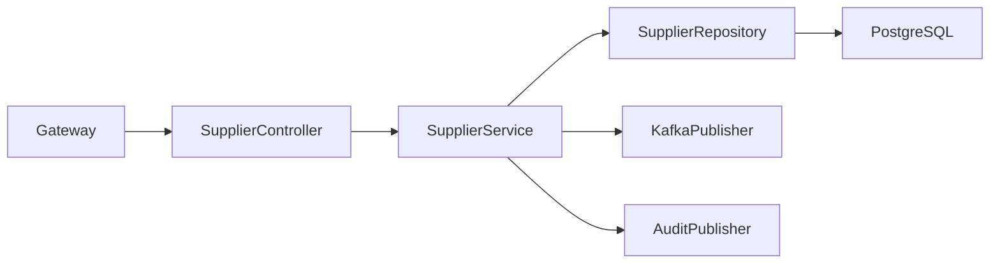
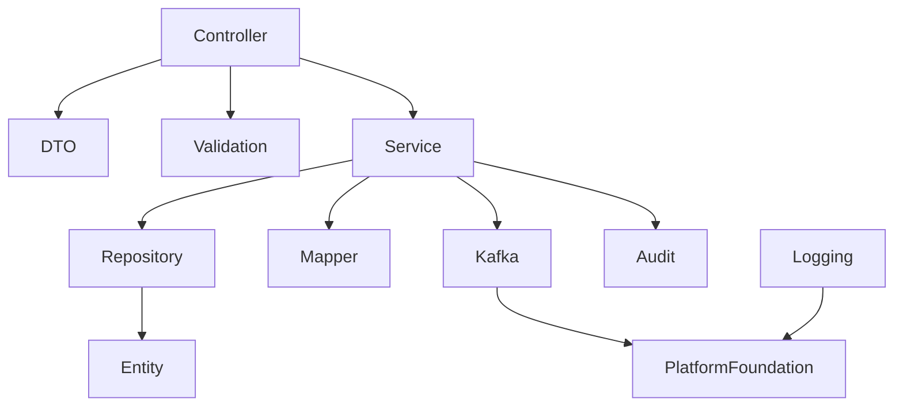
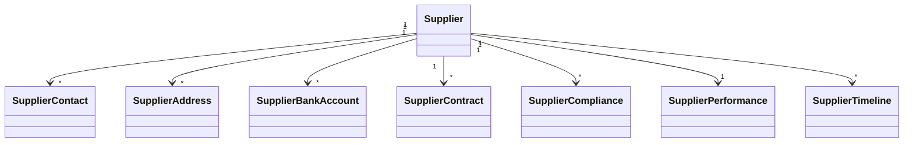

# LLD-013: Supplier Service

# 1. Document Information

| Field       | Value                                  |
| ----------- | -------------------------------------- |
| Project     | Distributed Hub & Sales (DHS) Platform |
| Service     | Supplier Service                       |
| Document    | Low Level Design                       |
| Document ID | LLD-013                                |
| Repository  | starone-dhs-platform                   |
| Module      | supplier-service                       |
| Version     | v1.0.0                                 |
| Status      | Draft                                  |
| Standard    | IEEE 1016                              |
| Owner       | Enterprise Architecture                |

---

# 2. Purpose

This document defines the implementation-level architecture of the Supplier Service.

The Supplier Service is the authoritative master data service for supplier and vendor information across the DHS platform. It manages supplier onboarding, qualification, contracts, compliance, banking information, contacts, supplier lifecycle, performance metrics, and supplier master event publishing.

This document implements the requirements defined in **SRS-013 – Supplier Service**.

---

# 3. Scope

The Supplier Service provides

- Supplier Master Management
- Vendor Registration
- Supplier Qualification
- Supplier Classification
- Contact Management
- Bank Account Management
- Address Management
- Contract Information
- Compliance Documents
- Supplier Performance
- Supplier Lifecycle Management
- Supplier Search
- Supplier Event Publishing

Supplier Service shall not own

- Purchase Orders
- Procurement Transactions
- Inventory
- Warehouse
- Product Pricing
- Payments

Supplier Service acts as the Supplier Master for Procurement, Inventory, Billing and Reporting services.

---

# 4. Design Principles

## SUP-DP-001

Supplier shall be the single source of truth.

---

## SUP-DP-002

Supplier Code shall be immutable.

---

## SUP-DP-003

Supplier lifecycle shall be state driven.

---

## SUP-DP-004

Supplier master shall be reusable across services.

---

## SUP-DP-005

Supplier changes shall publish domain events.

---

## SUP-DP-006

Infrastructure concerns shall reuse Platform Foundation.

---

# 5. Package Structure

```text
supplier-service
│
├── config
├── controller
├── service
├── repository
├── entity
├── dto
├── mapper
├── validation
├── kafka
├── exception
├── audit
├── scheduler
├── util
└── client
```

---

# 6. Maven Module Structure

```text
supplier-service
│
├── api
├── application
├── domain
├── infrastructure
└── bootstrap
```

---

# 7. Layered Architecture

```text
REST API

↓

Controller

↓

Application Service

↓

Supplier Domain

↓

Repository

↓

PostgreSQL
```

Platform Foundation provides

- Security
- Logging
- Validation
- Kafka
- OpenFeign
- Exception Handling
- Audit
- Observability

---

# 8. Package Design

## controller

```text
controller
│
├── SupplierController
├── SupplierContactController
├── SupplierBankController
├── SupplierContractController
├── SupplierComplianceController
├── SupplierPerformanceController
├── SupplierSearchController
└── SupplierTimelineController
```

---

## service

```text
service
│
├── SupplierService
├── SupplierContactService
├── SupplierBankService
├── SupplierContractService
├── SupplierComplianceService
├── SupplierPerformanceService
├── SupplierTimelineService
├── SupplierSearchService
├── SupplierValidationService
└── SupplierAuditService
```

---

## repository

```text
repository
│
├── SupplierRepository
├── SupplierContactRepository
├── SupplierAddressRepository
├── SupplierBankRepository
├── SupplierContractRepository
├── SupplierComplianceRepository
├── SupplierPerformanceRepository
└── SupplierTimelineRepository
```

---

## entity

```text
entity
│
├── Supplier
├── SupplierContact
├── SupplierAddress
├── SupplierBankAccount
├── SupplierContract
├── SupplierCompliance
├── SupplierPerformance
├── SupplierTimeline
└── SupplierAudit
```

---

## dto

```text
dto
│
├── request
├── response
└── event
```

---

## kafka

```text
kafka
│
├── producer
├── consumer
└── configuration
```

---

# 9. Component Diagram



---

# 10. Package Dependency Diagram



---

# 11. Domain Responsibilities

| Component            | Responsibility        |
| -------------------- | --------------------- |
| Supplier             | Supplier Master       |
| Supplier Contact     | Contacts              |
| Supplier Address     | Addresses             |
| Supplier Bank        | Banking Information   |
| Supplier Contract    | Commercial Contracts  |
| Supplier Compliance  | Regulatory Compliance |
| Supplier Performance | Performance Metrics   |
| Supplier Timeline    | Lifecycle History     |

---

# 12. Service Boundaries

Supplier Service owns

- Supplier Master
- Supplier Contacts
- Supplier Addresses
- Bank Accounts
- Contracts
- Compliance Documents
- Performance Metrics
- Supplier Timeline

Supplier Service does not own

- Purchase Orders
- Procurement Transactions
- Inventory
- Billing
- Payments

All business services shall reference suppliers using **supplierId**.

---

# 13. Architecture Constraints

- Controllers shall remain stateless.
- Controllers shall never access repositories directly.
- Services shall contain business logic.
- Supplier Code shall be immutable.
- Repository layer shall contain persistence only.
- Supplier lifecycle shall be state driven.
- Supplier events shall publish after transaction commit.
- DTOs shall never expose entities.
- All entities shall extend AuditableEntity.
- APIs shall return ApiResponse<T>.

---

# 14. Class Design

The Supplier Service shall implement classes for supplier master management, contact management, address management, banking information, contracts, compliance, supplier performance, lifecycle management, and supplier search.

The implementation shall follow Layered Architecture and Domain-Driven Design (DDD).

---

# 15. Controller Layer Design

The Controller layer shall expose REST APIs and delegate business processing to the Service layer.

Controllers shall remain stateless.

## Package Structure

```text
controller
│
├── SupplierController
├── SupplierContactController
├── SupplierAddressController
├── SupplierBankController
├── SupplierContractController
├── SupplierComplianceController
├── SupplierPerformanceController
├── SupplierSearchController
└── SupplierTimelineController
```

---

## SupplierController

### Responsibilities

- Create Supplier
- Update Supplier
- View Supplier
- Activate Supplier
- Suspend Supplier
- Deactivate Supplier

### APIs

```text
POST   /api/v1/suppliers

PUT    /api/v1/suppliers/{supplierId}

GET    /api/v1/suppliers/{supplierId}

PUT    /api/v1/suppliers/{supplierId}/activate

PUT    /api/v1/suppliers/{supplierId}/suspend

PUT    /api/v1/suppliers/{supplierId}/deactivate
```

---

## SupplierContactController

Responsibilities

- Add Contact
- Update Contact
- Delete Contact
- Set Primary Contact

---

## SupplierAddressController

Responsibilities

- Add Address
- Update Address
- Delete Address
- Set Default Address

---

## SupplierBankController

Responsibilities

- Add Bank Account
- Update Bank Account
- Verify Bank Account
- Deactivate Bank Account

---

## SupplierContractController

Responsibilities

- Create Contract
- Renew Contract
- Terminate Contract
- View Contract

---

## SupplierComplianceController

Responsibilities

- Upload Compliance Documents
- Approve Compliance
- Reject Compliance
- Compliance Status

---

## SupplierPerformanceController

Responsibilities

- Supplier Scorecard
- Delivery Performance
- Quality Performance
- Supplier Rating

---

## SupplierSearchController

Responsibilities

- Search Suppliers
- Advanced Search
- Supplier Filters

---

## SupplierTimelineController

Responsibilities

- Supplier Timeline
- Lifecycle Events
- Audit History

---

# 16. Service Layer Design

Business logic shall reside in the Service layer.

## Package Structure

```text
service
│
├── SupplierService
├── SupplierContactService
├── SupplierAddressService
├── SupplierBankService
├── SupplierContractService
├── SupplierComplianceService
├── SupplierPerformanceService
├── SupplierTimelineService
├── SupplierSearchService
├── SupplierValidationService
└── SupplierAuditService
```

---

## SupplierService

### Responsibilities

- Register Supplier
- Update Supplier
- Activate Supplier
- Suspend Supplier
- Deactivate Supplier

### Public Methods

```java
createSupplier()

updateSupplier()

activateSupplier()

suspendSupplier()

deactivateSupplier()

getSupplier()

searchSuppliers()
```

---

## SupplierContactService

Responsibilities

- Contact Management
- Primary Contact Validation

---

## SupplierAddressService

Responsibilities

- Address Management
- Default Address Validation

---

## SupplierBankService

Responsibilities

- Bank Account Management
- Bank Verification

---

## SupplierContractService

Responsibilities

- Contract Management
- Contract Renewal
- Contract Expiry Validation

---

## SupplierComplianceService

Responsibilities

- Compliance Verification
- Document Validation
- Regulatory Compliance

---

## SupplierPerformanceService

Responsibilities

- Supplier KPI Calculation
- Performance Rating
- Vendor Evaluation

---

## SupplierTimelineService

Responsibilities

- Lifecycle Tracking
- Timeline Generation

---

## SupplierSearchService

Responsibilities

- Search
- Filtering
- Pagination
- Sorting

---

# 17. Repository Layer Design

Repositories shall encapsulate persistence logic only.

## Package Structure

```text
repository
│
├── SupplierRepository
├── SupplierContactRepository
├── SupplierAddressRepository
├── SupplierBankRepository
├── SupplierContractRepository
├── SupplierComplianceRepository
├── SupplierPerformanceRepository
└── SupplierTimelineRepository
```

---

## Repository Responsibilities

| Repository                    | Responsibility  |
| ----------------------------- | --------------- |
| SupplierRepository            | Supplier Master |
| SupplierContactRepository     | Contacts        |
| SupplierAddressRepository     | Addresses       |
| SupplierBankRepository        | Bank Accounts   |
| SupplierContractRepository    | Contracts       |
| SupplierComplianceRepository  | Compliance      |
| SupplierPerformanceRepository | Performance     |
| SupplierTimelineRepository    | Timeline        |

---

# 18. DTO Design

## Request DTOs

```text
dto.request
│
├── CreateSupplierRequest
├── UpdateSupplierRequest
├── SupplierContactRequest
├── SupplierAddressRequest
├── SupplierBankRequest
├── SupplierContractRequest
├── SupplierComplianceRequest
├── SupplierPerformanceRequest
└── SupplierSearchRequest
```

---

## Response DTOs

```text
dto.response
│
├── SupplierResponse
├── SupplierSummaryResponse
├── SupplierContactResponse
├── SupplierAddressResponse
├── SupplierBankResponse
├── SupplierContractResponse
├── SupplierComplianceResponse
├── SupplierPerformanceResponse
└── SupplierTimelineResponse
```

---

## SupplierResponse

| Field                 | Type           |
| --------------------- | -------------- |
| supplierId            | UUID           |
| supplierCode          | String         |
| supplierName          | String         |
| supplierType          | SupplierType   |
| supplierStatus        | SupplierStatus |
| taxRegistrationNumber | String         |
| email                 | String         |
| phoneNumber           | String         |
| onboardingDate        | LocalDate      |

---

# 19. Entity Design

All entities shall extend **AuditableEntity**.

---

## Package Structure

```text
entity
│
├── Supplier
├── SupplierContact
├── SupplierAddress
├── SupplierBankAccount
├── SupplierContract
├── SupplierCompliance
├── SupplierPerformance
├── SupplierTimeline
└── SupplierAudit
```

---

## Supplier

| Attribute             | Type           |
| --------------------- | -------------- |
| id                    | UUID           |
| supplierCode          | String         |
| supplierName          | String         |
| supplierType          | SupplierType   |
| supplierStatus        | SupplierStatus |
| taxRegistrationNumber | String         |
| gstNumber             | String         |
| panNumber             | String         |
| email                 | String         |
| phoneNumber           | String         |
| website               | String         |
| onboardingDate        | LocalDate      |

---

## SupplierContact

| Attribute    | Type    |
| ------------ | ------- |
| id           | UUID    |
| supplierId   | UUID    |
| contactName  | String  |
| designation  | String  |
| email        | String  |
| mobileNumber | String  |
| isPrimary    | Boolean |

---

## SupplierAddress

| Attribute    | Type        |
| ------------ | ----------- |
| id           | UUID        |
| supplierId   | UUID        |
| addressType  | AddressType |
| addressLine1 | String      |
| city         | String      |
| state        | String      |
| country      | String      |
| postalCode   | String      |
| isDefault    | Boolean     |

---

## SupplierBankAccount

| Attribute          | Type               |
| ------------------ | ------------------ |
| id                 | UUID               |
| supplierId         | UUID               |
| bankName           | String             |
| accountNumber      | String             |
| ifscCode           | String             |
| accountHolderName  | String             |
| verificationStatus | VerificationStatus |

---

## SupplierContract

| Attribute      | Type           |
| -------------- | -------------- |
| id             | UUID           |
| supplierId     | UUID           |
| contractNumber | String         |
| startDate      | LocalDate      |
| endDate        | LocalDate      |
| contractStatus | ContractStatus |

---

## SupplierCompliance

| Attribute         | Type             |
| ----------------- | ---------------- |
| id                | UUID             |
| supplierId        | UUID             |
| complianceType    | ComplianceType   |
| documentReference | String           |
| expiryDate        | LocalDate        |
| complianceStatus  | ComplianceStatus |

---

## SupplierPerformance

| Attribute     | Type           |
| ------------- | -------------- |
| id            | UUID           |
| supplierId    | UUID           |
| qualityScore  | BigDecimal     |
| deliveryScore | BigDecimal     |
| serviceScore  | BigDecimal     |
| overallScore  | BigDecimal     |
| rating        | SupplierRating |

---

## SupplierTimeline

| Attribute      | Type    |
| -------------- | ------- |
| id             | UUID    |
| supplierId     | UUID    |
| eventType      | String  |
| eventTimestamp | Instant |
| remarks        | String  |

---

# 20. Mapper Design

MapStruct shall be the standard mapping framework.

## Package Structure

```text
mapper
│
├── SupplierMapper
├── SupplierContactMapper
├── SupplierAddressMapper
├── SupplierBankMapper
├── SupplierContractMapper
├── SupplierComplianceMapper
├── SupplierPerformanceMapper
└── SupplierTimelineMapper
```

---

## Responsibilities

- DTO → Entity
- Entity → DTO
- Partial Updates
- Page Mapping

---

# 21. Validation Design

## Package Structure

```text
validation
│
├── annotation
├── validator
└── groups
```

---

## Validators

```text
SupplierValidator

ContactValidator

AddressValidator

BankValidator

ContractValidator

ComplianceValidator

PerformanceValidator
```

---

## Validation Rules

| Validator            | Purpose                |
| -------------------- | ---------------------- |
| SupplierValidator    | Supplier Validation    |
| ContactValidator     | Contact Validation     |
| AddressValidator     | Address Validation     |
| BankValidator        | Bank Validation        |
| ContractValidator    | Contract Validation    |
| ComplianceValidator  | Compliance Validation  |
| PerformanceValidator | Performance Validation |

---

# 22. Exception Hierarchy

```text
RuntimeException
        │
        └── PlatformException
                │
                ├── SupplierNotFoundException
                ├── DuplicateSupplierException
                ├── InvalidSupplierStateException
                ├── ContractExpiredException
                ├── ComplianceValidationException
                ├── BankVerificationException
                ├── SupplierPerformanceException
                ├── SupplierLifecycleException
                └── SupplierSearchException
```

---

# 23. Supplier Registration Flow

```mermaid
sequenceDiagram

Client->>SupplierController

SupplierController->>SupplierService

SupplierService->>SupplierValidationService

SupplierValidationService-->>SupplierService

SupplierService->>SupplierRepository

SupplierRepository-->>SupplierService

SupplierService->>KafkaPublisher

SupplierController-->>Client
```

---

# 24. Supplier Contact Flow

```mermaid
sequenceDiagram

Client->>SupplierContactController

SupplierContactController->>SupplierContactService

SupplierContactService->>SupplierContactRepository

SupplierContactRepository-->>SupplierContactService

SupplierContactController-->>Client
```

---

# 25. Supplier Contract Flow

```mermaid
sequenceDiagram

Client->>SupplierContractController

SupplierContractController->>SupplierContractService

SupplierContractService->>SupplierContractRepository

SupplierContractRepository-->>SupplierContractService

SupplierContractController-->>Client
```

---

# 26. Compliance Approval Flow

```mermaid
sequenceDiagram

ComplianceOfficer->>SupplierComplianceController

SupplierComplianceController->>SupplierComplianceService

SupplierComplianceService->>SupplierComplianceRepository

SupplierComplianceRepository-->>SupplierComplianceService

SupplierComplianceController-->>ComplianceOfficer
```

---

# 27. Supplier Performance Flow

```mermaid
sequenceDiagram

Scheduler->>SupplierPerformanceService

SupplierPerformanceService->>SupplierPerformanceRepository

SupplierPerformanceRepository-->>SupplierPerformanceService

SupplierPerformanceService-->>Scheduler
```

---

# 28. Class Diagram



---

# 29. Design Constraints

- Supplier Code shall be immutable.
- Supplier lifecycle shall follow defined state transitions.
- Only one primary contact shall exist.
- Only one default address shall exist per address type.
- Bank accounts shall require verification before activation.
- Controllers shall remain stateless.
- Services shall contain all business logic.
- Repository layer shall contain persistence only.
- Kafka events shall publish after successful transaction commit.
- DTOs shall never expose JPA entities.
- All entities shall extend `AuditableEntity`.
- APIs shall return `ApiResponse<T>`.

---

# 30. Security Configuration

The Supplier Service shall inherit the enterprise security framework from the Platform Foundation.

Authentication shall be delegated to the Identity Service.

Authorization shall be enforced using Role-Based Access Control (RBAC).

---

## 30.1 Security Architecture

```text
Client

↓

API Gateway

↓

JWT Authentication Filter

↓

Authorization Filter

↓

Supplier Controller

↓

Supplier Service
```

---

## 30.2 Security Components

```text
security
│
├── config
│   ├── SecurityConfiguration
│   ├── MethodSecurityConfiguration
│   └── CorsConfiguration
│
├── filter
│   ├── JwtAuthenticationFilter
│   ├── AuthorizationFilter
│   └── CorrelationIdFilter
│
├── permission
│   ├── SupplierPermissionEvaluator
│   └── SupplierAccessValidator
│
└── annotation
    └── RequireSupplierPermission
```

---

## 30.3 Permissions

| Permission                 | Description          |
| -------------------------- | -------------------- |
| SUPPLIER_CREATE            | Create Supplier      |
| SUPPLIER_UPDATE            | Update Supplier      |
| SUPPLIER_VIEW              | View Supplier        |
| SUPPLIER_ACTIVATE          | Activate Supplier    |
| SUPPLIER_SUSPEND           | Suspend Supplier     |
| SUPPLIER_DEACTIVATE        | Deactivate Supplier  |
| SUPPLIER_CONTRACT_MANAGE   | Manage Contracts     |
| SUPPLIER_COMPLIANCE_MANAGE | Manage Compliance    |
| SUPPLIER_BANK_MANAGE       | Manage Bank Accounts |
| SUPPLIER_PERFORMANCE_VIEW  | View Performance     |

---

## 30.4 Authorization Flow

```mermaid
sequenceDiagram

Client->>Gateway: JWT

Gateway->>Identity Service: Validate Token

Identity Service-->>Gateway: Claims

Gateway->>Supplier Service

Supplier Service->>PermissionEvaluator

PermissionEvaluator-->>Supplier Service

Supplier Service-->>Client
```

---

# 31. JWT Implementation

JWT validation shall be handled by Platform Foundation.

Supplier Service shall consume authenticated user information from Spring Security.

---

## Required Claims

```json
{
  "sub": "UUID",
  "username": "supplier.manager",
  "roles": ["SUPPLIER_MANAGER"],
  "permissions": ["SUPPLIER_CREATE", "SUPPLIER_UPDATE", "SUPPLIER_VIEW"],
  "tenantId": "UUID",
  "branchId": "UUID"
}
```

---

## User Context

Every request shall expose

```text
UserId

Username

Roles

Permissions

TenantId

BranchId

CorrelationId
```

---

# 32. Authorization Design

Permission-based authorization shall be implemented.

---

## Example

```java
@PreAuthorize("hasAuthority('SUPPLIER_CREATE')")
```

or

```java
@RequireSupplierPermission("SUPPLIER_CREATE")
```

---

## Permission Matrix

| API                  | Permission                 |
| -------------------- | -------------------------- |
| Create Supplier      | SUPPLIER_CREATE            |
| Update Supplier      | SUPPLIER_UPDATE            |
| View Supplier        | SUPPLIER_VIEW              |
| Activate Supplier    | SUPPLIER_ACTIVATE          |
| Suspend Supplier     | SUPPLIER_SUSPEND           |
| Deactivate Supplier  | SUPPLIER_DEACTIVATE        |
| Manage Contracts     | SUPPLIER_CONTRACT_MANAGE   |
| Manage Compliance    | SUPPLIER_COMPLIANCE_MANAGE |
| Manage Bank Accounts | SUPPLIER_BANK_MANAGE       |
| View Performance     | SUPPLIER_PERFORMANCE_VIEW  |

---

# 33. Kafka Design

Supplier Service shall publish supplier lifecycle events.

---

## Published Topics

```text
supplier.created.v1

supplier.updated.v1

supplier.activated.v1

supplier.suspended.v1

supplier.deactivated.v1

supplier.contact.updated.v1

supplier.bank.verified.v1

supplier.contract.created.v1

supplier.contract.renewed.v1

supplier.compliance.approved.v1

supplier.performance.updated.v1
```

---

## Consumed Topics

```text
procurement.completed.v1

goods.receipt.completed.v1

invoice.paid.v1

supplier.evaluation.completed.v1
```

---

## Kafka Package

```text
kafka
│
├── producer
├── consumer
├── configuration
├── mapper
└── event
```

---

## Event Envelope

```json
{
  "eventId": "UUID",
  "eventType": "SupplierCreated",
  "eventVersion": "1.0",
  "occurredAt": "2026-06-27T10:00:00Z",
  "correlationId": "UUID",
  "payload": {}
}
```

---

# 34. OpenFeign Design

Supplier Service shall use synchronous communication only for validation and reference lookups.

---

## Feign Clients

```text
client
│
├── IdentityClient
├── AuditClient
├── NotificationClient
├── ProcurementClient
└── DocumentServiceClient
```

---

## Responsibilities

| Client                | Responsibility                   |
| --------------------- | -------------------------------- |
| IdentityClient        | User Validation                  |
| ProcurementClient     | Procurement Reference Validation |
| NotificationClient    | Supplier Notifications           |
| AuditClient           | Audit Submission                 |
| DocumentServiceClient | Compliance Document Storage      |

---

# 35. Configuration Classes

```text
config
│
├── SecurityConfiguration
├── KafkaConfiguration
├── FeignConfiguration
├── CacheConfiguration
├── JacksonConfiguration
├── ValidationConfiguration
├── SchedulerConfiguration
├── MetricsConfiguration
└── OpenApiConfiguration
```

---

## Responsibilities

| Configuration | Responsibility                   |
| ------------- | -------------------------------- |
| Security      | Spring Security                  |
| Kafka         | Kafka Infrastructure             |
| Feign         | OpenFeign                        |
| Cache         | Redis                            |
| Validation    | Bean Validation                  |
| Scheduler     | Contract & Compliance Monitoring |
| Metrics       | Micrometer                       |
| OpenAPI       | Swagger                          |

---

# 36. Transaction Design

Supplier transactions shall remain local.

Supplier master synchronization shall occur through Kafka events.

---

## Transaction Types

| Operation           | Propagation  |
| ------------------- | ------------ |
| Create Supplier     | REQUIRED     |
| Update Supplier     | REQUIRED     |
| Activate Supplier   | REQUIRED     |
| Manage Contract     | REQUIRED     |
| Manage Compliance   | REQUIRED     |
| Verify Bank Account | REQUIRED     |
| Publish Event       | AFTER_COMMIT |

---

## Transaction Flow

```mermaid
flowchart LR

Controller

-->

SupplierService

-->

Repository

-->

Commit

-->

Kafka Publish
```

---

# 37. Cache Design

Redis shall cache frequently accessed supplier master data.

---

## Cached Objects

```text
Supplier Master

Supplier Summary

Supplier Performance

Supplier Contracts

Supplier Search Results
```

---

## Cache Annotations

```java
@Cacheable

@CachePut

@CacheEvict
```

---

# 38. Resilience Patterns

Supplier Service shall implement Resilience4j.

---

## Retry

Identity Service

Document Service

Notification Service

---

## Circuit Breaker

Document Service

Notification Service

Audit Service

Procurement Service

---

## Bulkhead

External Service Calls

---

## Rate Limiter

Supplier Search

Supplier APIs

---

## Timeout

Feign Clients

---

# 39. Scheduler Design

Scheduled jobs shall support supplier lifecycle management.

---

## Scheduled Jobs

```text
scheduler
│
├── ContractExpiryScheduler
├── ComplianceExpiryScheduler
├── SupplierPerformanceScheduler
├── SupplierCacheRefreshScheduler
├── SupplierSynchronizationScheduler
└── AuditCleanupScheduler
```

---

# 40. External Integration Design

| Service              | Purpose                |
| -------------------- | ---------------------- |
| Procurement Service  | Supplier Validation    |
| Notification Service | Supplier Notifications |
| Audit Service        | Audit Logging          |
| Reporting Service    | Supplier Analytics     |
| Identity Service     | User Validation        |
| Document Service     | Compliance Documents   |

---

# 41. Configuration Properties

| Property                       | Default |
| ------------------------------ | ------- |
| supplier.cache.enabled         | true    |
| supplier.cache.ttl             | 3600    |
| supplier.contract.alert.days   | 30      |
| supplier.compliance.alert.days | 30      |
| supplier.kafka.retry           | 3       |

---

# 42. Data Consistency Strategy

- Supplier Code shall remain unique.
- Supplier lifecycle transitions shall be validated.
- Only one primary contact shall exist.
- Only one default address shall exist per address type.
- Bank account verification shall precede activation.
- Kafka events shall publish only after successful transaction commit.

---

# 43. Performance Considerations

- Supplier search shall support pagination.
- Frequently accessed suppliers shall be cached.
- Performance metrics shall execute asynchronously.
- Compliance validation shall be scheduled.
- Supplier timeline shall be indexed.

---

# 44. Design Constraints

- Supplier Code shall never change.
- JWT authentication shall be mandatory.
- Authorization shall be permission-based.
- Repository layer shall never invoke external services.
- Configuration shall be externalized.
- Kafka events shall publish after transaction commit.
- Correlation ID shall propagate across outbound requests.

---

# 45. Technology Standards

| Concern           | Technology              |
| ----------------- | ----------------------- |
| Java              | Java 21                 |
| Framework         | Spring Boot 3.x         |
| Security          | Spring Security 6       |
| Authentication    | JWT                     |
| Authorization     | RBAC                    |
| Database          | PostgreSQL              |
| Cache             | Redis                   |
| Messaging         | Apache Kafka            |
| Service Calls     | OpenFeign               |
| Validation        | Jakarta Bean Validation |
| Mapping           | MapStruct               |
| Logging           | SLF4J + Logback         |
| Metrics           | Micrometer              |
| Tracing           | OpenTelemetry           |
| Service Discovery | Eureka                  |

---

# 46. Logging Design

The Supplier Service shall implement centralized structured logging using the Platform Foundation logging framework.

Every supplier registration, profile update, contract modification, compliance verification, bank verification, lifecycle transition, and external integration shall be logged using standardized MDC attributes.

---

## 46.1 Logging Architecture

```text
REST Request

↓

Correlation Filter

↓

Logging Aspect

↓

SLF4J

↓

Logback

↓

ELK / OpenSearch / Splunk
```

---

## 46.2 Log Levels

| Level | Purpose                     |
| ----- | --------------------------- |
| TRACE | Framework Diagnostics       |
| DEBUG | Development                 |
| INFO  | Business Events             |
| WARN  | Recoverable Business Errors |
| ERROR | System Failures             |

---

## 46.3 MDC Context

Every log entry shall include

```text
Correlation ID

Trace ID

Span ID

Supplier ID

Supplier Code

Contract ID

Compliance ID

Tenant ID

Branch ID

User ID

Request URI

HTTP Method

Service Name

Environment
```

---

## 46.4 Business Events

The following operations shall always be logged.

- Supplier Registered
- Supplier Updated
- Supplier Activated
- Supplier Suspended
- Supplier Deactivated
- Contact Added
- Contact Updated
- Address Updated
- Bank Account Added
- Bank Account Verified
- Contract Created
- Contract Renewed
- Contract Terminated
- Compliance Submitted
- Compliance Approved
- Compliance Rejected
- Performance Calculated

---

## 46.5 Sensitive Data

The following shall never be logged.

- JWT Tokens
- Authorization Headers
- Bank Account Numbers
- IFSC Codes
- PAN Numbers
- GST Certificates
- Compliance Documents
- API Keys
- Encryption Keys

---

# 47. Observability

Supplier Service shall expose operational metrics using Micrometer.

---

## JVM Metrics

- Heap Usage
- CPU Usage
- Thread Count
- Garbage Collection

---

## Business Metrics

- Suppliers Registered
- Active Suppliers
- Suspended Suppliers
- Compliance Approvals
- Compliance Rejections
- Contracts Created
- Contracts Expired
- Bank Verifications
- Supplier Performance Calculations
- Supplier Search Requests

---

## Infrastructure Metrics

- Database Connections
- Kafka Publish Rate
- Kafka Consumer Lag
- Redis Cache Hit Ratio
- API Response Time

---

# 48. Distributed Tracing

Every supplier request shall propagate distributed tracing metadata.

---

## Trace Flow

```mermaid
sequenceDiagram

Client->>Gateway

Gateway->>Supplier Service

Supplier Service->>Identity Service

Supplier Service->>Document Service

Supplier Service->>Notification Service

Supplier Service->>Audit Service

Supplier Service-->>Gateway

Gateway-->>Client
```

---

## Trace Context

Every request shall propagate

- Correlation ID
- Trace ID
- Span ID

---

# 49. Health Checks

Supplier Service shall expose Spring Boot Actuator endpoints.

---

## Health

```text
GET /actuator/health
```

---

## Liveness

```text
GET /actuator/health/liveness
```

---

## Readiness

```text
GET /actuator/health/readiness
```

Dependencies

- PostgreSQL
- Redis
- Kafka
- Config Server
- Document Service

---

## Metrics

```text
GET /actuator/metrics
```

---

## Prometheus

```text
GET /actuator/prometheus
```

---

# 50. Deployment Design

Supplier Service shall be deployed as an independent containerized microservice.

---

## Deployment Architecture

```text
Gateway

↓

Supplier Service

↓

PostgreSQL

↓

Redis

↓

Kafka
```

---

## Kubernetes Resources

```text
Deployment

Service

Ingress

ConfigMap

Secret

HorizontalPodAutoscaler

ServiceMonitor

PodDisruptionBudget
```

---

# 51. Dependency Management

Supplier Service shall inherit the Platform Foundation BOM.

```xml
<dependencyManagement>

<dependency>

<groupId>com.starone</groupId>

<artifactId>platform-foundation-bom</artifactId>

</dependency>

</dependencyManagement>
```

---

## Primary Dependencies

- Spring Boot
- Spring Security
- Spring Data JPA
- Spring Kafka
- Spring Validation
- PostgreSQL Driver
- Redis
- OpenFeign
- Micrometer
- OpenTelemetry
- MapStruct
- Lombok

---

# 52. Coding Standards

Supplier Service shall comply with enterprise coding standards.

---

## Controller

- Stateless
- Validation Only
- No Business Logic

---

## Service

- Stateless
- Transactional
- Business Orchestration

---

## Repository

- Persistence Only
- No External Calls

---

## DTO

- Immutable
- Validation Annotations

---

## Entity

- Extend AuditableEntity
- Never Exposed Directly

---

# 53. Package Naming Standards

```text
com.starone.supplier

├── controller
├── service
├── repository
├── entity
├── dto
├── mapper
├── validation
├── config
├── kafka
├── exception
├── scheduler
├── audit
├── util
└── client
```

---

# 54. Testing Strategy

## Unit Testing

Framework

```text
JUnit 5

Mockito
```

Coverage

```text
Minimum 90%
```

---

## Integration Testing

- Spring Boot Test
- Testcontainers
- Embedded Kafka

---

## API Testing

- REST Assured
- Spring MockMvc

---

## Supplier Testing

- Supplier Registration
- Lifecycle Management
- Contract Management
- Compliance Management
- Bank Verification
- Performance Calculation
- Supplier Search

---

## Performance Testing

- Supplier Registration
- Supplier Search
- Compliance Processing
- Contract Renewal
- Performance Calculation

---

## Static Analysis

- SonarQube
- SpotBugs
- PMD
- Checkstyle

---

# 55. Build Validation

Every Pull Request shall verify

- Compilation
- Unit Tests
- Integration Tests
- Supplier Lifecycle Tests
- Static Analysis
- Security Scan
- Dependency Scan
- Documentation Validation
- Code Coverage

---

# 56. Quality Gates

| Metric                   | Target    |
| ------------------------ | --------- |
| Unit Test Coverage       | ≥90%      |
| Integration Tests        | 100% Pass |
| Supplier Lifecycle Tests | 100% Pass |
| Critical Bugs            | 0         |
| Critical Vulnerabilities | 0         |
| Code Duplication         | <3%       |
| Documentation            | Mandatory |

---

# 57. Implementation Guidelines

Supplier Service shall reuse Platform Foundation components.

Business code shall never duplicate

- JWT Security
- Logging
- Validation
- Kafka Infrastructure
- Exception Handling
- Audit Framework
- API Response Models
- Pagination Framework

Supplier lifecycle shall follow validated state transitions.

Supplier events shall publish only after successful transaction commit.

---

# 58. Extension Guidelines

Business-specific functionality shall extend Platform Foundation components where applicable.

Permitted extensions include

- AuditableEntity
- PlatformException
- ApiResponse
- BaseMapper
- AuditService

Platform Foundation source code shall never be modified by Supplier Service.

---

# 59. Design Checklist

Before implementation verify

- Supplier Code uniqueness enforced
- Supplier lifecycle validation implemented
- Contract expiry monitoring enabled
- Compliance validation enabled
- Bank verification workflow implemented
- Performance calculation implemented
- Controllers contain no business logic
- Services remain stateless
- Repository layer contains persistence only
- Kafka events publish after successful transaction commit
- Redis cache configured
- Correlation ID propagation enabled
- Health endpoints exposed
- Metrics published
- Configuration externalized
- Unit test coverage meets quality gates

---

# 60. Appendix A – Framework Versions

| Component       | Version          |
| --------------- | ---------------- |
| Java            | 21               |
| Spring Boot     | 3.x              |
| Spring Security | 6.x              |
| Spring Cloud    | 2025.x           |
| PostgreSQL      | Latest Supported |
| Redis           | Latest Supported |
| Kafka           | Latest Supported |
| OpenFeign       | Latest Supported |
| Micrometer      | Latest Supported |
| OpenTelemetry   | Latest Supported |
| MapStruct       | Latest Stable    |
| Lombok          | Latest Stable    |
| JUnit           | 5.x              |

---

# 61. Appendix B – Layer Responsibility Matrix

| Layer      | Responsibility          |
| ---------- | ----------------------- |
| Controller | Request Handling        |
| Service    | Supplier Business Logic |
| Repository | Persistence             |
| Kafka      | Event Publishing        |
| Mapper     | DTO Conversion          |
| Validation | Request Validation      |
| Audit      | Supplier Audit          |

---

# 62. Appendix C – Supplier Components

```text
SupplierController

SupplierContactController

SupplierAddressController

SupplierBankController

SupplierContractController

SupplierComplianceController

SupplierPerformanceController

SupplierSearchController

SupplierTimelineController

SupplierService

SupplierContactService

SupplierAddressService

SupplierBankService

SupplierContractService

SupplierComplianceService

SupplierPerformanceService

SupplierTimelineService

SupplierSearchService

SupplierRepository

SupplierContactRepository

SupplierAddressRepository

SupplierBankRepository

SupplierContractRepository

SupplierComplianceRepository

SupplierPerformanceRepository

SupplierTimelineRepository
```

---

# 63. Appendix D – Supplier Processing Summary

```text
Client

↓

Gateway

↓

JWT Authentication

↓

Authorization

↓

Controller

↓

Supplier Service

↓

Repository

↓

Kafka Events

↓

Audit Events

↓

Response
```

---

# 64. Appendix E – Repository Responsibilities

| Repository                    | Responsibility                                  |
| ----------------------------- | ----------------------------------------------- |
| starone-galaxy-architecture   | Enterprise Standards, Governance & Architecture |
| starone-galaxy-central-config | Configuration Management                        |
| starone-galaxy-infra          | Kubernetes, Infrastructure & CI/CD              |
| starone-dhs-platform          | Supplier Service Implementation                 |

---

# 65. Conclusion

The Supplier Service is the authoritative supplier master component of the DHS platform, responsible for supplier onboarding, lifecycle management, contacts, addresses, banking information, contracts, compliance, and supplier performance management. It serves as the single source of truth for supplier data across Procurement, Inventory, Billing, Reporting, and other business services while leveraging the Platform Foundation for security, observability, logging, messaging, validation, and enterprise-wide cross-cutting capabilities.

---

# End of Document
