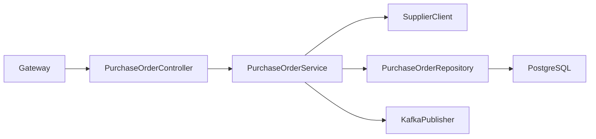
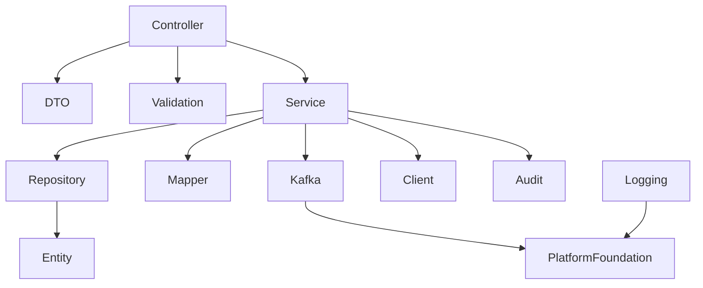
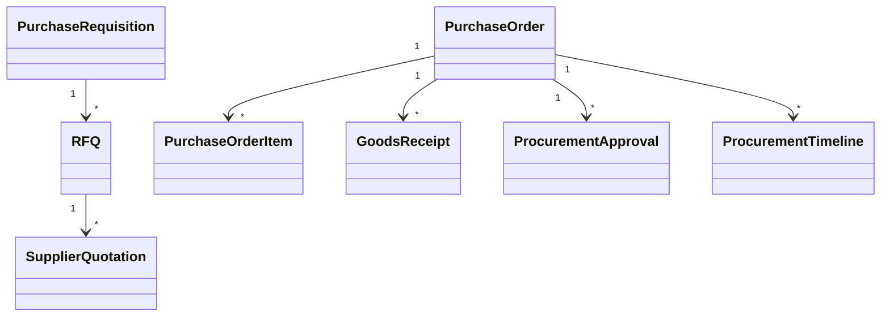

# LLD-014: Procurement Service (Revised)

# 1. Document Information

| Field       | Value                                  |
| ----------- | -------------------------------------- |
| Project     | Distributed Hub & Sales (DHS) Platform |
| Service     | Procurement Service                    |
| Document    | Low Level Design                       |
| Document ID | LLD-014                                |
| Repository  | starone-dhs-platform                   |
| Module      | procurement-service                    |
| Version     | v1.0.0                                 |
| Status      | Draft                                  |
| Standard    | IEEE 1016                              |
| Owner       | Enterprise Architecture                |

---

# 2. Purpose

This document defines the implementation-level architecture of the Procurement Service.

The Procurement Service manages the complete procure-to-receipt lifecycle including Purchase Requisitions (PR), Purchase Orders (PO), RFQ processing, Supplier Quotations, Purchase Approvals, Goods Receipts (GRN), Procurement Analytics, and Procurement Event Publishing.

Supplier master management is delegated to the **Supplier Service**, which acts as the enterprise Supplier Master.

This document implements the requirements defined in **SRS-014 – Procurement Service (Revised)**.

---

# 3. Scope

The Procurement Service provides

- Purchase Requisition Management
- Purchase Order Management
- Request for Quotation (RFQ)
- Supplier Quotation Evaluation
- Purchase Approval Workflow
- Goods Receipt Note (GRN)
- Procurement Tracking
- Procurement Search
- Procurement Analytics
- Procurement Timeline
- Procurement Event Publishing

The Procurement Service shall not own

- Supplier Master
- Supplier Contacts
- Supplier Contracts
- Supplier Compliance
- Inventory Stock
- Warehouse Master
- Product Master
- Billing

Supplier master information shall always be retrieved from **Supplier Service**.

---

# 4. Design Principles

## PRC-DP-001

Procurement shall consume Supplier Service as the authoritative Supplier Master.

---

## PRC-DP-002

Purchase Orders shall reference suppliers using **supplierId** only.

---

## PRC-DP-003

Procurement lifecycle shall be state-driven.

---

## PRC-DP-004

Purchase approvals shall be workflow-based.

---

## PRC-DP-005

Goods Receipt shall update Inventory through domain events.

---

## PRC-DP-006

Infrastructure concerns shall reuse Platform Foundation.

---

# 5. Package Structure

```text
procurement-service
│
├── config
├── controller
├── service
├── repository
├── entity
├── dto
├── mapper
├── validation
├── kafka
├── exception
├── audit
├── scheduler
├── util
└── client
```

---

# 6. Maven Module Structure

```text
procurement-service
│
├── api
├── application
├── domain
├── infrastructure
└── bootstrap
```

---

# 7. Layered Architecture

```text
REST API

↓

Controller

↓

Application Service

↓

Procurement Domain

↓

Repository

↓

PostgreSQL
```

Platform Foundation provides

- Security
- Logging
- Validation
- Kafka
- OpenFeign
- Exception Handling
- Audit
- Observability

---

# 8. Package Design

## controller

```text
controller
│
├── PurchaseRequisitionController
├── PurchaseOrderController
├── RFQController
├── SupplierQuotationController
├── GoodsReceiptController
├── ProcurementApprovalController
├── ProcurementSearchController
└── ProcurementTimelineController
```

---

## service

```text
service
│
├── PurchaseRequisitionService
├── PurchaseOrderService
├── RFQService
├── SupplierQuotationService
├── GoodsReceiptService
├── ProcurementApprovalService
├── ProcurementTimelineService
├── ProcurementSearchService
├── ProcurementValidationService
└── ProcurementAuditService
```

---

## repository

```text
repository
│
├── PurchaseRequisitionRepository
├── PurchaseOrderRepository
├── PurchaseOrderItemRepository
├── RFQRepository
├── SupplierQuotationRepository
├── GoodsReceiptRepository
├── ProcurementApprovalRepository
└── ProcurementTimelineRepository
```

---

## entity

```text
entity
│
├── PurchaseRequisition
├── PurchaseOrder
├── PurchaseOrderItem
├── RFQ
├── SupplierQuotation
├── GoodsReceipt
├── ProcurementApproval
├── ProcurementTimeline
└── ProcurementAudit
```

---

## dto

```text
dto
│
├── request
├── response
└── event
```

---

## kafka

```text
kafka
│
├── producer
├── consumer
└── configuration
```

---

## client

```text
client
│
├── SupplierClient
├── InventoryClient
├── NotificationClient
└── AuditClient
```

---

# 9. Component Diagram



---

# 10. Package Dependency Diagram



---

# 11. Domain Responsibilities

| Component            | Responsibility             |
| -------------------- | -------------------------- |
| Purchase Requisition | Procurement Request        |
| Purchase Order       | Procurement Contract       |
| RFQ                  | Supplier Quotation Process |
| Supplier Quotation   | Supplier Pricing           |
| Goods Receipt        | Receipt Confirmation       |
| Procurement Approval | Approval Workflow          |
| Procurement Timeline | Lifecycle History          |

---

# 12. Service Boundaries

Procurement Service owns

- Purchase Requisitions
- Purchase Orders
- RFQs
- Supplier Quotations
- Goods Receipts
- Procurement Approvals
- Procurement Timeline

Procurement Service does not own

- Supplier Master
- Supplier Contacts
- Supplier Compliance
- Supplier Contracts
- Inventory Master
- Product Master
- Warehouse Master

Supplier information shall always be retrieved using **SupplierClient**.

---

# 13. Architecture Constraints

- Controllers shall remain stateless.
- Controllers shall never access repositories directly.
- Services shall contain business logic.
- Purchase Order Numbers shall be immutable.
- Procurement lifecycle shall follow approved state transitions.
- Supplier validation shall always use Supplier Service.
- Repository layer shall contain persistence only.
- Kafka events shall publish after successful transaction commit.
- DTOs shall never expose entities.
- All entities shall extend AuditableEntity.
- APIs shall return ApiResponse<T>.

---

# 14. Class Design

The Procurement Service shall implement classes for Purchase Requisition management, Purchase Order management, RFQ processing, Supplier Quotation evaluation, Goods Receipt processing, approval workflows, procurement tracking, and procurement analytics.

The implementation shall follow Layered Architecture and Domain-Driven Design (DDD).

---

# 15. Controller Layer Design

The Controller layer shall expose REST APIs and delegate business processing to the Service layer.

Controllers shall remain stateless.

## Package Structure

```text
controller
│
├── PurchaseRequisitionController
├── PurchaseOrderController
├── RFQController
├── SupplierQuotationController
├── GoodsReceiptController
├── ProcurementApprovalController
├── ProcurementSearchController
└── ProcurementTimelineController
```

---

## PurchaseRequisitionController

### Responsibilities

- Create Purchase Requisition
- Update Purchase Requisition
- Submit for Approval
- Cancel Requisition
- View Purchase Requisition

### APIs

```text
POST   /api/v1/procurement/requisitions

PUT    /api/v1/procurement/requisitions/{requisitionId}

GET    /api/v1/procurement/requisitions/{requisitionId}

PUT    /api/v1/procurement/requisitions/{requisitionId}/submit

PUT    /api/v1/procurement/requisitions/{requisitionId}/cancel
```

---

## PurchaseOrderController

Responsibilities

- Create Purchase Order
- Update Purchase Order
- Approve Purchase Order
- Issue Purchase Order
- Cancel Purchase Order
- View Purchase Order

---

## RFQController

Responsibilities

- Create RFQ
- Publish RFQ
- Close RFQ
- View RFQ

---

## SupplierQuotationController

Responsibilities

- Record Supplier Quotation
- Evaluate Quotations
- Award Supplier
- View Quotations

---

## GoodsReceiptController

Responsibilities

- Create GRN
- Update GRN
- Complete Receipt
- Reject Receipt

---

## ProcurementApprovalController

Responsibilities

- Approve Purchase Requisition
- Reject Purchase Requisition
- Approve Purchase Order
- Reject Purchase Order

---

## ProcurementSearchController

Responsibilities

- Search Procurement Documents
- Advanced Search
- Procurement Dashboard

---

## ProcurementTimelineController

Responsibilities

- Procurement Timeline
- Approval Timeline
- Audit Timeline

---

# 16. Service Layer Design

Business logic shall reside in the Service layer.

## Package Structure

```text
service
│
├── PurchaseRequisitionService
├── PurchaseOrderService
├── RFQService
├── SupplierQuotationService
├── GoodsReceiptService
├── ProcurementApprovalService
├── ProcurementTimelineService
├── ProcurementSearchService
├── ProcurementValidationService
└── ProcurementAuditService
```

---

## PurchaseRequisitionService

### Responsibilities

- Create Requisition
- Submit for Approval
- Cancel Requisition
- Retrieve Requisition

### Public Methods

```java
createPurchaseRequisition()

updatePurchaseRequisition()

submitForApproval()

cancelPurchaseRequisition()

getPurchaseRequisition()
```

---

## PurchaseOrderService

Responsibilities

- Create Purchase Order
- Approve Purchase Order
- Issue Purchase Order
- Cancel Purchase Order

---

## RFQService

Responsibilities

- RFQ Creation
- RFQ Publishing
- RFQ Closure

---

## SupplierQuotationService

Responsibilities

- Receive Quotations
- Supplier Evaluation
- Award Recommendation

---

## GoodsReceiptService

Responsibilities

- GRN Processing
- Goods Validation
- Inventory Notification

---

## ProcurementApprovalService

Responsibilities

- Approval Workflow
- Approval Validation
- Escalation Rules

---

## ProcurementTimelineService

Responsibilities

- Timeline Generation
- Procurement History

---

## ProcurementSearchService

Responsibilities

- Search
- Filtering
- Pagination
- Sorting

---

# 17. Repository Layer Design

Repositories shall encapsulate persistence logic only.

## Package Structure

```text
repository
│
├── PurchaseRequisitionRepository
├── PurchaseOrderRepository
├── PurchaseOrderItemRepository
├── RFQRepository
├── SupplierQuotationRepository
├── GoodsReceiptRepository
├── ProcurementApprovalRepository
└── ProcurementTimelineRepository
```

---

## Repository Responsibilities

| Repository                    | Responsibility        |
| ----------------------------- | --------------------- |
| PurchaseRequisitionRepository | Purchase Requisitions |
| PurchaseOrderRepository       | Purchase Orders       |
| PurchaseOrderItemRepository   | Purchase Order Items  |
| RFQRepository                 | RFQs                  |
| SupplierQuotationRepository   | Supplier Quotations   |
| GoodsReceiptRepository        | Goods Receipts        |
| ProcurementApprovalRepository | Approval Workflow     |
| ProcurementTimelineRepository | Procurement Timeline  |

---

# 18. DTO Design

## Request DTOs

```text
dto.request
│
├── PurchaseRequisitionRequest
├── PurchaseOrderRequest
├── RFQRequest
├── SupplierQuotationRequest
├── GoodsReceiptRequest
├── ProcurementApprovalRequest
└── ProcurementSearchRequest
```

---

## Response DTOs

```text
dto.response
│
├── PurchaseRequisitionResponse
├── PurchaseOrderResponse
├── RFQResponse
├── SupplierQuotationResponse
├── GoodsReceiptResponse
├── ProcurementApprovalResponse
└── ProcurementTimelineResponse
```

---

## PurchaseOrderResponse

| Field                | Type                |
| -------------------- | ------------------- |
| purchaseOrderId      | UUID                |
| purchaseOrderNumber  | String              |
| supplierId           | UUID                |
| purchaseOrderStatus  | PurchaseOrderStatus |
| orderDate            | LocalDate           |
| expectedDeliveryDate | LocalDate           |
| totalAmount          | BigDecimal          |

---

# 19. Entity Design

All entities shall extend **AuditableEntity**.

---

## Package Structure

```text
entity
│
├── PurchaseRequisition
├── PurchaseOrder
├── PurchaseOrderItem
├── RFQ
├── SupplierQuotation
├── GoodsReceipt
├── ProcurementApproval
├── ProcurementTimeline
└── ProcurementAudit
```

---

## PurchaseRequisition

| Attribute         | Type                |
| ----------------- | ------------------- |
| id                | UUID                |
| requisitionNumber | String              |
| requisitionDate   | LocalDate           |
| requesterId       | UUID                |
| departmentId      | UUID                |
| priority          | ProcurementPriority |
| status            | RequisitionStatus   |

---

## PurchaseOrder

| Attribute            | Type                |
| -------------------- | ------------------- |
| id                   | UUID                |
| purchaseOrderNumber  | String              |
| supplierId           | UUID                |
| orderDate            | LocalDate           |
| expectedDeliveryDate | LocalDate           |
| currency             | String              |
| totalAmount          | BigDecimal          |
| status               | PurchaseOrderStatus |

---

## PurchaseOrderItem

| Attribute       | Type       |
| --------------- | ---------- |
| id              | UUID       |
| purchaseOrderId | UUID       |
| productId       | UUID       |
| orderedQuantity | BigDecimal |
| unitPrice       | BigDecimal |
| taxAmount       | BigDecimal |
| lineTotal       | BigDecimal |

---

## RFQ

| Attribute     | Type      |
| ------------- | --------- |
| id            | UUID      |
| rfqNumber     | String    |
| requisitionId | UUID      |
| closingDate   | LocalDate |
| status        | RFQStatus |

---

## SupplierQuotation

| Attribute       | Type            |
| --------------- | --------------- |
| id              | UUID            |
| rfqId           | UUID            |
| supplierId      | UUID            |
| quotationNumber | String          |
| quotedAmount    | BigDecimal      |
| deliveryDays    | Integer         |
| status          | QuotationStatus |

---

## GoodsReceipt

| Attribute       | Type               |
| --------------- | ------------------ |
| id              | UUID               |
| grnNumber       | String             |
| purchaseOrderId | UUID               |
| supplierId      | UUID               |
| receiptDate     | LocalDate          |
| receivedBy      | UUID               |
| receiptStatus   | GoodsReceiptStatus |

---

## ProcurementApproval

| Attribute      | Type                    |
| -------------- | ----------------------- |
| id             | UUID                    |
| documentType   | ProcurementDocumentType |
| documentId     | UUID                    |
| approverId     | UUID                    |
| approvalLevel  | Integer                 |
| approvalStatus | ApprovalStatus          |
| approvedAt     | Instant                 |

---

## ProcurementTimeline

| Attribute      | Type                    |
| -------------- | ----------------------- |
| id             | UUID                    |
| documentType   | ProcurementDocumentType |
| documentId     | UUID                    |
| eventType      | String                  |
| eventTimestamp | Instant                 |
| remarks        | String                  |

---

# 20. Mapper Design

MapStruct shall be the standard mapping framework.

## Package Structure

```text
mapper
│
├── PurchaseRequisitionMapper
├── PurchaseOrderMapper
├── PurchaseOrderItemMapper
├── RFQMapper
├── SupplierQuotationMapper
├── GoodsReceiptMapper
├── ProcurementApprovalMapper
└── ProcurementTimelineMapper
```

---

## Responsibilities

- DTO → Entity
- Entity → DTO
- Partial Updates
- Page Mapping

---

# 21. Validation Design

## Package Structure

```text
validation
│
├── annotation
├── validator
└── groups
```

---

## Validators

```text
PurchaseRequisitionValidator

PurchaseOrderValidator

RFQValidator

SupplierQuotationValidator

GoodsReceiptValidator

ProcurementApprovalValidator
```

---

## Validation Rules

| Validator                    | Purpose                       |
| ---------------------------- | ----------------------------- |
| PurchaseRequisitionValidator | Requisition Validation        |
| PurchaseOrderValidator       | Purchase Order Validation     |
| RFQValidator                 | RFQ Validation                |
| SupplierQuotationValidator   | Supplier Quotation Validation |
| GoodsReceiptValidator        | Goods Receipt Validation      |
| ProcurementApprovalValidator | Approval Validation           |

---

# 22. Exception Hierarchy

```text
RuntimeException
        │
        └── PlatformException
                │
                ├── PurchaseRequisitionNotFoundException
                ├── PurchaseOrderNotFoundException
                ├── RFQNotFoundException
                ├── SupplierQuotationNotFoundException
                ├── GoodsReceiptNotFoundException
                ├── ProcurementApprovalException
                ├── InvalidProcurementStateException
                ├── SupplierValidationException
                └── ProcurementSearchException
```

---

# 23. Purchase Requisition Flow

```mermaid
sequenceDiagram

Client->>PurchaseRequisitionController

PurchaseRequisitionController->>PurchaseRequisitionService

PurchaseRequisitionService->>PurchaseRequisitionRepository

PurchaseRequisitionRepository-->>PurchaseRequisitionService

PurchaseRequisitionService->>KafkaPublisher

PurchaseRequisitionController-->>Client
```

---

# 24. Purchase Order Flow

```mermaid
sequenceDiagram

Client->>PurchaseOrderController

PurchaseOrderController->>PurchaseOrderService

PurchaseOrderService->>SupplierClient

SupplierClient-->>PurchaseOrderService

PurchaseOrderService->>PurchaseOrderRepository

PurchaseOrderRepository-->>PurchaseOrderService

PurchaseOrderController-->>Client
```

---

# 25. RFQ Flow

```mermaid
sequenceDiagram

Buyer->>RFQController

RFQController->>RFQService

RFQService->>RFQRepository

RFQRepository-->>RFQService

RFQController-->>Buyer
```

---

# 26. Goods Receipt Flow

```mermaid
sequenceDiagram

Warehouse->>GoodsReceiptController

GoodsReceiptController->>GoodsReceiptService

GoodsReceiptService->>GoodsReceiptRepository

GoodsReceiptService->>KafkaPublisher

GoodsReceiptController-->>Warehouse
```

---

# 27. Procurement Approval Flow

```mermaid
sequenceDiagram

Approver->>ProcurementApprovalController

ProcurementApprovalController->>ProcurementApprovalService

ProcurementApprovalService->>ProcurementApprovalRepository

ProcurementApprovalRepository-->>ProcurementApprovalService

ProcurementApprovalController-->>Approver
```

---

# 28. Class Diagram



---

# 29. Design Constraints

- Supplier validation shall always use Supplier Service.
- Purchase Order shall reference Supplier using `supplierId`.
- Procurement lifecycle shall follow approved state transitions.
- Goods Receipt shall publish inventory update events.
- Purchase Order Number shall be immutable.
- Controllers shall remain stateless.
- Services shall contain all business logic.
- Repository layer shall contain persistence only.
- Kafka events shall publish after successful transaction commit.
- DTOs shall never expose JPA entities.
- All entities shall extend `AuditableEntity`.
- APIs shall return `ApiResponse<T>`.

---

# 30. Security Configuration

The Procurement Service shall inherit the enterprise security framework from the Platform Foundation.

Authentication shall be delegated to the Identity Service.

Authorization shall be enforced using Role-Based Access Control (RBAC).

---

## 30.1 Security Architecture

```text
Client

↓

API Gateway

↓

JWT Authentication Filter

↓

Authorization Filter

↓

Procurement Controller

↓

Procurement Service
```

---

## 30.2 Security Components

```text
security
│
├── config
│   ├── SecurityConfiguration
│   ├── MethodSecurityConfiguration
│   └── CorsConfiguration
│
├── filter
│   ├── JwtAuthenticationFilter
│   ├── AuthorizationFilter
│   └── CorrelationIdFilter
│
├── permission
│   ├── ProcurementPermissionEvaluator
│   └── ProcurementAccessValidator
│
└── annotation
    └── RequireProcurementPermission
```

---

## 30.3 Permissions

| Permission                      | Description                  |
| ------------------------------- | ---------------------------- |
| PROCUREMENT_REQUISITION_CREATE  | Create Purchase Requisition  |
| PROCUREMENT_REQUISITION_APPROVE | Approve Purchase Requisition |
| PROCUREMENT_PO_CREATE           | Create Purchase Order        |
| PROCUREMENT_PO_APPROVE          | Approve Purchase Order       |
| PROCUREMENT_PO_CANCEL           | Cancel Purchase Order        |
| PROCUREMENT_RFQ_MANAGE          | Manage RFQs                  |
| PROCUREMENT_QUOTATION_MANAGE    | Manage Supplier Quotations   |
| PROCUREMENT_GRN_CREATE          | Create Goods Receipt         |
| PROCUREMENT_GRN_APPROVE         | Approve Goods Receipt        |
| PROCUREMENT_VIEW                | View Procurement Documents   |

---

## 30.4 Authorization Flow

```mermaid
sequenceDiagram

Client->>Gateway: JWT

Gateway->>Identity Service: Validate Token

Identity Service-->>Gateway: Claims

Gateway->>Procurement Service

Procurement Service->>PermissionEvaluator

PermissionEvaluator-->>Procurement Service

Procurement Service-->>Client
```

---

# 31. JWT Implementation

JWT validation shall be handled by Platform Foundation.

Procurement Service shall consume authenticated user information from Spring Security.

---

## Required Claims

```json
{
  "sub": "UUID",
  "username": "procurement.manager",
  "roles": ["PROCUREMENT_MANAGER"],
  "permissions": [
    "PROCUREMENT_PO_CREATE",
    "PROCUREMENT_PO_APPROVE",
    "PROCUREMENT_VIEW"
  ],
  "tenantId": "UUID",
  "branchId": "UUID"
}
```

---

## User Context

Every request shall expose

```text
UserId

Username

Roles

Permissions

TenantId

BranchId

CorrelationId
```

---

# 32. Authorization Design

Permission-based authorization shall be implemented.

---

## Example

```java
@PreAuthorize("hasAuthority('PROCUREMENT_PO_CREATE')")
```

or

```java
@RequireProcurementPermission("PROCUREMENT_PO_CREATE")
```

---

## Permission Matrix

| API                          | Permission                      |
| ---------------------------- | ------------------------------- |
| Create Purchase Requisition  | PROCUREMENT_REQUISITION_CREATE  |
| Approve Purchase Requisition | PROCUREMENT_REQUISITION_APPROVE |
| Create Purchase Order        | PROCUREMENT_PO_CREATE           |
| Approve Purchase Order       | PROCUREMENT_PO_APPROVE          |
| Cancel Purchase Order        | PROCUREMENT_PO_CANCEL           |
| Manage RFQ                   | PROCUREMENT_RFQ_MANAGE          |
| Manage Supplier Quotations   | PROCUREMENT_QUOTATION_MANAGE    |
| Create Goods Receipt         | PROCUREMENT_GRN_CREATE          |
| Approve Goods Receipt        | PROCUREMENT_GRN_APPROVE         |
| View Procurement             | PROCUREMENT_VIEW                |

---

# 33. Kafka Design

Procurement Service shall publish procurement lifecycle events.

---

## Published Topics

```text
purchase.requisition.created.v1

purchase.requisition.approved.v1

purchase.order.created.v1

purchase.order.approved.v1

purchase.order.issued.v1

purchase.order.cancelled.v1

rfq.created.v1

rfq.published.v1

supplier.quotation.received.v1

supplier.awarded.v1

goods.receipt.created.v1

goods.receipt.completed.v1
```

---

## Consumed Topics

```text
supplier.created.v1

supplier.updated.v1

supplier.deactivated.v1

inventory.stock.updated.v1

inventory.receipt.completed.v1

notification.delivery.completed.v1
```

---

## Kafka Package

```text
kafka
│
├── producer
├── consumer
├── configuration
├── mapper
└── event
```

---

## Event Envelope

```json
{
  "eventId": "UUID",
  "eventType": "PurchaseOrderCreated",
  "eventVersion": "1.0",
  "occurredAt": "2026-06-27T10:00:00Z",
  "correlationId": "UUID",
  "payload": {}
}
```

---

# 34. OpenFeign Design

Procurement Service shall use synchronous communication only for validation and reference lookups.

---

## Feign Clients

```text
client
│
├── SupplierClient
├── ProductClient
├── InventoryClient
├── IdentityClient
├── NotificationClient
└── AuditClient
```

---

## Responsibilities

| Client             | Responsibility                         |
| ------------------ | -------------------------------------- |
| SupplierClient     | Supplier Validation & Supplier Details |
| ProductClient      | Product Validation                     |
| InventoryClient    | Stock Receipt Validation               |
| IdentityClient     | User Validation                        |
| NotificationClient | Procurement Notifications              |
| AuditClient        | Audit Submission                       |

---

# 35. Configuration Classes

```text
config
│
├── SecurityConfiguration
├── KafkaConfiguration
├── FeignConfiguration
├── CacheConfiguration
├── JacksonConfiguration
├── ValidationConfiguration
├── SchedulerConfiguration
├── MetricsConfiguration
├── ProcurementConfiguration
└── OpenApiConfiguration
```

---

## Responsibilities

| Configuration | Responsibility       |
| ------------- | -------------------- |
| Security      | Spring Security      |
| Kafka         | Kafka Infrastructure |
| Feign         | OpenFeign            |
| Cache         | Redis                |
| Validation    | Bean Validation      |
| Scheduler     | Procurement Jobs     |
| Metrics       | Micrometer           |
| Procurement   | Procurement Engine   |
| OpenAPI       | Swagger              |

---

# 36. Transaction Design

Procurement transactions shall remain local.

Cross-service consistency shall be achieved using event-driven integration.

---

## Transaction Types

| Operation                   | Propagation  |
| --------------------------- | ------------ |
| Create Purchase Requisition | REQUIRED     |
| Create Purchase Order       | REQUIRED     |
| Approve Purchase Order      | REQUIRED     |
| Record Goods Receipt        | REQUIRED     |
| Publish Event               | AFTER_COMMIT |

---

## Transaction Flow

```mermaid
flowchart LR

Controller

-->

ProcurementService

-->

Repository

-->

Commit

-->

Kafka Publish
```

---

# 37. Cache Design

Redis shall cache frequently accessed procurement reference data.

---

## Cached Objects

```text
Approved Purchase Orders

Supplier Summary

Procurement Dashboard

Open RFQs

Approval Matrix
```

---

## Cache Annotations

```java
@Cacheable

@CachePut

@CacheEvict
```

---

# 38. Resilience Patterns

Procurement Service shall implement Resilience4j.

---

## Retry

Supplier Service

Product Service

Inventory Service

Notification Service

---

## Circuit Breaker

Supplier Service

Inventory Service

Notification Service

Audit Service

---

## Bulkhead

External Service Calls

---

## Rate Limiter

Purchase Order APIs

RFQ APIs

Supplier Quotation APIs

---

## Timeout

All OpenFeign Clients

---

# 39. Scheduler Design

Scheduled jobs shall support procurement lifecycle management.

---

## Scheduled Jobs

```text
scheduler
│
├── PurchaseOrderExpiryScheduler
├── RFQClosingScheduler
├── SupplierReminderScheduler
├── ProcurementDashboardRefreshScheduler
├── ProcurementCacheRefreshScheduler
└── ProcurementCleanupScheduler
```

---

# 40. External Integration Design

| Service              | Purpose                   |
| -------------------- | ------------------------- |
| Supplier Service     | Supplier Master           |
| Product Service      | Product Validation        |
| Inventory Service    | Goods Receipt Integration |
| Notification Service | Procurement Notifications |
| Audit Service        | Audit Logging             |
| Identity Service     | User Validation           |

---

# 41. Configuration Properties

| Property                     | Default |
| ---------------------------- | ------- |
| procurement.cache.enabled    | true    |
| procurement.cache.ttl        | 3600    |
| procurement.rfq.default.days | 7       |
| procurement.approval.enabled | true    |
| procurement.kafka.retry      | 3       |

---

# 42. Data Consistency Strategy

- Purchase Order Number shall remain unique.
- Purchase Orders shall always reference `supplierId`.
- Supplier validation shall always use Supplier Service.
- Goods Receipt completion shall publish inventory events.
- Kafka events shall publish only after successful transaction commit.

---

# 43. Performance Considerations

- Procurement search shall support pagination.
- Dashboard data shall use Redis cache.
- RFQ evaluation shall execute asynchronously.
- Procurement timeline shall be indexed.
- Goods Receipt processing shall publish asynchronous inventory events.

---

# 44. Design Constraints

- Procurement shall never own Supplier Master.
- Supplier validation shall always use Supplier Service.
- JWT authentication shall be mandatory.
- Authorization shall be permission-based.
- Repository layer shall never invoke external services.
- Configuration shall be externalized.
- Kafka events shall publish after successful transaction commit.
- Correlation ID shall propagate across outbound requests.

---

# 45. Technology Standards

| Concern           | Technology              |
| ----------------- | ----------------------- |
| Java              | Java 21                 |
| Framework         | Spring Boot 3.x         |
| Security          | Spring Security 6       |
| Authentication    | JWT                     |
| Authorization     | RBAC                    |
| Database          | PostgreSQL              |
| Cache             | Redis                   |
| Messaging         | Apache Kafka            |
| Service Calls     | OpenFeign               |
| Validation        | Jakarta Bean Validation |
| Mapping           | MapStruct               |
| Logging           | SLF4J + Logback         |
| Metrics           | Micrometer              |
| Tracing           | OpenTelemetry           |
| Service Discovery | Eureka                  |

---

# 46. Logging Design

The Procurement Service shall implement centralized structured logging using the Platform Foundation logging framework.

Every procurement operation, supplier validation, approval workflow, purchase order processing, goods receipt, and RFQ lifecycle event shall be logged using standardized MDC attributes.

---

## 46.1 Logging Architecture

```text
REST Request

↓

Correlation Filter

↓

Logging Aspect

↓

SLF4J

↓

Logback

↓

ELK / OpenSearch / Splunk
```

---

## 46.2 Log Levels

| Level | Purpose                         |
| ----- | ------------------------------- |
| TRACE | Framework Diagnostics           |
| DEBUG | Development                     |
| INFO  | Procurement Business Events     |
| WARN  | Recoverable Business Errors     |
| ERROR | Procurement Processing Failures |

---

## 46.3 MDC Context

Every log entry shall include

```text
Correlation ID

Trace ID

Span ID

Purchase Requisition ID

Purchase Order ID

RFQ ID

Goods Receipt ID

Supplier ID

Tenant ID

Branch ID

User ID

Request URI

HTTP Method

Service Name

Environment
```

---

## 46.4 Business Events

The following operations shall always be logged.

- Purchase Requisition Created
- Purchase Requisition Approved
- Purchase Requisition Rejected
- Purchase Order Created
- Purchase Order Approved
- Purchase Order Issued
- Purchase Order Cancelled
- RFQ Created
- RFQ Published
- RFQ Closed
- Supplier Quotation Received
- Supplier Selected
- Goods Receipt Created
- Goods Receipt Completed
- Inventory Update Event Published

---

## 46.5 Sensitive Data

The following shall never be logged.

- JWT Tokens
- Authorization Headers
- Supplier Banking Information
- Internal Approval Comments
- Procurement Pricing Rules
- API Keys
- Encryption Keys

---

# 47. Observability

Procurement Service shall expose operational metrics using Micrometer.

---

## JVM Metrics

- Heap Usage
- CPU Usage
- Thread Count
- Garbage Collection

---

## Business Metrics

- Purchase Requisitions Created
- Purchase Orders Created
- Purchase Orders Approved
- Purchase Orders Cancelled
- Open RFQs
- Supplier Quotations Received
- Goods Receipts Completed
- Procurement Approval Time
- Supplier Validation Requests
- Procurement Search Requests

---

## Infrastructure Metrics

- Database Connections
- Kafka Publish Rate
- Kafka Consumer Lag
- Redis Cache Hit Ratio
- API Response Time
- OpenFeign Latency

---

# 48. Distributed Tracing

Every procurement request shall propagate distributed tracing metadata.

---

## Trace Flow

```mermaid
sequenceDiagram

Client->>Gateway

Gateway->>Procurement Service

Procurement Service->>Supplier Service

Procurement Service->>Product Service

Procurement Service->>Inventory Service

Procurement Service->>Notification Service

Procurement Service->>Audit Service

Procurement Service-->>Gateway

Gateway-->>Client
```

---

## Trace Context

Every request shall propagate

- Correlation ID
- Trace ID
- Span ID

---

# 49. Health Checks

Procurement Service shall expose Spring Boot Actuator endpoints.

---

## Health

```text
GET /actuator/health
```

---

## Liveness

```text
GET /actuator/health/liveness
```

---

## Readiness

```text
GET /actuator/health/readiness
```

Dependencies

- PostgreSQL
- Redis
- Kafka
- Config Server
- Supplier Service
- Inventory Service

---

## Metrics

```text
GET /actuator/metrics
```

---

## Prometheus

```text
GET /actuator/prometheus
```

---

# 50. Deployment Design

Procurement Service shall be deployed as an independent containerized microservice.

---

## Deployment Architecture

```text
Gateway

↓

Procurement Service

↓

PostgreSQL

↓

Redis

↓

Kafka
```

---

## Kubernetes Resources

```text
Deployment

Service

Ingress

ConfigMap

Secret

HorizontalPodAutoscaler

ServiceMonitor

PodDisruptionBudget
```

---

# 51. Dependency Management

Procurement Service shall inherit the Platform Foundation BOM.

```xml
<dependencyManagement>

<dependency>

<groupId>com.starone</groupId>

<artifactId>platform-foundation-bom</artifactId>

</dependency>

</dependencyManagement>
```

---

## Primary Dependencies

- Spring Boot
- Spring Security
- Spring Data JPA
- Spring Kafka
- Spring Validation
- PostgreSQL Driver
- Redis
- OpenFeign
- Micrometer
- OpenTelemetry
- MapStruct
- Lombok

---

# 52. Coding Standards

Procurement Service shall comply with enterprise coding standards.

---

## Controller

- Stateless
- Validation Only
- No Business Logic

---

## Service

- Stateless
- Transactional
- Business Orchestration

---

## Repository

- Persistence Only
- No External Service Calls

---

## DTO

- Immutable
- Validation Annotations

---

## Entity

- Extend AuditableEntity
- Never Exposed Directly

---

# 53. Package Naming Standards

```text
com.starone.procurement

├── controller
├── service
├── repository
├── entity
├── dto
├── mapper
├── validation
├── config
├── kafka
├── exception
├── scheduler
├── audit
├── client
└── util
```

---

# 54. Testing Strategy

## Unit Testing

Framework

```text
JUnit 5

Mockito
```

Coverage

```text
Minimum 90%
```

---

## Integration Testing

- Spring Boot Test
- Testcontainers
- Embedded Kafka

---

## API Testing

- REST Assured
- Spring MockMvc

---

## Procurement Testing

- Purchase Requisition Workflow
- Purchase Order Lifecycle
- RFQ Workflow
- Supplier Quotation Evaluation
- Approval Workflow
- Goods Receipt Processing
- Supplier Validation
- Inventory Event Publishing

---

## Performance Testing

- Concurrent Purchase Order Creation
- RFQ Processing
- Goods Receipt Processing
- Supplier Lookup Performance
- Procurement Search

---

## Static Analysis

- SonarQube
- SpotBugs
- PMD
- Checkstyle

---

# 55. Build Validation

Every Pull Request shall verify

- Compilation
- Unit Tests
- Integration Tests
- Procurement Workflow Tests
- Static Analysis
- Security Scan
- Dependency Scan
- Documentation Validation
- Code Coverage

---

# 56. Quality Gates

| Metric                     | Target    |
| -------------------------- | --------- |
| Unit Test Coverage         | ≥90%      |
| Integration Tests          | 100% Pass |
| Procurement Workflow Tests | 100% Pass |
| Critical Bugs              | 0         |
| Critical Vulnerabilities   | 0         |
| Code Duplication           | <3%       |
| Documentation              | Mandatory |

---

# 57. Implementation Guidelines

Procurement Service shall reuse Platform Foundation components.

Business code shall never duplicate

- JWT Security
- Logging
- Validation
- Kafka Infrastructure
- Exception Handling
- Audit Framework
- API Response Models
- Pagination Framework

Supplier information shall always be obtained through Supplier Service.

Inventory updates shall always be event-driven.

---

# 58. Extension Guidelines

Business-specific functionality shall extend Platform Foundation components where applicable.

Permitted extensions include

- AuditableEntity
- PlatformException
- ApiResponse
- BaseMapper
- AuditService

Platform Foundation source code shall never be modified by Procurement Service.

---

# 59. Design Checklist

Before implementation verify

- Supplier validation integrated
- Purchase Order lifecycle implemented
- Approval workflow configured
- RFQ workflow implemented
- Goods Receipt events published
- Inventory integration completed
- Controllers contain no business logic
- Services remain stateless
- Repository layer contains persistence only
- Kafka events publish after successful transaction commit
- Redis cache configured
- Correlation ID propagation enabled
- Health endpoints exposed
- Metrics published
- Configuration externalized
- Unit test coverage meets quality gates

---

# 60. Appendix A – Framework Versions

| Component       | Version          |
| --------------- | ---------------- |
| Java            | 21               |
| Spring Boot     | 3.x              |
| Spring Security | 6.x              |
| Spring Cloud    | 2025.x           |
| PostgreSQL      | Latest Supported |
| Redis           | Latest Supported |
| Kafka           | Latest Supported |
| OpenFeign       | Latest Supported |
| Micrometer      | Latest Supported |
| OpenTelemetry   | Latest Supported |
| MapStruct       | Latest Stable    |
| Lombok          | Latest Stable    |
| JUnit           | 5.x              |

---

# 61. Appendix B – Layer Responsibility Matrix

| Layer      | Responsibility             |
| ---------- | -------------------------- |
| Controller | Request Handling           |
| Service    | Procurement Business Logic |
| Repository | Persistence                |
| Kafka      | Event Publishing           |
| Mapper     | DTO Conversion             |
| Validation | Request Validation         |
| Audit      | Procurement Audit          |

---

# 62. Appendix C – Procurement Components

```text
PurchaseRequisitionController

PurchaseOrderController

RFQController

SupplierQuotationController

GoodsReceiptController

ProcurementApprovalController

ProcurementSearchController

ProcurementTimelineController

PurchaseRequisitionService

PurchaseOrderService

RFQService

SupplierQuotationService

GoodsReceiptService

ProcurementApprovalService

ProcurementTimelineService

ProcurementSearchService

PurchaseRequisitionRepository

PurchaseOrderRepository

PurchaseOrderItemRepository

RFQRepository

SupplierQuotationRepository

GoodsReceiptRepository

ProcurementApprovalRepository

ProcurementTimelineRepository
```

---

# 63. Appendix D – Procurement Processing Summary

```text
Client

↓

Gateway

↓

JWT Authentication

↓

Authorization

↓

Controller

↓

Procurement Service

↓

Supplier Validation

↓

Repository

↓

Kafka Events

↓

Inventory Update

↓

Audit Events

↓

Response
```

---

# 64. Appendix E – Repository Responsibilities

| Repository                    | Responsibility                                  |
| ----------------------------- | ----------------------------------------------- |
| starone-galaxy-architecture   | Enterprise Standards, Governance & Architecture |
| starone-galaxy-central-config | Configuration Management                        |
| starone-galaxy-infra          | Kubernetes, Infrastructure & CI/CD              |
| starone-dhs-platform          | Procurement Service Implementation              |

---

# 65. Conclusion

The Procurement Service is the centralized procure-to-pay orchestration component of the DHS platform. It manages purchase requisitions, purchase orders, RFQs, supplier quotations, approvals, and goods receipts while consuming the Supplier Service as the authoritative Supplier Master. The service integrates with Inventory, Product, Notification, and Audit services through synchronous validation and asynchronous Kafka events, while leveraging the Platform Foundation for security, observability, logging, messaging, validation, and enterprise cross-cutting capabilities.

---

# End of Document
