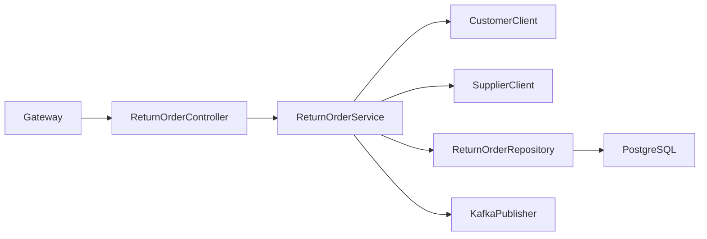
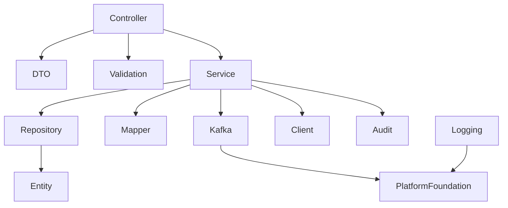
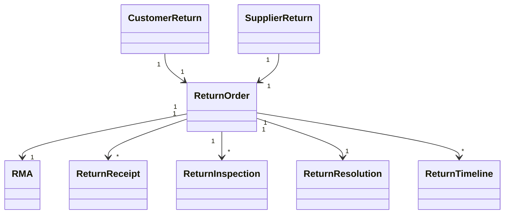

# LLD-015: Returns Service

# 1. Document Information

| Field       | Value                                  |
| ----------- | -------------------------------------- |
| Project     | Distributed Hub & Sales (DHS) Platform |
| Service     | Returns Service                        |
| Document    | Low Level Design                       |
| Document ID | LLD-015                                |
| Repository  | starone-dhs-platform                   |
| Module      | returns-service                        |
| Version     | v1.0.0                                 |
| Status      | Draft                                  |
| Standard    | IEEE 1016                              |
| Owner       | Enterprise Architecture                |

---

# 2. Purpose

This document defines the implementation-level architecture of the Returns Service.

The Returns Service is responsible for managing Customer Returns, Supplier Returns, Return Orders (RO), Return Merchandise Authorization (RMA), Return Receipts, Return Inspection, Return Resolution, Refund Processing Coordination, Inventory Return Integration, and Return Event Publishing.

This document implements the requirements defined in **SRS-015 – Returns Service**.

---

# 3. Scope

The Returns Service provides

- Customer Returns
- Supplier Returns
- Return Merchandise Authorization (RMA)
- Return Order Management
- Return Receipt Management
- Return Inspection
- Return Approval Workflow
- Return Resolution
- Return Search
- Return Timeline
- Return Analytics
- Return Event Publishing

Returns Service shall not own

- Customer Master
- Supplier Master
- Product Master
- Inventory Master
- Billing
- Refund Payments
- Warehouse Master

Returns Service shall integrate with Customer, Supplier, Inventory, Billing and Notification services.

---

# 4. Design Principles

## RET-DP-001

Every return shall reference an original business transaction.

---

## RET-DP-002

Return lifecycle shall be state-driven.

---

## RET-DP-003

Inventory updates shall occur through domain events.

---

## RET-DP-004

RMA shall be mandatory before return approval where configured.

---

## RET-DP-005

Return inspection shall determine disposition.

---

## RET-DP-006

Infrastructure concerns shall reuse Platform Foundation.

---

# 5. Package Structure

```text
returns-service
│
├── config
├── controller
├── service
├── repository
├── entity
├── dto
├── mapper
├── validation
├── kafka
├── exception
├── audit
├── scheduler
├── util
└── client
```

---

# 6. Maven Module Structure

```text
returns-service
│
├── api
├── application
├── domain
├── infrastructure
└── bootstrap
```

---

# 7. Layered Architecture

```text
REST API

↓

Controller

↓

Application Service

↓

Returns Domain

↓

Repository

↓

PostgreSQL
```

Platform Foundation provides

- Security
- Logging
- Validation
- Kafka
- OpenFeign
- Exception Handling
- Audit
- Observability

---

# 8. Package Design

## controller

```text
controller
│
├── CustomerReturnController
├── SupplierReturnController
├── ReturnOrderController
├── RMAController
├── ReturnReceiptController
├── ReturnInspectionController
├── ReturnSearchController
└── ReturnTimelineController
```

---

## service

```text
service
│
├── CustomerReturnService
├── SupplierReturnService
├── ReturnOrderService
├── RMAService
├── ReturnReceiptService
├── ReturnInspectionService
├── ReturnTimelineService
├── ReturnSearchService
├── ReturnValidationService
└── ReturnAuditService
```

---

## repository

```text
repository
│
├── CustomerReturnRepository
├── SupplierReturnRepository
├── ReturnOrderRepository
├── RMARepository
├── ReturnReceiptRepository
├── ReturnInspectionRepository
├── ReturnResolutionRepository
└── ReturnTimelineRepository
```

---

## entity

```text
entity
│
├── CustomerReturn
├── SupplierReturn
├── ReturnOrder
├── RMA
├── ReturnReceipt
├── ReturnInspection
├── ReturnResolution
├── ReturnTimeline
└── ReturnAudit
```

---

## dto

```text
dto
│
├── request
├── response
└── event
```

---

## kafka

```text
kafka
│
├── producer
├── consumer
└── configuration
```

---

## client

```text
client
│
├── CustomerClient
├── SupplierClient
├── InventoryClient
├── BillingClient
├── NotificationClient
└── AuditClient
```

---

# 9. Component Diagram



---

# 10. Package Dependency Diagram



---

# 11. Domain Responsibilities

| Component         | Responsibility                |
| ----------------- | ----------------------------- |
| Customer Return   | Customer Return Processing    |
| Supplier Return   | Supplier Return Processing    |
| Return Order      | Return Transaction            |
| RMA               | Return Authorization          |
| Return Receipt    | Returned Item Receipt         |
| Return Inspection | Quality Inspection            |
| Return Resolution | Refund / Replacement / Reject |
| Return Timeline   | Lifecycle History             |

---

# 12. Service Boundaries

Returns Service owns

- Customer Returns
- Supplier Returns
- Return Orders
- RMAs
- Return Receipts
- Return Inspections
- Return Resolutions
- Return Timeline

Returns Service does not own

- Customer Master
- Supplier Master
- Product Master
- Inventory Master
- Billing
- Warehouse

Customer and Supplier validation shall always be performed using their respective services.

---

# 13. Architecture Constraints

- Controllers shall remain stateless.
- Controllers shall never access repositories directly.
- Services shall contain business logic.
- Return Order Number shall be immutable.
- RMA Number shall be immutable.
- Return lifecycle shall follow approved state transitions.
- Repository layer shall contain persistence only.
- Kafka events shall publish after successful transaction commit.
- DTOs shall never expose entities.
- All entities shall extend AuditableEntity.
- APIs shall return ApiResponse<T>.

---

# 14. Class Design

The Returns Service shall implement classes for Customer Returns, Supplier Returns, Return Orders, Return Merchandise Authorization (RMA), Return Receipt processing, Return Inspection, Return Resolution, return workflow management, and return search.

The implementation shall follow Layered Architecture and Domain-Driven Design (DDD).

---

# 15. Controller Layer Design

The Controller layer shall expose REST APIs and delegate business processing to the Service layer.

Controllers shall remain stateless.

## Package Structure

```text
controller
│
├── CustomerReturnController
├── SupplierReturnController
├── ReturnOrderController
├── RMAController
├── ReturnReceiptController
├── ReturnInspectionController
├── ReturnResolutionController
├── ReturnSearchController
└── ReturnTimelineController
```

---

## CustomerReturnController

### Responsibilities

- Create Customer Return
- Update Customer Return
- Cancel Customer Return
- View Customer Return
- Submit Return Request

### APIs

```text
POST   /api/v1/customer-returns

PUT    /api/v1/customer-returns/{returnId}

GET    /api/v1/customer-returns/{returnId}

PUT    /api/v1/customer-returns/{returnId}/submit

PUT    /api/v1/customer-returns/{returnId}/cancel
```

---

## SupplierReturnController

Responsibilities

- Create Supplier Return
- Update Supplier Return
- Dispatch Supplier Return
- Close Supplier Return

---

## ReturnOrderController

Responsibilities

- Create Return Order
- Update Return Order
- Approve Return Order
- Close Return Order

---

## RMAController

Responsibilities

- Generate RMA
- Approve RMA
- Reject RMA
- Close RMA

---

## ReturnReceiptController

Responsibilities

- Receive Returned Items
- Update Receipt
- Complete Receipt

---

## ReturnInspectionController

Responsibilities

- Inspect Returned Items
- Record Inspection
- Determine Return Condition

---

## ReturnResolutionController

Responsibilities

- Refund Approval
- Replacement Approval
- Credit Note Approval
- Reject Return

---

## ReturnSearchController

Responsibilities

- Search Returns
- Advanced Search
- Return Dashboard

---

## ReturnTimelineController

Responsibilities

- Return Timeline
- Audit Timeline
- Lifecycle Timeline

---

# 16. Service Layer Design

Business logic shall reside in the Service layer.

## Package Structure

```text
service
│
├── CustomerReturnService
├── SupplierReturnService
├── ReturnOrderService
├── RMAService
├── ReturnReceiptService
├── ReturnInspectionService
├── ReturnResolutionService
├── ReturnTimelineService
├── ReturnSearchService
├── ReturnValidationService
└── ReturnAuditService
```

---

## CustomerReturnService

### Responsibilities

- Create Return
- Submit Return
- Cancel Return
- Retrieve Return

### Public Methods

```java
createCustomerReturn()

updateCustomerReturn()

submitCustomerReturn()

cancelCustomerReturn()

getCustomerReturn()
```

---

## SupplierReturnService

Responsibilities

- Create Supplier Return
- Dispatch Return
- Close Return

---

## ReturnOrderService

Responsibilities

- Return Order Processing
- Approval Workflow
- Status Management

---

## RMAService

Responsibilities

- RMA Generation
- RMA Approval
- RMA Validation

---

## ReturnReceiptService

Responsibilities

- Return Receipt
- Quantity Verification
- Receipt Confirmation

---

## ReturnInspectionService

Responsibilities

- Inspection Processing
- Quality Evaluation
- Damage Assessment

---

## ReturnResolutionService

Responsibilities

- Refund Decision
- Replacement Decision
- Credit Note Decision
- Return Closure

---

## ReturnTimelineService

Responsibilities

- Timeline Generation
- History Tracking

---

## ReturnSearchService

Responsibilities

- Search
- Filtering
- Pagination
- Sorting

---

# 17. Repository Layer Design

Repositories shall encapsulate persistence logic only.

## Package Structure

```text
repository
│
├── CustomerReturnRepository
├── SupplierReturnRepository
├── ReturnOrderRepository
├── RMARepository
├── ReturnReceiptRepository
├── ReturnInspectionRepository
├── ReturnResolutionRepository
└── ReturnTimelineRepository
```

---

## Repository Responsibilities

| Repository                 | Responsibility    |
| -------------------------- | ----------------- |
| CustomerReturnRepository   | Customer Returns  |
| SupplierReturnRepository   | Supplier Returns  |
| ReturnOrderRepository      | Return Orders     |
| RMARepository              | RMAs              |
| ReturnReceiptRepository    | Return Receipts   |
| ReturnInspectionRepository | Return Inspection |
| ReturnResolutionRepository | Return Resolution |
| ReturnTimelineRepository   | Timeline          |

---

# 18. DTO Design

## Request DTOs

```text
dto.request
│
├── CustomerReturnRequest
├── SupplierReturnRequest
├── ReturnOrderRequest
├── RMARequest
├── ReturnReceiptRequest
├── ReturnInspectionRequest
├── ReturnResolutionRequest
└── ReturnSearchRequest
```

---

## Response DTOs

```text
dto.response
│
├── CustomerReturnResponse
├── SupplierReturnResponse
├── ReturnOrderResponse
├── RMAResponse
├── ReturnReceiptResponse
├── ReturnInspectionResponse
├── ReturnResolutionResponse
└── ReturnTimelineResponse
```

---

## ReturnOrderResponse

| Field               | Type         |
| ------------------- | ------------ |
| returnOrderId       | UUID         |
| returnOrderNumber   | String       |
| returnType          | ReturnType   |
| referenceDocumentId | UUID         |
| returnStatus        | ReturnStatus |
| returnDate          | LocalDate    |
| totalReturnAmount   | BigDecimal   |

---

# 19. Entity Design

All entities shall extend **AuditableEntity**.

---

## Package Structure

```text
entity
│
├── CustomerReturn
├── SupplierReturn
├── ReturnOrder
├── RMA
├── ReturnReceipt
├── ReturnInspection
├── ReturnResolution
├── ReturnTimeline
└── ReturnAudit
```

---

## CustomerReturn

| Attribute     | Type                 |
| ------------- | -------------------- |
| id            | UUID                 |
| customerId    | UUID                 |
| salesOrderId  | UUID                 |
| returnReason  | ReturnReason         |
| requestedDate | LocalDate            |
| status        | CustomerReturnStatus |

---

## SupplierReturn

| Attribute       | Type                 |
| --------------- | -------------------- |
| id              | UUID                 |
| supplierId      | UUID                 |
| purchaseOrderId | UUID                 |
| returnReason    | ReturnReason         |
| returnDate      | LocalDate            |
| status          | SupplierReturnStatus |

---

## ReturnOrder

| Attribute           | Type         |
| ------------------- | ------------ |
| id                  | UUID         |
| returnOrderNumber   | String       |
| returnType          | ReturnType   |
| referenceDocumentId | UUID         |
| rmaId               | UUID         |
| status              | ReturnStatus |

---

## RMA

| Attribute  | Type      |
| ---------- | --------- |
| id         | UUID      |
| rmaNumber  | String    |
| issuedDate | LocalDate |
| expiryDate | LocalDate |
| status     | RMAStatus |

---

## ReturnReceipt

| Attribute     | Type          |
| ------------- | ------------- |
| id            | UUID          |
| receiptNumber | String        |
| receiptDate   | LocalDate     |
| warehouseId   | UUID          |
| status        | ReceiptStatus |

---

## ReturnInspection

| Attribute        | Type             |
| ---------------- | ---------------- |
| id               | UUID             |
| inspectionDate   | LocalDate        |
| inspectedBy      | UUID             |
| inspectionResult | InspectionResult |
| remarks          | String           |

---

## ReturnResolution

| Attribute        | Type             |
| ---------------- | ---------------- |
| id               | UUID             |
| resolutionType   | ResolutionType   |
| resolutionStatus | ResolutionStatus |
| resolvedBy       | UUID             |
| resolvedAt       | Instant          |

---

## ReturnTimeline

| Attribute      | Type    |
| -------------- | ------- |
| id             | UUID    |
| returnOrderId  | UUID    |
| eventType      | String  |
| eventTimestamp | Instant |
| remarks        | String  |

---

# 20. Mapper Design

MapStruct shall be the standard mapping framework.

## Package Structure

```text
mapper
│
├── CustomerReturnMapper
├── SupplierReturnMapper
├── ReturnOrderMapper
├── RMAMapper
├── ReturnReceiptMapper
├── ReturnInspectionMapper
├── ReturnResolutionMapper
└── ReturnTimelineMapper
```

---

## Responsibilities

- DTO → Entity
- Entity → DTO
- Partial Updates
- Page Mapping

---

# 21. Validation Design

## Package Structure

```text
validation
│
├── annotation
├── validator
└── groups
```

---

## Validators

```text
CustomerReturnValidator

SupplierReturnValidator

ReturnOrderValidator

RMAValidator

ReturnReceiptValidator

ReturnInspectionValidator

ReturnResolutionValidator
```

---

## Validation Rules

| Validator                 | Purpose                    |
| ------------------------- | -------------------------- |
| CustomerReturnValidator   | Customer Return Validation |
| SupplierReturnValidator   | Supplier Return Validation |
| ReturnOrderValidator      | Return Order Validation    |
| RMAValidator              | RMA Validation             |
| ReturnReceiptValidator    | Receipt Validation         |
| ReturnInspectionValidator | Inspection Validation      |
| ReturnResolutionValidator | Resolution Validation      |

---

# 22. Exception Hierarchy

```text
RuntimeException
        │
        └── PlatformException
                │
                ├── CustomerReturnNotFoundException
                ├── SupplierReturnNotFoundException
                ├── ReturnOrderNotFoundException
                ├── RMANotFoundException
                ├── ReturnReceiptNotFoundException
                ├── ReturnInspectionException
                ├── ReturnResolutionException
                ├── InvalidReturnStateException
                └── ReturnValidationException
```

---

# 23. Customer Return Flow

```mermaid
sequenceDiagram

Customer->>CustomerReturnController

CustomerReturnController->>CustomerReturnService

CustomerReturnService->>CustomerReturnRepository

CustomerReturnRepository-->>CustomerReturnService

CustomerReturnService->>KafkaPublisher

CustomerReturnController-->>Customer
```

---

# 24. Supplier Return Flow

```mermaid
sequenceDiagram

Procurement->>SupplierReturnController

SupplierReturnController->>SupplierReturnService

SupplierReturnService->>SupplierReturnRepository

SupplierReturnRepository-->>SupplierReturnService

SupplierReturnController-->>Procurement
```

---

# 25. RMA Flow

```mermaid
sequenceDiagram

Customer->>RMAController

RMAController->>RMAService

RMAService->>RMARepository

RMARepository-->>RMAService

RMAController-->>Customer
```

---

# 26. Return Inspection Flow

```mermaid
sequenceDiagram

Warehouse->>ReturnInspectionController

ReturnInspectionController->>ReturnInspectionService

ReturnInspectionService->>ReturnInspectionRepository

ReturnInspectionRepository-->>ReturnInspectionService

ReturnInspectionController-->>Warehouse
```

---

# 27. Return Resolution Flow

```mermaid
sequenceDiagram

Manager->>ReturnResolutionController

ReturnResolutionController->>ReturnResolutionService

ReturnResolutionService->>ReturnResolutionRepository

ReturnResolutionRepository-->>ReturnResolutionService

ReturnResolutionController-->>Manager
```

---

# 28. Class Diagram



---

# 29. Design Constraints

- Every return shall reference an original business transaction.
- RMA validation shall be enforced where configured.
- Return Order Number shall be immutable.
- Inventory updates shall occur through Kafka events.
- Return lifecycle shall follow approved state transitions.
- Controllers shall remain stateless.
- Services shall contain all business logic.
- Repository layer shall contain persistence only.
- Kafka events shall publish after successful transaction commit.
- DTOs shall never expose JPA entities.
- All entities shall extend `AuditableEntity`.
- APIs shall return `ApiResponse<T>`.

---

# 30. Security Configuration

The Returns Service shall inherit the enterprise security framework from the Platform Foundation.

Authentication shall be delegated to the Identity Service.

Authorization shall be enforced using Role-Based Access Control (RBAC).

---

## 30.1 Security Architecture

```text
Client

↓

API Gateway

↓

JWT Authentication Filter

↓

Authorization Filter

↓

Returns Controller

↓

Returns Service
```

---

## 30.2 Security Components

```text
security
│
├── config
│   ├── SecurityConfiguration
│   ├── MethodSecurityConfiguration
│   └── CorsConfiguration
│
├── filter
│   ├── JwtAuthenticationFilter
│   ├── AuthorizationFilter
│   └── CorrelationIdFilter
│
├── permission
│   ├── ReturnsPermissionEvaluator
│   └── ReturnsAccessValidator
│
└── annotation
    └── RequireReturnsPermission
```

---

## 30.3 Permissions

| Permission               | Description                             |
| ------------------------ | --------------------------------------- |
| CUSTOMER_RETURN_CREATE   | Create Customer Return                  |
| CUSTOMER_RETURN_APPROVE  | Approve Customer Return                 |
| SUPPLIER_RETURN_CREATE   | Create Supplier Return                  |
| SUPPLIER_RETURN_APPROVE  | Approve Supplier Return                 |
| RMA_MANAGE               | Manage Return Merchandise Authorization |
| RETURN_RECEIPT_CREATE    | Create Return Receipt                   |
| RETURN_INSPECTION_MANAGE | Manage Return Inspection                |
| RETURN_RESOLUTION_MANAGE | Manage Return Resolution                |
| RETURN_VIEW              | View Returns                            |
| RETURN_SEARCH            | Search Returns                          |

---

## 30.4 Authorization Flow

```mermaid
sequenceDiagram

Client->>Gateway: JWT

Gateway->>Identity Service: Validate Token

Identity Service-->>Gateway: Claims

Gateway->>Returns Service

Returns Service->>PermissionEvaluator

PermissionEvaluator-->>Returns Service

Returns Service-->>Client
```

---

# 31. JWT Implementation

JWT validation shall be handled by Platform Foundation.

Returns Service shall consume authenticated user information from Spring Security.

---

## Required Claims

```json
{
  "sub": "UUID",
  "username": "returns.manager",
  "roles": ["RETURNS_MANAGER"],
  "permissions": [
    "CUSTOMER_RETURN_CREATE",
    "RETURN_INSPECTION_MANAGE",
    "RETURN_RESOLUTION_MANAGE"
  ],
  "tenantId": "UUID",
  "branchId": "UUID"
}
```

---

## User Context

Every request shall expose

```text
UserId

Username

Roles

Permissions

TenantId

BranchId

CorrelationId
```

---

# 32. Authorization Design

Permission-based authorization shall be implemented.

---

## Example

```java
@PreAuthorize("hasAuthority('CUSTOMER_RETURN_CREATE')")
```

or

```java
@RequireReturnsPermission("CUSTOMER_RETURN_CREATE")
```

---

## Permission Matrix

| API                      | Permission               |
| ------------------------ | ------------------------ |
| Create Customer Return   | CUSTOMER_RETURN_CREATE   |
| Approve Customer Return  | CUSTOMER_RETURN_APPROVE  |
| Create Supplier Return   | SUPPLIER_RETURN_CREATE   |
| Approve Supplier Return  | SUPPLIER_RETURN_APPROVE  |
| Manage RMA               | RMA_MANAGE               |
| Create Return Receipt    | RETURN_RECEIPT_CREATE    |
| Manage Return Inspection | RETURN_INSPECTION_MANAGE |
| Manage Return Resolution | RETURN_RESOLUTION_MANAGE |
| View Returns             | RETURN_VIEW              |
| Search Returns           | RETURN_SEARCH            |

---

# 33. Kafka Design

Returns Service shall publish return lifecycle events.

---

## Published Topics

```text
customer.return.created.v1

customer.return.approved.v1

supplier.return.created.v1

supplier.return.approved.v1

return.order.created.v1

return.order.closed.v1

rma.created.v1

rma.approved.v1

return.receipt.completed.v1

return.inspection.completed.v1

return.resolution.completed.v1

inventory.return.completed.v1
```

---

## Consumed Topics

```text
order.completed.v1

invoice.generated.v1

invoice.paid.v1

goods.receipt.completed.v1

shipment.delivered.v1

supplier.updated.v1

customer.updated.v1
```

---

## Kafka Package

```text
kafka
│
├── producer
├── consumer
├── configuration
├── mapper
└── event
```

---

## Event Envelope

```json
{
  "eventId": "UUID",
  "eventType": "CustomerReturnCreated",
  "eventVersion": "1.0",
  "occurredAt": "2026-06-27T10:00:00Z",
  "correlationId": "UUID",
  "payload": {}
}
```

---

# 34. OpenFeign Design

Returns Service shall use synchronous communication only for validation and reference lookups.

---

## Feign Clients

```text
client
│
├── CustomerClient
├── SupplierClient
├── OrderClient
├── InventoryClient
├── BillingClient
├── IdentityClient
├── NotificationClient
└── AuditClient
```

---

## Responsibilities

| Client             | Responsibility                  |
| ------------------ | ------------------------------- |
| CustomerClient     | Customer Validation             |
| SupplierClient     | Supplier Validation             |
| OrderClient        | Sales/Purchase Order Validation |
| InventoryClient    | Inventory Validation            |
| BillingClient      | Credit Note / Refund Validation |
| IdentityClient     | User Validation                 |
| NotificationClient | Return Notifications            |
| AuditClient        | Audit Submission                |

---

# 35. Configuration Classes

```text
config
│
├── SecurityConfiguration
├── KafkaConfiguration
├── FeignConfiguration
├── CacheConfiguration
├── JacksonConfiguration
├── ValidationConfiguration
├── SchedulerConfiguration
├── MetricsConfiguration
├── ReturnsConfiguration
└── OpenApiConfiguration
```

---

## Responsibilities

| Configuration | Responsibility           |
| ------------- | ------------------------ |
| Security      | Spring Security          |
| Kafka         | Kafka Infrastructure     |
| Feign         | OpenFeign                |
| Cache         | Redis                    |
| Validation    | Bean Validation          |
| Scheduler     | Return Jobs              |
| Metrics       | Micrometer               |
| Returns       | Return Processing Engine |
| OpenAPI       | Swagger                  |

---

# 36. Transaction Design

Returns transactions shall remain local.

Cross-service consistency shall be achieved using event-driven integration.

---

## Transaction Types

| Operation               | Propagation  |
| ----------------------- | ------------ |
| Create Customer Return  | REQUIRED     |
| Create Supplier Return  | REQUIRED     |
| Generate RMA            | REQUIRED     |
| Complete Return Receipt | REQUIRED     |
| Complete Inspection     | REQUIRED     |
| Resolve Return          | REQUIRED     |
| Publish Event           | AFTER_COMMIT |

---

## Transaction Flow

```mermaid
flowchart LR

Controller

-->

ReturnsService

-->

Repository

-->

Commit

-->

Kafka Publish
```

---

# 37. Cache Design

Redis shall cache frequently accessed return reference data.

---

## Cached Objects

```text
Return Dashboard

Open RMAs

Pending Inspections

Return Summary

Return Search Results
```

---

## Cache Annotations

```java
@Cacheable

@CachePut

@CacheEvict
```

---

# 38. Resilience Patterns

Returns Service shall implement Resilience4j.

---

## Retry

Customer Service

Supplier Service

Inventory Service

Billing Service

Notification Service

---

## Circuit Breaker

Customer Service

Supplier Service

Inventory Service

Billing Service

Audit Service

---

## Bulkhead

External Service Calls

---

## Rate Limiter

Customer Return APIs

Supplier Return APIs

RMA APIs

---

## Timeout

All OpenFeign Clients

---

# 39. Scheduler Design

Scheduled jobs shall support return lifecycle management.

---

## Scheduled Jobs

```text
scheduler
│
├── RMAExpiryScheduler
├── PendingInspectionScheduler
├── PendingResolutionScheduler
├── ReturnDashboardRefreshScheduler
├── ReturnCacheRefreshScheduler
└── ReturnCleanupScheduler
```

---

# 40. External Integration Design

| Service              | Purpose                   |
| -------------------- | ------------------------- |
| Customer Service     | Customer Validation       |
| Supplier Service     | Supplier Validation       |
| Order Service        | Original Order Validation |
| Inventory Service    | Inventory Update          |
| Billing Service      | Refund / Credit Note      |
| Notification Service | Return Notifications      |
| Audit Service        | Audit Logging             |
| Identity Service     | User Validation           |

---

# 41. Configuration Properties

| Property                    | Default |
| --------------------------- | ------- |
| returns.cache.enabled       | true    |
| returns.cache.ttl           | 3600    |
| returns.rma.expiry.days     | 30      |
| returns.inspection.required | true    |
| returns.kafka.retry         | 3       |

---

# 42. Data Consistency Strategy

- Return Order Number shall remain unique.
- RMA Number shall remain unique.
- Every return shall reference an original transaction.
- Inventory updates shall be event-driven.
- Kafka events shall publish only after successful transaction commit.

---

# 43. Performance Considerations

- Return search shall support pagination.
- Dashboard data shall use Redis cache.
- Return inspections shall support asynchronous processing.
- Timeline queries shall use indexed data.
- Resolution processing shall publish asynchronous events.

---

# 44. Design Constraints

- Returns shall never own Customer Master.
- Returns shall never own Supplier Master.
- JWT authentication shall be mandatory.
- Authorization shall be permission-based.
- Repository layer shall never invoke external services.
- Configuration shall be externalized.
- Kafka events shall publish after successful transaction commit.
- Correlation ID shall propagate across outbound requests.

---

# 45. Technology Standards

| Concern           | Technology              |
| ----------------- | ----------------------- |
| Java              | Java 21                 |
| Framework         | Spring Boot 3.x         |
| Security          | Spring Security 6       |
| Authentication    | JWT                     |
| Authorization     | RBAC                    |
| Database          | PostgreSQL              |
| Cache             | Redis                   |
| Messaging         | Apache Kafka            |
| Service Calls     | OpenFeign               |
| Validation        | Jakarta Bean Validation |
| Mapping           | MapStruct               |
| Logging           | SLF4J + Logback         |
| Metrics           | Micrometer              |
| Tracing           | OpenTelemetry           |
| Service Discovery | Eureka                  |

---

# 46. Logging Design

The Returns Service shall implement centralized structured logging using the Platform Foundation logging framework.

Every return request, RMA lifecycle event, return receipt, inspection, resolution, inventory synchronization, and external integration shall be logged using standardized MDC attributes.

---

## 46.1 Logging Architecture

```text
REST Request

↓

Correlation Filter

↓

Logging Aspect

↓

SLF4J

↓

Logback

↓

ELK / OpenSearch / Splunk
```

---

## 46.2 Log Levels

| Level | Purpose                     |
| ----- | --------------------------- |
| TRACE | Framework Diagnostics       |
| DEBUG | Development                 |
| INFO  | Return Business Events      |
| WARN  | Recoverable Business Errors |
| ERROR | Return Processing Failures  |

---

## 46.3 MDC Context

Every log entry shall include

```text
Correlation ID

Trace ID

Span ID

Customer Return ID

Supplier Return ID

Return Order ID

RMA ID

Return Receipt ID

Inspection ID

Resolution ID

Customer ID

Supplier ID

Tenant ID

Branch ID

User ID

Request URI

HTTP Method

Service Name

Environment
```

---

## 46.4 Business Events

The following operations shall always be logged.

- Customer Return Created
- Customer Return Approved
- Customer Return Rejected
- Supplier Return Created
- Supplier Return Approved
- Return Order Created
- Return Order Closed
- RMA Generated
- RMA Approved
- RMA Rejected
- Return Receipt Completed
- Return Inspection Completed
- Return Resolution Completed
- Refund Requested
- Credit Note Requested
- Inventory Update Published

---

## 46.5 Sensitive Data

The following shall never be logged.

- JWT Tokens
- Authorization Headers
- Customer Payment Information
- Supplier Banking Information
- Internal Resolution Notes
- API Keys
- Encryption Keys

---

# 47. Observability

Returns Service shall expose operational metrics using Micrometer.

---

## JVM Metrics

- Heap Usage
- CPU Usage
- Thread Count
- Garbage Collection

---

## Business Metrics

- Customer Returns Created
- Supplier Returns Created
- RMAs Generated
- RMAs Approved
- Pending Return Inspections
- Completed Return Inspections
- Refund Requests
- Credit Note Requests
- Return Resolution Time
- Inventory Return Events Published

---

## Infrastructure Metrics

- Database Connections
- Kafka Publish Rate
- Kafka Consumer Lag
- Redis Cache Hit Ratio
- API Response Time
- OpenFeign Latency

---

# 48. Distributed Tracing

Every return processing request shall propagate distributed tracing metadata.

---

## Trace Flow

```mermaid
sequenceDiagram

Client->>Gateway

Gateway->>Returns Service

Returns Service->>Customer Service

Returns Service->>Supplier Service

Returns Service->>Order Service

Returns Service->>Inventory Service

Returns Service->>Billing Service

Returns Service->>Notification Service

Returns Service->>Audit Service

Returns Service-->>Gateway

Gateway-->>Client
```

---

## Trace Context

Every request shall propagate

- Correlation ID
- Trace ID
- Span ID

---

# 49. Health Checks

Returns Service shall expose Spring Boot Actuator endpoints.

---

## Health

```text
GET /actuator/health
```

---

## Liveness

```text
GET /actuator/health/liveness
```

---

## Readiness

```text
GET /actuator/health/readiness
```

Dependencies

- PostgreSQL
- Redis
- Kafka
- Config Server
- Customer Service
- Supplier Service
- Inventory Service
- Billing Service

---

## Metrics

```text
GET /actuator/metrics
```

---

## Prometheus

```text
GET /actuator/prometheus
```

---

# 50. Deployment Design

Returns Service shall be deployed as an independent containerized microservice.

---

## Deployment Architecture

```text
Gateway

↓

Returns Service

↓

PostgreSQL

↓

Redis

↓

Kafka
```

---

## Kubernetes Resources

```text
Deployment

Service

Ingress

ConfigMap

Secret

HorizontalPodAutoscaler

ServiceMonitor

PodDisruptionBudget
```

---

# 51. Dependency Management

Returns Service shall inherit the Platform Foundation BOM.

```xml
<dependencyManagement>

<dependency>

<groupId>com.starone</groupId>

<artifactId>platform-foundation-bom</artifactId>

</dependency>

</dependencyManagement>
```

---

## Primary Dependencies

- Spring Boot
- Spring Security
- Spring Data JPA
- Spring Kafka
- Spring Validation
- PostgreSQL Driver
- Redis
- OpenFeign
- Micrometer
- OpenTelemetry
- MapStruct
- Lombok

---

# 52. Coding Standards

Returns Service shall comply with enterprise coding standards.

---

## Controller

- Stateless
- Validation Only
- No Business Logic

---

## Service

- Stateless
- Transactional
- Business Orchestration

---

## Repository

- Persistence Only
- No External Service Calls

---

## DTO

- Immutable
- Validation Annotations

---

## Entity

- Extend AuditableEntity
- Never Exposed Directly

---

# 53. Package Naming Standards

```text
com.starone.returns

├── controller
├── service
├── repository
├── entity
├── dto
├── mapper
├── validation
├── config
├── kafka
├── exception
├── scheduler
├── audit
├── client
└── util
```

---

# 54. Testing Strategy

## Unit Testing

Framework

```text
JUnit 5

Mockito
```

Coverage

```text
Minimum 90%
```

---

## Integration Testing

- Spring Boot Test
- Testcontainers
- Embedded Kafka

---

## API Testing

- REST Assured
- Spring MockMvc

---

## Returns Testing

- Customer Return Workflow
- Supplier Return Workflow
- Return Order Lifecycle
- RMA Lifecycle
- Return Receipt Processing
- Return Inspection
- Return Resolution
- Inventory Integration
- Billing Integration

---

## Performance Testing

- Concurrent Return Requests
- RMA Generation
- Inspection Processing
- Resolution Processing
- Return Search Performance

---

## Static Analysis

- SonarQube
- SpotBugs
- PMD
- Checkstyle

---

# 55. Build Validation

Every Pull Request shall verify

- Compilation
- Unit Tests
- Integration Tests
- Return Workflow Tests
- Static Analysis
- Security Scan
- Dependency Scan
- Documentation Validation
- Code Coverage

---

# 56. Quality Gates

| Metric                   | Target    |
| ------------------------ | --------- |
| Unit Test Coverage       | ≥90%      |
| Integration Tests        | 100% Pass |
| Return Workflow Tests    | 100% Pass |
| Critical Bugs            | 0         |
| Critical Vulnerabilities | 0         |
| Code Duplication         | <3%       |
| Documentation            | Mandatory |

---

# 57. Implementation Guidelines

Returns Service shall reuse Platform Foundation components.

Business code shall never duplicate

- JWT Security
- Logging
- Validation
- Kafka Infrastructure
- Exception Handling
- Audit Framework
- API Response Models
- Pagination Framework

Customer and Supplier validation shall always use their respective services.

Inventory updates shall be event-driven.

Refund processing shall be coordinated with Billing Service.

---

# 58. Extension Guidelines

Business-specific functionality shall extend Platform Foundation components where applicable.

Permitted extensions include

- AuditableEntity
- PlatformException
- ApiResponse
- BaseMapper
- AuditService

Platform Foundation source code shall never be modified by Returns Service.

---

# 59. Design Checklist

Before implementation verify

- Customer validation integrated
- Supplier validation integrated
- Original order validation implemented
- RMA workflow configured
- Return inspection workflow implemented
- Return resolution workflow implemented
- Inventory event publishing implemented
- Billing integration implemented
- Controllers contain no business logic
- Services remain stateless
- Repository layer contains persistence only
- Kafka events publish after successful transaction commit
- Redis cache configured
- Correlation ID propagation enabled
- Health endpoints exposed
- Metrics published
- Configuration externalized
- Unit test coverage meets quality gates

---

# 60. Appendix A – Framework Versions

| Component       | Version          |
| --------------- | ---------------- |
| Java            | 21               |
| Spring Boot     | 3.x              |
| Spring Security | 6.x              |
| Spring Cloud    | 2025.x           |
| PostgreSQL      | Latest Supported |
| Redis           | Latest Supported |
| Kafka           | Latest Supported |
| OpenFeign       | Latest Supported |
| Micrometer      | Latest Supported |
| OpenTelemetry   | Latest Supported |
| MapStruct       | Latest Stable    |
| Lombok          | Latest Stable    |
| JUnit           | 5.x              |

---

# 61. Appendix B – Layer Responsibility Matrix

| Layer      | Responsibility         |
| ---------- | ---------------------- |
| Controller | Request Handling       |
| Service    | Returns Business Logic |
| Repository | Persistence            |
| Kafka      | Event Publishing       |
| Mapper     | DTO Conversion         |
| Validation | Request Validation     |
| Audit      | Returns Audit          |

---

# 62. Appendix C – Returns Components

```text
CustomerReturnController

SupplierReturnController

ReturnOrderController

RMAController

ReturnReceiptController

ReturnInspectionController

ReturnResolutionController

ReturnSearchController

ReturnTimelineController

CustomerReturnService

SupplierReturnService

ReturnOrderService

RMAService

ReturnReceiptService

ReturnInspectionService

ReturnResolutionService

ReturnTimelineService

ReturnSearchService

CustomerReturnRepository

SupplierReturnRepository

ReturnOrderRepository

RMARepository

ReturnReceiptRepository

ReturnInspectionRepository

ReturnResolutionRepository

ReturnTimelineRepository
```

---

# 63. Appendix D – Returns Processing Summary

```text
Client

↓

Gateway

↓

JWT Authentication

↓

Authorization

↓

Controller

↓

Returns Service

↓

Customer/Supplier Validation

↓

Repository

↓

Kafka Events

↓

Inventory Update

↓

Billing Coordination

↓

Audit Events

↓

Response
```

---

# 64. Appendix E – Repository Responsibilities

| Repository                    | Responsibility                                  |
| ----------------------------- | ----------------------------------------------- |
| starone-galaxy-architecture   | Enterprise Standards, Governance & Architecture |
| starone-galaxy-central-config | Configuration Management                        |
| starone-galaxy-infra          | Kubernetes, Infrastructure & CI/CD              |
| starone-dhs-platform          | Returns Service Implementation                  |

---

# 65. Conclusion

The Returns Service is the centralized reverse logistics component of the DHS platform. It manages customer returns, supplier returns, Return Merchandise Authorization (RMA), return receipts, inspections, resolutions, and return lifecycle management. The service coordinates with Customer, Supplier, Inventory, Billing, Notification, and Audit services through synchronous validation and asynchronous Kafka events while leveraging the Platform Foundation for security, observability, logging, messaging, validation, and other enterprise cross-cutting capabilities.

---

# End of Document
