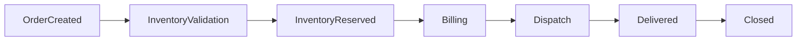
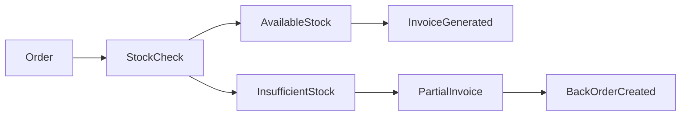
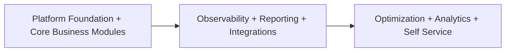

# PRD-001: Distributed Hub and Sales (DHS) Platform

## 1. Title Page

| Field         | Value                                    |
| ------------- | ---------------------------------------- |
| Project Name  | Distributed Hub and Sales (DHS) Platform |
| Document ID   | PRD-001                                  |
| Domain        | OMS / Electronic Distribution Platform   |
| Document Type | Product Requirements Document            |
| Version       | v1.0.0                                   |
| Author        | Sachin Salunke                           |
| Status        | Draft                                    |
| Date          | 2026-06-19                               |

---

## 2. Document Metadata

| Field           | Value                                  |
| --------------- | -------------------------------------- |
| Document ID     | PRD-001                                |
| Domain          | OMS / Electronic Distribution Platform |
| Document Type   | Product Requirements Document          |
| Version         | v1.0.0                                 |
| Author          | Sachin Salunke                         |
| Status          | Draft                                  |
| Date            | 2026-06-19                             |
| Linked BRD      | BRD-001                                |
| Linked Epic     | EPIC-DHS-001 To EPIC-DHS-012           |
| Approval Status | Pending Approval                       |

---

## 3. Revision History

| Version | Date       | Author         | Description                                                                                                   |
| ------- | ---------- | -------------- | ------------------------------------------------------------------------------------------------------------- |
| v1.0.0  | 2026-06-19 | Sachin Salunke | Initial Product Requirements baseline                                                                         |
| v1.1.0  | 2026-06-20 | Sachin Salunke | Updated PRD for cloud-native monorepo-based multi-module microservices architecture and platform capabilities |

---

## 4. References

| Reference ID | Document                                               |
| ------------ | ------------------------------------------------------ |
| BRD-001      | Business Requirements Document                         |
| SRS-001      | Software Requirements Specification                    |
| RTM-001      | Requirements Traceability Matrix                       |
| HLD-001      | Platform Foundation High-Level Design                  |
| ADR-001      | Monorepo-Based Multi-Module Microservices Architecture |
| ADR-002      | Database Strategy Decision                             |
| ADR-003      | Inter-Service Communication Strategy                   |
| ADR-004      | Service Discovery Strategy                             |
| ADR-005      | API Gateway Strategy                                   |
| ADR-006      | Event-Driven Communication Strategy                    |

---

## 5. Sign-Off Table

| Role                 | Name           | Status  |
| -------------------- | -------------- | ------- |
| Product Owner        | Sachin Salunke | Pending |
| Solution Architect   | Sachin Salunke | Pending |
| Technical Lead       | TBD            | Pending |
| Business Stakeholder | TBD            | Pending |

---

# 6. Product Vision

Build a cloud-native, distributed order management platform that provides real-time visibility across branches and hub operations while enabling scalable business capabilities through independently deployable platform services and centralized operational governance.

---

# 7. Problem Statement

Electronic distribution businesses face several operational challenges:

- Manual order processing
- No real-time inventory visibility
- Disconnected billing and dispatch processes
- Delayed reporting and analytics
- Lack of centralized monitoring
- Limited customer order tracking
- Operational inefficiencies across branches and hub
- Limited operational observability
- Lack of centralized API management
- Difficulty integrating new business capabilities
- Challenges in scaling individual platform capabilities

These challenges result in:

- Increased operational costs
- Billing errors
- Inventory discrepancies
- Delayed deliveries
- Poor customer experience
- Limited business scalability

---

# 8. Product Goals

## PG-001

Provide a single source of truth for orders and inventory.

## PG-002

Provide real-time inventory visibility.

## PG-003

Automate order-to-dispatch workflows.

## PG-004

Enable customer order tracking.

## PG-005

Reduce manual operations and billing errors.

## PG-006

Provide centralized operational reporting.

## PG-007

Build a scalable platform supporting future business growth.

## PG-008

Provide centralized API access management.

## PG-009

Provide service discovery and dynamic service communication capabilities.

## PG-010

Provide centralized configuration management.

## PG-011

Provide platform observability and operational monitoring.

## PG-012

Enable independent service evolution and future business scalability.

---

# 9. User Personas

## Persona 1 – Super Admin

**Responsibilities**

- Platform administration
- User and role management
- System configuration
- Audit monitoring

**Goals**

- Platform governance
- Security compliance
- Operational monitoring

---

## Persona 2 – Company Admin

**Responsibilities**

- Business administration
- Branch oversight
- Operational management

**Goals**

- Business visibility
- Performance monitoring

---

## Persona 3 – Hub Manager

**Responsibilities**

- Central inventory management
- Order fulfillment oversight
- Billing and dispatch monitoring

**Goals**

- Faster fulfillment
- Inventory optimization

---

## Persona 4 – Branch Manager

**Responsibilities**

- Branch operations
- Order monitoring
- Customer management

**Goals**

- Efficient branch operations
- Customer satisfaction

---

## Persona 5 – Sales Executive

**Responsibilities**

- Customer interactions
- Order creation
- Order tracking

**Goals**

- Faster order processing
- Better customer experience

---

## Persona 6 – Inventory Operator

**Responsibilities**

- Stock management
- Inventory adjustments
- Barcode operations

**Goals**

- Inventory accuracy
- Faster stock processing

---

## Persona 7 – Billing Executive

**Responsibilities**

- Invoice generation
- Partial billing management

**Goals**

- Billing accuracy
- Faster invoice processing

---

## Persona 8 – Dispatch Executive

**Responsibilities**

- Shipment processing
- Delivery tracking

**Goals**

- Faster deliveries
- Shipment visibility

---

## Persona 9 – Customer

**Responsibilities**

- Submit order requests
- Track order status

**Goals**

- Easy ordering experience
- Real-time order visibility

---

## Persona 10 – Platform Administrator

**Responsibilities**

Platform monitoring
Configuration management
Operational observability
Service administration

**Goals**

Platform reliability
Operational visibility
Environment management

## Persona 11 – System Administrator

**Responsibilities**

Platform security
Service management
Infrastructure operations

**Goals**

Platform availability
Secure operations
Performance monitoring

---

# 10. Product Modules

| Module                       | Description                             |
| ---------------------------- | --------------------------------------- |
| Platform Foundation          | Shared platform services and frameworks |
| API Gateway                  | Centralized API access and routing      |
| Configuration Management     | Centralized configuration management    |
| Service Discovery            | Service registration and discovery      |
| Identity & Access Management | Authentication and authorization        |
| Branch Management            | Branch administration                   |
| Customer Management          | Customer lifecycle management           |
| Product Catalog              | Product information management          |
| Inventory Management         | Stock and inventory operations          |
| Order Management             | Order lifecycle management              |
| Billing Management           | Invoice and billing operations          |
| Dispatch Management          | Shipment and delivery management        |
| Notification Management      | SMS and Email notifications             |
| Reporting & Analytics        | Operational dashboards and reports      |
| Audit & Compliance           | Audit trails and compliance             |

---

# 11. Platform Architecture Vision

```text
Cloud-Native
        ↓
Monorepo
        ↓
Multi-Module Maven
        ↓
Microservices
        ↓
Gateway
        ↓
Business Services
        ↓
Shared Platform Services
```

# 12. Product Scope

## 12.1 MVP Scope (Release 1)

- Platform Foundation
- API Gateway
- Configuration Management
- Service Discovery
- Authentication
- Branch Management
- Customer Management
- Product Catalog
- Inventory Management
- Order Management
- Billing Management
- Dispatch Management
- Notification Management

---

## 12.2 Release 2

- Reporting
- Analytics
- Audit Management
- GST Integration
- Barcode Integration
- Distributed Tracing
- Metrics and Monitoring
- Reporting
- Analytics
- Audit Management
- GST Integration
- Barcode Integration

---

## 12.3 Release 3

- Advanced Dashboards
- Operational Insights
- Forecasting
- Customer Self-Service Enhancements
- Service resiliency enhancements
- Advanced dashboards
- Forecasting
- Customer self-service enhancements
- Platform optimization

---

# 13. Core Business Flows

## Platform Flow


## Customer Request Flow


---

## Order Fulfillment Flow



---

## Partial Billing Flow



---

# 14. Product Decisions

## API Management Strategy

```text
Clients
      ↓
API Gateway
      ↓
Platform Services
```

Benefits:

- Centralized security
- Unified API management
- Simplified integrations

---

## Service Discovery Strategy

Benefits:

- Dynamic service communication
- Independent service scaling
- Reduced endpoint management

---

## Configuration Management Strategy

Benefits:

- Environment isolation
- Centralized configuration management
- Operational flexibility

---

## Customer Ordering Model

Hybrid ordering process.

```text
Customer Request
        ↓
Sales Executive Review
        ↓
Order Creation
```

---

## Inventory Reservation Strategy

Inventory shall be reserved during order creation.

Benefits:

- Prevents overselling
- Improves inventory accuracy
- Improves fulfillment planning

---

## Partial Billing Strategy

Partial billing shall be enabled.

Example:

```text
Ordered Quantity : 10
Available Quantity : 6

Invoice : 6
Backorder : 4
```

Benefits:

- Faster deliveries
- Improved customer satisfaction
- Reduced order cancellations

---

# 15. Functional Requirements

| ID     | Requirement                           | Priority |
| ------ | ------------------------------------- | -------- |
| FR-001 | User Authentication                   | Critical |
| FR-002 | Role-Based Access Control             | Critical |
| FR-003 | Branch Management                     | Critical |
| FR-004 | Customer Management                   | Critical |
| FR-005 | Product Catalog Management            | Critical |
| FR-006 | Inventory Management                  | Critical |
| FR-007 | Order Management                      | Critical |
| FR-008 | Inventory Reservation                 | Critical |
| FR-009 | Billing Management                    | Critical |
| FR-010 | Partial Billing                       | Critical |
| FR-011 | Dispatch Management                   | Critical |
| FR-012 | Customer Order Tracking               | High     |
| FR-013 | Notifications                         | High     |
| FR-014 | Reporting                             | High     |
| FR-015 | Audit Logging                         | High     |
| FR-016 | Centralized API Management            | Critical |
| FR-017 | Service Registration and Discovery    | Critical |
| FR-018 | Centralized Configuration Management  | Critical |
| FR-019 | Platform Monitoring and Observability | High     |
| FR-020 | Distributed Tracing                   | High     |

---

# 16. Non-Functional Requirements

## Availability

- System Availability: 99.9%

## Performance

- API Response Time: < 200 ms
- Support horizontal scalability
- Support increasing transaction volumes
- Support independent service scaling

## Scalability

- Independent service scalability
- Horizontal scalability
- Multi-branch support
- Future business expansion support
- Platform extensibility

## Security

- JWT Authentication
- RBAC Authorization
- TLS 1.3
- Audit Logging
- Data Encryption

## Reliability

- Retry mechanisms
- Failure recovery procedures
- Distributed service resiliency
- Graceful degradation support
- Operational monitoring support

---

# 17. Integrations

| Integration                  | Purpose                              |
| ---------------------------- | ------------------------------------ |
| SMS Gateway                  | Customer notifications               |
| Email Provider               | Operational notifications            |
| GST APIs                     | Tax calculations                     |
| E-Invoicing APIs             | Invoice generation                   |
| Barcode Devices              | Inventory operations                 |
| Scanner Devices              | Dispatch and stock processing        |
| Configuration Repository     | Centralized configuration management |
| Monitoring Platform          | Operational monitoring and metrics   |
| Distributed Tracing Platform | End-to-end request visibility        |

---

# 18. Assumptions

- Branches have stable internet connectivity.
- Users are trained on operational workflows.
- Third-party APIs are available.
- Infrastructure environments are provisioned.
- Barcode devices follow standard protocols.
- Platform services may evolve independently.
- Distributed service communication infrastructure is available.
- Platform observability tooling is provisioned.

---

# 19. Constraints

- Distributed platform services shall operate under centralized business governance.
- Regulatory requirements for GST and invoicing.
- Integration dependencies on external providers.
- Existing business processes must remain uninterrupted.

---

# 20. Success Metrics

## Platform Metrics

- Service availability
- API response times
- Platform observability coverage
- Service communication success rates
- Error recovery effectiveness
- Configuration deployment success rates

---

## Operational Metrics

- Reduced order processing time
- Reduced billing errors
- Faster dispatch operations
- Improved inventory accuracy

## Product Metrics

- Real-time inventory visibility
- Customer order tracking
- Centralized reporting
- Single source of truth

## Business Metrics

- Improved customer satisfaction
- Increased operational efficiency
- Reduced manual activities
- Improved decision making

---

# 21. Acceptance Criteria

The product shall be considered successful when:

- Authentication and authorization are operational.
- Orders can be created and tracked.
- Inventory is visible in real time.
- Inventory reservation works correctly.
- Partial billing is supported.
- Dispatch processes are operational.
- Customers can track order status.
- Notifications are delivered successfully.
- Reporting dashboards are available.
- System availability meets 99.9% SLA.
- Standard API response times remain below 200 ms.
- Centralized API management is operational.
- Services can register and discover each other.
- Configuration management is operational.
- Platform monitoring and tracing are operational.
- Platform services are independently deployable.

---

# 22. Product Roadmap



---

# 23. Traceability to BRD

| BR ID  | Product Capability                  |
| ------ | ----------------------------------- |
| BR-001 | Platform Foundation                 |
| BR-002 | Identity & Access Management        |
| BR-003 | Branch Management                   |
| BR-004 | Customer Management                 |
| BR-005 | Product Management                  |
| BR-006 | Inventory Management                |
| BR-007 | Order Management                    |
| BR-008 | Billing Management                  |
| BR-009 | Dispatch Management                 |
| BR-010 | Notification Management             |
| BR-011 | Reporting & Analytics               |
| BR-012 | Audit & Compliance                  |
| BR-015 | API Gateway                         |
| BR-016 | Service Discovery                   |
| BR-017 | Configuration Management            |
| BR-018 | Platform Monitoring & Observability |

---
