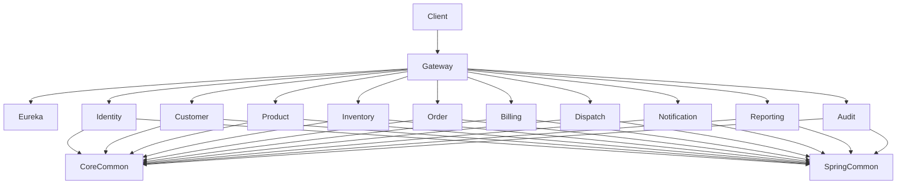
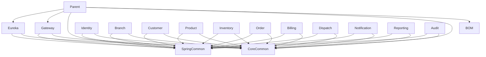
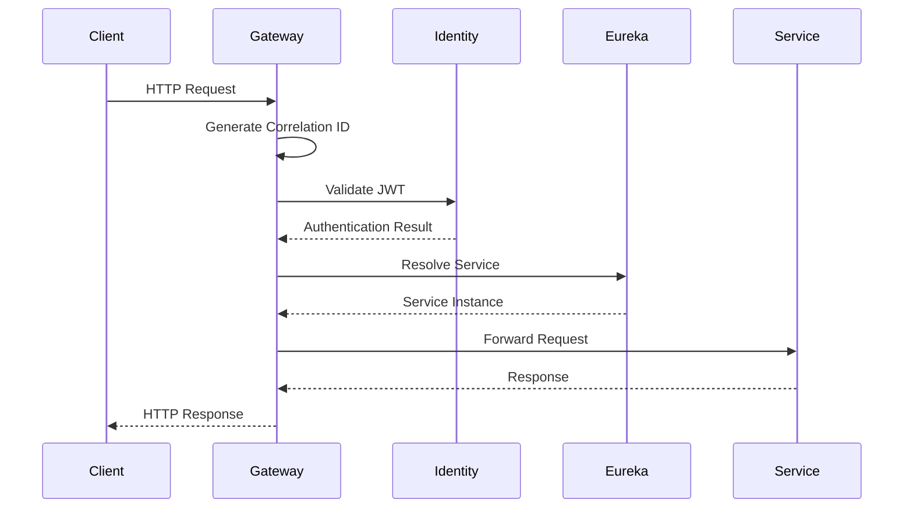
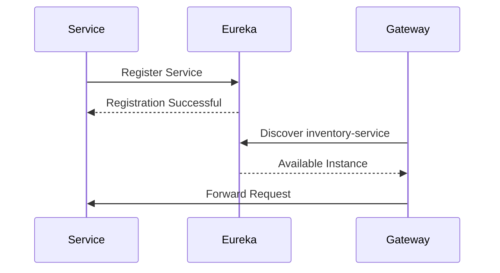
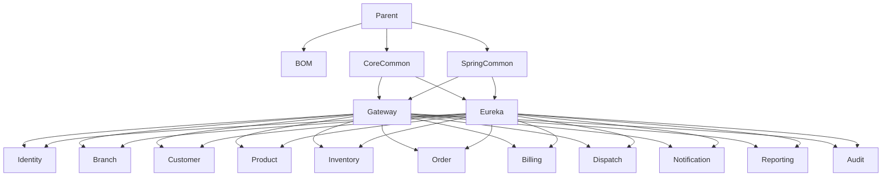

# SRS-001: DHS Platform Foundation Software Requirements Specification

---

# 1. Document Information

| Field          | Value                                                   |
| -------------- | ------------------------------------------------------- |
| Project Name   | Distributed Hub and Sales (DHS) Platform                |
| Document Title | Platform Foundation Software Requirements Specification |
| Document ID    | SRS-001                                                 |
| Domain         | Enterprise Order Management System (OMS)                |
| Repository     | starone-dhs-platform                                    |
| Document Type  | Software Requirements Specification (SRS)               |
| Standard       | ISO/IEC/IEEE 29148                                      |
| Version        | v1.0.0                                                  |
| Status         | Draft                                                   |
| Author         | Sachin Salunke                                          |
| Owner          | Enterprise Architecture                                 |
| Last Updated   | 2026-06-27                                              |

---

# 2. Document Control

## 2.1 Document Metadata

| Field                | Value                                            |
| -------------------- | ------------------------------------------------ |
| Repository           | starone-dhs-platform                             |
| Platform             | StarOne Galaxy                                   |
| Architecture Style   | Cloud-Native Monorepo Multi-Module Microservices |
| Programming Language | Java 21                                          |
| Framework            | Spring Boot 3.x                                  |
| Build Tool           | Maven                                            |
| Repository Strategy  | Monorepo                                         |
| Deployment Target    | Kubernetes                                       |
| Runtime              | JVM                                              |
| Status               | Draft                                            |

---

## 2.2 Revision History

| Version | Date       | Author         | Description                     |
| ------- | ---------- | -------------- | ------------------------------- |
| v1.0.0  | 2026-06-27 | Sachin Salunke | Initial Platform Foundation SRS |

---

## 2.3 Approval Matrix

| Role                 | Status  |
| -------------------- | ------- |
| Product Owner        | Pending |
| Enterprise Architect | Pending |
| Solution Architect   | Pending |
| Platform Lead        | Pending |
| DevOps Lead          | Pending |
| Security Lead        | Pending |
| QA Lead              | Pending |

---

## 2.4 References

| Reference ID | Document                                               |
| ------------ | ------------------------------------------------------ |
| BRD-001      | Business Requirements Document                         |
| PRD-001      | Product Requirements Document                          |
| ADR-001      | Monorepo-Based Multi-Module Microservices Architecture |
| ADR-002      | Database Strategy Decision                             |
| ADR-003      | Inter-Service Communication Strategy                   |
| ADR-004      | Service Discovery Strategy                             |
| ADR-005      | API Gateway Strategy                                   |
| ADR-006      | Distributed Transaction Strategy                       |
| HLD-001      | High-Level Design                                      |
| FRD-001      | Platform Foundation Functional Requirements            |
| RTM-001      | Requirements Traceability Matrix                       |

---

# 3. Introduction

## 3.1 Purpose

This Software Requirements Specification (SRS) defines the software requirements for the **Platform Foundation** of the Distributed Hub and Sales (DHS) Platform.

The Platform Foundation provides the common runtime capabilities required by every DHS microservice. It establishes standardized technical capabilities that eliminate duplicated implementation across business services while ensuring consistency, interoperability, security, maintainability, and operational visibility.

This specification defines **what the Platform Foundation shall provide**.

Implementation details, package structures, algorithms, and class designs are defined within the corresponding Low-Level Design (LLD) documents.

---

## 3.2 Scope

This specification applies only to the shared runtime platform components implemented within the **starone-dhs-platform** repository.

The Platform Foundation includes:

- Parent Maven Project
- Enterprise BOM
- Core Common Library
- Spring Common Library
- API Gateway
- Service Discovery
- Shared Security Components
- Shared Validation Components
- Shared Exception Framework
- Shared Logging Framework
- Shared Observability Components
- Shared OpenAPI Configuration
- Shared Feign Configuration
- Shared Platform Contracts

This specification does not include:

- Business Services
- Business Workflows
- Kubernetes Manifests
- Helm Charts
- Docker Images
- GitHub Actions
- Infrastructure Automation
- Environment Configuration
- Enterprise Governance
- Coding Standards

---

## 3.3 Intended Audience

This document is intended for:

- Enterprise Architects
- Solution Architects
- Software Architects
- Platform Engineers
- Backend Developers
- DevOps Engineers
- Security Engineers
- QA Engineers
- Technical Leads

---

## 3.4 Objectives

The objectives of the Platform Foundation are:

- Standardize platform capabilities.
- Reduce duplicated implementation.
- Improve developer productivity.
- Provide centralized runtime services.
- Enable service interoperability.
- Improve platform maintainability.
- Support independent service deployment.
- Enable secure service communication.
- Provide operational observability.
- Simplify future platform evolution.

---

# 4. Overall Description

## 4.1 Platform Overview

The Platform Foundation is the technical backbone of the DHS Platform.

It provides reusable software components and runtime services consumed by all business microservices.

The Platform Foundation shall not implement any business capability.

Business logic shall remain within individual domain services.

---

## 4.2 Responsibilities

The Platform Foundation shall provide:

- Centralized API routing.
- Service registration.
- Service discovery.
- Shared dependency management.
- Shared Spring Boot configuration.
- Shared DTOs.
- Shared Events.
- Shared Exception Handling.
- Shared Validation.
- Shared Logging.
- Shared Security Components.
- Shared API Contracts.
- Shared Feign Configuration.
- Shared OpenAPI Configuration.
- Correlation ID propagation.
- Distributed tracing integration.

---

## 4.3 Out of Scope

The Platform Foundation shall not provide:

- Customer Management
- Order Management
- Inventory Management
- Billing Management
- Dispatch Management
- Reporting
- Audit Processing
- Notification Processing
- Business Validation Rules
- Domain Data Management

These responsibilities belong to their respective business services.

---

## 4.4 Platform Principles

The Platform Foundation shall follow these principles:

- API First
- Cloud Native
- Stateless Processing
- Configuration Externalization
- Shared Component Reuse
- Independent Deployability
- Security by Design
- Observability by Default
- Contract First Development
- Backward Compatibility
- Fail Fast Principles
- Loose Coupling
- High Cohesion

---

# 5. Platform Architecture Overview

The Platform Foundation provides the runtime infrastructure used by every DHS business service.

```text
                        External Clients
                               │
                               ▼
                     API Gateway Service
                               │
                               ▼
                    Service Discovery Server
                               │
      ┌───────────────┬──────────────┬───────────────┐
      ▼               ▼              ▼
 Identity Service  Customer Service Order Service ...
      │               │              │
      └───────────────┴──────────────┘
               Shared Platform Libraries
      ┌────────────────────────────────────────────┐
      │ Parent POM                                │
      │ Enterprise BOM                            │
      │ Core Common                               │
      │ Spring Common                             │
      │ Security Components                       │
      │ Validation Components                     │
      │ Exception Framework                       │
      │ Logging Framework                         │
      │ Observability Components                  │
      └────────────────────────────────────────────┘
```

---

## 5.1 Repository Structure

```text
starone-dhs-platform

├── parent
├── bom
├── core-common
├── spring-common

├── gateway
├── eureka

├── identity-service
├── branch-service
├── customer-service
├── product-service
├── inventory-service
├── order-service
├── billing-service
├── dispatch-service
├── notification-service
├── reporting-service
└── audit-service
```

---

## 5.2 Platform Components

| Component     | Responsibility                   |
| ------------- | -------------------------------- |
| Parent        | Parent Maven Project             |
| BOM           | Central Dependency Management    |
| Core Common   | Shared DTOs, Events, Utilities   |
| Spring Common | Shared Spring Configuration      |
| Gateway       | External API Entry Point         |
| Eureka        | Service Registration & Discovery |

---

## 5.3 Component Relationships



---

# 6. Platform Component Overview

The Platform Foundation consists of the following software components.

| Component     | Type            | Purpose                          |
| ------------- | --------------- | -------------------------------- |
| Parent        | Build Component | Parent Maven Configuration       |
| BOM           | Build Component | Dependency Version Management    |
| Core Common   | Shared Library  | Common Business Objects          |
| Spring Common | Shared Library  | Shared Spring Boot Configuration |
| Gateway       | Runtime Service | API Routing                      |
| Eureka        | Runtime Service | Service Discovery                |

Each component shall expose clearly defined responsibilities and shall avoid embedding business logic.

---

# 7. Platform Component Specifications

This section defines the software requirements for every Platform Foundation component.

The Platform Foundation consists of reusable runtime components that provide standardized capabilities for all DHS business services.

Each component shall have clearly defined responsibilities and shall not contain business-specific logic.

---

# 7.1 Parent Project

## 7.1.1 Purpose

The Parent Project shall serve as the root Maven project for the DHS Platform.

It shall provide centralized project configuration and build management for every platform module.

---

## 7.1.2 Responsibilities

The Parent Project shall:

- Define the Maven multi-module hierarchy.
- Manage project versioning.
- Define common plugin management.
- Define compiler configuration.
- Define Java version.
- Define repository configuration.
- Define common build profiles.
- Define project encoding.
- Define common quality plugins.

---

## 7.1.3 Functional Requirements

### SYS-PF-001

The Parent Project shall define the root Maven project for the DHS Platform.

---

### SYS-PF-002

The Parent Project shall define the build order for every platform module.

---

### SYS-PF-003

The Parent Project shall define centralized plugin management.

---

### SYS-PF-004

The Parent Project shall support Java 21.

---

### SYS-PF-005

The Parent Project shall support Spring Boot 3.x.

---

### SYS-PF-006

The Parent Project shall support Maven Wrapper.

---

### SYS-PF-007

The Parent Project shall enforce UTF-8 encoding.

---

### SYS-PF-008

The Parent Project shall provide reusable Maven profiles.

---

## 7.1.4 Dependencies

The Parent Project shall manage:

- Enterprise BOM
- Core Common
- Spring Common
- Gateway
- Eureka
- Every business service

---

# 7.2 Enterprise BOM

## 7.2.1 Purpose

The Enterprise Bill of Materials (BOM) shall provide centralized dependency version management across the DHS Platform.

The BOM shall ensure dependency consistency throughout every module.

---

## 7.2.2 Responsibilities

The BOM shall:

- Manage dependency versions.
- Eliminate dependency conflicts.
- Standardize framework versions.
- Simplify dependency upgrades.
- Support reproducible builds.

---

## 7.2.3 Functional Requirements

### SYS-PF-009

The BOM shall define all approved dependency versions.

---

### SYS-PF-010

The BOM shall manage Spring Boot dependencies.

---

### SYS-PF-011

The BOM shall manage Spring Cloud dependencies.

---

### SYS-PF-012

The BOM shall manage Kafka dependencies.

---

### SYS-PF-013

The BOM shall manage PostgreSQL dependencies.

---

### SYS-PF-014

The BOM shall manage Redis dependencies.

---

### SYS-PF-015

The BOM shall manage Micrometer dependencies.

---

### SYS-PF-016

The BOM shall manage OpenTelemetry dependencies.

---

### SYS-PF-017

The BOM shall manage testing dependencies.

---

### SYS-PF-018

The BOM shall ensure version compatibility across every module.

---

## 7.2.4 Dependency Categories

The BOM shall manage versions for:

- Spring Boot
- Spring Cloud
- Spring Security
- Spring Data
- Kafka
- Redis
- PostgreSQL
- OpenAPI
- Micrometer
- OpenTelemetry
- MapStruct
- Lombok
- Jackson
- Validation Framework
- JUnit
- Mockito
- Testcontainers

---

# 7.3 Core Common Library

## 7.3.1 Purpose

The Core Common Library shall provide reusable platform-independent components shared by every DHS service.

The Core Common Library shall not depend upon Spring Framework.

---

## 7.3.2 Responsibilities

The Core Common Library shall provide:

- Common DTOs
- Base Request Models
- Base Response Models
- Event Contracts
- Common Constants
- Enumerations
- Utility Classes
- Common Exceptions
- Error Models
- Pagination Models
- Audit Models

---

## 7.3.3 Functional Requirements

### SYS-PF-019

The Core Common Library shall provide reusable DTO models.

---

### SYS-PF-020

The Core Common Library shall provide standardized API response models.

---

### SYS-PF-021

The Core Common Library shall provide standardized error models.

---

### SYS-PF-022

The Core Common Library shall provide reusable event models.

---

### SYS-PF-023

The Core Common Library shall provide reusable pagination models.

---

### SYS-PF-024

The Core Common Library shall provide reusable audit models.

---

### SYS-PF-025

The Core Common Library shall provide reusable constants.

---

### SYS-PF-026

The Core Common Library shall provide reusable enumerations.

---

### SYS-PF-027

The Core Common Library shall provide common utility classes.

---

### SYS-PF-028

The Core Common Library shall remain independent of Spring Framework.

---

## 7.3.4 Library Contents

The Core Common Library shall contain:

- DTO Models
- Event Models
- Error Models
- Pagination Models
- Response Wrapper
- Constants
- Enums
- Utilities
- Audit Models

---

# 7.4 Spring Common Library

## 7.4.1 Purpose

The Spring Common Library shall provide reusable Spring Boot components shared across every DHS service.

---

## 7.4.2 Responsibilities

The Spring Common Library shall provide:

- Exception Handling
- Global Configuration
- Common Beans
- Validation
- Logging
- Security Utilities
- OpenAPI Configuration
- Feign Configuration
- Jackson Configuration
- Correlation ID Management
- Request Filters

---

## 7.4.3 Functional Requirements

### SYS-PF-029

The Spring Common Library shall provide standardized exception handling.

---

### SYS-PF-030

The Spring Common Library shall provide standardized validation.

---

### SYS-PF-031

The Spring Common Library shall provide standardized logging.

---

### SYS-PF-032

The Spring Common Library shall provide reusable OpenAPI configuration.

---

### SYS-PF-033

The Spring Common Library shall provide reusable Feign configuration.

---

### SYS-PF-034

The Spring Common Library shall provide reusable Jackson configuration.

---

### SYS-PF-035

The Spring Common Library shall provide Correlation ID propagation.

---

### SYS-PF-036

The Spring Common Library shall provide request logging filters.

---

### SYS-PF-037

The Spring Common Library shall provide response logging filters.

---

### SYS-PF-038

The Spring Common Library shall provide common Spring Boot auto-configuration.

---

## 7.4.4 Shared Components

The Spring Common Library shall expose:

- Global Exception Handler
- Validation Configuration
- Request Filter
- Response Filter
- Correlation Filter
- Logging Configuration
- OpenAPI Configuration
- Feign Configuration
- Jackson Configuration
- Bean Configuration

---

# 7.5 Component Dependency Diagram



---

# 7.6 Component Design Principles

Every Platform Foundation component shall comply with the following principles:

- Single Responsibility Principle
- Dependency Inversion Principle
- Reusability
- Loose Coupling
- High Cohesion
- Backward Compatibility
- Framework Independence where applicable
- Standardized Interfaces
- Testability
- Maintainability

---

# 8. API Gateway Software Specification

The API Gateway is the single entry point for all external client requests entering the DHS Platform.

The API Gateway provides centralized request routing, authentication, authorization, request filtering, rate limiting, monitoring, and API governance.

No external client shall directly invoke any business service.

---

# 8.1 Purpose

The API Gateway shall provide a centralized ingress layer for all HTTP requests entering the DHS Platform.

It shall abstract internal service topology from clients while enforcing platform-wide policies.

---

# 8.2 Responsibilities

The API Gateway shall provide:

- API routing
- Request forwarding
- JWT authentication
- Authorization
- Request validation
- Correlation ID generation
- Distributed tracing propagation
- Rate limiting
- Load balancing
- Request logging
- Response logging
- API version routing
- OpenAPI aggregation
- Health endpoints

---

# 8.3 Out of Scope

The API Gateway shall not:

- Execute business logic
- Persist business data
- Manage business workflows
- Access databases
- Publish business events
- Consume Kafka events
- Implement domain validation

---

# 8.4 Dependencies

The API Gateway depends upon:

- Spring Cloud Gateway
- Eureka Server
- Core Common Library
- Spring Common Library
- Identity Service
- Spring Cloud Config

---

# 8.5 Functional Requirements

### SYS-PF-039

The API Gateway shall be the only external entry point into the DHS Platform.

---

### SYS-PF-040

The API Gateway shall route incoming requests to registered services.

---

### SYS-PF-041

The API Gateway shall resolve target services using Eureka Service Discovery.

---

### SYS-PF-042

The API Gateway shall reject requests for unavailable services.

---

### SYS-PF-043

The API Gateway shall support route predicates.

---

### SYS-PF-044

The API Gateway shall support route filters.

---

### SYS-PF-045

The API Gateway shall support path rewriting.

---

### SYS-PF-046

The API Gateway shall support HTTP header manipulation.

---

### SYS-PF-047

The API Gateway shall support request transformation.

---

### SYS-PF-048

The API Gateway shall support response transformation.

---

### SYS-PF-049

The API Gateway shall support centralized Cross-Origin Resource Sharing (CORS) configuration.

---

### SYS-PF-050

The API Gateway shall support HTTPS communication.

---

### SYS-PF-051

The API Gateway shall reject unsupported HTTP methods.

---

### SYS-PF-052

The API Gateway shall support API version routing.

---

### SYS-PF-053

The API Gateway shall expose standardized health endpoints.

---

### SYS-PF-054

The API Gateway shall expose readiness endpoints.

---

### SYS-PF-055

The API Gateway shall expose liveness endpoints.

---

# 8.6 Route Management

The API Gateway shall maintain centralized route definitions.

Routes shall support:

- Static routes
- Dynamic routes
- Service Discovery routes
- Versioned routes

Example:

| Client Path                | Target Service       |
| -------------------------- | -------------------- |
| /api/v1/auth/\*\*          | Identity Service     |
| /api/v1/branches/\*\*      | Branch Service       |
| /api/v1/customers/\*\*     | Customer Service     |
| /api/v1/products/\*\*      | Product Service      |
| /api/v1/inventory/\*\*     | Inventory Service    |
| /api/v1/orders/\*\*        | Order Service        |
| /api/v1/billing/\*\*       | Billing Service      |
| /api/v1/dispatch/\*\*      | Dispatch Service     |
| /api/v1/notifications/\*\* | Notification Service |
| /api/v1/reporting/\*\*     | Reporting Service    |
| /api/v1/audit/\*\*         | Audit Service        |

---

# 8.7 Authentication Requirements

### SEC-PF-001

The API Gateway shall authenticate every protected request.

---

### SEC-PF-002

The API Gateway shall validate JWT access tokens.

---

### SEC-PF-003

The API Gateway shall reject expired tokens.

---

### SEC-PF-004

The API Gateway shall reject malformed tokens.

---

### SEC-PF-005

The API Gateway shall reject invalid signatures.

---

### SEC-PF-006

The API Gateway shall propagate authenticated user context.

---

### SEC-PF-007

The API Gateway shall forward authenticated requests only.

---

# 8.8 Authorization Requirements

### SEC-PF-008

The API Gateway shall enforce Role-Based Access Control.

---

### SEC-PF-009

The API Gateway shall support endpoint authorization.

---

### SEC-PF-010

The API Gateway shall support permission-based authorization.

---

### SEC-PF-011

The API Gateway shall reject unauthorized requests.

---

### SEC-PF-012

The API Gateway shall return HTTP 403 for forbidden access.

---

# 8.9 Gateway Filters

The API Gateway shall provide the following filters:

- Authentication Filter
- Authorization Filter
- Correlation Filter
- Request Logging Filter
- Response Logging Filter
- Rate Limiting Filter
- Header Filter
- Exception Handling Filter
- Metrics Filter
- Tracing Filter

---

# 8.10 Rate Limiting

### SYS-PF-056

The API Gateway shall support configurable rate limiting.

---

### SYS-PF-057

The API Gateway shall support user-based rate limiting.

---

### SYS-PF-058

The API Gateway shall support client-based rate limiting.

---

### SYS-PF-059

The API Gateway shall return HTTP 429 when limits are exceeded.

---

# 8.11 Request Processing

Every incoming request shall follow the sequence below.



---

# 8.12 Gateway Error Handling

The API Gateway shall standardize error responses.

Example response:

```json
{
  "timestamp": "2026-06-27T10:30:45Z",
  "status": 401,
  "error": "Unauthorized",
  "code": "AUTH-401",
  "message": "JWT token is invalid.",
  "correlationId": "5b45d8b7-f6b0-47bb-a4d5-1c8a74dbbb13",
  "path": "/api/v1/orders"
}
```

---

# 8.13 Gateway Logging

The API Gateway shall log:

- Request ID
- Correlation ID
- Trace ID
- Span ID
- HTTP Method
- URI
- Client IP
- User ID
- Response Status
- Response Time

Sensitive information shall never be logged.

---

# 8.14 Gateway Monitoring

The API Gateway shall expose:

- Health Endpoint
- Liveness Endpoint
- Readiness Endpoint
- Metrics Endpoint
- Prometheus Endpoint

---

# 8.15 Performance Requirements

### NFR-PF-001

Gateway request latency shall be less than 50 milliseconds excluding downstream processing.

---

### NFR-PF-002

The Gateway shall support horizontal scaling.

---

### NFR-PF-003

Gateway routing shall be stateless.

---

### NFR-PF-004

Gateway availability shall be 99.9%.

---

### NFR-PF-005

Gateway startup time shall be less than 30 seconds.

---

# 8.16 Acceptance Criteria

The API Gateway shall be considered complete when:

- All requests enter through the Gateway.
- JWT authentication operates successfully.
- Authorization rules are enforced.
- Service discovery routing functions correctly.
- Route configuration is dynamic.
- Correlation IDs are propagated.
- Structured logs are generated.
- Metrics are exposed.
- Health endpoints are operational.
- Rate limiting functions correctly.
- OpenAPI documentation is accessible.

---

# 9. Service Discovery (Eureka) Software Specification

The Service Discovery component provides centralized service registration and discovery for all DHS Platform services.

It enables dynamic service resolution, supports horizontal scalability, and eliminates static service endpoint configuration.

Every runtime service within the DHS Platform shall register with the Service Discovery Server.

---

# 9.1 Purpose

The Service Discovery component shall provide centralized service registration, discovery, health monitoring, and runtime service resolution for all DHS platform services.

The Service Discovery component shall maintain an up-to-date registry of all active service instances.

---

# 9.2 Responsibilities

The Service Discovery component shall provide:

- Service registration
- Service discovery
- Service registry management
- Heartbeat monitoring
- Lease management
- Health monitoring
- Dynamic endpoint resolution
- Service metadata management
- Load-balanced instance lookup
- Service availability monitoring

---

# 9.3 Out of Scope

The Service Discovery component shall not:

- Execute business logic
- Authenticate users
- Authorize requests
- Route external requests
- Persist business data
- Publish Kafka events
- Consume Kafka events

---

# 9.4 Dependencies

The Service Discovery component depends upon:

- Spring Cloud Netflix Eureka
- Spring Boot
- Spring Cloud Config
- Core Common Library
- Spring Common Library

The following DHS services depend upon Service Discovery:

- Gateway
- Identity Service
- Branch Service
- Customer Service
- Product Service
- Inventory Service
- Order Service
- Billing Service
- Dispatch Service
- Notification Service
- Reporting Service
- Audit Service

---

# 9.5 Functional Requirements

### SYS-PF-060

The Service Discovery component shall provide centralized service registration.

---

### SYS-PF-061

The Service Discovery component shall maintain a registry of active service instances.

---

### SYS-PF-062

The Service Discovery component shall support automatic service registration.

---

### SYS-PF-063

The Service Discovery component shall support automatic service deregistration.

---

### SYS-PF-064

The Service Discovery component shall support runtime service discovery.

---

### SYS-PF-065

The Service Discovery component shall support multiple service instances.

---

### SYS-PF-066

The Service Discovery component shall support dynamic endpoint resolution.

---

### SYS-PF-067

The Service Discovery component shall expose service metadata.

---

### SYS-PF-068

The Service Discovery component shall remove unavailable service instances automatically.

---

### SYS-PF-069

The Service Discovery component shall expose registry information to authorized clients.

---

# 9.6 Service Registration

Every DHS runtime service shall register itself during application startup.

Registration shall include:

- Service Name
- Instance ID
- Host Name
- IP Address
- Port
- Health Status
- Metadata
- Registration Timestamp

Each service instance shall have a unique Instance ID.

---

# 9.7 Service Discovery

Registered services shall discover target services using logical service names rather than fixed URLs.

Example:

| Logical Service Name | Description                    |
| -------------------- | ------------------------------ |
| identity-service     | Authentication & Authorization |
| branch-service       | Branch Management              |
| customer-service     | Customer Management            |
| product-service      | Product Catalog                |
| inventory-service    | Inventory Management           |
| order-service        | Order Processing               |
| billing-service      | Billing                        |
| dispatch-service     | Dispatch                       |
| notification-service | Notifications                  |
| reporting-service    | Reporting                      |
| audit-service        | Audit                          |

---

# 9.8 Service Registry

The Service Registry shall maintain the following information for every registered service instance.

| Attribute         | Description                |
| ----------------- | -------------------------- |
| Service Name      | Logical service identifier |
| Instance ID       | Unique instance identifier |
| Host              | Service host               |
| Port              | Listening port             |
| Status            | Current health status      |
| Registration Time | Registration timestamp     |
| Last Heartbeat    | Latest heartbeat timestamp |
| Metadata          | Custom service metadata    |

---

# 9.9 Heartbeat Management

### SYS-PF-070

Each registered service shall periodically send heartbeat messages.

---

### SYS-PF-071

Heartbeat failures shall update service availability.

---

### SYS-PF-072

Services failing heartbeat validation shall be marked unavailable.

---

### SYS-PF-073

Unavailable service instances shall be removed after lease expiration.

---

# 9.10 Lease Management

### SYS-PF-074

Every registered service shall obtain a lease.

---

### SYS-PF-075

Leases shall be renewed automatically through heartbeat messages.

---

### SYS-PF-076

Expired leases shall trigger automatic deregistration.

---

### SYS-PF-077

Lease expiration duration shall be configurable.

---

# 9.11 Service Resolution

Every DHS service shall resolve destination services using Eureka.

Static URLs shall not be used.

Example:

```text
Order Service

↓

inventory-service

↓

Resolved by Eureka

↓

Available Instance

↓

HTTP Request
```

---

# 9.12 Service Discovery Workflow



---

# 9.13 High Availability Requirements

### NFR-PF-006

The Service Discovery component shall support high availability deployment.

---

### NFR-PF-007

The Service Discovery component shall support clustering.

---

### NFR-PF-008

Service registration shall remain available during instance failures.

---

### NFR-PF-009

The registry shall recover automatically after restart.

---

# 9.14 Performance Requirements

### NFR-PF-010

Service registration shall complete within 2 seconds.

---

### NFR-PF-011

Service lookup shall complete within 50 milliseconds.

---

### NFR-PF-012

Heartbeat processing shall not impact service discovery latency.

---

### NFR-PF-013

The registry shall support at least 500 simultaneous service instances.

---

# 9.15 Security Requirements

### SEC-PF-013

Only authorized platform services shall register with the registry.

---

### SEC-PF-014

Service Discovery communication shall use TLS.

---

### SEC-PF-015

Administrative endpoints shall require authentication.

---

### SEC-PF-016

Registry metadata shall not expose confidential information.

---

# 9.16 Logging Requirements

The Service Discovery component shall log:

- Service registration
- Service deregistration
- Heartbeat failures
- Lease expiration
- Registry updates
- Service lookup failures
- Configuration changes
- Startup events
- Shutdown events

Sensitive information shall not be logged.

---

# 9.17 Monitoring Requirements

The Service Discovery component shall expose:

- Health Endpoint
- Readiness Endpoint
- Liveness Endpoint
- Metrics Endpoint
- Registry Statistics
- Active Service Count
- Instance Count
- Registration Rate
- Heartbeat Failures

---

# 9.18 Error Handling

The Service Discovery component shall return standardized errors.

Example:

```json
{
  "timestamp": "2026-06-27T11:45:20Z",
  "status": 503,
  "error": "Service Unavailable",
  "code": "DISCOVERY-503",
  "message": "Requested service is currently unavailable.",
  "correlationId": "8b77f2f4-4d45-4fd5-9d8d-76dc1d2ef7d3"
}
```

---

# 9.19 Acceptance Criteria

The Service Discovery component shall be considered complete when:

- Services register successfully.
- Services deregister automatically.
- Heartbeats renew leases.
- Expired services are removed automatically.
- Gateway discovers services successfully.
- Business services discover one another successfully.
- Registry remains highly available.
- Health endpoints operate correctly.
- Metrics are exposed successfully.
- Registry recovers after restart.
- Service lookup latency remains within defined limits.

---

# 10. Platform Functional Requirements

This section defines the functional software requirements for the DHS Platform Foundation.

The Platform Foundation shall provide standardized technical capabilities that are shared across every DHS microservice.

These requirements are technology-independent functional requirements and shall be implemented by the appropriate Platform Foundation components.

---

# 10.1 Functional Requirement Categories

The Platform Foundation shall provide the following functional capabilities:

- Shared Framework Services
- Common DTO Framework
- Common Response Framework
- Common Event Framework
- Validation Framework
- Exception Handling Framework
- Security Framework
- Logging Framework
- Observability Framework
- OpenAPI Framework
- OpenFeign Framework
- Utility Framework
- Configuration Framework

---

# 10.2 Shared Framework Requirements

### SYS-PF-078

The Platform Foundation shall provide reusable software components shared across all platform services.

---

### SYS-PF-079

Shared components shall eliminate duplicate implementation across services.

---

### SYS-PF-080

Shared components shall maintain backward compatibility.

---

### SYS-PF-081

Shared components shall support independent version evolution.

---

### SYS-PF-082

Shared components shall be reusable without business-specific customization.

---

# 10.3 Common DTO Framework

The Platform Foundation shall provide standardized request and response models.

The Common DTO Framework shall include:

- Base Request
- Base Response
- Pagination Request
- Pagination Response
- Search Request
- Audit Information
- Metadata
- API Error Response

---

### SYS-PF-083

All services shall use standardized request DTOs.

---

### SYS-PF-084

All services shall use standardized response DTOs.

---

### SYS-PF-085

All responses shall support metadata.

---

### SYS-PF-086

All paginated responses shall use a common pagination model.

---

### SYS-PF-087

DTO serialization shall remain platform consistent.

---

# 10.4 Response Framework

The Platform Foundation shall define a standardized API response model.

Every REST API shall return a common response structure.

Example

```json
{
  "success": true,
  "message": "Request processed successfully.",
  "data": {},
  "metadata": {},
  "timestamp": "2026-06-27T12:00:00Z",
  "correlationId": "UUID"
}
```

---

### SYS-PF-088

Every successful API shall return the standard response model.

---

### SYS-PF-089

Every error response shall return the standard error model.

---

### SYS-PF-090

Response metadata shall support pagination.

---

### SYS-PF-091

Responses shall include a Correlation ID.

---

### SYS-PF-092

Responses shall include timestamps.

---

# 10.5 Common Event Framework

The Platform Foundation shall define reusable event contracts.

The Event Framework shall standardize event structures exchanged through Kafka.

Common event attributes shall include:

- Event ID
- Event Name
- Event Version
- Event Source
- Correlation ID
- Timestamp
- Payload

---

### SYS-PF-093

Every published event shall follow the common event model.

---

### SYS-PF-094

Every consumed event shall support schema versioning.

---

### SYS-PF-095

Events shall support backward compatibility.

---

### SYS-PF-096

Events shall include Correlation IDs.

---

### SYS-PF-097

Events shall include event timestamps.

---

# 10.6 Validation Framework

The Platform Foundation shall provide centralized validation support.

Validation shall support:

- Request Validation
- Bean Validation
- Custom Validation
- Constraint Validation
- Cross-field Validation

---

### SYS-PF-098

Validation shall use Jakarta Bean Validation.

---

### SYS-PF-099

Validation annotations shall be reusable.

---

### SYS-PF-100

Validation failures shall return standardized error responses.

---

### SYS-PF-101

Business services shall extend the validation framework.

---

# 10.7 Exception Handling Framework

The Platform Foundation shall provide centralized exception handling.

Supported exception categories shall include:

- Validation Exceptions
- Authentication Exceptions
- Authorization Exceptions
- Business Exceptions
- Integration Exceptions
- Resource Exceptions
- Technical Exceptions
- Unknown Exceptions

---

### SYS-PF-102

The Platform Foundation shall provide a Global Exception Handler.

---

### SYS-PF-103

All exceptions shall return standardized error responses.

---

### SYS-PF-104

Exception responses shall include Correlation IDs.

---

### SYS-PF-105

Exception responses shall support localization.

---

### SYS-PF-106

Exception handling shall support custom business exceptions.

---

# 10.8 OpenAPI Framework

The Platform Foundation shall provide centralized API documentation support.

The framework shall provide:

- API Metadata
- Security Definitions
- Common Responses
- Error Definitions
- Tag Management
- API Grouping

---

### SYS-PF-107

Every REST API shall be documented.

---

### SYS-PF-108

The Platform Foundation shall expose OpenAPI documentation.

---

### SYS-PF-109

Security requirements shall appear within API documentation.

---

### SYS-PF-110

Common API responses shall be reusable.

---

# 10.9 OpenFeign Framework

The Platform Foundation shall provide reusable inter-service communication support.

The framework shall provide:

- Common Feign Configuration
- Retry Policies
- Logging
- Error Decoders
- Request Interceptors
- Response Interceptors

---

### SYS-PF-111

Inter-service REST communication shall use standardized Feign configuration.

---

### SYS-PF-112

Feign clients shall support centralized logging.

---

### SYS-PF-113

Feign clients shall propagate Correlation IDs.

---

### SYS-PF-114

Feign clients shall support configurable retry policies.

---

### SYS-PF-115

Feign exceptions shall use standardized error handling.

---

# 10.10 Utility Framework

The Platform Foundation shall provide reusable utility components.

The Utility Framework shall include:

- Date Utilities
- String Utilities
- Collection Utilities
- JSON Utilities
- UUID Utilities
- Encryption Utilities
- File Utilities
- Number Utilities

---

### SYS-PF-116

Utility classes shall be stateless.

---

### SYS-PF-117

Utility classes shall not contain business logic.

---

### SYS-PF-118

Utility classes shall remain framework independent where practical.

---

# 10.11 Configuration Framework

The Platform Foundation shall provide reusable configuration abstractions.

Configuration support shall include:

- Property Binding
- Configuration Validation
- Default Values
- Environment Profiles

---

### SYS-PF-119

Configuration properties shall support externalization.

---

### SYS-PF-120

Configuration classes shall support profile-specific behavior.

---

### SYS-PF-121

Configuration validation shall occur during application startup.

---

# 10.12 Requirement Traceability

| Requirement              | Platform Component      |
| ------------------------ | ----------------------- |
| SYS-PF-078 to SYS-PF-082 | Shared Framework        |
| SYS-PF-083 to SYS-PF-087 | DTO Framework           |
| SYS-PF-088 to SYS-PF-092 | Response Framework      |
| SYS-PF-093 to SYS-PF-097 | Event Framework         |
| SYS-PF-098 to SYS-PF-101 | Validation Framework    |
| SYS-PF-102 to SYS-PF-106 | Exception Framework     |
| SYS-PF-107 to SYS-PF-110 | OpenAPI Framework       |
| SYS-PF-111 to SYS-PF-115 | OpenFeign Framework     |
| SYS-PF-116 to SYS-PF-118 | Utility Framework       |
| SYS-PF-119 to SYS-PF-121 | Configuration Framework |

---

# 10.13 Platform Functional Acceptance Criteria

The Platform Foundation shall satisfy the following acceptance criteria:

- Shared frameworks are reusable by every DHS service.
- Common DTOs are adopted across all REST APIs.
- Response models remain standardized.
- Event contracts are consistently implemented.
- Validation framework is reusable.
- Exception handling is centralized.
- OpenAPI documentation is generated successfully.
- OpenFeign communication is standardized.
- Utility components are reusable.
- Configuration abstractions support all runtime services.
- No business logic exists within Platform Foundation shared components.

---

# 11. External Interface Requirements

This section defines the external software interfaces used by the Platform Foundation.

The Platform Foundation shall expose standardized interfaces to enable secure and reliable communication between clients, platform services, and business services.

---

# 11.1 Interface Categories

The Platform Foundation shall support the following interface categories:

- REST Interfaces
- Internal Service Interfaces
- Service Discovery Interfaces
- Configuration Interfaces
- Event Interfaces
- Monitoring Interfaces
- Management Interfaces

---

# 11.2 REST Interface Requirements

The Platform Foundation shall expose REST APIs through the API Gateway.

Every REST interface shall conform to the platform API standards.

---

### COM-PF-001

All REST APIs shall use HTTPS.

---

### COM-PF-002

All REST APIs shall exchange JSON payloads.

---

### COM-PF-003

REST APIs shall use UTF-8 encoding.

---

### COM-PF-004

REST APIs shall support API versioning.

Example:

```text
/api/v1/...
```

---

### COM-PF-005

REST APIs shall use standard HTTP methods.

| Method | Usage              |
| ------ | ------------------ |
| GET    | Retrieve Resources |
| POST   | Create Resources   |
| PUT    | Replace Resources  |
| PATCH  | Partial Updates    |
| DELETE | Delete Resources   |

---

### COM-PF-006

Every REST API shall return standard HTTP status codes.

---

### COM-PF-007

REST APIs shall support idempotent operations where applicable.

---

# 11.3 Gateway Interface

The Gateway shall expose:

| Endpoint             | Purpose               |
| -------------------- | --------------------- |
| /actuator/health     | Health Check          |
| /actuator/info       | Platform Information  |
| /actuator/prometheus | Metrics               |
| /v3/api-docs         | OpenAPI Specification |
| /swagger-ui          | API Documentation     |

---

# 11.4 Service Discovery Interface

The Service Discovery Server shall expose interfaces for:

- Service Registration
- Service Deregistration
- Service Lookup
- Registry Information
- Health Monitoring

---

### COM-PF-008

Service registration shall occur automatically during application startup.

---

### COM-PF-009

Service lookup shall use logical service names.

---

### COM-PF-010

Service discovery shall support multiple instances.

---

# 11.5 Internal Service Communication

Internal service communication shall use:

- OpenFeign
- REST
- Eureka Service Discovery

Direct IP-based communication shall not be used.

---

### COM-PF-011

Inter-service communication shall resolve services through Eureka.

---

### COM-PF-012

Correlation IDs shall be propagated between services.

---

### COM-PF-013

Distributed tracing context shall propagate across service boundaries.

---

### COM-PF-014

Inter-service communication shall support configurable timeouts.

---

### COM-PF-015

Retry behavior shall be configurable.

---

# 11.6 Event Interface Requirements

Asynchronous communication shall use Apache Kafka.

The Platform Foundation shall provide standardized event contracts.

---

### COM-PF-016

Events shall use JSON payloads.

---

### COM-PF-017

Every event shall include an Event ID.

---

### COM-PF-018

Every event shall include a Correlation ID.

---

### COM-PF-019

Every event shall include an Event Version.

---

### COM-PF-020

Events shall include Event Timestamp.

---

# 11.7 Configuration Interface

Configuration shall be retrieved from the centralized configuration service.

Platform services shall not contain hardcoded environment-specific configuration.

---

### COM-PF-021

Configuration shall support externalization.

---

### COM-PF-022

Configuration shall support environment profiles.

---

### COM-PF-023

Configuration shall support runtime refresh where applicable.

---

# 11.8 Monitoring Interface

The Platform Foundation shall expose monitoring interfaces.

Supported interfaces include:

- Health
- Metrics
- Prometheus
- OpenTelemetry
- Actuator

---

### COM-PF-024

Monitoring endpoints shall support authenticated access where required.

---

### COM-PF-025

Metrics shall expose service performance indicators.

---

### COM-PF-026

Health endpoints shall report application readiness.

---

# 11.9 Management Interface

Administrative interfaces shall support:

- Health Monitoring
- Metrics
- Service Information
- Runtime Diagnostics

Administrative interfaces shall not expose business operations.

---

# 12. Non-Functional Requirements

The Platform Foundation shall satisfy the following quality attributes.

---

# 12.1 Performance Requirements

### NFR-PF-014

REST API response time shall be less than 200 milliseconds excluding downstream processing.

---

### NFR-PF-015

Gateway routing latency shall be less than 50 milliseconds.

---

### NFR-PF-016

Service discovery lookup shall complete within 50 milliseconds.

---

### NFR-PF-017

Application startup time shall be less than 30 seconds.

---

### NFR-PF-018

Configuration loading shall complete before service initialization.

---

# 12.2 Scalability Requirements

### NFR-PF-019

Platform services shall support horizontal scaling.

---

### NFR-PF-020

The Gateway shall support multiple concurrent instances.

---

### NFR-PF-021

Service Discovery shall support clustered deployment.

---

### NFR-PF-022

Platform services shall remain stateless.

---

# 12.3 Availability Requirements

### NFR-PF-023

Platform availability shall be at least 99.9%.

---

### NFR-PF-024

Platform services shall recover automatically after failures.

---

### NFR-PF-025

Service interruption shall be minimized during deployments.

---

### NFR-PF-026

Health monitoring shall detect service failures.

---

# 12.4 Reliability Requirements

### NFR-PF-027

Unexpected failures shall not corrupt platform state.

---

### NFR-PF-028

Retry mechanisms shall support transient failures.

---

### NFR-PF-029

Circuit breaker patterns shall protect dependent services.

---

### NFR-PF-030

Platform services shall fail gracefully.

---

# 12.5 Security Requirements

### SEC-PF-017

All communication shall use TLS.

---

### SEC-PF-018

JWT shall be used for authentication.

---

### SEC-PF-019

Authorization shall follow RBAC.

---

### SEC-PF-020

Sensitive information shall not be logged.

---

### SEC-PF-021

Administrative endpoints shall require authentication.

---

### SEC-PF-022

Secrets shall never be hardcoded.

---

# 12.6 Maintainability Requirements

### NFR-PF-031

Platform components shall support modular development.

---

### NFR-PF-032

Reusable libraries shall minimize code duplication.

---

### NFR-PF-033

Platform services shall support backward compatibility.

---

### NFR-PF-034

Platform components shall follow standardized coding practices.

---

# 12.7 Observability Requirements

### NFR-PF-035

Every request shall contain a Correlation ID.

---

### NFR-PF-036

Every service shall expose metrics.

---

### NFR-PF-037

Every service shall expose health endpoints.

---

### NFR-PF-038

Distributed tracing shall be supported.

---

### NFR-PF-039

Structured logging shall be enabled.

---

# 12.8 Capacity Requirements

### NFR-PF-040

The Platform Foundation shall support at least 100 business service instances.

---

### NFR-PF-041

The Gateway shall support at least 5,000 concurrent requests.

---

### NFR-PF-042

The Service Discovery registry shall support at least 500 registered instances.

---

# 12.9 Compliance Requirements

The Platform Foundation shall comply with:

- ISO/IEC/IEEE 29148
- REST Architectural Principles
- OpenAPI 3.x
- OAuth 2.0
- JWT Standards
- TLS 1.3
- RFC 9110 HTTP Semantics

---

# 12.10 Platform Constraints

The Platform Foundation shall operate under the following constraints:

- Java 21
- Spring Boot 3.x
- Spring Cloud
- Maven Multi-Module
- PostgreSQL
- Redis
- Apache Kafka
- Kubernetes
- Docker
- GitHub Actions
- OpenTelemetry
- Micrometer

---

# 12.11 Acceptance Criteria

The Platform Foundation shall satisfy all external interface and non-functional requirements when:

- External interfaces conform to platform standards.
- REST APIs are versioned.
- HTTPS is enforced.
- Inter-service communication uses Service Discovery.
- Event contracts are standardized.
- Configuration is externalized.
- Platform performance meets defined thresholds.
- Availability objectives are achieved.
- Security controls are enforced.
- Observability capabilities are operational.
- Platform components remain scalable and maintainable.

---

# 13. Logging Requirements

The Platform Foundation shall provide standardized logging capabilities for all platform and business services.

Logging shall support operational monitoring, troubleshooting, auditing, and distributed tracing.

All services shall use the shared logging framework provided by the Platform Foundation.

---

# 13.1 Logging Objectives

The logging framework shall:

- Provide standardized log formats.
- Support centralized log aggregation.
- Enable request tracing.
- Simplify troubleshooting.
- Improve operational visibility.
- Support audit investigations.
- Minimize sensitive data exposure.

---

# 13.2 Functional Requirements

### SYS-PF-122

Every platform service shall generate structured logs.

---

### SYS-PF-123

All logs shall use JSON format.

---

### SYS-PF-124

Every request shall generate request and response logs.

---

### SYS-PF-125

Every exception shall generate an error log.

---

### SYS-PF-126

Log timestamps shall use UTC.

---

### SYS-PF-127

Logging shall support configurable log levels.

---

### SYS-PF-128

Business services shall use the shared logging framework.

---

# 13.3 Standard Log Attributes

Every log entry shall contain:

- Timestamp
- Log Level
- Service Name
- Application Name
- Environment
- Correlation ID
- Trace ID
- Span ID
- Request ID
- Thread Name
- Logger Name
- Message

---

# 13.4 Log Levels

| Level | Purpose                         |
| ----- | ------------------------------- |
| TRACE | Detailed diagnostic information |
| DEBUG | Development diagnostics         |
| INFO  | Normal application events       |
| WARN  | Recoverable warnings            |
| ERROR | Runtime failures                |

---

# 13.5 Sensitive Information

The logging framework shall never log:

- Passwords
- Access Tokens
- Refresh Tokens
- API Keys
- Encryption Keys
- Database Credentials
- OTP Values
- Personally Identifiable Information where prohibited

---

# 14. Observability Requirements

The Platform Foundation shall provide standardized observability capabilities.

Observability shall enable proactive monitoring and diagnostics across all platform services.

---

# 14.1 Functional Requirements

### SYS-PF-129

Every platform service shall expose health endpoints.

---

### SYS-PF-130

Every platform service shall expose metrics.

---

### SYS-PF-131

Every request shall support distributed tracing.

---

### SYS-PF-132

Every service shall propagate Correlation IDs.

---

### SYS-PF-133

Every service shall expose readiness status.

---

### SYS-PF-134

Every service shall expose liveness status.

---

# 14.2 Health Monitoring

The Platform Foundation shall expose:

- Health Endpoint
- Liveness Endpoint
- Readiness Endpoint
- Info Endpoint

Example endpoints:

```text
/actuator/health

/actuator/health/liveness

/actuator/health/readiness

/actuator/info
```

---

# 14.3 Metrics

The Platform Foundation shall expose metrics including:

- Request Count
- Response Time
- Error Count
- JVM Metrics
- CPU Usage
- Memory Usage
- Thread Count
- Garbage Collection
- Active Connections
- HTTP Metrics

---

# 14.4 Distributed Tracing

Every request shall support distributed tracing.

Tracing information shall include:

- Trace ID
- Span ID
- Parent Span ID
- Correlation ID

Tracing shall propagate across every service boundary.

---

# 14.5 Correlation ID

### SYS-PF-135

The Gateway shall generate a Correlation ID for every external request.

---

### SYS-PF-136

Every downstream service shall preserve the Correlation ID.

---

### SYS-PF-137

The Correlation ID shall appear in logs, events, and API responses.

---

# 15. Error Handling Requirements

The Platform Foundation shall provide centralized exception handling.

Every platform and business service shall use the shared exception framework.

---

# 15.1 Functional Requirements

### SYS-PF-138

Every exception shall return the standard error response.

---

### SYS-PF-139

Business exceptions shall be distinguishable from technical exceptions.

---

### SYS-PF-140

Every error response shall contain a Correlation ID.

---

### SYS-PF-141

Every exception shall be logged.

---

### SYS-PF-142

Unhandled exceptions shall return HTTP 500.

---

# 15.2 Standard Error Response

```json
{
  "timestamp": "2026-06-27T15:10:30Z",
  "status": 400,
  "error": "Validation Failed",
  "code": "VAL-001",
  "message": "Branch Name is mandatory.",
  "correlationId": "8d2f4a13-88d4-44ef-95f4-a6f0f2d78b5c",
  "path": "/api/v1/branches"
}
```

---

# 15.3 Error Categories

The Platform Foundation shall support:

- Validation Errors
- Authentication Errors
- Authorization Errors
- Business Errors
- Integration Errors
- Resource Errors
- Database Errors
- Configuration Errors
- Unknown Errors

---

# 16. Configuration Requirements

The Platform Foundation shall support centralized configuration management.

Environment-specific configuration shall remain external to the application.

---

# 16.1 Functional Requirements

### SYS-PF-143

Platform services shall support externalized configuration.

---

### SYS-PF-144

Platform services shall support environment profiles.

---

### SYS-PF-145

Configuration values shall support validation.

---

### SYS-PF-146

Configuration shall support runtime refresh where applicable.

---

### SYS-PF-147

Secrets shall never be stored in source code.

---

# 16.2 Configuration Categories

Configuration shall include:

- Server Configuration
- Security Configuration
- Gateway Configuration
- Eureka Configuration
- Logging Configuration
- Observability Configuration
- Kafka Configuration
- Database Configuration
- Redis Configuration

---

# 16.3 Environment Profiles

The Platform Foundation shall support:

- local
- dev
- qa
- uat
- prod

---

# 17. Deployment Considerations

Deployment implementation is owned by the **starone-galaxy-infra** repository.

This SRS defines only the software requirements that platform services shall satisfy to support deployment.

---

# 17.1 Functional Requirements

### SYS-PF-148

Platform services shall be stateless.

---

### SYS-PF-149

Platform services shall support horizontal scaling.

---

### SYS-PF-150

Platform services shall expose health endpoints for orchestration.

---

### SYS-PF-151

Platform services shall support graceful shutdown.

---

### SYS-PF-152

Platform services shall support rolling deployments.

---

### SYS-PF-153

Platform services shall not require local file storage.

---

### SYS-PF-154

Platform services shall support containerized execution.

---

# 17.2 Runtime Constraints

The Platform Foundation shall support:

- Kubernetes
- Docker
- Linux Containers
- Cloud-native execution
- Immutable infrastructure

Deployment implementation details are defined within the infrastructure repository.

---

# 18. Platform Readiness Requirements

The Platform Foundation shall be considered production-ready when:

- Gateway routes all requests successfully.
- Service Discovery registers every service.
- Shared libraries are consumed by all services.
- Logging is standardized.
- Metrics are exposed.
- Distributed tracing operates successfully.
- Configuration is externalized.
- Health endpoints are operational.
- Security requirements are enforced.
- Platform services support horizontal scaling.
- Platform services support rolling deployment.
- Platform services satisfy all functional and non-functional requirements.

---

# 19. Requirements Traceability Matrix

This section establishes bidirectional traceability between the business requirements, product requirements, functional requirements, and software requirements defined for the DHS Platform Foundation.

---

## 19.1 Traceability Overview

The Platform Foundation requirements originate from the approved business, product, architecture, and functional specifications.

Requirement traceability ensures that every software requirement can be traced back to an approved business need and forward to implementation and testing artifacts.

Traceability supports:

- Impact analysis
- Requirement verification
- Requirement validation
- Change management
- Test coverage
- Audit readiness

---

## 19.2 Requirement Traceability Matrix

| SRS Requirement         | Source Document | Source Requirement          | Verification        |
| ----------------------- | --------------- | --------------------------- | ------------------- |
| SYS-PF-001 – SYS-PF-008 | HLD-001         | Platform Build Architecture | Unit Testing        |
| SYS-PF-009 – SYS-PF-018 | ADR-001         | Dependency Management       | Integration Testing |
| SYS-PF-019 – SYS-PF-038 | FRD-001         | Shared Platform Components  | Integration Testing |
| SYS-PF-039 – SYS-PF-059 | FRD-001         | API Gateway                 | Functional Testing  |
| SYS-PF-060 – SYS-PF-077 | FRD-001         | Service Discovery           | Functional Testing  |
| SYS-PF-078 – SYS-PF-121 | FRD-001         | Platform Frameworks         | Integration Testing |
| SYS-PF-122 – SYS-PF-154 | FRD-001         | Platform Runtime            | System Testing      |

---

## 19.3 Downstream Traceability

The following implementation artifacts shall be derived from this SRS.

| Target Artifact             | Relationship                       |
| --------------------------- | ---------------------------------- |
| LLD-001 Platform Foundation | Software Design                    |
| EPIC-PF-001                 | Platform Foundation Implementation |
| User Stories                | Functional Implementation          |
| GitHub Issues               | Development Tasks                  |
| Pull Requests               | Code Changes                       |
| Test Cases                  | Requirement Verification           |

---

# 20. Platform Dependency Matrix

The following matrix identifies runtime dependencies among platform components.

| Component            | Depends On                                  |
| -------------------- | ------------------------------------------- |
| Parent               | None                                        |
| BOM                  | Parent                                      |
| Core Common          | Parent                                      |
| Spring Common        | Parent, Core Common                         |
| Gateway              | Spring Common, Core Common, Eureka          |
| Eureka               | Spring Common, Core Common                  |
| Identity Service     | Gateway, Eureka, Core Common, Spring Common |
| Branch Service       | Gateway, Eureka, Core Common, Spring Common |
| Customer Service     | Gateway, Eureka, Core Common, Spring Common |
| Product Service      | Gateway, Eureka, Core Common, Spring Common |
| Inventory Service    | Gateway, Eureka, Core Common, Spring Common |
| Order Service        | Gateway, Eureka, Core Common, Spring Common |
| Billing Service      | Gateway, Eureka, Core Common, Spring Common |
| Dispatch Service     | Gateway, Eureka, Core Common, Spring Common |
| Notification Service | Gateway, Eureka, Core Common, Spring Common |
| Reporting Service    | Gateway, Eureka, Core Common, Spring Common |
| Audit Service        | Gateway, Eureka, Core Common, Spring Common |

---

## 20.1 Platform Dependency Diagram



---

# 21. Assumptions

The Platform Foundation is based on the following assumptions.

- Java 21 remains the enterprise programming language.
- Spring Boot remains the application framework.
- Maven remains the build system.
- Kubernetes remains the deployment platform.
- PostgreSQL remains the primary relational database.
- Redis remains the distributed cache.
- Apache Kafka remains the messaging platform.
- Spring Cloud Config provides centralized configuration.
- Eureka provides service discovery.
- API Gateway provides centralized request routing.

---

# 22. Constraints

The Platform Foundation shall operate within the following constraints.

- Monorepo architecture.
- Maven multi-module project structure.
- Database-per-service architecture.
- Stateless service design.
- REST-based synchronous communication.
- Kafka-based asynchronous communication.
- JWT authentication.
- RBAC authorization.
- Externalized configuration.
- Containerized deployment.

---

# 23. Risks

| Risk                                            | Impact | Mitigation                   |
| ----------------------------------------------- | ------ | ---------------------------- |
| Shared library changes affect multiple services | High   | Semantic Versioning          |
| Gateway outage                                  | High   | High Availability Deployment |
| Service registry outage                         | High   | Eureka Cluster               |
| Dependency incompatibility                      | Medium | Central BOM                  |
| Configuration errors                            | Medium | Startup Validation           |
| Security vulnerabilities                        | High   | Continuous Security Scanning |

---

# 24. Glossary

| Term                | Description                          |
| ------------------- | ------------------------------------ |
| API Gateway         | Central request routing component    |
| BOM                 | Bill of Materials                    |
| Correlation ID      | Request tracking identifier          |
| DTO                 | Data Transfer Object                 |
| Eureka              | Service Discovery Server             |
| Feign               | Declarative HTTP Client              |
| JWT                 | JSON Web Token                       |
| Micrometer          | Metrics Framework                    |
| OpenAPI             | REST API Documentation Specification |
| Platform Foundation | Shared runtime platform components   |
| RBAC                | Role-Based Access Control            |
| SRS                 | Software Requirements Specification  |
| Trace ID            | Distributed tracing identifier       |

---

# 25. Acronyms

| Acronym | Meaning                             |
| ------- | ----------------------------------- |
| ADR     | Architecture Decision Record        |
| API     | Application Programming Interface   |
| BOM     | Bill of Materials                   |
| CI      | Continuous Integration              |
| CD      | Continuous Deployment               |
| DTO     | Data Transfer Object                |
| HLD     | High-Level Design                   |
| LLD     | Low-Level Design                    |
| NFR     | Non-Functional Requirement          |
| OMS     | Order Management System             |
| PRD     | Product Requirements Document       |
| RBAC    | Role-Based Access Control           |
| REST    | Representational State Transfer     |
| RTM     | Requirements Traceability Matrix    |
| SRS     | Software Requirements Specification |
| TLS     | Transport Layer Security            |

---

# 26. Requirement Summary

| Category                  | Requirement IDs         |
| ------------------------- | ----------------------- |
| Platform Components       | SYS-PF-001 – SYS-PF-038 |
| Gateway                   | SYS-PF-039 – SYS-PF-059 |
| Service Discovery         | SYS-PF-060 – SYS-PF-077 |
| Shared Platform Framework | SYS-PF-078 – SYS-PF-121 |
| Logging                   | SYS-PF-122 – SYS-PF-128 |
| Observability             | SYS-PF-129 – SYS-PF-137 |
| Error Handling            | SYS-PF-138 – SYS-PF-142 |
| Configuration             | SYS-PF-143 – SYS-PF-147 |
| Deployment                | SYS-PF-148 – SYS-PF-154 |
| Communication             | COM-PF-001 – COM-PF-026 |
| Security                  | SEC-PF-001 – SEC-PF-022 |
| Non-Functional            | NFR-PF-001 – NFR-PF-042 |

---

# 27. Final Acceptance Criteria

The DHS Platform Foundation shall be considered complete when all of the following conditions are satisfied.

- Every software requirement defined within this document has been implemented.
- Every requirement has corresponding verification evidence.
- Shared platform libraries are adopted by all DHS services.
- Gateway operates as the single external entry point.
- Service Discovery successfully registers all runtime services.
- Shared frameworks are reusable across every service.
- Logging is standardized.
- Distributed tracing is operational.
- Configuration is externalized.
- Security requirements are satisfied.
- Performance objectives are achieved.
- Availability objectives are achieved.
- All functional tests pass.
- All integration tests pass.
- All non-functional requirements are verified.

---

# 28. Document Sign-off

| Role                 | Name | Status  | Date |
| -------------------- | ---- | ------- | ---- |
| Product Owner        |      | Pending |      |
| Enterprise Architect |      | Pending |      |
| Solution Architect   |      | Pending |      |
| Platform Lead        |      | Pending |      |
| Security Lead        |      | Pending |      |
| DevOps Lead          |      | Pending |      |
| QA Lead              |      | Pending |      |

---

# Appendix A – Platform Module Matrix

| Module        | Type            |
| ------------- | --------------- |
| Parent        | Build           |
| BOM           | Build           |
| Core Common   | Shared Library  |
| Spring Common | Shared Library  |
| Gateway       | Runtime Service |
| Eureka        | Runtime Service |

---

# Appendix B – Verification Strategy

| Verification Type   | Purpose                                   |
| ------------------- | ----------------------------------------- |
| Unit Testing        | Validate shared libraries                 |
| Integration Testing | Validate component interaction            |
| API Testing         | Validate Gateway APIs                     |
| Contract Testing    | Validate service contracts                |
| Performance Testing | Validate performance objectives           |
| Security Testing    | Validate authentication and authorization |
| End-to-End Testing  | Validate platform behavior                |

---

# Appendix C – Repository Ownership

| Repository                    | Responsibility                           |
| ----------------------------- | ---------------------------------------- |
| starone-dhs-platform          | Platform Foundation software components  |
| starone-galaxy-central-config | Configuration assets                     |
| starone-galaxy-infra          | Infrastructure implementation            |
| starone-galaxy-architecture   | Architecture governance, ADRs, standards |

---
