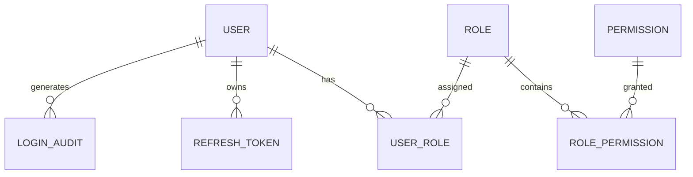
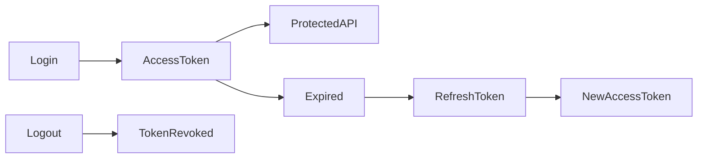
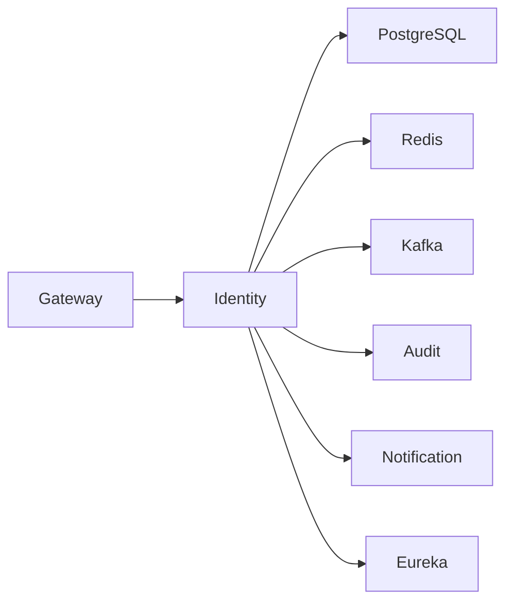

# SRS-002: Identity Service Software Requirements Specification

> **Part 1 of 8**

---

# 1. Document Information

| Field          | Value                                                |
| -------------- | ---------------------------------------------------- |
| Project Name   | Distributed Hub and Sales (DHS) Platform             |
| Document Title | Identity Service Software Requirements Specification |
| Document ID    | SRS-002                                              |
| Service Name   | Identity Service                                     |
| Domain         | Identity & Access Management                         |
| Repository     | starone-dhs-platform                                 |
| Module         | identity-service                                     |
| Document Type  | Software Requirements Specification (SRS)            |
| Standard       | ISO/IEC/IEEE 29148                                   |
| Version        | v1.0.0                                               |
| Status         | Draft                                                |
| Author         | Sachin Salunke                                       |
| Owner          | Enterprise Architecture                              |
| Last Updated   | 2026-06-27                                           |

---

# 2. Document Control

## 2.1 References

| Document     | Description                                             |
| ------------ | ------------------------------------------------------- |
| BRD-001      | Business Requirements Document                          |
| PRD-001      | Product Requirements Document                           |
| ADR-001      | Architecture Decision Record                            |
| HLD-001      | DHS High-Level Design                                   |
| FRD-Identity | Identity Functional Requirements                        |
| SRS-001      | Platform Foundation Software Requirements Specification |

---

## 2.2 Revision History

| Version | Date       | Description     |
| ------- | ---------- | --------------- |
| v1.0.0  | 2026-06-27 | Initial Version |

---

## 2.3 Approval Matrix

| Role                 | Status  |
| -------------------- | ------- |
| Product Owner        | Pending |
| Enterprise Architect | Pending |
| Platform Lead        | Pending |
| Security Lead        | Pending |
| QA Lead              | Pending |

---

# 3. Introduction

## 3.1 Purpose

The Identity Service provides centralized authentication, authorization, user management, role management, permission management, and token management for the DHS Platform.

It serves as the trusted identity provider for all DHS services.

The Identity Service shall authenticate platform users, issue security tokens, validate access requests, and manage security policies.

---

## 3.2 Scope

This specification defines the software requirements for the Identity Service.

The Identity Service includes:

- User Management
- Role Management
- Permission Management
- Authentication
- Authorization
- JWT Token Management
- Refresh Token Management
- Password Management
- Account Management
- Session Management
- Audit Integration

---

## 3.3 Out of Scope

The Identity Service shall not provide:

- Customer Management
- Branch Management
- Product Management
- Inventory Management
- Order Management
- Billing
- Notification Delivery
- Reporting

---

# 4. Service Overview

The Identity Service acts as the security provider for the DHS Platform.

Every authenticated request entering the platform ultimately depends on this service.

The Identity Service integrates with:

- API Gateway
- Platform Foundation
- Audit Service
- Notification Service

---

# 5. Service Responsibilities

The Identity Service shall provide:

- User Registration
- User Authentication
- JWT Generation
- JWT Validation
- Refresh Token Management
- Logout
- Password Encryption
- Password Change
- Password Reset
- Forgot Password
- User Management
- Role Management
- Permission Management
- User Status Management
- Account Locking
- Session Validation
- Security Audit Events

---

# 6. Actors

The Identity Service supports the following actors.

| Actor                | Description                       |
| -------------------- | --------------------------------- |
| Super Administrator  | Complete platform access          |
| System Administrator | User & Role Management            |
| Branch Administrator | Branch-level administration       |
| Sales Executive      | Business operations               |
| Internal Services    | Service-to-service authentication |

---

# 7. Service Dependencies

The Identity Service depends upon:

- Platform Foundation
- Gateway
- Eureka
- Core Common
- Spring Common
- PostgreSQL
- Redis
- Kafka

---

# 8. High-Level Responsibilities

```text
Client

↓

Gateway

↓

Identity Service

├── Authentication

├── Authorization

├── JWT

├── Refresh Token

├── Users

├── Roles

├── Permissions

├── Sessions

├── Audit Events

└── Security Policies
```

---

# 9. Functional Modules

The Identity Service consists of the following modules.

| Module                | Description           |
| --------------------- | --------------------- |
| Authentication        | User Login            |
| Authorization         | Permission Validation |
| User Management       | User CRUD             |
| Role Management       | Role CRUD             |
| Permission Management | Permission CRUD       |
| Password Management   | Password Operations   |
| Token Management      | JWT & Refresh Tokens  |
| Session Management    | Active Sessions       |
| Audit Integration     | Security Events       |

---

# 10. Functional Requirements

## Authentication

### ID-SYS-001

The Identity Service shall authenticate registered platform users.

---

### ID-SYS-002

The Identity Service shall verify encrypted passwords.

---

### ID-SYS-003

The Identity Service shall reject invalid credentials.

---

### ID-SYS-004

The Identity Service shall issue JWT Access Tokens.

---

### ID-SYS-005

The Identity Service shall issue Refresh Tokens.

---

### ID-SYS-006

The Identity Service shall support token renewal.

---

### ID-SYS-007

The Identity Service shall support logout.

---

### ID-SYS-008

The Identity Service shall invalidate refresh tokens during logout.

---

## Authorization

### ID-SYS-009

The Identity Service shall support Role-Based Access Control.

---

### ID-SYS-010

The Identity Service shall support Permission-Based Authorization.

---

### ID-SYS-011

The Identity Service shall validate permissions before granting access.

---

### ID-SYS-012

The Identity Service shall support multiple roles per user.

---

## User Management

### ID-SYS-013

The Identity Service shall create users.

---

### ID-SYS-014

The Identity Service shall update users.

---

### ID-SYS-015

The Identity Service shall deactivate users.

---

### ID-SYS-016

The Identity Service shall lock user accounts.

---

### ID-SYS-017

The Identity Service shall unlock user accounts.

---

### ID-SYS-018

The Identity Service shall search users.

---

### ID-SYS-019

The Identity Service shall maintain user status.

---

### ID-SYS-020

The Identity Service shall support soft deletion.

---

# 11. Business Rules

The Identity Service shall enforce the following business rules.

---

## 11.1 User Management Rules

### BR-ID-001

Each user shall have a unique username.

---

### BR-ID-002

Each email address shall be unique across the platform.

---

### BR-ID-003

A user may belong to one or more roles.

---

### BR-ID-004

A role may contain multiple permissions.

---

### BR-ID-005

Permissions shall be assigned only through roles.

---

### BR-ID-006

Soft deleted users shall not be authenticated.

---

### BR-ID-007

Locked users shall not be authenticated.

---

### BR-ID-008

Inactive users shall not access protected resources.

---

## 11.2 Password Rules

### BR-ID-009

Passwords shall be stored using BCrypt hashing.

---

### BR-ID-010

Passwords shall never be stored in plain text.

---

### BR-ID-011

Passwords shall contain:

- Minimum 8 characters
- At least one uppercase letter
- At least one lowercase letter
- At least one digit
- At least one special character

---

### BR-ID-012

New passwords shall not match the previous password.

---

### BR-ID-013

Password reset tokens shall expire after a configurable duration.

---

## 11.3 Authentication Rules

### BR-ID-014

Authentication shall require valid username and password.

---

### BR-ID-015

Successful authentication shall generate:

- Access Token
- Refresh Token

---

### BR-ID-016

Expired access tokens shall require refresh token validation.

---

### BR-ID-017

Invalid refresh tokens shall be rejected.

---

### BR-ID-018

Logout shall invalidate active refresh tokens.

---

## 11.4 Authorization Rules

### BR-ID-019

Authorization shall use RBAC.

---

### BR-ID-020

Users shall inherit permissions through assigned roles.

---

### BR-ID-021

Unauthorized requests shall return HTTP 403.

---

# 12. REST API Specification

The Identity Service exposes REST APIs through the API Gateway.

Base URL

```text
/api/v1/auth
```

---

# 12.1 Authentication APIs

## Login

| Attribute      | Value        |
| -------------- | ------------ |
| Method         | POST         |
| URI            | /login       |
| Authentication | Not Required |

Purpose

Authenticates a platform user.

---

Request

```json
{
  "username": "admin",
  "password": "Password@123"
}
```

---

Response

```json
{
  "accessToken": "...",
  "refreshToken": "...",
  "tokenType": "Bearer",
  "expiresIn": 3600
}
```

---

Success

- HTTP 200

Errors

- HTTP 400
- HTTP 401
- HTTP 423

---

## Refresh Token

| Attribute | Value          |
| --------- | -------------- |
| Method    | POST           |
| URI       | /refresh-token |

---

Request

```json
{
  "refreshToken": "..."
}
```

---

Response

```json
{
  "accessToken": "...",
  "refreshToken": "...",
  "expiresIn": 3600
}
```

---

## Logout

| Attribute | Value   |
| --------- | ------- |
| Method    | POST    |
| URI       | /logout |

---

Purpose

Invalidate refresh token.

---

# 12.2 User APIs

## Create User

| Method | POST   |
| ------ | ------ |
| URI    | /users |

---

## Update User

| Method | PUT         |
| ------ | ----------- |
| URI    | /users/{id} |

---

## Get User

| Method | GET         |
| ------ | ----------- |
| URI    | /users/{id} |

---

## Search Users

| Method | GET    |
| ------ | ------ |
| URI    | /users |

---

## Delete User

| Method | DELETE      |
| ------ | ----------- |
| URI    | /users/{id} |

---

# 12.3 Role APIs

- POST /roles
- PUT /roles/{id}
- GET /roles
- GET /roles/{id}
- DELETE /roles/{id}

---

# 12.4 Permission APIs

- POST /permissions
- PUT /permissions/{id}
- GET /permissions
- GET /permissions/{id}
- DELETE /permissions/{id}

---

# 13. Request Models

## LoginRequest

| Field    | Type   | Required |
| -------- | ------ | -------- |
| username | String | Yes      |
| password | String | Yes      |

---

## CreateUserRequest

| Field        | Type       |
| ------------ | ---------- |
| username     | String     |
| password     | String     |
| firstName    | String     |
| lastName     | String     |
| email        | String     |
| mobileNumber | String     |
| roles        | List<UUID> |

---

## UpdateUserRequest

| Field        | Type       |
| ------------ | ---------- |
| firstName    | String     |
| lastName     | String     |
| email        | String     |
| mobileNumber | String     |
| roles        | List<UUID> |
| status       | UserStatus |

---

## RefreshTokenRequest

| Field        | Type   |
| ------------ | ------ |
| refreshToken | String |

---

# 14. Response Models

## LoginResponse

| Field        | Type   |
| ------------ | ------ |
| accessToken  | String |
| refreshToken | String |
| expiresIn    | Long   |
| tokenType    | String |

---

## UserResponse

| Field    | Type       |
| -------- | ---------- |
| id       | UUID       |
| username | String     |
| fullName | String     |
| email    | String     |
| status   | UserStatus |
| roles    | List<Role> |

---

# 15. Validation Rules

## Login Validation

- Username is mandatory.
- Password is mandatory.

---

## User Validation

- Username is mandatory.
- Username must be unique.
- Email must be unique.
- Mobile Number must be unique.
- Password must satisfy password policy.

---

## Role Validation

- Role Name is mandatory.
- Role Name shall be unique.

---

## Permission Validation

- Permission Name shall be unique.
- Permission Code shall be unique.

---

# 16. Standard HTTP Status Codes

| Status | Description           |
| ------ | --------------------- |
| 200    | Success               |
| 201    | Created               |
| 204    | Deleted               |
| 400    | Validation Error      |
| 401    | Unauthorized          |
| 403    | Forbidden             |
| 404    | Resource Not Found    |
| 409    | Duplicate Resource    |
| 423    | Account Locked        |
| 500    | Internal Server Error |

---

# 17. Database Design

The Identity Service shall own and manage its database.

No other service shall directly access the Identity Service database.

All cross-service interactions shall occur through REST APIs or asynchronous events.

---

# 17.1 Database Ownership

| Service          | Database Ownership |
| ---------------- | ------------------ |
| Identity Service | identity_db        |

---

# 17.2 Database Entities

The Identity Service shall maintain the following entities.

| Entity         | Description                |
| -------------- | -------------------------- |
| User           | Platform User              |
| Role           | Security Role              |
| Permission     | System Permission          |
| UserRole       | User to Role Mapping       |
| RolePermission | Role to Permission Mapping |
| RefreshToken   | Active Refresh Tokens      |
| LoginAudit     | Authentication Audit       |

---

# 17.3 Entity Relationship Diagram



---

# 17.4 User Entity

| Attribute             | Type         | Constraint    |
| --------------------- | ------------ | ------------- |
| id                    | UUID         | Primary Key   |
| username              | VARCHAR(100) | Unique        |
| password              | VARCHAR(255) | Required      |
| first_name            | VARCHAR(100) | Required      |
| last_name             | VARCHAR(100) | Required      |
| email                 | VARCHAR(150) | Unique        |
| mobile_number         | VARCHAR(20)  | Unique        |
| status                | ENUM         | Required      |
| failed_login_attempts | INTEGER      | Default 0     |
| account_locked        | BOOLEAN      | Default FALSE |
| created_at            | TIMESTAMP    | Required      |
| updated_at            | TIMESTAMP    | Required      |

---

# 17.5 Role Entity

| Attribute   | Type         |
| ----------- | ------------ |
| id          | UUID         |
| role_name   | VARCHAR(100) |
| description | VARCHAR(255) |

---

# 17.6 Permission Entity

| Attribute       | Type         |
| --------------- | ------------ |
| id              | UUID         |
| permission_name | VARCHAR(150) |
| permission_code | VARCHAR(150) |
| description     | VARCHAR(255) |

---

# 17.7 Refresh Token Entity

| Attribute   | Type         |
| ----------- | ------------ |
| id          | UUID         |
| user_id     | UUID         |
| token       | VARCHAR(500) |
| expiry_date | TIMESTAMP    |
| revoked     | BOOLEAN      |

---

# 17.8 Login Audit Entity

| Attribute  | Type         |
| ---------- | ------------ |
| id         | UUID         |
| user_id    | UUID         |
| login_time | TIMESTAMP    |
| ip_address | VARCHAR(100) |
| user_agent | VARCHAR(500) |
| status     | VARCHAR(20)  |

---

# 17.9 Database Indexes

| Table         | Index           |
| ------------- | --------------- |
| user          | username        |
| user          | email           |
| user          | mobile_number   |
| role          | role_name       |
| permission    | permission_code |
| refresh_token | token           |
| login_audit   | login_time      |

---

# 18. Security Requirements

The Identity Service shall act as the authentication provider for the DHS Platform.

---

## 18.1 Authentication

### ID-SEC-001

Authentication shall require username and password.

---

### ID-SEC-002

Passwords shall be verified using BCrypt.

---

### ID-SEC-003

Authentication shall generate JWT Access Tokens.

---

### ID-SEC-004

Authentication shall generate Refresh Tokens.

---

### ID-SEC-005

Refresh Tokens shall be revocable.

---

### ID-SEC-006

Access Tokens shall have configurable expiration.

---

## 18.2 Authorization

### ID-SEC-007

Authorization shall use Role-Based Access Control.

---

### ID-SEC-008

Permissions shall be assigned through Roles.

---

### ID-SEC-009

Every protected API shall validate permissions.

---

### ID-SEC-010

Unauthorized requests shall return HTTP 403.

---

## 18.3 Account Security

### ID-SEC-011

Accounts shall be locked after configurable failed login attempts.

---

### ID-SEC-012

Locked accounts shall require administrator unlock or configured unlock policy.

---

### ID-SEC-013

Password reset shall require a valid reset token.

---

### ID-SEC-014

User sessions shall be invalidated after logout.

---

# 19. JWT Specification

The Identity Service shall issue JSON Web Tokens for authenticated users.

---

## 19.1 JWT Claims

| Claim       | Description           |
| ----------- | --------------------- |
| sub         | User Identifier       |
| username    | Username              |
| roles       | Assigned Roles        |
| permissions | Effective Permissions |
| iss         | Token Issuer          |
| iat         | Issued At             |
| exp         | Expiration Time       |
| jti         | Token Identifier      |

---

## 19.2 Token Types

| Token         | Purpose           |
| ------------- | ----------------- |
| Access Token  | API Authorization |
| Refresh Token | Token Renewal     |

---

## 19.3 JWT Lifecycle



---

# 20. Event Specification

The Identity Service shall publish security-related events.

---

## 20.1 Published Events

| Event              | Description               |
| ------------------ | ------------------------- |
| UserCreated        | New user created          |
| UserUpdated        | User information updated  |
| UserLocked         | Account locked            |
| UserUnlocked       | Account unlocked          |
| PasswordChanged    | Password changed          |
| PasswordReset      | Password reset            |
| UserLoggedIn       | Successful authentication |
| UserLoggedOut      | User logout               |
| RoleCreated        | New role                  |
| PermissionAssigned | Permission assignment     |

---

## 20.2 Consumed Events

| Event           | Source                    |
| --------------- | ------------------------- |
| BranchDeleted   | Branch Service            |
| EmployeeCreated | Employee Service (Future) |

> **Note:** Event consumption should reflect actual platform integrations. If services such as `Employee Service` are not part of the DHS platform, these events should be removed or replaced with valid integrations.

---

## 20.3 Standard Event Structure

```json
{
  "eventId": "UUID",
  "eventType": "UserCreated",
  "eventVersion": "1.0",
  "occurredAt": "2026-06-27T10:00:00Z",
  "correlationId": "UUID",
  "payload": {}
}
```

---

# 21. External Interfaces

## 21.1 REST Clients

The Identity Service shall invoke the following platform services when required.

| Service              | Purpose                     |
| -------------------- | --------------------------- |
| Audit Service        | Audit logging               |
| Notification Service | Email and SMS notifications |

---

## 21.2 OpenFeign Clients

| Client             | Purpose                      |
| ------------------ | ---------------------------- |
| AuditClient        | Security audit               |
| NotificationClient | Password reset notifications |

---

# 22. Configuration Requirements

The Identity Service shall support externalized configuration through the centralized configuration service.

The configuration repository is owned by **starone-galaxy-central-config**.

---

## 22.1 Configuration Categories

The Identity Service shall support configuration for:

- JWT
- Password Policy
- Login Policy
- Account Lock Policy
- Database
- Redis
- Kafka
- OpenFeign
- Logging
- Observability

---

## 22.2 Configuration Properties

| Property                           | Description                     |
| ---------------------------------- | ------------------------------- |
| identity.jwt.secret                | JWT signing secret              |
| identity.jwt.expiration            | Access token expiration         |
| identity.jwt.refresh-expiration    | Refresh token expiration        |
| identity.password.max-attempts     | Maximum failed login attempts   |
| identity.password.lock-duration    | Account lock duration           |
| identity.password.reset.expiration | Password reset token expiration |

> **Note:** This SRS specifies the required configuration keys. Their actual values and environment-specific overrides belong in the `starone-galaxy-central-config` repository.

---

# 23. Service Integration Diagram



---

# 24. Error Handling

The Identity Service shall provide standardized error handling for all authentication, authorization, user management, and security operations.

All errors shall conform to the DHS Platform standard error response model defined in **SRS-001 – Platform Foundation**.

---

## 24.1 Functional Requirements

### ID-SYS-021

The Identity Service shall return standardized error responses.

---

### ID-SYS-022

Business exceptions shall be distinguishable from technical exceptions.

---

### ID-SYS-023

All exceptions shall include a Correlation ID.

---

### ID-SYS-024

Unhandled exceptions shall return HTTP 500.

---

### ID-SYS-025

Sensitive implementation details shall not be exposed to API consumers.

---

## 24.2 Standard Error Response

```json
{
  "timestamp": "2026-06-27T10:45:00Z",
  "status": 401,
  "error": "Unauthorized",
  "code": "ID-AUTH-001",
  "message": "Invalid username or password.",
  "correlationId": "7c3a8f63-7d76-43f5-9d86-f3d05dbecb15",
  "path": "/api/v1/auth/login"
}
```

---

## 24.3 Business Error Codes

| Error Code  | Description                  | HTTP Status |
| ----------- | ---------------------------- | ----------- |
| ID-AUTH-001 | Invalid username or password | 401         |
| ID-AUTH-002 | Account locked               | 423         |
| ID-AUTH-003 | Account disabled             | 403         |
| ID-AUTH-004 | Account expired              | 403         |
| ID-AUTH-005 | Invalid access token         | 401         |
| ID-AUTH-006 | Access token expired         | 401         |
| ID-AUTH-007 | Refresh token expired        | 401         |
| ID-AUTH-008 | Refresh token revoked        | 401         |
| ID-USER-001 | User not found               | 404         |
| ID-USER-002 | Username already exists      | 409         |
| ID-USER-003 | Email already exists         | 409         |
| ID-USER-004 | Mobile number already exists | 409         |
| ID-ROLE-001 | Role not found               | 404         |
| ID-ROLE-002 | Duplicate role               | 409         |
| ID-PERM-001 | Permission not found         | 404         |
| ID-PERM-002 | Duplicate permission         | 409         |
| ID-VAL-001  | Validation failed            | 400         |
| ID-SYS-001  | Internal server error        | 500         |

---

# 25. Logging Requirements

The Identity Service shall use the shared logging framework provided by the Platform Foundation.

---

## 25.1 Functional Requirements

### ID-SYS-026

Authentication requests shall be logged.

---

### ID-SYS-027

Authentication failures shall be logged.

---

### ID-SYS-028

Authorization failures shall be logged.

---

### ID-SYS-029

Password reset requests shall be logged.

---

### ID-SYS-030

Security exceptions shall be logged.

---

## 25.2 Log Attributes

Every log entry shall include:

- Timestamp
- Service Name
- Correlation ID
- Trace ID
- Span ID
- User ID
- Username
- Request URI
- HTTP Method
- Response Status
- Processing Time

---

## 25.3 Sensitive Information

The following information shall never be logged:

- Passwords
- Access Tokens
- Refresh Tokens
- JWT Secret
- Password Reset Tokens
- Encryption Keys
- OTP Values

---

# 26. Observability Requirements

The Identity Service shall expose operational metrics and health information.

---

## 26.1 Functional Requirements

### ID-SYS-031

The Identity Service shall expose Health endpoints.

---

### ID-SYS-032

The Identity Service shall expose Metrics endpoints.

---

### ID-SYS-033

The Identity Service shall support Distributed Tracing.

---

### ID-SYS-034

Every request shall propagate Correlation IDs.

---

### ID-SYS-035

Authentication metrics shall be collected.

---

## 26.2 Identity Metrics

The service shall publish metrics including:

- Successful Logins
- Failed Logins
- Active Sessions
- Locked Accounts
- Password Reset Requests
- Token Refresh Requests
- Authentication Response Time
- Authorization Failures

---

# 27. Non-Functional Requirements

## 27.1 Performance

### ID-NFR-001

Authentication requests shall complete within 300 milliseconds under normal operating conditions.

---

### ID-NFR-002

JWT generation shall complete within 100 milliseconds.

---

### ID-NFR-003

Authorization checks shall complete within 50 milliseconds.

---

## 27.2 Availability

### ID-NFR-004

The Identity Service shall maintain an availability of 99.9%.

---

### ID-NFR-005

The service shall support horizontal scaling.

---

## 27.3 Reliability

### ID-NFR-006

Authentication data shall remain consistent during failures.

---

### ID-NFR-007

Refresh token revocation shall be reliable.

---

## 27.4 Security

### ID-NFR-008

Passwords shall never be stored in plain text.

---

### ID-NFR-009

All communication shall use TLS.

---

### ID-NFR-010

JWT signing keys shall be externally configured.

---

## 27.5 Maintainability

### ID-NFR-011

The service shall follow the DHS coding standards.

---

### ID-NFR-012

The service shall use reusable shared platform components.

---

# 28. Requirement Traceability Matrix

| Identity Requirement    | Source Document | Source Requirement                | Verification                   |
| ----------------------- | --------------- | --------------------------------- | ------------------------------ |
| ID-SYS-001 – ID-SYS-020 | FRD-Identity    | Authentication & User Management  | Functional Testing             |
| ID-SYS-021 – ID-SYS-030 | SRS-001         | Platform Error Handling & Logging | Integration Testing            |
| ID-SYS-031 – ID-SYS-035 | SRS-001         | Platform Observability            | System Testing                 |
| ID-NFR-001 – ID-NFR-012 | PRD / HLD       | Quality Attributes                | Performance & Security Testing |

---

# 29. Acceptance Criteria

The Identity Service shall be considered complete when:

- User authentication operates successfully.
- JWT Access Tokens are generated successfully.
- Refresh Tokens are generated and revoked successfully.
- Role-Based Access Control is enforced.
- Permission validation operates correctly.
- User management APIs function correctly.
- Role management APIs function correctly.
- Permission management APIs function correctly.
- Password reset workflow is operational.
- Standard error responses are returned.
- Security audit events are published.
- Logging and metrics are operational.
- Health endpoints are operational.
- Performance objectives are achieved.
- Security requirements are verified.
- All functional and integration tests pass.

---

# Appendix A – API Summary

| Resource       | Endpoints                           |
| -------------- | ----------------------------------- |
| Authentication | Login, Logout, Refresh Token        |
| Users          | Create, Update, Get, Search, Delete |
| Roles          | CRUD                                |
| Permissions    | CRUD                                |

---

# Appendix B – Entity Summary

| Entity         | Purpose                    |
| -------------- | -------------------------- |
| User           | Platform User              |
| Role           | Security Role              |
| Permission     | Access Permission          |
| UserRole       | User-Role Mapping          |
| RolePermission | Role-Permission Mapping    |
| RefreshToken   | Token Lifecycle Management |
| LoginAudit     | Authentication Audit Trail |

---

# Appendix C – Service Dependencies

| Dependency           | Purpose                      |
| -------------------- | ---------------------------- |
| Platform Foundation  | Shared Frameworks            |
| Gateway              | API Routing                  |
| Eureka               | Service Discovery            |
| PostgreSQL           | Persistent Storage           |
| Redis                | Token & Session Cache        |
| Kafka                | Security Event Publishing    |
| Notification Service | Password Reset Notifications |
| Audit Service        | Security Audit Processing    |

---

# Appendix D – Revision Summary

| Version | Summary                                                      |
| ------- | ------------------------------------------------------------ |
| v1.0.0  | Initial Identity Service Software Requirements Specification |

---

# Document Sign-off

| Role                 | Status  |
| -------------------- | ------- |
| Product Owner        | Pending |
| Enterprise Architect | Pending |
| Platform Lead        | Pending |
| Security Lead        | Pending |
| QA Lead              | Pending |

---

# End of Document