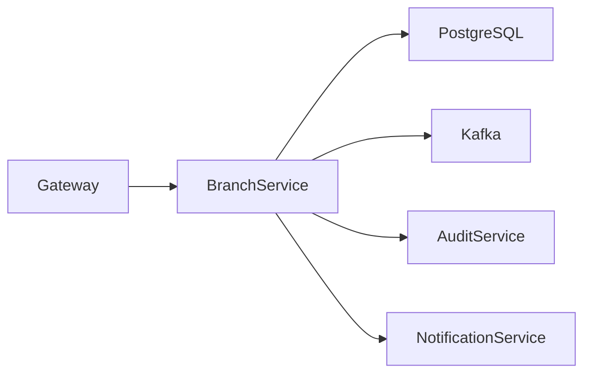
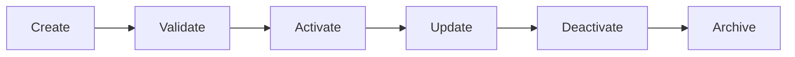
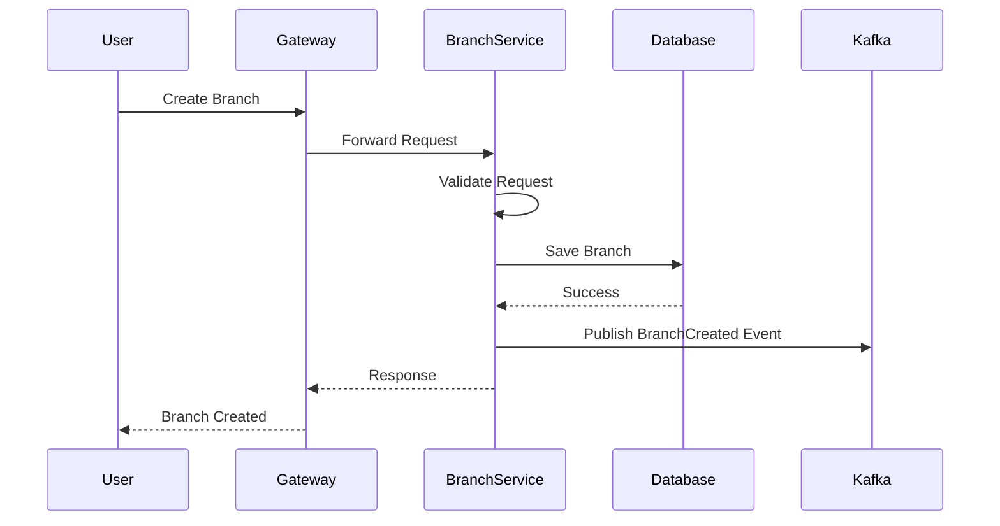
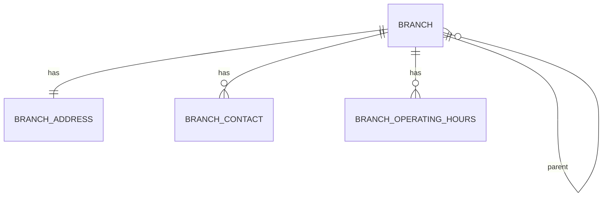
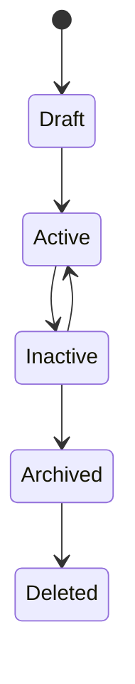
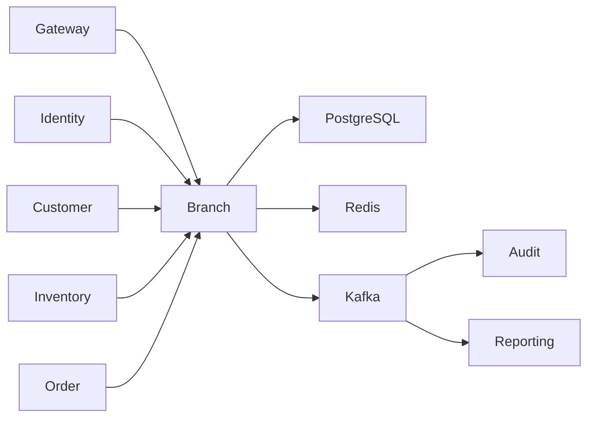

# SRS-003: Branch Service Software Requirements Specification

---

# 1. Document Information

| Field          | Value                                              |
| -------------- | -------------------------------------------------- |
| Project Name   | Distributed Hub and Sales (DHS) Platform           |
| Service Name   | Branch Service                                     |
| Document Title | Branch Service Software Requirements Specification |
| Document ID    | SRS-003                                            |
| Repository     | starone-dhs-platform                               |
| Module         | branch-service                                     |
| Document Type  | Software Requirements Specification (SRS)          |
| Standard       | ISO/IEC/IEEE 29148                                 |
| Version        | v1.0.0                                             |
| Status         | Draft                                              |
| Author         | Sachin Salunke                                     |
| Owner          | Enterprise Architecture                            |
| Last Updated   | 2026-06-27                                         |

---

# 2. Document Control

## 2.1 References

| Document   | Description                    |
| ---------- | ------------------------------ |
| BRD-001    | Business Requirements Document |
| PRD-001    | Product Requirements Document  |
| ADR-001    | Architecture Decision Record   |
| HLD-001    | DHS High-Level Design          |
| FRD-Branch | Branch Functional Requirements |
| SRS-001    | Platform Foundation            |
| SRS-002    | Identity Service               |

---

## 2.2 Revision History

| Version | Date       | Description     |
| ------- | ---------- | --------------- |
| v1.0.0  | 2026-06-27 | Initial Version |

---

## 2.3 Approval Matrix

| Role                 | Status  |
| -------------------- | ------- |
| Product Owner        | Pending |
| Enterprise Architect | Pending |
| Platform Lead        | Pending |
| QA Lead              | Pending |

---

# 3. Introduction

## 3.1 Purpose

The Branch Service shall manage organizational branch information for the DHS Platform.

It provides centralized management of branch master data, branch hierarchy, operational status, addresses, contact information, and business operating hours.

The Branch Service shall act as the authoritative source for all branch-related information.

---

## 3.2 Scope

The Branch Service includes:

- Branch Management
- Branch Hierarchy
- Branch Address Management
- Branch Contact Management
- Branch Operating Hours
- Branch Status Management
- Branch Search
- Branch Audit Events

---

## 3.3 Out of Scope

The Branch Service shall not provide:

- User Authentication
- User Management
- Employee Management
- Customer Management
- Product Management
- Inventory Management
- Order Management
- Billing
- Notification Delivery

---

## 3.4 Definitions

| Term          | Description                           |
| ------------- | ------------------------------------- |
| Branch        | Physical or logical business location |
| Parent Branch | Higher-level organizational branch    |
| Child Branch  | Branch reporting to another branch    |
| Headquarters  | Root branch within the hierarchy      |

---

## 3.5 Assumptions

- Branch codes are unique across the enterprise.
- A branch may optionally belong to a parent branch.
- Every branch shall have one primary address.
- Branch information is shared with other DHS services through APIs and events.

---

## 3.6 Constraints

- Branch identifiers are immutable.
- Branch deletion shall use soft delete.
- Inactive branches shall not accept operational transactions.
- Branch hierarchy shall not contain circular references.

---

# 4. Service Overview

## 4.1 Responsibilities

The Branch Service shall provide:

- Branch CRUD Operations
- Branch Search
- Branch Hierarchy Management
- Branch Status Management
- Branch Address Management
- Branch Contact Information
- Branch Operating Hours
- Branch Activation
- Branch Deactivation
- Branch Audit Event Publication

---

## 4.2 Service Context



---

## 4.3 Dependencies

| Dependency           | Purpose                |
| -------------------- | ---------------------- |
| Platform Foundation  | Shared Frameworks      |
| Gateway              | API Routing            |
| Eureka               | Service Discovery      |
| PostgreSQL           | Persistent Storage     |
| Kafka                | Event Publishing       |
| Audit Service        | Audit Processing       |
| Notification Service | Business Notifications |

---

## 4.4 Upstream Services

| Service          | Purpose                        |
| ---------------- | ------------------------------ |
| Gateway          | Request Routing                |
| Identity Service | Authentication & Authorization |

---

## 4.5 Downstream Services

| Service           | Purpose            |
| ----------------- | ------------------ |
| Customer Service  | Branch Reference   |
| Inventory Service | Inventory Location |
| Order Service     | Order Fulfillment  |
| Reporting Service | Analytics          |
| Audit Service     | Audit Processing   |

---

# 5. Business Process

## 5.1 Branch Lifecycle



---

## 5.2 Branch Creation Process



---

# 6. Functional Requirements

## Branch Management

### BR-SYS-001

The Branch Service shall create branches.

---

### BR-SYS-002

The Branch Service shall update branch information.

---

### BR-SYS-003

The Branch Service shall retrieve branch details.

---

### BR-SYS-004

The Branch Service shall search branches.

---

### BR-SYS-005

The Branch Service shall deactivate branches.

---

### BR-SYS-006

The Branch Service shall reactivate branches.

---

### BR-SYS-007

The Branch Service shall support soft deletion.

---

## Branch Hierarchy

### BR-SYS-008

The Branch Service shall support parent-child branch relationships.

---

### BR-SYS-009

The Branch Service shall prevent circular hierarchy relationships.

---

### BR-SYS-010

The Branch Service shall retrieve complete branch hierarchy.

---

## Branch Status

### BR-SYS-011

The Branch Service shall maintain branch operational status.

---

### BR-SYS-012

The Branch Service shall maintain branch lifecycle status.

---

### BR-SYS-013

Inactive branches shall not participate in operational workflows.

---

## Search

### BR-SYS-014

The Branch Service shall support search by branch code.

---

### BR-SYS-015

The Branch Service shall support search by branch name.

---

### BR-SYS-016

The Branch Service shall support search by city, state, and country.

---

### BR-SYS-017

The Branch Service shall support pagination, filtering, and sorting.

---

## Audit

### BR-SYS-018

The Branch Service shall publish audit events for all branch lifecycle operations.

---

## Integration

### BR-SYS-019

The Branch Service shall publish domain events for branch changes.

---

### BR-SYS-020

The Branch Service shall expose REST APIs for authorized platform services.

---

# 7. Business Rules

The Branch Service shall enforce the following business rules to maintain consistency, integrity, and governance of branch master data.

---

## 7.1 Branch Management Rules

### BR-BR-001

Every branch shall have a unique Branch Code.

---

### BR-BR-002

Every branch shall have a unique Branch Name within the same parent branch.

---

### BR-BR-003

A branch shall belong to only one legal organization.

---

### BR-BR-004

Every branch shall have exactly one primary address.

---

### BR-BR-005

A branch may have multiple contact numbers.

---

### BR-BR-006

A branch shall have one primary contact email.

---

### BR-BR-007

Branch Code shall remain immutable after creation.

---

### BR-BR-008

Branch deletion shall be performed using soft delete.

---

## 7.2 Branch Hierarchy Rules

### BR-BR-009

A branch may optionally reference one parent branch.

---

### BR-BR-010

A parent branch may contain multiple child branches.

---

### BR-BR-011

Circular branch hierarchies shall not be permitted.

---

### BR-BR-012

The Headquarters branch shall not have a parent branch.

---

## 7.3 Operational Rules

### BR-BR-013

Only Active branches may participate in business operations.

---

### BR-BR-014

Inactive branches shall remain available for historical reporting.

---

### BR-BR-015

Archived branches shall not be modified.

---

### BR-BR-016

Branch status changes shall generate audit events.

---

## 7.4 Data Integrity Rules

### BR-BR-017

Branch Email shall be unique.

---

### BR-BR-018

Branch GST Number shall be unique where applicable.

---

### BR-BR-019

Branch PAN Number shall be unique where applicable.

---

### BR-BR-020

Country, State and City shall reference approved master data.

---

# 8. REST API Specification

Base URL

```text
/api/v1/branches
```

All APIs shall be exposed through the DHS API Gateway.

---

## 8.1 API Overview

| Method | URI                    | Description         |
| ------ | ---------------------- | ------------------- |
| POST   | /                      | Create Branch       |
| PUT    | /{branchId}            | Update Branch       |
| GET    | /{branchId}            | Get Branch          |
| DELETE | /{branchId}            | Soft Delete Branch  |
| GET    | /                      | Search Branches     |
| PATCH  | /{branchId}/activate   | Activate Branch     |
| PATCH  | /{branchId}/deactivate | Deactivate Branch   |
| GET    | /hierarchy             | Branch Hierarchy    |
| GET    | /code/{branchCode}     | Find by Branch Code |

---

## 8.2 Request Headers

| Header           | Required | Description         |
| ---------------- | -------- | ------------------- |
| Authorization    | Yes      | JWT Bearer Token    |
| X-Correlation-ID | Yes      | Request Correlation |
| Content-Type     | Yes      | application/json    |
| Accept           | Yes      | application/json    |

---

## 8.3 Query Parameters

Search API supports:

| Parameter | Required | Description   |
| --------- | -------- | ------------- |
| page      | No       | Page Number   |
| size      | No       | Page Size     |
| sort      | No       | Sort Field    |
| direction | No       | ASC or DESC   |
| keyword   | No       | Global Search |
| status    | No       | Branch Status |
| city      | No       | City          |
| state     | No       | State         |
| country   | No       | Country       |

---

## 8.4 Path Parameters

| Parameter  | Description       |
| ---------- | ----------------- |
| branchId   | Branch Identifier |
| branchCode | Branch Code       |

---

## 8.5 Create Branch API

## Request

```http
POST /api/v1/branches
```

Request Body

```json
{
  "branchCode": "MUM001",
  "branchName": "Mumbai Head Office",
  "parentBranchId": null,
  "email": "mumbai@company.com",
  "phone": "+91XXXXXXXXXX",
  "address": {
    "line1": "",
    "city": "",
    "state": "",
    "country": "",
    "postalCode": ""
  }
}
```

---

Response

```json
{
  "branchId": "UUID",
  "branchCode": "MUM001",
  "status": "ACTIVE"
}
```

---

Success

- HTTP 201

Errors

- HTTP 400
- HTTP 401
- HTTP 403
- HTTP 409

---

## 8.6 Update Branch API

```http
PUT /api/v1/branches/{branchId}
```

Updates editable branch information.

Branch Code shall not be updated.

---

## 8.7 Get Branch API

```http
GET /api/v1/branches/{branchId}
```

Returns complete branch details.

---

## 8.8 Search Branch API

```http
GET /api/v1/branches
```

Supports:

- Pagination
- Sorting
- Filtering
- Keyword Search

---

## 8.9 Activate Branch API

```http
PATCH /api/v1/branches/{branchId}/activate
```

Changes status to ACTIVE.

---

## 8.10 Deactivate Branch API

```http
PATCH /api/v1/branches/{branchId}/deactivate
```

Changes status to INACTIVE.

---

## 8.11 Delete Branch API

```http
DELETE /api/v1/branches/{branchId}
```

Performs soft deletion.

---

## 8.12 Branch Hierarchy API

```http
GET /api/v1/branches/hierarchy
```

Returns complete organizational hierarchy.

---

# 9. Request Models

## CreateBranchRequest

| Field          | Type       | Required |
| -------------- | ---------- | -------- |
| branchCode     | String     | Yes      |
| branchName     | String     | Yes      |
| parentBranchId | UUID       | No       |
| email          | String     | Yes      |
| phone          | String     | Yes      |
| address        | AddressDTO | Yes      |

---

## UpdateBranchRequest

| Field      | Type         |
| ---------- | ------------ |
| branchName | String       |
| email      | String       |
| phone      | String       |
| address    | AddressDTO   |
| status     | BranchStatus |

---

## SearchBranchRequest

| Field   | Type         |
| ------- | ------------ |
| keyword | String       |
| city    | String       |
| state   | String       |
| country | String       |
| status  | BranchStatus |

---

# 10. Response Models

## BranchResponse

| Field      | Type         |
| ---------- | ------------ |
| branchId   | UUID         |
| branchCode | String       |
| branchName | String       |
| status     | BranchStatus |
| address    | AddressDTO   |

---

## BranchSummaryResponse

| Field      | Type         |
| ---------- | ------------ |
| branchId   | UUID         |
| branchCode | String       |
| branchName | String       |
| city       | String       |
| state      | String       |
| status     | BranchStatus |

---

## BranchHierarchyResponse

| Field          | Type                          |
| -------------- | ----------------------------- |
| branchId       | UUID                          |
| parentBranchId | UUID                          |
| children       | List<BranchHierarchyResponse> |

---

# 11. Validation Rules

## Create Branch

- Branch Code is mandatory.
- Branch Code shall be unique.
- Branch Name is mandatory.
- Email is mandatory.
- Email shall be valid.
- Phone Number is mandatory.
- Country is mandatory.
- State is mandatory.
- City is mandatory.
- Postal Code is mandatory.

---

## Update Branch

- Branch Code cannot be modified.
- Branch Name cannot be empty.
- Email shall remain unique.
- Parent Branch shall not create hierarchy loops.

---

## Hierarchy Validation

- Headquarters shall not have a parent.
- Parent Branch shall exist.
- Child Branch cannot become its own parent.
- Circular references shall be rejected.

---

# 12. Standard HTTP Status Codes

| Status | Description           |
| ------ | --------------------- |
| 200    | Success               |
| 201    | Created               |
| 204    | Deleted               |
| 400    | Validation Error      |
| 401    | Unauthorized          |
| 403    | Forbidden             |
| 404    | Branch Not Found      |
| 409    | Duplicate Branch      |
| 422    | Invalid Hierarchy     |
| 500    | Internal Server Error |

---

## Permission Matrix

| API               | Super Admin | Admin | Branch Manager | Viewer |
| ----------------- | ----------- | ----- | -------------- | ------ |
| Create Branch     | ✅          | ✅    | ❌             | ❌     |
| Update Branch     | ✅          | ✅    | ✅             | ❌     |
| Delete Branch     | ✅          | ❌    | ❌             | ❌     |
| Activate Branch   | ✅          | ✅    | ❌             | ❌     |
| Deactivate Branch | ✅          | ✅    | ❌             | ❌     |
| View Branch       | ✅          | ✅    | ✅             | ✅     |
| Search Branch     | ✅          | ✅    | ✅             | ✅     |
| View Hierarchy    | ✅          | ✅    | ✅             | ✅     |

---

# 13. Entity Model

The Branch Service shall maintain the master data for organizational branches.

All branch information shall be owned exclusively by the Branch Service.

No external service shall directly access or modify the Branch Service database.

---

## 13.1 Entity Overview

| Entity               | Description                 |
| -------------------- | --------------------------- |
| Branch               | Primary branch master       |
| BranchAddress        | Branch address information  |
| BranchContact        | Branch contact information  |
| BranchOperatingHours | Business operating schedule |

---

## 13.2 Branch Entity

| Attribute      | Type         | Constraint        |
| -------------- | ------------ | ----------------- |
| id             | UUID         | Primary Key       |
| branchCode     | VARCHAR(30)  | Unique, Immutable |
| branchName     | VARCHAR(200) | Required          |
| parentBranchId | UUID         | Nullable          |
| legalEntityId  | UUID         | Required          |
| status         | ENUM         | Required          |
| type           | ENUM         | Required          |
| email          | VARCHAR(150) | Unique            |
| gstNumber      | VARCHAR(20)  | Unique            |
| panNumber      | VARCHAR(20)  | Unique            |
| createdBy      | UUID         | Required          |
| createdAt      | TIMESTAMP    | Required          |
| updatedBy      | UUID         | Required          |
| updatedAt      | TIMESTAMP    | Required          |
| deleted        | BOOLEAN      | Default FALSE     |

---

## 13.3 Branch Address Entity

| Attribute    | Type         |
| ------------ | ------------ |
| id           | UUID         |
| branchId     | UUID         |
| addressLine1 | VARCHAR(255) |
| addressLine2 | VARCHAR(255) |
| landmark     | VARCHAR(255) |
| city         | VARCHAR(100) |
| district     | VARCHAR(100) |
| state        | VARCHAR(100) |
| country      | VARCHAR(100) |
| postalCode   | VARCHAR(20)  |

---

## 13.4 Branch Contact Entity

| Attribute      | Type         |
| -------------- | ------------ |
| id             | UUID         |
| branchId       | UUID         |
| contactPerson  | VARCHAR(150) |
| designation    | VARCHAR(100) |
| phoneNumber    | VARCHAR(25)  |
| alternatePhone | VARCHAR(25)  |
| email          | VARCHAR(150) |

---

## 13.5 Branch Operating Hours Entity

| Attribute   | Type    |
| ----------- | ------- |
| id          | UUID    |
| branchId    | UUID    |
| dayOfWeek   | ENUM    |
| openingTime | TIME    |
| closingTime | TIME    |
| working     | BOOLEAN |

---

# 14. Database Design

Database Name

```text
branch_db
```

Schema

```text
branch
```

---

## 14.1 Tables

| Table                  | Purpose        |
| ---------------------- | -------------- |
| branch                 | Branch Master  |
| branch_address         | Branch Address |
| branch_contact         | Branch Contact |
| branch_operating_hours | Working Hours  |

---

## 14.2 Primary Keys

Every table shall use UUID as its primary key.

---

## 14.3 Foreign Keys

| Child Table            | Parent Table |
| ---------------------- | ------------ |
| branch_address         | branch       |
| branch_contact         | branch       |
| branch_operating_hours | branch       |

---

## 14.4 Database Constraints

## Branch

- Branch Code UNIQUE
- Branch Name NOT NULL
- Email UNIQUE
- GST Number UNIQUE
- PAN Number UNIQUE

---

## Branch Address

- Branch ID FOREIGN KEY
- City NOT NULL
- State NOT NULL
- Country NOT NULL

---

## Branch Contact

- Branch ID FOREIGN KEY

---

## Working Hours

- Branch ID FOREIGN KEY
- Day Of Week UNIQUE per Branch

---

## 14.5 Database Indexes

| Table          | Index            |
| -------------- | ---------------- |
| branch         | branch_code      |
| branch         | branch_name      |
| branch         | status           |
| branch         | parent_branch_id |
| branch         | legal_entity_id  |
| branch_address | city             |
| branch_address | state            |
| branch_address | postal_code      |

---

## 14.6 Entity Relationship Diagram



---

# 15. State Diagram



---

# 16. Security Requirements

The Branch Service shall rely upon the Identity Service for authentication.

Authorization shall be enforced using Role-Based Access Control.

---

## Authentication

### BR-SEC-001

Every request shall contain a valid JWT Access Token.

---

### BR-SEC-002

Authentication shall be delegated to the Identity Service.

---

### BR-SEC-003

Unauthenticated requests shall return HTTP 401.

---

## Authorization

### BR-SEC-004

Branch APIs shall enforce Role-Based Access Control.

---

### BR-SEC-005

Authorization shall validate permissions before executing business operations.

---

### BR-SEC-006

Unauthorized requests shall return HTTP 403.

---

## Data Security

### BR-SEC-007

Sensitive branch information shall be transmitted over TLS.

---

### BR-SEC-008

Audit information shall not be modified by external services.

---

# 17. Event Specification

The Branch Service shall publish domain events whenever branch master data changes.

---

## 17.1 Published Events

| Topic                 | Event             | Key       | Version |
| --------------------- | ----------------- | --------- | ------- |
| branch.created.v1     | BranchCreated     | Branch ID | v1      |
| branch.updated.v1     | BranchUpdated     | Branch ID | v1      |
| branch.activated.v1   | BranchActivated   | Branch ID | v1      |
| branch.deactivated.v1 | BranchDeactivated | Branch ID | v1      |
| branch.deleted.v1     | BranchDeleted     | Branch ID | v1      |

---

## 17.2 Consumed Events

| Topic           | Source           |
| --------------- | ---------------- |
| user.updated.v1 | Identity Service |
| user.deleted.v1 | Identity Service |

---

## 17.3 Event Structure

```json
{
  "eventId": "UUID",
  "eventType": "BranchCreated",
  "eventVersion": "1.0",
  "occurredAt": "2026-06-27T10:30:00Z",
  "correlationId": "UUID",
  "payload": {}
}
```

---

# 18. External Interfaces

## REST Interfaces

| Service           | Purpose                        |
| ----------------- | ------------------------------ |
| Identity Service  | Authentication & Authorization |
| Reporting Service | Branch Analytics               |

---

## Kafka

The Branch Service shall publish branch lifecycle events.

---

## Database

PostgreSQL

---

## Cache

Redis shall be used for branch reference caching where applicable.

---

# 19. OpenFeign Clients

| Client          | Purpose                             |
| --------------- | ----------------------------------- |
| IdentityClient  | Validate authenticated user context |
| ReportingClient | Optional reporting integration      |

> **Implementation Note:** Avoid synchronous calls for audit processing. Audit events should be published to Kafka and consumed by the Audit Service, preserving loose coupling.

---

# 20. Configuration

Configuration shall be externalized using the centralized configuration repository.

---

## Configuration Categories

- Server
- Database
- Kafka
- Redis
- Logging
- OpenFeign
- Security
- Branch
- Observability

---

## Configuration Properties

| Property                    | Default           | Required | Description             |
| --------------------------- | ----------------- | -------- | ----------------------- |
| branch.search.max-page-size | 100               | Yes      | Maximum page size       |
| branch.cache.enabled        | true              | Yes      | Enable branch cache     |
| branch.cache.ttl            | 3600              | Yes      | Cache expiration        |
| branch.hierarchy.max-depth  | 10                | Yes      | Maximum hierarchy depth |
| branch.kafka.topic.created  | branch.created.v1 | Yes      | Create event topic      |
| branch.kafka.topic.updated  | branch.updated.v1 | Yes      | Update event topic      |

---

# 21. Service Context Diagram



---

# 22. Error Handling

The Branch Service shall provide standardized error handling for all branch management operations.

All error responses shall comply with the Platform Foundation error model defined in **SRS-001 – Platform Foundation**.

---

## 22.1 Functional Requirements

### BR-SYS-021

The Branch Service shall return standardized error responses.

---

### BR-SYS-022

Business exceptions shall be distinguishable from technical exceptions.

---

### BR-SYS-023

Every error response shall include a Correlation ID.

---

### BR-SYS-024

Unhandled exceptions shall return HTTP 500.

---

### BR-SYS-025

Internal implementation details shall never be exposed to API consumers.

---

## 22.2 Standard Error Response

```json
{
  "timestamp": "2026-06-27T11:15:30Z",
  "status": 409,
  "error": "Duplicate Branch",
  "code": "BR-001",
  "message": "Branch Code already exists.",
  "correlationId": "e24cdb2c-b90e-49db-a915-f056cb527ce3",
  "path": "/api/v1/branches"
}
```

---

## 22.3 Business Error Catalog

| Error Code | Description                | HTTP Status |
| ---------- | -------------------------- | ----------- |
| BR-001     | Branch Code already exists | 409         |
| BR-002     | Branch Name already exists | 409         |
| BR-003     | Branch not found           | 404         |
| BR-004     | Invalid Parent Branch      | 422         |
| BR-005     | Circular Branch Hierarchy  | 422         |
| BR-006     | Branch already active      | 409         |
| BR-007     | Branch already inactive    | 409         |
| BR-008     | Branch already archived    | 409         |
| BR-009     | Branch cannot be deleted   | 409         |
| BR-010     | Invalid Branch Status      | 400         |
| BR-011     | Validation failed          | 400         |
| BR-012     | Unauthorized Access        | 401         |
| BR-013     | Forbidden Operation        | 403         |
| BR-500     | Internal Server Error      | 500         |

---

# 23. Logging Requirements

The Branch Service shall use the Platform Foundation logging framework.

---

## 23.1 Functional Requirements

### BR-SYS-026

Every branch creation shall generate an audit log.

---

### BR-SYS-027

Every branch update shall generate an audit log.

---

### BR-SYS-028

Every branch activation and deactivation shall be logged.

---

### BR-SYS-029

Every branch deletion shall generate an audit log.

---

### BR-SYS-030

All exceptions shall be logged.

---

## 23.2 Log Attributes

Every log entry shall include:

- Timestamp
- Service Name
- Correlation ID
- Trace ID
- Span ID
- User ID
- Branch ID
- HTTP Method
- Request URI
- Response Status
- Processing Time

---

## 23.3 Sensitive Information

The following information shall not be logged:

- JWT Tokens
- Authorization Headers
- Credentials
- Database Credentials
- Encryption Keys
- Internal Stack Traces

---

# 24. Observability Requirements

The Branch Service shall expose operational metrics through the Platform Foundation.

---

## 24.1 Functional Requirements

### BR-SYS-031

The Branch Service shall expose Health endpoints.

---

### BR-SYS-032

The Branch Service shall expose Metrics endpoints.

---

### BR-SYS-033

The Branch Service shall support Distributed Tracing.

---

### BR-SYS-034

Every request shall propagate Correlation IDs.

---

### BR-SYS-035

Branch business metrics shall be published.

---

## 24.2 Business Metrics

The Branch Service shall publish metrics including:

- Total Branches
- Active Branches
- Inactive Branches
- Archived Branches
- Branch Creation Rate
- Branch Update Rate
- Branch Search Requests
- API Response Time
- Validation Failures

---

# 25. Non-Functional Requirements

## 25.1 Performance

### BR-NFR-001

Branch retrieval shall complete within 200 milliseconds under normal operating conditions.

---

### BR-NFR-002

Branch creation shall complete within 500 milliseconds.

---

### BR-NFR-003

Branch search shall support pagination and complete within 500 milliseconds.

---

## 25.2 Availability

### BR-NFR-004

The Branch Service shall maintain an availability of at least 99.9%.

---

### BR-NFR-005

The service shall support horizontal scaling.

---

## 25.3 Reliability

### BR-NFR-006

Branch master data shall remain transactionally consistent.

---

### BR-NFR-007

Published events shall support at-least-once delivery.

---

## 25.4 Scalability

### BR-NFR-008

The service shall support concurrent branch operations.

---

### BR-NFR-009

Search operations shall scale independently.

---

## 25.5 Security

### BR-NFR-010

All communication shall use TLS.

---

### BR-NFR-011

RBAC shall be enforced for every protected endpoint.

---

### BR-NFR-012

Soft deleted branches shall not be returned by default search operations.

---

## 25.6 Maintainability

### BR-NFR-013

The service shall use Platform Foundation shared libraries.

---

### BR-NFR-014

The service shall follow enterprise coding standards.

---

# 26. Requirement Traceability Matrix

| Requirement             | Source Document | Source Requirement             | Verification                   |
| ----------------------- | --------------- | ------------------------------ | ------------------------------ |
| BR-SYS-001 – BR-SYS-020 | FRD-Branch      | Branch Functional Requirements | Functional Testing             |
| BR-SYS-021 – BR-SYS-035 | SRS-001         | Platform Runtime Requirements  | Integration Testing            |
| BR-NFR-001 – BR-NFR-014 | PRD / HLD       | Quality Attributes             | Performance & Security Testing |

---

# 27. Testability Matrix

| Requirement | Test Case |
| ----------- | --------- |
| BR-SYS-001  | TC-BR-001 |
| BR-SYS-002  | TC-BR-002 |
| BR-SYS-003  | TC-BR-003 |
| BR-SYS-004  | TC-BR-004 |
| BR-SYS-005  | TC-BR-005 |
| BR-SYS-006  | TC-BR-006 |
| BR-SYS-007  | TC-BR-007 |
| BR-SYS-008  | TC-BR-008 |
| BR-SYS-009  | TC-BR-009 |
| BR-SYS-010  | TC-BR-010 |

---

# 28. Acceptance Criteria

The Branch Service shall be considered complete when:

- Branch CRUD operations function successfully.
- Branch hierarchy validation prevents circular references.
- Branch search supports filtering, sorting, and pagination.
- Branch lifecycle management functions correctly.
- Domain events are published successfully.
- Standardized error responses are returned.
- Logging and metrics are operational.
- Health endpoints are available.
- Security requirements are satisfied.
- Performance objectives are achieved.
- Functional, integration, and non-functional tests pass.

---

# 29. Appendices

## Appendix A – API Summary

| Resource         | Endpoints                           |
| ---------------- | ----------------------------------- |
| Branch           | Create, Update, Get, Delete, Search |
| Branch Hierarchy | View Hierarchy                      |
| Branch Status    | Activate, Deactivate                |

---

## Appendix B – Entity Summary

| Entity               | Description         |
| -------------------- | ------------------- |
| Branch               | Branch Master       |
| BranchAddress        | Branch Address      |
| BranchContact        | Contact Information |
| BranchOperatingHours | Operating Schedule  |

---

## Appendix C – Service Dependencies

| Dependency          | Purpose                |
| ------------------- | ---------------------- |
| Platform Foundation | Shared Frameworks      |
| Gateway             | API Routing            |
| Eureka              | Service Discovery      |
| PostgreSQL          | Persistent Storage     |
| Redis               | Caching                |
| Kafka               | Event Publishing       |
| Identity Service    | Authentication Context |
| Audit Service       | Audit Processing       |

---

## Appendix D – Revision History

| Version | Description                                                |
| ------- | ---------------------------------------------------------- |
| v1.0.0  | Initial Branch Service Software Requirements Specification |

---

# 30. Document Sign-off

| Role                 | Status  |
| -------------------- | ------- |
| Product Owner        | Pending |
| Enterprise Architect | Pending |
| Platform Lead        | Pending |
| Security Lead        | Pending |
| QA Lead              | Pending |

---

# End of Document
