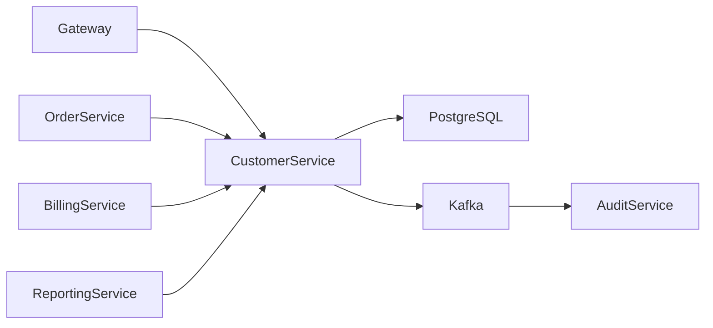
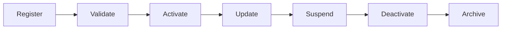
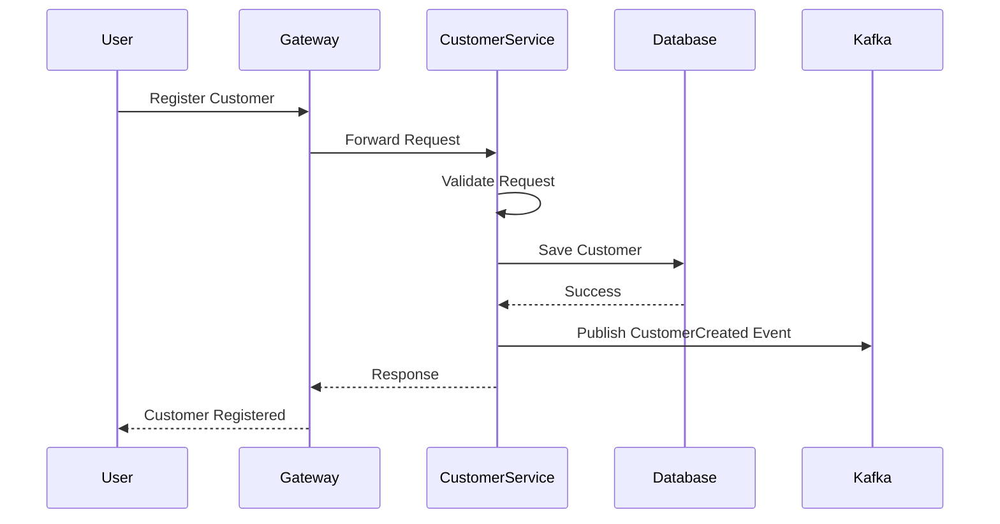
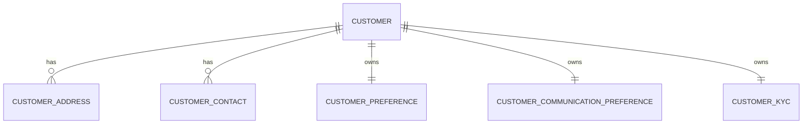
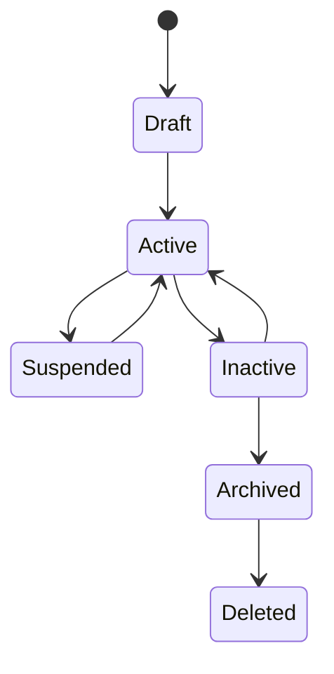
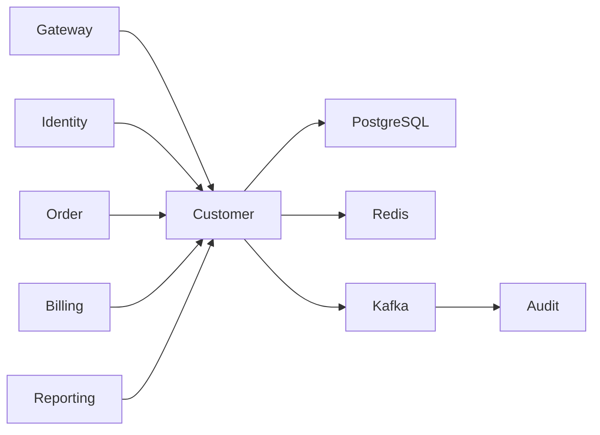

# SRS-004: Customer Service Software Requirements Specification

---

# 1. Document Information

| Field | Value |
|--------|-------|
| Project Name | Distributed Hub and Sales (DHS) Platform |
| Service Name | Customer Service |
| Document Title | Customer Service Software Requirements Specification |
| Document ID | SRS-004 |
| Repository | starone-dhs-platform |
| Module | customer-service |
| Document Type | Software Requirements Specification (SRS) |
| Standard | ISO/IEC/IEEE 29148 |
| Version | v1.0.0 |
| Status | Draft |
| Author | Sachin Salunke |
| Owner | Enterprise Architecture |
| Last Updated | 2026-06-27 |

---

# 2. Document Control

## 2.1 References

| Document | Description |
|----------|-------------|
| BRD-001 | Business Requirements Document |
| PRD-001 | Product Requirements Document |
| ADR-001 | Architecture Decision Record |
| HLD-001 | DHS High-Level Design |
| FRD-Customer | Customer Functional Requirements |
| SRS-001 | Platform Foundation |
| SRS-002 | Identity Service |
| SRS-003 | Branch Service |

---

## 2.2 Revision History

| Version | Date | Description |
|----------|------|-------------|
| v1.0.0 | 2026-06-27 | Initial Version |

---

## 2.3 Approval Matrix

| Role | Status |
|------|--------|
| Product Owner | Pending |
| Enterprise Architect | Pending |
| Platform Lead | Pending |
| QA Lead | Pending |

---

# 3. Introduction

## 3.1 Purpose

The Customer Service shall manage customer master data for the DHS Platform.

It acts as the authoritative source for customer information used across sales, inventory, order, billing, dispatch, reporting, and notification services.

The service shall provide standardized APIs for customer lifecycle management and customer information retrieval.

---

## 3.2 Scope

The Customer Service includes:

- Customer Registration
- Customer Profile Management
- Customer Classification
- Customer Address Management
- Customer Contact Management
- Customer Communication Preferences
- Customer KYC Management
- Customer Search
- Customer Status Management
- Customer Audit Events

---

## 3.3 Out of Scope

The Customer Service shall not provide:

- User Authentication
- User Authorization
- Branch Management
- Product Management
- Inventory Management
- Order Processing
- Billing
- Notification Delivery

---

## 3.4 Definitions

| Term | Description |
|------|-------------|
| Customer | Individual or Organization purchasing products or services |
| Customer Type | Retail, Wholesale, Distributor, Corporate |
| KYC | Know Your Customer information |
| Communication Preference | Customer preferred communication channel |

---

## 3.5 Assumptions

- Every customer shall have a unique Customer Code.
- Every customer shall have one primary contact.
- Every customer shall have one primary address.
- Customer master data shall be reused by other DHS services.

---

## 3.6 Constraints

- Customer Code is immutable.
- Customer deletion shall use soft delete.
- Customer history shall remain auditable.
- Customer master data shall be owned exclusively by Customer Service.

---

# 4. Service Overview

## 4.1 Responsibilities

The Customer Service shall provide:

- Customer CRUD Operations
- Customer Search
- Customer Classification
- Customer Address Management
- Customer Contact Management
- Customer Communication Preferences
- Customer KYC Management
- Customer Activation
- Customer Deactivation
- Customer Audit Event Publication

---

## 4.2 Service Context



---

## 4.3 Dependencies

| Dependency | Purpose |
|------------|---------|
| Platform Foundation | Shared Frameworks |
| Gateway | API Routing |
| Eureka | Service Discovery |
| PostgreSQL | Persistent Storage |
| Kafka | Event Publishing |
| Audit Service | Audit Processing |

---

## 4.4 Upstream Services

| Service | Purpose |
|----------|---------|
| Gateway | API Routing |
| Identity Service | Authentication & Authorization |

---

## 4.5 Downstream Services

| Service | Purpose |
|----------|---------|
| Order Service | Customer Validation |
| Billing Service | Billing Customer |
| Reporting Service | Customer Analytics |
| Notification Service | Customer Communication |

---

# 5. Business Process

## 5.1 Customer Lifecycle



---

## 5.2 Customer Registration Workflow



---

# 6. Functional Requirements

## Customer Management

### CU-SYS-001

The Customer Service shall register customers.

---

### CU-SYS-002

The Customer Service shall update customer profiles.

---

### CU-SYS-003

The Customer Service shall retrieve customer information.

---

### CU-SYS-004

The Customer Service shall search customers.

---

### CU-SYS-005

The Customer Service shall activate customers.

---

### CU-SYS-006

The Customer Service shall deactivate customers.

---

### CU-SYS-007

The Customer Service shall archive customers.

---

### CU-SYS-008

The Customer Service shall support soft deletion.

---

## Customer Classification

### CU-SYS-009

The Customer Service shall classify customers by business type.

---

### CU-SYS-010

The Customer Service shall maintain customer categories.

---

## Address Management

### CU-SYS-011

The Customer Service shall manage customer addresses.

---

### CU-SYS-012

Each customer shall have one primary address.

---

## Contact Management

### CU-SYS-013

The Customer Service shall manage customer contacts.

---

### CU-SYS-014

Each customer shall have one primary contact.

---

## Communication Preferences

### CU-SYS-015

The Customer Service shall maintain customer communication preferences.

---

### CU-SYS-016

Preferred communication channels shall be configurable.

---

## KYC Management

### CU-SYS-017

The Customer Service shall maintain KYC information.

---

### CU-SYS-018

KYC status shall be searchable.

---

## Integration

### CU-SYS-019

The Customer Service shall publish customer lifecycle events.

---

### CU-SYS-020

The Customer Service shall expose REST APIs for authorized platform services.

---

# 7. Aggregate Root

The Customer domain shall be modeled using Domain-Driven Design.

```
Customer (Aggregate Root)
├── CustomerAddress
├── CustomerContact
├── CustomerPreference
├── CustomerCommunicationPreference
└── CustomerKYC
```

Only the Customer aggregate root shall control modifications to its child entities.

---

# 8. Business Rules

The Customer Service shall enforce the following business rules to maintain consistency, integrity, and governance of customer master data.

---

## 8.1 Customer Registration Rules

### CU-BR-001

Every customer shall have a unique Customer Code.

---

### CU-BR-002

Customer Code shall be generated according to the enterprise numbering policy.

---

### CU-BR-003

Customer Code shall remain immutable after customer registration.

---

### CU-BR-004

Every customer shall have one primary contact.

---

### CU-BR-005

Every customer shall have one primary address.

---

### CU-BR-006

Every customer shall belong to one customer type.

---

### CU-BR-007

Customer registration date shall be system generated.

---

## 8.2 Customer Classification Rules

### CU-BR-008

Customer Type shall be one of:

- Retail
- Wholesale
- Distributor
- Corporate

---

### CU-BR-009

Customer Category shall be configurable.

---

### CU-BR-010

Customer classification shall support future extension.

---

## 8.3 Contact Rules

### CU-BR-011

Primary Email Address shall be unique.

---

### CU-BR-012

Primary Mobile Number shall be unique.

---

### CU-BR-013

A customer may have multiple contact persons.

---

## 8.4 Address Rules

### CU-BR-014

A customer may maintain multiple addresses.

---

### CU-BR-015

Only one address shall be marked as Primary.

---

### CU-BR-016

Addresses shall reference approved Country, State and City master data.

---

## 8.5 Customer Status Rules

### CU-BR-017

Customer Status shall support:

- Draft
- Active
- Suspended
- Inactive
- Archived

---

### CU-BR-018

Only Active customers may participate in order processing.

---

### CU-BR-019

Inactive customers shall remain available for reporting.

---

### CU-BR-020

Archived customers shall not be modified.

---

## 8.6 KYC Rules

### CU-BR-021

KYC verification shall be optional unless mandated by business policy.

---

### CU-BR-022

Verified KYC records shall not be modified without authorization.

---

### CU-BR-023

KYC status shall support searching and filtering.

---

# 9. REST API Specification

Base URL

```text
/api/v1/customers
```

All APIs shall be exposed through the DHS API Gateway.

---

# 9.1 API Overview

| Method | URI | Description |
|----------|-----|-------------|
| POST | / | Register Customer |
| PUT | /{customerId} | Update Customer |
| GET | /{customerId} | Get Customer |
| DELETE | /{customerId} | Archive Customer |
| GET | / | Search Customers |
| PATCH | /{customerId}/activate | Activate Customer |
| PATCH | /{customerId}/suspend | Suspend Customer |
| PATCH | /{customerId}/deactivate | Deactivate Customer |
| GET | /code/{customerCode} | Find by Customer Code |

---

# 9.2 Request Headers

| Header | Required | Description |
|----------|----------|-------------|
| Authorization | Yes | JWT Bearer Token |
| X-Correlation-ID | Yes | Correlation Identifier |
| Content-Type | Yes | application/json |
| Accept | Yes | application/json |

---

# 9.3 Query Parameters

| Parameter | Required | Description |
|------------|----------|-------------|
| page | No | Page Number |
| size | No | Page Size |
| sort | No | Sort Field |
| direction | No | ASC or DESC |
| keyword | No | Global Search |
| customerType | No | Customer Type |
| category | No | Customer Category |
| status | No | Customer Status |
| city | No | City |
| state | No | State |

---

# 9.4 Path Parameters

| Parameter | Description |
|------------|-------------|
| customerId | Customer Identifier |
| customerCode | Customer Code |

---

# 9.5 Register Customer API

```http
POST /api/v1/customers
```

Request

```json
{
  "customerType": "Retail",
  "customerName": "ABC Traders",
  "email": "abc@example.com",
  "mobileNumber": "+919999999999",
  "address": {
    "line1": "",
    "city": "",
    "state": "",
    "country": "",
    "postalCode": ""
  }
}
```

---

Response

```json
{
  "customerId": "UUID",
  "customerCode": "CUS000001",
  "status": "ACTIVE"
}
```

---

Success

- HTTP 201

Errors

- HTTP 400
- HTTP 401
- HTTP 403
- HTTP 409

---

# 9.6 Update Customer API

```http
PUT /api/v1/customers/{customerId}
```

Updates editable customer information.

Customer Code shall not be modified.

---

# 9.7 Get Customer API

```http
GET /api/v1/customers/{customerId}
```

Returns complete customer information.

---

# 9.8 Search Customer API

```http
GET /api/v1/customers
```

Supports:

- Pagination
- Sorting
- Filtering
- Global Search

---

# 9.9 Activate Customer API

```http
PATCH /api/v1/customers/{customerId}/activate
```

---

# 9.10 Suspend Customer API

```http
PATCH /api/v1/customers/{customerId}/suspend
```

---

# 9.11 Deactivate Customer API

```http
PATCH /api/v1/customers/{customerId}/deactivate
```

---

# 9.12 Archive Customer API

```http
DELETE /api/v1/customers/{customerId}
```

Performs logical deletion.

---

# 10. Request Models

## RegisterCustomerRequest

| Field | Type | Required |
|---------|------|----------|
| customerType | CustomerType | Yes |
| customerName | String | Yes |
| email | String | Yes |
| mobileNumber | String | Yes |
| address | AddressDTO | Yes |

---

## UpdateCustomerRequest

| Field | Type |
|---------|------|
| customerName | String |
| email | String |
| mobileNumber | String |
| status | CustomerStatus |
| category | String |
| communicationPreference | CommunicationPreference |

---

## SearchCustomerRequest

| Field | Type |
|---------|------|
| keyword | String |
| customerType | CustomerType |
| category | String |
| city | String |
| state | String |
| status | CustomerStatus |

---

# 11. Response Models

## CustomerResponse

| Field | Type |
|---------|------|
| customerId | UUID |
| customerCode | String |
| customerName | String |
| customerType | CustomerType |
| status | CustomerStatus |
| primaryAddress | AddressDTO |

---

## CustomerSummaryResponse

| Field | Type |
|---------|------|
| customerId | UUID |
| customerCode | String |
| customerName | String |
| customerType | CustomerType |
| city | String |
| state | String |
| status | CustomerStatus |

---

## CustomerSearchResponse

| Field | Type |
|---------|------|
| totalRecords | Long |
| totalPages | Integer |
| customers | List<CustomerSummaryResponse> |

---

# 12. Validation Rules

## Customer Registration

- Customer Name is mandatory.
- Customer Type is mandatory.
- Email is mandatory.
- Email shall be valid.
- Email shall be unique.
- Mobile Number is mandatory.
- Mobile Number shall be unique.
- Country is mandatory.
- State is mandatory.
- City is mandatory.
- Postal Code is mandatory.

---

## Customer Update

- Customer Code cannot be modified.
- Customer Name cannot be blank.
- Email shall remain unique.
- Mobile Number shall remain unique.

---

## Customer Search

- Page Number shall be greater than zero.
- Page Size shall not exceed configured maximum.
- Customer Status shall be valid.
- Customer Type shall be valid.

---

## KYC Validation

- KYC Number shall be unique where applicable.
- PAN Number format shall be validated.
- GST Number format shall be validated.

---

# 13. Permission Matrix

| API | Super Admin | Admin | Sales Manager | Sales Executive | Viewer |
|------|-------------|--------|---------------|-----------------|--------|
| Register Customer | ✅ | ✅ | ✅ | ✅ | ❌ |
| Update Customer | ✅ | ✅ | ✅ | ✅ | ❌ |
| Archive Customer | ✅ | ✅ | ❌ | ❌ | ❌ |
| Activate Customer | ✅ | ✅ | ✅ | ❌ | ❌ |
| Suspend Customer | ✅ | ✅ | ✅ | ❌ | ❌ |
| Deactivate Customer | ✅ | ✅ | ❌ | ❌ | ❌ |
| View Customer | ✅ | ✅ | ✅ | ✅ | ✅ |
| Search Customer | ✅ | ✅ | ✅ | ✅ | ✅ |

---

# 14. Standard HTTP Status Codes

| Status | Description |
|----------|-------------|
| 200 | Success |
| 201 | Created |
| 204 | Archived |
| 400 | Validation Error |
| 401 | Unauthorized |
| 403 | Forbidden |
| 404 | Customer Not Found |
| 409 | Duplicate Customer |
| 422 | Business Rule Violation |
| 500 | Internal Server Error |

---

# 15. Aggregate Model

The Customer Service shall implement the Customer domain using Domain-Driven Design (DDD).

The **Customer** entity shall be the Aggregate Root and shall exclusively control the lifecycle of all subordinate entities.

No child entity shall be modified independently of the Customer Aggregate.

---

## 15.1 Customer Aggregate

```text
Customer
│
├── CustomerAddress
│
├── CustomerContact
│
├── CustomerCommunicationPreference
│
├── CustomerKYC
│
└── CustomerPreference
```

---

## Aggregate Responsibilities

| Aggregate | Responsibility |
|------------|----------------|
| Customer | Customer Master |
| CustomerAddress | Address Management |
| CustomerContact | Contact Management |
| CustomerCommunicationPreference | Preferred Communication |
| CustomerPreference | Business Preferences |
| CustomerKYC | KYC Information |

---

# 16. Entity Model

## 16.1 Entity Overview

| Entity | Description |
|----------|-------------|
| Customer | Aggregate Root |
| CustomerAddress | Customer Addresses |
| CustomerContact | Contact Persons |
| CustomerCommunicationPreference | Communication Preferences |
| CustomerPreference | Business Preferences |
| CustomerKYC | Regulatory Information |

---

## 16.2 Customer Entity

| Attribute | Type | Constraint |
|------------|------|------------|
| id | UUID | Primary Key |
| customerCode | VARCHAR(30) | Unique |
| customerType | ENUM | Required |
| customerCategory | VARCHAR(50) | Required |
| customerName | VARCHAR(200) | Required |
| email | VARCHAR(150) | Unique |
| mobileNumber | VARCHAR(20) | Unique |
| status | ENUM | Required |
| registrationDate | DATE | Required |
| createdBy | UUID | Required |
| createdAt | TIMESTAMP | Required |
| updatedBy | UUID | Required |
| updatedAt | TIMESTAMP | Required |
| deleted | BOOLEAN | Default FALSE |

---

## 16.3 Customer Address

| Attribute | Type |
|------------|------|
| id | UUID |
| customerId | UUID |
| addressType | ENUM |
| line1 | VARCHAR(255) |
| line2 | VARCHAR(255) |
| landmark | VARCHAR(255) |
| city | VARCHAR(100) |
| district | VARCHAR(100) |
| state | VARCHAR(100) |
| country | VARCHAR(100) |
| postalCode | VARCHAR(20) |
| primaryAddress | BOOLEAN |

---

## 16.4 Customer Contact

| Attribute | Type |
|------------|------|
| id | UUID |
| customerId | UUID |
| contactPerson | VARCHAR(150) |
| designation | VARCHAR(100) |
| mobileNumber | VARCHAR(20) |
| email | VARCHAR(150) |
| primaryContact | BOOLEAN |

---

## 16.5 Customer Communication Preference

| Attribute | Type |
|------------|------|
| id | UUID |
| customerId | UUID |
| preferredChannel | ENUM |
| language | VARCHAR(20) |
| marketingConsent | BOOLEAN |

---

## 16.6 Customer Preference

| Attribute | Type |
|------------|------|
| id | UUID |
| customerId | UUID |
| paymentTerms | VARCHAR(100) |
| preferredCurrency | VARCHAR(10) |
| preferredBranchId | UUID |

---

## 16.7 Customer KYC

| Attribute | Type |
|------------|------|
| id | UUID |
| customerId | UUID |
| panNumber | VARCHAR(20) |
| gstNumber | VARCHAR(20) |
| aadhaarNumber | VARCHAR(20) |
| verificationStatus | ENUM |
| verifiedDate | DATE |

---

# 17. Database Design

Database

```text
customer_db
```

Schema

```text
customer
```

---

## 17.1 Tables

| Table | Purpose |
|---------|---------|
| customer | Customer Master |
| customer_address | Customer Addresses |
| customer_contact | Contact Persons |
| customer_preference | Customer Preferences |
| customer_communication_preference | Communication Preferences |
| customer_kyc | KYC Information |

---

## 17.2 Primary Keys

Every table shall use UUID as its primary key.

---

## 17.3 Foreign Keys

| Child Table | Parent Table |
|--------------|--------------|
| customer_address | customer |
| customer_contact | customer |
| customer_preference | customer |
| customer_communication_preference | customer |
| customer_kyc | customer |

---

## 17.4 Constraints

Customer

- Customer Code UNIQUE
- Email UNIQUE
- Mobile Number UNIQUE
- Customer Name NOT NULL

Customer Address

- One Primary Address

Customer Contact

- One Primary Contact

Customer KYC

- PAN UNIQUE
- GST UNIQUE

---

## 17.5 Indexes

| Table | Index |
|---------|-------|
| customer | customer_code |
| customer | customer_name |
| customer | customer_type |
| customer | customer_category |
| customer | status |
| customer | email |
| customer | mobile_number |
| customer_address | city |
| customer_address | state |

---

# 18. Entity Relationship Diagram



---

# 19. Customer State Diagram



---

# 20. Security Requirements

The Customer Service shall rely upon the Identity Service for authentication and authorization.

---

## Authentication

### CU-SEC-001

Every request shall contain a valid JWT Access Token.

---

### CU-SEC-002

Authentication shall be delegated to the Identity Service.

---

### CU-SEC-003

Unauthenticated requests shall return HTTP 401.

---

## Authorization

### CU-SEC-004

Customer APIs shall enforce Role-Based Access Control.

---

### CU-SEC-005

Permissions shall be validated before executing business operations.

---

### CU-SEC-006

Unauthorized requests shall return HTTP 403.

---

## Data Security

### CU-SEC-007

All customer data shall be transmitted using TLS 1.3.

---

### CU-SEC-008

Personally Identifiable Information (PII) shall be protected according to enterprise security policies.

---

### CU-SEC-009

Sensitive customer information shall not be logged.

---

# 21. Event Specification

The Customer Service shall publish domain events whenever customer master data changes.

---

## 21.1 Published Events

| Topic | Event | Key | Version |
|---------|-------|-----|----------|
| customer.created.v1 | CustomerCreated | Customer ID | v1 |
| customer.updated.v1 | CustomerUpdated | Customer ID | v1 |
| customer.activated.v1 | CustomerActivated | Customer ID | v1 |
| customer.suspended.v1 | CustomerSuspended | Customer ID | v1 |
| customer.deactivated.v1 | CustomerDeactivated | Customer ID | v1 |
| customer.archived.v1 | CustomerArchived | Customer ID | v1 |

---

## 21.2 Consumed Events

| Topic | Source |
|---------|--------|
| branch.updated.v1 | Branch Service |
| branch.deleted.v1 | Branch Service |

---

## 21.3 Standard Event Structure

```json
{
  "eventId": "UUID",
  "eventType": "CustomerCreated",
  "eventVersion": "1.0",
  "occurredAt": "2026-06-27T10:30:00Z",
  "correlationId": "UUID",
  "payload": {}
}
```

---

# 22. External Interfaces

| Interface | Purpose |
|------------|---------|
| API Gateway | Request Routing |
| Kafka | Event Streaming |
| PostgreSQL | Persistent Storage |
| Redis | Reference Cache |
| Audit Service | Audit Events |

---

# 23. OpenFeign Clients

| Client | Purpose |
|----------|---------|
| BranchClient | Validate Preferred Branch (if configured) |

> Audit logging should be event-driven through Kafka rather than synchronous REST integration.

---

# 24. Configuration

Configuration shall be externalized using the centralized configuration repository.

---

## Configuration Categories

- Server
- Database
- Redis
- Kafka
- Logging
- Security
- Customer
- OpenFeign
- Observability

---

## Configuration Properties

| Property | Default | Required | Description |
|------------|----------|-----------|-------------|
| customer.search.max-page-size | 100 | Yes | Maximum page size |
| customer.cache.enabled | true | Yes | Enable cache |
| customer.cache.ttl | 3600 | Yes | Cache TTL |
| customer.kyc.enabled | true | Yes | Enable KYC module |
| customer.event.topic.created | customer.created.v1 | Yes | Created event topic |
| customer.event.topic.updated | customer.updated.v1 | Yes | Updated event topic |

---

# 25. Service Context Diagram



---

# 26. Error Handling

The Customer Service shall provide standardized error handling for all customer management operations.

All error responses shall comply with the Platform Foundation error model defined in **SRS-001 – Platform Foundation**.

---

## 26.1 Functional Requirements

### CU-SYS-021

The Customer Service shall return standardized error responses.

---

### CU-SYS-022

Business exceptions shall be distinguishable from technical exceptions.

---

### CU-SYS-023

Every error response shall include a Correlation ID.

---

### CU-SYS-024

Unhandled exceptions shall return HTTP 500.

---

### CU-SYS-025

Internal implementation details shall never be exposed to API consumers.

---

## 26.2 Standard Error Response

```json
{
  "timestamp": "2026-06-27T11:15:30Z",
  "status": 409,
  "error": "Duplicate Customer",
  "code": "CU-BUS-001",
  "message": "Customer already exists.",
  "correlationId": "3f0ebdb9-bd5f-420f-b2d6-fc6c7d28f1fd",
  "path": "/api/v1/customers"
}
```

---

## 26.3 Business Error Catalog

| Error Code | Description | HTTP Status |
|------------|-------------|-------------|
| CU-VAL-001 | Validation Failed | 400 |
| CU-AUTH-001 | Authentication Required | 401 |
| CU-AUTH-002 | Access Denied | 403 |
| CU-BUS-001 | Customer Already Exists | 409 |
| CU-BUS-002 | Customer Not Found | 404 |
| CU-BUS-003 | Duplicate Email Address | 409 |
| CU-BUS-004 | Duplicate Mobile Number | 409 |
| CU-BUS-005 | Duplicate Customer Code | 409 |
| CU-BUS-006 | Invalid Customer Status | 422 |
| CU-BUS-007 | Customer Cannot Be Archived | 409 |
| CU-BUS-008 | Invalid Customer Type | 422 |
| CU-SYS-001 | Internal Server Error | 500 |

---

# 27. Logging Requirements

The Customer Service shall use the Platform Foundation logging framework.

---

## 27.1 Functional Requirements

### CU-SYS-026

Customer registration shall generate an audit log.

---

### CU-SYS-027

Customer profile updates shall generate an audit log.

---

### CU-SYS-028

Customer lifecycle changes shall generate an audit log.

---

### CU-SYS-029

Customer archive operations shall generate an audit log.

---

### CU-SYS-030

Business and system exceptions shall be logged.

---

## 27.2 Log Attributes

Every log entry shall include:

- Timestamp
- Service Name
- Correlation ID
- Trace ID
- Span ID
- User ID
- Customer ID
- Request URI
- HTTP Method
- HTTP Status
- Processing Time

---

## 27.3 Sensitive Information

The following information shall never be logged:

- JWT Tokens
- Authorization Header
- Passwords
- PAN Number
- Aadhaar Number
- GST Number
- Personal Contact Information
- Encryption Keys

---

# 28. Observability Requirements

The Customer Service shall expose operational metrics through the Platform Foundation.

---

## 28.1 Functional Requirements

### CU-SYS-031

The Customer Service shall expose Health endpoints.

---

### CU-SYS-032

The Customer Service shall expose Metrics endpoints.

---

### CU-SYS-033

The Customer Service shall support Distributed Tracing.

---

### CU-SYS-034

Every request shall propagate Correlation IDs.

---

### CU-SYS-035

Customer business metrics shall be collected.

---

## 28.2 Business Metrics

The Customer Service shall publish metrics including:

- Total Customers
- Active Customers
- Suspended Customers
- Inactive Customers
- Archived Customers
- Customer Registrations
- Customer Updates
- Customer Search Requests
- Customer API Response Time
- Validation Failures

---

# 29. Non-Functional Requirements

## 29.1 Performance

### CU-NFR-001

Customer retrieval shall complete within 200 milliseconds under normal operating conditions.

---

### CU-NFR-002

Customer registration shall complete within 500 milliseconds.

---

### CU-NFR-003

Customer search shall support pagination, filtering and sorting within 500 milliseconds.

---

## 29.2 Availability

### CU-NFR-004

The Customer Service shall maintain at least 99.9% availability.

---

### CU-NFR-005

The service shall support horizontal scaling.

---

## 29.3 Reliability

### CU-NFR-006

Customer master data shall remain transactionally consistent.

---

### CU-NFR-007

Published customer events shall guarantee at-least-once delivery.

---

## 29.4 Scalability

### CU-NFR-008

The service shall support concurrent customer operations.

---

### CU-NFR-009

Search operations shall scale independently.

---

## 29.5 Security

### CU-NFR-010

All communication shall use TLS 1.3.

---

### CU-NFR-011

Every protected API shall enforce RBAC authorization.

---

### CU-NFR-012

Archived customers shall not appear in standard search results unless explicitly requested.

---

## 29.6 Maintainability

### CU-NFR-013

The service shall use Platform Foundation shared libraries.

---

### CU-NFR-014

The service shall follow enterprise coding standards.

---

# 30. Requirement Traceability Matrix

| Requirement | Source Document | Source Requirement | Verification |
|-------------|-----------------|--------------------|--------------|
| CU-SYS-001 – CU-SYS-020 | FRD-Customer | Customer Functional Requirements | Functional Testing |
| CU-SYS-021 – CU-SYS-035 | SRS-001 | Platform Runtime Requirements | Integration Testing |
| CU-NFR-001 – CU-NFR-014 | PRD / HLD | Quality Attributes | Performance & Security Testing |

---

# 31. Testability Matrix

| Requirement | Test Case |
|-------------|-----------|
| CU-SYS-001 | TC-CU-001 |
| CU-SYS-002 | TC-CU-002 |
| CU-SYS-003 | TC-CU-003 |
| CU-SYS-004 | TC-CU-004 |
| CU-SYS-005 | TC-CU-005 |
| CU-SYS-006 | TC-CU-006 |
| CU-SYS-007 | TC-CU-007 |
| CU-SYS-008 | TC-CU-008 |
| CU-SYS-009 | TC-CU-009 |
| CU-SYS-010 | TC-CU-010 |

---

# 32. Acceptance Criteria

The Customer Service shall be considered complete when:

- Customer registration functions successfully.
- Customer profile management is operational.
- Customer classification is implemented.
- Customer address management functions correctly.
- Customer contact management functions correctly.
- Customer preference management functions correctly.
- Customer KYC management functions correctly.
- Customer lifecycle management functions correctly.
- Customer search supports pagination, filtering and sorting.
- Customer domain events are published successfully.
- Standardized error responses are returned.
- Logging and metrics are operational.
- Health endpoints are operational.
- Performance objectives are achieved.
- Security requirements are satisfied.
- Functional, integration and non-functional tests pass.

---

# 33. Appendices

## Appendix A – API Summary

| Resource | Endpoints |
|----------|-----------|
| Customer | Register, Update, Get, Archive, Search |
| Customer Status | Activate, Suspend, Deactivate |
| Customer KYC | Manage KYC |
| Customer Preferences | Manage Preferences |

---

## Appendix B – Aggregate Summary

| Aggregate | Description |
|------------|-------------|
| Customer | Aggregate Root |
| CustomerAddress | Customer Addresses |
| CustomerContact | Contact Information |
| CustomerCommunicationPreference | Communication Preferences |
| CustomerPreference | Business Preferences |
| CustomerKYC | Regulatory Information |

---

## Appendix C – Service Dependencies

| Dependency | Purpose |
|------------|---------|
| Platform Foundation | Shared Frameworks |
| Gateway | API Routing |
| Eureka | Service Discovery |
| PostgreSQL | Persistent Storage |
| Redis | Caching |
| Kafka | Event Streaming |
| Identity Service | Authentication & Authorization |
| Branch Service | Preferred Branch Validation |
| Audit Service | Audit Processing |

---

## Appendix D – Revision History

| Version | Description |
|---------|-------------|
| v1.0.0 | Initial Customer Service Software Requirements Specification |

---

# 34. Document Sign-off

| Role | Status |
|------|--------|
| Product Owner | Pending |
| Enterprise Architect | Pending |
| Platform Lead | Pending |
| Security Lead | Pending |
| QA Lead | Pending |

---

# End of Document
