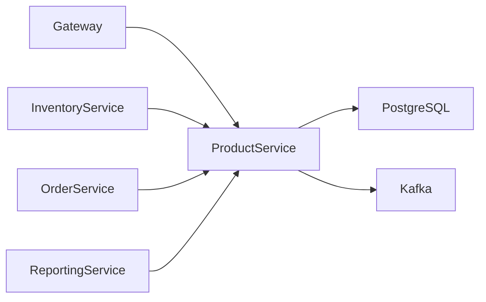
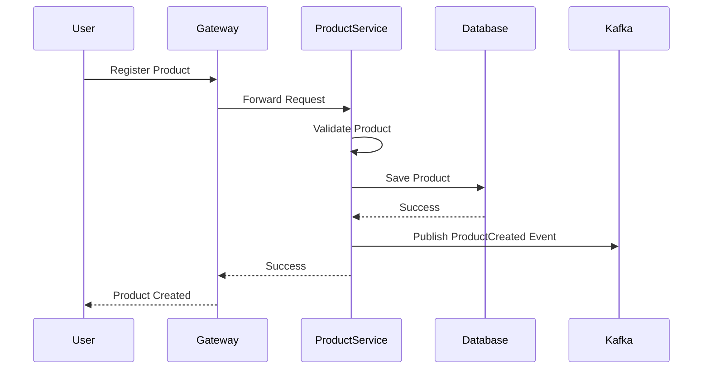
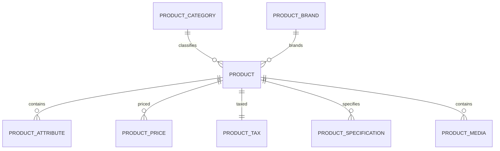
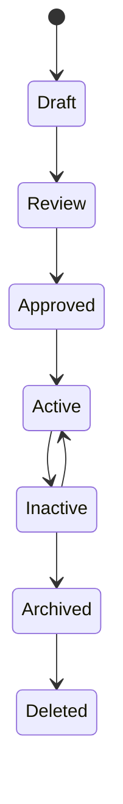
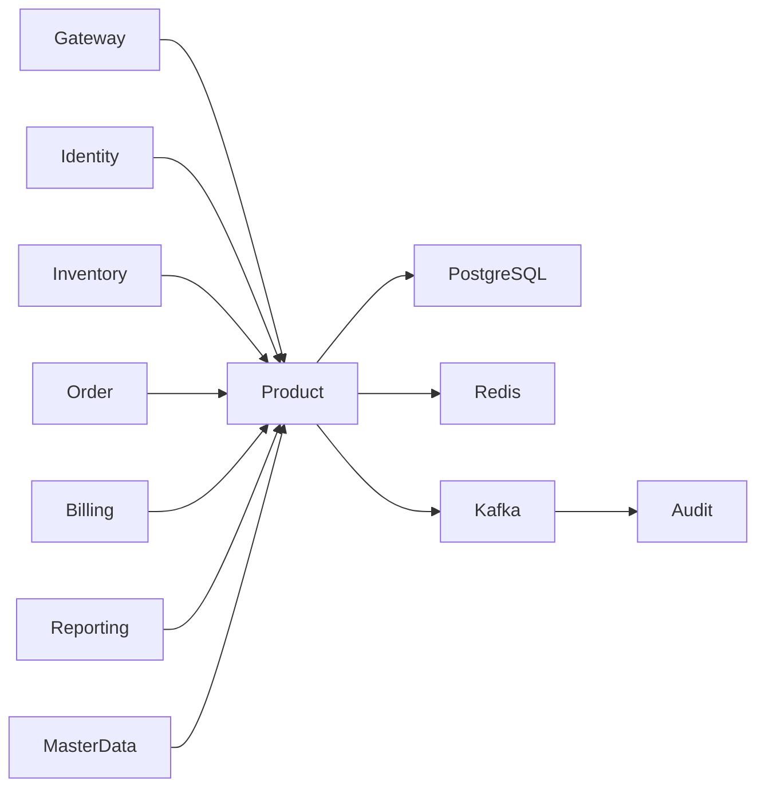

# SRS-005: Product Service Software Requirements Specification

---

# 1. Document Information

| Field          | Value                                               |
| -------------- | --------------------------------------------------- |
| Project Name   | Distributed Hub and Sales (DHS) Platform            |
| Service Name   | Product Service                                     |
| Document Title | Product Service Software Requirements Specification |
| Document ID    | SRS-005                                             |
| Repository     | starone-dhs-platform                                |
| Module         | product-service                                     |
| Document Type  | Software Requirements Specification (SRS)           |
| Standard       | ISO/IEC/IEEE 29148                                  |
| Version        | v1.0.0                                              |
| Status         | Draft                                               |
| Author         | Sachin Salunke                                      |
| Owner          | Enterprise Architecture                             |
| Last Updated   | 2026-06-27                                          |

---

# 2. Document Control

## 2.1 References

| Document    | Description                     |
| ----------- | ------------------------------- |
| BRD-001     | Business Requirements Document  |
| PRD-001     | Product Requirements Document   |
| ADR-001     | Architecture Decision Record    |
| HLD-001     | DHS High-Level Design           |
| FRD-Product | Product Functional Requirements |
| SRS-001     | Platform Foundation             |
| SRS-002     | Identity Service                |
| SRS-003     | Branch Service                  |
| SRS-004     | Customer Service                |

---

## 2.2 Revision History

| Version | Date       | Description     |
| ------- | ---------- | --------------- |
| v1.0.0  | 2026-06-27 | Initial Version |

---

## 2.3 Approval Matrix

| Role                 | Status  |
| -------------------- | ------- |
| Product Owner        | Pending |
| Enterprise Architect | Pending |
| Platform Lead        | Pending |
| QA Lead              | Pending |

---

# 3. Introduction

## 3.1 Purpose

The Product Service shall act as the authoritative source for all product master data within the DHS Platform.

It shall provide centralized management of products, categories, brands, pricing, taxation, specifications, media, and product lifecycle.

---

## 3.2 Scope

The Product Service includes:

- Product Management
- Product Category Management
- Product Brand Management
- Product Pricing
- Product Tax Classification
- Product Specifications
- Product Media
- Product Search
- Product Status Management
- Product Audit Events

---

## 3.3 Out of Scope

The Product Service shall not provide:

- Inventory Management
- Stock Availability
- Warehouse Management
- Order Processing
- Billing
- Dispatch
- Customer Management
- Authentication

---

## 3.4 Definitions

| Term     | Description            |
| -------- | ---------------------- |
| Product  | Sellable Item          |
| SKU      | Stock Keeping Unit     |
| Brand    | Product Brand          |
| Category | Product Classification |
| UOM      | Unit of Measure        |

---

## 3.5 Assumptions

- Every product shall have a unique Product Code.
- Every SKU shall be unique.
- Every product belongs to one category.
- Every product belongs to one brand.
- Inventory quantities are managed outside this service.

---

## 3.6 Constraints

- Product Code is immutable.
- Product deletion uses soft delete.
- Archived products cannot be modified.
- Inventory information shall not be stored within Product Service.

---

# 4. Service Overview

## 4.1 Responsibilities

The Product Service shall provide:

- Product CRUD
- Category Management
- Brand Management
- Product Pricing
- Product Tax Classification
- Product Specification Management
- Product Media Management
- Product Search
- Product Lifecycle Management
- Product Event Publishing

---

## 4.2 Service Context



---

## 4.3 Dependencies

| Dependency          | Purpose            |
| ------------------- | ------------------ |
| Platform Foundation | Shared Frameworks  |
| Gateway             | API Routing        |
| Eureka              | Service Discovery  |
| PostgreSQL          | Persistent Storage |
| Kafka               | Event Streaming    |
| Audit Service       | Audit Events       |

---

## 4.4 Upstream Services

| Service          | Purpose                        |
| ---------------- | ------------------------------ |
| Gateway          | API Routing                    |
| Identity Service | Authentication & Authorization |

---

## 4.5 Downstream Services

| Service           | Purpose            |
| ----------------- | ------------------ |
| Inventory Service | Product Reference  |
| Order Service     | Product Validation |
| Billing Service   | Pricing Reference  |
| Reporting Service | Product Analytics  |

---

# 5. Business Process

## 5.1 Product Lifecycle


---

## 5.2 Product Registration Workflow



---

# 6. Functional Requirements

## Product Management

### PR-SYS-001

The Product Service shall create products.

---

### PR-SYS-002

The Product Service shall update product information.

---

### PR-SYS-003

The Product Service shall retrieve product details.

---

### PR-SYS-004

The Product Service shall search products.

---

### PR-SYS-005

The Product Service shall activate products.

---

### PR-SYS-006

The Product Service shall deactivate products.

---

### PR-SYS-007

The Product Service shall archive products.

---

### PR-SYS-008

The Product Service shall support soft deletion.

---

## Category Management

### PR-SYS-009

The Product Service shall manage product categories.

---

### PR-SYS-010

Each product shall belong to one category.

---

## Brand Management

### PR-SYS-011

The Product Service shall manage product brands.

---

### PR-SYS-012

Each product shall belong to one brand.

---

## Pricing

### PR-SYS-013

The Product Service shall maintain base selling prices.

---

### PR-SYS-014

Product pricing shall support future versioning.

---

## Taxation

### PR-SYS-015

The Product Service shall maintain tax classifications.

---

### PR-SYS-016

GST rates shall be configurable.

---

## Product Specifications

### PR-SYS-017

The Product Service shall maintain technical specifications.

---

## Product Media

### PR-SYS-018

The Product Service shall manage product images and documents.

---

## Integration

### PR-SYS-019

The Product Service shall publish product lifecycle events.

---

### PR-SYS-020

The Product Service shall expose REST APIs for authorized platform services.

---

# 7. Aggregate Root

The Product domain shall follow Domain-Driven Design.

```text
Product (Aggregate Root)
│
├── ProductCategory
├── ProductBrand
├── ProductAttribute
├── ProductPrice
├── ProductTax
├── ProductSpecification
└── ProductMedia
```

Only the Product aggregate shall control modifications to its child entities.

---

# 8. Business Rules

The Product Service shall enforce the following business rules to maintain the integrity, consistency, and governance of product master data.

---

## 8.1 Product Registration Rules

### PR-BR-001

Every product shall have a unique Product Code.

---

### PR-BR-002

Every SKU shall be globally unique across the enterprise.

---

### PR-BR-003

Product Code shall be generated according to the enterprise numbering policy.

---

### PR-BR-004

Product Code shall remain immutable after creation.

---

### PR-BR-005

Every product shall belong to exactly one Product Category.

---

### PR-BR-006

Every product shall belong to exactly one Product Brand.

---

### PR-BR-007

Every product shall have one Base Unit of Measure (UOM).

---

## 8.2 Category Rules

### PR-BR-008

Product Categories shall be managed as enterprise master data.

---

### PR-BR-009

Inactive Product Categories shall not be assigned to new products.

---

### PR-BR-010

Deleting a Product Category referenced by products shall not be permitted.

---

## 8.3 Brand Rules

### PR-BR-011

Product Brands shall be managed independently.

---

### PR-BR-012

Inactive Brands shall not be assigned to new products.

---

## 8.4 Pricing Rules

### PR-BR-013

Every product shall have one active Base Price.

---

### PR-BR-014

Price changes shall maintain historical records.

---

### PR-BR-015

Only one active price record shall exist per product.

---

## 8.5 Tax Rules

### PR-BR-016

Every product shall reference one Tax Category.

---

### PR-BR-017

GST percentages shall be configurable.

---

### PR-BR-018

Tax Categories shall be maintained as reference data.

---

## 8.6 Product Status Rules

### PR-BR-019

Product Status shall support:

- Draft
- Active
- Inactive
- Archived

---

### PR-BR-020

Only Active products shall be available for order processing.

---

### PR-BR-021

Archived products shall remain available for historical reporting.

---

### PR-BR-022

Archived products shall not be modified.

---

## 8.7 Product Media Rules

### PR-BR-023

A product may contain multiple media files.

---

### PR-BR-024

Only supported file formats shall be accepted.

---

### PR-BR-025

One media file may be marked as the default image.

---

# 9. REST API Specification

Base URL

```text
/api/v1/products
```

All APIs shall be exposed through the DHS API Gateway.

---

# 9.1 API Overview

| Method | URI                     | Description          |
| ------ | ----------------------- | -------------------- |
| POST   | /                       | Create Product       |
| PUT    | /{productId}            | Update Product       |
| GET    | /{productId}            | Get Product          |
| DELETE | /{productId}            | Archive Product      |
| GET    | /                       | Search Products      |
| PATCH  | /{productId}/activate   | Activate Product     |
| PATCH  | /{productId}/deactivate | Deactivate Product   |
| GET    | /code/{productCode}     | Find by Product Code |
| GET    | /sku/{sku}              | Find by SKU          |

---

# 9.2 Request Headers

| Header           | Required | Description            |
| ---------------- | -------- | ---------------------- |
| Authorization    | Yes      | JWT Bearer Token       |
| X-Correlation-ID | Yes      | Correlation Identifier |
| Content-Type     | Yes      | application/json       |
| Accept           | Yes      | application/json       |

---

# 9.3 Query Parameters

| Parameter   | Required | Description      |
| ----------- | -------- | ---------------- |
| page        | No       | Page Number      |
| size        | No       | Page Size        |
| sort        | No       | Sort Field       |
| direction   | No       | ASC or DESC      |
| keyword     | No       | Global Search    |
| category    | No       | Product Category |
| brand       | No       | Product Brand    |
| status      | No       | Product Status   |
| taxCategory | No       | Tax Category     |

---

# 9.4 Path Parameters

| Parameter   | Description        |
| ----------- | ------------------ |
| productId   | Product Identifier |
| productCode | Product Code       |
| sku         | Product SKU        |

---

# 9.5 Create Product API

```http
POST /api/v1/products
```

Request

```json
{
  "productName": "Samsung Galaxy S26",
  "sku": "SAM-S26-256",
  "categoryId": "UUID",
  "brandId": "UUID",
  "uomId": "UUID",
  "basePrice": 69999.0,
  "taxCategoryId": "UUID"
}
```

---

Response

```json
{
  "productId": "UUID",
  "productCode": "PRD000001",
  "status": "ACTIVE"
}
```

---

Success

- HTTP 201

Errors

- HTTP 400
- HTTP 401
- HTTP 403
- HTTP 409

---

# 9.6 Update Product API

```http
PUT /api/v1/products/{productId}
```

Updates editable product information.

Product Code and SKU shall not be modified.

---

# 9.7 Get Product API

```http
GET /api/v1/products/{productId}
```

Returns complete product details.

---

# 9.8 Search Products API

```http
GET /api/v1/products
```

Supports:

- Pagination
- Sorting
- Filtering
- Global Search

---

# 9.9 Activate Product API

```http
PATCH /api/v1/products/{productId}/activate
```

---

# 9.10 Deactivate Product API

```http
PATCH /api/v1/products/{productId}/deactivate
```

---

# 9.11 Archive Product API

```http
DELETE /api/v1/products/{productId}
```

Performs logical deletion.

---

# 10. Request Models

## CreateProductRequest

| Field         | Type    | Required |
| ------------- | ------- | -------- |
| productName   | String  | Yes      |
| sku           | String  | Yes      |
| categoryId    | UUID    | Yes      |
| brandId       | UUID    | Yes      |
| uomId         | UUID    | Yes      |
| basePrice     | Decimal | Yes      |
| taxCategoryId | UUID    | Yes      |

---

## UpdateProductRequest

| Field         | Type          |
| ------------- | ------------- |
| productName   | String        |
| categoryId    | UUID          |
| brandId       | UUID          |
| basePrice     | Decimal       |
| taxCategoryId | UUID          |
| status        | ProductStatus |

---

## SearchProductRequest

| Field         | Type          |
| ------------- | ------------- |
| keyword       | String        |
| categoryId    | UUID          |
| brandId       | UUID          |
| status        | ProductStatus |
| taxCategoryId | UUID          |

---

# 11. Response Models

## ProductResponse

| Field       | Type          |
| ----------- | ------------- |
| productId   | UUID          |
| productCode | String        |
| productName | String        |
| sku         | String        |
| category    | CategoryDTO   |
| brand       | BrandDTO      |
| price       | PriceDTO      |
| tax         | TaxDTO        |
| status      | ProductStatus |

---

## ProductSummaryResponse

| Field       | Type          |
| ----------- | ------------- |
| productId   | UUID          |
| productCode | String        |
| productName | String        |
| sku         | String        |
| category    | String        |
| brand       | String        |
| status      | ProductStatus |

---

## ProductSearchResponse

| Field        | Type                         |
| ------------ | ---------------------------- |
| totalRecords | Long                         |
| totalPages   | Integer                      |
| products     | List<ProductSummaryResponse> |

---

# 12. Validation Rules

## Product Registration

- Product Name is mandatory.
- SKU is mandatory.
- SKU shall be unique.
- Category is mandatory.
- Brand is mandatory.
- Unit of Measure is mandatory.
- Base Price shall be greater than zero.
- Tax Category is mandatory.

---

## Product Update

- Product Code cannot be modified.
- SKU cannot be modified.
- Product Name cannot be blank.
- Category shall exist.
- Brand shall exist.
- Tax Category shall exist.

---

## Search Validation

- Page Number shall be greater than zero.
- Page Size shall not exceed configured maximum.
- Status shall be valid.
- Category shall exist.
- Brand shall exist.

---

## Pricing Validation

- Base Price shall be greater than zero.
- Effective Date shall not overlap another active price.

---

# 13. Permission Matrix

| API                | Super Admin | Admin | Product Manager | Product Executive | Viewer |
| ------------------ | ----------- | ----- | --------------- | ----------------- | ------ |
| Create Product     | ✅          | ✅    | ✅              | ❌                | ❌     |
| Update Product     | ✅          | ✅    | ✅              | ❌                | ❌     |
| Archive Product    | ✅          | ✅    | ❌              | ❌                | ❌     |
| Activate Product   | ✅          | ✅    | ✅              | ❌                | ❌     |
| Deactivate Product | ✅          | ✅    | ✅              | ❌                | ❌     |
| View Product       | ✅          | ✅    | ✅              | ✅                | ✅     |
| Search Product     | ✅          | ✅    | ✅              | ✅                | ✅     |

---

# 14. Standard HTTP Status Codes

| Status | Description             |
| ------ | ----------------------- |
| 200    | Success                 |
| 201    | Created                 |
| 204    | Archived                |
| 400    | Validation Error        |
| 401    | Unauthorized            |
| 403    | Forbidden               |
| 404    | Product Not Found       |
| 409    | Duplicate Product       |
| 422    | Business Rule Violation |
| 500    | Internal Server Error   |

---

# 15. Aggregate Model

The Product Service shall implement the Product domain using Domain-Driven Design (DDD).

The **Product** entity shall be the Aggregate Root and shall exclusively control the lifecycle of all subordinate entities.

No child entity shall be modified independently of the Product Aggregate.

---

## 15.1 Product Aggregate

```text
Product
│
├── ProductCategory
├── ProductBrand
├── ProductAttribute
├── ProductPrice
├── ProductTax
├── ProductSpecification
└── ProductMedia
```

---

## Aggregate Responsibilities

| Aggregate            | Responsibility             |
| -------------------- | -------------------------- |
| Product              | Product Master             |
| ProductCategory      | Product Classification     |
| ProductBrand         | Brand Information          |
| ProductAttribute     | Product Attributes         |
| ProductPrice         | Product Pricing            |
| ProductTax           | Tax Classification         |
| ProductSpecification | Technical Specifications   |
| ProductMedia         | Product Images & Documents |

---

# 16. Entity Model

## 16.1 Entity Overview

| Entity               | Description                     |
| -------------------- | ------------------------------- |
| Product              | Aggregate Root                  |
| ProductCategory      | Category Master                 |
| ProductBrand         | Brand Master                    |
| ProductAttribute     | Configurable Product Attributes |
| ProductPrice         | Pricing Information             |
| ProductTax           | Tax Configuration               |
| ProductSpecification | Technical Specifications        |
| ProductMedia         | Images & Documents              |

---

## 16.2 Product Entity

| Attribute        | Type         | Constraint    |
| ---------------- | ------------ | ------------- |
| id               | UUID         | Primary Key   |
| productCode      | VARCHAR(30)  | Unique        |
| sku              | VARCHAR(50)  | Unique        |
| productName      | VARCHAR(255) | Required      |
| shortDescription | VARCHAR(500) | Optional      |
| description      | TEXT         | Optional      |
| categoryId       | UUID         | Required      |
| brandId          | UUID         | Required      |
| uomId            | UUID         | Required      |
| status           | ENUM         | Required      |
| createdBy        | UUID         | Required      |
| createdAt        | TIMESTAMP    | Required      |
| updatedBy        | UUID         | Required      |
| updatedAt        | TIMESTAMP    | Required      |
| deleted          | BOOLEAN      | Default FALSE |

---

## 16.3 Product Category

| Attribute        | Type         |
| ---------------- | ------------ |
| id               | UUID         |
| categoryCode     | VARCHAR(30)  |
| categoryName     | VARCHAR(150) |
| parentCategoryId | UUID         |
| status           | ENUM         |

---

## 16.4 Product Brand

| Attribute    | Type         |
| ------------ | ------------ |
| id           | UUID         |
| brandCode    | VARCHAR(30)  |
| brandName    | VARCHAR(150) |
| manufacturer | VARCHAR(150) |
| status       | ENUM         |

---

## 16.5 Product Attribute

| Attribute      | Type         |
| -------------- | ------------ |
| id             | UUID         |
| productId      | UUID         |
| attributeName  | VARCHAR(100) |
| attributeValue | VARCHAR(500) |
| displayOrder   | INTEGER      |

---

## 16.6 Product Price

| Attribute     | Type          |
| ------------- | ------------- |
| id            | UUID          |
| productId     | UUID          |
| currencyCode  | VARCHAR(10)   |
| basePrice     | DECIMAL(18,2) |
| effectiveFrom | DATE          |
| effectiveTo   | DATE          |
| active        | BOOLEAN       |

---

## 16.7 Product Tax

| Attribute     | Type         |
| ------------- | ------------ |
| id            | UUID         |
| productId     | UUID         |
| taxCategoryId | UUID         |
| gstPercentage | DECIMAL(5,2) |
| hsnCode       | VARCHAR(20)  |

---

## 16.8 Product Specification

| Attribute          | Type         |
| ------------------ | ------------ |
| id                 | UUID         |
| productId          | UUID         |
| specificationKey   | VARCHAR(150) |
| specificationValue | TEXT         |

---

## 16.9 Product Media

| Attribute    | Type         |
| ------------ | ------------ |
| id           | UUID         |
| productId    | UUID         |
| mediaType    | ENUM         |
| fileName     | VARCHAR(255) |
| fileUrl      | VARCHAR(500) |
| primaryMedia | BOOLEAN      |

---

# 17. Database Design

Database

```text
product_db
```

Schema

```text
product
```

---

## 17.1 Tables

| Table                 | Purpose                |
| --------------------- | ---------------------- |
| product               | Product Master         |
| product_category      | Category Master        |
| product_brand         | Brand Master           |
| product_attribute     | Product Attributes     |
| product_price         | Product Pricing        |
| product_tax           | Tax Configuration      |
| product_specification | Product Specifications |
| product_media         | Product Images         |

---

## 17.2 Primary Keys

All tables shall use UUID as their Primary Key.

---

## 17.3 Foreign Keys

| Child Table           | Parent Table     |
| --------------------- | ---------------- |
| product               | product_category |
| product               | product_brand    |
| product_attribute     | product          |
| product_price         | product          |
| product_tax           | product          |
| product_specification | product          |
| product_media         | product          |

---

## 17.4 Constraints

Product

- Product Code UNIQUE
- SKU UNIQUE
- Product Name NOT NULL

Category

- Category Code UNIQUE
- Category Name UNIQUE

Brand

- Brand Code UNIQUE
- Brand Name UNIQUE

Price

- Only one active price per product

Media

- Only one primary image

---

## 17.5 Indexes

| Table         | Index          |
| ------------- | -------------- |
| product       | product_code   |
| product       | sku            |
| product       | product_name   |
| product       | category_id    |
| product       | brand_id       |
| product       | status         |
| product_price | effective_from |
| product_tax   | hsn_code       |

---

# 18. Entity Relationship Diagram



---

# 19. Product State Diagram



---

# 20. Security Requirements

The Product Service shall rely upon the Identity Service for authentication and authorization.

---

## Authentication

### PR-SEC-001

Every request shall contain a valid JWT Access Token.

---

### PR-SEC-002

Authentication shall be delegated to the Identity Service.

---

### PR-SEC-003

Unauthenticated requests shall return HTTP 401.

---

## Authorization

### PR-SEC-004

Product APIs shall enforce Role-Based Access Control.

---

### PR-SEC-005

Permissions shall be validated before executing business operations.

---

### PR-SEC-006

Unauthorized requests shall return HTTP 403.

---

## Data Security

### PR-SEC-007

All communication shall use TLS 1.3.

---

### PR-SEC-008

Only authorized users shall create or modify product master data.

---

### PR-SEC-009

Archived products shall be read-only.

---

# 21. Event Specification

The Product Service shall publish domain events whenever product master data changes.

---

## 21.1 Published Events

| Topic                    | Event               | Key        | Version |
| ------------------------ | ------------------- | ---------- | ------- |
| product.created.v1       | ProductCreated      | Product ID | v1      |
| product.updated.v1       | ProductUpdated      | Product ID | v1      |
| product.activated.v1     | ProductActivated    | Product ID | v1      |
| product.deactivated.v1   | ProductDeactivated  | Product ID | v1      |
| product.archived.v1      | ProductArchived     | Product ID | v1      |
| product.price.updated.v1 | ProductPriceUpdated | Product ID | v1      |

---

## 21.2 Consumed Events

| Topic               | Source              |
| ------------------- | ------------------- |
| category.updated.v1 | Master Data Service |
| brand.updated.v1    | Master Data Service |
| tax.updated.v1      | Master Data Service |

---

## 21.3 Standard Event Structure

```json
{
  "eventId": "UUID",
  "eventType": "ProductCreated",
  "eventVersion": "1.0",
  "occurredAt": "2026-06-27T10:30:00Z",
  "correlationId": "UUID",
  "payload": {}
}
```

---

# 22. External Interfaces

| Interface     | Purpose            |
| ------------- | ------------------ |
| API Gateway   | Request Routing    |
| Kafka         | Event Streaming    |
| PostgreSQL    | Persistent Storage |
| Redis         | Product Cache      |
| Audit Service | Audit Events       |

---

# 23. OpenFeign Clients

| Client           | Purpose                                        |
| ---------------- | ---------------------------------------------- |
| MasterDataClient | Validate Category, Brand, UOM and Tax Category |

> **Architectural Note:** Rather than separate `Category`, `Brand`, `UOM`, and `Tax` services, consider introducing a shared **Master Data Service** for enterprise reference data. Product Service becomes the owner of Product Master, while Master Data Service owns reusable reference entities. This avoids duplication and provides a single source of truth for master/reference data.

---

# 24. Configuration

Configuration shall be externalized using the centralized configuration repository.

---

## Configuration Categories

- Server
- Database
- Kafka
- Redis
- Security
- Logging
- OpenFeign
- Product
- Observability

---

## Configuration Properties

| Property                      | Default            | Required | Description                |
| ----------------------------- | ------------------ | -------- | -------------------------- |
| product.search.max-page-size  | 100                | Yes      | Maximum page size          |
| product.cache.enabled         | true               | Yes      | Enable product cache       |
| product.cache.ttl             | 3600               | Yes      | Cache expiration (seconds) |
| product.price.history.enabled | true               | Yes      | Maintain pricing history   |
| product.media.max-size        | 10MB               | Yes      | Maximum media file size    |
| product.event.topic.created   | product.created.v1 | Yes      | Product created topic      |
| product.event.topic.updated   | product.updated.v1 | Yes      | Product updated topic      |

---

# 25. Service Context Diagram



---

# 26. Error Handling

The Product Service shall provide standardized error handling for all product management operations.

All error responses shall comply with the Platform Foundation error model defined in **SRS-001 – Platform Foundation**.

---

## 26.1 Functional Requirements

### PR-SYS-021

The Product Service shall return standardized error responses.

---

### PR-SYS-022

Business exceptions shall be distinguishable from technical exceptions.

---

### PR-SYS-023

Every error response shall include a Correlation ID.

---

### PR-SYS-024

Unhandled exceptions shall return HTTP 500.

---

### PR-SYS-025

Internal implementation details shall never be exposed to API consumers.

---

## 26.2 Standard Error Response

```json
{
  "timestamp": "2026-06-27T10:30:00Z",
  "status": 409,
  "error": "Duplicate Product",
  "code": "PR-BUS-001",
  "message": "Product Code already exists.",
  "correlationId": "UUID",
  "path": "/api/v1/products"
}
```

---

## 26.3 Business Error Catalog

| Error Code  | Description                | HTTP Status |
| ----------- | -------------------------- | ----------- |
| PR-VAL-001  | Validation Failed          | 400         |
| PR-AUTH-001 | Authentication Required    | 401         |
| PR-AUTH-002 | Access Denied              | 403         |
| PR-BUS-001  | Product Already Exists     | 409         |
| PR-BUS-002  | Product Not Found          | 404         |
| PR-BUS-003  | Duplicate SKU              | 409         |
| PR-BUS-004  | Duplicate Product Code     | 409         |
| PR-BUS-005  | Invalid Product Category   | 422         |
| PR-BUS-006  | Invalid Product Brand      | 422         |
| PR-BUS-007  | Invalid Unit of Measure    | 422         |
| PR-BUS-008  | Invalid Tax Category       | 422         |
| PR-BUS-009  | Product Cannot Be Archived | 409         |
| PR-SYS-001  | Internal Server Error      | 500         |

---

# 27. Logging Requirements

The Product Service shall use the Platform Foundation logging framework.

---

## 27.1 Functional Requirements

### PR-SYS-026

Product creation shall generate an audit log.

---

### PR-SYS-027

Product updates shall generate an audit log.

---

### PR-SYS-028

Product activation and deactivation shall generate audit logs.

---

### PR-SYS-029

Product archival shall generate an audit log.

---

### PR-SYS-030

Business and system exceptions shall be logged.

---

## 27.2 Log Attributes

Every log entry shall include:

- Timestamp
- Service Name
- Correlation ID
- Trace ID
- Span ID
- User ID
- Product ID
- Product Code
- HTTP Method
- Request URI
- HTTP Status
- Processing Time

---

## 27.3 Sensitive Information

The following information shall never be logged:

- JWT Tokens
- Authorization Headers
- Database Credentials
- Encryption Keys
- Internal Stack Traces

---

# 28. Observability Requirements

The Product Service shall expose operational metrics through the Platform Foundation.

---

## 28.1 Functional Requirements

### PR-SYS-031

The Product Service shall expose Health endpoints.

---

### PR-SYS-032

The Product Service shall expose Metrics endpoints.

---

### PR-SYS-033

The Product Service shall support Distributed Tracing.

---

### PR-SYS-034

Every request shall propagate Correlation IDs.

---

### PR-SYS-035

Product business metrics shall be published.

---

## 28.2 Business Metrics

The Product Service shall publish metrics including:

- Total Products
- Active Products
- Inactive Products
- Archived Products
- Product Creation Rate
- Product Update Rate
- Product Search Requests
- Product API Response Time
- Validation Failures
- Product Price Updates

---

# 29. Non-Functional Requirements

## 29.1 Performance

### PR-NFR-001

Product retrieval shall complete within 200 milliseconds under normal operating conditions.

---

### PR-NFR-002

Product creation shall complete within 500 milliseconds.

---

### PR-NFR-003

Product search shall support pagination, filtering and sorting within 500 milliseconds.

---

## 29.2 Availability

### PR-NFR-004

The Product Service shall maintain at least 99.9% availability.

---

### PR-NFR-005

The Product Service shall support horizontal scaling.

---

## 29.3 Reliability

### PR-NFR-006

Product master data shall remain transactionally consistent.

---

### PR-NFR-007

Published events shall guarantee at-least-once delivery.

---

## 29.4 Scalability

### PR-NFR-008

The Product Service shall support concurrent product operations.

---

### PR-NFR-009

Search operations shall scale independently.

---

## 29.5 Security

### PR-NFR-010

All communication shall use TLS 1.3.

---

### PR-NFR-011

Every protected API shall enforce Role-Based Access Control.

---

### PR-NFR-012

Archived products shall not appear in standard search results unless explicitly requested.

---

## 29.6 Maintainability

### PR-NFR-013

The Product Service shall use Platform Foundation shared libraries.

---

### PR-NFR-014

The Product Service shall comply with enterprise coding standards.

---

# 30. Requirement Traceability Matrix

| Requirement             | Source Document | Source Requirement              | Verification                   |
| ----------------------- | --------------- | ------------------------------- | ------------------------------ |
| PR-SYS-001 – PR-SYS-020 | FRD-Product     | Product Functional Requirements | Functional Testing             |
| PR-SYS-021 – PR-SYS-035 | SRS-001         | Platform Runtime Requirements   | Integration Testing            |
| PR-NFR-001 – PR-NFR-014 | PRD / HLD       | Quality Attributes              | Performance & Security Testing |

---

# 31. Testability Matrix

| Requirement | Test Case |
| ----------- | --------- |
| PR-SYS-001  | TC-PR-001 |
| PR-SYS-002  | TC-PR-002 |
| PR-SYS-003  | TC-PR-003 |
| PR-SYS-004  | TC-PR-004 |
| PR-SYS-005  | TC-PR-005 |
| PR-SYS-006  | TC-PR-006 |
| PR-SYS-007  | TC-PR-007 |
| PR-SYS-008  | TC-PR-008 |
| PR-SYS-009  | TC-PR-009 |
| PR-SYS-010  | TC-PR-010 |

---

# 32. Acceptance Criteria

The Product Service shall be considered complete when:

- Product CRUD operations function successfully.
- Product category validation is operational.
- Product brand management functions correctly.
- Product pricing is maintained with history.
- Product tax classification is operational.
- Product specifications are maintained.
- Product media management functions correctly.
- Product search supports filtering, sorting and pagination.
- Product lifecycle events are published successfully.
- Standardized error responses are returned.
- Logging and metrics are operational.
- Health endpoints are operational.
- Performance objectives are achieved.
- Security requirements are satisfied.
- Functional, integration and non-functional tests pass.

---

# 33. Appendices

## Appendix A – API Summary

| Resource               | Endpoints                            |
| ---------------------- | ------------------------------------ |
| Product                | Create, Update, Get, Archive, Search |
| Product Status         | Activate, Deactivate                 |
| Product Price          | Manage Prices                        |
| Product Media          | Manage Images                        |
| Product Specifications | Manage Specifications                |

---

## Appendix B – Aggregate Summary

| Aggregate            | Description              |
| -------------------- | ------------------------ |
| Product              | Aggregate Root           |
| ProductCategory      | Category Master          |
| ProductBrand         | Brand Master             |
| ProductAttribute     | Product Attributes       |
| ProductPrice         | Pricing                  |
| ProductTax           | Tax Classification       |
| ProductSpecification | Technical Specifications |
| ProductMedia         | Images & Documents       |

---

## Appendix C – Service Dependencies

| Dependency          | Purpose                               |
| ------------------- | ------------------------------------- |
| Platform Foundation | Shared Frameworks                     |
| Gateway             | API Routing                           |
| Eureka              | Service Discovery                     |
| PostgreSQL          | Persistent Storage                    |
| Redis               | Product Cache                         |
| Kafka               | Event Streaming                       |
| Identity Service    | Authentication & Authorization        |
| Master Data Service | Category, Brand, UOM & Tax Validation |
| Audit Service       | Audit Processing                      |

---

## Appendix D – Revision History

| Version | Description                                                 |
| ------- | ----------------------------------------------------------- |
| v1.0.0  | Initial Product Service Software Requirements Specification |

---

# 34. Document Sign-off

| Role                 | Status  |
| -------------------- | ------- |
| Product Owner        | Pending |
| Enterprise Architect | Pending |
| Platform Lead        | Pending |
| Security Lead        | Pending |
| QA Lead              | Pending |

---

# End of Document
