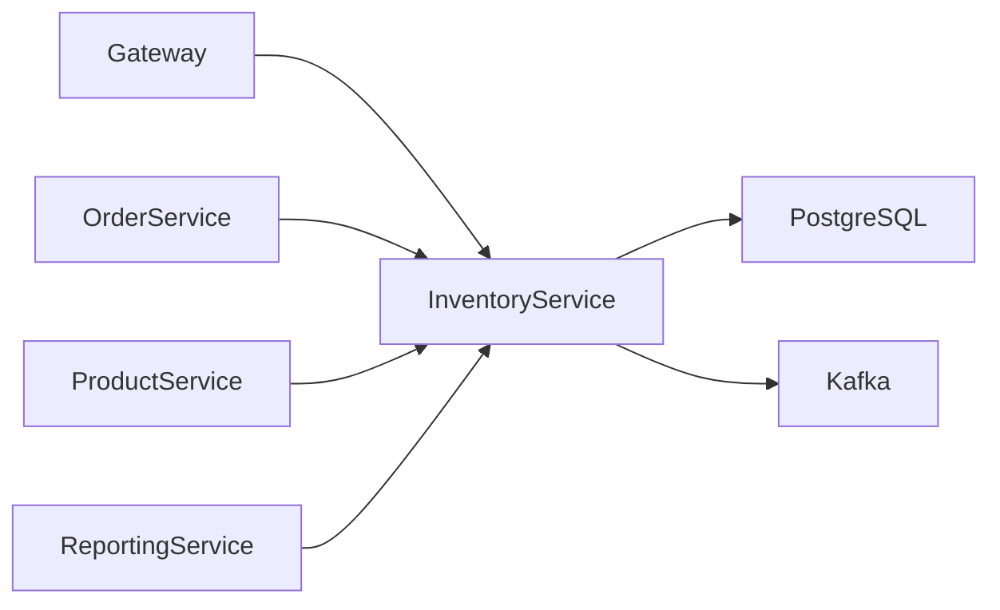
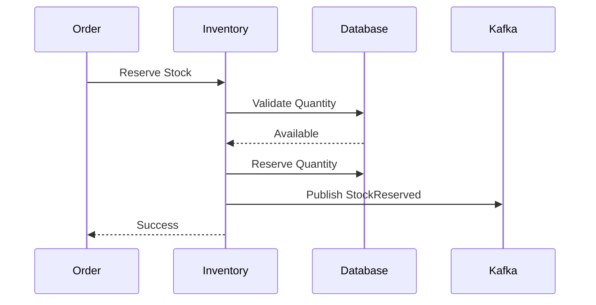
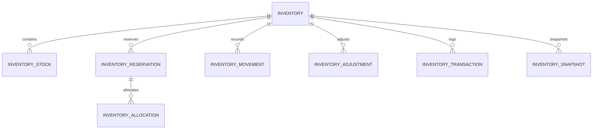
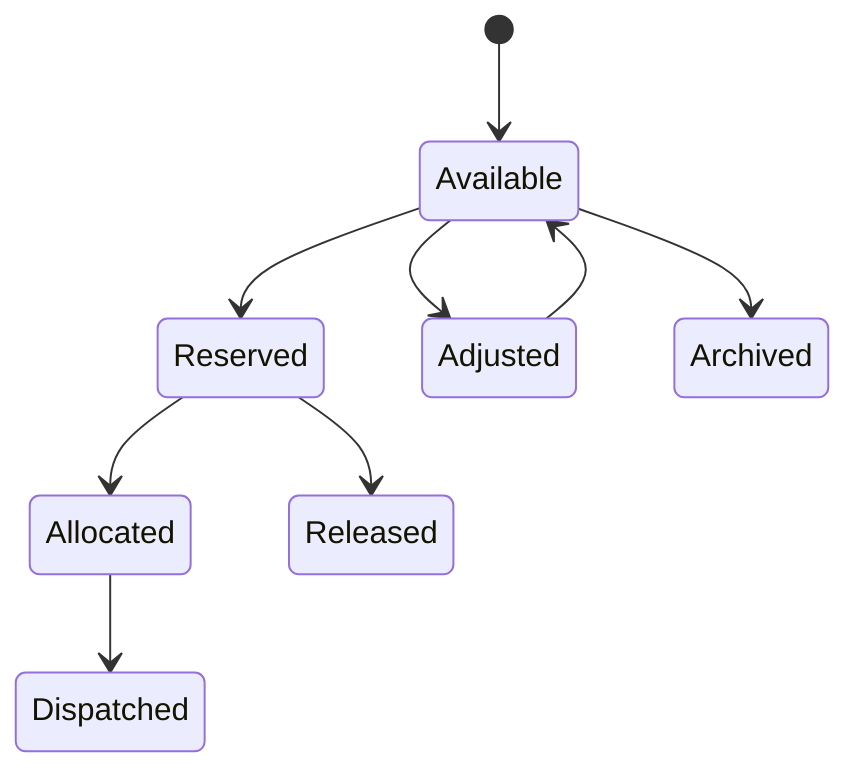
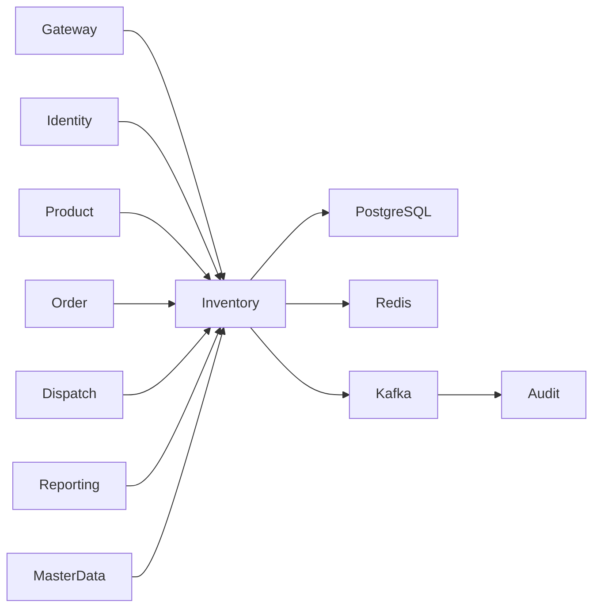

# SRS-006: Inventory Service Software Requirements Specification

---

# 1. Document Information

| Field          | Value                                                 |
| -------------- | ----------------------------------------------------- |
| Project Name   | Distributed Hub and Sales (DHS) Platform              |
| Service Name   | Inventory Service                                     |
| Document Title | Inventory Service Software Requirements Specification |
| Document ID    | SRS-006                                               |
| Repository     | starone-dhs-platform                                  |
| Module         | inventory-service                                     |
| Document Type  | Software Requirements Specification (SRS)             |
| Standard       | ISO/IEC/IEEE 29148                                    |
| Version        | v1.0.0                                                |
| Status         | Draft                                                 |
| Author         | Sachin Salunke                                        |
| Owner          | Enterprise Architecture                               |
| Last Updated   | 2026-06-27                                            |

---

# 2. Document Control

## 2.1 References

| Document      | Description                       |
| ------------- | --------------------------------- |
| BRD-001       | Business Requirements Document    |
| PRD-001       | Product Requirements Document     |
| ADR-001       | Architecture Decision Record      |
| HLD-001       | DHS High-Level Design             |
| FRD-Inventory | Inventory Functional Requirements |
| SRS-001       | Platform Foundation               |
| SRS-005       | Product Service                   |

---

## 2.2 Revision History

| Version | Date       | Description     |
| ------- | ---------- | --------------- |
| v1.0.0  | 2026-06-27 | Initial Version |

---

## 2.3 Approval Matrix

| Role                 | Status  |
| -------------------- | ------- |
| Product Owner        | Pending |
| Enterprise Architect | Pending |
| Platform Lead        | Pending |
| QA Lead              | Pending |

---

# 3. Introduction

## 3.1 Purpose

The Inventory Service shall maintain inventory availability for products across organizational storage locations.

The service shall own stock balances, reservations, inventory movements, adjustments and inventory transactions.

It shall act as the authoritative source for inventory quantities throughout the DHS Platform.

---

## 3.2 Scope

The Inventory Service includes:

- Inventory Management
- Stock Availability
- Inventory Reservation
- Inventory Release
- Inventory Adjustment
- Inventory Transactions
- Inventory Movement
- Inventory Search
- Inventory Audit Events

---

## 3.3 Out of Scope

The Inventory Service shall not provide:

- Product Management
- Warehouse Master Management
- Branch Management
- Customer Management
- Order Processing
- Billing
- Dispatch
- Authentication

---

## 3.4 Definitions

| Term        | Description                     |
| ----------- | ------------------------------- |
| Inventory   | Available quantity of a product |
| Reservation | Quantity reserved for an order  |
| Movement    | Stock movement transaction      |
| Adjustment  | Manual stock correction         |

---

## 3.5 Assumptions

- Every inventory record references one Product.
- Every inventory record references one Warehouse.
- Stock quantities shall never become negative.
- Inventory changes shall be event driven.

---

## 3.6 Constraints

- Product master data is owned by Product Service.
- Warehouse master data is owned by Master Data Service.
- Inventory quantities shall remain transactionally consistent.
- Inventory deletion shall use soft delete.

---

# 4. Service Overview

## 4.1 Responsibilities

The Inventory Service shall provide:

- Stock Management
- Stock Reservation
- Reservation Release
- Inventory Adjustments
- Inventory Movements
- Stock Availability
- Inventory Search
- Event Publishing

---

## 4.2 Service Context



---

## 4.3 Dependencies

| Dependency          | Purpose              |
| ------------------- | -------------------- |
| Platform Foundation | Shared Frameworks    |
| Gateway             | API Routing          |
| Eureka              | Service Discovery    |
| PostgreSQL          | Inventory Database   |
| Kafka               | Event Streaming      |
| Product Service     | Product Validation   |
| Master Data Service | Warehouse Validation |

---

## 4.4 Upstream Services

| Service          | Purpose                    |
| ---------------- | -------------------------- |
| Gateway          | Request Routing            |
| Identity Service | Authentication             |
| Order Service    | Stock Reservation Requests |

---

## 4.5 Downstream Services

| Service           | Purpose              |
| ----------------- | -------------------- |
| Billing Service   | Stock Confirmation   |
| Dispatch Service  | Shipment Preparation |
| Reporting Service | Inventory Analytics  |

---

# 5. Business Process

## 5.1 Inventory Lifecycle


---

## 5.2 Stock Reservation Workflow



---

# 6. Functional Requirements

## Inventory Management

### IN-SYS-001

The Inventory Service shall maintain inventory balances.

---

### IN-SYS-002

The Inventory Service shall maintain available quantity.

---

### IN-SYS-003

The Inventory Service shall maintain reserved quantity.

---

### IN-SYS-004

The Inventory Service shall calculate available stock.

---

### IN-SYS-005

The Inventory Service shall reserve stock.

---

### IN-SYS-006

The Inventory Service shall release reservations.

---

### IN-SYS-007

The Inventory Service shall allocate stock.

---

### IN-SYS-008

The Inventory Service shall perform inventory adjustments.

---

### IN-SYS-009

The Inventory Service shall maintain inventory movement history.

---

### IN-SYS-010

The Inventory Service shall expose inventory search APIs.

---

### IN-SYS-011

The Inventory Service shall publish inventory lifecycle events.

---

### IN-SYS-012

The Inventory Service shall prevent negative inventory balances.

---

### IN-SYS-013

The Inventory Service shall support inventory reconciliation.

---

### IN-SYS-014

The Inventory Service shall maintain inventory transaction history.

---

### IN-SYS-015

The Inventory Service shall expose REST APIs for authorized platform services.

---

# 7. Aggregate Root

The Inventory domain shall follow Domain-Driven Design.

```text
Inventory (Aggregate Root)
│
├── InventoryStock
├── InventoryReservation
├── InventoryMovement
├── InventoryAdjustment
├── InventoryTransaction
└── InventorySnapshot
```

Only the Inventory aggregate shall control modifications to its child entities.

---

# 8. Business Rules

The Inventory Service shall enforce the following business rules to ensure inventory accuracy, consistency, and transactional integrity.

---

## 8.1 Inventory Rules

### IN-BR-001

Every inventory record shall reference exactly one Product.

---

### IN-BR-002

Every inventory record shall reference exactly one Warehouse.

---

### IN-BR-003

A Product may exist in multiple Warehouses.

---

### IN-BR-004

Inventory Quantity shall never become negative.

---

### IN-BR-005

Reserved Quantity shall never exceed Available Quantity.

---

### IN-BR-006

Available Quantity shall be calculated as:

```text
Available = On Hand - Reserved
```

---

### IN-BR-007

Inventory balances shall always remain transactionally consistent.

---

## 8.2 Reservation Rules

### IN-BR-008

Inventory reservations shall only be created by authorized business operations.

---

### IN-BR-009

Reservations shall expire if the associated business transaction is cancelled or times out.

---

### IN-BR-010

Released reservations shall immediately restore available inventory.

---

### IN-BR-011

Inventory reservations shall be idempotent.

---

## 8.3 Inventory Adjustment Rules

### IN-BR-012

Inventory adjustments shall require an adjustment reason.

---

### IN-BR-013

Every adjustment shall generate an audit record.

---

### IN-BR-014

Inventory adjustments shall update inventory balances immediately.

---

## 8.4 Inventory Movement Rules

### IN-BR-015

Every inventory movement shall have a source transaction.

---

### IN-BR-016

Inventory movements shall be immutable.

---

### IN-BR-017

Inventory movement history shall never be physically deleted.

---

## 8.5 Inventory Status Rules

### IN-BR-018

Inventory shall support:

- Available
- Reserved
- Allocated
- Damaged
- Returned
- Archived

---

### IN-BR-019

Archived inventory shall not participate in operational transactions.

---

### IN-BR-020

Damaged inventory shall not be reserved.

---

# 9. REST API Specification

Base URL

```text
/api/v1/inventory
```

All APIs shall be exposed through the DHS API Gateway.

---

# 9.1 API Overview

| Method | URI                       | Description                |
| ------ | ------------------------- | -------------------------- |
| POST   | /                         | Create Inventory           |
| PUT    | /{inventoryId}            | Update Inventory           |
| GET    | /{inventoryId}            | Get Inventory              |
| GET    | /product/{productId}      | Product Inventory          |
| GET    | /availability/{productId} | Check Availability         |
| POST   | /reserve                  | Reserve Inventory          |
| POST   | /release                  | Release Reservation        |
| POST   | /allocate                 | Allocate Inventory         |
| POST   | /adjust                   | Inventory Adjustment       |
| GET    | /movements                | Inventory Movement History |
| GET    | /                         | Search Inventory           |

---

# 9.2 Request Headers

| Header           | Required | Description            |
| ---------------- | -------- | ---------------------- |
| Authorization    | Yes      | JWT Bearer Token       |
| X-Correlation-ID | Yes      | Correlation Identifier |
| Content-Type     | Yes      | application/json       |
| Accept           | Yes      | application/json       |

---

# 9.3 Query Parameters

| Parameter   | Required | Description          |
| ----------- | -------- | -------------------- |
| page        | No       | Page Number          |
| size        | No       | Page Size            |
| sort        | No       | Sort Field           |
| direction   | No       | ASC or DESC          |
| productId   | No       | Product Identifier   |
| warehouseId | No       | Warehouse Identifier |
| status      | No       | Inventory Status     |

---

# 9.4 Path Parameters

| Parameter   | Description          |
| ----------- | -------------------- |
| inventoryId | Inventory Identifier |
| productId   | Product Identifier   |

---

# 9.5 Create Inventory API

```http
POST /api/v1/inventory
```

Request

```json
{
  "productId": "UUID",
  "warehouseId": "UUID",
  "onHandQuantity": 100,
  "reorderLevel": 20,
  "maximumLevel": 500
}
```

Response

```json
{
  "inventoryId": "UUID",
  "availableQuantity": 100,
  "status": "AVAILABLE"
}
```

---

# 9.6 Reserve Inventory API

```http
POST /api/v1/inventory/reserve
```

Request

```json
{
  "orderId": "UUID",
  "productId": "UUID",
  "warehouseId": "UUID",
  "quantity": 5
}
```

Response

```json
{
  "reservationId": "UUID",
  "status": "RESERVED"
}
```

---

# 9.7 Release Reservation API

```http
POST /api/v1/inventory/release
```

Releases previously reserved inventory.

---

# 9.8 Allocate Inventory API

```http
POST /api/v1/inventory/allocate
```

Allocates reserved inventory for dispatch.

---

# 9.9 Inventory Adjustment API

```http
POST /api/v1/inventory/adjust
```

Adjusts inventory after physical verification.

---

# 9.10 Inventory Search API

```http
GET /api/v1/inventory
```

Supports:

- Pagination
- Sorting
- Filtering
- Warehouse
- Product
- Status

---

# 10. Request Models

## CreateInventoryRequest

| Field          | Type    | Required |
| -------------- | ------- | -------- |
| productId      | UUID    | Yes      |
| warehouseId    | UUID    | Yes      |
| onHandQuantity | Decimal | Yes      |
| reorderLevel   | Decimal | Yes      |
| maximumLevel   | Decimal | Yes      |

---

## ReserveInventoryRequest

| Field       | Type    | Required |
| ----------- | ------- | -------- |
| orderId     | UUID    | Yes      |
| productId   | UUID    | Yes      |
| warehouseId | UUID    | Yes      |
| quantity    | Decimal | Yes      |

---

## ReleaseReservationRequest

| Field         | Type   | Required |
| ------------- | ------ | -------- |
| reservationId | UUID   | Yes      |
| reason        | String | Yes      |

---

## InventoryAdjustmentRequest

| Field              | Type           | Required |
| ------------------ | -------------- | -------- |
| inventoryId        | UUID           | Yes      |
| adjustmentQuantity | Decimal        | Yes      |
| adjustmentType     | AdjustmentType | Yes      |
| reason             | String         | Yes      |

---

# 11. Response Models

## InventoryResponse

| Field             | Type            |
| ----------------- | --------------- |
| inventoryId       | UUID            |
| productId         | UUID            |
| warehouseId       | UUID            |
| onHandQuantity    | Decimal         |
| reservedQuantity  | Decimal         |
| availableQuantity | Decimal         |
| status            | InventoryStatus |

---

## InventoryAvailabilityResponse

| Field             | Type    |
| ----------------- | ------- |
| productId         | UUID    |
| warehouseId       | UUID    |
| availableQuantity | Decimal |
| reservable        | Boolean |

---

## InventoryMovementResponse

| Field           | Type         |
| --------------- | ------------ |
| movementId      | UUID         |
| movementType    | MovementType |
| quantity        | Decimal      |
| transactionDate | Timestamp    |

---

# 12. Validation Rules

## Inventory Creation

- Product shall exist.
- Warehouse shall exist.
- On Hand Quantity shall be zero or greater.
- Reorder Level shall be zero or greater.
- Maximum Level shall be greater than Reorder Level.

---

## Reservation Validation

- Product shall exist.
- Available Quantity shall be sufficient.
- Requested Quantity shall be greater than zero.
- Warehouse shall exist.

---

## Allocation Validation

- Reservation shall exist.
- Reservation shall be active.
- Reserved Quantity shall be sufficient.

---

## Adjustment Validation

- Adjustment Reason is mandatory.
- Adjustment Quantity shall not be zero.
- Inventory shall exist.

---

# 13. Permission Matrix

| API                  | Super Admin | Inventory Manager | Inventory Executive | Viewer |
| -------------------- | ----------- | ----------------- | ------------------- | ------ |
| Create Inventory     | ✅          | ✅                | ❌                  | ❌     |
| Update Inventory     | ✅          | ✅                | ❌                  | ❌     |
| Reserve Inventory    | ✅          | ✅                | ✅                  | ❌     |
| Release Reservation  | ✅          | ✅                | ✅                  | ❌     |
| Allocate Inventory   | ✅          | ✅                | ✅                  | ❌     |
| Inventory Adjustment | ✅          | ✅                | ❌                  | ❌     |
| View Inventory       | ✅          | ✅                | ✅                  | ✅     |
| Search Inventory     | ✅          | ✅                | ✅                  | ✅     |

---

# 14. Standard HTTP Status Codes

| Status | Description             |
| ------ | ----------------------- |
| 200    | Success                 |
| 201    | Created                 |
| 204    | Updated                 |
| 400    | Validation Error        |
| 401    | Unauthorized            |
| 403    | Forbidden               |
| 404    | Inventory Not Found     |
| 409    | Inventory Conflict      |
| 422    | Business Rule Violation |
| 500    | Internal Server Error   |

---

# 15. Aggregate Model

The Inventory Service shall implement the Inventory domain using Domain-Driven Design (DDD).

The **Inventory** entity shall be the Aggregate Root and shall exclusively control the lifecycle of all subordinate entities.

No child entity shall be modified independently of the Inventory Aggregate.

---

## 15.1 Inventory Aggregate

```text
Inventory
│
├── InventoryStock
├── InventoryReservation
├── InventoryAllocation
├── InventoryMovement
├── InventoryAdjustment
├── InventoryTransaction
└── InventorySnapshot
```

---

## Aggregate Responsibilities

| Aggregate            | Responsibility                |
| -------------------- | ----------------------------- |
| Inventory            | Inventory Aggregate Root      |
| InventoryStock       | Current Stock Balance         |
| InventoryReservation | Reserved Stock                |
| InventoryAllocation  | Allocated Inventory           |
| InventoryMovement    | Stock Movement History        |
| InventoryAdjustment  | Stock Corrections             |
| InventoryTransaction | Inventory Transactions        |
| InventorySnapshot    | Historical Inventory Snapshot |

---

# 16. Entity Model

## 16.1 Entity Overview

| Entity               | Description          |
| -------------------- | -------------------- |
| Inventory            | Aggregate Root       |
| InventoryStock       | Current Stock        |
| InventoryReservation | Reserved Inventory   |
| InventoryAllocation  | Allocated Inventory  |
| InventoryMovement    | Movement History     |
| InventoryAdjustment  | Manual Adjustments   |
| InventoryTransaction | Inventory Ledger     |
| InventorySnapshot    | Historical Inventory |

---

## 16.2 Inventory Entity

| Attribute         | Type          | Constraint    |
| ----------------- | ------------- | ------------- |
| id                | UUID          | Primary Key   |
| productId         | UUID          | Required      |
| warehouseId       | UUID          | Required      |
| onHandQuantity    | DECIMAL(18,3) | Required      |
| reservedQuantity  | DECIMAL(18,3) | Required      |
| availableQuantity | DECIMAL(18,3) | Calculated    |
| allocatedQuantity | DECIMAL(18,3) | Required      |
| reorderLevel      | DECIMAL(18,3) | Required      |
| maximumLevel      | DECIMAL(18,3) | Required      |
| status            | ENUM          | Required      |
| createdBy         | UUID          | Required      |
| createdAt         | TIMESTAMP     | Required      |
| updatedBy         | UUID          | Required      |
| updatedAt         | TIMESTAMP     | Required      |
| deleted           | BOOLEAN       | Default FALSE |

---

## 16.3 Inventory Stock

| Attribute         | Type          |
| ----------------- | ------------- |
| id                | UUID          |
| inventoryId       | UUID          |
| batchNumber       | VARCHAR(100)  |
| lotNumber         | VARCHAR(100)  |
| serialNumber      | VARCHAR(100)  |
| manufacturingDate | DATE          |
| expiryDate        | DATE          |
| quantity          | DECIMAL(18,3) |

---

## 16.4 Inventory Reservation

| Attribute        | Type          |
| ---------------- | ------------- |
| id               | UUID          |
| inventoryId      | UUID          |
| orderId          | UUID          |
| reservedQuantity | DECIMAL(18,3) |
| reservationDate  | TIMESTAMP     |
| expiryDate       | TIMESTAMP     |
| status           | ENUM          |

---

## 16.5 Inventory Allocation

| Attribute         | Type          |
| ----------------- | ------------- |
| id                | UUID          |
| reservationId     | UUID          |
| allocatedQuantity | DECIMAL(18,3) |
| allocationDate    | TIMESTAMP     |
| status            | ENUM          |

---

## 16.6 Inventory Movement

| Attribute     | Type          |
| ------------- | ------------- |
| id            | UUID          |
| inventoryId   | UUID          |
| movementType  | ENUM          |
| quantity      | DECIMAL(18,3) |
| referenceType | VARCHAR(50)   |
| referenceId   | UUID          |
| movementDate  | TIMESTAMP     |

---

## 16.7 Inventory Adjustment

| Attribute          | Type          |
| ------------------ | ------------- |
| id                 | UUID          |
| inventoryId        | UUID          |
| adjustmentType     | ENUM          |
| adjustmentQuantity | DECIMAL(18,3) |
| reason             | VARCHAR(255)  |
| adjustedBy         | UUID          |
| adjustmentDate     | TIMESTAMP     |

---

## 16.8 Inventory Transaction

| Attribute               | Type          |
| ----------------------- | ------------- |
| id                      | UUID          |
| inventoryId             | UUID          |
| transactionType         | ENUM          |
| quantity                | DECIMAL(18,3) |
| balanceAfterTransaction | DECIMAL(18,3) |
| transactionDate         | TIMESTAMP     |

---

## 16.9 Inventory Snapshot

| Attribute         | Type          |
| ----------------- | ------------- |
| id                | UUID          |
| inventoryId       | UUID          |
| snapshotDate      | DATE          |
| onHandQuantity    | DECIMAL(18,3) |
| reservedQuantity  | DECIMAL(18,3) |
| availableQuantity | DECIMAL(18,3) |

---

# 17. Database Design

Database

```text
inventory_db
```

Schema

```text
inventory
```

---

## 17.1 Tables

| Table                 | Purpose                  |
| --------------------- | ------------------------ |
| inventory             | Inventory Master         |
| inventory_stock       | Stock Details            |
| inventory_reservation | Stock Reservations       |
| inventory_allocation  | Stock Allocations        |
| inventory_movement    | Stock Movement History   |
| inventory_adjustment  | Inventory Adjustments    |
| inventory_transaction | Inventory Ledger         |
| inventory_snapshot    | Daily Inventory Snapshot |

---

## 17.2 Primary Keys

All tables shall use UUID as the Primary Key.

---

## 17.3 Foreign Keys

| Child Table           | Parent Table          |
| --------------------- | --------------------- |
| inventory_stock       | inventory             |
| inventory_reservation | inventory             |
| inventory_allocation  | inventory_reservation |
| inventory_movement    | inventory             |
| inventory_adjustment  | inventory             |
| inventory_transaction | inventory             |
| inventory_snapshot    | inventory             |

---

## 17.4 Constraints

Inventory

- Product + Warehouse shall be unique.
- Available Quantity shall never be negative.
- Reserved Quantity shall never exceed On Hand Quantity.

Inventory Reservation

- Reservation Quantity shall be greater than zero.

Inventory Allocation

- Allocation Quantity shall not exceed Reserved Quantity.

Inventory Transaction

- Transactions shall be immutable.

---

## 17.5 Indexes

| Table                 | Index            |
| --------------------- | ---------------- |
| inventory             | product_id       |
| inventory             | warehouse_id     |
| inventory             | status           |
| inventory_stock       | batch_number     |
| inventory_stock       | expiry_date      |
| inventory_reservation | order_id         |
| inventory_movement    | movement_date    |
| inventory_transaction | transaction_date |

---

# 18. Entity Relationship Diagram



---

# 19. Inventory State Diagram



---

# 20. Security Requirements

The Inventory Service shall rely on the Identity Service for authentication and authorization.

---

## Authentication

### IN-SEC-001

Every request shall contain a valid JWT Access Token.

---

### IN-SEC-002

Authentication shall be delegated to the Identity Service.

---

### IN-SEC-003

Unauthenticated requests shall return HTTP 401.

---

## Authorization

### IN-SEC-004

Inventory APIs shall enforce Role-Based Access Control.

---

### IN-SEC-005

Permissions shall be validated before inventory operations.

---

### IN-SEC-006

Unauthorized requests shall return HTTP 403.

---

## Data Security

### IN-SEC-007

All communication shall use TLS 1.3.

---

### IN-SEC-008

Inventory transactions shall be immutable.

---

### IN-SEC-009

Inventory audit history shall never be modified.

---

# 21. Event Specification

The Inventory Service shall publish domain events whenever inventory changes occur.

---

## 21.1 Published Events

| Topic                  | Event              | Key            | Version |
| ---------------------- | ------------------ | -------------- | ------- |
| inventory.created.v1   | InventoryCreated   | Inventory ID   | v1      |
| inventory.updated.v1   | InventoryUpdated   | Inventory ID   | v1      |
| inventory.reserved.v1  | InventoryReserved  | Reservation ID | v1      |
| inventory.released.v1  | InventoryReleased  | Reservation ID | v1      |
| inventory.allocated.v1 | InventoryAllocated | Allocation ID  | v1      |
| inventory.adjusted.v1  | InventoryAdjusted  | Inventory ID   | v1      |
| inventory.low-stock.v1 | InventoryLowStock  | Inventory ID   | v1      |

---

## 21.2 Consumed Events

| Topic                | Source              |
| -------------------- | ------------------- |
| product.updated.v1   | Product Service     |
| warehouse.updated.v1 | Master Data Service |
| order.cancelled.v1   | Order Service       |

---

## 21.3 Standard Event Structure

```json
{
  "eventId": "UUID",
  "eventType": "InventoryReserved",
  "eventVersion": "1.0",
  "occurredAt": "2026-06-27T10:30:00Z",
  "correlationId": "UUID",
  "payload": {}
}
```

---

# 22. External Interfaces

| Interface     | Purpose            |
| ------------- | ------------------ |
| API Gateway   | Request Routing    |
| Kafka         | Event Streaming    |
| PostgreSQL    | Persistent Storage |
| Redis         | Inventory Cache    |
| Audit Service | Audit Events       |

---

# 23. OpenFeign Clients

| Client           | Purpose                                                               |
| ---------------- | --------------------------------------------------------------------- |
| ProductClient    | Validate Product                                                      |
| MasterDataClient | Validate Warehouse                                                    |
| OrderClient      | Validate Reservation Requests (if synchronous validation is required) |

> **Implementation Note:** Inventory updates should primarily be driven by domain events. Use synchronous OpenFeign calls only where immediate validation is required.

---

# 24. Configuration

Configuration shall be externalized using the centralized configuration repository.

---

## Configuration Categories

- Server
- Database
- Kafka
- Redis
- Security
- Logging
- OpenFeign
- Inventory
- Observability

---

## Configuration Properties

| Property                       | Default               | Required | Description                |
| ------------------------------ | --------------------- | -------- | -------------------------- |
| inventory.search.max-page-size | 100                   | Yes      | Maximum page size          |
| inventory.cache.enabled        | true                  | Yes      | Enable inventory cache     |
| inventory.cache.ttl            | 3600                  | Yes      | Cache expiration (seconds) |
| inventory.low-stock.threshold  | 10                    | Yes      | Low stock alert threshold  |
| inventory.snapshot.schedule    | 0 0 \* \* \*          | Yes      | Daily snapshot schedule    |
| inventory.event.topic.reserved | inventory.reserved.v1 | Yes      | Reservation topic          |
| inventory.event.topic.adjusted | inventory.adjusted.v1 | Yes      | Adjustment topic           |

---

# 25. Service Context Diagram



---

# 26. Error Handling

The Inventory Service shall provide standardized error handling for all inventory operations.

All error responses shall comply with the Platform Foundation error model defined in **SRS-001 – Platform Foundation**.

---

## 26.1 Functional Requirements

### IN-SYS-016

The Inventory Service shall return standardized error responses.

---

### IN-SYS-017

Business exceptions shall be distinguishable from technical exceptions.

---

### IN-SYS-018

Every error response shall include a Correlation ID.

---

### IN-SYS-019

Unhandled exceptions shall return HTTP 500.

---

### IN-SYS-020

Internal implementation details shall never be exposed to API consumers.

---

## 26.2 Standard Error Response

```json
{
  "timestamp": "2026-06-27T10:30:00Z",
  "status": 409,
  "error": "Inventory Reservation Failed",
  "code": "IN-BUS-001",
  "message": "Requested quantity exceeds available inventory.",
  "correlationId": "UUID",
  "path": "/api/v1/inventory/reserve"
}
```

---

## 26.3 Business Error Catalog

| Error Code  | Description                    | HTTP Status |
| ----------- | ------------------------------ | ----------- |
| IN-VAL-001  | Validation Failed              | 400         |
| IN-AUTH-001 | Authentication Required        | 401         |
| IN-AUTH-002 | Access Denied                  | 403         |
| IN-BUS-001  | Insufficient Inventory         | 409         |
| IN-BUS-002  | Inventory Not Found            | 404         |
| IN-BUS-003  | Reservation Not Found          | 404         |
| IN-BUS-004  | Reservation Already Released   | 409         |
| IN-BUS-005  | Allocation Failed              | 409         |
| IN-BUS-006  | Negative Inventory Not Allowed | 422         |
| IN-BUS-007  | Invalid Warehouse              | 422         |
| IN-BUS-008  | Invalid Product                | 422         |
| IN-BUS-009  | Inventory Already Archived     | 409         |
| IN-SYS-001  | Internal Server Error          | 500         |

---

# 27. Logging Requirements

The Inventory Service shall use the Platform Foundation logging framework.

---

## 27.1 Functional Requirements

### IN-SYS-021

Inventory creation shall generate audit logs.

---

### IN-SYS-022

Inventory reservations shall generate audit logs.

---

### IN-SYS-023

Inventory allocations shall generate audit logs.

---

### IN-SYS-024

Inventory adjustments shall generate audit logs.

---

### IN-SYS-025

Inventory movement events shall be logged.

---

### IN-SYS-026

Business and system exceptions shall be logged.

---

## 27.2 Log Attributes

Every log entry shall include:

- Timestamp
- Service Name
- Correlation ID
- Trace ID
- Span ID
- User ID
- Product ID
- Warehouse ID
- Inventory ID
- HTTP Method
- Request URI
- HTTP Status
- Processing Time

---

## 27.3 Sensitive Information

The following information shall never be logged:

- JWT Tokens
- Authorization Headers
- Database Credentials
- Encryption Keys
- Internal Stack Traces

---

# 28. Observability Requirements

The Inventory Service shall expose operational metrics through the Platform Foundation.

---

## 28.1 Functional Requirements

### IN-SYS-027

The Inventory Service shall expose Health endpoints.

---

### IN-SYS-028

The Inventory Service shall expose Metrics endpoints.

---

### IN-SYS-029

The Inventory Service shall support Distributed Tracing.

---

### IN-SYS-030

Every request shall propagate Correlation IDs.

---

### IN-SYS-031

Inventory business metrics shall be published.

---

## 28.2 Business Metrics

The Inventory Service shall publish metrics including:

- Total Inventory Records
- Available Inventory
- Reserved Inventory
- Allocated Inventory
- Inventory Adjustments
- Inventory Reservations
- Inventory Releases
- Low Stock Alerts
- Inventory API Response Time
- Inventory Validation Failures

---

# 29. Non-Functional Requirements

## 29.1 Performance

### IN-NFR-001

Inventory retrieval shall complete within 200 milliseconds under normal operating conditions.

---

### IN-NFR-002

Inventory reservation shall complete within 300 milliseconds.

---

### IN-NFR-003

Inventory search shall support pagination, filtering and sorting within 500 milliseconds.

---

## 29.2 Availability

### IN-NFR-004

The Inventory Service shall maintain at least 99.9% availability.

---

### IN-NFR-005

The service shall support horizontal scaling.

---

## 29.3 Reliability

### IN-NFR-006

Inventory balances shall remain transactionally consistent.

---

### IN-NFR-007

Inventory events shall guarantee at-least-once delivery.

---

### IN-NFR-008

Inventory operations shall be idempotent where applicable.

---

## 29.4 Scalability

### IN-NFR-009

The service shall support concurrent inventory updates.

---

### IN-NFR-010

The service shall support high-volume reservation requests.

---

## 29.5 Security

### IN-NFR-011

All communication shall use TLS 1.3.

---

### IN-NFR-012

Every protected API shall enforce Role-Based Access Control.

---

### IN-NFR-013

Inventory transactions shall be immutable.

---

## 29.6 Maintainability

### IN-NFR-014

The Inventory Service shall use Platform Foundation shared libraries.

---

### IN-NFR-015

The Inventory Service shall comply with enterprise coding standards.

---

# 30. Requirement Traceability Matrix

| Requirement             | Source Document | Source Requirement                | Verification                   |
| ----------------------- | --------------- | --------------------------------- | ------------------------------ |
| IN-SYS-001 – IN-SYS-015 | FRD-Inventory   | Inventory Functional Requirements | Functional Testing             |
| IN-SYS-016 – IN-SYS-031 | SRS-001         | Platform Runtime Requirements     | Integration Testing            |
| IN-NFR-001 – IN-NFR-015 | PRD / HLD       | Quality Attributes                | Performance & Security Testing |

---

# 31. Testability Matrix

| Requirement | Test Case |
| ----------- | --------- |
| IN-SYS-001  | TC-IN-001 |
| IN-SYS-002  | TC-IN-002 |
| IN-SYS-003  | TC-IN-003 |
| IN-SYS-004  | TC-IN-004 |
| IN-SYS-005  | TC-IN-005 |
| IN-SYS-006  | TC-IN-006 |
| IN-SYS-007  | TC-IN-007 |
| IN-SYS-008  | TC-IN-008 |
| IN-SYS-009  | TC-IN-009 |
| IN-SYS-010  | TC-IN-010 |
| IN-SYS-011  | TC-IN-011 |
| IN-SYS-012  | TC-IN-012 |
| IN-SYS-013  | TC-IN-013 |
| IN-SYS-014  | TC-IN-014 |
| IN-SYS-015  | TC-IN-015 |

---

# 32. Acceptance Criteria

The Inventory Service shall be considered complete when:

- Inventory CRUD operations function successfully.
- Inventory balances remain accurate and consistent.
- Stock reservations and releases function correctly.
- Inventory allocation supports order fulfillment.
- Inventory adjustments are fully auditable.
- Inventory movement history is immutable.
- Inventory events are published successfully.
- Standardized error responses are returned.
- Logging and metrics are operational.
- Health endpoints are operational.
- Performance objectives are achieved.
- Security requirements are satisfied.
- Functional, integration and non-functional tests pass.

---

# 33. Appendices

## Appendix A – API Summary

| Resource    | Endpoints                   |
| ----------- | --------------------------- |
| Inventory   | Create, Update, Get, Search |
| Reservation | Reserve, Release            |
| Allocation  | Allocate                    |
| Adjustment  | Adjust Inventory            |
| Movement    | Inventory History           |

---

## Appendix B – Aggregate Summary

| Aggregate            | Description         |
| -------------------- | ------------------- |
| Inventory            | Aggregate Root      |
| InventoryStock       | Current Stock       |
| InventoryReservation | Reserved Stock      |
| InventoryAllocation  | Allocated Stock     |
| InventoryMovement    | Stock Movements     |
| InventoryAdjustment  | Stock Adjustments   |
| InventoryTransaction | Inventory Ledger    |
| InventorySnapshot    | Historical Snapshot |

---

## Appendix C – Service Dependencies

| Dependency          | Purpose                        |
| ------------------- | ------------------------------ |
| Platform Foundation | Shared Frameworks              |
| Gateway             | API Routing                    |
| Eureka              | Service Discovery              |
| PostgreSQL          | Persistent Storage             |
| Redis               | Inventory Cache                |
| Kafka               | Event Streaming                |
| Identity Service    | Authentication & Authorization |
| Product Service     | Product Validation             |
| Master Data Service | Warehouse Validation           |
| Order Service       | Inventory Reservation Requests |
| Audit Service       | Audit Processing               |

---

## Appendix D – Revision History

| Version | Description                                                   |
| ------- | ------------------------------------------------------------- |
| v1.0.0  | Initial Inventory Service Software Requirements Specification |

---

# 34. Document Sign-off

| Role                 | Status  |
| -------------------- | ------- |
| Product Owner        | Pending |
| Enterprise Architect | Pending |
| Platform Lead        | Pending |
| Security Lead        | Pending |
| QA Lead              | Pending |

---

# End of Document
