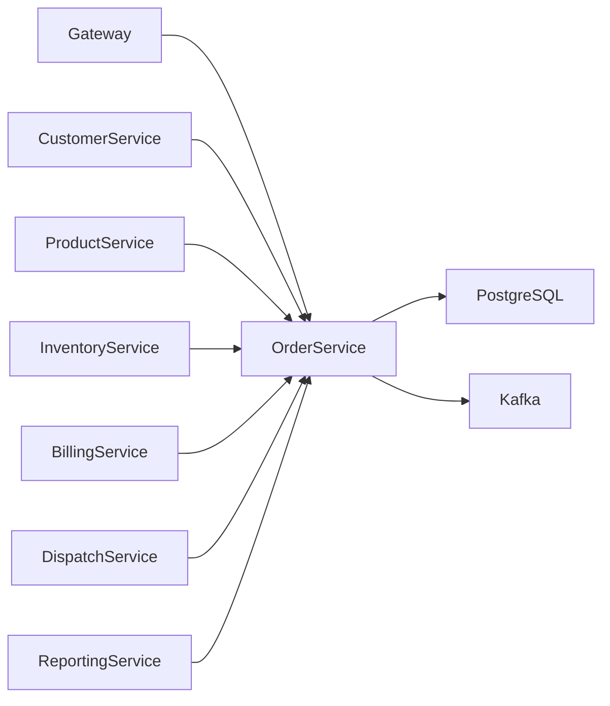
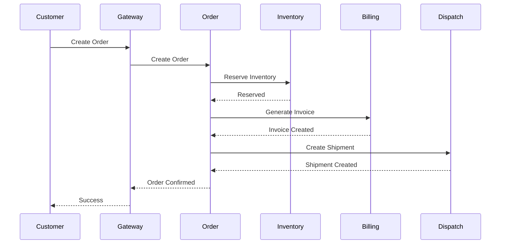
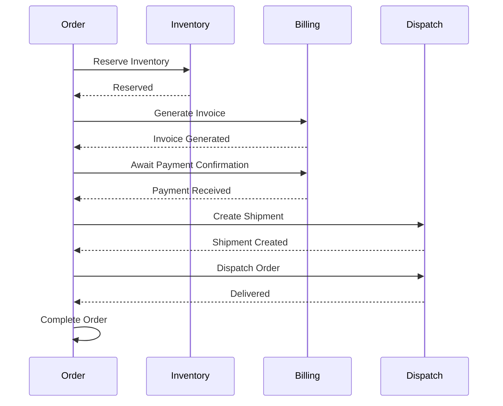
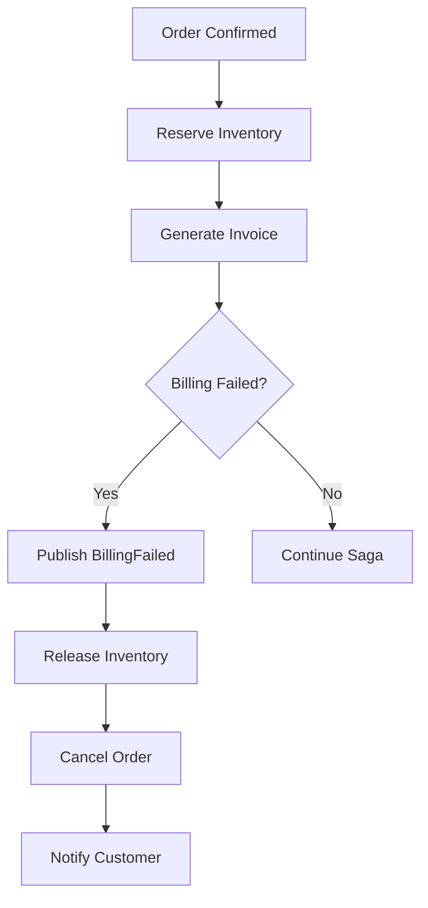
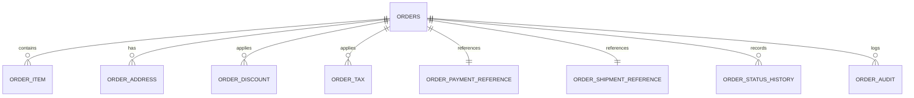
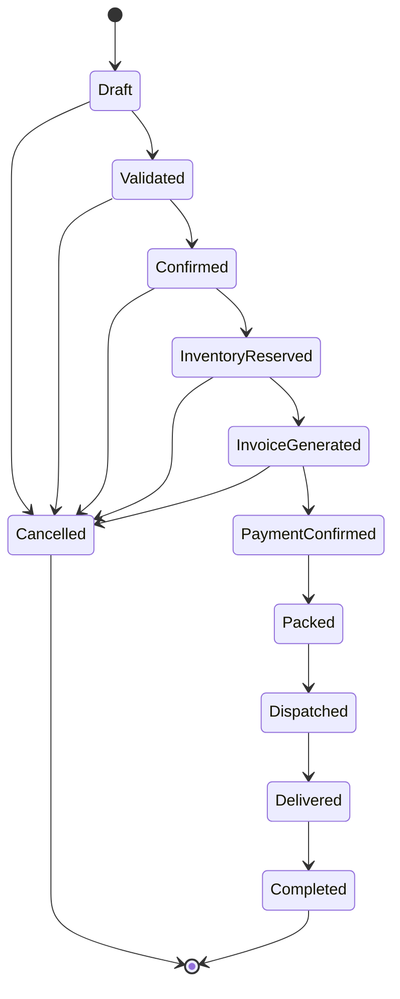
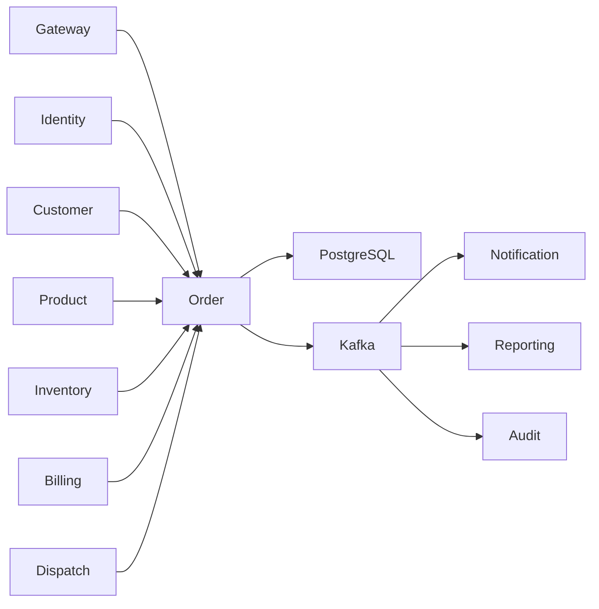

# SRS-007: Order Service Software Requirements Specification

---

# 1. Document Information

| Field          | Value                                             |
| -------------- | ------------------------------------------------- |
| Project Name   | Distributed Hub and Sales (DHS) Platform          |
| Service Name   | Order Service                                     |
| Document Title | Order Service Software Requirements Specification |
| Document ID    | SRS-007                                           |
| Repository     | starone-dhs-platform                              |
| Module         | order-service                                     |
| Document Type  | Software Requirements Specification (SRS)         |
| Standard       | ISO/IEC/IEEE 29148                                |
| Version        | v1.0.0                                            |
| Status         | Draft                                             |
| Author         | Sachin Salunke                                    |
| Owner          | Enterprise Architecture                           |
| Last Updated   | 2026-06-27                                        |

---

# 2. Document Control

## 2.1 References

| Document  | Description                    |
| --------- | ------------------------------ |
| BRD-001   | Business Requirements Document |
| PRD-001   | Product Requirements Document  |
| ADR-001   | Architecture Decision Record   |
| HLD-001   | DHS High-Level Design          |
| FRD-Order | Order Functional Requirements  |
| SRS-001   | Platform Foundation            |
| SRS-004   | Customer Service               |
| SRS-005   | Product Service                |
| SRS-006   | Inventory Service              |

---

## 2.2 Revision History

| Version | Date       | Description     |
| ------- | ---------- | --------------- |
| v1.0.0  | 2026-06-27 | Initial Version |

---

## 2.3 Approval Matrix

| Role                 | Status  |
| -------------------- | ------- |
| Product Owner        | Pending |
| Enterprise Architect | Pending |
| Platform Lead        | Pending |
| QA Lead              | Pending |

---

# 3. Introduction

## 3.1 Purpose

The Order Service shall manage the complete lifecycle of customer orders within the DHS Platform.

The service shall coordinate order creation, validation, inventory reservation, billing initiation, dispatch initiation and order completion using an event-driven Saga orchestration model.

The Order Service shall act as the authoritative source for order information.

---

## 3.2 Scope

The Order Service includes:

- Order Creation
- Order Validation
- Order Item Management
- Order Pricing
- Order Tax Calculation
- Order Discount Management
- Order Status Management
- Order Cancellation
- Order Search
- Order History
- Order Audit Events
- Saga Orchestration

---

## 3.3 Out of Scope

The Order Service shall not provide:

- Customer Management
- Product Management
- Inventory Ownership
- Payment Processing
- Invoice Generation
- Shipment Execution
- Notification Delivery
- Authentication

---

## 3.4 Definitions

| Term        | Description                        |
| ----------- | ---------------------------------- |
| Order       | Customer purchase request          |
| Order Item  | Individual product within an order |
| Saga        | Distributed transaction pattern    |
| Reservation | Reserved inventory for an order    |
| Fulfillment | End-to-end order execution         |

---

## 3.5 Assumptions

- Every order belongs to exactly one customer.
- Every order contains at least one order item.
- Products shall be validated before order confirmation.
- Inventory shall be reserved before billing.
- Billing shall occur before dispatch.
- Every order shall have a complete audit trail.

---

## 3.6 Constraints

- Order Number shall be immutable.
- Orders shall use soft deletion.
- Completed orders shall not be modified.
- Cancelled orders shall execute compensation workflows.
- Cross-service communication shall use REST only for synchronous validation and Kafka for business events.

---

# 4. Service Overview

## 4.1 Responsibilities

The Order Service shall provide:

- Order CRUD
- Order Item Management
- Order Validation
- Pricing Calculation
- Discount Calculation
- Tax Calculation
- Order Status Management
- Order Cancellation
- Saga Orchestration
- Order Event Publishing

---

## 4.2 Service Context



---

## 4.3 Dependencies

| Dependency          | Purpose               |
| ------------------- | --------------------- |
| Platform Foundation | Shared Frameworks     |
| Gateway             | API Routing           |
| Eureka              | Service Discovery     |
| PostgreSQL          | Order Database        |
| Kafka               | Event Streaming       |
| Customer Service    | Customer Validation   |
| Product Service     | Product Validation    |
| Inventory Service   | Inventory Reservation |
| Billing Service     | Billing Integration   |
| Dispatch Service    | Shipment Integration  |

---

## 4.4 Upstream Services

| Service          | Purpose             |
| ---------------- | ------------------- |
| Gateway          | Request Routing     |
| Identity Service | Authentication      |
| Customer Service | Customer Validation |
| Product Service  | Product Validation  |

---

## 4.5 Downstream Services

| Service              | Purpose                |
| -------------------- | ---------------------- |
| Inventory Service    | Reserve Inventory      |
| Billing Service      | Generate Invoice       |
| Dispatch Service     | Create Shipment        |
| Notification Service | Customer Notifications |
| Reporting Service    | Analytics              |

---

# 5. Business Process

## 5.1 Order Lifecycle


---

## 5.2 Order Processing Saga



---

## 5.3 Compensation Workflow

```mermaid
flowchart LR

Inventory Reservation

-->

Billing Failed

-->

Release Inventory

-->

Cancel Order

-->

Notify Customer
```

---

# 6. Functional Requirements

## Order Management

### OR-SYS-001

The Order Service shall create customer orders.

---

### OR-SYS-002

The Order Service shall update draft orders.

---

### OR-SYS-003

The Order Service shall retrieve order details.

---

### OR-SYS-004

The Order Service shall search orders.

---

### OR-SYS-005

The Order Service shall cancel orders.

---

### OR-SYS-006

The Order Service shall maintain order history.

---

## Order Item Management

### OR-SYS-007

The Order Service shall manage order items.

---

### OR-SYS-008

The Order Service shall validate product availability.

---

### OR-SYS-009

The Order Service shall calculate order totals.

---

### OR-SYS-010

The Order Service shall calculate taxes.

---

### OR-SYS-011

The Order Service shall calculate discounts.

---

## Saga Orchestration

### OR-SYS-012

The Order Service shall orchestrate distributed order processing using the Saga pattern.

---

### OR-SYS-013

The Order Service shall publish domain events for each order state transition.

---

### OR-SYS-014

The Order Service shall execute compensating transactions upon downstream service failures.

---

### OR-SYS-015

The Order Service shall maintain Saga execution status.

---

## Integration

### OR-SYS-016

The Order Service shall reserve inventory before billing.

---

### OR-SYS-017

The Order Service shall initiate billing after successful inventory reservation.

---

### OR-SYS-018

The Order Service shall initiate dispatch after successful payment confirmation.

---

### OR-SYS-019

The Order Service shall notify dependent services of order status changes.

---

### OR-SYS-020

The Order Service shall expose REST APIs for authorized platform services.

---

# 7. Aggregate Root

The Order domain shall follow Domain-Driven Design.

```text
Order (Aggregate Root)
│
├── OrderItem
├── OrderAddress
├── OrderDiscount
├── OrderTax
├── OrderPaymentReference
├── OrderShipmentReference
├── OrderStatusHistory
└── OrderAudit
```

The Order Aggregate shall exclusively control modifications to all subordinate entities.

The Order Service shall store only references to Payment and Shipment. Ownership of payment and shipment data remains with the Billing Service and Dispatch Service respectively.

---

# 8. Business Rules

The Order Service shall enforce the following business rules to ensure transactional consistency, business integrity, and reliable distributed order processing.

---

# 8.1 Order Creation Rules

### OR-BR-001

Every Order shall have a unique Order Number.

---

### OR-BR-002

Order Number shall be generated according to the enterprise numbering policy.

---

### OR-BR-003

Order Number shall remain immutable after creation.

---

### OR-BR-004

Every Order shall belong to exactly one Customer.

---

### OR-BR-005

Every Order shall contain at least one Order Item.

---

### OR-BR-006

Order creation shall validate Customer existence.

---

### OR-BR-007

Order creation shall validate Product existence.

---

### OR-BR-008

Draft Orders may be modified.

---

### OR-BR-009

Confirmed Orders shall not allow Order Item modifications.

---

# 8.2 Order Item Rules

### OR-BR-010

Every Order Item shall reference one Product.

---

### OR-BR-011

Product Quantity shall be greater than zero.

---

### OR-BR-012

Duplicate Products within the same Order shall be merged.

---

### OR-BR-013

Product Unit Price shall be captured at Order confirmation.

---

### OR-BR-014

Price changes after confirmation shall not affect existing Orders.

---

# 8.3 Pricing Rules

### OR-BR-015

Order Total shall equal:

```text
Subtotal
+ Taxes
- Discounts
+ Additional Charges
```

---

### OR-BR-016

Discount shall never exceed Order Subtotal.

---

### OR-BR-017

Tax shall be calculated after discounts.

---

### OR-BR-018

Order totals shall be rounded according to enterprise financial policy.

---

# 8.4 Inventory Rules

### OR-BR-019

Inventory shall be reserved before Order Confirmation.

---

### OR-BR-020

Insufficient Inventory shall prevent Order Confirmation.

---

### OR-BR-021

Inventory Reservation failures shall initiate Saga compensation.

---

### OR-BR-022

Inventory shall be released when Orders are cancelled.

---

# 8.5 Billing Rules

### OR-BR-023

Invoice generation shall occur only after successful inventory reservation.

---

### OR-BR-024

Billing failures shall trigger Saga compensation.

---

### OR-BR-025

Completed Orders shall reference generated invoices.

---

# 8.6 Dispatch Rules

### OR-BR-026

Shipment creation shall occur only after successful payment confirmation.

---

### OR-BR-027

Dispatch failures shall trigger compensation workflow.

---

# 8.7 Cancellation Rules

### OR-BR-028

Draft Orders may be cancelled.

---

### OR-BR-029

Confirmed Orders may be cancelled before dispatch.

---

### OR-BR-030

Completed Orders cannot be cancelled.

---

### OR-BR-031

Cancelled Orders shall execute compensation transactions.

---

# 8.8 Order Status Rules

### OR-BR-032

Order Status shall support:

- Draft
- Validated
- Confirmed
- Reserved
- Billed
- Paid
- Packed
- Dispatched
- Delivered
- Completed
- Cancelled

---

### OR-BR-033

Order Status transitions shall follow the defined state machine.

---

### OR-BR-034

Invalid status transitions shall be rejected.

---

# 9. REST API Specification

Base URL

```text
/api/v1/orders
```

All APIs shall be exposed through the DHS API Gateway.

---

# 9.1 API Overview

| Method | URI                    | Description            |
| ------ | ---------------------- | ---------------------- |
| POST   | /                      | Create Order           |
| PUT    | /{orderId}             | Update Draft Order     |
| GET    | /{orderId}             | Get Order              |
| DELETE | /{orderId}             | Cancel Order           |
| GET    | /                      | Search Orders          |
| POST   | /{orderId}/confirm     | Confirm Order          |
| POST   | /{orderId}/cancel      | Cancel Confirmed Order |
| GET    | /number/{orderNumber}  | Find by Order Number   |
| GET    | /customer/{customerId} | Customer Orders        |
| GET    | /status/{status}       | Orders by Status       |

---

# 9.2 Request Headers

| Header           | Required | Description            |
| ---------------- | -------- | ---------------------- |
| Authorization    | Yes      | JWT Bearer Token       |
| X-Correlation-ID | Yes      | Correlation Identifier |
| Content-Type     | Yes      | application/json       |
| Accept           | Yes      | application/json       |

---

# 9.3 Query Parameters

| Parameter   | Required | Description         |
| ----------- | -------- | ------------------- |
| page        | No       | Page Number         |
| size        | No       | Page Size           |
| sort        | No       | Sort Field          |
| direction   | No       | ASC or DESC         |
| customerId  | No       | Customer Identifier |
| orderStatus | No       | Order Status        |
| fromDate    | No       | Order Date From     |
| toDate      | No       | Order Date To       |

---

# 9.4 Path Parameters

| Parameter   | Description         |
| ----------- | ------------------- |
| orderId     | Order Identifier    |
| orderNumber | Order Number        |
| customerId  | Customer Identifier |

---

# 9.5 Create Order API

```http
POST /api/v1/orders
```

Request

```json
{
  "customerId": "UUID",
  "branchId": "UUID",
  "items": [
    {
      "productId": "UUID",
      "quantity": 2
    }
  ]
}
```

Response

```json
{
  "orderId": "UUID",
  "orderNumber": "ORD000001",
  "status": "DRAFT"
}
```

---

# 9.6 Confirm Order API

```http
POST /api/v1/orders/{orderId}/confirm
```

This API initiates the Saga orchestration workflow.

---

# 9.7 Cancel Order API

```http
POST /api/v1/orders/{orderId}/cancel
```

Triggers compensation workflow if required.

---

# 9.8 Search Orders API

```http
GET /api/v1/orders
```

Supports:

- Pagination
- Sorting
- Filtering
- Customer Search
- Status Search
- Date Search

---

# 10. Request Models

## CreateOrderRequest

| Field      | Type                   | Required |
| ---------- | ---------------------- | -------- |
| customerId | UUID                   | Yes      |
| branchId   | UUID                   | Yes      |
| orderItems | List<OrderItemRequest> | Yes      |

---

## OrderItemRequest

| Field     | Type    | Required |
| --------- | ------- | -------- |
| productId | UUID    | Yes      |
| quantity  | Decimal | Yes      |

---

## ConfirmOrderRequest

| Field   | Type |
| ------- | ---- |
| orderId | UUID |

---

## CancelOrderRequest

| Field              | Type   |
| ------------------ | ------ |
| cancellationReason | String |

---

# 11. Response Models

## OrderResponse

| Field       | Type        |
| ----------- | ----------- |
| orderId     | UUID        |
| orderNumber | String      |
| customerId  | UUID        |
| subtotal    | Decimal     |
| tax         | Decimal     |
| discount    | Decimal     |
| grandTotal  | Decimal     |
| status      | OrderStatus |

---

## OrderSummaryResponse

| Field        | Type        |
| ------------ | ----------- |
| orderNumber  | String      |
| customerName | String      |
| orderDate    | Timestamp   |
| totalAmount  | Decimal     |
| status       | OrderStatus |

---

## OrderSearchResponse

| Field        | Type                       |
| ------------ | -------------------------- |
| totalRecords | Long                       |
| totalPages   | Integer                    |
| orders       | List<OrderSummaryResponse> |

---

# 12. Validation Rules

## Order Creation

- Customer shall exist.
- Branch shall exist.
- Order shall contain at least one item.
- Product shall exist.
- Quantity shall be greater than zero.

---

## Order Confirmation

- Order shall be in Draft status.
- Customer shall be Active.
- Products shall be Active.
- Inventory shall be available.

---

## Cancellation Validation

- Completed Orders cannot be cancelled.
- Delivered Orders cannot be cancelled.
- Cancellation reason is mandatory.

---

# 13. Permission Matrix

| API           | Super Admin | Sales Manager | Sales Executive | Viewer |
| ------------- | ----------- | ------------- | --------------- | ------ |
| Create Order  | ✅          | ✅            | ✅              | ❌     |
| Update Draft  | ✅          | ✅            | ✅              | ❌     |
| Confirm Order | ✅          | ✅            | ✅              | ❌     |
| Cancel Order  | ✅          | ✅            | ❌              | ❌     |
| View Order    | ✅          | ✅            | ✅              | ✅     |
| Search Orders | ✅          | ✅            | ✅              | ✅     |

---

# 14. Order State Transition Rules

| Current State | Allowed Next State   |
| ------------- | -------------------- |
| Draft         | Validated, Cancelled |
| Validated     | Confirmed, Cancelled |
| Confirmed     | Reserved, Cancelled  |
| Reserved      | Billed, Cancelled    |
| Billed        | Paid                 |
| Paid          | Packed               |
| Packed        | Dispatched           |
| Dispatched    | Delivered            |
| Delivered     | Completed            |
| Completed     | No Transition        |
| Cancelled     | No Transition        |

---

# 15. Standard HTTP Status Codes

| Status | Description             |
| ------ | ----------------------- |
| 200    | Success                 |
| 201    | Created                 |
| 204    | Cancelled               |
| 400    | Validation Error        |
| 401    | Unauthorized            |
| 403    | Forbidden               |
| 404    | Order Not Found         |
| 409    | Business Conflict       |
| 422    | Business Rule Violation |
| 500    | Internal Server Error   |

---

# 15. Aggregate Model

The Order Service shall implement the Order domain using Domain-Driven Design (DDD).

The **Order** entity shall be the Aggregate Root and shall exclusively control the lifecycle of all subordinate entities.

No child entity shall be modified independently of the Order Aggregate.

---

## 15.1 Order Aggregate

```text
Order
│
├── OrderItem
├── OrderAddress
├── OrderDiscount
├── OrderTax
├── OrderPaymentReference
├── OrderShipmentReference
├── OrderStatusHistory
└── OrderAudit
```

---

## Aggregate Responsibilities

| Aggregate              | Responsibility             |
| ---------------------- | -------------------------- |
| Order                  | Order Aggregate Root       |
| OrderItem              | Ordered Products           |
| OrderAddress           | Billing & Delivery Address |
| OrderDiscount          | Applied Discounts          |
| OrderTax               | Applied Taxes              |
| OrderPaymentReference  | Billing Reference          |
| OrderShipmentReference | Dispatch Reference         |
| OrderStatusHistory     | Status Timeline            |
| OrderAudit             | Order Audit Trail          |

---

# 16. Entity Model

## 16.1 Entity Overview

| Entity                 | Description                  |
| ---------------------- | ---------------------------- |
| Order                  | Aggregate Root               |
| OrderItem              | Ordered Products             |
| OrderAddress           | Customer Addresses           |
| OrderDiscount          | Discounts                    |
| OrderTax               | Taxes                        |
| OrderPaymentReference  | Invoice & Payment References |
| OrderShipmentReference | Shipment References          |
| OrderStatusHistory     | Status Changes               |
| OrderAudit             | Business Audit               |

---

## 16.2 Order Entity

| Attribute      | Type          | Constraint    |
| -------------- | ------------- | ------------- |
| id             | UUID          | Primary Key   |
| orderNumber    | VARCHAR(30)   | Unique        |
| customerId     | UUID          | Required      |
| branchId       | UUID          | Required      |
| subtotal       | DECIMAL(18,2) | Required      |
| taxAmount      | DECIMAL(18,2) | Required      |
| discountAmount | DECIMAL(18,2) | Required      |
| totalAmount    | DECIMAL(18,2) | Required      |
| currency       | VARCHAR(10)   | Required      |
| status         | ENUM          | Required      |
| orderDate      | TIMESTAMP     | Required      |
| createdBy      | UUID          | Required      |
| createdAt      | TIMESTAMP     | Required      |
| updatedBy      | UUID          | Required      |
| updatedAt      | TIMESTAMP     | Required      |
| deleted        | BOOLEAN       | Default FALSE |

---

## 16.3 Order Item

| Attribute | Type          |
| --------- | ------------- |
| id        | UUID          |
| orderId   | UUID          |
| productId | UUID          |
| quantity  | DECIMAL(18,3) |
| unitPrice | DECIMAL(18,2) |
| discount  | DECIMAL(18,2) |
| tax       | DECIMAL(18,2) |
| lineTotal | DECIMAL(18,2) |

---

## 16.4 Order Address

| Attribute    | Type         |
| ------------ | ------------ |
| id           | UUID         |
| orderId      | UUID         |
| addressType  | ENUM         |
| contactName  | VARCHAR(150) |
| mobileNumber | VARCHAR(20)  |
| addressLine1 | VARCHAR(255) |
| addressLine2 | VARCHAR(255) |
| city         | VARCHAR(100) |
| state        | VARCHAR(100) |
| country      | VARCHAR(100) |
| postalCode   | VARCHAR(20)  |

---

## 16.5 Order Discount

| Attribute      | Type          |
| -------------- | ------------- |
| id             | UUID          |
| orderId        | UUID          |
| discountType   | ENUM          |
| discountCode   | VARCHAR(50)   |
| discountAmount | DECIMAL(18,2) |

---

## 16.6 Order Tax

| Attribute     | Type          |
| ------------- | ------------- |
| id            | UUID          |
| orderId       | UUID          |
| taxCategory   | VARCHAR(50)   |
| taxPercentage | DECIMAL(5,2)  |
| taxAmount     | DECIMAL(18,2) |

---

## 16.7 Order Payment Reference

| Attribute     | Type |
| ------------- | ---- |
| id            | UUID |
| orderId       | UUID |
| invoiceId     | UUID |
| paymentId     | UUID |
| paymentStatus | ENUM |

---

## 16.8 Order Shipment Reference

| Attribute      | Type         |
| -------------- | ------------ |
| id             | UUID         |
| orderId        | UUID         |
| shipmentId     | UUID         |
| trackingNumber | VARCHAR(100) |
| shipmentStatus | ENUM         |

---

## 16.9 Order Status History

| Attribute      | Type         |
| -------------- | ------------ |
| id             | UUID         |
| orderId        | UUID         |
| previousStatus | ENUM         |
| currentStatus  | ENUM         |
| changedBy      | UUID         |
| changedAt      | TIMESTAMP    |
| remarks        | VARCHAR(500) |

---

## 16.10 Order Audit

| Attribute     | Type         |
| ------------- | ------------ |
| id            | UUID         |
| orderId       | UUID         |
| eventType     | VARCHAR(100) |
| eventSource   | VARCHAR(100) |
| correlationId | UUID         |
| eventTime     | TIMESTAMP    |

---

# 17. Database Design

Database

```text
order_db
```

Schema

```text
order
```

---

## 17.1 Tables

| Table                    | Purpose                    |
| ------------------------ | -------------------------- |
| orders                   | Order Master               |
| order_item               | Ordered Products           |
| order_address            | Billing & Shipping Address |
| order_discount           | Applied Discounts          |
| order_tax                | Applied Taxes              |
| order_payment_reference  | Payment References         |
| order_shipment_reference | Shipment References        |
| order_status_history     | Status Timeline            |
| order_audit              | Business Audit             |

---

## 17.2 Primary Keys

All tables shall use UUID as the Primary Key.

---

## 17.3 Foreign Keys

| Child Table              | Parent Table |
| ------------------------ | ------------ |
| order_item               | orders       |
| order_address            | orders       |
| order_discount           | orders       |
| order_tax                | orders       |
| order_payment_reference  | orders       |
| order_shipment_reference | orders       |
| order_status_history     | orders       |
| order_audit              | orders       |

---

## 17.4 Constraints

Orders

- Order Number UNIQUE
- Customer Required
- Branch Required

Order Item

- Product Required
- Quantity > 0

Payment Reference

- One Payment Reference per Order

Shipment Reference

- One Shipment Reference per Order

---

## 17.5 Indexes

| Table                | Index        |
| -------------------- | ------------ |
| orders               | order_number |
| orders               | customer_id  |
| orders               | branch_id    |
| orders               | order_date   |
| orders               | status       |
| order_item           | product_id   |
| order_status_history | changed_at   |

---

# 18. Saga Orchestration Model

The Order Service shall act as the Saga Orchestrator.

---

## 18.1 Happy Path



---

## 18.2 Compensation Flow



---

## 18.3 Saga States

| State              | Description        |
| ------------------ | ------------------ |
| INITIATED          | Order Created      |
| INVENTORY_RESERVED | Stock Reserved     |
| BILLING_COMPLETED  | Invoice Generated  |
| PAYMENT_CONFIRMED  | Payment Completed  |
| SHIPMENT_CREATED   | Shipment Generated |
| DISPATCHED         | Goods Dispatched   |
| COMPLETED          | Order Completed    |
| COMPENSATED        | Saga Rolled Back   |

---

# 19. Entity Relationship Diagram



---

# 20. Order State Machine



---

# 21. Security Requirements

The Order Service shall rely on the Identity Service for authentication and authorization.

---

## Authentication

### OR-SEC-001

Every request shall contain a valid JWT Access Token.

---

### OR-SEC-002

Authentication shall be delegated to the Identity Service.

---

### OR-SEC-003

Unauthenticated requests shall return HTTP 401.

---

## Authorization

### OR-SEC-004

Order APIs shall enforce Role-Based Access Control.

---

### OR-SEC-005

Permissions shall be validated before business operations.

---

### OR-SEC-006

Unauthorized requests shall return HTTP 403.

---

## Data Security

### OR-SEC-007

All communication shall use TLS 1.3.

---

### OR-SEC-008

Completed Orders shall be immutable.

---

### OR-SEC-009

Order audit history shall never be modified.

---

# 22. Event Specification

The Order Service shall publish domain events for every significant lifecycle transition.

---

## 22.1 Published Events

| Topic                   | Event              |
| ----------------------- | ------------------ |
| order.created.v1        | OrderCreated       |
| order.validated.v1      | OrderValidated     |
| order.confirmed.v1      | OrderConfirmed     |
| order.cancelled.v1      | OrderCancelled     |
| order.completed.v1      | OrderCompleted     |
| order.compensated.v1    | OrderCompensated   |
| order.status.changed.v1 | OrderStatusChanged |

---

## 22.2 Consumed Events

| Topic                 | Source            |
| --------------------- | ----------------- |
| inventory.reserved.v1 | Inventory Service |
| inventory.failed.v1   | Inventory Service |
| payment.completed.v1  | Billing Service   |
| payment.failed.v1     | Billing Service   |
| shipment.created.v1   | Dispatch Service  |
| shipment.delivered.v1 | Dispatch Service  |

---

## 22.3 Standard Event Structure

```json
{
  "eventId": "UUID",
  "eventType": "OrderConfirmed",
  "eventVersion": "1.0",
  "occurredAt": "2026-06-27T10:30:00Z",
  "correlationId": "UUID",
  "payload": {}
}
```

---

# 23. OpenFeign Clients

| Client          | Purpose                           |
| --------------- | --------------------------------- |
| CustomerClient  | Validate Customer                 |
| ProductClient   | Validate Products                 |
| InventoryClient | Inventory Availability Check      |
| BillingClient   | Invoice Status Query (Read Only)  |
| DispatchClient  | Shipment Status Query (Read Only) |

> Business workflow progression should primarily occur through Kafka events. OpenFeign should be limited to synchronous validation or read-only queries where immediate responses are required.

---

# 24. Configuration

Configuration shall be externalized using the centralized configuration repository.

---

## Configuration Categories

- Server
- Database
- Kafka
- Redis
- Security
- Logging
- OpenFeign
- Order
- Saga
- Observability

---

## Configuration Properties

| Property                    | Default            | Required | Description                           |
| --------------------------- | ------------------ | -------- | ------------------------------------- |
| order.search.max-page-size  | 100                | Yes      | Maximum page size                     |
| order.saga.timeout          | 300                | Yes      | Saga timeout (seconds)                |
| order.cancellation.window   | 24h                | Yes      | Allowed cancellation period           |
| order.event.topic.created   | order.created.v1   | Yes      | Order created topic                   |
| order.event.topic.completed | order.completed.v1 | Yes      | Order completed topic                 |
| order.retry.max-attempts    | 3                  | Yes      | Retry attempts for transient failures |
| order.retry.backoff-ms      | 1000               | Yes      | Retry backoff interval                |

---

# 25. Service Context Diagram



---

# 26. Error Handling

The Order Service shall provide standardized error handling for all order management and Saga orchestration operations.

All error responses shall comply with the Platform Foundation error model defined in **SRS-001 – Platform Foundation**.

---

## 26.1 Functional Requirements

### OR-SYS-021

The Order Service shall return standardized error responses.

---

### OR-SYS-022

Business exceptions shall be distinguishable from technical exceptions.

---

### OR-SYS-023

Every error response shall include a Correlation ID.

---

### OR-SYS-024

Unhandled exceptions shall return HTTP 500.

---

### OR-SYS-025

Internal implementation details shall never be exposed to API consumers.

---

### OR-SYS-026

Saga failures shall be logged and compensated automatically whenever possible.

---

## 26.2 Standard Error Response

```json
{
  "timestamp": "2026-06-27T10:30:00Z",
  "status": 409,
  "error": "Inventory Reservation Failed",
  "code": "OR-BUS-001",
  "message": "Unable to reserve inventory for one or more order items.",
  "correlationId": "UUID",
  "path": "/api/v1/orders/{orderId}/confirm"
}
```

---

## 26.3 Business Error Catalog

| Error Code  | Description                  | HTTP |
| ----------- | ---------------------------- | ---- |
| OR-VAL-001  | Validation Failed            | 400  |
| OR-AUTH-001 | Authentication Required      | 401  |
| OR-AUTH-002 | Access Denied                | 403  |
| OR-BUS-001  | Inventory Reservation Failed | 409  |
| OR-BUS-002  | Customer Not Found           | 404  |
| OR-BUS-003  | Product Not Found            | 404  |
| OR-BUS-004  | Order Not Found              | 404  |
| OR-BUS-005  | Order Already Cancelled      | 409  |
| OR-BUS-006  | Invalid Order Status         | 422  |
| OR-BUS-007  | Billing Failed               | 409  |
| OR-BUS-008  | Payment Failed               | 409  |
| OR-BUS-009  | Dispatch Failed              | 409  |
| OR-BUS-010  | Saga Compensation Failed     | 500  |
| OR-SYS-001  | Internal Server Error        | 500  |

---

# 27. Logging Requirements

The Order Service shall use the Platform Foundation logging framework.

---

## 27.1 Functional Requirements

### OR-SYS-027

Every Order creation shall generate an audit log.

---

### OR-SYS-028

Every Order status transition shall generate an audit log.

---

### OR-SYS-029

Every Saga step shall generate structured logs.

---

### OR-SYS-030

Every compensation action shall generate structured logs.

---

### OR-SYS-031

Business and technical exceptions shall be logged.

---

## 27.2 Log Attributes

Every log entry shall include:

- Timestamp
- Service Name
- Correlation ID
- Trace ID
- Span ID
- Saga ID
- Order ID
- Order Number
- Customer ID
- HTTP Method
- Request URI
- Response Status
- Processing Time

---

## 27.3 Sensitive Information

The following information shall never be logged:

- JWT Tokens
- Authorization Headers
- Card Details
- Payment Credentials
- Internal Secrets
- Encryption Keys

---

# 28. Observability Requirements

The Order Service shall expose operational metrics through the Platform Foundation.

---

## 28.1 Functional Requirements

### OR-SYS-032

The Order Service shall expose Health endpoints.

---

### OR-SYS-033

The Order Service shall expose Metrics endpoints.

---

### OR-SYS-034

The Order Service shall support Distributed Tracing.

---

### OR-SYS-035

Every request shall propagate Correlation IDs.

---

### OR-SYS-036

Every Saga execution shall be traceable end-to-end.

---

## 28.2 Business Metrics

The Order Service shall publish:

- Orders Created
- Orders Confirmed
- Orders Cancelled
- Orders Completed
- Orders Failed
- Active Saga Count
- Successful Saga Count
- Failed Saga Count
- Average Order Value
- Average Processing Time
- Compensation Count
- API Response Time

---

# 29. Non-Functional Requirements

## 29.1 Performance

### OR-NFR-001

Order creation shall complete within 500 milliseconds.

---

### OR-NFR-002

Order confirmation shall complete within 2 seconds excluding asynchronous downstream processing.

---

### OR-NFR-003

Order search shall complete within 500 milliseconds.

---

## 29.2 Availability

### OR-NFR-004

The Order Service shall maintain at least 99.9% availability.

---

### OR-NFR-005

The service shall support horizontal scaling.

---

## 29.3 Reliability

### OR-NFR-006

Order transactions shall be durable.

---

### OR-NFR-007

Saga events shall guarantee at-least-once delivery.

---

### OR-NFR-008

Order confirmation shall be idempotent.

---

### OR-NFR-009

Order cancellation shall be idempotent.

---

## 29.4 Scalability

### OR-NFR-010

The service shall support concurrent order creation.

---

### OR-NFR-011

The service shall support high-volume order processing.

---

## 29.5 Security

### OR-NFR-012

All communication shall use TLS 1.3.

---

### OR-NFR-013

All protected APIs shall enforce RBAC.

---

### OR-NFR-014

Completed Orders shall become read-only.

---

## 29.6 Maintainability

### OR-NFR-015

The Order Service shall use Platform Foundation shared libraries.

---

### OR-NFR-016

The service shall comply with enterprise coding standards.

---

# 30. Requirement Traceability Matrix

| Requirement             | Source                      | Verification                   |
| ----------------------- | --------------------------- | ------------------------------ |
| OR-SYS-001 – OR-SYS-020 | FRD-Order                   | Functional Testing             |
| OR-SYS-021 – OR-SYS-036 | SRS-001 Platform Foundation | Integration Testing            |
| OR-NFR-001 – OR-NFR-016 | PRD / HLD                   | Performance & Security Testing |

---

# 31. Testability Matrix

| Requirement | Test Case |
| ----------- | --------- |
| OR-SYS-001  | TC-OR-001 |
| OR-SYS-002  | TC-OR-002 |
| OR-SYS-003  | TC-OR-003 |
| OR-SYS-004  | TC-OR-004 |
| OR-SYS-005  | TC-OR-005 |
| OR-SYS-006  | TC-OR-006 |
| OR-SYS-007  | TC-OR-007 |
| OR-SYS-008  | TC-OR-008 |
| OR-SYS-009  | TC-OR-009 |
| OR-SYS-010  | TC-OR-010 |
| OR-SYS-011  | TC-OR-011 |
| OR-SYS-012  | TC-OR-012 |
| OR-SYS-013  | TC-OR-013 |
| OR-SYS-014  | TC-OR-014 |
| OR-SYS-015  | TC-OR-015 |
| OR-SYS-016  | TC-OR-016 |
| OR-SYS-017  | TC-OR-017 |
| OR-SYS-018  | TC-OR-018 |
| OR-SYS-019  | TC-OR-019 |
| OR-SYS-020  | TC-OR-020 |

---

# 32. Complete Saga Failure Matrix

| Failed Step           | Compensation Action                                               | Final Order Status |
| --------------------- | ----------------------------------------------------------------- | ------------------ |
| Customer Validation   | Reject Order                                                      | Cancelled          |
| Product Validation    | Reject Order                                                      | Cancelled          |
| Inventory Reservation | Reject Order                                                      | Cancelled          |
| Invoice Generation    | Release Inventory                                                 | Cancelled          |
| Payment Processing    | Cancel Invoice, Release Inventory                                 | Cancelled          |
| Shipment Creation     | Refund Payment (if applicable), Cancel Invoice, Release Inventory | Cancelled          |
| Dispatch Failure      | Create Operational Exception, Manual Intervention                 | Pending Resolution |
| Notification Failure  | Retry Notification                                                | Completed          |

---

# 33. Acceptance Criteria

The Order Service shall be considered complete when:

- Order creation functions successfully.
- Draft orders can be modified.
- Orders are validated successfully.
- Inventory reservation is performed successfully.
- Billing integration functions correctly.
- Payment confirmation updates order status.
- Dispatch integration functions correctly.
- Saga orchestration completes successfully.
- Compensation transactions execute successfully when failures occur.
- Order state transitions follow the defined state machine.
- Standardized error responses are returned.
- Logging and observability are operational.
- Health endpoints are operational.
- Performance objectives are achieved.
- Security requirements are satisfied.
- Functional, integration and non-functional tests pass.

---

# 34. Appendices

## Appendix A – API Summary

| Resource           | Endpoints                           |
| ------------------ | ----------------------------------- |
| Order              | Create, Update, Get, Search, Cancel |
| Order Confirmation | Confirm Order                       |
| Order Status       | Status History                      |
| Order Items        | Manage Items                        |

---

## Appendix B – Aggregate Summary

| Aggregate              | Description        |
| ---------------------- | ------------------ |
| Order                  | Aggregate Root     |
| OrderItem              | Ordered Products   |
| OrderAddress           | Billing & Shipping |
| OrderDiscount          | Discounts          |
| OrderTax               | Taxes              |
| OrderPaymentReference  | Payment Reference  |
| OrderShipmentReference | Shipment Reference |
| OrderStatusHistory     | Status Timeline    |
| OrderAudit             | Audit Trail        |

---

## Appendix C – Service Dependencies

| Dependency           | Purpose                |
| -------------------- | ---------------------- |
| Platform Foundation  | Shared Frameworks      |
| Gateway              | API Routing            |
| Eureka               | Service Discovery      |
| PostgreSQL           | Persistent Storage     |
| Kafka                | Event Streaming        |
| Customer Service     | Customer Validation    |
| Product Service      | Product Validation     |
| Inventory Service    | Inventory Reservation  |
| Billing Service      | Invoice & Payment      |
| Dispatch Service     | Shipment Processing    |
| Notification Service | Customer Notifications |
| Audit Service        | Audit Processing       |

---

## Appendix D – Revision History

| Version | Description                                               |
| ------- | --------------------------------------------------------- |
| v1.0.0  | Initial Order Service Software Requirements Specification |

---

# 35. Document Sign-off

| Role                 | Status  |
| -------------------- | ------- |
| Product Owner        | Pending |
| Enterprise Architect | Pending |
| Platform Lead        | Pending |
| Security Lead        | Pending |
| QA Lead              | Pending |

---

# End of Document
