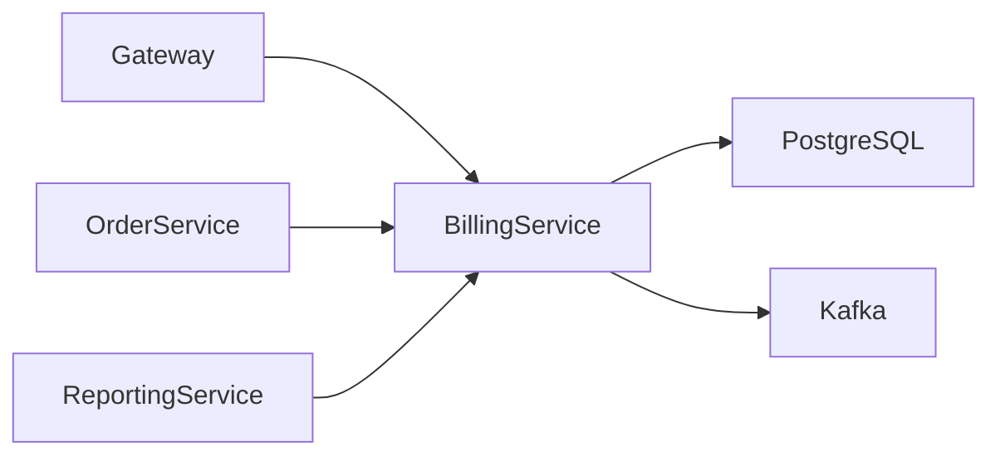
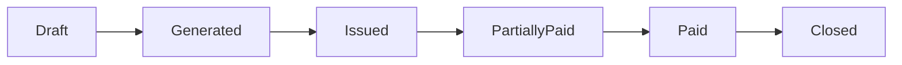
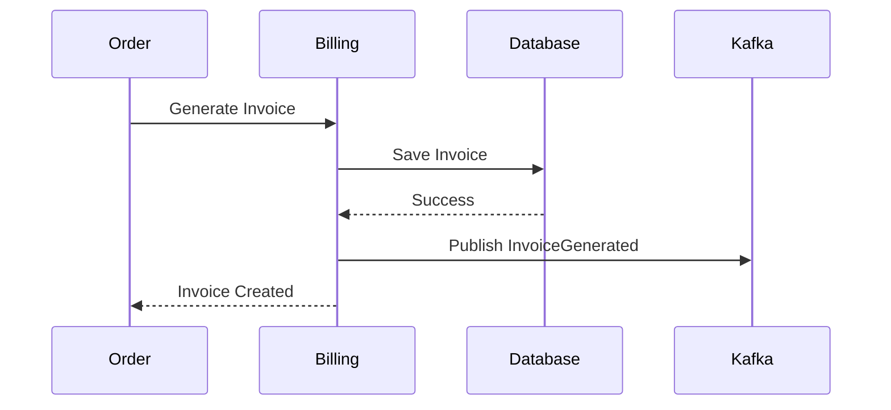
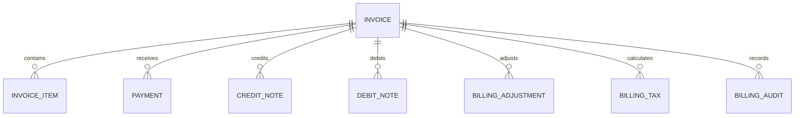
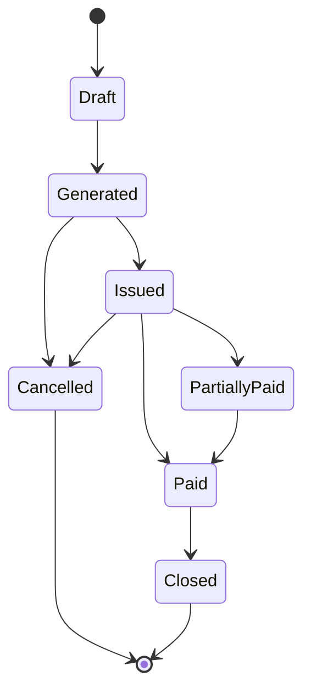
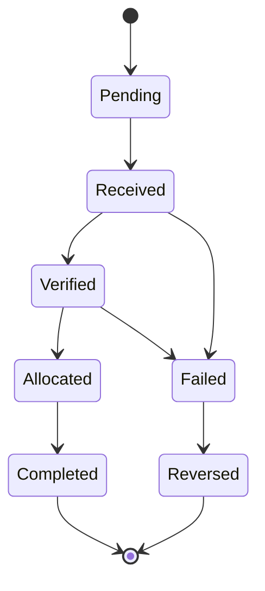
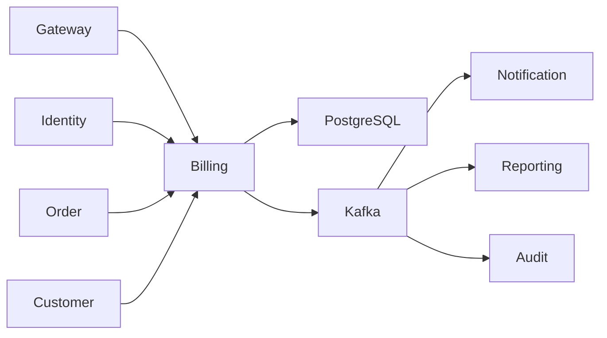

# SRS-008: Billing Service Software Requirements Specification

---

# 1. Document Information

| Field | Value |
|--------|-------|
| Project Name | Distributed Hub and Sales (DHS) Platform |
| Service Name | Billing Service |
| Document Title | Billing Service Software Requirements Specification |
| Document ID | SRS-008 |
| Repository | starone-dhs-platform |
| Module | billing-service |
| Document Type | Software Requirements Specification (SRS) |
| Standard | ISO/IEC/IEEE 29148 |
| Version | v1.0.0 |
| Status | Draft |
| Author | Sachin Salunke |
| Owner | Enterprise Architecture |
| Last Updated | 2026-06-27 |

---

# 2. Document Control

## 2.1 References

| Document | Description |
|----------|-------------|
| BRD-001 | Business Requirements Document |
| PRD-001 | Product Requirements Document |
| ADR-001 | Architecture Decision Record |
| HLD-001 | High-Level Design |
| FRD-Billing | Billing Functional Requirements |
| SRS-001 | Platform Foundation |
| SRS-007 | Order Service |

---

## 2.2 Revision History

| Version | Date | Description |
|----------|------|-------------|
| v1.0.0 | 2026-06-27 | Initial Version |

---

## 2.3 Approval Matrix

| Role | Status |
|------|--------|
| Product Owner | Pending |
| Enterprise Architect | Pending |
| Platform Lead | Pending |
| QA Lead | Pending |

---

# 3. Introduction

## 3.1 Purpose

The Billing Service shall manage invoice generation, payment recording, taxation, receivables and billing adjustments for customer orders.

It shall act as the authoritative source for billing information throughout the DHS Platform.

---

## 3.2 Scope

The Billing Service includes:

- Invoice Management
- Invoice Item Management
- Payment Recording
- Tax Calculation
- Credit Notes
- Debit Notes
- Billing Adjustments
- Outstanding Balance Management
- Billing Audit Events

---

## 3.3 Out of Scope

The Billing Service shall not provide:

- Order Management
- Product Management
- Customer Management
- Inventory Management
- Dispatch Management
- Authentication

---

## 3.4 Definitions

| Term | Description |
|------|-------------|
| Invoice | Customer Billing Document |
| Payment | Recorded Customer Payment |
| Credit Note | Billing Reduction |
| Debit Note | Additional Billing |
| Receivable | Outstanding Amount |

---

## 3.5 Assumptions

- Every Invoice references exactly one Order.
- One Order generates one Invoice.
- Payments reduce outstanding balances.
- Tax is calculated during invoice generation.

---

## 3.6 Constraints

- Invoice Number shall be immutable.
- Paid Invoices cannot be modified.
- Billing records shall use soft deletion.
- Financial transactions shall be auditable.

---

# 4. Service Overview

## 4.1 Responsibilities

The Billing Service shall provide:

- Invoice Generation
- Invoice Retrieval
- Payment Recording
- Outstanding Balance Management
- Credit Note Processing
- Debit Note Processing
- Billing Event Publishing

---

## 4.2 Service Context



---

## 4.3 Dependencies

| Dependency | Purpose |
|------------|---------|
| Platform Foundation | Shared Frameworks |
| Gateway | API Routing |
| Eureka | Service Discovery |
| PostgreSQL | Billing Database |
| Kafka | Event Streaming |
| Order Service | Order Validation |

---

## 4.4 Upstream Services

| Service | Purpose |
|----------|---------|
| Gateway | API Routing |
| Identity Service | Authentication |
| Order Service | Invoice Requests |

---

## 4.5 Downstream Services

| Service | Purpose |
|----------|---------|
| Dispatch Service | Shipment Authorization |
| Reporting Service | Financial Analytics |
| Notification Service | Invoice Notifications |

---

# 5. Business Process

## 5.1 Invoice Lifecycle



---

## 5.2 Billing Workflow



---

# 6. Functional Requirements

## Invoice Management

### BL-SYS-001

The Billing Service shall generate invoices.

---

### BL-SYS-002

The Billing Service shall retrieve invoices.

---

### BL-SYS-003

The Billing Service shall update draft invoices.

---

### BL-SYS-004

The Billing Service shall issue invoices.

---

### BL-SYS-005

The Billing Service shall close paid invoices.

---

## Payment Management

### BL-SYS-006

The Billing Service shall record customer payments.

---

### BL-SYS-007

The Billing Service shall update outstanding balances.

---

### BL-SYS-008

The Billing Service shall support partial payments.

---

## Financial Adjustments

### BL-SYS-009

The Billing Service shall generate Credit Notes.

---

### BL-SYS-010

The Billing Service shall generate Debit Notes.

---

### BL-SYS-011

The Billing Service shall record billing adjustments.

---

## Integration

### BL-SYS-012

The Billing Service shall publish billing lifecycle events.

---

### BL-SYS-013

The Billing Service shall expose REST APIs for authorized platform services.

---

# 7. Aggregate Root

```text
Billing
│
├── Invoice
├── InvoiceItem
├── Payment
├── CreditNote
├── DebitNote
├── BillingAdjustment
├── BillingTax
└── BillingAudit
```

The Billing Aggregate shall exclusively manage all financial entities belonging to an invoice.

---

# 8. Business Rules

The Billing Service shall enforce the following business rules to ensure financial accuracy, consistency, auditability, and compliance.

---

# 8.1 Invoice Rules

### BL-BR-001

Every Invoice shall have a unique Invoice Number.

---

### BL-BR-002

Invoice Number shall be generated according to the enterprise numbering policy.

---

### BL-BR-003

Invoice Number shall remain immutable after generation.

---

### BL-BR-004

Each Invoice shall reference exactly one Order.

---

### BL-BR-005

An Order shall generate only one active Invoice.

---

### BL-BR-006

Invoices shall contain at least one Invoice Item.

---

### BL-BR-007

Only Confirmed Orders shall generate Invoices.

---

# 8.2 Invoice Item Rules

### BL-BR-008

Every Invoice Item shall reference one Product.

---

### BL-BR-009

Invoice Item Quantity shall be greater than zero.

---

### BL-BR-010

Invoice Item Unit Price shall be captured at invoice generation.

---

### BL-BR-011

Invoice totals shall equal the sum of all Invoice Items.

---

# 8.3 Tax Rules

### BL-BR-012

Tax shall be calculated for every taxable Invoice Item.

---

### BL-BR-013

Tax Rates shall be determined from the Product Tax Category.

---

### BL-BR-014

Tax values shall remain unchanged after Invoice generation.

---

# 8.4 Payment Rules

### BL-BR-015

Payments shall only be recorded against Issued Invoices.

---

### BL-BR-016

Payment Amount shall be greater than zero.

---

### BL-BR-017

Partial Payments shall be supported.

---

### BL-BR-018

Outstanding Balance shall be recalculated after every Payment.

---

### BL-BR-019

Invoice Status shall automatically update after Payment.

---

# 8.5 Credit Note Rules

### BL-BR-020

Credit Notes shall reference an existing Invoice.

---

### BL-BR-021

Credit Note Amount shall not exceed Invoice Amount.

---

### BL-BR-022

Credit Notes shall reduce Outstanding Balance.

---

# 8.6 Debit Note Rules

### BL-BR-023

Debit Notes shall reference an existing Invoice.

---

### BL-BR-024

Debit Notes shall increase Outstanding Balance.

---

# 8.7 Billing Status Rules

### BL-BR-025

Invoice Status shall support:

- Draft
- Generated
- Issued
- Partially Paid
- Paid
- Closed
- Cancelled

---

### BL-BR-026

Paid Invoices shall become read-only.

---

### BL-BR-027

Closed Invoices shall not accept additional Payments.

---

# 9. REST API Specification

Base URL

```text
/api/v1/billing
```

All APIs shall be exposed through the DHS API Gateway.

---

# 9.1 API Overview

| Method | URI | Description |
|----------|-----|-------------|
| POST | /invoice | Generate Invoice |
| GET | /invoice/{invoiceId} | Get Invoice |
| GET | /invoice/order/{orderId} | Invoice by Order |
| GET | /invoice | Search Invoices |
| POST | /payment | Record Payment |
| GET | /payment/{paymentId} | Get Payment |
| POST | /credit-note | Create Credit Note |
| POST | /debit-note | Create Debit Note |
| PATCH | /invoice/{invoiceId}/issue | Issue Invoice |
| PATCH | /invoice/{invoiceId}/close | Close Invoice |

---

# 9.2 Request Headers

| Header | Required | Description |
|----------|----------|-------------|
| Authorization | Yes | JWT Bearer Token |
| X-Correlation-ID | Yes | Correlation ID |
| Content-Type | Yes | application/json |
| Accept | Yes | application/json |

---

# 9.3 Query Parameters

| Parameter | Required | Description |
|------------|----------|-------------|
| page | No | Page Number |
| size | No | Page Size |
| sort | No | Sort Field |
| direction | No | ASC / DESC |
| customerId | No | Customer Identifier |
| invoiceStatus | No | Invoice Status |
| paymentStatus | No | Payment Status |
| fromDate | No | Billing Date From |
| toDate | No | Billing Date To |

---

# 9.4 Path Parameters

| Parameter | Description |
|------------|-------------|
| invoiceId | Invoice Identifier |
| paymentId | Payment Identifier |
| orderId | Order Identifier |

---

# 9.5 Generate Invoice API

```http
POST /api/v1/billing/invoice
```

Request

```json
{
  "orderId": "UUID"
}
```

Response

```json
{
  "invoiceId": "UUID",
  "invoiceNumber": "INV000001",
  "status": "GENERATED"
}
```

---

# 9.6 Record Payment API

```http
POST /api/v1/billing/payment
```

Request

```json
{
  "invoiceId": "UUID",
  "paymentMethod": "UPI",
  "amount": 5000.00,
  "transactionReference": "TXN123456789"
}
```

Response

```json
{
  "paymentId": "UUID",
  "paymentStatus": "RECEIVED"
}
```

---

# 9.7 Credit Note API

```http
POST /api/v1/billing/credit-note
```

Creates a Credit Note against an Invoice.

---

# 9.8 Debit Note API

```http
POST /api/v1/billing/debit-note
```

Creates a Debit Note against an Invoice.

---

# 9.9 Search Invoice API

```http
GET /api/v1/billing/invoice
```

Supports:

- Pagination
- Sorting
- Filtering
- Customer
- Invoice Status
- Date Range

---

# 10. Request Models

## GenerateInvoiceRequest

| Field | Type | Required |
|---------|------|----------|
| orderId | UUID | Yes |

---

## RecordPaymentRequest

| Field | Type | Required |
|---------|------|----------|
| invoiceId | UUID | Yes |
| paymentMethod | PaymentMethod | Yes |
| amount | Decimal | Yes |
| transactionReference | String | Yes |

---

## CreditNoteRequest

| Field | Type | Required |
|---------|------|----------|
| invoiceId | UUID | Yes |
| amount | Decimal | Yes |
| reason | String | Yes |

---

## DebitNoteRequest

| Field | Type | Required |
|---------|------|----------|
| invoiceId | UUID | Yes |
| amount | Decimal | Yes |
| reason | String | Yes |

---

# 11. Response Models

## InvoiceResponse

| Field | Type |
|---------|------|
| invoiceId | UUID |
| invoiceNumber | String |
| orderId | UUID |
| subtotal | Decimal |
| taxAmount | Decimal |
| totalAmount | Decimal |
| outstandingBalance | Decimal |
| status | InvoiceStatus |

---

## PaymentResponse

| Field | Type |
|---------|------|
| paymentId | UUID |
| invoiceId | UUID |
| amount | Decimal |
| paymentMethod | PaymentMethod |
| paymentStatus | PaymentStatus |

---

## InvoiceSummaryResponse

| Field | Type |
|---------|------|
| invoiceNumber | String |
| customerName | String |
| invoiceDate | Timestamp |
| totalAmount | Decimal |
| outstandingBalance | Decimal |
| status | InvoiceStatus |

---

# 12. Validation Rules

## Invoice Generation

- Order shall exist.
- Order shall be Confirmed.
- Order shall not already have an active Invoice.
- Invoice shall contain at least one Invoice Item.

---

## Payment Validation

- Invoice shall exist.
- Invoice shall be Issued.
- Payment Amount shall be greater than zero.
- Payment Amount shall not exceed Outstanding Balance.

---

## Credit Note Validation

- Invoice shall exist.
- Credit Note Amount shall not exceed Outstanding Balance.
- Reason is mandatory.

---

## Debit Note Validation

- Invoice shall exist.
- Debit Note Amount shall be greater than zero.
- Reason is mandatory.

---

# 13. Permission Matrix

| API | Super Admin | Billing Manager | Billing Executive | Viewer |
|------|-------------|-----------------|-------------------|--------|
| Generate Invoice | ✅ | ✅ | ✅ | ❌ |
| Issue Invoice | ✅ | ✅ | ❌ | ❌ |
| Record Payment | ✅ | ✅ | ✅ | ❌ |
| Credit Note | ✅ | ✅ | ❌ | ❌ |
| Debit Note | ✅ | ✅ | ❌ | ❌ |
| View Invoice | ✅ | ✅ | ✅ | ✅ |
| Search Invoice | ✅ | ✅ | ✅ | ✅ |

---

# 14. Standard HTTP Status Codes

| Status | Description |
|----------|-------------|
| 200 | Success |
| 201 | Created |
| 204 | Updated |
| 400 | Validation Error |
| 401 | Unauthorized |
| 403 | Forbidden |
| 404 | Invoice Not Found |
| 409 | Billing Conflict |
| 422 | Business Rule Violation |
| 500 | Internal Server Error |

---

# 15. Aggregate Model

The Billing Service shall implement the Billing domain using Domain-Driven Design (DDD).

The **Billing** entity shall be the Aggregate Root and shall exclusively control the lifecycle of all subordinate entities.

No child entity shall be modified independently of the Billing Aggregate.

---

## 15.1 Billing Aggregate

```text
Billing
│
├── Invoice
├── InvoiceItem
├── Payment
├── CreditNote
├── DebitNote
├── BillingAdjustment
├── BillingTax
└── BillingAudit
```

---

## Aggregate Responsibilities

| Aggregate | Responsibility |
|------------|----------------|
| Billing | Aggregate Root |
| Invoice | Invoice Lifecycle |
| InvoiceItem | Invoice Line Items |
| Payment | Payment Recording |
| CreditNote | Invoice Credit Adjustment |
| DebitNote | Invoice Debit Adjustment |
| BillingAdjustment | Financial Corrections |
| BillingTax | Tax Calculation |
| BillingAudit | Financial Audit Trail |

---

# 16. Entity Model

## 16.1 Entity Overview

| Entity | Description |
|----------|-------------|
| Billing | Aggregate Root |
| Invoice | Customer Invoice |
| InvoiceItem | Invoice Products |
| Payment | Payment Record |
| CreditNote | Invoice Credit |
| DebitNote | Invoice Debit |
| BillingAdjustment | Financial Adjustment |
| BillingTax | Tax Details |
| BillingAudit | Audit History |

---

## 16.2 Invoice Entity

| Attribute | Type | Constraint |
|------------|------|------------|
| id | UUID | Primary Key |
| invoiceNumber | VARCHAR(30) | Unique |
| orderId | UUID | Required |
| customerId | UUID | Required |
| invoiceDate | TIMESTAMP | Required |
| dueDate | DATE | Required |
| subtotal | DECIMAL(18,2) | Required |
| taxAmount | DECIMAL(18,2) | Required |
| discountAmount | DECIMAL(18,2) | Required |
| totalAmount | DECIMAL(18,2) | Required |
| outstandingBalance | DECIMAL(18,2) | Required |
| status | ENUM | Required |
| createdBy | UUID | Required |
| createdAt | TIMESTAMP | Required |
| updatedBy | UUID | Required |
| updatedAt | TIMESTAMP | Required |
| deleted | BOOLEAN | Default FALSE |

---

## 16.3 Invoice Item

| Attribute | Type |
|------------|------|
| id | UUID |
| invoiceId | UUID |
| productId | UUID |
| quantity | DECIMAL(18,3) |
| unitPrice | DECIMAL(18,2) |
| taxAmount | DECIMAL(18,2) |
| discountAmount | DECIMAL(18,2) |
| lineTotal | DECIMAL(18,2) |

---

## 16.4 Payment

| Attribute | Type |
|------------|------|
| id | UUID |
| invoiceId | UUID |
| paymentReference | VARCHAR(100) |
| paymentMethod | ENUM |
| amount | DECIMAL(18,2) |
| paymentDate | TIMESTAMP |
| status | ENUM |

---

## 16.5 Credit Note

| Attribute | Type |
|------------|------|
| id | UUID |
| invoiceId | UUID |
| creditNoteNumber | VARCHAR(30) |
| amount | DECIMAL(18,2) |
| reason | VARCHAR(255) |
| issuedDate | TIMESTAMP |

---

## 16.6 Debit Note

| Attribute | Type |
|------------|------|
| id | UUID |
| invoiceId | UUID |
| debitNoteNumber | VARCHAR(30) |
| amount | DECIMAL(18,2) |
| reason | VARCHAR(255) |
| issuedDate | TIMESTAMP |

---

## 16.7 Billing Adjustment

| Attribute | Type |
|------------|------|
| id | UUID |
| invoiceId | UUID |
| adjustmentType | ENUM |
| amount | DECIMAL(18,2) |
| reason | VARCHAR(255) |
| adjustmentDate | TIMESTAMP |

---

## 16.8 Billing Tax

| Attribute | Type |
|------------|------|
| id | UUID |
| invoiceId | UUID |
| taxCategory | VARCHAR(50) |
| taxPercentage | DECIMAL(5,2) |
| taxAmount | DECIMAL(18,2) |

---

## 16.9 Billing Audit

| Attribute | Type |
|------------|------|
| id | UUID |
| invoiceId | UUID |
| eventType | VARCHAR(100) |
| eventSource | VARCHAR(100) |
| correlationId | UUID |
| eventTime | TIMESTAMP |

---

# 17. Database Design

Database

```text
billing_db
```

Schema

```text
billing
```

---

## 17.1 Tables

| Table | Purpose |
|---------|---------|
| invoice | Invoice Master |
| invoice_item | Invoice Line Items |
| payment | Payment Records |
| credit_note | Credit Notes |
| debit_note | Debit Notes |
| billing_adjustment | Financial Adjustments |
| billing_tax | Tax Details |
| billing_audit | Audit Trail |

---

## 17.2 Primary Keys

All tables shall use UUID as the Primary Key.

---

## 17.3 Foreign Keys

| Child Table | Parent Table |
|--------------|--------------|
| invoice_item | invoice |
| payment | invoice |
| credit_note | invoice |
| debit_note | invoice |
| billing_adjustment | invoice |
| billing_tax | invoice |
| billing_audit | invoice |

---

## 17.4 Constraints

Invoice

- Invoice Number UNIQUE
- One Invoice per Order
- Outstanding Balance ≥ 0

Payment

- Payment Amount > 0
- Payment Amount ≤ Outstanding Balance

Credit Note

- Credit Amount ≤ Invoice Total

Debit Note

- Debit Amount > 0

---

## 17.5 Indexes

| Table | Index |
|---------|-------|
| invoice | invoice_number |
| invoice | order_id |
| invoice | customer_id |
| invoice | status |
| invoice | invoice_date |
| payment | payment_reference |
| payment | payment_date |
| credit_note | credit_note_number |
| debit_note | debit_note_number |

---

# 18. Entity Relationship Diagram



---

# 19. Invoice State Machine



---

# 20. Payment State Machine



---

# 21. Security Requirements

The Billing Service shall rely on the Identity Service for authentication and authorization.

---

## Authentication

### BL-SEC-001

Every request shall contain a valid JWT Access Token.

---

### BL-SEC-002

Authentication shall be delegated to the Identity Service.

---

### BL-SEC-003

Unauthenticated requests shall return HTTP 401.

---

## Authorization

### BL-SEC-004

Billing APIs shall enforce Role-Based Access Control.

---

### BL-SEC-005

Permissions shall be validated before financial operations.

---

### BL-SEC-006

Unauthorized requests shall return HTTP 403.

---

## Data Security

### BL-SEC-007

All communication shall use TLS 1.3.

---

### BL-SEC-008

Paid invoices shall become immutable.

---

### BL-SEC-009

Financial audit records shall never be modified.

---

# 22. Event Specification

The Billing Service shall publish domain events for every significant financial transaction.

---

## 22.1 Published Events

| Topic | Event |
|---------|------|
| invoice.generated.v1 | InvoiceGenerated |
| invoice.issued.v1 | InvoiceIssued |
| payment.received.v1 | PaymentReceived |
| payment.completed.v1 | PaymentCompleted |
| payment.failed.v1 | PaymentFailed |
| invoice.closed.v1 | InvoiceClosed |
| credit.note.created.v1 | CreditNoteCreated |
| debit.note.created.v1 | DebitNoteCreated |

---

## 22.2 Consumed Events

| Topic | Source |
|---------|--------|
| order.confirmed.v1 | Order Service |
| order.cancelled.v1 | Order Service |

---

## 22.3 Standard Event Structure

```json
{
  "eventId": "UUID",
  "eventType": "InvoiceGenerated",
  "eventVersion": "1.0",
  "occurredAt": "2026-06-27T10:30:00Z",
  "correlationId": "UUID",
  "payload": {}
}
```

---

# 23. OpenFeign Clients

| Client | Purpose |
|----------|---------|
| OrderClient | Validate Order |
| CustomerClient | Retrieve Customer Billing Information |

> Financial state transitions shall primarily be driven by Kafka events. OpenFeign shall be limited to synchronous validation and read-only queries.

---

# 24. Configuration

Configuration shall be externalized using the centralized configuration repository.

---

## Configuration Categories

- Server
- Database
- Kafka
- Security
- Logging
- OpenFeign
- Billing
- Tax
- Invoice
- Payment
- Observability

---

## Configuration Properties

| Property | Default | Required | Description |
|------------|----------|-----------|-------------|
| billing.invoice.prefix | INV | Yes | Invoice Number Prefix |
| billing.payment.timeout | 900 | Yes | Payment Timeout (seconds) |
| billing.search.max-page-size | 100 | Yes | Maximum Search Page Size |
| billing.tax.rounding-mode | HALF_UP | Yes | Tax Rounding Strategy |
| billing.event.topic.invoice-generated | invoice.generated.v1 | Yes | Invoice Generated Topic |
| billing.event.topic.payment-completed | payment.completed.v1 | Yes | Payment Completed Topic |
| billing.retry.max-attempts | 3 | Yes | Retry Attempts |
| billing.retry.backoff-ms | 1000 | Yes | Retry Backoff Interval |

---

# 25. Service Context Diagram



---

# 26. Error Handling

The Billing Service shall provide standardized error handling for all billing and financial operations.

All error responses shall comply with the Platform Foundation error model defined in **SRS-001 – Platform Foundation**.

---

## 26.1 Functional Requirements

### BL-SYS-014

The Billing Service shall return standardized error responses.

---

### BL-SYS-015

Business exceptions shall be distinguishable from technical exceptions.

---

### BL-SYS-016

Every error response shall include a Correlation ID.

---

### BL-SYS-017

Unhandled exceptions shall return HTTP 500.

---

### BL-SYS-018

Internal implementation details shall never be exposed to API consumers.

---

## 26.2 Standard Error Response

```json
{
  "timestamp": "2026-06-27T10:30:00Z",
  "status": 409,
  "error": "Invoice Generation Failed",
  "code": "BL-BUS-001",
  "message": "Invoice already exists for the specified order.",
  "correlationId": "UUID",
  "path": "/api/v1/billing/invoice"
}
```

---

## 26.3 Business Error Catalog

| Error Code | Description | HTTP Status |
|------------|-------------|-------------|
| BL-VAL-001 | Validation Failed | 400 |
| BL-AUTH-001 | Authentication Required | 401 |
| BL-AUTH-002 | Access Denied | 403 |
| BL-BUS-001 | Invoice Already Exists | 409 |
| BL-BUS-002 | Invoice Not Found | 404 |
| BL-BUS-003 | Payment Not Found | 404 |
| BL-BUS-004 | Credit Note Not Found | 404 |
| BL-BUS-005 | Debit Note Not Found | 404 |
| BL-BUS-006 | Invalid Invoice Status | 422 |
| BL-BUS-007 | Payment Amount Exceeds Outstanding Balance | 422 |
| BL-BUS-008 | Invoice Already Paid | 409 |
| BL-BUS-009 | Credit Amount Exceeds Invoice Amount | 422 |
| BL-BUS-010 | Debit Amount Invalid | 422 |
| BL-SYS-001 | Internal Server Error | 500 |

---

# 27. Logging Requirements

The Billing Service shall use the Platform Foundation logging framework.

---

## 27.1 Functional Requirements

### BL-SYS-019

Invoice generation shall generate an audit log.

---

### BL-SYS-020

Invoice issuance shall generate an audit log.

---

### BL-SYS-021

Payment recording shall generate an audit log.

---

### BL-SYS-022

Credit Note creation shall generate an audit log.

---

### BL-SYS-023

Debit Note creation shall generate an audit log.

---

### BL-SYS-024

Billing adjustments shall generate an audit log.

---

### BL-SYS-025

Business and technical exceptions shall be logged.

---

## 27.2 Log Attributes

Every log entry shall include:

- Timestamp
- Service Name
- Correlation ID
- Trace ID
- Span ID
- User ID
- Invoice ID
- Invoice Number
- Payment ID
- HTTP Method
- Request URI
- HTTP Status
- Processing Time

---

## 27.3 Sensitive Information

The following information shall never be logged:

- JWT Tokens
- Authorization Headers
- Payment Credentials
- Banking Information
- Encryption Keys
- Internal Stack Traces

---

# 28. Observability Requirements

The Billing Service shall expose operational metrics through the Platform Foundation.

---

## 28.1 Functional Requirements

### BL-SYS-026

The Billing Service shall expose Health endpoints.

---

### BL-SYS-027

The Billing Service shall expose Metrics endpoints.

---

### BL-SYS-028

The Billing Service shall support Distributed Tracing.

---

### BL-SYS-029

Every request shall propagate Correlation IDs.

---

### BL-SYS-030

Financial transaction metrics shall be published.

---

## 28.2 Business Metrics

The Billing Service shall publish metrics including:

- Total Invoices Generated
- Issued Invoices
- Paid Invoices
- Outstanding Invoices
- Total Payments Received
- Partial Payments
- Credit Notes Generated
- Debit Notes Generated
- Outstanding Receivables
- Billing API Response Time
- Billing Validation Failures

---

# 29. Non-Functional Requirements

## 29.1 Performance

### BL-NFR-001

Invoice generation shall complete within 500 milliseconds.

---

### BL-NFR-002

Payment recording shall complete within 300 milliseconds.

---

### BL-NFR-003

Invoice search shall support pagination, filtering and sorting within 500 milliseconds.

---

## 29.2 Availability

### BL-NFR-004

The Billing Service shall maintain at least 99.9% availability.

---

### BL-NFR-005

The Billing Service shall support horizontal scaling.

---

## 29.3 Reliability

### BL-NFR-006

Financial transactions shall be ACID compliant.

---

### BL-NFR-007

Billing events shall guarantee at-least-once delivery.

---

### BL-NFR-008

Payment recording shall be idempotent.

---

## 29.4 Scalability

### BL-NFR-009

The Billing Service shall support concurrent invoice generation.

---

### BL-NFR-010

The Billing Service shall support high-volume payment processing.

---

## 29.5 Security

### BL-NFR-011

All communication shall use TLS 1.3.

---

### BL-NFR-012

Every protected API shall enforce Role-Based Access Control.

---

### BL-NFR-013

Paid invoices shall be immutable.

---

### BL-NFR-014

Financial audit records shall be tamper resistant.

---

## 29.6 Maintainability

### BL-NFR-015

The Billing Service shall use Platform Foundation shared libraries.

---

### BL-NFR-016

The Billing Service shall comply with enterprise coding standards.

---

# 30. Requirement Traceability Matrix

| Requirement | Source Document | Verification |
|-------------|-----------------|--------------|
| BL-SYS-001 – BL-SYS-013 | FRD-Billing | Functional Testing |
| BL-SYS-014 – BL-SYS-030 | SRS-001 Platform Foundation | Integration Testing |
| BL-NFR-001 – BL-NFR-016 | PRD / HLD | Performance, Security & Reliability Testing |

---

# 31. Testability Matrix

| Requirement | Test Case |
|-------------|-----------|
| BL-SYS-001 | TC-BL-001 |
| BL-SYS-002 | TC-BL-002 |
| BL-SYS-003 | TC-BL-003 |
| BL-SYS-004 | TC-BL-004 |
| BL-SYS-005 | TC-BL-005 |
| BL-SYS-006 | TC-BL-006 |
| BL-SYS-007 | TC-BL-007 |
| BL-SYS-008 | TC-BL-008 |
| BL-SYS-009 | TC-BL-009 |
| BL-SYS-010 | TC-BL-010 |
| BL-SYS-011 | TC-BL-011 |
| BL-SYS-012 | TC-BL-012 |
| BL-SYS-013 | TC-BL-013 |

---

# 32. Acceptance Criteria

The Billing Service shall be considered complete when:

- Invoice generation functions successfully.
- Invoice issuance functions correctly.
- Invoice retrieval and search operate correctly.
- Payment recording supports full and partial payments.
- Outstanding balances are recalculated accurately.
- Credit Notes reduce invoice balances correctly.
- Debit Notes increase invoice balances correctly.
- Billing adjustments are fully auditable.
- Billing events are published successfully.
- Standardized error responses are returned.
- Logging and observability are operational.
- Health endpoints are operational.
- Performance objectives are achieved.
- Security requirements are satisfied.
- Functional, integration and non-functional tests pass.

---

# 33. Appendices

## Appendix A – API Summary

| Resource | Endpoints |
|----------|-----------|
| Invoice | Generate, Issue, Get, Search, Close |
| Payment | Record Payment, Get Payment |
| Credit Note | Create Credit Note |
| Debit Note | Create Debit Note |
| Billing Adjustment | Manage Adjustments |

---

## Appendix B – Aggregate Summary

| Aggregate | Description |
|------------|-------------|
| Billing | Aggregate Root |
| Invoice | Invoice Lifecycle |
| InvoiceItem | Invoice Line Items |
| Payment | Payment Record |
| CreditNote | Credit Adjustment |
| DebitNote | Debit Adjustment |
| BillingAdjustment | Financial Adjustment |
| BillingTax | Tax Details |
| BillingAudit | Audit Trail |

---

## Appendix C – Service Dependencies

| Dependency | Purpose |
|------------|---------|
| Platform Foundation | Shared Frameworks |
| Gateway | API Routing |
| Eureka | Service Discovery |
| PostgreSQL | Persistent Storage |
| Kafka | Event Streaming |
| Order Service | Order Validation |
| Identity Service | Authentication & Authorization |
| Notification Service | Invoice Notifications |
| Reporting Service | Financial Analytics |
| Audit Service | Audit Processing |

---

## Appendix D – Revision History

| Version | Description |
|---------|-------------|
| v1.0.0 | Initial Billing Service Software Requirements Specification |

---

# 34. Document Sign-off

| Role | Status |
|------|--------|
| Product Owner | Pending |
| Enterprise Architect | Pending |
| Platform Lead | Pending |
| Security Lead | Pending |
| QA Lead | Pending |

---

# End of Document


