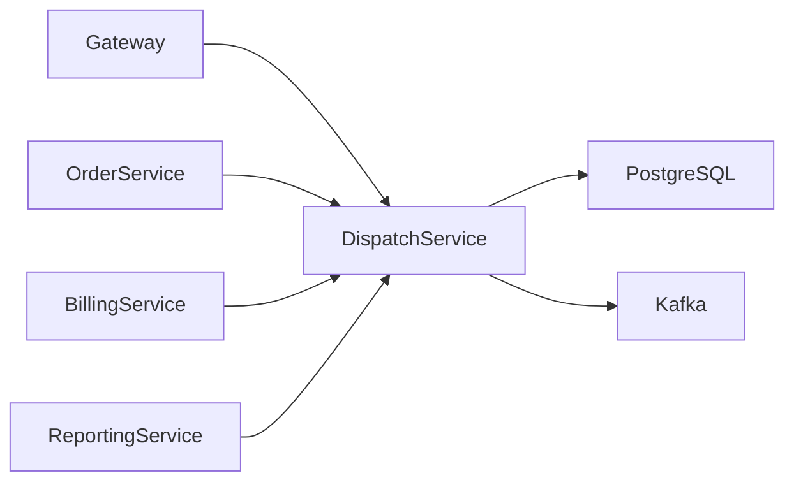
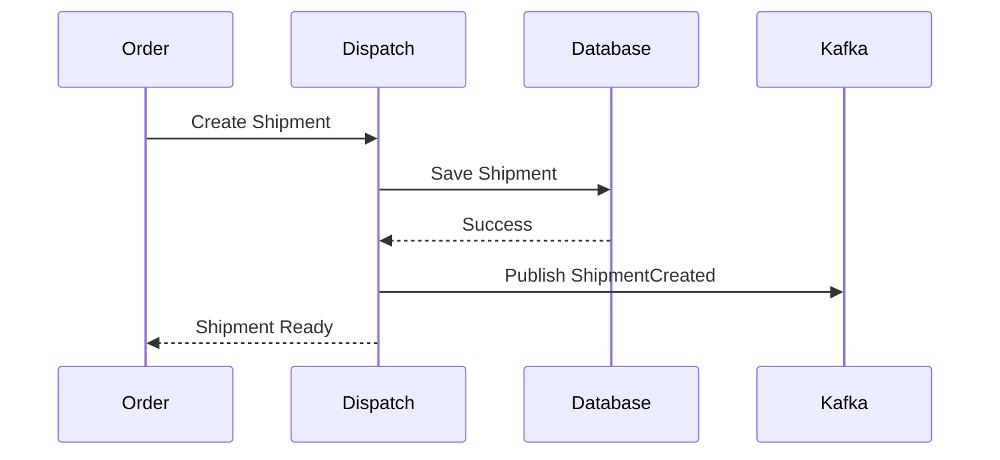
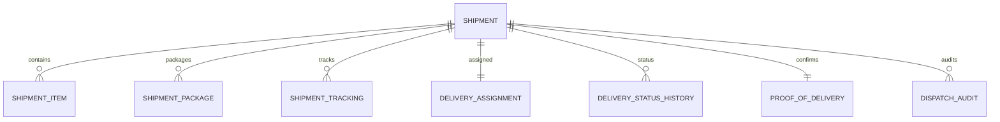
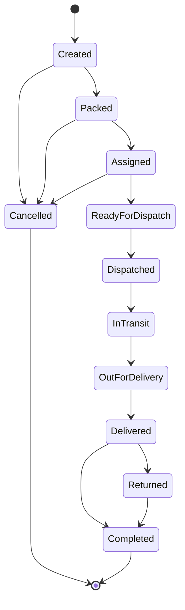
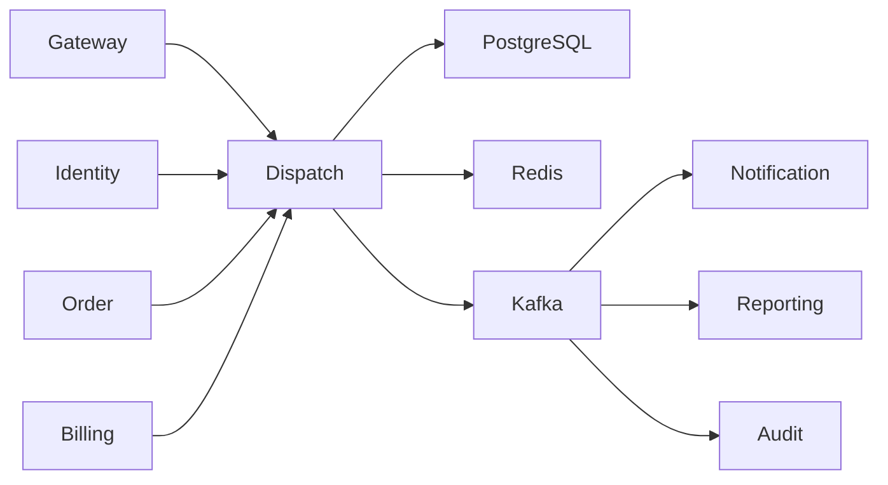

# SRS-009: Dispatch Service Software Requirements Specification

---

# 1. Document Information

| Field | Value |
|--------|-------|
| Project Name | Distributed Hub and Sales (DHS) Platform |
| Service Name | Dispatch Service |
| Document Title | Dispatch Service Software Requirements Specification |
| Document ID | SRS-009 |
| Repository | starone-dhs-platform |
| Module | dispatch-service |
| Document Type | Software Requirements Specification (SRS) |
| Standard | ISO/IEC/IEEE 29148 |
| Version | v1.0.0 |
| Status | Draft |
| Author | Sachin Salunke |
| Owner | Enterprise Architecture |
| Last Updated | 2026-06-27 |

---

# 2. Document Control

## 2.1 References

| Document | Description |
|----------|-------------|
| BRD-001 | Business Requirements Document |
| PRD-001 | Product Requirements Document |
| ADR-001 | Architecture Decision Record |
| HLD-001 | High-Level Design |
| FRD-Dispatch | Dispatch Functional Requirements |
| SRS-001 | Platform Foundation |
| SRS-007 | Order Service |
| SRS-008 | Billing Service |

---

## 2.2 Revision History

| Version | Date | Description |
|----------|------|-------------|
| v1.0.0 | 2026-06-27 | Initial Version |

---

## 2.3 Approval Matrix

| Role | Status |
|------|--------|
| Product Owner | Pending |
| Enterprise Architect | Pending |
| Platform Lead | Pending |
| QA Lead | Pending |

---

# 3. Introduction

## 3.1 Purpose

The Dispatch Service shall manage the end-to-end shipment lifecycle for customer orders.

The service shall coordinate shipment creation, package preparation, delivery assignment, shipment tracking, delivery confirmation, and proof of delivery.

The Dispatch Service shall act as the authoritative source for shipment and delivery information.

---

## 3.2 Scope

The Dispatch Service includes:

- Shipment Management
- Shipment Item Management
- Package Management
- Delivery Assignment
- Shipment Tracking
- Delivery Status Management
- Proof of Delivery
- Dispatch Audit Events

---

## 3.3 Out of Scope

The Dispatch Service shall not provide:

- Order Management
- Inventory Management
- Product Management
- Customer Management
- Billing
- Authentication

---

## 3.4 Definitions

| Term | Description |
|------|-------------|
| Shipment | Physical delivery of an order |
| Package | Physical package prepared for shipment |
| POD | Proof of Delivery |
| Tracking | Shipment location and status updates |

---

## 3.5 Assumptions

- Every Shipment belongs to exactly one Order.
- Every Shipment contains at least one Shipment Item.
- Shipment creation occurs only after successful payment.
- Inventory has already been allocated before shipment creation.

---

## 3.6 Constraints

- Shipment Number shall be immutable.
- Delivered Shipments cannot be modified.
- Shipment records shall use soft deletion.
- Delivery events shall be fully auditable.

---

# 4. Service Overview

## 4.1 Responsibilities

The Dispatch Service shall provide:

- Shipment Creation
- Package Preparation
- Delivery Assignment
- Shipment Tracking
- Delivery Confirmation
- Proof of Delivery
- Dispatch Event Publishing

---

## 4.2 Service Context



---

## 4.3 Dependencies

| Dependency | Purpose |
|------------|---------|
| Platform Foundation | Shared Frameworks |
| Gateway | API Routing |
| Eureka | Service Discovery |
| PostgreSQL | Dispatch Database |
| Kafka | Event Streaming |
| Order Service | Order Validation |
| Billing Service | Payment Validation |

---

## 4.4 Upstream Services

| Service | Purpose |
|----------|---------|
| Gateway | API Routing |
| Identity Service | Authentication |
| Order Service | Shipment Requests |
| Billing Service | Payment Confirmation |

---

## 4.5 Downstream Services

| Service | Purpose |
|----------|---------|
| Notification Service | Delivery Notifications |
| Reporting Service | Logistics Analytics |
| Audit Service | Audit Processing |

---

# 5. Business Process

## 5.1 Dispatch Lifecycle


---

## 5.2 Dispatch Workflow



---

# 6. Functional Requirements

## Shipment Management

### DP-SYS-001

The Dispatch Service shall create shipments.

---

### DP-SYS-002

The Dispatch Service shall retrieve shipment details.

---

### DP-SYS-003

The Dispatch Service shall update shipment information.

---

### DP-SYS-004

The Dispatch Service shall assign delivery resources.

---

### DP-SYS-005

The Dispatch Service shall maintain shipment tracking.

---

### DP-SYS-006

The Dispatch Service shall confirm delivery.

---

### DP-SYS-007

The Dispatch Service shall capture Proof of Delivery.

---

### DP-SYS-008

The Dispatch Service shall maintain shipment history.

---

### DP-SYS-009

The Dispatch Service shall publish shipment lifecycle events.

---

### DP-SYS-010

The Dispatch Service shall expose REST APIs for authorized platform services.

---

# 7. Aggregate Root

The Dispatch domain shall follow Domain-Driven Design.

```text
Dispatch
│
├── Shipment
├── ShipmentItem
├── ShipmentPackage
├── ShipmentTracking
├── DeliveryAssignment
├── DeliveryStatusHistory
├── ProofOfDelivery
└── DispatchAudit
```

The Dispatch Aggregate shall exclusively control modifications to all subordinate entities.

---

# 8. Business Rules

The Dispatch Service shall enforce the following business rules to ensure accurate shipment processing, delivery tracking, and fulfillment integrity.

---

# 8.1 Shipment Rules

### DP-BR-001

Every Shipment shall have a unique Shipment Number.

---

### DP-BR-002

Shipment Number shall be generated according to the enterprise numbering policy.

---

### DP-BR-003

Shipment Number shall remain immutable after creation.

---

### DP-BR-004

Every Shipment shall reference exactly one Order.

---

### DP-BR-005

One Order may produce one or more Shipments.

---

### DP-BR-006

Every Shipment shall contain at least one Shipment Item.

---

### DP-BR-007

Shipment creation shall only occur after successful payment confirmation.

---

# 8.2 Shipment Item Rules

### DP-BR-008

Every Shipment Item shall reference one Product.

---

### DP-BR-009

Shipment Quantity shall be greater than zero.

---

### DP-BR-010

Shipment Quantity shall not exceed allocated inventory quantity.

---

### DP-BR-011

Shipment Items shall become immutable after dispatch.

---

# 8.3 Package Rules

### DP-BR-012

One Shipment may contain multiple Packages.

---

### DP-BR-013

Every Package shall have a unique Package Number.

---

### DP-BR-014

Every Package shall record weight and dimensions.

---

### DP-BR-015

Packages shall be sealed before dispatch.

---

# 8.4 Delivery Assignment Rules

### DP-BR-016

Every Shipment shall be assigned to one Delivery Resource.

---

### DP-BR-017

A Delivery Resource may manage multiple Shipments.

---

### DP-BR-018

Delivery assignments shall be changeable before dispatch.

---

# 8.5 Tracking Rules

### DP-BR-019

Every Shipment shall maintain complete tracking history.

---

### DP-BR-020

Tracking events shall be chronological.

---

### DP-BR-021

Tracking history shall never be physically deleted.

---

# 8.6 Proof of Delivery Rules

### DP-BR-022

Delivered Shipments shall capture Proof of Delivery.

---

### DP-BR-023

Proof of Delivery may include:

- Customer Signature
- Delivery Photograph
- Receiver Name
- Delivery Timestamp

---

### DP-BR-024

Completed deliveries shall become read-only.

---

# 8.7 Shipment Status Rules

### DP-BR-025

Shipment Status shall support:

- Created
- Packed
- Assigned
- Ready For Dispatch
- Dispatched
- In Transit
- Out For Delivery
- Delivered
- Completed
- Cancelled
- Returned

---

### DP-BR-026

Shipment status transitions shall follow the defined state machine.

---

### DP-BR-027

Delivered Shipments cannot return to previous operational states.

---

# 9. REST API Specification

Base URL

```text
/api/v1/dispatch
```

All APIs shall be exposed through the DHS API Gateway.

---

# 9.1 API Overview

| Method | URI | Description |
|----------|-----|-------------|
| POST | /shipment | Create Shipment |
| GET | /shipment/{shipmentId} | Get Shipment |
| PUT | /shipment/{shipmentId} | Update Shipment |
| GET | /shipment | Search Shipments |
| POST | /shipment/{shipmentId}/assign | Assign Delivery Resource |
| POST | /shipment/{shipmentId}/dispatch | Dispatch Shipment |
| POST | /shipment/{shipmentId}/deliver | Confirm Delivery |
| POST | /shipment/{shipmentId}/pod | Upload Proof of Delivery |
| GET | /tracking/{shipmentId} | Shipment Tracking |
| PATCH | /shipment/{shipmentId}/cancel | Cancel Shipment |

---

# 9.2 Request Headers

| Header | Required | Description |
|----------|----------|-------------|
| Authorization | Yes | JWT Bearer Token |
| X-Correlation-ID | Yes | Correlation Identifier |
| Content-Type | Yes | application/json |
| Accept | Yes | application/json |

---

# 9.3 Query Parameters

| Parameter | Required | Description |
|------------|----------|-------------|
| page | No | Page Number |
| size | No | Page Size |
| sort | No | Sort Field |
| direction | No | ASC or DESC |
| shipmentStatus | No | Shipment Status |
| orderId | No | Order Identifier |
| deliveryResourceId | No | Delivery Resource |
| fromDate | No | Dispatch Date From |
| toDate | No | Dispatch Date To |

---

# 9.4 Path Parameters

| Parameter | Description |
|------------|-------------|
| shipmentId | Shipment Identifier |

---

# 9.5 Create Shipment API

```http
POST /api/v1/dispatch/shipment
```

Request

```json
{
  "orderId": "UUID",
  "packages": [
    {
      "weight": 2.50,
      "length": 30,
      "width": 20,
      "height": 15
    }
  ]
}
```

Response

```json
{
  "shipmentId": "UUID",
  "shipmentNumber": "SHP000001",
  "status": "CREATED"
}
```

---

# 9.6 Assign Delivery Resource API

```http
POST /api/v1/dispatch/shipment/{shipmentId}/assign
```

Request

```json
{
  "deliveryResourceId": "UUID"
}
```

Response

```json
{
  "status": "ASSIGNED"
}
```

---

# 9.7 Dispatch Shipment API

```http
POST /api/v1/dispatch/shipment/{shipmentId}/dispatch
```

Updates shipment status to **Dispatched**.

---

# 9.8 Confirm Delivery API

```http
POST /api/v1/dispatch/shipment/{shipmentId}/deliver
```

Marks shipment as Delivered.

---

# 9.9 Upload Proof of Delivery API

```http
POST /api/v1/dispatch/shipment/{shipmentId}/pod
```

Stores customer signature and delivery evidence.

---

# 9.10 Shipment Tracking API

```http
GET /api/v1/dispatch/tracking/{shipmentId}
```

Returns complete shipment tracking history.

---

# 10. Request Models

## CreateShipmentRequest

| Field | Type | Required |
|---------|------|----------|
| orderId | UUID | Yes |
| packages | List<PackageRequest> | Yes |

---

## PackageRequest

| Field | Type | Required |
|---------|------|----------|
| weight | Decimal | Yes |
| length | Decimal | Yes |
| width | Decimal | Yes |
| height | Decimal | Yes |

---

## AssignDeliveryRequest

| Field | Type | Required |
|---------|------|----------|
| deliveryResourceId | UUID | Yes |

---

## ProofOfDeliveryRequest

| Field | Type | Required |
|---------|------|----------|
| receiverName | String | Yes |
| signatureUrl | String | No |
| photoUrl | String | No |
| remarks | String | No |

---

# 11. Response Models

## ShipmentResponse

| Field | Type |
|---------|------|
| shipmentId | UUID |
| shipmentNumber | String |
| orderId | UUID |
| shipmentStatus | ShipmentStatus |
| dispatchDate | Timestamp |
| expectedDeliveryDate | Timestamp |

---

## TrackingResponse

| Field | Type |
|---------|------|
| shipmentId | UUID |
| trackingEvents | List<TrackingEvent> |

---

## ShipmentSummaryResponse

| Field | Type |
|---------|------|
| shipmentNumber | String |
| orderNumber | String |
| shipmentStatus | ShipmentStatus |
| expectedDeliveryDate | Timestamp |

---

# 12. Validation Rules

## Shipment Creation

- Order shall exist.
- Payment shall be completed.
- Shipment shall contain at least one Package.
- Shipment shall contain at least one Shipment Item.

---

## Delivery Assignment

- Shipment shall exist.
- Shipment shall not already be Delivered.
- Delivery Resource shall exist.

---

## Dispatch Validation

- Shipment shall be Assigned.
- Shipment Packages shall be sealed.
- Shipment Items shall be verified.

---

## Proof of Delivery Validation

- Shipment shall be Delivered.
- Receiver Name is mandatory.
- At least one delivery confirmation method shall be provided.

---

# 13. Permission Matrix

| API | Super Admin | Dispatch Manager | Dispatch Executive | Delivery Executive | Viewer |
|------|-------------|------------------|--------------------|-------------------|--------|
| Create Shipment | ✅ | ✅ | ✅ | ❌ | ❌ |
| Update Shipment | ✅ | ✅ | ✅ | ❌ | ❌ |
| Assign Delivery | ✅ | ✅ | ✅ | ❌ | ❌ |
| Dispatch Shipment | ✅ | ✅ | ✅ | ❌ | ❌ |
| Confirm Delivery | ✅ | ✅ | ❌ | ✅ | ❌ |
| Upload POD | ✅ | ✅ | ❌ | ✅ | ❌ |
| View Shipment | ✅ | ✅ | ✅ | ✅ | ✅ |
| Search Shipment | ✅ | ✅ | ✅ | ✅ | ✅ |

---

# 14. Standard HTTP Status Codes

| Status | Description |
|----------|-------------|
| 200 | Success |
| 201 | Created |
| 204 | Updated |
| 400 | Validation Error |
| 401 | Unauthorized |
| 403 | Forbidden |
| 404 | Shipment Not Found |
| 409 | Shipment Conflict |
| 422 | Business Rule Violation |
| 500 | Internal Server Error |

---

# 15. Aggregate Model

The Dispatch Service shall implement the Dispatch domain using Domain-Driven Design (DDD).

The **Dispatch** entity shall be the Aggregate Root and shall exclusively control the lifecycle of all subordinate entities.

No child entity shall be modified independently of the Dispatch Aggregate.

---

## 15.1 Dispatch Aggregate

```text
Dispatch
│
├── Shipment
├── ShipmentItem
├── ShipmentPackage
├── ShipmentTracking
├── DeliveryAssignment
├── DeliveryStatusHistory
├── ProofOfDelivery
└── DispatchAudit
```

---

## Aggregate Responsibilities

| Aggregate | Responsibility |
|------------|----------------|
| Dispatch | Aggregate Root |
| Shipment | Shipment Lifecycle |
| ShipmentItem | Products within Shipment |
| ShipmentPackage | Physical Package Information |
| ShipmentTracking | Shipment Tracking Events |
| DeliveryAssignment | Delivery Resource Assignment |
| DeliveryStatusHistory | Shipment Status History |
| ProofOfDelivery | Delivery Confirmation |
| DispatchAudit | Audit Trail |

---

# 16. Entity Model

## 16.1 Entity Overview

| Entity | Description |
|----------|-------------|
| Dispatch | Aggregate Root |
| Shipment | Shipment Master |
| ShipmentItem | Shipment Products |
| ShipmentPackage | Physical Package |
| ShipmentTracking | Tracking Events |
| DeliveryAssignment | Delivery Executive Assignment |
| DeliveryStatusHistory | Shipment Status Timeline |
| ProofOfDelivery | Delivery Evidence |
| DispatchAudit | Audit Trail |

---

## 16.2 Shipment Entity

| Attribute | Type | Constraint |
|------------|------|------------|
| id | UUID | Primary Key |
| shipmentNumber | VARCHAR(30) | Unique |
| orderId | UUID | Required |
| branchId | UUID | Required |
| shipmentDate | TIMESTAMP | Required |
| expectedDeliveryDate | DATE | Required |
| actualDeliveryDate | TIMESTAMP | Optional |
| shipmentStatus | ENUM | Required |
| totalPackages | INTEGER | Required |
| totalWeight | DECIMAL(10,2) | Required |
| createdBy | UUID | Required |
| createdAt | TIMESTAMP | Required |
| updatedBy | UUID | Required |
| updatedAt | TIMESTAMP | Required |
| deleted | BOOLEAN | Default FALSE |

---

## 16.3 Shipment Item

| Attribute | Type |
|------------|------|
| id | UUID |
| shipmentId | UUID |
| productId | UUID |
| quantity | DECIMAL(18,3) |
| unitOfMeasure | VARCHAR(30) |

---

## 16.4 Shipment Package

| Attribute | Type |
|------------|------|
| id | UUID |
| shipmentId | UUID |
| packageNumber | VARCHAR(30) |
| weight | DECIMAL(10,2) |
| length | DECIMAL(10,2) |
| width | DECIMAL(10,2) |
| height | DECIMAL(10,2) |
| packageStatus | ENUM |

---

## 16.5 Shipment Tracking

| Attribute | Type |
|------------|------|
| id | UUID |
| shipmentId | UUID |
| trackingStatus | ENUM |
| location | VARCHAR(255) |
| remarks | VARCHAR(500) |
| recordedAt | TIMESTAMP |

---

## 16.6 Delivery Assignment

| Attribute | Type |
|------------|------|
| id | UUID |
| shipmentId | UUID |
| deliveryResourceId | UUID |
| assignedBy | UUID |
| assignedAt | TIMESTAMP |
| assignmentStatus | ENUM |

---

## 16.7 Delivery Status History

| Attribute | Type |
|------------|------|
| id | UUID |
| shipmentId | UUID |
| previousStatus | ENUM |
| currentStatus | ENUM |
| changedBy | UUID |
| changedAt | TIMESTAMP |
| remarks | VARCHAR(500) |

---

## 16.8 Proof Of Delivery

| Attribute | Type |
|------------|------|
| id | UUID |
| shipmentId | UUID |
| receiverName | VARCHAR(150) |
| signatureUrl | VARCHAR(500) |
| photoUrl | VARCHAR(500) |
| latitude | DECIMAL(10,7) |
| longitude | DECIMAL(10,7) |
| deliveredAt | TIMESTAMP |

---

## 16.9 Dispatch Audit

| Attribute | Type |
|------------|------|
| id | UUID |
| shipmentId | UUID |
| eventType | VARCHAR(100) |
| eventSource | VARCHAR(100) |
| correlationId | UUID |
| eventTime | TIMESTAMP |

---

# 17. Database Design

Database

```text
dispatch_db
```

Schema

```text
dispatch
```

---

## 17.1 Tables

| Table | Purpose |
|---------|---------|
| shipment | Shipment Master |
| shipment_item | Shipment Products |
| shipment_package | Package Information |
| shipment_tracking | Tracking History |
| delivery_assignment | Delivery Assignment |
| delivery_status_history | Shipment Status History |
| proof_of_delivery | Delivery Confirmation |
| dispatch_audit | Audit Trail |

---

## 17.2 Primary Keys

All tables shall use UUID as the Primary Key.

---

## 17.3 Foreign Keys

| Child Table | Parent Table |
|--------------|--------------|
| shipment_item | shipment |
| shipment_package | shipment |
| shipment_tracking | shipment |
| delivery_assignment | shipment |
| delivery_status_history | shipment |
| proof_of_delivery | shipment |
| dispatch_audit | shipment |

---

## 17.4 Constraints

Shipment

- Shipment Number UNIQUE
- Order Reference Required
- Shipment Status Required

Shipment Package

- Package Number UNIQUE
- Weight Greater Than Zero

Proof Of Delivery

- One Proof Of Delivery per Shipment

Delivery Assignment

- One Active Assignment per Shipment

---

## 17.5 Indexes

| Table | Index |
|---------|-------|
| shipment | shipment_number |
| shipment | order_id |
| shipment | shipment_status |
| shipment | shipment_date |
| shipment_tracking | recorded_at |
| delivery_assignment | delivery_resource_id |
| proof_of_delivery | delivered_at |

---

# 18. Entity Relationship Diagram



---

# 19. Shipment State Machine



---

# 20. Security Requirements

The Dispatch Service shall rely upon the Identity Service for authentication and authorization.

---

## Authentication

### DP-SEC-001

Every request shall contain a valid JWT Access Token.

---

### DP-SEC-002

Authentication shall be delegated to the Identity Service.

---

### DP-SEC-003

Unauthenticated requests shall return HTTP 401.

---

## Authorization

### DP-SEC-004

Dispatch APIs shall enforce Role-Based Access Control.

---

### DP-SEC-005

Permissions shall be validated before shipment operations.

---

### DP-SEC-006

Unauthorized requests shall return HTTP 403.

---

## Data Security

### DP-SEC-007

All communication shall use TLS 1.3.

---

### DP-SEC-008

Proof of Delivery shall be securely stored.

---

### DP-SEC-009

Shipment audit history shall be immutable.

---

# 21. Event Specification

The Dispatch Service shall publish domain events throughout the shipment lifecycle.

---

## 21.1 Published Events

| Topic | Event |
|---------|------|
| shipment.created.v1 | ShipmentCreated |
| shipment.assigned.v1 | ShipmentAssigned |
| shipment.dispatched.v1 | ShipmentDispatched |
| shipment.in-transit.v1 | ShipmentInTransit |
| shipment.delivered.v1 | ShipmentDelivered |
| shipment.completed.v1 | ShipmentCompleted |
| shipment.cancelled.v1 | ShipmentCancelled |
| shipment.returned.v1 | ShipmentReturned |
| pod.uploaded.v1 | ProofOfDeliveryUploaded |

---

## 21.2 Consumed Events

| Topic | Source |
|---------|--------|
| payment.completed.v1 | Billing Service |
| order.cancelled.v1 | Order Service |

---

## 21.3 Standard Event Structure

```json
{
  "eventId": "UUID",
  "eventType": "ShipmentDispatched",
  "eventVersion": "1.0",
  "occurredAt": "2026-06-27T10:30:00Z",
  "correlationId": "UUID",
  "payload": {}
}
```

---

# 22. External Interfaces

| Interface | Purpose |
|------------|---------|
| API Gateway | Request Routing |
| Kafka | Event Streaming |
| PostgreSQL | Persistent Storage |
| Redis | Shipment Cache |
| Audit Service | Audit Events |

---

# 23. OpenFeign Clients

| Client | Purpose |
|----------|---------|
| OrderClient | Retrieve Order Details |
| BillingClient | Verify Payment Status |
| NotificationClient | Trigger Delivery Notifications (Optional) |

> Shipment lifecycle progression shall primarily be event-driven through Kafka. OpenFeign shall be used only for synchronous validation and read-only operations where immediate consistency is required.

---

# 24. Configuration

Configuration shall be externalized using the centralized configuration repository.

---

## Configuration Categories

- Server
- Database
- Kafka
- Redis
- Security
- Logging
- OpenFeign
- Dispatch
- Shipment
- Tracking
- Observability

---

## Configuration Properties

| Property | Default | Required | Description |
|------------|----------|-----------|-------------|
| dispatch.search.max-page-size | 100 | Yes | Maximum Search Page Size |
| dispatch.auto.assignment.enabled | true | Yes | Enable Automatic Assignment |
| dispatch.tracking.update.interval | 300 | Yes | Tracking Update Interval (seconds) |
| dispatch.event.topic.shipment-created | shipment.created.v1 | Yes | Shipment Created Topic |
| dispatch.event.topic.shipment-delivered | shipment.delivered.v1 | Yes | Shipment Delivered Topic |
| dispatch.pod.image.max-size | 10MB | Yes | Maximum POD Image Size |
| dispatch.retry.max-attempts | 3 | Yes | Retry Attempts |
| dispatch.retry.backoff-ms | 1000 | Yes | Retry Backoff Interval |

---

# 25. Service Context Diagram



---

# 26. Error Handling

The Dispatch Service shall provide standardized error handling for all shipment, delivery, and tracking operations.

All error responses shall comply with the Platform Foundation error model defined in **SRS-001 – Platform Foundation**.

---

## 26.1 Functional Requirements

### DP-SYS-011

The Dispatch Service shall return standardized error responses.

---

### DP-SYS-012

Business exceptions shall be distinguishable from technical exceptions.

---

### DP-SYS-013

Every error response shall include a Correlation ID.

---

### DP-SYS-014

Unhandled exceptions shall return HTTP 500.

---

### DP-SYS-015

Internal implementation details shall never be exposed to API consumers.

---

## 26.2 Standard Error Response

```json
{
  "timestamp": "2026-06-27T10:30:00Z",
  "status": 409,
  "error": "Shipment Creation Failed",
  "code": "DP-BUS-001",
  "message": "Shipment cannot be created because payment has not been completed.",
  "correlationId": "UUID",
  "path": "/api/v1/dispatch/shipment"
}
```

---

## 26.3 Business Error Catalog

| Error Code | Description | HTTP Status |
|------------|-------------|-------------|
| DP-VAL-001 | Validation Failed | 400 |
| DP-AUTH-001 | Authentication Required | 401 |
| DP-AUTH-002 | Access Denied | 403 |
| DP-BUS-001 | Shipment Already Exists | 409 |
| DP-BUS-002 | Shipment Not Found | 404 |
| DP-BUS-003 | Delivery Resource Not Found | 404 |
| DP-BUS-004 | Invalid Shipment Status | 422 |
| DP-BUS-005 | Shipment Already Dispatched | 409 |
| DP-BUS-006 | Shipment Already Delivered | 409 |
| DP-BUS-007 | Proof of Delivery Missing | 422 |
| DP-BUS-008 | Payment Not Completed | 422 |
| DP-BUS-009 | Invalid Package Information | 422 |
| DP-SYS-001 | Internal Server Error | 500 |

---

# 27. Logging Requirements

The Dispatch Service shall use the Platform Foundation logging framework.

---

## 27.1 Functional Requirements

### DP-SYS-016

Shipment creation shall generate an audit log.

---

### DP-SYS-017

Shipment assignment shall generate an audit log.

---

### DP-SYS-018

Shipment dispatch shall generate an audit log.

---

### DP-SYS-019

Shipment delivery shall generate an audit log.

---

### DP-SYS-020

Proof of Delivery upload shall generate an audit log.

---

### DP-SYS-021

Business and technical exceptions shall be logged.

---

## 27.2 Log Attributes

Every log entry shall include:

- Timestamp
- Service Name
- Correlation ID
- Trace ID
- Span ID
- Shipment ID
- Shipment Number
- Delivery Resource ID
- User ID
- HTTP Method
- Request URI
- HTTP Status
- Processing Time

---

## 27.3 Sensitive Information

The following information shall never be logged:

- JWT Tokens
- Authorization Headers
- GPS Coordinates (unless explicitly configured)
- Customer Signature Images
- Internal Secrets
- Encryption Keys

---

# 28. Observability Requirements

The Dispatch Service shall expose operational metrics through the Platform Foundation.

---

## 28.1 Functional Requirements

### DP-SYS-022

The Dispatch Service shall expose Health endpoints.

---

### DP-SYS-023

The Dispatch Service shall expose Metrics endpoints.

---

### DP-SYS-024

The Dispatch Service shall support Distributed Tracing.

---

### DP-SYS-025

Every request shall propagate Correlation IDs.

---

### DP-SYS-026

Shipment lifecycle metrics shall be published.

---

## 28.2 Business Metrics

The Dispatch Service shall publish metrics including:

- Total Shipments Created
- Shipments Assigned
- Shipments Dispatched
- Shipments In Transit
- Shipments Delivered
- Completed Shipments
- Returned Shipments
- Proof of Delivery Uploaded
- Average Delivery Time
- Delivery Success Rate
- Dispatch API Response Time

---

# 29. Non-Functional Requirements

## 29.1 Performance

### DP-NFR-001

Shipment creation shall complete within 500 milliseconds.

---

### DP-NFR-002

Shipment assignment shall complete within 300 milliseconds.

---

### DP-NFR-003

Shipment search shall support pagination, filtering and sorting within 500 milliseconds.

---

### DP-NFR-004

Tracking updates shall be processed within 5 seconds of receipt.

---

## 29.2 Availability

### DP-NFR-005

The Dispatch Service shall maintain at least 99.9% availability.

---

### DP-NFR-006

The Dispatch Service shall support horizontal scaling.

---

## 29.3 Reliability

### DP-NFR-007

Shipment state transitions shall remain transactionally consistent.

---

### DP-NFR-008

Shipment events shall guarantee at-least-once delivery.

---

### DP-NFR-009

Shipment creation shall be idempotent.

---

### DP-NFR-010

Delivery confirmation shall be idempotent.

---

## 29.4 Scalability

### DP-NFR-011

The Dispatch Service shall support concurrent shipment processing.

---

### DP-NFR-012

The Dispatch Service shall support high-volume logistics operations.

---

## 29.5 Security

### DP-NFR-013

All communication shall use TLS 1.3.

---

### DP-NFR-014

Every protected API shall enforce Role-Based Access Control.

---

### DP-NFR-015

Proof of Delivery shall be securely stored.

---

### DP-NFR-016

Shipment audit history shall be immutable.

---

## 29.6 Maintainability

### DP-NFR-017

The Dispatch Service shall use Platform Foundation shared libraries.

---

### DP-NFR-018

The Dispatch Service shall comply with enterprise coding standards.

---

# 30. Requirement Traceability Matrix

| Requirement | Source Document | Verification |
|-------------|-----------------|--------------|
| DP-SYS-001 – DP-SYS-010 | FRD-Dispatch | Functional Testing |
| DP-SYS-011 – DP-SYS-026 | SRS-001 Platform Foundation | Integration Testing |
| DP-NFR-001 – DP-NFR-018 | PRD / HLD | Performance, Reliability & Security Testing |

---

# 31. Testability Matrix

| Requirement | Test Case |
|-------------|-----------|
| DP-SYS-001 | TC-DP-001 |
| DP-SYS-002 | TC-DP-002 |
| DP-SYS-003 | TC-DP-003 |
| DP-SYS-004 | TC-DP-004 |
| DP-SYS-005 | TC-DP-005 |
| DP-SYS-006 | TC-DP-006 |
| DP-SYS-007 | TC-DP-007 |
| DP-SYS-008 | TC-DP-008 |
| DP-SYS-009 | TC-DP-009 |
| DP-SYS-010 | TC-DP-010 |

---

# 32. Acceptance Criteria

The Dispatch Service shall be considered complete when:

- Shipment creation functions successfully.
- Shipment assignment functions correctly.
- Shipment dispatch is executed successfully.
- Shipment tracking accurately reflects status updates.
- Delivery confirmation functions correctly.
- Proof of Delivery is captured and securely stored.
- Shipment lifecycle events are published successfully.
- Standardized error responses are returned.
- Logging and observability are operational.
- Health endpoints are operational.
- Performance objectives are achieved.
- Security requirements are satisfied.
- Functional, integration and non-functional tests pass.

---

# 33. Appendices

## Appendix A – API Summary

| Resource | Endpoints |
|----------|-----------|
| Shipment | Create, Update, Get, Search |
| Assignment | Assign Delivery Resource |
| Dispatch | Dispatch Shipment |
| Delivery | Confirm Delivery |
| Tracking | Shipment Tracking |
| Proof of Delivery | Upload & Retrieve POD |

---

## Appendix B – Aggregate Summary

| Aggregate | Description |
|------------|-------------|
| Dispatch | Aggregate Root |
| Shipment | Shipment Lifecycle |
| ShipmentItem | Shipment Products |
| ShipmentPackage | Physical Packages |
| ShipmentTracking | Tracking Events |
| DeliveryAssignment | Delivery Resource Assignment |
| DeliveryStatusHistory | Shipment Status Timeline |
| ProofOfDelivery | Delivery Evidence |
| DispatchAudit | Audit Trail |

---

## Appendix C – Service Dependencies

| Dependency | Purpose |
|------------|---------|
| Platform Foundation | Shared Frameworks |
| Gateway | API Routing |
| Eureka | Service Discovery |
| PostgreSQL | Persistent Storage |
| Redis | Shipment Cache |
| Kafka | Event Streaming |
| Identity Service | Authentication & Authorization |
| Order Service | Order Validation |
| Billing Service | Payment Verification |
| Notification Service | Delivery Notifications |
| Reporting Service | Logistics Analytics |
| Audit Service | Audit Processing |

---

## Appendix D – Revision History

| Version | Description |
|---------|-------------|
| v1.0.0 | Initial Dispatch Service Software Requirements Specification |

---

# 34. Document Sign-off

| Role | Status |
|------|--------|
| Product Owner | Pending |
| Enterprise Architect | Pending |
| Platform Lead | Pending |
| Security Lead | Pending |
| QA Lead | Pending |

---

# End of Document


