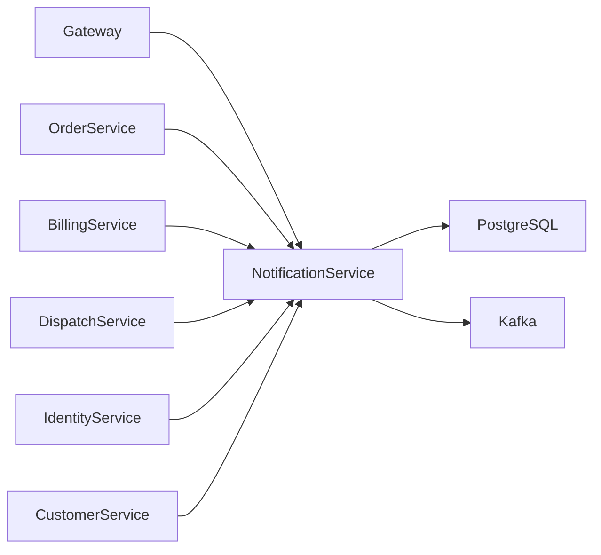
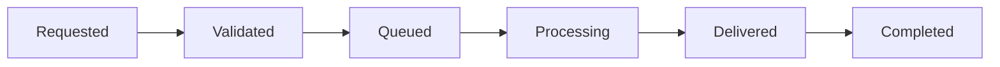
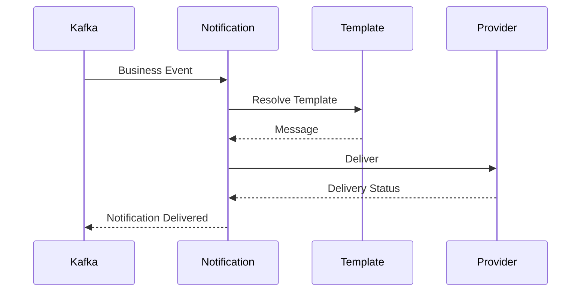
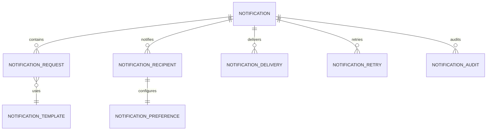
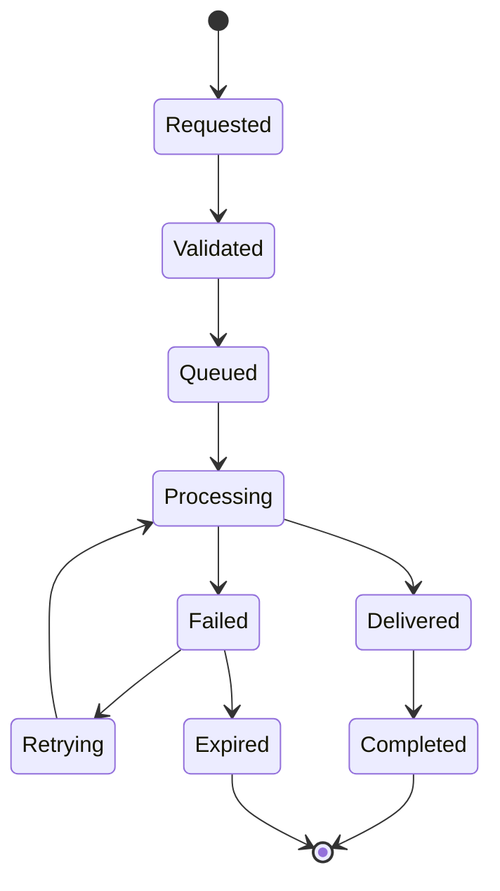
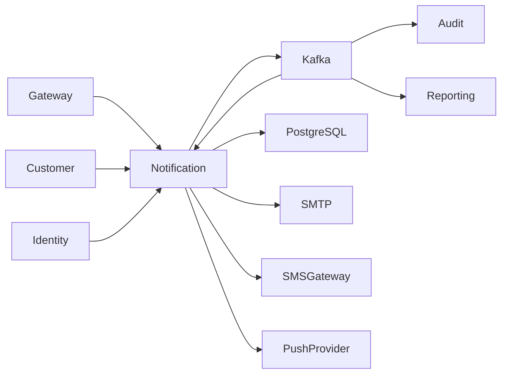

# SRS-010: Notification Service Software Requirements Specification

---

# 1. Document Information

| Field          | Value                                                    |
| -------------- | -------------------------------------------------------- |
| Project Name   | Distributed Hub and Sales (DHS) Platform                 |
| Service Name   | Notification Service                                     |
| Document Title | Notification Service Software Requirements Specification |
| Document ID    | SRS-010                                                  |
| Repository     | starone-dhs-platform                                     |
| Module         | notification-service                                     |
| Document Type  | Software Requirements Specification (SRS)                |
| Standard       | ISO/IEC/IEEE 29148                                       |
| Version        | v1.0.0                                                   |
| Status         | Draft                                                    |
| Author         | Sachin Salunke                                           |
| Owner          | Enterprise Architecture                                  |
| Last Updated   | 2026-06-27                                               |

---

# 2. Document Control

## 2.1 References

| Document         | Description                          |
| ---------------- | ------------------------------------ |
| BRD-001          | Business Requirements Document       |
| PRD-001          | Product Requirements Document        |
| ADR-001          | Architecture Decision Record         |
| HLD-001          | High-Level Design                    |
| FRD-Notification | Notification Functional Requirements |
| SRS-001          | Platform Foundation                  |
| SRS-007          | Order Service                        |
| SRS-008          | Billing Service                      |
| SRS-009          | Dispatch Service                     |

---

## 2.2 Revision History

| Version | Date       | Description     |
| ------- | ---------- | --------------- |
| v1.0.0  | 2026-06-27 | Initial Version |

---

## 2.3 Approval Matrix

| Role                 | Status  |
| -------------------- | ------- |
| Product Owner        | Pending |
| Enterprise Architect | Pending |
| Platform Lead        | Pending |
| QA Lead              | Pending |

---

# 3. Introduction

## 3.1 Purpose

The Notification Service shall manage the delivery of outbound communications across multiple channels for the DHS Platform.

The service shall consume domain events, resolve recipients and templates, select the appropriate communication channel, deliver notifications, manage retries, and maintain complete delivery history.

The Notification Service shall act as the authoritative source for notification delivery records.

---

## 3.2 Scope

The Notification Service includes:

- Notification Request Processing
- Template Management
- Recipient Resolution
- Email Notifications
- SMS Notifications
- Push Notifications
- Delivery Tracking
- Retry Processing
- Notification Preferences
- Notification Audit

---

## 3.3 Out of Scope

The Notification Service shall not provide:

- Business Decision Logic
- Order Management
- Billing Management
- Dispatch Management
- Customer Management
- Authentication

---

## 3.4 Definitions

| Term         | Description                                          |
| ------------ | ---------------------------------------------------- |
| Notification | Outbound communication generated by a business event |
| Template     | Message template used to compose notifications       |
| Channel      | Delivery mechanism such as Email, SMS or Push        |
| Recipient    | Intended receiver of the notification                |
| Delivery     | Attempt to send a notification                       |

---

## 3.5 Assumptions

- Notifications are triggered by business events.
- Templates exist before notification processing.
- Recipients can receive notifications through multiple channels.
- Delivery status shall be tracked for every notification.
- Failed notifications may be retried according to policy.

---

## 3.6 Constraints

- Notification identifiers shall be immutable.
- Notification history shall be retained for audit purposes.
- Notification requests shall be idempotent.
- Delivery failures shall not affect upstream business transactions.

---

# 4. Service Overview

## 4.1 Responsibilities

The Notification Service shall provide:

- Notification Processing
- Template Resolution
- Recipient Resolution
- Multi-channel Delivery
- Delivery Tracking
- Retry Management
- Notification Audit
- Notification Event Publishing

---

## 4.2 Service Context



---

## 4.3 Dependencies

| Dependency          | Purpose               |
| ------------------- | --------------------- |
| Platform Foundation | Shared Frameworks     |
| Gateway             | API Routing           |
| Eureka              | Service Discovery     |
| PostgreSQL          | Notification Database |
| Kafka               | Event Streaming       |
| Customer Service    | Recipient Information |
| Identity Service    | Authentication        |
| SMTP Provider       | Email Delivery        |
| SMS Provider        | SMS Delivery          |
| Push Provider       | Push Notifications    |

---

## 4.4 Upstream Services

| Service          | Purpose         |
| ---------------- | --------------- |
| Order Service    | Order Events    |
| Billing Service  | Billing Events  |
| Dispatch Service | Shipment Events |
| Identity Service | Security Events |

---

## 4.5 Downstream Services

| Service                    | Purpose              |
| -------------------------- | -------------------- |
| SMTP Provider              | Email Delivery       |
| SMS Gateway                | SMS Delivery         |
| Push Notification Provider | Mobile Push Delivery |

---

# 5. Business Process

## 5.1 Notification Lifecycle



---

## 5.2 Notification Workflow



---

# 6. Functional Requirements

## Notification Processing

### NT-SYS-001

The Notification Service shall consume business events from Kafka.

---

### NT-SYS-002

The Notification Service shall create notification requests.

---

### NT-SYS-003

The Notification Service shall resolve notification templates.

---

### NT-SYS-004

The Notification Service shall resolve recipients.

---

### NT-SYS-005

The Notification Service shall select the appropriate delivery channel.

---

### NT-SYS-006

The Notification Service shall deliver Email notifications.

---

### NT-SYS-007

The Notification Service shall deliver SMS notifications.

---

### NT-SYS-008

The Notification Service shall deliver Push notifications.

---

### NT-SYS-009

The Notification Service shall retry failed notifications.

---

### NT-SYS-010

The Notification Service shall maintain delivery history.

---

### NT-SYS-011

The Notification Service shall publish notification delivery events.

---

### NT-SYS-012

The Notification Service shall expose REST APIs for administration and operational monitoring.

---

# 7. Aggregate Root

The Notification domain shall follow Domain-Driven Design.

```text
Notification
│
├── NotificationRequest
├── NotificationRecipient
├── NotificationTemplate
├── NotificationChannel
├── NotificationDelivery
├── NotificationPreference
├── NotificationRetry
└── NotificationAudit
```

The Notification Aggregate shall exclusively control modifications to all subordinate entities.

---

# 8. Business Rules

The Notification Service shall enforce the following business rules to ensure reliable, secure, configurable, and auditable notification delivery.

---

# 8.1 Notification Request Rules

### NT-BR-001

Every Notification Request shall have a unique Notification Identifier.

---

### NT-BR-002

Notification Identifier shall remain immutable.

---

### NT-BR-003

Every Notification Request shall originate from a valid business event or an authorized API request.

---

### NT-BR-004

Duplicate notification requests having the same Correlation ID and Event ID shall not be processed more than once.

---

### NT-BR-005

Notification processing shall be idempotent.

---

# 8.2 Recipient Rules

### NT-BR-006

Every Notification shall have at least one Recipient.

---

### NT-BR-007

Recipients shall be validated before delivery.

---

### NT-BR-008

A Notification may contain multiple recipients.

---

### NT-BR-009

Recipients may belong to different delivery channels.

---

# 8.3 Template Rules

### NT-BR-010

Every Notification shall use an approved Template.

---

### NT-BR-011

Templates shall be version controlled.

---

### NT-BR-012

Inactive Templates shall not be used.

---

### NT-BR-013

Template placeholders shall be completely resolved before delivery.

---

# 8.4 Channel Rules

### NT-BR-014

Supported Notification Channels shall include:

- Email
- SMS
- Push Notification
- WhatsApp (Future)
- Web Notification (Future)

---

### NT-BR-015

Channel selection shall respect Recipient Preferences.

---

### NT-BR-016

Multiple delivery channels may be used for a single Notification.

---

### NT-BR-017

Channel failures shall not prevent delivery through alternative configured channels.

---

# 8.5 Delivery Rules

### NT-BR-018

Every delivery attempt shall be recorded.

---

### NT-BR-019

Successful deliveries shall update Notification Status.

---

### NT-BR-020

Failed deliveries shall invoke the Retry Policy.

---

### NT-BR-021

Maximum Retry Count shall be configurable.

---

### NT-BR-022

Expired notifications shall not be retried.

---

# 8.6 Notification Preference Rules

### NT-BR-023

Recipients may configure preferred notification channels.

---

### NT-BR-024

Recipients may opt out of non-mandatory notifications.

---

### NT-BR-025

Critical system notifications shall ignore opt-out preferences.

---

# 8.7 Audit Rules

### NT-BR-026

Every notification event shall generate an audit record.

---

### NT-BR-027

Audit history shall never be physically deleted.

---

### NT-BR-028

Notification delivery history shall be retained according to enterprise retention policies.

---

# 9. REST API Specification

Base URL

```text
/api/v1/notifications
```

All APIs shall be exposed through the DHS API Gateway.

---

# 9.1 API Overview

| Method | URI                       | Description                  |
| ------ | ------------------------- | ---------------------------- |
| POST   | /send                     | Send Notification            |
| POST   | /bulk                     | Send Bulk Notifications      |
| GET    | /{notificationId}         | Get Notification             |
| GET    | /                         | Search Notifications         |
| GET    | /status/{notificationId}  | Notification Status          |
| POST   | /retry/{notificationId}   | Retry Notification           |
| POST   | /template                 | Create Template              |
| PUT    | /template/{templateId}    | Update Template              |
| GET    | /template                 | Search Templates             |
| GET    | /template/{templateId}    | Get Template                 |
| POST   | /preference               | Save Notification Preference |
| GET    | /preference/{recipientId} | Get Notification Preference  |

---

# 9.2 Request Headers

| Header           | Required | Description            |
| ---------------- | -------- | ---------------------- |
| Authorization    | Yes      | JWT Bearer Token       |
| X-Correlation-ID | Yes      | Correlation Identifier |
| Content-Type     | Yes      | application/json       |
| Accept           | Yes      | application/json       |

---

# 9.3 Query Parameters

| Parameter        | Required | Description       |
| ---------------- | -------- | ----------------- |
| page             | No       | Page Number       |
| size             | No       | Page Size         |
| sort             | No       | Sort Field        |
| direction        | No       | ASC or DESC       |
| notificationType | No       | Notification Type |
| channel          | No       | Delivery Channel  |
| status           | No       | Delivery Status   |
| fromDate         | No       | Created Date From |
| toDate           | No       | Created Date To   |

---

# 9.4 Path Parameters

| Parameter      | Description             |
| -------------- | ----------------------- |
| notificationId | Notification Identifier |
| templateId     | Template Identifier     |
| recipientId    | Recipient Identifier    |

---

# 9.5 Send Notification API

```http
POST /api/v1/notifications/send
```

Request

```json
{
  "eventType": "ORDER_CREATED",
  "recipientId": "UUID",
  "channel": "EMAIL",
  "templateCode": "ORDER_CREATED",
  "variables": {
    "customerName": "John Doe",
    "orderNumber": "ORD000001"
  }
}
```

Response

```json
{
  "notificationId": "UUID",
  "status": "QUEUED"
}
```

---

# 9.6 Retry Notification API

```http
POST /api/v1/notifications/retry/{notificationId}
```

Retries delivery according to the configured retry policy.

---

# 9.7 Create Template API

```http
POST /api/v1/notifications/template
```

Creates a Notification Template.

---

# 9.8 Save Notification Preference API

```http
POST /api/v1/notifications/preference
```

Stores recipient notification preferences.

---

# 9.9 Search Notification API

```http
GET /api/v1/notifications
```

Supports:

- Pagination
- Sorting
- Filtering
- Channel
- Status
- Date Range

---

# 10. Request Models

## SendNotificationRequest

| Field        | Type                | Required |
| ------------ | ------------------- | -------- |
| eventType    | String              | Yes      |
| recipientId  | UUID                | Yes      |
| channel      | NotificationChannel | Yes      |
| templateCode | String              | Yes      |
| variables    | Map<String,Object>  | Yes      |

---

## BulkNotificationRequest

| Field        | Type                | Required |
| ------------ | ------------------- | -------- |
| recipients   | List<UUID>          | Yes      |
| channel      | NotificationChannel | Yes      |
| templateCode | String              | Yes      |
| variables    | Map<String,Object>  | Yes      |

---

## TemplateRequest

| Field        | Type                | Required |
| ------------ | ------------------- | -------- |
| templateCode | String              | Yes      |
| templateName | String              | Yes      |
| subject      | String              | No       |
| body         | String              | Yes      |
| channel      | NotificationChannel | Yes      |

---

## NotificationPreferenceRequest

| Field        | Type    | Required |
| ------------ | ------- | -------- |
| recipientId  | UUID    | Yes      |
| emailEnabled | Boolean | Yes      |
| smsEnabled   | Boolean | Yes      |
| pushEnabled  | Boolean | Yes      |

---

# 11. Response Models

## NotificationResponse

| Field          | Type                |
| -------------- | ------------------- |
| notificationId | UUID                |
| status         | NotificationStatus  |
| channel        | NotificationChannel |
| recipientId    | UUID                |
| createdAt      | Timestamp           |

---

## TemplateResponse

| Field           | Type           |
| --------------- | -------------- |
| templateId      | UUID           |
| templateCode    | String         |
| templateVersion | Integer        |
| status          | TemplateStatus |

---

## NotificationPreferenceResponse

| Field        | Type    |
| ------------ | ------- |
| recipientId  | UUID    |
| emailEnabled | Boolean |
| smsEnabled   | Boolean |
| pushEnabled  | Boolean |

---

# 12. Validation Rules

## Notification Request

- Recipient shall exist.
- Channel shall be supported.
- Template shall exist.
- Template shall be Active.
- Mandatory template variables shall be provided.

---

## Template Validation

- Template Code shall be unique.
- Template Body shall not be empty.
- Channel shall be supported.

---

## Notification Preference Validation

- Recipient shall exist.
- At least one notification channel shall be enabled.

---

## Retry Validation

- Notification shall exist.
- Retry Count shall be below configured maximum.
- Notification shall not be expired.

---

# 13. Permission Matrix

| API                 | Super Admin | Notification Admin | Operations | Viewer |
| ------------------- | ----------- | ------------------ | ---------- | ------ |
| Send Notification   | ✅          | ✅                 | ✅         | ❌     |
| Bulk Notification   | ✅          | ✅                 | ❌         | ❌     |
| Retry Notification  | ✅          | ✅                 | ✅         | ❌     |
| Create Template     | ✅          | ✅                 | ❌         | ❌     |
| Update Template     | ✅          | ✅                 | ❌         | ❌     |
| View Template       | ✅          | ✅                 | ✅         | ✅     |
| Save Preference     | ✅          | ✅                 | ✅         | ❌     |
| View Preference     | ✅          | ✅                 | ✅         | ✅     |
| Search Notification | ✅          | ✅                 | ✅         | ✅     |

---

# 14. Standard HTTP Status Codes

| Status | Description                        |
| ------ | ---------------------------------- |
| 200    | Success                            |
| 201    | Created                            |
| 202    | Accepted for Processing            |
| 400    | Validation Error                   |
| 401    | Unauthorized                       |
| 403    | Forbidden                          |
| 404    | Notification or Template Not Found |
| 409    | Duplicate Notification             |
| 422    | Business Rule Violation            |
| 500    | Internal Server Error              |

---

# 15. Aggregate Model

The Notification Service shall implement the Notification domain using Domain-Driven Design (DDD).

The **Notification** entity shall be the Aggregate Root and shall exclusively control the lifecycle of all subordinate entities.

No child entity shall be modified independently of the Notification Aggregate.

---

## 15.1 Notification Aggregate

```text
Notification
│
├── NotificationRequest
├── NotificationRecipient
├── NotificationTemplate
├── NotificationChannel
├── NotificationDelivery
├── NotificationPreference
├── NotificationRetry
└── NotificationAudit
```

---

## Aggregate Responsibilities

| Aggregate              | Responsibility                  |
| ---------------------- | ------------------------------- |
| Notification           | Aggregate Root                  |
| NotificationRequest    | Notification Request Processing |
| NotificationRecipient  | Recipient Information           |
| NotificationTemplate   | Template Management             |
| NotificationChannel    | Delivery Channel Configuration  |
| NotificationDelivery   | Delivery Status Tracking        |
| NotificationPreference | User Preferences                |
| NotificationRetry      | Retry Management                |
| NotificationAudit      | Audit Trail                     |

---

# 16. Entity Model

## 16.1 Entity Overview

| Entity                 | Description           |
| ---------------------- | --------------------- |
| Notification           | Aggregate Root        |
| NotificationRequest    | Notification Request  |
| NotificationRecipient  | Recipient Information |
| NotificationTemplate   | Message Template      |
| NotificationChannel    | Channel Configuration |
| NotificationDelivery   | Delivery Attempt      |
| NotificationPreference | Recipient Preferences |
| NotificationRetry      | Retry History         |
| NotificationAudit      | Audit History         |

---

## 16.2 Notification Entity

| Attribute          | Type         | Constraint    |
| ------------------ | ------------ | ------------- |
| id                 | UUID         | Primary Key   |
| notificationNumber | VARCHAR(30)  | Unique        |
| correlationId      | UUID         | Required      |
| eventId            | UUID         | Required      |
| eventType          | VARCHAR(100) | Required      |
| notificationType   | ENUM         | Required      |
| status             | ENUM         | Required      |
| priority           | ENUM         | Required      |
| createdBy          | UUID         | Required      |
| createdAt          | TIMESTAMP    | Required      |
| updatedBy          | UUID         | Required      |
| updatedAt          | TIMESTAMP    | Required      |
| deleted            | BOOLEAN      | Default FALSE |

---

## 16.3 Notification Request

| Attribute      | Type      |
| -------------- | --------- |
| id             | UUID      |
| notificationId | UUID      |
| templateId     | UUID      |
| recipientId    | UUID      |
| channel        | ENUM      |
| payload        | JSONB     |
| scheduledAt    | TIMESTAMP |

---

## 16.4 Notification Recipient

| Attribute      | Type         |
| -------------- | ------------ |
| id             | UUID         |
| notificationId | UUID         |
| recipientId    | UUID         |
| recipientType  | ENUM         |
| recipientName  | VARCHAR(150) |
| email          | VARCHAR(255) |
| mobileNumber   | VARCHAR(20)  |

---

## 16.5 Notification Template

| Attribute    | Type         |
| ------------ | ------------ |
| id           | UUID         |
| templateCode | VARCHAR(100) |
| templateName | VARCHAR(200) |
| channel      | ENUM         |
| subject      | VARCHAR(255) |
| body         | TEXT         |
| version      | INTEGER      |
| status       | ENUM         |

---

## 16.6 Notification Delivery

| Attribute         | Type         |
| ----------------- | ------------ |
| id                | UUID         |
| notificationId    | UUID         |
| channel           | ENUM         |
| provider          | VARCHAR(100) |
| deliveryStatus    | ENUM         |
| deliveredAt       | TIMESTAMP    |
| providerReference | VARCHAR(255) |

---

## 16.7 Notification Preference

| Attribute         | Type        |
| ----------------- | ----------- |
| id                | UUID        |
| recipientId       | UUID        |
| emailEnabled      | BOOLEAN     |
| smsEnabled        | BOOLEAN     |
| pushEnabled       | BOOLEAN     |
| preferredLanguage | VARCHAR(10) |
| preferredTimezone | VARCHAR(50) |

---

## 16.8 Notification Retry

| Attribute      | Type         |
| -------------- | ------------ |
| id             | UUID         |
| notificationId | UUID         |
| retryNumber    | INTEGER      |
| retryReason    | VARCHAR(255) |
| retryTime      | TIMESTAMP    |
| retryStatus    | ENUM         |

---

## 16.9 Notification Audit

| Attribute      | Type         |
| -------------- | ------------ |
| id             | UUID         |
| notificationId | UUID         |
| eventType      | VARCHAR(100) |
| eventSource    | VARCHAR(100) |
| correlationId  | UUID         |
| eventTime      | TIMESTAMP    |

---

# 17. Database Design

Database

```text
notification_db
```

Schema

```text
notification
```

---

## 17.1 Tables

| Table                   | Purpose               |
| ----------------------- | --------------------- |
| notification            | Notification Master   |
| notification_request    | Notification Requests |
| notification_recipient  | Recipient Details     |
| notification_template   | Templates             |
| notification_delivery   | Delivery History      |
| notification_preference | User Preferences      |
| notification_retry      | Retry History         |
| notification_audit      | Audit Trail           |

---

## 17.2 Primary Keys

All tables shall use UUID as the Primary Key.

---

## 17.3 Foreign Keys

| Child Table             | Parent Table           |
| ----------------------- | ---------------------- |
| notification_request    | notification           |
| notification_recipient  | notification           |
| notification_delivery   | notification           |
| notification_retry      | notification           |
| notification_audit      | notification           |
| notification_request    | notification_template  |
| notification_preference | notification_recipient |

---

## 17.4 Constraints

Notification

- Notification Number UNIQUE
- Correlation ID Required
- Event ID Required

Notification Template

- Template Code UNIQUE
- Version Required

Notification Delivery

- One Delivery Record per Channel

Notification Preference

- One Preference Record per Recipient

---

## 17.5 Indexes

| Table                 | Index               |
| --------------------- | ------------------- |
| notification          | notification_number |
| notification          | correlation_id      |
| notification          | event_type          |
| notification          | status              |
| notification_request  | recipient_id        |
| notification_delivery | delivery_status     |
| notification_template | template_code       |
| notification_retry    | retry_time          |

---

# 18. Entity Relationship Diagram



---

# 19. Notification State Machine



---

# 20. Security Requirements

The Notification Service shall rely on the Identity Service for authentication and authorization.

---

## Authentication

### NT-SEC-001

Every request shall contain a valid JWT Access Token.

---

### NT-SEC-002

Authentication shall be delegated to the Identity Service.

---

### NT-SEC-003

Unauthenticated requests shall return HTTP 401.

---

## Authorization

### NT-SEC-004

Notification APIs shall enforce Role-Based Access Control.

---

### NT-SEC-005

Administrative operations shall require elevated privileges.

---

### NT-SEC-006

Unauthorized requests shall return HTTP 403.

---

## Data Security

### NT-SEC-007

All communication shall use TLS 1.3.

---

### NT-SEC-008

Notification templates shall be version controlled.

---

### NT-SEC-009

Notification audit records shall be immutable.

---

### NT-SEC-010

Sensitive recipient information shall be encrypted at rest.

---

# 21. Event Specification

The Notification Service shall publish events for notification processing and delivery.

---

## 21.1 Published Events

| Topic                     | Event                 |
| ------------------------- | --------------------- |
| notification.requested.v1 | NotificationRequested |
| notification.queued.v1    | NotificationQueued    |
| notification.sent.v1      | NotificationSent      |
| notification.delivered.v1 | NotificationDelivered |
| notification.failed.v1    | NotificationFailed    |
| notification.retry.v1     | NotificationRetried   |
| notification.completed.v1 | NotificationCompleted |

---

## 21.2 Consumed Events

| Topic                  | Source           |
| ---------------------- | ---------------- |
| order.created.v1       | Order Service    |
| order.completed.v1     | Order Service    |
| payment.completed.v1   | Billing Service  |
| shipment.dispatched.v1 | Dispatch Service |
| shipment.delivered.v1  | Dispatch Service |
| user.password.reset.v1 | Identity Service |

---

## 21.3 Standard Event Structure

```json
{
  "eventId": "UUID",
  "eventType": "NotificationDelivered",
  "eventVersion": "1.0",
  "occurredAt": "2026-06-27T10:30:00Z",
  "correlationId": "UUID",
  "payload": {}
}
```

---

# 22. External Interfaces

| Interface     | Purpose                    |
| ------------- | -------------------------- |
| API Gateway   | Request Routing            |
| Kafka         | Event Streaming            |
| PostgreSQL    | Persistent Storage         |
| SMTP Server   | Email Delivery             |
| SMS Gateway   | SMS Delivery               |
| Push Provider | Push Notification Delivery |

---

# 23. OpenFeign Clients

| Client         | Purpose                                |
| -------------- | -------------------------------------- |
| CustomerClient | Retrieve Recipient Contact Information |
| IdentityClient | Validate User Information              |

> Business notifications shall primarily be initiated through Kafka events. OpenFeign shall be used only for recipient lookup and administrative operations.

---

# 24. Configuration

Configuration shall be externalized using the centralized configuration repository.

---

## Configuration Categories

- Server
- Database
- Kafka
- Security
- Logging
- OpenFeign
- SMTP
- SMS
- Push Notification
- Retry
- Template
- Notification
- Observability

---

## Configuration Properties

| Property                            | Default | Required | Description                     |
| ----------------------------------- | ------- | -------- | ------------------------------- |
| notification.retry.max-attempts     | 5       | Yes      | Maximum Retry Attempts          |
| notification.retry.backoff-ms       | 30000   | Yes      | Retry Interval                  |
| notification.batch.size             | 100     | Yes      | Batch Processing Size           |
| notification.queue.size             | 10000   | Yes      | Queue Capacity                  |
| notification.template.cache.enabled | true    | Yes      | Enable Template Cache           |
| notification.template.cache.ttl     | 3600    | Yes      | Cache TTL (seconds)             |
| notification.smtp.timeout           | 30      | Yes      | SMTP Timeout (seconds)          |
| notification.sms.timeout            | 30      | Yes      | SMS Provider Timeout (seconds)  |
| notification.push.timeout           | 30      | Yes      | Push Provider Timeout (seconds) |

---

# 25. Service Context Diagram



---

# 26. Error Handling

The Notification Service shall provide standardized error handling for all notification processing, delivery, retry, and template management operations.

All error responses shall comply with the Platform Foundation error model defined in **SRS-001 – Platform Foundation**.

---

## 26.1 Functional Requirements

### NT-SYS-013

The Notification Service shall return standardized error responses.

---

### NT-SYS-014

Business exceptions shall be distinguishable from technical exceptions.

---

### NT-SYS-015

Every error response shall include a Correlation ID.

---

### NT-SYS-016

Unhandled exceptions shall return HTTP 500.

---

### NT-SYS-017

Internal implementation details shall never be exposed to API consumers.

---

### NT-SYS-018

Notification delivery failures shall invoke the configured retry policy.

---

## 26.2 Standard Error Response

```json
{
  "timestamp": "2026-06-27T10:30:00Z",
  "status": 422,
  "error": "Notification Delivery Failed",
  "code": "NT-BUS-001",
  "message": "Email provider rejected the delivery request.",
  "correlationId": "UUID",
  "path": "/api/v1/notifications/send"
}
```

---

## 26.3 Business Error Catalog

| Error Code  | Description                     | HTTP Status |
| ----------- | ------------------------------- | ----------- |
| NT-VAL-001  | Validation Failed               | 400         |
| NT-AUTH-001 | Authentication Required         | 401         |
| NT-AUTH-002 | Access Denied                   | 403         |
| NT-BUS-001  | Notification Delivery Failed    | 422         |
| NT-BUS-002  | Notification Not Found          | 404         |
| NT-BUS-003  | Template Not Found              | 404         |
| NT-BUS-004  | Recipient Not Found             | 404         |
| NT-BUS-005  | Template Inactive               | 409         |
| NT-BUS-006  | Channel Not Supported           | 422         |
| NT-BUS-007  | Retry Limit Exceeded            | 409         |
| NT-BUS-008  | Invalid Notification Preference | 422         |
| NT-BUS-009  | Notification Expired            | 409         |
| NT-SYS-001  | Internal Server Error           | 500         |

---

# 27. Logging Requirements

The Notification Service shall use the Platform Foundation logging framework.

---

## 27.1 Functional Requirements

### NT-SYS-019

Notification requests shall generate audit logs.

---

### NT-SYS-020

Notification deliveries shall generate audit logs.

---

### NT-SYS-021

Notification retries shall generate audit logs.

---

### NT-SYS-022

Template modifications shall generate audit logs.

---

### NT-SYS-023

Notification preference updates shall generate audit logs.

---

### NT-SYS-024

Business and technical exceptions shall be logged.

---

## 27.2 Log Attributes

Every log entry shall include:

- Timestamp
- Service Name
- Correlation ID
- Trace ID
- Span ID
- Notification ID
- Recipient ID
- Template Code
- Delivery Channel
- Delivery Status
- HTTP Method
- Request URI
- HTTP Status
- Processing Time

---

## 27.3 Sensitive Information

The following information shall never be logged:

- JWT Tokens
- Authorization Headers
- Email Body Content
- SMS Content
- Push Notification Payload
- SMTP Credentials
- SMS Provider Credentials
- Encryption Keys

---

# 28. Observability Requirements

The Notification Service shall expose operational metrics through the Platform Foundation.

---

## 28.1 Functional Requirements

### NT-SYS-025

The Notification Service shall expose Health endpoints.

---

### NT-SYS-026

The Notification Service shall expose Metrics endpoints.

---

### NT-SYS-027

The Notification Service shall support Distributed Tracing.

---

### NT-SYS-028

Every notification request shall propagate Correlation IDs.

---

### NT-SYS-029

Notification delivery metrics shall be published.

---

## 28.2 Business Metrics

The Notification Service shall publish:

- Total Notifications Created
- Notifications Queued
- Notifications Delivered
- Failed Notifications
- Retried Notifications
- Expired Notifications
- Email Deliveries
- SMS Deliveries
- Push Deliveries
- Average Delivery Time
- Notification API Response Time
- Provider Failure Rate

---

# 29. Non-Functional Requirements

## 29.1 Performance

### NT-NFR-001

Notification request creation shall complete within 300 milliseconds.

---

### NT-NFR-002

Notification queue processing shall begin within 5 seconds.

---

### NT-NFR-003

Notification search shall support pagination, filtering and sorting within 500 milliseconds.

---

## 29.2 Availability

### NT-NFR-004

The Notification Service shall maintain at least 99.9% availability.

---

### NT-NFR-005

The Notification Service shall support horizontal scaling.

---

## 29.3 Reliability

### NT-NFR-006

Notification requests shall be durable.

---

### NT-NFR-007

Notification events shall guarantee at-least-once delivery.

---

### NT-NFR-008

Notification processing shall be idempotent.

---

### NT-NFR-009

Retry processing shall resume automatically after service recovery.

---

## 29.4 Scalability

### NT-NFR-010

The Notification Service shall support concurrent notification processing.

---

### NT-NFR-011

The Notification Service shall support high-volume event-driven workloads.

---

## 29.5 Security

### NT-NFR-012

All communication shall use TLS 1.3.

---

### NT-NFR-013

Administrative APIs shall enforce Role-Based Access Control.

---

### NT-NFR-014

Sensitive recipient information shall be encrypted at rest.

---

### NT-NFR-015

Notification audit history shall be immutable.

---

## 29.6 Maintainability

### NT-NFR-016

The Notification Service shall use Platform Foundation shared libraries.

---

### NT-NFR-017

The Notification Service shall comply with enterprise coding standards.

---

# 30. Requirement Traceability Matrix

| Requirement             | Source Document             | Verification                                |
| ----------------------- | --------------------------- | ------------------------------------------- |
| NT-SYS-001 – NT-SYS-012 | FRD-Notification            | Functional Testing                          |
| NT-SYS-013 – NT-SYS-029 | SRS-001 Platform Foundation | Integration Testing                         |
| NT-NFR-001 – NT-NFR-017 | PRD / HLD                   | Performance, Reliability & Security Testing |

---

# 31. Testability Matrix

| Requirement | Test Case |
| ----------- | --------- |
| NT-SYS-001  | TC-NT-001 |
| NT-SYS-002  | TC-NT-002 |
| NT-SYS-003  | TC-NT-003 |
| NT-SYS-004  | TC-NT-004 |
| NT-SYS-005  | TC-NT-005 |
| NT-SYS-006  | TC-NT-006 |
| NT-SYS-007  | TC-NT-007 |
| NT-SYS-008  | TC-NT-008 |
| NT-SYS-009  | TC-NT-009 |
| NT-SYS-010  | TC-NT-010 |
| NT-SYS-011  | TC-NT-011 |
| NT-SYS-012  | TC-NT-012 |

---

# 32. Acceptance Criteria

The Notification Service shall be considered complete when:

- Notification requests are processed successfully.
- Templates are resolved correctly.
- Recipient information is resolved successfully.
- Email notifications are delivered successfully.
- SMS notifications are delivered successfully.
- Push notifications are delivered successfully.
- Retry processing functions according to configuration.
- Notification preferences are honored.
- Notification delivery history is maintained.
- Notification events are published successfully.
- Standardized error responses are returned.
- Logging and observability are operational.
- Health endpoints are operational.
- Performance objectives are achieved.
- Security requirements are satisfied.
- Functional, integration and non-functional tests pass.

---

# 33. Appendices

## Appendix A – API Summary

| Resource     | Endpoints                       |
| ------------ | ------------------------------- |
| Notification | Send, Retry, Search, Get Status |
| Template     | Create, Update, Search, Get     |
| Preference   | Save, Update, Get               |
| Delivery     | Delivery Status                 |

---

## Appendix B – Aggregate Summary

| Aggregate              | Description           |
| ---------------------- | --------------------- |
| Notification           | Aggregate Root        |
| NotificationRequest    | Notification Request  |
| NotificationRecipient  | Recipient Information |
| NotificationTemplate   | Message Template      |
| NotificationChannel    | Channel Configuration |
| NotificationDelivery   | Delivery Tracking     |
| NotificationPreference | Recipient Preferences |
| NotificationRetry      | Retry History         |
| NotificationAudit      | Audit Trail           |

---

## Appendix C – Service Dependencies

| Dependency          | Purpose                        |
| ------------------- | ------------------------------ |
| Platform Foundation | Shared Frameworks              |
| Gateway             | API Routing                    |
| Eureka              | Service Discovery              |
| PostgreSQL          | Persistent Storage             |
| Kafka               | Event Streaming                |
| Identity Service    | Authentication & Authorization |
| Customer Service    | Recipient Resolution           |
| SMTP Provider       | Email Delivery                 |
| SMS Gateway         | SMS Delivery                   |
| Push Provider       | Push Notification Delivery     |
| Audit Service       | Audit Processing               |
| Reporting Service   | Notification Analytics         |

---

## Appendix D – Revision History

| Version | Description                                                      |
| ------- | ---------------------------------------------------------------- |
| v1.0.0  | Initial Notification Service Software Requirements Specification |

---

# 34. Document Sign-off

| Role                 | Status  |
| -------------------- | ------- |
| Product Owner        | Pending |
| Enterprise Architect | Pending |
| Platform Lead        | Pending |
| Security Lead        | Pending |
| QA Lead              | Pending |

---

# End of Document
