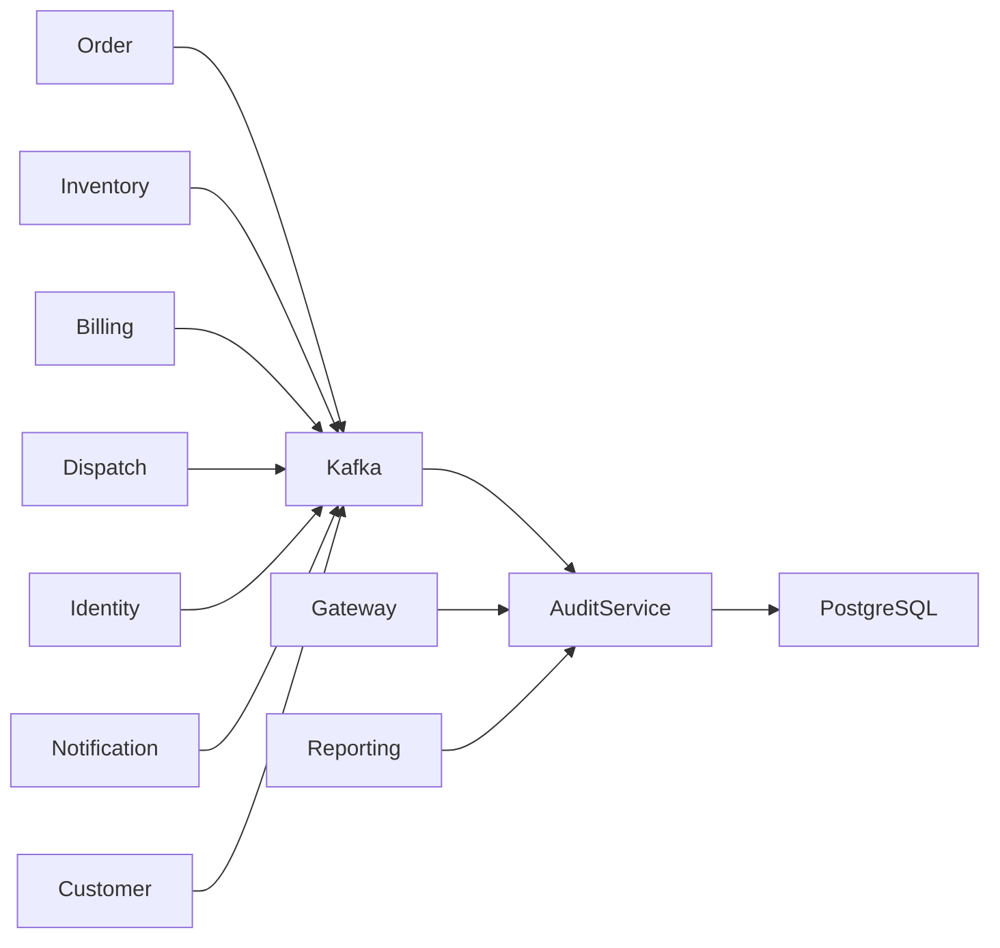
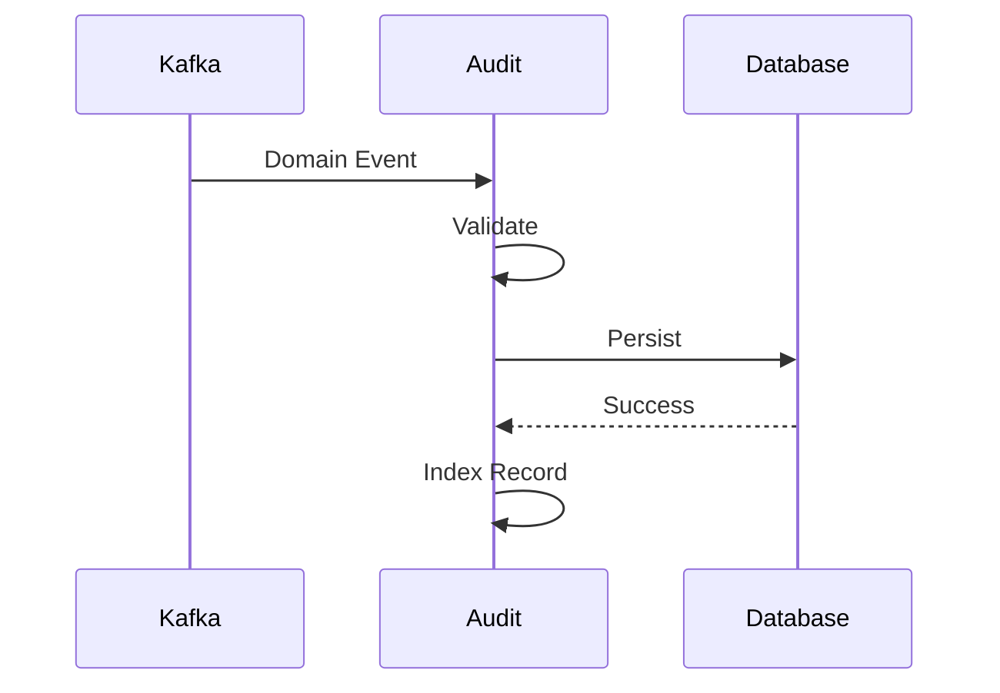
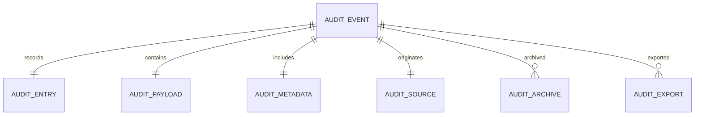
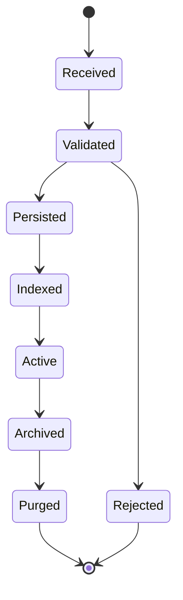
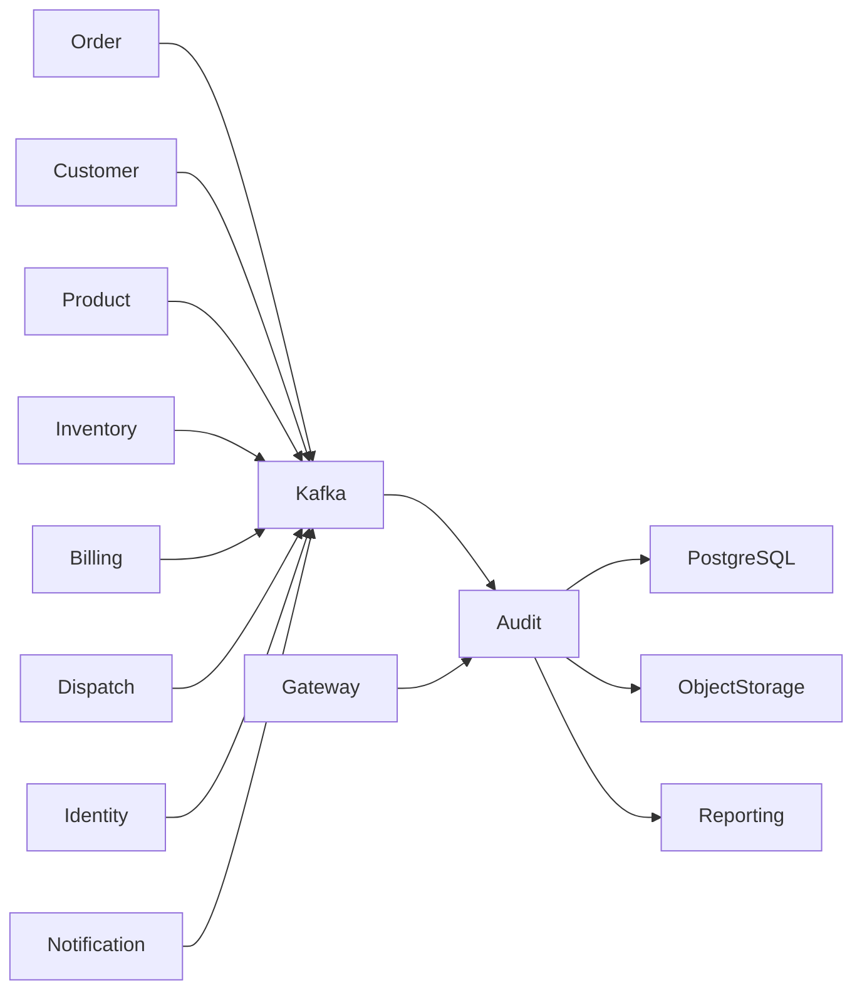

# SRS-011: Audit Service Software Requirements Specification

---

# 1. Document Information

| Field          | Value                                             |
| -------------- | ------------------------------------------------- |
| Project Name   | Distributed Hub and Sales (DHS) Platform          |
| Service Name   | Audit Service                                     |
| Document Title | Audit Service Software Requirements Specification |
| Document ID    | SRS-011                                           |
| Repository     | starone-dhs-platform                              |
| Module         | audit-service                                     |
| Document Type  | Software Requirements Specification (SRS)         |
| Standard       | ISO/IEC/IEEE 29148                                |
| Version        | v1.0.0                                            |
| Status         | Draft                                             |
| Author         | Sachin Salunke                                    |
| Owner          | Enterprise Architecture                           |
| Last Updated   | 2026-06-27                                        |

---

# 2. Document Control

## 2.1 References

| Document  | Description                    |
| --------- | ------------------------------ |
| BRD-001   | Business Requirements Document |
| PRD-001   | Product Requirements Document  |
| ADR-001   | Architecture Decision Record   |
| HLD-001   | High-Level Design              |
| FRD-Audit | Audit Functional Requirements  |
| SRS-001   | Platform Foundation            |
| SRS-007   | Order Service                  |
| SRS-008   | Billing Service                |
| SRS-009   | Dispatch Service               |
| SRS-010   | Notification Service           |

---

## 2.2 Revision History

| Version | Date       | Description     |
| ------- | ---------- | --------------- |
| v1.0.0  | 2026-06-27 | Initial Version |

---

## 2.3 Approval Matrix

| Role                 | Status  |
| -------------------- | ------- |
| Product Owner        | Pending |
| Enterprise Architect | Pending |
| Platform Lead        | Pending |
| QA Lead              | Pending |

---

# 3. Introduction

## 3.1 Purpose

The Audit Service shall provide centralized, immutable, and searchable audit logging for all business and platform services within the DHS Platform.

The service shall consume domain events, persist audit records, support compliance reporting, enforce retention policies, and provide secure audit search and export capabilities.

The Audit Service shall act as the authoritative source for audit history across the platform.

---

## 3.2 Scope

The Audit Service includes:

- Business Audit Logging
- Security Audit Logging
- API Audit Logging
- User Activity Audit
- Event Audit Processing
- Correlation Tracking
- Audit Search
- Audit Export
- Audit Retention
- Audit Archival

---

## 3.3 Out of Scope

The Audit Service shall not provide:

- Business Decision Logic
- Order Management
- Billing Management
- Inventory Management
- Customer Management
- Authentication
- Authorization

---

## 3.4 Definitions

| Term             | Description                                       |
| ---------------- | ------------------------------------------------- |
| Audit Event      | Immutable record of a business or technical event |
| Correlation ID   | Identifier linking related operations             |
| Retention Policy | Rules governing audit record retention            |
| Archive          | Long-term storage of historical audit records     |
| Export           | Secure extraction of audit data                   |

---

## 3.5 Assumptions

- All business services publish audit-worthy events to Kafka.
- Every event includes a Correlation ID.
- Audit records are immutable after persistence.
- Retention policies are centrally configured.

---

## 3.6 Constraints

- Audit records shall never be updated.
- Audit records shall never be physically deleted before retention expiration.
- Every audit record shall be timestamped.
- Every audit record shall be traceable to its originating service.

---

# 4. Service Overview

## 4.1 Responsibilities

The Audit Service shall provide:

- Audit Event Consumption
- Audit Persistence
- Audit Search
- Audit Export
- Retention Management
- Archival Processing

---

## 4.2 Service Context



---

## 4.3 Dependencies

| Dependency          | Purpose           |
| ------------------- | ----------------- |
| Platform Foundation | Shared Frameworks |
| Gateway             | API Routing       |
| Eureka              | Service Discovery |
| PostgreSQL          | Audit Database    |
| Kafka               | Event Streaming   |

---

## 4.4 Upstream Services

| Service              | Purpose          |
| -------------------- | ---------------- |
| Order Service        | Business Events  |
| Billing Service      | Financial Events |
| Inventory Service    | Inventory Events |
| Customer Service     | Customer Events  |
| Dispatch Service     | Shipment Events  |
| Identity Service     | Security Events  |
| Notification Service | Delivery Events  |

---

## 4.5 Downstream Services

| Service           | Purpose              |
| ----------------- | -------------------- |
| Reporting Service | Compliance Reporting |
| BI Platform       | Analytics            |
| External Archive  | Long-term Retention  |

---

# 5. Business Process

## 5.1 Audit Lifecycle


---

## 5.2 Audit Workflow



---

# 6. Functional Requirements

## Audit Processing

### AU-SYS-001

The Audit Service shall consume business events from Kafka.

---

### AU-SYS-002

The Audit Service shall validate incoming audit events.

---

### AU-SYS-003

The Audit Service shall persist immutable audit records.

---

### AU-SYS-004

The Audit Service shall index audit records for search.

---

### AU-SYS-005

The Audit Service shall support audit searches.

---

### AU-SYS-006

The Audit Service shall support audit exports.

---

### AU-SYS-007

The Audit Service shall archive expired audit records.

---

### AU-SYS-008

The Audit Service shall enforce retention policies.

---

### AU-SYS-009

The Audit Service shall expose secure REST APIs for audit administration and search.

---

### AU-SYS-010

The Audit Service shall publish audit lifecycle events where required.

---

# 7. Aggregate Root

```text
Audit
│
├── AuditEvent
├── AuditEntry
├── AuditPayload
├── AuditMetadata
├── AuditSource
├── AuditRetention
├── AuditArchive
└── AuditExport
```

The Audit Aggregate shall exclusively manage all audit entities and preserve immutability throughout the audit lifecycle.

---

# 8. Business Rules

The Audit Service shall enforce the following business rules to ensure immutability, traceability, compliance, and regulatory audit requirements.

---

# 8.1 Audit Event Rules

### AU-BR-001

Every Audit Event shall have a globally unique Audit Event Identifier.

---

### AU-BR-002

Every Audit Event shall contain a Correlation ID.

---

### AU-BR-003

Every Audit Event shall contain an Event Timestamp.

---

### AU-BR-004

Every Audit Event shall identify the originating service.

---

### AU-BR-005

Every Audit Event shall identify the originating user when available.

---

### AU-BR-006

Audit Events shall be immutable after persistence.

---

### AU-BR-007

Audit Events shall never be physically updated.

---

# 8.2 Event Validation Rules

### AU-BR-008

Incoming events shall be validated before persistence.

---

### AU-BR-009

Events missing mandatory metadata shall be rejected.

---

### AU-BR-010

Duplicate Audit Events shall not be stored.

---

### AU-BR-011

Duplicate detection shall use Event ID and Correlation ID.

---

# 8.3 Audit Storage Rules

### AU-BR-012

Every persisted Audit Event shall receive a database timestamp.

---

### AU-BR-013

Audit records shall be indexed for searching.

---

### AU-BR-014

Audit Payload shall remain unchanged after persistence.

---

### AU-BR-015

Audit records shall support long-term archival.

---

# 8.4 Retention Rules

### AU-BR-016

Retention periods shall be configurable.

---

### AU-BR-017

Expired records shall be archived before deletion.

---

### AU-BR-018

Archived records shall remain searchable when authorized.

---

### AU-BR-019

Retention processing shall execute automatically.

---

# 8.5 Search Rules

### AU-BR-020

Audit searches shall support Correlation ID.

---

### AU-BR-021

Audit searches shall support User ID.

---

### AU-BR-022

Audit searches shall support Service Name.

---

### AU-BR-023

Audit searches shall support Event Type.

---

### AU-BR-024

Audit searches shall support Date Range.

---

### AU-BR-025

Audit searches shall support Business Entity ID.

---

# 8.6 Export Rules

### AU-BR-026

Audit exports shall require authorization.

---

### AU-BR-027

Export operations shall generate audit records.

---

### AU-BR-028

Supported export formats shall include:

- CSV
- JSON
- PDF

---

### AU-BR-029

Export operations shall support filtering.

---

# 8.7 Compliance Rules

### AU-BR-030

Audit history shall be tamper resistant.

---

### AU-BR-031

Every audit record shall remain traceable to the originating business event.

---

### AU-BR-032

System-generated and user-generated events shall be distinguishable.

---

# 9. REST API Specification

Base URL

```text
/api/v1/audit
```

All APIs shall be exposed through the DHS API Gateway.

---

# 9.1 API Overview

| Method | URI                          | Description               |
| ------ | ---------------------------- | ------------------------- |
| GET    | /events                      | Search Audit Events       |
| GET    | /events/{auditId}            | Get Audit Event           |
| GET    | /correlation/{correlationId} | Search by Correlation ID  |
| GET    | /entity/{entityId}           | Search by Business Entity |
| GET    | /user/{userId}               | Search by User            |
| POST   | /export                      | Export Audit Records      |
| POST   | /archive                     | Archive Records           |
| GET    | /retention                   | View Retention Policy     |

---

# 9.2 Request Headers

| Header           | Required | Description            |
| ---------------- | -------- | ---------------------- |
| Authorization    | Yes      | JWT Bearer Token       |
| X-Correlation-ID | Yes      | Correlation Identifier |
| Content-Type     | Yes      | application/json       |
| Accept           | Yes      | application/json       |

---

# 9.3 Query Parameters

| Parameter | Required | Description      |
| --------- | -------- | ---------------- |
| page      | No       | Page Number      |
| size      | No       | Page Size        |
| sort      | No       | Sort Field       |
| direction | No       | ASC or DESC      |
| eventType | No       | Audit Event Type |
| service   | No       | Source Service   |
| userId    | No       | User Identifier  |
| fromDate  | No       | Event Date From  |
| toDate    | No       | Event Date To    |

---

# 9.4 Path Parameters

| Parameter     | Description                |
| ------------- | -------------------------- |
| auditId       | Audit Identifier           |
| correlationId | Correlation Identifier     |
| entityId      | Business Entity Identifier |
| userId        | User Identifier            |

---

# 9.5 Search Audit API

```http
GET /api/v1/audit/events
```

Supports:

- Pagination
- Sorting
- Filtering
- Correlation ID
- Service
- Event Type
- User
- Date Range

---

# 9.6 Get Audit Event API

```http
GET /api/v1/audit/events/{auditId}
```

Returns complete Audit Event details.

---

# 9.7 Export Audit API

```http
POST /api/v1/audit/export
```

Request

```json
{
  "fromDate": "2026-01-01",
  "toDate": "2026-01-31",
  "format": "CSV",
  "eventType": "ORDER_CREATED"
}
```

Response

```json
{
  "exportId": "UUID",
  "status": "PROCESSING"
}
```

---

# 9.8 Archive API

```http
POST /api/v1/audit/archive
```

Starts archive processing according to the configured retention policy.

---

# 10. Request Models

## AuditSearchRequest

| Field         | Type   | Required |
| ------------- | ------ | -------- |
| correlationId | UUID   | No       |
| service       | String | No       |
| eventType     | String | No       |
| userId        | UUID   | No       |
| fromDate      | Date   | No       |
| toDate        | Date   | No       |

---

## AuditExportRequest

| Field    | Type               | Required |
| -------- | ------------------ | -------- |
| fromDate | Date               | Yes      |
| toDate   | Date               | Yes      |
| format   | ExportFormat       | Yes      |
| filters  | Map<String,Object> | No       |

---

## ArchiveRequest

| Field           | Type   | Required |
| --------------- | ------ | -------- |
| retentionPolicy | String | Yes      |
| archiveBefore   | Date   | Yes      |

---

# 11. Response Models

## AuditEventResponse

| Field          | Type      |
| -------------- | --------- |
| auditId        | UUID      |
| correlationId  | UUID      |
| eventId        | UUID      |
| eventType      | String    |
| sourceService  | String    |
| eventTimestamp | Timestamp |
| payload        | JSON      |

---

## AuditSummaryResponse

| Field          | Type      |
| -------------- | --------- |
| auditId        | UUID      |
| eventType      | String    |
| service        | String    |
| userId         | UUID      |
| eventTimestamp | Timestamp |

---

## AuditExportResponse

| Field       | Type         |
| ----------- | ------------ |
| exportId    | UUID         |
| status      | ExportStatus |
| generatedAt | Timestamp    |

---

# 12. Validation Rules

## Audit Event Validation

- Event ID shall be present.
- Correlation ID shall be present.
- Event Timestamp shall be present.
- Source Service shall be present.
- Event Payload shall not be empty.

---

## Export Validation

- Export Format shall be supported.
- Date Range shall be valid.
- User shall have Export permission.

---

## Archive Validation

- Retention Policy shall exist.
- Archive Date shall not exceed current date.
- Archive job shall not already be running.

---

# 13. Permission Matrix

| API                   | Super Admin | Audit Administrator | Compliance Officer | Auditor | Viewer |
| --------------------- | ----------- | ------------------- | ------------------ | ------- | ------ |
| Search Audit          | ✅          | ✅                  | ✅                 | ✅      | ✅     |
| View Audit Event      | ✅          | ✅                  | ✅                 | ✅      | ✅     |
| Export Audit          | ✅          | ✅                  | ✅                 | ❌      | ❌     |
| Archive Audit         | ✅          | ✅                  | ❌                 | ❌      | ❌     |
| View Retention Policy | ✅          | ✅                  | ✅                 | ✅      | ✅     |

---

# 14. Standard HTTP Status Codes

| Status | Description             |
| ------ | ----------------------- |
| 200    | Success                 |
| 202    | Archive Started         |
| 400    | Validation Error        |
| 401    | Unauthorized            |
| 403    | Forbidden               |
| 404    | Audit Record Not Found  |
| 409    | Duplicate Audit Event   |
| 422    | Business Rule Violation |
| 500    | Internal Server Error   |

---

# 15. Aggregate Model

The Audit Service shall implement the Audit domain using Domain-Driven Design (DDD).

The **Audit** entity shall be the Aggregate Root and shall exclusively control the lifecycle of all subordinate entities.

Audit records shall remain immutable throughout their lifecycle.

---

## 15.1 Audit Aggregate

```text
Audit
│
├── AuditEvent
├── AuditEntry
├── AuditPayload
├── AuditMetadata
├── AuditSource
├── AuditRetention
├── AuditArchive
└── AuditExport
```

---

## Aggregate Responsibilities

| Aggregate      | Responsibility                  |
| -------------- | ------------------------------- |
| Audit          | Aggregate Root                  |
| AuditEvent     | Business/System Event           |
| AuditEntry     | Persisted Audit Record          |
| AuditPayload   | Event Payload                   |
| AuditMetadata  | Correlation & Trace Information |
| AuditSource    | Originating Service             |
| AuditRetention | Retention Policy                |
| AuditArchive   | Archived Records                |
| AuditExport    | Export History                  |

---

# 16. Entity Model

## 16.1 Entity Overview

| Entity         | Description             |
| -------------- | ----------------------- |
| Audit          | Aggregate Root          |
| AuditEvent     | Incoming Event          |
| AuditEntry     | Persisted Audit Record  |
| AuditPayload   | Original Event Payload  |
| AuditMetadata  | Correlation Metadata    |
| AuditSource    | Originating Service     |
| AuditRetention | Retention Configuration |
| AuditArchive   | Archive Information     |
| AuditExport    | Export Requests         |

---

## 16.2 Audit Event

| Attribute      | Type         | Constraint  |
| -------------- | ------------ | ----------- |
| id             | UUID         | Primary Key |
| eventId        | UUID         | Unique      |
| correlationId  | UUID         | Required    |
| traceId        | UUID         | Required    |
| spanId         | UUID         | Optional    |
| eventType      | VARCHAR(100) | Required    |
| entityType     | VARCHAR(100) | Required    |
| entityId       | UUID         | Required    |
| sourceService  | VARCHAR(100) | Required    |
| eventTimestamp | TIMESTAMP    | Required    |
| eventVersion   | VARCHAR(20)  | Required    |
| createdAt      | TIMESTAMP    | Required    |

---

## 16.3 Audit Entry

| Attribute    | Type         |
| ------------ | ------------ |
| id           | UUID         |
| auditEventId | UUID         |
| userId       | UUID         |
| username     | VARCHAR(100) |
| action       | VARCHAR(100) |
| status       | ENUM         |
| remarks      | VARCHAR(500) |

---

## 16.4 Audit Payload

| Attribute    | Type         |
| ------------ | ------------ |
| id           | UUID         |
| auditEventId | UUID         |
| payloadType  | VARCHAR(100) |
| payload      | JSONB        |
| checksum     | VARCHAR(128) |

---

## 16.5 Audit Metadata

| Attribute     | Type         |
| ------------- | ------------ |
| id            | UUID         |
| auditEventId  | UUID         |
| correlationId | UUID         |
| traceId       | UUID         |
| spanId        | UUID         |
| ipAddress     | VARCHAR(50)  |
| userAgent     | VARCHAR(500) |

---

## 16.6 Audit Source

| Attribute    | Type         |
| ------------ | ------------ |
| id           | UUID         |
| auditEventId | UUID         |
| serviceName  | VARCHAR(100) |
| moduleName   | VARCHAR(100) |
| hostName     | VARCHAR(100) |
| environment  | VARCHAR(50)  |

---

## 16.7 Audit Retention

| Attribute       | Type         |
| --------------- | ------------ |
| id              | UUID         |
| retentionPolicy | VARCHAR(100) |
| retentionDays   | INTEGER      |
| archiveEnabled  | BOOLEAN      |
| purgeEnabled    | BOOLEAN      |

---

## 16.8 Audit Archive

| Attribute       | Type         |
| --------------- | ------------ |
| id              | UUID         |
| archiveBatchId  | UUID         |
| archivedAt      | TIMESTAMP    |
| archiveLocation | VARCHAR(500) |
| archiveStatus   | ENUM         |

---

## 16.9 Audit Export

| Attribute    | Type      |
| ------------ | --------- |
| id           | UUID      |
| exportId     | UUID      |
| requestedBy  | UUID      |
| exportFormat | ENUM      |
| exportStatus | ENUM      |
| requestedAt  | TIMESTAMP |
| completedAt  | TIMESTAMP |

---

# 17. Database Design

Database

```text
audit_db
```

Schema

```text
audit
```

---

## 17.1 Tables

| Table           | Purpose             |
| --------------- | ------------------- |
| audit_event     | Incoming Events     |
| audit_entry     | Audit Records       |
| audit_payload   | Event Payload       |
| audit_metadata  | Trace Metadata      |
| audit_source    | Source Information  |
| audit_retention | Retention Policies  |
| audit_archive   | Archive Information |
| audit_export    | Export History      |

---

## 17.2 Primary Keys

All tables shall use UUID as the Primary Key.

---

## 17.3 Foreign Keys

| Child Table    | Parent Table |
| -------------- | ------------ |
| audit_entry    | audit_event  |
| audit_payload  | audit_event  |
| audit_metadata | audit_event  |
| audit_source   | audit_event  |

---

## 17.4 Constraints

Audit Event

- Event ID UNIQUE
- Correlation ID Required
- Source Service Required

Audit Entry

- Immutable After Persistence

Audit Payload

- Payload Checksum Required

Audit Export

- Export Request Immutable

---

## 17.5 Indexes

| Table        | Index           |
| ------------ | --------------- |
| audit_event  | event_id        |
| audit_event  | correlation_id  |
| audit_event  | trace_id        |
| audit_event  | entity_id       |
| audit_event  | source_service  |
| audit_event  | event_timestamp |
| audit_entry  | user_id         |
| audit_export | requested_at    |

---

# 18. Entity Relationship Diagram



---

# 19. Audit State Model



---

# 20. Security Requirements

The Audit Service shall rely on the Identity Service for authentication and authorization.

---

## Authentication

### AU-SEC-001

Every request shall contain a valid JWT Access Token.

---

### AU-SEC-002

Authentication shall be delegated to the Identity Service.

---

### AU-SEC-003

Unauthenticated requests shall return HTTP 401.

---

## Authorization

### AU-SEC-004

Audit APIs shall enforce Role-Based Access Control.

---

### AU-SEC-005

Audit export operations shall require elevated privileges.

---

### AU-SEC-006

Audit archive operations shall require Audit Administrator privileges.

---

### AU-SEC-007

Unauthorized requests shall return HTTP 403.

---

## Data Security

### AU-SEC-008

All communication shall use TLS 1.3.

---

### AU-SEC-009

Audit records shall be immutable after persistence.

---

### AU-SEC-010

Audit payloads shall be checksum validated.

---

### AU-SEC-011

Sensitive audit data shall be encrypted at rest.

---

# 21. Event Specification

The Audit Service shall consume events from all business services and may publish lifecycle events for operational monitoring.

---

## 21.1 Published Events

| Topic                     | Event                |
| ------------------------- | -------------------- |
| audit.persisted.v1        | AuditPersisted       |
| audit.archived.v1         | AuditArchived        |
| audit.export.completed.v1 | AuditExportCompleted |

---

## 21.2 Consumed Events

| Topic           | Source               |
| --------------- | -------------------- |
| order.\*        | Order Service        |
| customer.\*     | Customer Service     |
| product.\*      | Product Service      |
| inventory.\*    | Inventory Service    |
| billing.\*      | Billing Service      |
| dispatch.\*     | Dispatch Service     |
| notification.\* | Notification Service |
| identity.\*     | Identity Service     |

---

## 21.3 Standard Event Structure

```json
{
  "eventId": "UUID",
  "eventType": "OrderCreated",
  "eventVersion": "1.0",
  "correlationId": "UUID",
  "traceId": "UUID",
  "occurredAt": "2026-06-27T10:30:00Z",
  "sourceService": "order-service",
  "payload": {}
}
```

---

# 22. External Interfaces

| Interface         | Purpose              |
| ----------------- | -------------------- |
| API Gateway       | REST APIs            |
| Kafka             | Event Streaming      |
| PostgreSQL        | Persistent Storage   |
| Object Storage    | Audit Archive        |
| Reporting Service | Compliance Reporting |

---

# 23. OpenFeign Clients

The Audit Service shall remain primarily event-driven.

OpenFeign shall be limited to administrative operations and shall not participate in normal audit ingestion.

| Client              | Purpose                                        |
| ------------------- | ---------------------------------------------- |
| IdentityClient      | User Information Lookup                        |
| ConfigurationClient | Retrieve Dynamic Retention Policies (Optional) |

---

# 24. Configuration

Configuration shall be externalized using the centralized configuration repository.

---

## Configuration Categories

- Server
- Database
- Kafka
- Security
- Logging
- Audit
- Archive
- Export
- Retention
- Observability

---

## Configuration Properties

| Property                         | Default        | Required | Description                        |
| -------------------------------- | -------------- | -------- | ---------------------------------- |
| audit.retention.days             | 2555           | Yes      | Default Retention Period (7 Years) |
| audit.archive.enabled            | true           | Yes      | Enable Archive Processing          |
| audit.archive.schedule           | 0 0 2 \* \* \* | Yes      | Daily Archive Schedule             |
| audit.export.max-records         | 100000         | Yes      | Maximum Export Records             |
| audit.search.max-page-size       | 500            | Yes      | Maximum Search Page Size           |
| audit.kafka.consumer.concurrency | 5              | Yes      | Kafka Consumer Threads             |
| audit.retry.max-attempts         | 3              | Yes      | Retry Attempts                     |
| audit.retry.backoff-ms           | 1000           | Yes      | Retry Backoff Interval             |

---

# 25. Service Context Diagram



---

# 26. Error Handling

The Audit Service shall provide standardized error handling for audit ingestion, search, export, archival, and retention operations.

All error responses shall comply with the Platform Foundation error model defined in **SRS-001 – Platform Foundation**.

---

## 26.1 Functional Requirements

### AU-SYS-011

The Audit Service shall return standardized error responses.

---

### AU-SYS-012

Business exceptions shall be distinguishable from technical exceptions.

---

### AU-SYS-013

Every error response shall include a Correlation ID.

---

### AU-SYS-014

Unhandled exceptions shall return HTTP 500.

---

### AU-SYS-015

Internal implementation details shall never be exposed to API consumers.

---

### AU-SYS-016

Failed Kafka messages shall be retried according to the configured retry policy.

---

### AU-SYS-017

Messages that exceed retry limits shall be routed to the Dead Letter Queue (DLQ).

---

## 26.2 Standard Error Response

```json
{
  "timestamp": "2026-06-27T10:30:00Z",
  "status": 422,
  "error": "Audit Event Validation Failed",
  "code": "AU-BUS-001",
  "message": "Mandatory Correlation ID is missing.",
  "correlationId": "UUID",
  "path": "/api/v1/audit/events"
}
```

---

## 26.3 Business Error Catalog

| Error Code  | Description                 | HTTP |
| ----------- | --------------------------- | ---- |
| AU-VAL-001  | Validation Failed           | 400  |
| AU-AUTH-001 | Authentication Required     | 401  |
| AU-AUTH-002 | Access Denied               | 403  |
| AU-BUS-001  | Invalid Audit Event         | 422  |
| AU-BUS-002  | Audit Record Not Found      | 404  |
| AU-BUS-003  | Duplicate Audit Event       | 409  |
| AU-BUS-004  | Invalid Export Request      | 422  |
| AU-BUS-005  | Archive Already Running     | 409  |
| AU-BUS-006  | Retention Policy Missing    | 422  |
| AU-BUS-007  | Export Limit Exceeded       | 422  |
| AU-BUS-008  | Archive Storage Unavailable | 503  |
| AU-SYS-001  | Internal Server Error       | 500  |

---

# 27. Logging Requirements

The Audit Service shall use the Platform Foundation logging framework.

---

## 27.1 Functional Requirements

### AU-SYS-018

Every consumed Audit Event shall generate a processing log.

---

### AU-SYS-019

Every persisted Audit Record shall generate an audit log.

---

### AU-SYS-020

Every archive execution shall generate operational logs.

---

### AU-SYS-021

Every export operation shall generate an audit log.

---

### AU-SYS-022

Business and technical exceptions shall be logged.

---

### AU-SYS-023

Dead Letter Queue processing shall generate audit logs.

---

## 27.2 Log Attributes

Every log entry shall include:

- Timestamp
- Service Name
- Correlation ID
- Trace ID
- Span ID
- Event ID
- Audit ID
- Entity Type
- Entity ID
- Source Service
- HTTP Method
- Request URI
- HTTP Status
- Processing Time

---

## 27.3 Sensitive Information

The following information shall never be logged:

- JWT Tokens
- Authorization Headers
- Passwords
- Secrets
- Encryption Keys
- Personally Identifiable Information unless explicitly configured
- Raw sensitive payloads

---

# 28. Observability Requirements

The Audit Service shall expose operational metrics through the Platform Foundation.

---

## 28.1 Functional Requirements

### AU-SYS-024

The Audit Service shall expose Health endpoints.

---

### AU-SYS-025

The Audit Service shall expose Metrics endpoints.

---

### AU-SYS-026

The Audit Service shall support Distributed Tracing.

---

### AU-SYS-027

Every Audit Event shall propagate Correlation IDs.

---

### AU-SYS-028

Audit processing metrics shall be published.

---

## 28.2 Business Metrics

The Audit Service shall publish:

- Audit Events Received
- Audit Events Persisted
- Audit Events Rejected
- Duplicate Events
- Archive Jobs Executed
- Export Jobs Executed
- Active Audit Records
- Archived Records
- Kafka Consumer Lag
- Average Processing Time
- API Response Time
- Dead Letter Queue Count

---

# 29. Non-Functional Requirements

## 29.1 Performance

### AU-NFR-001

Audit Event persistence shall complete within 200 milliseconds.

---

### AU-NFR-002

Audit search shall support pagination, filtering and sorting within 500 milliseconds.

---

### AU-NFR-003

Audit export requests shall be accepted within 500 milliseconds and processed asynchronously.

---

## 29.2 Availability

### AU-NFR-004

The Audit Service shall maintain at least 99.9% availability.

---

### AU-NFR-005

The Audit Service shall support horizontal scaling.

---

## 29.3 Reliability

### AU-NFR-006

Audit records shall remain immutable after persistence.

---

### AU-NFR-007

Audit events shall guarantee at-least-once delivery.

---

### AU-NFR-008

Audit ingestion shall be idempotent.

---

### AU-NFR-009

Archive jobs shall resume automatically after service recovery.

---

## 29.4 Scalability

### AU-NFR-010

The Audit Service shall support concurrent event ingestion.

---

### AU-NFR-011

The Audit Service shall support millions of audit records without service degradation.

---

## 29.5 Security

### AU-NFR-012

All communication shall use TLS 1.3.

---

### AU-NFR-013

Administrative APIs shall enforce Role-Based Access Control.

---

### AU-NFR-014

Audit records shall be encrypted at rest.

---

### AU-NFR-015

Audit archives shall be digitally verifiable.

---

## 29.6 Maintainability

### AU-NFR-016

The Audit Service shall use Platform Foundation shared libraries.

---

### AU-NFR-017

The Audit Service shall comply with enterprise coding standards.

---

# 30. Requirement Traceability Matrix

| Requirement             | Source                      | Verification                                |
| ----------------------- | --------------------------- | ------------------------------------------- |
| AU-SYS-001 – AU-SYS-010 | FRD-Audit                   | Functional Testing                          |
| AU-SYS-011 – AU-SYS-028 | SRS-001 Platform Foundation | Integration Testing                         |
| AU-NFR-001 – AU-NFR-017 | PRD / HLD                   | Performance, Security & Reliability Testing |

---

# 31. Testability Matrix

| Requirement | Test Case |
| ----------- | --------- |
| AU-SYS-001  | TC-AU-001 |
| AU-SYS-002  | TC-AU-002 |
| AU-SYS-003  | TC-AU-003 |
| AU-SYS-004  | TC-AU-004 |
| AU-SYS-005  | TC-AU-005 |
| AU-SYS-006  | TC-AU-006 |
| AU-SYS-007  | TC-AU-007 |
| AU-SYS-008  | TC-AU-008 |
| AU-SYS-009  | TC-AU-009 |
| AU-SYS-010  | TC-AU-010 |

---

# 32. Acceptance Criteria

The Audit Service shall be considered complete when:

- Audit events are consumed successfully from Kafka.
- Invalid events are rejected with standardized error responses.
- Audit records are persisted immutably.
- Audit searches return accurate results.
- Correlation ID searches function correctly.
- Audit export operates successfully.
- Archive processing executes according to retention policies.
- Dead Letter Queue processing functions correctly.
- Logging and observability are operational.
- Health endpoints are operational.
- Performance objectives are achieved.
- Security requirements are satisfied.
- Functional, integration and non-functional tests pass.

---

# 33. Appendices

## Appendix A – API Summary

| Resource     | Endpoints                |
| ------------ | ------------------------ |
| Audit Events | Search, Get by ID        |
| Correlation  | Search by Correlation ID |
| Entity       | Search by Entity         |
| User         | Search by User           |
| Export       | Export Audit Records     |
| Archive      | Archive Audit Records    |
| Retention    | View Retention Policy    |

---

## Appendix B – Aggregate Summary

| Aggregate      | Description            |
| -------------- | ---------------------- |
| Audit          | Aggregate Root         |
| AuditEvent     | Business/System Event  |
| AuditEntry     | Persisted Audit Record |
| AuditPayload   | Event Payload          |
| AuditMetadata  | Trace Metadata         |
| AuditSource    | Source Service         |
| AuditRetention | Retention Policy       |
| AuditArchive   | Archive Information    |
| AuditExport    | Export Requests        |

---

## Appendix C – Service Dependencies

| Dependency          | Purpose                        |
| ------------------- | ------------------------------ |
| Platform Foundation | Shared Frameworks              |
| Gateway             | API Routing                    |
| Eureka              | Service Discovery              |
| PostgreSQL          | Persistent Storage             |
| Kafka               | Event Streaming                |
| Identity Service    | Authentication & Authorization |
| Object Storage      | Audit Archive                  |
| Reporting Service   | Compliance Reporting           |
| Monitoring Platform | Operational Monitoring         |

---

## Appendix D – Revision History

| Version | Description                                               |
| ------- | --------------------------------------------------------- |
| v1.0.0  | Initial Audit Service Software Requirements Specification |

---

# 34. Document Sign-off

| Role                 | Status  |
| -------------------- | ------- |
| Product Owner        | Pending |
| Enterprise Architect | Pending |
| Platform Lead        | Pending |
| Security Lead        | Pending |
| QA Lead              | Pending |

---

# End of Document
