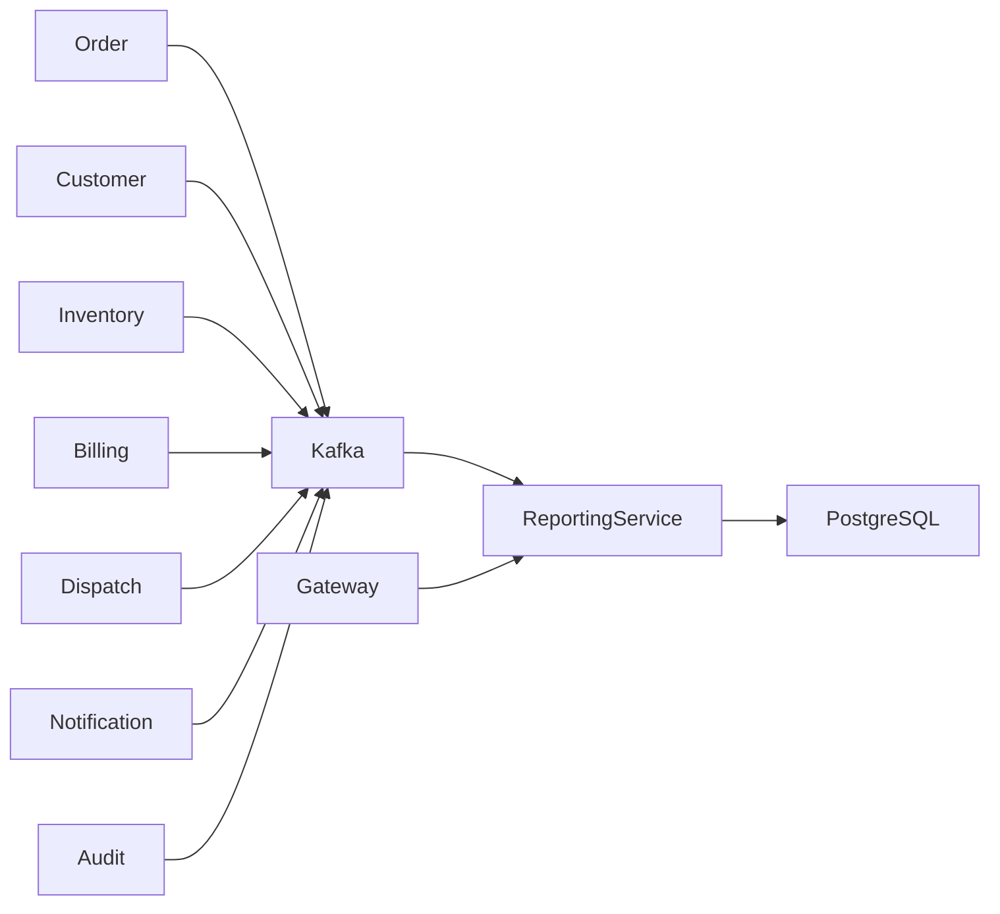
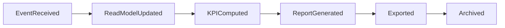
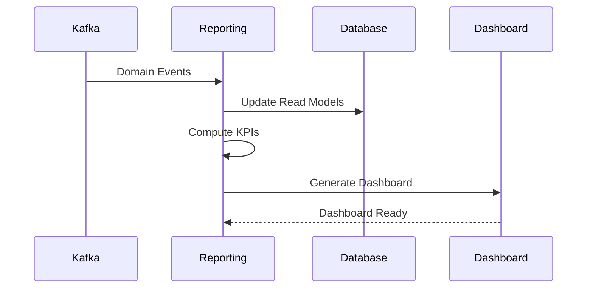
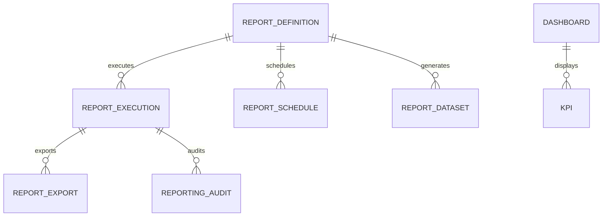
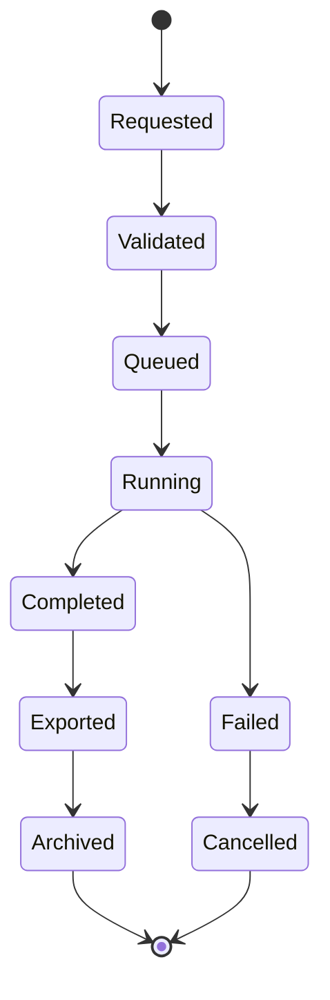
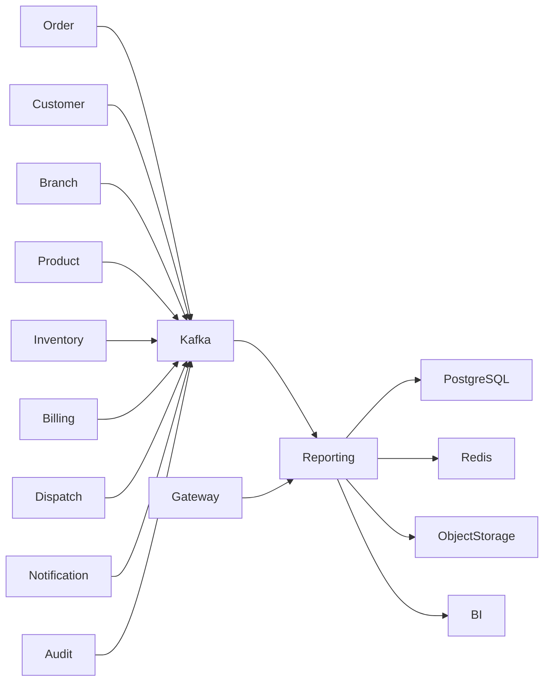

# SRS-012: Reporting Service Software Requirements Specification

---

# 1. Document Information

| Field          | Value                                                 |
| -------------- | ----------------------------------------------------- |
| Project Name   | Distributed Hub and Sales (DHS) Platform              |
| Service Name   | Reporting Service                                     |
| Document Title | Reporting Service Software Requirements Specification |
| Document ID    | SRS-012                                               |
| Repository     | starone-dhs-platform                                  |
| Module         | reporting-service                                     |
| Document Type  | Software Requirements Specification (SRS)             |
| Standard       | ISO/IEC/IEEE 29148                                    |
| Version        | v1.0.0                                                |
| Status         | Draft                                                 |
| Author         | Sachin Salunke                                        |
| Owner          | Enterprise Architecture                               |
| Last Updated   | 2026-06-27                                            |

---

# 2. Document Control

## 2.1 References

| Document      | Description                       |
| ------------- | --------------------------------- |
| BRD-001       | Business Requirements Document    |
| PRD-001       | Product Requirements Document     |
| ADR-001       | Architecture Decision Record      |
| HLD-001       | High-Level Design                 |
| FRD-Reporting | Reporting Functional Requirements |
| SRS-001       | Platform Foundation               |
| SRS-007       | Order Service                     |
| SRS-008       | Billing Service                   |
| SRS-009       | Dispatch Service                  |
| SRS-011       | Audit Service                     |

---

## 2.2 Revision History

| Version | Date       | Description     |
| ------- | ---------- | --------------- |
| v1.0.0  | 2026-06-27 | Initial Version |

---

## 2.3 Approval Matrix

| Role                 | Status  |
| -------------------- | ------- |
| Product Owner        | Pending |
| Enterprise Architect | Pending |
| Platform Lead        | Pending |
| QA Lead              | Pending |

---

# 3. Introduction

## 3.1 Purpose

The Reporting Service shall provide centralized operational reporting, executive dashboards, business analytics, KPI computation, scheduled reporting, and report exports for the DHS Platform.

The service shall consume business events, maintain reporting read models, calculate business metrics, and generate reports without modifying transactional data.

The Reporting Service shall act as the authoritative source for reporting and analytical information.

---

## 3.2 Scope

The Reporting Service includes:

- Operational Reports
- Executive Dashboards
- KPI Calculation
- Report Generation
- Scheduled Reports
- Report Export
- Dashboard Widgets
- Reporting Read Models
- Historical Analytics

---

## 3.3 Out of Scope

The Reporting Service shall not provide:

- Business Transactions
- Order Management
- Inventory Management
- Billing Management
- Customer Management
- Authentication
- Authorization

---

## 3.4 Definitions

| Term            | Description                                                |
| --------------- | ---------------------------------------------------------- |
| Report          | Structured business information generated from read models |
| Dashboard       | Collection of KPIs and visual reports                      |
| KPI             | Key Performance Indicator                                  |
| Read Model      | Denormalized reporting data optimized for queries          |
| Report Schedule | Configuration for automated report generation              |

---

## 3.5 Assumptions

- Business services publish events to Kafka.
- Reporting read models are asynchronously updated.
- Reporting data is eventually consistent.
- Dashboards are generated from reporting datasets.
- Report exports are processed asynchronously.

---

## 3.6 Constraints

- Reporting shall remain read-only.
- Reporting shall never update business services.
- Generated reports shall be reproducible.
- Historical reports shall remain available according to retention policy.

---

# 4. Service Overview

## 4.1 Responsibilities

The Reporting Service shall provide:

- Report Generation
- Dashboard Generation
- KPI Computation
- Report Scheduling
- Report Export
- Reporting Read Models

---

## 4.2 Service Context



---

## 4.3 Dependencies

| Dependency          | Purpose            |
| ------------------- | ------------------ |
| Platform Foundation | Shared Frameworks  |
| Gateway             | API Routing        |
| Eureka              | Service Discovery  |
| PostgreSQL          | Reporting Database |
| Kafka               | Event Streaming    |

---

## 4.4 Upstream Services

| Service              | Purpose               |
| -------------------- | --------------------- |
| Order Service        | Sales Data            |
| Customer Service     | Customer Analytics    |
| Product Service      | Product Analytics     |
| Inventory Service    | Inventory Metrics     |
| Billing Service      | Financial Analytics   |
| Dispatch Service     | Logistics Analytics   |
| Notification Service | Communication Metrics |
| Audit Service        | Compliance Metrics    |

---

## 4.5 Downstream Services

| Service                    | Purpose               |
| -------------------------- | --------------------- |
| BI Tools                   | Business Intelligence |
| Executive Dashboard        | KPI Visualization     |
| External Reporting Systems | Report Distribution   |

---

# 5. Business Process

## 5.1 Reporting Lifecycle



---

## 5.2 Reporting Workflow



---

# 6. Functional Requirements

## Reporting Processing

### RP-SYS-001

The Reporting Service shall consume business events from Kafka.

---

### RP-SYS-002

The Reporting Service shall maintain reporting read models.

---

### RP-SYS-003

The Reporting Service shall generate operational reports.

---

### RP-SYS-004

The Reporting Service shall generate executive dashboards.

---

### RP-SYS-005

The Reporting Service shall calculate KPIs.

---

### RP-SYS-006

The Reporting Service shall schedule report generation.

---

### RP-SYS-007

The Reporting Service shall export reports.

---

### RP-SYS-008

The Reporting Service shall provide historical reporting.

---

### RP-SYS-009

The Reporting Service shall expose secure REST APIs for report access.

---

### RP-SYS-010

The Reporting Service shall publish report lifecycle events where required.

---

# 7. Aggregate Root

```text
Reporting
│
├── ReportDefinition
├── ReportExecution
├── ReportDataset
├── ReportSchedule
├── ReportExport
├── Dashboard
├── KPI
└── ReportingAudit
```

The Reporting Aggregate shall exclusively manage reporting artifacts while maintaining a read-only relationship with transactional services.

---

# 8. Business Rules

The Reporting Service shall enforce the following business rules to ensure reporting consistency, accuracy, traceability, and compliance.

---

# 8.1 Report Definition Rules

### RP-BR-001

Every Report Definition shall have a unique Report Code.

---

### RP-BR-002

Report Code shall remain immutable.

---

### RP-BR-003

Every Report shall belong to a Report Category.

---

### RP-BR-004

Only Active Report Definitions shall be executable.

---

### RP-BR-005

Report Definitions shall support versioning.

---

# 8.2 Report Execution Rules

### RP-BR-006

Report execution shall be read-only.

---

### RP-BR-007

Report execution shall never modify transactional data.

---

### RP-BR-008

Every Report Execution shall generate an execution record.

---

### RP-BR-009

Report execution shall support asynchronous processing.

---

### RP-BR-010

Long-running reports shall execute as background jobs.

---

# 8.3 Dashboard Rules

### RP-BR-011

A Dashboard shall contain one or more Widgets.

---

### RP-BR-012

Dashboard Widgets shall be independently refreshable.

---

### RP-BR-013

Dashboard refresh intervals shall be configurable.

---

### RP-BR-014

Dashboard data shall originate only from Reporting read models.

---

# 8.4 KPI Rules

### RP-BR-015

KPIs shall be calculated only from Reporting datasets.

---

### RP-BR-016

KPI calculations shall be reproducible.

---

### RP-BR-017

KPI formulas shall be version controlled.

---

### RP-BR-018

Historical KPI values shall remain available.

---

# 8.5 Report Schedule Rules

### RP-BR-019

Scheduled Reports shall execute according to configured schedules.

---

### RP-BR-020

Schedule failures shall generate operational alerts.

---

### RP-BR-021

Schedules may distribute reports automatically.

---

# 8.6 Export Rules

### RP-BR-022

Report exports shall require authorization.

---

### RP-BR-023

Supported export formats shall include:

- PDF
- Excel
- CSV
- JSON

---

### RP-BR-024

Large reports shall be exported asynchronously.

---

### RP-BR-025

Export history shall be retained for audit purposes.

---

# 8.7 Reporting Rules

### RP-BR-026

Reporting data shall be eventually consistent.

---

### RP-BR-027

Reporting read models shall be rebuilt if corruption is detected.

---

### RP-BR-028

Every Report Execution shall include execution timestamps.

---

### RP-BR-029

Every generated report shall remain traceable to its Report Definition.

---

# 9. REST API Specification

Base URL

```text
/api/v1/reports
```

All APIs shall be exposed through the DHS API Gateway.

---

# 9.1 API Overview

| Method | URI                       | Description             |
| ------ | ------------------------- | ----------------------- |
| GET    | /definitions              | List Report Definitions |
| GET    | /definitions/{reportId}   | Get Report Definition   |
| POST   | /execute                  | Execute Report          |
| GET    | /executions/{executionId} | Execution Status        |
| GET    | /dashboard                | Dashboard               |
| GET    | /kpi                      | KPI Summary             |
| POST   | /schedule                 | Create Schedule         |
| PUT    | /schedule/{scheduleId}    | Update Schedule         |
| POST   | /export                   | Export Report           |
| GET    | /history                  | Report History          |

---

# 9.2 Request Headers

| Header           | Required | Description            |
| ---------------- | -------- | ---------------------- |
| Authorization    | Yes      | JWT Bearer Token       |
| X-Correlation-ID | Yes      | Correlation Identifier |
| Content-Type     | Yes      | application/json       |
| Accept           | Yes      | application/json       |

---

# 9.3 Query Parameters

| Parameter  | Required | Description      |
| ---------- | -------- | ---------------- |
| page       | No       | Page Number      |
| size       | No       | Page Size        |
| sort       | No       | Sort Field       |
| direction  | No       | ASC or DESC      |
| category   | No       | Report Category  |
| reportCode | No       | Report Code      |
| fromDate   | No       | Report Date From |
| toDate     | No       | Report Date To   |

---

# 9.4 Path Parameters

| Parameter   | Description                 |
| ----------- | --------------------------- |
| reportId    | Report Identifier           |
| executionId | Report Execution Identifier |
| scheduleId  | Report Schedule Identifier  |

---

# 9.5 Execute Report API

```http
POST /api/v1/reports/execute
```

Request

```json
{
  "reportCode": "SALES_SUMMARY",
  "parameters": {
    "fromDate": "2026-01-01",
    "toDate": "2026-01-31"
  }
}
```

Response

```json
{
  "executionId": "UUID",
  "status": "QUEUED"
}
```

---

# 9.6 Export Report API

```http
POST /api/v1/reports/export
```

Request

```json
{
  "executionId": "UUID",
  "format": "PDF"
}
```

Response

```json
{
  "exportId": "UUID",
  "status": "PROCESSING"
}
```

---

# 9.7 Dashboard API

```http
GET /api/v1/reports/dashboard
```

Returns executive dashboard data.

---

# 9.8 KPI API

```http
GET /api/v1/reports/kpi
```

Returns configured KPIs.

---

# 9.9 Schedule Report API

```http
POST /api/v1/reports/schedule
```

Creates a scheduled report execution.

---

# 10. Request Models

## ExecuteReportRequest

| Field      | Type               | Required |
| ---------- | ------------------ | -------- |
| reportCode | String             | Yes      |
| parameters | Map<String,Object> | Yes      |

---

## ExportReportRequest

| Field       | Type         | Required |
| ----------- | ------------ | -------- |
| executionId | UUID         | Yes      |
| format      | ExportFormat | Yes      |

---

## ReportScheduleRequest

| Field          | Type         | Required |
| -------------- | ------------ | -------- |
| reportCode     | String       | Yes      |
| cronExpression | String       | Yes      |
| recipients     | List<String> | No       |

---

# 11. Response Models

## ReportExecutionResponse

| Field           | Type            |
| --------------- | --------------- |
| executionId     | UUID            |
| reportCode      | String          |
| executionStatus | ExecutionStatus |
| startedAt       | Timestamp       |
| completedAt     | Timestamp       |

---

## DashboardResponse

| Field         | Type                  |
| ------------- | --------------------- |
| dashboardName | String                |
| generatedAt   | Timestamp             |
| widgets       | List<DashboardWidget> |

---

## KPIResponse

| Field   | Type    |
| ------- | ------- |
| kpiCode | String  |
| kpiName | String  |
| value   | Decimal |
| trend   | String  |

---

# 12. Validation Rules

## Report Execution

- Report Definition shall exist.
- Report shall be Active.
- Parameters shall be valid.
- User shall have execution permission.

---

## Report Export

- Report Execution shall exist.
- Export Format shall be supported.
- User shall have export permission.

---

## Report Schedule

- Cron Expression shall be valid.
- Report Definition shall exist.
- Schedule Name shall be unique.

---

# 13. Permission Matrix

| API                 | Super Admin | Reporting Admin | Business Analyst | Executive | Viewer |
| ------------------- | ----------- | --------------- | ---------------- | --------- | ------ |
| Execute Report      | ✅          | ✅              | ✅               | ✅        | ❌     |
| Export Report       | ✅          | ✅              | ✅               | ✅        | ❌     |
| Dashboard           | ✅          | ✅              | ✅               | ✅        | ✅     |
| KPI                 | ✅          | ✅              | ✅               | ✅        | ✅     |
| Create Schedule     | ✅          | ✅              | ❌               | ❌        | ❌     |
| Update Schedule     | ✅          | ✅              | ❌               | ❌        | ❌     |
| View Report History | ✅          | ✅              | ✅               | ✅        | ✅     |

---

# 14. Standard HTTP Status Codes

| Status | Description                    |
| ------ | ------------------------------ |
| 200    | Success                        |
| 202    | Report Accepted for Processing |
| 400    | Validation Error               |
| 401    | Unauthorized                   |
| 403    | Forbidden                      |
| 404    | Report Not Found               |
| 409    | Duplicate Schedule             |
| 422    | Business Rule Violation        |
| 500    | Internal Server Error          |

---

# 15. Aggregate Model

The Reporting Service shall implement the Reporting domain using Domain-Driven Design (DDD).

The **Reporting** entity shall be the Aggregate Root and shall exclusively manage reporting artifacts, report execution, dashboard generation, KPI computation, scheduling, exports, and reporting audit records.

The Reporting Service shall maintain **read-only** relationships with transactional services.

---

## 15.1 Reporting Aggregate

```text
Reporting
│
├── ReportDefinition
├── ReportExecution
├── ReportDataset
├── ReportSchedule
├── ReportExport
├── Dashboard
├── KPI
└── ReportingAudit
```

---

## Aggregate Responsibilities

| Aggregate        | Responsibility           |
| ---------------- | ------------------------ |
| Reporting        | Aggregate Root           |
| ReportDefinition | Report Metadata          |
| ReportExecution  | Execution History        |
| ReportDataset    | Reporting Read Model     |
| ReportSchedule   | Scheduled Reports        |
| ReportExport     | Export Processing        |
| Dashboard        | Dashboard Configuration  |
| KPI              | KPI Definitions & Values |
| ReportingAudit   | Reporting Audit History  |

---

# 16. Entity Model

## 16.1 Entity Overview

| Entity           | Description             |
| ---------------- | ----------------------- |
| Reporting        | Aggregate Root          |
| ReportDefinition | Report Metadata         |
| ReportExecution  | Report Execution        |
| ReportDataset    | Materialized Read Model |
| ReportSchedule   | Scheduled Execution     |
| ReportExport     | Export History          |
| Dashboard        | Dashboard Configuration |
| KPI              | KPI Definition          |
| ReportingAudit   | Reporting Audit         |

---

## 16.2 Report Definition

| Attribute     | Type         | Constraint  |
| ------------- | ------------ | ----------- |
| id            | UUID         | Primary Key |
| reportCode    | VARCHAR(100) | Unique      |
| reportName    | VARCHAR(200) | Required    |
| category      | VARCHAR(100) | Required    |
| description   | TEXT         | Optional    |
| reportVersion | INTEGER      | Required    |
| active        | BOOLEAN      | Required    |
| createdAt     | TIMESTAMP    | Required    |
| updatedAt     | TIMESTAMP    | Required    |

---

## 16.3 Report Execution

| Attribute           | Type      |
| ------------------- | --------- |
| id                  | UUID      |
| reportDefinitionId  | UUID      |
| executionStatus     | ENUM      |
| requestedBy         | UUID      |
| startedAt           | TIMESTAMP |
| completedAt         | TIMESTAMP |
| executionDurationMs | BIGINT    |
| parameterJson       | JSONB     |

---

## 16.4 Report Dataset

| Attribute      | Type         |
| -------------- | ------------ |
| id             | UUID         |
| datasetCode    | VARCHAR(100) |
| datasetName    | VARCHAR(200) |
| datasetVersion | INTEGER      |
| refreshTime    | TIMESTAMP    |
| rowCount       | BIGINT       |

---

## 16.5 Report Schedule

| Attribute          | Type         |
| ------------------ | ------------ |
| id                 | UUID         |
| reportDefinitionId | UUID         |
| cronExpression     | VARCHAR(100) |
| enabled            | BOOLEAN      |
| nextExecution      | TIMESTAMP    |
| lastExecution      | TIMESTAMP    |

---

## 16.6 Report Export

| Attribute         | Type         |
| ----------------- | ------------ |
| id                | UUID         |
| reportExecutionId | UUID         |
| exportFormat      | ENUM         |
| exportStatus      | ENUM         |
| generatedFile     | VARCHAR(500) |
| generatedAt       | TIMESTAMP    |

---

## 16.7 Dashboard

| Attribute        | Type         |
| ---------------- | ------------ |
| id               | UUID         |
| dashboardCode    | VARCHAR(100) |
| dashboardName    | VARCHAR(200) |
| dashboardVersion | INTEGER      |
| widgetCount      | INTEGER      |
| refreshInterval  | INTEGER      |

---

## 16.8 KPI

| Attribute      | Type          |
| -------------- | ------------- |
| id             | UUID          |
| kpiCode        | VARCHAR(100)  |
| kpiName        | VARCHAR(200)  |
| formulaVersion | INTEGER       |
| currentValue   | DECIMAL(20,4) |
| calculatedAt   | TIMESTAMP     |

---

## 16.9 Reporting Audit

| Attribute         | Type         |
| ----------------- | ------------ |
| id                | UUID         |
| reportExecutionId | UUID         |
| eventType         | VARCHAR(100) |
| correlationId     | UUID         |
| eventTimestamp    | TIMESTAMP    |

---

# 17. Database Design

Database

```text
reporting_db
```

Schema

```text
reporting
```

---

## 17.1 Tables

| Table             | Purpose               |
| ----------------- | --------------------- |
| report_definition | Report Metadata       |
| report_execution  | Execution History     |
| report_dataset    | Reporting Read Models |
| report_schedule   | Scheduled Reports     |
| report_export     | Export History        |
| dashboard         | Dashboard Metadata    |
| kpi               | KPI Definitions       |
| reporting_audit   | Reporting Audit       |

---

## 17.2 Primary Keys

All tables shall use UUID as the Primary Key.

---

## 17.3 Foreign Keys

| Child Table      | Parent Table      |
| ---------------- | ----------------- |
| report_execution | report_definition |
| report_schedule  | report_definition |
| report_export    | report_execution  |
| reporting_audit  | report_execution  |

---

## 17.4 Constraints

### Report Definition

- Report Code UNIQUE
- Version Required

### Report Execution

- Immutable after completion

### Dashboard

- Dashboard Code UNIQUE

### KPI

- KPI Code UNIQUE

### Export

- One export record per generated file

---

## 17.5 Indexes

| Table             | Index            |
| ----------------- | ---------------- |
| report_definition | report_code      |
| report_execution  | execution_status |
| report_execution  | started_at       |
| report_execution  | requested_by     |
| report_schedule   | next_execution   |
| report_dataset    | dataset_code     |
| dashboard         | dashboard_code   |
| kpi               | kpi_code         |

---

# 18. Entity Relationship Diagram



---

# 19. Report Lifecycle



---

# 20. Security Requirements

The Reporting Service shall rely upon the Identity Service for authentication and authorization.

---

## Authentication

### RP-SEC-001

Every request shall contain a valid JWT Access Token.

---

### RP-SEC-002

Authentication shall be delegated to the Identity Service.

---

### RP-SEC-003

Unauthenticated requests shall return HTTP 401.

---

## Authorization

### RP-SEC-004

Reporting APIs shall enforce Role-Based Access Control.

---

### RP-SEC-005

Report execution permissions shall be configurable.

---

### RP-SEC-006

Report export shall require Export permission.

---

### RP-SEC-007

Unauthorized requests shall return HTTP 403.

---

## Data Security

### RP-SEC-008

All communication shall use TLS 1.3.

---

### RP-SEC-009

Generated reports shall be protected from unauthorized access.

---

### RP-SEC-010

Report exports shall support configurable expiration.

---

### RP-SEC-011

Reporting audit records shall be immutable.

---

# 21. Kafka Event Specification

The Reporting Service shall primarily consume business events and update reporting read models.

---

## 21.1 Published Events

| Topic                  | Event              |
| ---------------------- | ------------------ |
| report.generated.v1    | ReportGenerated    |
| report.exported.v1     | ReportExported     |
| dashboard.refreshed.v1 | DashboardRefreshed |
| kpi.calculated.v1      | KpiCalculated      |

---

## 21.2 Consumed Events

| Topic           | Source               |
| --------------- | -------------------- |
| order.\*        | Order Service        |
| customer.\*     | Customer Service     |
| branch.\*       | Branch Service       |
| product.\*      | Product Service      |
| inventory.\*    | Inventory Service    |
| billing.\*      | Billing Service      |
| dispatch.\*     | Dispatch Service     |
| notification.\* | Notification Service |
| audit.\*        | Audit Service        |

---

## 21.3 Standard Event Structure

```json
{
  "eventId": "UUID",
  "eventType": "OrderCreated",
  "eventVersion": "1.0",
  "occurredAt": "2026-06-27T10:30:00Z",
  "correlationId": "UUID",
  "payload": {}
}
```

---

# 22. External Interfaces

| Interface      | Purpose               |
| -------------- | --------------------- |
| API Gateway    | REST APIs             |
| Kafka          | Event Streaming       |
| PostgreSQL     | Reporting Database    |
| Redis          | Dashboard Cache       |
| Object Storage | Report Files          |
| BI Platform    | Analytics Integration |

---

# 23. OpenFeign Clients

The Reporting Service shall remain event-driven.

OpenFeign shall be used only when synchronous reference data is required.

| Client         | Purpose                            |
| -------------- | ---------------------------------- |
| IdentityClient | User Information                   |
| CustomerClient | Customer Profile Lookup (Optional) |
| BranchClient   | Branch Information (Optional)      |

> Business reporting data shall be obtained from reporting read models built from Kafka events. OpenFeign shall not be used for transactional reporting queries.

---

# 24. Configuration

Configuration shall be externalized using the centralized configuration repository.

---

## Configuration Categories

- Server
- Database
- Kafka
- Security
- Logging
- Dashboard
- Reporting
- Scheduler
- Export
- KPI
- Cache
- Observability

---

## Configuration Properties

| Property                             | Default | Required | Description                        |
| ------------------------------------ | ------- | -------- | ---------------------------------- |
| reporting.scheduler.enabled          | true    | Yes      | Enable Scheduled Reports           |
| reporting.scheduler.pool-size        | 10      | Yes      | Scheduler Thread Pool              |
| reporting.export.max-records         | 500000  | Yes      | Maximum Export Records             |
| reporting.export.file-retention-days | 30      | Yes      | Export File Retention              |
| reporting.dashboard.cache.enabled    | true    | Yes      | Dashboard Cache                    |
| reporting.dashboard.cache.ttl        | 300     | Yes      | Cache TTL (seconds)                |
| reporting.dataset.refresh.enabled    | true    | Yes      | Enable Dataset Refresh             |
| reporting.dataset.refresh.interval   | 300     | Yes      | Dataset Refresh Interval (seconds) |
| reporting.kafka.consumer.concurrency | 5       | Yes      | Kafka Consumer Threads             |

---

# 25. Service Context Diagram



---

# 26. Error Handling

The Reporting Service shall provide standardized error handling for report generation, dashboard rendering, KPI calculation, report scheduling, export processing, and reporting read model operations.

All error responses shall comply with the Platform Foundation error model defined in **SRS-001 – Platform Foundation**.

---

## 26.1 Functional Requirements

### RP-SYS-011

The Reporting Service shall return standardized error responses.

---

### RP-SYS-012

Business exceptions shall be distinguishable from technical exceptions.

---

### RP-SYS-013

Every error response shall include a Correlation ID.

---

### RP-SYS-014

Unhandled exceptions shall return HTTP 500.

---

### RP-SYS-015

Internal implementation details shall never be exposed to API consumers.

---

### RP-SYS-016

Failed report executions shall record execution failure details.

---

### RP-SYS-017

Failed export operations shall support configurable retry policies.

---

## 26.2 Standard Error Response

```json
{
  "timestamp": "2026-06-27T10:30:00Z",
  "status": 422,
  "error": "Report Execution Failed",
  "code": "RP-BUS-001",
  "message": "Report parameters are invalid.",
  "correlationId": "UUID",
  "path": "/api/v1/reports/execute"
}
```

---

## 26.3 Business Error Catalog

| Error Code  | Description                 | HTTP Status |
| ----------- | --------------------------- | ----------- |
| RP-VAL-001  | Validation Failed           | 400         |
| RP-AUTH-001 | Authentication Required     | 401         |
| RP-AUTH-002 | Access Denied               | 403         |
| RP-BUS-001  | Invalid Report Parameters   | 422         |
| RP-BUS-002  | Report Definition Not Found | 404         |
| RP-BUS-003  | Report Execution Not Found  | 404         |
| RP-BUS-004  | Dashboard Not Found         | 404         |
| RP-BUS-005  | KPI Not Found               | 404         |
| RP-BUS-006  | Export Format Not Supported | 422         |
| RP-BUS-007  | Schedule Already Exists     | 409         |
| RP-BUS-008  | Report Execution Failed     | 422         |
| RP-BUS-009  | Export File Expired         | 410         |
| RP-SYS-001  | Internal Server Error       | 500         |

---

# 27. Logging Requirements

The Reporting Service shall use the Platform Foundation logging framework.

---

## 27.1 Functional Requirements

### RP-SYS-018

Every Report Execution shall generate audit logs.

---

### RP-SYS-019

Dashboard generation shall generate audit logs.

---

### RP-SYS-020

KPI calculation shall generate audit logs.

---

### RP-SYS-021

Report export operations shall generate audit logs.

---

### RP-SYS-022

Scheduled report executions shall generate audit logs.

---

### RP-SYS-023

Business and technical exceptions shall be logged.

---

## 27.2 Log Attributes

Every log entry shall include:

- Timestamp
- Service Name
- Correlation ID
- Trace ID
- Span ID
- Report ID
- Report Code
- Execution ID
- Dashboard ID
- User ID
- HTTP Method
- Request URI
- HTTP Status
- Processing Time

---

## 27.3 Sensitive Information

The following information shall never be logged:

- JWT Tokens
- Authorization Headers
- Database Credentials
- Encryption Keys
- Personally Identifiable Information unless explicitly configured
- Confidential report data

---

# 28. Observability Requirements

The Reporting Service shall expose operational metrics through the Platform Foundation.

---

## 28.1 Functional Requirements

### RP-SYS-024

The Reporting Service shall expose Health endpoints.

---

### RP-SYS-025

The Reporting Service shall expose Metrics endpoints.

---

### RP-SYS-026

The Reporting Service shall support Distributed Tracing.

---

### RP-SYS-027

Every report execution shall propagate Correlation IDs.

---

### RP-SYS-028

Reporting metrics shall be published.

---

## 28.2 Business Metrics

The Reporting Service shall publish:

- Reports Generated
- Reports Failed
- Dashboard Refresh Count
- KPI Calculations
- Scheduled Reports Executed
- Report Exports Generated
- Report Export Failures
- Dashboard Response Time
- Report Generation Time
- Dataset Refresh Count
- Kafka Consumer Lag
- API Response Time

---

# 29. Non-Functional Requirements

## 29.1 Performance

### RP-NFR-001

Interactive report execution shall complete within 5 seconds for standard reports.

---

### RP-NFR-002

Dashboard rendering shall complete within 2 seconds.

---

### RP-NFR-003

Report search shall support pagination, filtering and sorting within 500 milliseconds.

---

### RP-NFR-004

Large report exports shall execute asynchronously.

---

## 29.2 Availability

### RP-NFR-005

The Reporting Service shall maintain at least 99.9% availability.

---

### RP-NFR-006

The Reporting Service shall support horizontal scaling.

---

## 29.3 Reliability

### RP-NFR-007

Reporting read models shall remain eventually consistent with business events.

---

### RP-NFR-008

Kafka event consumption shall guarantee at-least-once delivery.

---

### RP-NFR-009

Report generation shall be idempotent for identical execution requests.

---

### RP-NFR-010

Failed scheduled reports shall support automatic retry.

---

## 29.4 Scalability

### RP-NFR-011

The Reporting Service shall support concurrent report execution.

---

### RP-NFR-012

The Reporting Service shall support enterprise-scale analytical workloads.

---

## 29.5 Security

### RP-NFR-013

All communication shall use TLS 1.3.

---

### RP-NFR-014

Every protected API shall enforce Role-Based Access Control.

---

### RP-NFR-015

Generated report files shall support configurable expiration.

---

### RP-NFR-016

Reporting audit records shall be immutable.

---

## 29.6 Maintainability

### RP-NFR-017

The Reporting Service shall use Platform Foundation shared libraries.

---

### RP-NFR-018

The Reporting Service shall comply with enterprise coding standards.

---

# 30. Requirement Traceability Matrix

| Requirement             | Source Document             | Verification                                |
| ----------------------- | --------------------------- | ------------------------------------------- |
| RP-SYS-001 – RP-SYS-010 | FRD-Reporting               | Functional Testing                          |
| RP-SYS-011 – RP-SYS-028 | SRS-001 Platform Foundation | Integration Testing                         |
| RP-NFR-001 – RP-NFR-018 | PRD / HLD                   | Performance, Reliability & Security Testing |

---

# 31. Testability Matrix

| Requirement | Test Case |
| ----------- | --------- |
| RP-SYS-001  | TC-RP-001 |
| RP-SYS-002  | TC-RP-002 |
| RP-SYS-003  | TC-RP-003 |
| RP-SYS-004  | TC-RP-004 |
| RP-SYS-005  | TC-RP-005 |
| RP-SYS-006  | TC-RP-006 |
| RP-SYS-007  | TC-RP-007 |
| RP-SYS-008  | TC-RP-008 |
| RP-SYS-009  | TC-RP-009 |
| RP-SYS-010  | TC-RP-010 |

---

# 32. Acceptance Criteria

The Reporting Service shall be considered complete when:

- Reporting read models are continuously updated from Kafka events.
- Report execution functions successfully.
- Dashboard generation operates correctly.
- KPI calculations produce accurate results.
- Scheduled reports execute according to configured schedules.
- Report exports are generated successfully.
- Standardized error responses are returned.
- Logging and observability are operational.
- Health endpoints are operational.
- Performance objectives are achieved.
- Security requirements are satisfied.
- Functional, integration and non-functional tests pass.

---

# 33. Appendices

## Appendix A – API Summary

| Resource          | Endpoints       |
| ----------------- | --------------- |
| Report Definition | List, Get       |
| Report Execution  | Execute, Status |
| Dashboard         | View            |
| KPI               | View            |
| Report Schedule   | Create, Update  |
| Report Export     | Export          |
| Report History    | View            |

---

## Appendix B – Aggregate Summary

| Aggregate        | Description             |
| ---------------- | ----------------------- |
| Reporting        | Aggregate Root          |
| ReportDefinition | Report Metadata         |
| ReportExecution  | Report Execution        |
| ReportDataset    | Read Model              |
| ReportSchedule   | Scheduled Reports       |
| ReportExport     | Export Processing       |
| Dashboard        | Dashboard Configuration |
| KPI              | KPI Definition          |
| ReportingAudit   | Reporting Audit Trail   |

---

## Appendix C – Service Dependencies

| Dependency          | Purpose                        |
| ------------------- | ------------------------------ |
| Platform Foundation | Shared Frameworks              |
| Gateway             | API Routing                    |
| Eureka              | Service Discovery              |
| PostgreSQL          | Reporting Database             |
| Redis               | Dashboard Cache                |
| Kafka               | Event Streaming                |
| Identity Service    | Authentication & Authorization |
| Object Storage      | Report File Storage            |
| Audit Service       | Audit Trail                    |
| BI Platform         | Enterprise Analytics           |

---

## Appendix D – Revision History

| Version | Description                                                   |
| ------- | ------------------------------------------------------------- |
| v1.0.0  | Initial Reporting Service Software Requirements Specification |

---

# 34. Document Sign-off

| Role                 | Status  |
| -------------------- | ------- |
| Product Owner        | Pending |
| Enterprise Architect | Pending |
| Platform Lead        | Pending |
| Security Lead        | Pending |
| QA Lead              | Pending |

---

# End of Document
