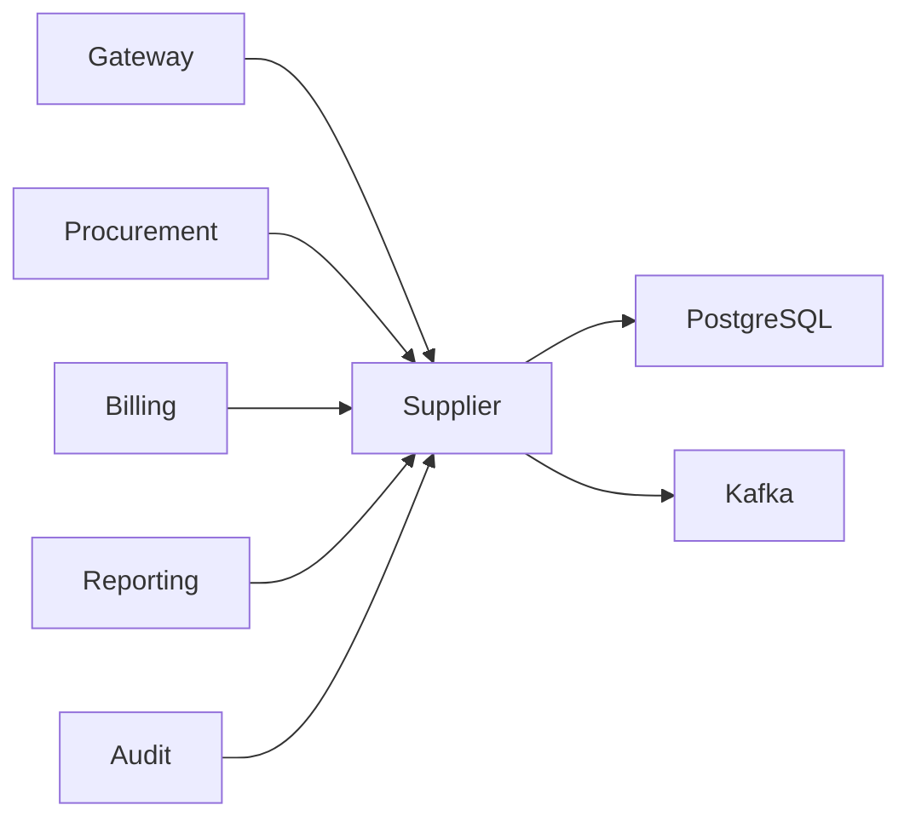
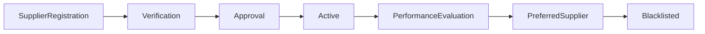
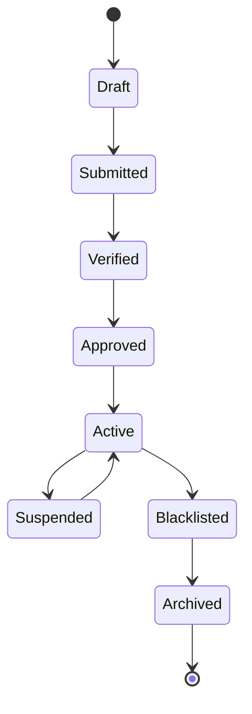
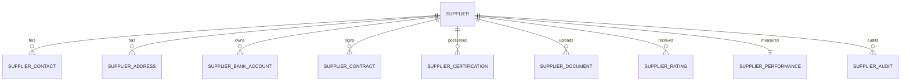
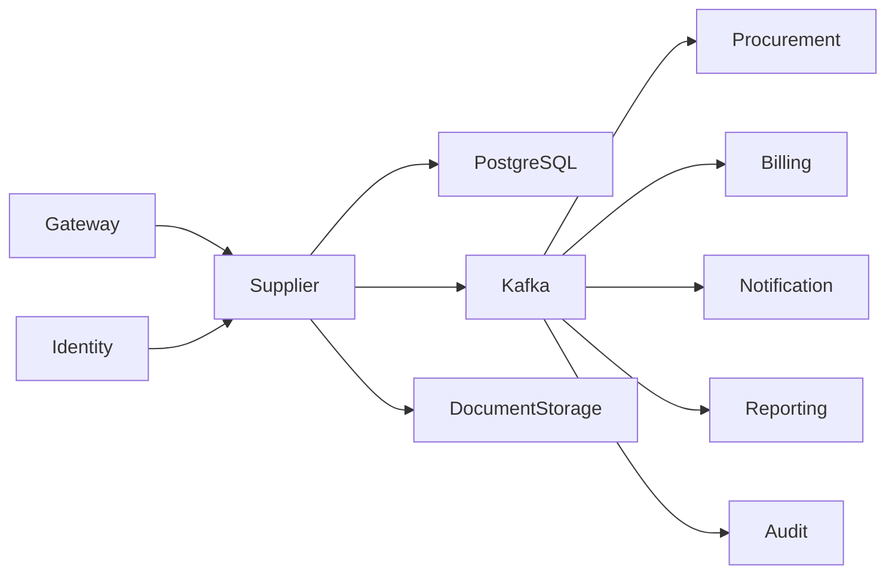

# SRS-013: Supplier Service Software Requirements Specification

---

# 1. Document Information

| Field          | Value                                                |
| -------------- | ---------------------------------------------------- |
| Project Name   | Distributed Hub and Sales (DHS) Platform             |
| Service Name   | Supplier Service                                     |
| Document Title | Supplier Service Software Requirements Specification |
| Document ID    | SRS-013                                              |
| Repository     | starone-dhs-platform                                 |
| Module         | supplier-service                                     |
| Document Type  | Software Requirements Specification (SRS)            |
| Standard       | ISO/IEC/IEEE 29148                                   |
| Version        | v1.0.0                                               |
| Status         | Draft                                                |
| Author         | Sachin Salunke                                       |
| Owner          | Enterprise Architecture                              |
| Last Updated   | 2026-06-27                                           |

---

# 2. Document Control

## 2.1 References

| Document     | Description                      |
| ------------ | -------------------------------- |
| BRD-001      | Business Requirements Document   |
| PRD-001      | Product Requirements Document    |
| ADR-001      | Architecture Decision Record     |
| HLD-001      | High-Level Design                |
| FRD-Supplier | Supplier Functional Requirements |
| SRS-001      | Platform Foundation              |
| SRS-002      | Identity Service                 |
| SRS-003      | Branch Service                   |
| SRS-005      | Product Service                  |
| SRS-014      | Procurement Service              |

---

## 2.2 Revision History

| Version | Date       | Description     |
| ------- | ---------- | --------------- |
| v1.0.0  | 2026-06-27 | Initial Version |

---

## 2.3 Approval Matrix

| Role                 | Status  |
| -------------------- | ------- |
| Product Owner        | Pending |
| Enterprise Architect | Pending |
| Platform Lead        | Pending |
| QA Lead              | Pending |

---

# 3. Introduction

## 3.1 Purpose

The Supplier Service shall provide centralized supplier master management for the DHS Platform.

The service shall maintain supplier master records, supplier contacts, addresses, banking details, tax registrations, contracts, certifications, payment terms, ratings, performance metrics, and supplier lifecycle management.

Supplier Service shall act as the single source of truth for Supplier/Vendor information.

---

## 3.2 Scope

The Supplier Service includes:

- Supplier Master
- Supplier Contact Management
- Supplier Address Management
- Supplier Categories
- Supplier Banking Information
- GST/VAT Registration
- PAN/TAN Information
- Payment Terms
- Credit Limits
- Supplier Contracts
- Supplier Certifications
- Supplier Documents
- Supplier Rating
- Supplier Performance
- Preferred Supplier Management
- Blacklist Management
- Supplier Lifecycle
- Supplier Audit

---

## 3.3 Out of Scope

The Supplier Service shall not provide:

- Purchase Requisitions
- Purchase Orders
- Goods Receipt
- Inventory Management
- Billing
- Payments
- Authentication
- Authorization

---

# 4. Service Overview

## Responsibilities

The Supplier Service shall provide:

- Supplier Registration
- Supplier Verification
- Supplier Approval
- Supplier Lifecycle Management
- Supplier Search
- Supplier Rating
- Supplier Performance Tracking
- Supplier Audit
- Supplier Event Publishing

---

## Service Context



---

## Dependencies

| Dependency          | Purpose           |
| ------------------- | ----------------- |
| Platform Foundation | Shared Libraries  |
| Gateway             | API Routing       |
| Eureka              | Service Discovery |
| PostgreSQL          | Database          |
| Kafka               | Event Streaming   |
| Identity Service    | Authentication    |

---

## Downstream Consumers

- Procurement Service
- Billing Service
- Reporting Service
- Audit Service
- Notification Service

---

# 5. Business Workflow



---

# 6. Functional Requirements

## Supplier Management

### SP-SYS-001

The Supplier Service shall create Supplier records.

---

### SP-SYS-002

The Supplier Service shall update Supplier information.

---

### SP-SYS-003

The Supplier Service shall deactivate Suppliers.

---

### SP-SYS-004

The Supplier Service shall activate Suppliers.

---

### SP-SYS-005

The Supplier Service shall manage Supplier Contacts.

---

### SP-SYS-006

The Supplier Service shall manage Supplier Addresses.

---

### SP-SYS-007

The Supplier Service shall manage Supplier Bank Accounts.

---

### SP-SYS-008

The Supplier Service shall manage Supplier Documents.

---

### SP-SYS-009

The Supplier Service shall maintain Supplier Ratings.

---

### SP-SYS-010

The Supplier Service shall maintain Supplier Performance Metrics.

---

### SP-SYS-011

The Supplier Service shall support Supplier Search.

---

### SP-SYS-012

The Supplier Service shall support Preferred Supplier Management.

---

### SP-SYS-013

The Supplier Service shall support Supplier Blacklisting.

---

### SP-SYS-014

The Supplier Service shall publish Supplier Lifecycle Events.

---

### SP-SYS-015

The Supplier Service shall expose secure REST APIs.

---

# 7. Aggregate Root

```text
Supplier
│
├── SupplierContact
├── SupplierAddress
├── SupplierBankAccount
├── SupplierCategory
├── SupplierContract
├── SupplierCertification
├── SupplierDocument
├── SupplierRating
├── SupplierPerformance
└── SupplierAudit
```

---

## Supplier Aggregate Responsibilities

| Aggregate             | Responsibility               |
| --------------------- | ---------------------------- |
| Supplier              | Aggregate Root               |
| SupplierContact       | Contact Persons              |
| SupplierAddress       | Addresses                    |
| SupplierBankAccount   | Banking Details              |
| SupplierCategory      | Vendor Classification        |
| SupplierContract      | Commercial Contracts         |
| SupplierCertification | ISO/GST/Compliance Documents |
| SupplierDocument      | Uploaded Documents           |
| SupplierRating        | Supplier Ratings             |
| SupplierPerformance   | Delivery & Quality KPIs      |
| SupplierAudit         | Audit Trail                  |

---

# 8. Core Supplier Lifecycle



---

# 9. Integration Responsibilities

| Service              | Interaction                  |
| -------------------- | ---------------------------- |
| Procurement Service  | Supplier Lookup              |
| Billing Service      | Supplier Payment Information |
| Notification Service | Supplier Notifications       |
| Reporting Service    | Supplier Analytics           |
| Audit Service        | Supplier Audit Events        |

---

# 10. Kafka Events

## Published

- supplier.created.v1
- supplier.updated.v1
- supplier.verified.v1
- supplier.approved.v1
- supplier.activated.v1
- supplier.deactivated.v1
- supplier.blacklisted.v1
- supplier.rating.updated.v1
- supplier.performance.updated.v1

---

## Consumed

- procurement.purchase-order.completed.v1
- billing.supplier-payment.completed.v1
- audit.\*
- notification.\*

---

# 11. Aggregate Summary

```text
Supplier
│
├── Master Data
├── Contacts
├── Addresses
├── Banking
├── Tax Registration
├── Payment Terms
├── Credit Limits
├── Contracts
├── Certifications
├── Documents
├── Ratings
├── Performance
├── Blacklist
├── Preferred Supplier
└── Audit
```

---

# 8. Business Rules

The Supplier Service shall enforce the following business rules to ensure supplier governance, regulatory compliance, procurement integrity, financial accuracy, and auditability.

---

## 8.1 Supplier Registration Rules

### SP-BR-001

Every Supplier shall have a globally unique Supplier Code.

---

### SP-BR-002

Supplier Code shall remain immutable after creation.

---

### SP-BR-003

Supplier Name shall be unique within the organization.

---

### SP-BR-004

Every Supplier shall belong to at least one Supplier Category.

---

### SP-BR-005

Supplier Registration shall require mandatory legal information.

---

### SP-BR-006

Supplier records shall support soft deletion only.

---

## 8.2 Supplier Verification Rules

### SP-BR-007

A Supplier shall remain in **Draft** status until all mandatory information is completed.

---

### SP-BR-008

Supplier verification shall validate:

- GST Registration
- PAN
- TAN (if applicable)
- Business Registration Number
- Email
- Mobile Number
- Bank Account

---

### SP-BR-009

Only verified Suppliers may be approved.

---

### SP-BR-010

Rejected Suppliers shall return to Draft status.

---

## 8.3 Supplier Approval Rules

### SP-BR-011

Supplier approval shall require authorized approvers.

---

### SP-BR-012

Approvers shall not approve Suppliers they created.

---

### SP-BR-013

Supplier approval history shall remain immutable.

---

### SP-BR-014

Approved Suppliers shall become Active.

---

## 8.4 Supplier Lifecycle Rules

### SP-BR-015

Only Active Suppliers may participate in Procurement.

---

### SP-BR-016

Inactive Suppliers shall not receive Purchase Orders.

---

### SP-BR-017

Suspended Suppliers shall not participate in new procurement transactions.

---

### SP-BR-018

Blacklisted Suppliers shall remain unavailable until reinstated.

---

### SP-BR-019

Archived Suppliers shall be read-only.

---

## 8.5 Supplier Banking Rules

### SP-BR-020

Each Supplier may maintain multiple Bank Accounts.

---

### SP-BR-021

Only one Bank Account shall be marked as Default.

---

### SP-BR-022

Bank Account Numbers shall be encrypted at rest.

---

### SP-BR-023

IFSC/SWIFT Code validation shall be mandatory.

---

## 8.6 Supplier Contract Rules

### SP-BR-024

Supplier Contracts shall have effective dates.

---

### SP-BR-025

Expired Contracts shall become inactive automatically.

---

### SP-BR-026

Supplier Contracts shall support versioning.

---

## 8.7 Supplier Performance Rules

### SP-BR-027

Supplier Rating shall be calculated periodically.

---

### SP-BR-028

Performance Metrics shall include:

- Delivery Performance
- Quality Score
- Invoice Accuracy
- Lead Time
- Procurement Compliance

---

### SP-BR-029

Preferred Supplier status shall be configurable.

---

### SP-BR-030

Blacklisted Suppliers shall not be eligible for Preferred Supplier status.

---

# 9. REST API Specification

Base URL

```text
/api/v1/suppliers
```

All APIs shall be exposed through the DHS API Gateway.

---

## 9.1 API Overview

| Method | URI                      | Description             |
| ------ | ------------------------ | ----------------------- |
| POST   | /                        | Create Supplier         |
| PUT    | /{supplierId}            | Update Supplier         |
| GET    | /{supplierId}            | Get Supplier            |
| GET    | /                        | Search Suppliers        |
| POST   | /verify/{supplierId}     | Verify Supplier         |
| POST   | /approve/{supplierId}    | Approve Supplier        |
| POST   | /activate/{supplierId}   | Activate Supplier       |
| POST   | /deactivate/{supplierId} | Deactivate Supplier     |
| POST   | /blacklist/{supplierId}  | Blacklist Supplier      |
| POST   | /preferred/{supplierId}  | Mark Preferred Supplier |
| POST   | /bank-account            | Add Bank Account        |
| POST   | /contract                | Add Supplier Contract   |
| POST   | /rating                  | Update Rating           |
| POST   | /performance             | Update Performance      |

---

## 9.2 Request Headers

| Header           | Required | Description            |
| ---------------- | -------- | ---------------------- |
| Authorization    | Yes      | JWT Bearer Token       |
| X-Correlation-ID | Yes      | Correlation Identifier |
| Content-Type     | Yes      | application/json       |
| Accept           | Yes      | application/json       |

---

## 9.3 Query Parameters

| Parameter    | Required | Description       |
| ------------ | -------- | ----------------- |
| page         | No       | Page Number       |
| size         | No       | Page Size         |
| sort         | No       | Sort Field        |
| direction    | No       | ASC / DESC        |
| supplierCode | No       | Supplier Code     |
| supplierName | No       | Supplier Name     |
| category     | No       | Supplier Category |
| status       | No       | Supplier Status   |
| city         | No       | City              |
| state        | No       | State             |
| country      | No       | Country           |

---

## 9.4 Path Parameters

| Parameter  | Description         |
| ---------- | ------------------- |
| supplierId | Supplier Identifier |

---

## 9.5 Create Supplier API

```http
POST /api/v1/suppliers
```

Request

```json
{
  "supplierName": "ABC Industries Pvt Ltd",
  "categoryId": "UUID",
  "gstNumber": "27ABCDE1234F1Z5",
  "panNumber": "ABCDE1234F",
  "email": "sales@abc.com",
  "mobileNumber": "9876543210"
}
```

Response

```json
{
  "supplierId": "UUID",
  "supplierCode": "SUP000001",
  "status": "DRAFT"
}
```

---

## 9.6 Verify Supplier API

```http
POST /api/v1/suppliers/verify/{supplierId}
```

Verifies supplier registration details.

---

## 9.7 Approve Supplier API

```http
POST /api/v1/suppliers/approve/{supplierId}
```

Approves Supplier Registration.

---

## 9.8 Blacklist Supplier API

```http
POST /api/v1/suppliers/blacklist/{supplierId}
```

Moves Supplier to Blacklisted status.

---

## 9.9 Search Supplier API

```http
GET /api/v1/suppliers
```

Supports:

- Pagination
- Sorting
- Filtering
- Status
- Category
- Location

---

# 10. Request Models

## SupplierRequest

| Field              | Type   | Required |
| ------------------ | ------ | -------- |
| supplierName       | String | Yes      |
| supplierCategoryId | UUID   | Yes      |
| gstNumber          | String | Yes      |
| panNumber          | String | Yes      |
| email              | String | Yes      |
| mobileNumber       | String | Yes      |

---

## SupplierAddressRequest

| Field        | Type        | Required |
| ------------ | ----------- | -------- |
| addressType  | AddressType | Yes      |
| addressLine1 | String      | Yes      |
| city         | String      | Yes      |
| state        | String      | Yes      |
| country      | String      | Yes      |
| postalCode   | String      | Yes      |

---

## SupplierContactRequest

| Field        | Type   | Required |
| ------------ | ------ | -------- |
| contactName  | String | Yes      |
| designation  | String | Yes      |
| email        | String | Yes      |
| mobileNumber | String | Yes      |

---

## SupplierBankAccountRequest

| Field          | Type        | Required |
| -------------- | ----------- | -------- |
| bankName       | String      | Yes      |
| accountNumber  | String      | Yes      |
| ifscCode       | String      | Yes      |
| accountType    | AccountType | Yes      |
| defaultAccount | Boolean     | Yes      |

---

## SupplierContractRequest

| Field          | Type   | Required |
| -------------- | ------ | -------- |
| contractNumber | String | Yes      |
| effectiveFrom  | Date   | Yes      |
| effectiveTo    | Date   | Yes      |
| paymentTerms   | String | Yes      |

---

# 11. Response Models

## SupplierResponse

| Field             | Type           |
| ----------------- | -------------- |
| supplierId        | UUID           |
| supplierCode      | String         |
| supplierName      | String         |
| supplierStatus    | SupplierStatus |
| preferredSupplier | Boolean        |

---

## SupplierPerformanceResponse

| Field           | Type    |
| --------------- | ------- |
| supplierId      | UUID    |
| deliveryScore   | Decimal |
| qualityScore    | Decimal |
| complianceScore | Decimal |
| overallRating   | Decimal |

---

## SupplierContractResponse

| Field          | Type           |
| -------------- | -------------- |
| contractId     | UUID           |
| contractNumber | String         |
| effectiveFrom  | Date           |
| effectiveTo    | Date           |
| contractStatus | ContractStatus |

---

# 12. Validation Rules

## Supplier Validation

- Supplier Name shall be mandatory.
- Supplier Category shall exist.
- GST Number shall be valid.
- PAN Number shall be valid.
- Email shall be unique.
- Mobile Number shall be valid.

---

## Address Validation

- Country shall exist.
- State shall exist.
- Postal Code shall be valid.

---

## Bank Validation

- Bank Name shall be mandatory.
- Account Number shall be unique for the Supplier.
- IFSC/SWIFT Code shall be valid.

---

## Contract Validation

- Effective From shall precede Effective To.
- Contract Number shall be unique for the Supplier.

---

## Performance Validation

- Rating shall be between 0 and 5.
- Performance metrics shall not be negative.

---

# 13. Permission Matrix

| API                 | Super Admin | Supplier Admin | Procurement Manager | Procurement Officer | Viewer |
| ------------------- | ----------- | -------------- | ------------------- | ------------------- | ------ |
| Create Supplier     | ✅          | ✅             | ✅                  | ❌                  | ❌     |
| Update Supplier     | ✅          | ✅             | ✅                  | ❌                  | ❌     |
| Verify Supplier     | ✅          | ✅             | ❌                  | ❌                  | ❌     |
| Approve Supplier    | ✅          | ✅             | ❌                  | ❌                  | ❌     |
| Activate Supplier   | ✅          | ✅             | ❌                  | ❌                  | ❌     |
| Deactivate Supplier | ✅          | ✅             | ❌                  | ❌                  | ❌     |
| Blacklist Supplier  | ✅          | ✅             | ❌                  | ❌                  | ❌     |
| Add Bank Account    | ✅          | ✅             | ❌                  | ❌                  | ❌     |
| Manage Contracts    | ✅          | ✅             | ❌                  | ❌                  | ❌     |
| Update Rating       | ✅          | ✅             | ✅                  | ❌                  | ❌     |
| View Supplier       | ✅          | ✅             | ✅                  | ✅                  | ✅     |

---

# 14. Standard HTTP Status Codes

| Status | Description             |
| ------ | ----------------------- |
| 200    | Success                 |
| 201    | Created                 |
| 204    | Updated                 |
| 400    | Validation Error        |
| 401    | Unauthorized            |
| 403    | Forbidden               |
| 404    | Supplier Not Found      |
| 409    | Duplicate Supplier      |
| 422    | Business Rule Violation |
| 500    | Internal Server Error   |

---

# 15. Aggregate Model

The Supplier Service shall implement the Supplier domain using Domain-Driven Design (DDD).

The **Supplier** entity shall be the Aggregate Root and shall exclusively manage supplier master data, contacts, addresses, banking information, contracts, certifications, ratings, performance, and supplier lifecycle.

No child entity shall be modified independently of the Supplier Aggregate.

---

## 15.1 Supplier Aggregate

```text
Supplier
│
├── SupplierContact
├── SupplierAddress
├── SupplierBankAccount
├── SupplierCategory
├── SupplierContract
├── SupplierCertification
├── SupplierDocument
├── SupplierRating
├── SupplierPerformance
└── SupplierAudit
```

---

## Aggregate Responsibilities

| Aggregate             | Responsibility                       |
| --------------------- | ------------------------------------ |
| Supplier              | Aggregate Root                       |
| SupplierContact       | Contact Persons                      |
| SupplierAddress       | Registered & Communication Addresses |
| SupplierBankAccount   | Banking Details                      |
| SupplierCategory      | Vendor Classification                |
| SupplierContract      | Commercial Agreements                |
| SupplierCertification | Compliance Certificates              |
| SupplierDocument      | Supporting Documents                 |
| SupplierRating        | Supplier Evaluation                  |
| SupplierPerformance   | KPI Tracking                         |
| SupplierAudit         | Audit Trail                          |

---

# 16. Entity Model

## 16.1 Entity Overview

| Entity                | Description             |
| --------------------- | ----------------------- |
| Supplier              | Supplier Master         |
| SupplierContact       | Contact Information     |
| SupplierAddress       | Address Information     |
| SupplierBankAccount   | Banking Details         |
| SupplierCategory      | Business Classification |
| SupplierContract      | Commercial Contracts    |
| SupplierCertification | Compliance Certificates |
| SupplierDocument      | Uploaded Documents      |
| SupplierRating        | Rating History          |
| SupplierPerformance   | Performance Metrics     |
| SupplierAudit         | Audit Trail             |

---

## 16.2 Supplier

| Attribute          | Type         | Constraint    |
| ------------------ | ------------ | ------------- |
| id                 | UUID         | Primary Key   |
| supplierCode       | VARCHAR(30)  | Unique        |
| supplierName       | VARCHAR(200) | Required      |
| legalName          | VARCHAR(250) | Required      |
| supplierType       | ENUM         | Required      |
| supplierCategoryId | UUID         | Required      |
| gstNumber          | VARCHAR(20)  | Unique        |
| panNumber          | VARCHAR(20)  | Unique        |
| tanNumber          | VARCHAR(20)  | Optional      |
| email              | VARCHAR(255) | Required      |
| mobileNumber       | VARCHAR(20)  | Required      |
| website            | VARCHAR(255) | Optional      |
| preferredSupplier  | BOOLEAN      | Default FALSE |
| supplierStatus     | ENUM         | Required      |
| createdBy          | UUID         | Required      |
| createdAt          | TIMESTAMP    | Required      |
| updatedBy          | UUID         | Required      |
| updatedAt          | TIMESTAMP    | Required      |
| deleted            | BOOLEAN      | Default FALSE |

---

## 16.3 Supplier Contact

| Attribute      | Type         |
| -------------- | ------------ |
| id             | UUID         |
| supplierId     | UUID         |
| contactName    | VARCHAR(150) |
| designation    | VARCHAR(100) |
| department     | VARCHAR(100) |
| email          | VARCHAR(255) |
| mobileNumber   | VARCHAR(20)  |
| primaryContact | BOOLEAN      |

---

## 16.4 Supplier Address

| Attribute    | Type         |
| ------------ | ------------ |
| id           | UUID         |
| supplierId   | UUID         |
| addressType  | ENUM         |
| addressLine1 | VARCHAR(250) |
| addressLine2 | VARCHAR(250) |
| city         | VARCHAR(100) |
| district     | VARCHAR(100) |
| state        | VARCHAR(100) |
| country      | VARCHAR(100) |
| postalCode   | VARCHAR(20)  |

---

## 16.5 Supplier Bank Account

| Attribute         | Type         |
| ----------------- | ------------ |
| id                | UUID         |
| supplierId        | UUID         |
| bankName          | VARCHAR(150) |
| accountHolderName | VARCHAR(200) |
| accountNumber     | VARCHAR(255) |
| ifscCode          | VARCHAR(20)  |
| swiftCode         | VARCHAR(20)  |
| accountType       | ENUM         |
| defaultAccount    | BOOLEAN      |

---

## 16.6 Supplier Contract

| Attribute      | Type          |
| -------------- | ------------- |
| id             | UUID          |
| supplierId     | UUID          |
| contractNumber | VARCHAR(100)  |
| effectiveFrom  | DATE          |
| effectiveTo    | DATE          |
| paymentTerms   | VARCHAR(100)  |
| creditLimit    | DECIMAL(18,2) |
| contractStatus | ENUM          |

---

## 16.7 Supplier Certification

| Attribute         | Type         |
| ----------------- | ------------ |
| id                | UUID         |
| supplierId        | UUID         |
| certificateType   | ENUM         |
| certificateNumber | VARCHAR(100) |
| issuedDate        | DATE         |
| expiryDate        | DATE         |

---

## 16.8 Supplier Document

| Attribute    | Type         |
| ------------ | ------------ |
| id           | UUID         |
| supplierId   | UUID         |
| documentType | ENUM         |
| documentName | VARCHAR(255) |
| documentPath | VARCHAR(500) |
| uploadedAt   | TIMESTAMP    |

---

## 16.9 Supplier Rating

| Attribute        | Type         |
| ---------------- | ------------ |
| id               | UUID         |
| supplierId       | UUID         |
| deliveryRating   | DECIMAL(3,2) |
| qualityRating    | DECIMAL(3,2) |
| complianceRating | DECIMAL(3,2) |
| overallRating    | DECIMAL(3,2) |
| calculatedAt     | TIMESTAMP    |

---

## 16.10 Supplier Performance

| Attribute               | Type      |
| ----------------------- | --------- |
| id                      | UUID      |
| supplierId              | UUID      |
| completedPurchaseOrders | INTEGER   |
| onTimeDeliveries        | INTEGER   |
| delayedDeliveries       | INTEGER   |
| rejectedDeliveries      | INTEGER   |
| averageLeadTime         | INTEGER   |
| lastEvaluated           | TIMESTAMP |

---

## 16.11 Supplier Audit

| Attribute      | Type         |
| -------------- | ------------ |
| id             | UUID         |
| supplierId     | UUID         |
| eventType      | VARCHAR(100) |
| correlationId  | UUID         |
| eventTimestamp | TIMESTAMP    |

---

# 17. Database Design

Database

```text
supplier_db
```

Schema

```text
supplier
```

---

## 17.1 Tables

| Table                  | Purpose             |
| ---------------------- | ------------------- |
| supplier               | Supplier Master     |
| supplier_contact       | Contacts            |
| supplier_address       | Addresses           |
| supplier_bank_account  | Banking Details     |
| supplier_category      | Categories          |
| supplier_contract      | Contracts           |
| supplier_certification | Certifications      |
| supplier_document      | Documents           |
| supplier_rating        | Rating History      |
| supplier_performance   | Performance Metrics |
| supplier_audit         | Audit Trail         |

---

## 17.2 Primary Keys

All tables shall use UUID as Primary Key.

---

## 17.3 Foreign Keys

| Child Table            | Parent Table |
| ---------------------- | ------------ |
| supplier_contact       | supplier     |
| supplier_address       | supplier     |
| supplier_bank_account  | supplier     |
| supplier_contract      | supplier     |
| supplier_certification | supplier     |
| supplier_document      | supplier     |
| supplier_rating        | supplier     |
| supplier_performance   | supplier     |
| supplier_audit         | supplier     |

---

## 17.4 Constraints

### Supplier

- Supplier Code UNIQUE
- GST Number UNIQUE
- PAN Number UNIQUE
- Email UNIQUE

### Bank Account

- One Default Bank Account per Supplier

### Contract

- Contract Number UNIQUE per Supplier

### Rating

- Rating between 0.00 and 5.00

---

## 17.5 Indexes

| Table                 | Index           |
| --------------------- | --------------- |
| supplier              | supplier_code   |
| supplier              | supplier_name   |
| supplier              | gst_number      |
| supplier              | supplier_status |
| supplier_contact      | email           |
| supplier_bank_account | account_number  |
| supplier_contract     | contract_number |
| supplier_rating       | overall_rating  |

---

# 18. Entity Relationship Diagram



---

# 19. Supplier Lifecycle State Machine


---

# 20. Security Requirements

The Supplier Service shall rely upon the Identity Service for authentication and authorization.

## Authentication

### SP-SEC-001

Every request shall contain a valid JWT Access Token.

### SP-SEC-002

Authentication shall be delegated to the Identity Service.

### SP-SEC-003

Unauthenticated requests shall return HTTP 401.

---

## Authorization

### SP-SEC-004

Supplier APIs shall enforce Role-Based Access Control.

### SP-SEC-005

Supplier approval operations shall require Supplier Administrator privileges.

### SP-SEC-006

Bank account management shall require elevated privileges.

### SP-SEC-007

Unauthorized requests shall return HTTP 403.

---

## Data Security

### SP-SEC-008

All communication shall use TLS 1.3.

### SP-SEC-009

Bank account numbers shall be encrypted at rest.

### SP-SEC-010

Tax registration information shall be encrypted where required.

### SP-SEC-011

Supplier audit history shall be immutable.

---

# 21. Kafka Event Specification

The Supplier Service shall publish supplier lifecycle events for downstream services.

## 21.1 Published Events

| Topic                           | Event                      |
| ------------------------------- | -------------------------- |
| supplier.created.v1             | SupplierCreated            |
| supplier.updated.v1             | SupplierUpdated            |
| supplier.verified.v1            | SupplierVerified           |
| supplier.approved.v1            | SupplierApproved           |
| supplier.activated.v1           | SupplierActivated          |
| supplier.deactivated.v1         | SupplierDeactivated        |
| supplier.blacklisted.v1         | SupplierBlacklisted        |
| supplier.rating.updated.v1      | SupplierRatingUpdated      |
| supplier.performance.updated.v1 | SupplierPerformanceUpdated |

---

## 21.2 Consumed Events

| Topic                                   | Source              |
| --------------------------------------- | ------------------- |
| procurement.purchase-order.completed.v1 | Procurement Service |
| billing.supplier-payment.completed.v1   | Billing Service     |
| audit.\*                                | Audit Service       |

---

## 21.3 Standard Event Structure

```json
{
  "eventId": "UUID",
  "eventType": "SupplierApproved",
  "eventVersion": "1.0",
  "occurredAt": "2026-06-27T10:30:00Z",
  "correlationId": "UUID",
  "payload": {}
}
```

---

# 22. External Interfaces

| Interface        | Purpose            |
| ---------------- | ------------------ |
| API Gateway      | REST APIs          |
| Kafka            | Event Streaming    |
| PostgreSQL       | Supplier Database  |
| Document Storage | Supplier Documents |
| Identity Service | Authentication     |

---

# 23. OpenFeign Clients

| Client                      | Purpose                          |
| --------------------------- | -------------------------------- |
| IdentityClient              | Authentication & User Validation |
| NotificationClient          | Supplier Notifications           |
| DocumentClient _(Optional)_ | Document Storage Metadata        |

> Supplier master data shall be distributed to downstream services using Kafka. OpenFeign shall be limited to synchronous validation and notification use cases.

---

# 24. Configuration

Configuration shall be externalized using the centralized configuration repository.

## Configuration Categories

- Server
- Database
- Kafka
- Security
- Supplier
- Banking
- Contracts
- Ratings
- Performance
- Document Storage
- Logging
- Observability

---

## Configuration Properties

| Property                              | Default               | Required | Description                        |
| ------------------------------------- | --------------------- | -------- | ---------------------------------- |
| supplier.auto-number                  | true                  | Yes      | Auto-generate Supplier Code        |
| supplier.code.prefix                  | SUP                   | Yes      | Supplier Code Prefix               |
| supplier.rating.max                   | 5                     | Yes      | Maximum Rating                     |
| supplier.performance.recalculate.cron | 0 0 2 \* \* \*        | Yes      | Performance Recalculation Schedule |
| supplier.document.max-size-mb         | 25                    | Yes      | Maximum Upload Size                |
| supplier.allowed-document-types       | pdf,jpg,png,docx,xlsx | Yes      | Allowed File Types                 |
| supplier.search.max-page-size         | 100                   | Yes      | Maximum Search Page Size           |
| supplier.event.retry.max-attempts     | 3                     | Yes      | Kafka Retry Attempts               |

---

# 25. Service Context Diagram



---

# 26. Error Handling

The Supplier Service shall provide standardized error handling for supplier registration, verification, approval, banking, contracts, certifications, performance evaluation, and supplier lifecycle operations.

All error responses shall comply with the Platform Foundation error model defined in **SRS-001 – Platform Foundation**.

---

## 26.1 Functional Requirements

### SP-SYS-016

The Supplier Service shall return standardized error responses.

---

### SP-SYS-017

Business exceptions shall be distinguishable from technical exceptions.

---

### SP-SYS-018

Every error response shall include a Correlation ID.

---

### SP-SYS-019

Unhandled exceptions shall return HTTP 500.

---

### SP-SYS-020

Internal implementation details shall never be exposed to API consumers.

---

### SP-SYS-021

Kafka publication failures shall invoke the configured retry mechanism.

---

### SP-SYS-022

Events exceeding retry attempts shall be published to the Dead Letter Queue (DLQ).

---

## 26.2 Standard Error Response

```json
{
  "timestamp": "2026-06-27T10:30:00Z",
  "status": 422,
  "error": "Supplier Verification Failed",
  "code": "SP-BUS-001",
  "message": "GST Registration Number is invalid.",
  "correlationId": "UUID",
  "path": "/api/v1/suppliers/verify"
}
```

---

## 26.3 Business Error Catalog

| Error Code  | Description                       | HTTP |
| ----------- | --------------------------------- | ---- |
| SP-VAL-001  | Validation Failed                 | 400  |
| SP-AUTH-001 | Authentication Required           | 401  |
| SP-AUTH-002 | Access Denied                     | 403  |
| SP-BUS-001  | Supplier Verification Failed      | 422  |
| SP-BUS-002  | Supplier Not Found                | 404  |
| SP-BUS-003  | Duplicate Supplier Code           | 409  |
| SP-BUS-004  | Duplicate GST Number              | 409  |
| SP-BUS-005  | Duplicate PAN Number              | 409  |
| SP-BUS-006  | Supplier Already Approved         | 409  |
| SP-BUS-007  | Supplier Already Blacklisted      | 409  |
| SP-BUS-008  | Invalid Supplier State Transition | 422  |
| SP-BUS-009  | Contract Expired                  | 422  |
| SP-SYS-001  | Internal Server Error             | 500  |

---

# 27. Logging Requirements

The Supplier Service shall use the Platform Foundation logging framework.

---

## 27.1 Functional Requirements

### SP-SYS-023

Supplier registration shall generate audit logs.

---

### SP-SYS-024

Supplier verification shall generate audit logs.

---

### SP-SYS-025

Supplier approval shall generate audit logs.

---

### SP-SYS-026

Supplier lifecycle changes shall generate audit logs.

---

### SP-SYS-027

Supplier contract updates shall generate audit logs.

---

### SP-SYS-028

Supplier banking updates shall generate audit logs.

---

### SP-SYS-029

Business and technical exceptions shall be logged.

---

## 27.2 Log Attributes

Every log entry shall include:

- Timestamp
- Service Name
- Correlation ID
- Trace ID
- Span ID
- Supplier ID
- Supplier Code
- User ID
- Event Type
- HTTP Method
- Request URI
- HTTP Status
- Processing Time

---

## 27.3 Sensitive Information

The following information shall never be logged:

- JWT Tokens
- Authorization Headers
- Bank Account Numbers
- IFSC/SWIFT Codes
- PAN Numbers
- GST Certificates
- Uploaded Supplier Documents
- Passwords
- Encryption Keys

---

# 28. Observability Requirements

The Supplier Service shall expose operational metrics through the Platform Foundation.

---

## 28.1 Functional Requirements

### SP-SYS-030

The Supplier Service shall expose Health endpoints.

---

### SP-SYS-031

The Supplier Service shall expose Metrics endpoints.

---

### SP-SYS-032

The Supplier Service shall support Distributed Tracing.

---

### SP-SYS-033

Every supplier transaction shall propagate Correlation IDs.

---

### SP-SYS-034

Supplier lifecycle metrics shall be published.

---

## 28.2 Business Metrics

The Supplier Service shall publish:

- Suppliers Registered
- Suppliers Verified
- Suppliers Approved
- Active Suppliers
- Suspended Suppliers
- Blacklisted Suppliers
- Preferred Suppliers
- Supplier Rating Distribution
- Contract Expiration Count
- Performance Evaluation Count
- Kafka Consumer Lag
- API Response Time

---

# 29. Non-Functional Requirements

## 29.1 Performance

### SP-NFR-001

Supplier registration shall complete within 500 milliseconds.

---

### SP-NFR-002

Supplier search shall complete within 500 milliseconds.

---

### SP-NFR-003

Supplier approval shall complete within 2 seconds.

---

### SP-NFR-004

Supplier document metadata retrieval shall complete within 1 second.

---

## 29.2 Availability

### SP-NFR-005

The Supplier Service shall maintain at least **99.9%** availability.

---

### SP-NFR-006

The Supplier Service shall support horizontal scaling.

---

## 29.3 Reliability

### SP-NFR-007

Supplier lifecycle events shall guarantee at-least-once delivery.

---

### SP-NFR-008

Supplier operations shall be idempotent.

---

### SP-NFR-009

Supplier master data shall remain durable.

---

### SP-NFR-010

Supplier state transitions shall remain consistent after recovery.

---

## 29.4 Scalability

### SP-NFR-011

The Supplier Service shall support concurrent supplier management operations.

---

### SP-NFR-012

The Supplier Service shall support enterprise-scale supplier master data.

---

## 29.5 Security

### SP-NFR-013

All communication shall use TLS 1.3.

---

### SP-NFR-014

Every protected API shall enforce Role-Based Access Control.

---

### SP-NFR-015

Sensitive supplier financial information shall be encrypted at rest.

---

### SP-NFR-016

Supplier audit history shall be immutable.

---

## 29.6 Maintainability

### SP-NFR-017

The Supplier Service shall use Platform Foundation shared libraries.

---

### SP-NFR-018

The Supplier Service shall comply with enterprise coding standards.

---

# 30. Requirement Traceability Matrix

| Requirement             | Source Document             | Verification                                |
| ----------------------- | --------------------------- | ------------------------------------------- |
| SP-SYS-001 – SP-SYS-015 | FRD-Supplier                | Functional Testing                          |
| SP-SYS-016 – SP-SYS-034 | SRS-001 Platform Foundation | Integration Testing                         |
| SP-NFR-001 – SP-NFR-018 | PRD / HLD                   | Performance, Reliability & Security Testing |

---

# 31. Testability Matrix

| Requirement | Test Case |
| ----------- | --------- |
| SP-SYS-001  | TC-SP-001 |
| SP-SYS-002  | TC-SP-002 |
| SP-SYS-003  | TC-SP-003 |
| SP-SYS-004  | TC-SP-004 |
| SP-SYS-005  | TC-SP-005 |
| SP-SYS-006  | TC-SP-006 |
| SP-SYS-007  | TC-SP-007 |
| SP-SYS-008  | TC-SP-008 |
| SP-SYS-009  | TC-SP-009 |
| SP-SYS-010  | TC-SP-010 |
| SP-SYS-011  | TC-SP-011 |
| SP-SYS-012  | TC-SP-012 |
| SP-SYS-013  | TC-SP-013 |
| SP-SYS-014  | TC-SP-014 |
| SP-SYS-015  | TC-SP-015 |

---

# 32. Acceptance Criteria

The Supplier Service shall be considered complete when:

- Supplier registration functions successfully.
- Supplier verification validates all mandatory business and statutory information.
- Supplier approval workflow operates according to configured approval rules.
- Supplier lifecycle transitions follow defined state machines.
- Supplier contacts, addresses, bank accounts, contracts, certifications, and documents are managed successfully.
- Supplier ratings and performance metrics are maintained accurately.
- Supplier lifecycle events are published successfully through Kafka.
- Standardized error responses are returned.
- Logging and observability are operational.
- Health endpoints are operational.
- Performance objectives are achieved.
- Security requirements are satisfied.
- Functional, integration, performance, security, and non-functional tests pass successfully.

---

# 33. Appendices

## Appendix A – API Summary

| Resource       | Endpoints                       |
| -------------- | ------------------------------- |
| Supplier       | Create, Update, Search, Get     |
| Verification   | Verify, Approve                 |
| Lifecycle      | Activate, Deactivate, Blacklist |
| Contacts       | Create, Update, Delete          |
| Addresses      | Create, Update, Delete          |
| Bank Accounts  | Create, Update, Set Default     |
| Contracts      | Create, Update, Renew           |
| Certifications | Upload, Update                  |
| Documents      | Upload, Download, Delete        |
| Ratings        | Update, View                    |
| Performance    | Calculate, View                 |

---

## Appendix B – Aggregate Summary

| Aggregate             | Description             |
| --------------------- | ----------------------- |
| Supplier              | Aggregate Root          |
| SupplierContact       | Contact Management      |
| SupplierAddress       | Address Management      |
| SupplierBankAccount   | Banking Information     |
| SupplierCategory      | Supplier Classification |
| SupplierContract      | Commercial Agreements   |
| SupplierCertification | Regulatory Compliance   |
| SupplierDocument      | Document Repository     |
| SupplierRating        | Rating History          |
| SupplierPerformance   | KPI Metrics             |
| SupplierAudit         | Audit Trail             |

---

## Appendix C – Service Dependencies

| Dependency           | Purpose                        |
| -------------------- | ------------------------------ |
| Platform Foundation  | Shared Frameworks              |
| Gateway              | API Routing                    |
| Eureka               | Service Discovery              |
| PostgreSQL           | Supplier Database              |
| Kafka                | Event Streaming                |
| Identity Service     | Authentication & Authorization |
| Notification Service | Supplier Notifications         |
| Procurement Service  | Supplier Consumption           |
| Billing Service      | Supplier Payment Integration   |
| Audit Service        | Audit Trail                    |
| Reporting Service    | Supplier Analytics             |
| Document Storage     | Supplier Document Repository   |

---

## Appendix D – Revision History

| Version | Description                                                  |
| ------- | ------------------------------------------------------------ |
| v1.0.0  | Initial Supplier Service Software Requirements Specification |

---

# 34. Document Sign-off

| Role                 | Status  |
| -------------------- | ------- |
| Product Owner        | Pending |
| Enterprise Architect | Pending |
| Platform Lead        | Pending |
| Security Lead        | Pending |
| QA Lead              | Pending |

---

# End of Document
