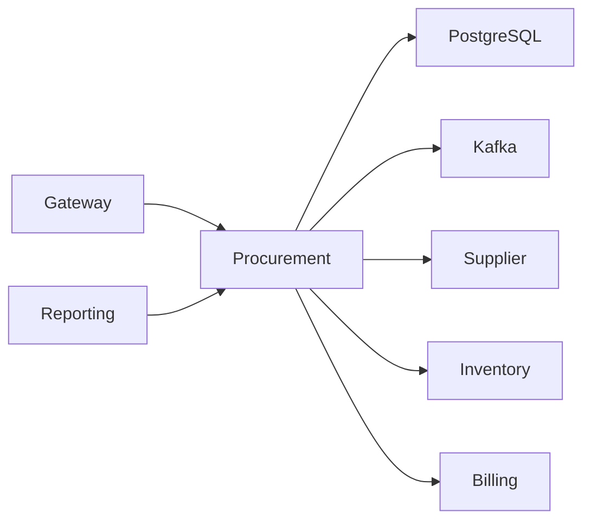
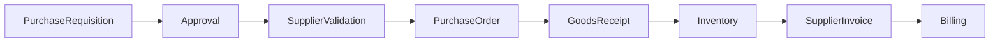
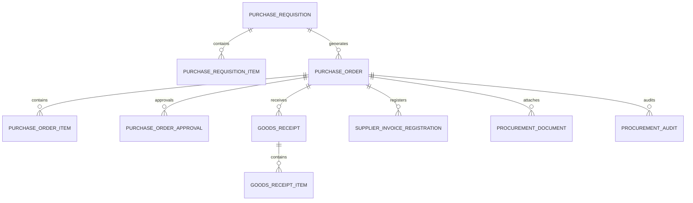
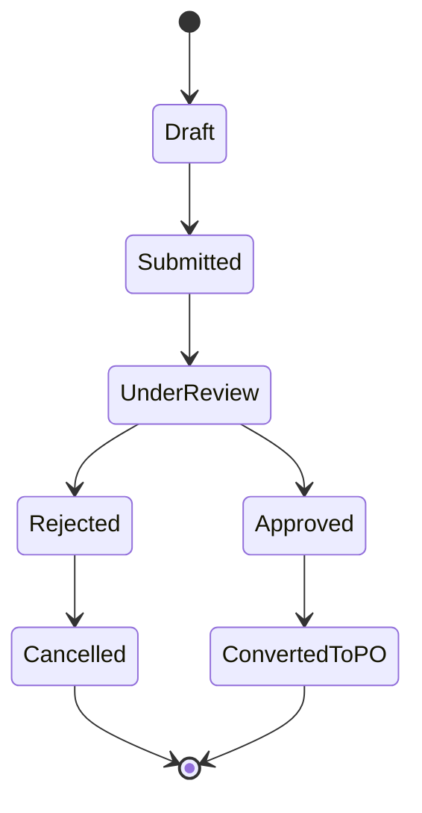
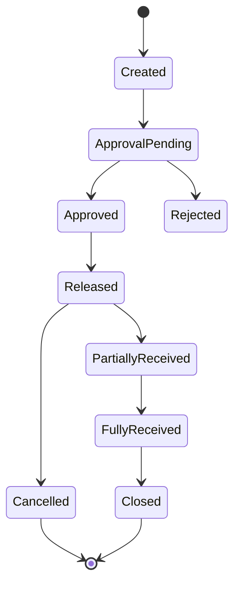
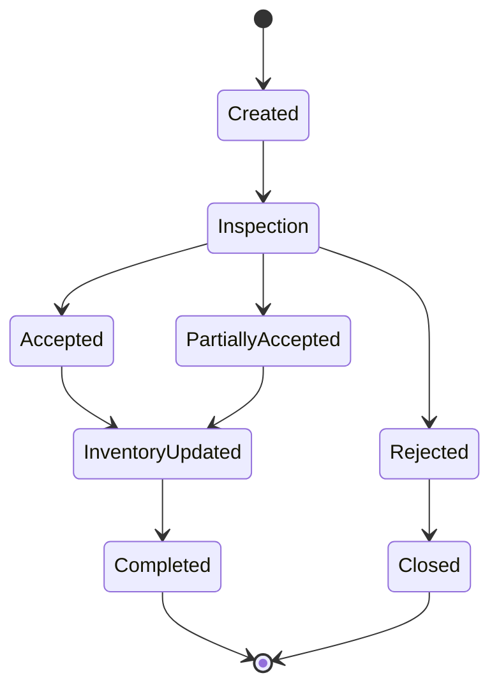
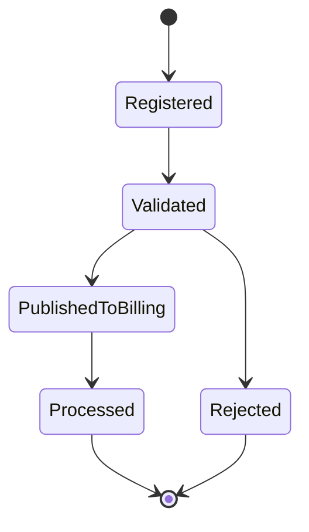
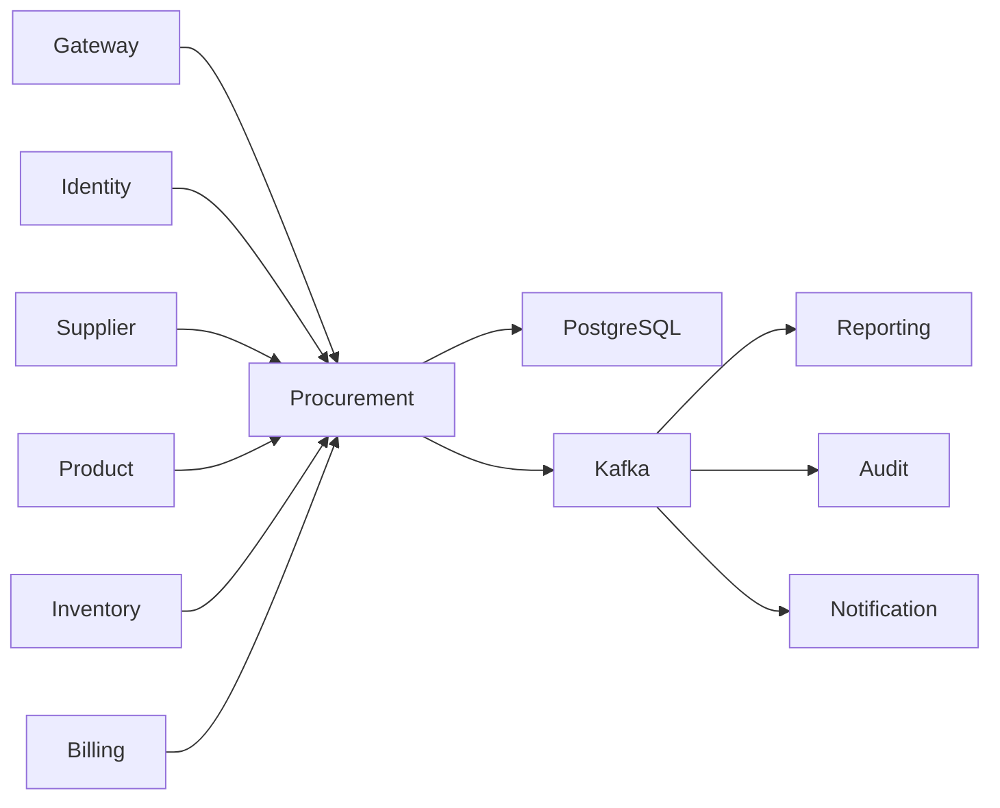

# SRS-014: Procurement Service Software Requirements Specification

---

# 1. Document Information

| Field          | Value                                                   |
| -------------- | ------------------------------------------------------- |
| Project Name   | Distributed Hub and Sales (DHS) Platform                |
| Service Name   | Procurement Service                                     |
| Document Title | Procurement Service Software Requirements Specification |
| Document ID    | SRS-014                                                 |
| Repository     | starone-dhs-platform                                    |
| Module         | procurement-service                                     |
| Document Type  | Software Requirements Specification (SRS)               |
| Standard       | ISO/IEC/IEEE 29148                                      |
| Version        | v1.0.0                                                  |
| Status         | Draft                                                   |
| Author         | Sachin Salunke                                          |
| Owner          | Enterprise Architecture                                 |
| Last Updated   | 2026-06-27                                              |

---

# 2. Document Control

## 2.1 References

| Document        | Description                         |
| --------------- | ----------------------------------- |
| BRD-001         | Business Requirements Document      |
| PRD-001         | Product Requirements Document       |
| ADR-001         | Architecture Decision Record        |
| HLD-001         | High-Level Design                   |
| FRD-Procurement | Procurement Functional Requirements |
| SRS-001         | Platform Foundation                 |
| SRS-005         | Product Service                     |
| SRS-006         | Inventory Service                   |
| SRS-008         | Billing Service                     |
| SRS-013         | Supplier Service                    |

---

## 2.2 Revision History

| Version | Date       | Description                                     |
| ------- | ---------- | ----------------------------------------------- |
| v1.0.0  | 2026-06-27 | Initial Version (Revised Supplier Architecture) |

---

## 2.3 Approval Matrix

| Role                 | Status  |
| -------------------- | ------- |
| Product Owner        | Pending |
| Enterprise Architect | Pending |
| Platform Lead        | Pending |
| QA Lead              | Pending |

---

# 3. Introduction

## 3.1 Purpose

The Procurement Service shall manage the complete procure-to-receive lifecycle.

The service shall manage Purchase Requisitions, Purchase Orders, Goods Receipts, Supplier Invoice Registration, Procurement Approvals, and Procurement Audit while consuming Supplier master data from the Supplier Service.

The Procurement Service shall not own Supplier master information.

---

## 3.2 Scope

The Procurement Service includes:

- Purchase Requisition Management
- Purchase Order Management
- Purchase Order Approval
- Goods Receipt
- Supplier Invoice Registration
- Procurement Workflow
- Procurement Events
- Procurement Audit

---

## 3.3 Out of Scope

The Procurement Service shall not provide:

- Supplier Master
- Product Master
- Inventory Management
- Billing
- Authentication
- Authorization

Supplier Master shall be managed exclusively by **Supplier Service (SRS-013)**.

---

# 4. Service Overview

## Responsibilities

The Procurement Service shall provide:

- Purchase Requisitions
- Purchase Orders
- Approval Workflow
- Goods Receipt
- Supplier Invoice Registration
- Procurement Events

---

## Service Context



---

## Dependencies

| Dependency          | Purpose                     |
| ------------------- | --------------------------- |
| Platform Foundation | Shared Libraries            |
| Gateway             | API Gateway                 |
| Eureka              | Service Discovery           |
| PostgreSQL          | Procurement Database        |
| Kafka               | Event Streaming             |
| Supplier Service    | Supplier Validation         |
| Product Service     | Product Validation          |
| Inventory Service   | Goods Receipt Processing    |
| Billing Service     | Supplier Invoice Processing |

---

# 5. Procurement Workflow



Supplier validation shall be performed using Supplier Service.

---

# 6. Functional Requirements

## Procurement

### PR-SYS-001

The Procurement Service shall create Purchase Requisitions.

---

### PR-SYS-002

The Procurement Service shall approve Purchase Requisitions.

---

### PR-SYS-003

The Procurement Service shall create Purchase Orders.

---

### PR-SYS-004

The Procurement Service shall validate Supplier through Supplier Service.

---

### PR-SYS-005

The Procurement Service shall validate Products through Product Service.

---

### PR-SYS-006

The Procurement Service shall record Goods Receipts.

---

### PR-SYS-007

The Procurement Service shall register Supplier Invoices.

---

### PR-SYS-008

The Procurement Service shall publish Procurement Events.

---

### PR-SYS-009

The Procurement Service shall expose secure REST APIs.

---

### PR-SYS-010

The Procurement Service shall support procurement search and reporting.

---

# 7. Aggregate Root

```text
Procurement
│
├── PurchaseRequisition
├── PurchaseRequisitionItem
├── PurchaseOrder
├── PurchaseOrderItem
├── GoodsReceipt
├── GoodsReceiptItem
├── SupplierInvoice
├── ProcurementApproval
└── ProcurementAudit
```

## Removed from Procurement

The following entities are now owned by Supplier Service and shall not exist within Procurement:

- Supplier
- Supplier Contact
- Supplier Address
- Supplier Bank Account
- Supplier Contract
- Supplier Certification
- Supplier Rating
- Supplier Performance

The Procurement Aggregate shall reference suppliers exclusively by `supplierId`.

---

# 8. Business Rules

The Procurement Service shall enforce procurement governance to ensure purchasing integrity, financial accuracy, inventory synchronization, supplier compliance, and complete auditability.

Supplier master information shall be obtained exclusively from the **Supplier Service (SRS-013)**.

---

# 8.1 Purchase Requisition Rules

### PR-BR-001

Every Purchase Requisition shall have a unique Requisition Number.

---

### PR-BR-002

Purchase Requisition Numbers shall be immutable.

---

### PR-BR-003

A Purchase Requisition shall contain at least one Purchase Requisition Item.

---

### PR-BR-004

Each Purchase Requisition Item shall reference an active Product.

---

### PR-BR-005

Purchase Requisition shall be approved before Purchase Order creation.

---

### PR-BR-006

Rejected Purchase Requisitions shall not generate Purchase Orders.

---

### PR-BR-007

Cancelled Purchase Requisitions shall become read-only.

---

# 8.2 Purchase Order Rules

### PR-BR-008

Every Purchase Order shall have a unique Purchase Order Number.

---

### PR-BR-009

Purchase Order Number shall remain immutable.

---

### PR-BR-010

Every Purchase Order shall reference one approved Purchase Requisition.

---

### PR-BR-011

Every Purchase Order shall reference one Active Supplier using `supplierId`.

---

### PR-BR-012

Supplier validation shall be performed through Supplier Service.

---

### PR-BR-013

Only Active Suppliers shall receive Purchase Orders.

---

### PR-BR-014

Blacklisted or Suspended Suppliers shall not receive Purchase Orders.

---

### PR-BR-015

Approved Purchase Orders shall not be modified except through Purchase Order Amendment workflow.

---

### PR-BR-016

Cancelled Purchase Orders shall never be reactivated.

---

# 8.3 Purchase Order Item Rules

### PR-BR-017

Each Purchase Order Item shall reference one Product.

---

### PR-BR-018

Ordered Quantity shall be greater than zero.

---

### PR-BR-019

Unit Price shall be greater than zero.

---

### PR-BR-020

Line Amount shall equal:

```text
Quantity × Unit Price
```

---

### PR-BR-021

Purchase Order Total shall equal:

```text
Σ(Line Amount)
+ Taxes
+ Charges
- Discounts
```

---

# 8.4 Goods Receipt Rules

### PR-BR-022

Goods Receipt shall reference an Approved Purchase Order.

---

### PR-BR-023

Received Quantity shall never exceed Remaining Ordered Quantity unless Over Delivery is enabled.

---

### PR-BR-024

Partial Goods Receipt shall be supported.

---

### PR-BR-025

Goods Receipt completion shall publish Inventory Receipt events.

---

### PR-BR-026

Completed Goods Receipts shall become immutable.

---

# 8.5 Supplier Invoice Rules

### PR-BR-027

Supplier Invoice Registration shall reference:

- Purchase Order
- Goods Receipt
- Supplier

---

### PR-BR-028

Supplier Invoice Number shall be unique per Supplier.

---

### PR-BR-029

Supplier Invoice Registration shall publish Billing events.

---

### PR-BR-030

Procurement shall not process Supplier Payments.

Supplier Payments shall be owned by Billing Service.

---

# 8.6 Approval Rules

### PR-BR-031

Approval workflow shall support configurable approval levels.

---

### PR-BR-032

Approvers shall not approve their own Purchase Requisitions.

---

### PR-BR-033

Approval History shall remain immutable.

---

### PR-BR-034

Every approval decision shall be auditable.

---

# 8.7 Integration Rules

### PR-BR-035

Supplier Master shall never be duplicated inside Procurement.

---

### PR-BR-036

Supplier lifecycle changes shall be synchronized through Kafka events.

---

### PR-BR-037

Product validation shall use Product Service.

---

### PR-BR-038

Inventory updates shall occur only through Inventory Service.

---

### PR-BR-039

Billing operations shall occur only through Billing Service.

---

# 9. REST API Specification

Base URL

```text
/api/v1/procurement
```

All APIs shall be exposed through the Platform API Gateway.

---

# 9.1 API Overview

| Method | URI                           | Description                 |
| ------ | ----------------------------- | --------------------------- |
| POST   | /requisitions                 | Create Purchase Requisition |
| GET    | /requisitions/{id}            | Get Purchase Requisition    |
| PUT    | /requisitions/{id}            | Update Purchase Requisition |
| POST   | /requisitions/{id}/submit     | Submit for Approval         |
| POST   | /requisitions/{id}/approve    | Approve Requisition         |
| POST   | /purchase-orders              | Create Purchase Order       |
| GET    | /purchase-orders/{id}         | Get Purchase Order          |
| PUT    | /purchase-orders/{id}         | Update Purchase Order       |
| POST   | /purchase-orders/{id}/approve | Approve Purchase Order      |
| POST   | /goods-receipts               | Record Goods Receipt        |
| GET    | /goods-receipts/{id}          | Get Goods Receipt           |
| POST   | /supplier-invoices            | Register Supplier Invoice   |
| GET    | /supplier-invoices/{id}       | Get Supplier Invoice        |

---

# 9.2 Request Headers

| Header           | Required | Description            |
| ---------------- | -------- | ---------------------- |
| Authorization    | Yes      | JWT Bearer Token       |
| X-Correlation-ID | Yes      | Correlation Identifier |
| Content-Type     | Yes      | application/json       |
| Accept           | Yes      | application/json       |

---

# 9.3 Query Parameters

| Parameter           | Description           |
| ------------------- | --------------------- |
| page                | Page Number           |
| size                | Page Size             |
| sort                | Sort Field            |
| direction           | ASC/DESC              |
| requisitionNumber   | Requisition Number    |
| purchaseOrderNumber | Purchase Order Number |
| supplierId          | Supplier Identifier   |
| status              | Procurement Status    |
| fromDate            | Start Date            |
| toDate              | End Date              |

---

# 9.4 Create Purchase Requisition API

```http
POST /api/v1/procurement/requisitions
```

Request

```json
{
  "branchId": "UUID",
  "requiredDate": "2026-08-15",
  "remarks": "Monthly replenishment",
  "items": [
    {
      "productId": "UUID",
      "quantity": 100,
      "unitPrice": 250.0
    }
  ]
}
```

Response

```json
{
  "requisitionId": "UUID",
  "requisitionNumber": "PRQ000001",
  "status": "DRAFT"
}
```

---

# 9.5 Create Purchase Order API

```http
POST /api/v1/procurement/purchase-orders
```

Request

```json
{
  "requisitionId": "UUID",
  "supplierId": "UUID"
}
```

Response

```json
{
  "purchaseOrderId": "UUID",
  "purchaseOrderNumber": "PO000001",
  "status": "CREATED"
}
```

---

# 9.6 Record Goods Receipt API

```http
POST /api/v1/procurement/goods-receipts
```

Request

```json
{
  "purchaseOrderId": "UUID",
  "receivedDate": "2026-08-20",
  "items": [
    {
      "purchaseOrderItemId": "UUID",
      "receivedQuantity": 100
    }
  ]
}
```

---

# 9.7 Register Supplier Invoice API

```http
POST /api/v1/procurement/supplier-invoices
```

Request

```json
{
  "purchaseOrderId": "UUID",
  "supplierId": "UUID",
  "invoiceNumber": "INV-2026-001",
  "invoiceDate": "2026-08-21",
  "invoiceAmount": 25000.0
}
```

---

# 10. Request Models

## PurchaseRequisitionRequest

| Field        | Type                                 | Required |
| ------------ | ------------------------------------ | -------- |
| branchId     | UUID                                 | Yes      |
| requiredDate | LocalDate                            | Yes      |
| remarks      | String                               | No       |
| items        | List<PurchaseRequisitionItemRequest> | Yes      |

---

## PurchaseRequisitionItemRequest

| Field     | Type       | Required |
| --------- | ---------- | -------- |
| productId | UUID       | Yes      |
| quantity  | BigDecimal | Yes      |
| unitPrice | BigDecimal | Yes      |

---

## PurchaseOrderRequest

| Field         | Type | Required |
| ------------- | ---- | -------- |
| requisitionId | UUID | Yes      |
| supplierId    | UUID | Yes      |

---

## GoodsReceiptRequest

| Field           | Type                          | Required |
| --------------- | ----------------------------- | -------- |
| purchaseOrderId | UUID                          | Yes      |
| receivedDate    | LocalDate                     | Yes      |
| items           | List<GoodsReceiptItemRequest> | Yes      |

---

## GoodsReceiptItemRequest

| Field               | Type       | Required |
| ------------------- | ---------- | -------- |
| purchaseOrderItemId | UUID       | Yes      |
| receivedQuantity    | BigDecimal | Yes      |

---

## SupplierInvoiceRequest

| Field           | Type       | Required |
| --------------- | ---------- | -------- |
| purchaseOrderId | UUID       | Yes      |
| supplierId      | UUID       | Yes      |
| invoiceNumber   | String     | Yes      |
| invoiceDate     | LocalDate  | Yes      |
| invoiceAmount   | BigDecimal | Yes      |

---

# 11. Response Models

## PurchaseRequisitionResponse

| Field             | Type              |
| ----------------- | ----------------- |
| requisitionId     | UUID              |
| requisitionNumber | String            |
| status            | RequisitionStatus |
| totalAmount       | BigDecimal        |

---

## PurchaseOrderResponse

| Field               | Type                |
| ------------------- | ------------------- |
| purchaseOrderId     | UUID                |
| purchaseOrderNumber | String              |
| supplierId          | UUID                |
| status              | PurchaseOrderStatus |
| totalAmount         | BigDecimal          |

---

## GoodsReceiptResponse

| Field              | Type               |
| ------------------ | ------------------ |
| goodsReceiptId     | UUID               |
| goodsReceiptNumber | String             |
| status             | GoodsReceiptStatus |

---

## SupplierInvoiceResponse

| Field             | Type                      |
| ----------------- | ------------------------- |
| supplierInvoiceId | UUID                      |
| invoiceNumber     | String                    |
| status            | InvoiceRegistrationStatus |

---

# 12. Validation Rules

## Purchase Requisition

- Branch shall exist.
- Product shall exist.
- Product shall be Active.
- Quantity shall be greater than zero.
- Required Date shall not be in the past.

---

## Purchase Order

- Purchase Requisition shall exist.
- Purchase Requisition shall be Approved.
- Supplier shall exist.
- Supplier shall be Active.
- Supplier shall not be Blacklisted.
- Purchase Order shall contain at least one Item.

---

## Goods Receipt

- Purchase Order shall exist.
- Purchase Order shall be Approved.
- Received Quantity shall be valid.
- Goods Receipt Date shall not precede Purchase Order Date.

---

## Supplier Invoice

- Supplier shall exist.
- Purchase Order shall exist.
- Invoice Number shall be unique for the Supplier.
- Invoice Amount shall be greater than zero.

---

# 13. Permission Matrix

| API                       | Super Admin | Procurement Manager | Procurement Officer | Store Manager | Viewer |
| ------------------------- | ----------- | ------------------- | ------------------- | ------------- | ------ |
| Create Requisition        | ✅          | ✅                  | ✅                  | ✅            | ❌     |
| Update Requisition        | ✅          | ✅                  | ✅                  | ❌            | ❌     |
| Approve Requisition       | ✅          | ✅                  | ❌                  | ❌            | ❌     |
| Create Purchase Order     | ✅          | ✅                  | ✅                  | ❌            | ❌     |
| Approve Purchase Order    | ✅          | ✅                  | ❌                  | ❌            | ❌     |
| Record Goods Receipt      | ✅          | ✅                  | ✅                  | ✅            | ❌     |
| Register Supplier Invoice | ✅          | ✅                  | ✅                  | ❌            | ❌     |
| Search Procurement        | ✅          | ✅                  | ✅                  | ✅            | ✅     |

---

# 14. Standard HTTP Status Codes

| Status | Description             |
| ------ | ----------------------- |
| 200    | Success                 |
| 201    | Created                 |
| 204    | Updated                 |
| 400    | Validation Error        |
| 401    | Unauthorized            |
| 403    | Forbidden               |
| 404    | Resource Not Found      |
| 409    | Duplicate Resource      |
| 422    | Business Rule Violation |
| 500    | Internal Server Error   |

---

# 15. Aggregate Model

The Procurement Service shall implement the Procurement domain using Domain-Driven Design (DDD).

The **Procurement** aggregate shall own the complete procure-to-receive lifecycle while consuming Supplier master information from the Supplier Service.

Supplier shall **not** be part of the Procurement Aggregate.

---

# 15.1 Procurement Aggregate

```text
Procurement
│
├── PurchaseRequisition
├── PurchaseRequisitionItem
├── PurchaseOrder
├── PurchaseOrderItem
├── PurchaseOrderApproval
├── GoodsReceipt
├── GoodsReceiptItem
├── SupplierInvoiceRegistration
├── ProcurementDocument
└── ProcurementAudit
```

---

## Aggregate Responsibilities

| Aggregate                   | Responsibility                |
| --------------------------- | ----------------------------- |
| Procurement                 | Aggregate Root                |
| PurchaseRequisition         | Internal Purchase Request     |
| PurchaseRequisitionItem     | Requested Products            |
| PurchaseOrder               | Purchase Contract             |
| PurchaseOrderItem           | Ordered Products              |
| PurchaseOrderApproval       | Approval Workflow             |
| GoodsReceipt                | Goods Receipt                 |
| GoodsReceiptItem            | Received Products             |
| SupplierInvoiceRegistration | Supplier Invoice Registration |
| ProcurementDocument         | Procurement Attachments       |
| ProcurementAudit            | Audit Trail                   |

---

# 16. Entity Model

## 16.1 Entity Overview

| Entity                      | Description                |
| --------------------------- | -------------------------- |
| Procurement                 | Aggregate Root             |
| PurchaseRequisition         | Purchase Request           |
| PurchaseRequisitionItem     | Requested Product          |
| PurchaseOrder               | Purchase Order             |
| PurchaseOrderItem           | Ordered Product            |
| PurchaseOrderApproval       | Approval Workflow          |
| GoodsReceipt                | Goods Receipt              |
| GoodsReceiptItem            | Received Product           |
| SupplierInvoiceRegistration | Supplier Invoice Reference |
| ProcurementDocument         | Attachments                |
| ProcurementAudit            | Audit Trail                |

---

# 16.2 Purchase Requisition

| Attribute         | Type          | Constraint  |
| ----------------- | ------------- | ----------- |
| id                | UUID          | Primary Key |
| requisitionNumber | VARCHAR(30)   | Unique      |
| branchId          | UUID          | Required    |
| requestedBy       | UUID          | Required    |
| requiredDate      | DATE          | Required    |
| priority          | ENUM          | Required    |
| status            | ENUM          | Required    |
| remarks           | VARCHAR(500)  | Optional    |
| totalAmount       | DECIMAL(18,2) | Required    |
| createdAt         | TIMESTAMP     | Required    |
| updatedAt         | TIMESTAMP     | Required    |

---

# 16.3 Purchase Requisition Item

| Attribute     | Type          |
| ------------- | ------------- |
| id            | UUID          |
| requisitionId | UUID          |
| productId     | UUID          |
| quantity      | DECIMAL(18,3) |
| unitPrice     | DECIMAL(18,2) |
| lineAmount    | DECIMAL(18,2) |

---

# 16.4 Purchase Order

| Attribute            | Type          |
| -------------------- | ------------- |
| id                   | UUID          |
| purchaseOrderNumber  | VARCHAR(30)   |
| requisitionId        | UUID          |
| supplierId           | UUID          |
| purchaseOrderDate    | DATE          |
| expectedDeliveryDate | DATE          |
| status               | ENUM          |
| currency             | VARCHAR(10)   |
| subtotal             | DECIMAL(18,2) |
| taxAmount            | DECIMAL(18,2) |
| discountAmount       | DECIMAL(18,2) |
| totalAmount          | DECIMAL(18,2) |

> `supplierId` is a foreign business reference to the Supplier Service. Procurement shall not duplicate Supplier master information.

---

# 16.5 Purchase Order Item

| Attribute       | Type          |
| --------------- | ------------- |
| id              | UUID          |
| purchaseOrderId | UUID          |
| productId       | UUID          |
| orderedQuantity | DECIMAL(18,3) |
| unitPrice       | DECIMAL(18,2) |
| taxAmount       | DECIMAL(18,2) |
| discountAmount  | DECIMAL(18,2) |
| lineAmount      | DECIMAL(18,2) |

---

# 16.6 Purchase Order Approval

| Attribute       | Type         |
| --------------- | ------------ |
| id              | UUID         |
| purchaseOrderId | UUID         |
| approvalLevel   | INTEGER      |
| approverId      | UUID         |
| approvalStatus  | ENUM         |
| approvalDate    | TIMESTAMP    |
| remarks         | VARCHAR(500) |

---

# 16.7 Goods Receipt

| Attribute          | Type        |
| ------------------ | ----------- |
| id                 | UUID        |
| goodsReceiptNumber | VARCHAR(30) |
| purchaseOrderId    | UUID        |
| receivedDate       | DATE        |
| warehouseId        | UUID        |
| status             | ENUM        |
| receivedBy         | UUID        |

---

# 16.8 Goods Receipt Item

| Attribute           | Type          |
| ------------------- | ------------- |
| id                  | UUID          |
| goodsReceiptId      | UUID          |
| purchaseOrderItemId | UUID          |
| orderedQuantity     | DECIMAL(18,3) |
| receivedQuantity    | DECIMAL(18,3) |
| acceptedQuantity    | DECIMAL(18,3) |
| rejectedQuantity    | DECIMAL(18,3) |

---

# 16.9 Supplier Invoice Registration

| Attribute       | Type          |
| --------------- | ------------- |
| id              | UUID          |
| purchaseOrderId | UUID          |
| supplierId      | UUID          |
| invoiceNumber   | VARCHAR(100)  |
| invoiceDate     | DATE          |
| invoiceAmount   | DECIMAL(18,2) |
| status          | ENUM          |

> Billing Service owns invoice processing and payment. Procurement only records supplier invoice registration.

---

# 16.10 Procurement Document

| Attribute     | Type         |
| ------------- | ------------ |
| id            | UUID         |
| referenceType | ENUM         |
| referenceId   | UUID         |
| documentType  | ENUM         |
| documentName  | VARCHAR(255) |
| documentPath  | VARCHAR(500) |
| uploadedAt    | TIMESTAMP    |

---

# 16.11 Procurement Audit

| Attribute     | Type         |
| ------------- | ------------ |
| id            | UUID         |
| referenceType | ENUM         |
| referenceId   | UUID         |
| eventType     | VARCHAR(100) |
| correlationId | UUID         |
| createdAt     | TIMESTAMP    |

---

# 17. Database Design

Database

```text
procurement_db
```

Schema

```text
procurement
```

---

## 17.1 Tables

| Table                         | Purpose                       |
| ----------------------------- | ----------------------------- |
| purchase_requisition          | Purchase Requisition          |
| purchase_requisition_item     | Requested Products            |
| purchase_order                | Purchase Orders               |
| purchase_order_item           | Ordered Products              |
| purchase_order_approval       | Approval Workflow             |
| goods_receipt                 | Goods Receipt                 |
| goods_receipt_item            | Goods Receipt Items           |
| supplier_invoice_registration | Supplier Invoice Registration |
| procurement_document          | Procurement Attachments       |
| procurement_audit             | Audit Trail                   |

---

## 17.2 Primary Keys

All entities shall use UUID as the Primary Key.

---

## 17.3 Foreign Keys

| Child                         | Parent               |
| ----------------------------- | -------------------- |
| purchase_requisition_item     | purchase_requisition |
| purchase_order                | purchase_requisition |
| purchase_order_item           | purchase_order       |
| purchase_order_approval       | purchase_order       |
| goods_receipt                 | purchase_order       |
| goods_receipt_item            | goods_receipt        |
| supplier_invoice_registration | purchase_order       |

> `supplierId`, `productId`, `branchId`, and `warehouseId` are service references and shall not be enforced as database foreign keys because they belong to separate bounded contexts.

---

## 17.4 Constraints

### Purchase Requisition

- Requisition Number UNIQUE

---

### Purchase Order

- Purchase Order Number UNIQUE
- Approved Requisition Required
- Active Supplier Required

---

### Goods Receipt

- Goods Receipt Number UNIQUE

---

### Supplier Invoice Registration

- Invoice Number UNIQUE per Supplier

---

## 17.5 Indexes

| Table                         | Index                 |
| ----------------------------- | --------------------- |
| purchase_requisition          | requisition_number    |
| purchase_requisition          | status                |
| purchase_order                | purchase_order_number |
| purchase_order                | supplier_id           |
| purchase_order                | status                |
| goods_receipt                 | purchase_order_id     |
| supplier_invoice_registration | invoice_number        |
| purchase_order_approval       | approver_id           |

---

# 18. Entity Relationship Diagram



---

# 19. Procurement State Machines

## 19.1 Purchase Requisition Lifecycle



---

## 19.2 Purchase Order Lifecycle



---

## 19.3 Goods Receipt Lifecycle



---

## 19.4 Supplier Invoice Registration Lifecycle



---

# 20. Security Requirements

The Procurement Service shall delegate authentication and authorization to the Identity Service.

## Authentication

### PR-SEC-001

Every request shall contain a valid JWT Access Token.

---

### PR-SEC-002

Authentication shall be delegated to Identity Service.

---

### PR-SEC-003

Unauthenticated requests shall return HTTP 401.

---

## Authorization

### PR-SEC-004

Procurement APIs shall enforce Role-Based Access Control.

---

### PR-SEC-005

Purchase Order approval shall require Procurement Manager or delegated approval authority.

---

### PR-SEC-006

Goods Receipt operations shall require warehouse or store permissions.

---

### PR-SEC-007

Unauthorized requests shall return HTTP 403.

---

## Data Security

### PR-SEC-008

All communication shall use TLS 1.3.

---

### PR-SEC-009

Procurement documents shall support encrypted storage.

---

### PR-SEC-010

Approval history shall be immutable.

---

# 21. Kafka Event Specification

The Procurement Service shall publish procurement lifecycle events and consume events from related bounded contexts.

---

## 21.1 Published Events

| Topic                                      | Event                       |
| ------------------------------------------ | --------------------------- |
| procurement.requisition.created.v1         | PurchaseRequisitionCreated  |
| procurement.requisition.approved.v1        | PurchaseRequisitionApproved |
| procurement.purchase-order.created.v1      | PurchaseOrderCreated        |
| procurement.purchase-order.approved.v1     | PurchaseOrderApproved       |
| procurement.goods-receipt.completed.v1     | GoodsReceiptCompleted       |
| procurement.supplier-invoice.registered.v1 | SupplierInvoiceRegistered   |

---

## 21.2 Consumed Events

| Topic                          | Source            |
| ------------------------------ | ----------------- |
| supplier.created.v1            | Supplier Service  |
| supplier.updated.v1            | Supplier Service  |
| supplier.activated.v1          | Supplier Service  |
| supplier.deactivated.v1        | Supplier Service  |
| supplier.blacklisted.v1        | Supplier Service  |
| product.updated.v1             | Product Service   |
| inventory.receipt.completed.v1 | Inventory Service |
| billing.invoice.processed.v1   | Billing Service   |

---

## 21.3 Standard Event Structure

```json
{
  "eventId": "UUID",
  "eventType": "PurchaseOrderApproved",
  "eventVersion": "1.0",
  "occurredAt": "2026-06-27T10:30:00Z",
  "correlationId": "UUID",
  "payload": {}
}
```

---

# 22. External Interfaces

| Interface         | Purpose                     |
| ----------------- | --------------------------- |
| API Gateway       | REST APIs                   |
| Kafka             | Event Streaming             |
| PostgreSQL        | Procurement Database        |
| Supplier Service  | Supplier Validation         |
| Product Service   | Product Validation          |
| Inventory Service | Inventory Synchronization   |
| Billing Service   | Supplier Invoice Processing |

---

# 23. OpenFeign Clients

| Client          | Purpose                                                |
| --------------- | ------------------------------------------------------ |
| SupplierClient  | Validate Supplier & Retrieve Supplier Summary          |
| ProductClient   | Validate Products                                      |
| InventoryClient | Inventory Availability & Goods Receipt Synchronization |
| BillingClient   | Supplier Invoice Registration Status                   |
| IdentityClient  | User & Permission Validation                           |

> OpenFeign shall be used only for synchronous validation and reference lookups. Business state synchronization shall occur through Kafka events.

---

# 24. Configuration

Configuration shall be externalized using the centralized configuration repository.

## Configuration Categories

- Server
- Database
- Kafka
- Security
- Procurement
- Purchase Requisition
- Purchase Order
- Approval Workflow
- Goods Receipt
- OpenFeign
- Logging
- Observability

---

## Configuration Properties

| Property                               | Default | Required | Description                         |
| -------------------------------------- | ------- | -------- | ----------------------------------- |
| procurement.requisition.auto-number    | true    | Yes      | Auto-generate Requisition Number    |
| procurement.purchase-order.auto-number | true    | Yes      | Auto-generate Purchase Order Number |
| procurement.goods-receipt.auto-number  | true    | Yes      | Auto-generate Goods Receipt Number  |
| procurement.approval.enabled           | true    | Yes      | Enable Approval Workflow            |
| procurement.approval.max-level         | 5       | Yes      | Maximum Approval Levels             |
| procurement.supplier.validation.mode   | FEIGN   | Yes      | Supplier Validation Strategy        |
| procurement.kafka.retry.max-attempts   | 3       | Yes      | Kafka Retry Attempts                |
| procurement.search.max-page-size       | 100     | Yes      | Maximum Search Page Size            |

---

# 25. Service Context Diagram



---

# 26. Error Handling

The Procurement Service shall provide standardized error handling for purchase requisitions, purchase orders, goods receipt, supplier invoice registration, approval workflows, and integrations.

All error responses shall comply with the Platform Foundation error model defined in **SRS-001 – Platform Foundation**.

---

## 26.1 Functional Requirements

### PR-SYS-011

The Procurement Service shall return standardized error responses.

---

### PR-SYS-012

Business exceptions shall be distinguishable from technical exceptions.

---

### PR-SYS-013

Every error response shall include a Correlation ID.

---

### PR-SYS-014

Unhandled exceptions shall return HTTP 500.

---

### PR-SYS-015

Internal implementation details shall never be exposed to API consumers.

---

### PR-SYS-016

Failed Kafka publications shall follow the configured retry policy.

---

### PR-SYS-017

Messages exceeding retry attempts shall be published to the Dead Letter Queue (DLQ).

---

## 26.2 Standard Error Response

```json
{
  "timestamp": "2026-06-27T10:30:00Z",
  "status": 422,
  "error": "Purchase Order Validation Failed",
  "code": "PR-BUS-001",
  "message": "Supplier is inactive.",
  "correlationId": "UUID",
  "path": "/api/v1/procurement/purchase-orders"
}
```

---

## 26.3 Business Error Catalog

| Error Code  | Description                       | HTTP |
| ----------- | --------------------------------- | ---- |
| PR-VAL-001  | Validation Failed                 | 400  |
| PR-AUTH-001 | Authentication Required           | 401  |
| PR-AUTH-002 | Access Denied                     | 403  |
| PR-BUS-001  | Supplier Not Active               | 422  |
| PR-BUS-002  | Purchase Requisition Not Found    | 404  |
| PR-BUS-003  | Purchase Order Not Found          | 404  |
| PR-BUS-004  | Goods Receipt Not Found           | 404  |
| PR-BUS-005  | Duplicate Supplier Invoice        | 409  |
| PR-BUS-006  | Approval Required                 | 422  |
| PR-BUS-007  | Purchase Order Already Closed     | 409  |
| PR-BUS-008  | Quantity Exceeds Ordered Quantity | 422  |
| PR-BUS-009  | Invalid Procurement State         | 422  |
| PR-BUS-010  | Supplier Blacklisted              | 422  |
| PR-SYS-001  | Internal Server Error             | 500  |

---

# 27. Logging Requirements

The Procurement Service shall use the Platform Foundation logging framework.

---

## 27.1 Functional Requirements

### PR-SYS-018

Purchase Requisition operations shall generate audit logs.

---

### PR-SYS-019

Purchase Order operations shall generate audit logs.

---

### PR-SYS-020

Purchase Order Approval operations shall generate audit logs.

---

### PR-SYS-021

Goods Receipt operations shall generate audit logs.

---

### PR-SYS-022

Supplier Invoice Registration shall generate audit logs.

---

### PR-SYS-023

Business and technical exceptions shall be logged.

---

## 27.2 Log Attributes

Every log entry shall include:

- Timestamp
- Service Name
- Correlation ID
- Trace ID
- Span ID
- Purchase Requisition ID
- Purchase Order ID
- Goods Receipt ID
- Supplier Invoice ID
- Supplier ID
- User ID
- HTTP Method
- Request URI
- HTTP Status
- Processing Time

---

## 27.3 Sensitive Information

The following information shall never be logged:

- JWT Tokens
- Authorization Headers
- Supplier Banking Information
- Supplier Tax Information
- Procurement Attachments
- Passwords
- Encryption Keys

---

# 28. Observability Requirements

The Procurement Service shall expose operational metrics through the Platform Foundation.

---

## 28.1 Functional Requirements

### PR-SYS-024

The Procurement Service shall expose Health endpoints.

---

### PR-SYS-025

The Procurement Service shall expose Metrics endpoints.

---

### PR-SYS-026

The Procurement Service shall support Distributed Tracing.

---

### PR-SYS-027

Every procurement transaction shall propagate Correlation IDs.

---

### PR-SYS-028

Procurement business metrics shall be published.

---

## 28.2 Business Metrics

The Procurement Service shall publish:

- Purchase Requisitions Created
- Purchase Requisitions Approved
- Purchase Orders Created
- Purchase Orders Approved
- Purchase Orders Released
- Goods Receipts Completed
- Supplier Invoices Registered
- Approval Processing Time
- Procurement Cycle Time
- Kafka Consumer Lag
- API Response Time

---

# 29. Non-Functional Requirements

## 29.1 Performance

### PR-NFR-001

Purchase Requisition creation shall complete within **1 second**.

---

### PR-NFR-002

Purchase Order creation shall complete within **2 seconds**.

---

### PR-NFR-003

Goods Receipt processing shall complete within **2 seconds**.

---

### PR-NFR-004

Procurement search APIs shall support pagination, filtering, and sorting within **500 milliseconds**.

---

## 29.2 Availability

### PR-NFR-005

The Procurement Service shall maintain at least **99.9% availability**.

---

### PR-NFR-006

The Procurement Service shall support horizontal scaling.

---

## 29.3 Reliability

### PR-NFR-007

Procurement events shall guarantee at-least-once delivery.

---

### PR-NFR-008

Business operations shall be idempotent.

---

### PR-NFR-009

Approval workflow state shall remain consistent after service recovery.

---

### PR-NFR-010

Procurement records shall remain durable.

---

## 29.4 Scalability

### PR-NFR-011

The Procurement Service shall support concurrent procurement operations.

---

### PR-NFR-012

The Procurement Service shall support enterprise-scale procurement workloads.

---

## 29.5 Security

### PR-NFR-013

All communication shall use TLS 1.3.

---

### PR-NFR-014

Every protected API shall enforce Role-Based Access Control (RBAC).

---

### PR-NFR-015

Procurement documents shall be encrypted at rest.

---

### PR-NFR-016

Approval history shall be immutable.

---

## 29.6 Maintainability

### PR-NFR-017

The Procurement Service shall use Platform Foundation shared libraries.

---

### PR-NFR-018

The Procurement Service shall comply with enterprise coding standards.

---

# 30. Requirement Traceability Matrix

| Requirement             | Source                      | Verification                                |
| ----------------------- | --------------------------- | ------------------------------------------- |
| PR-SYS-001 – PR-SYS-010 | FRD-Procurement             | Functional Testing                          |
| PR-SYS-011 – PR-SYS-028 | SRS-001 Platform Foundation | Integration Testing                         |
| PR-NFR-001 – PR-NFR-018 | PRD / HLD                   | Performance, Reliability & Security Testing |

---

# 31. Testability Matrix

| Requirement | Test Case |
| ----------- | --------- |
| PR-SYS-001  | TC-PR-001 |
| PR-SYS-002  | TC-PR-002 |
| PR-SYS-003  | TC-PR-003 |
| PR-SYS-004  | TC-PR-004 |
| PR-SYS-005  | TC-PR-005 |
| PR-SYS-006  | TC-PR-006 |
| PR-SYS-007  | TC-PR-007 |
| PR-SYS-008  | TC-PR-008 |
| PR-SYS-009  | TC-PR-009 |
| PR-SYS-010  | TC-PR-010 |

---

# 32. Acceptance Criteria

The Procurement Service shall be considered complete when:

- Purchase Requisition management operates successfully.
- Approval workflow enforces configured approval levels.
- Purchase Orders are generated only for approved requisitions.
- Supplier validation is performed through the Supplier Service.
- Goods Receipts are processed and synchronized with the Inventory Service.
- Supplier Invoice Registration events are successfully published to the Billing Service.
- Procurement lifecycle events are published through Kafka.
- Standardized error responses are returned.
- Logging and observability are operational.
- Health endpoints are operational.
- Performance objectives are achieved.
- Security requirements are satisfied.
- Functional, integration, performance, security, and non-functional tests pass successfully.

---

# 33. Appendices

## Appendix A – API Summary

| Resource                      | Endpoints                                    |
| ----------------------------- | -------------------------------------------- |
| Purchase Requisition          | Create, Update, Submit, Approve, Search, Get |
| Purchase Order                | Create, Update, Approve, Search, Get         |
| Goods Receipt                 | Record, Search, Get                          |
| Supplier Invoice Registration | Register, Search, Get                        |
| Procurement Documents         | Upload, Download, Delete                     |

---

## Appendix B – Aggregate Summary

| Aggregate                   | Description                   |
| --------------------------- | ----------------------------- |
| Procurement                 | Aggregate Root                |
| PurchaseRequisition         | Purchase Request              |
| PurchaseRequisitionItem     | Requested Products            |
| PurchaseOrder               | Purchase Order                |
| PurchaseOrderItem           | Ordered Products              |
| PurchaseOrderApproval       | Approval Workflow             |
| GoodsReceipt                | Goods Receipt                 |
| GoodsReceiptItem            | Received Products             |
| SupplierInvoiceRegistration | Supplier Invoice Registration |
| ProcurementDocument         | Attachments                   |
| ProcurementAudit            | Audit Trail                   |

---

## Appendix C – Service Dependencies

| Dependency           | Purpose                        |
| -------------------- | ------------------------------ |
| Platform Foundation  | Shared Frameworks              |
| Gateway              | API Routing                    |
| Eureka               | Service Discovery              |
| PostgreSQL           | Procurement Database           |
| Kafka                | Event Streaming                |
| Identity Service     | Authentication & Authorization |
| Supplier Service     | Supplier Master & Validation   |
| Product Service      | Product Validation             |
| Inventory Service    | Goods Receipt Synchronization  |
| Billing Service      | Supplier Invoice Processing    |
| Notification Service | Procurement Notifications      |
| Audit Service        | Audit Trail                    |
| Reporting Service    | Procurement Analytics          |

---

## Appendix D – Revision History

| Version | Description                                                              |
| ------- | ------------------------------------------------------------------------ |
| v1.0.0  | Initial Procurement Service Specification (Supplier Service Integration) |

---

# 34. Document Sign-off

| Role                 | Status  |
| -------------------- | ------- |
| Product Owner        | Pending |
| Enterprise Architect | Pending |
| Platform Lead        | Pending |
| Security Lead        | Pending |
| QA Lead              | Pending |

---

# End of Document
