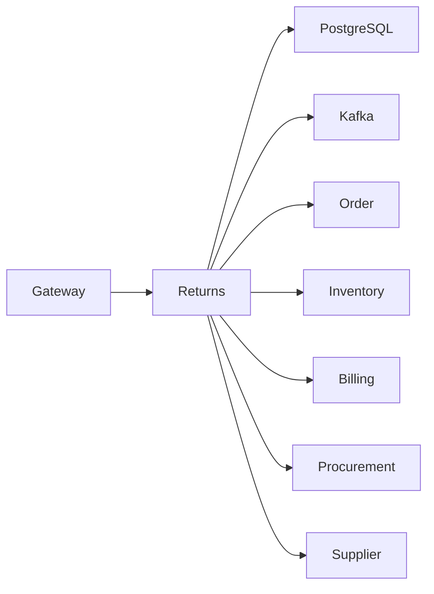
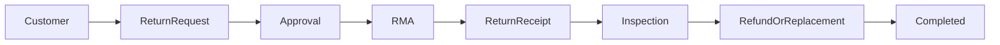
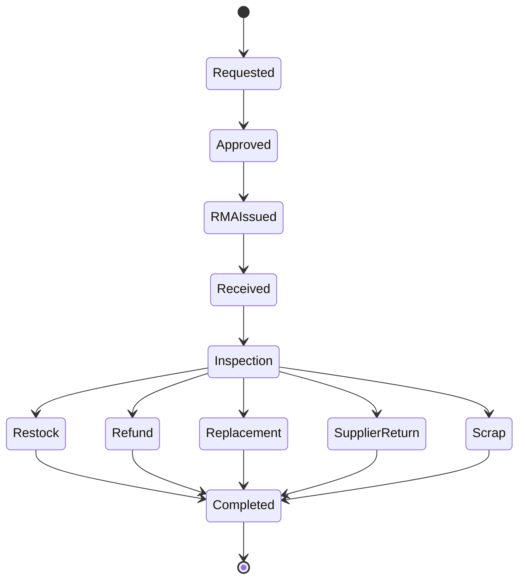
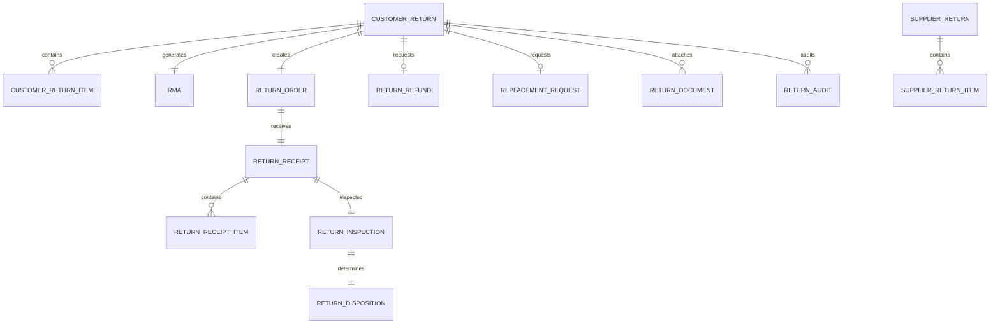
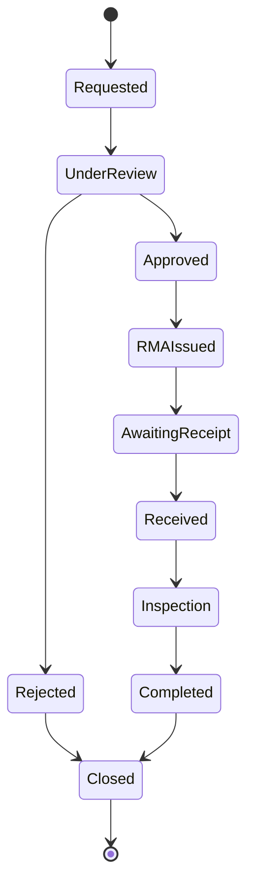
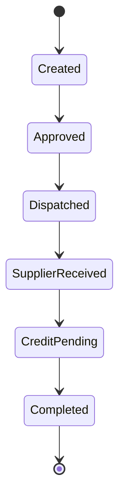
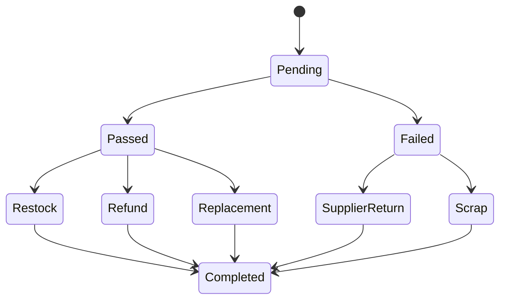
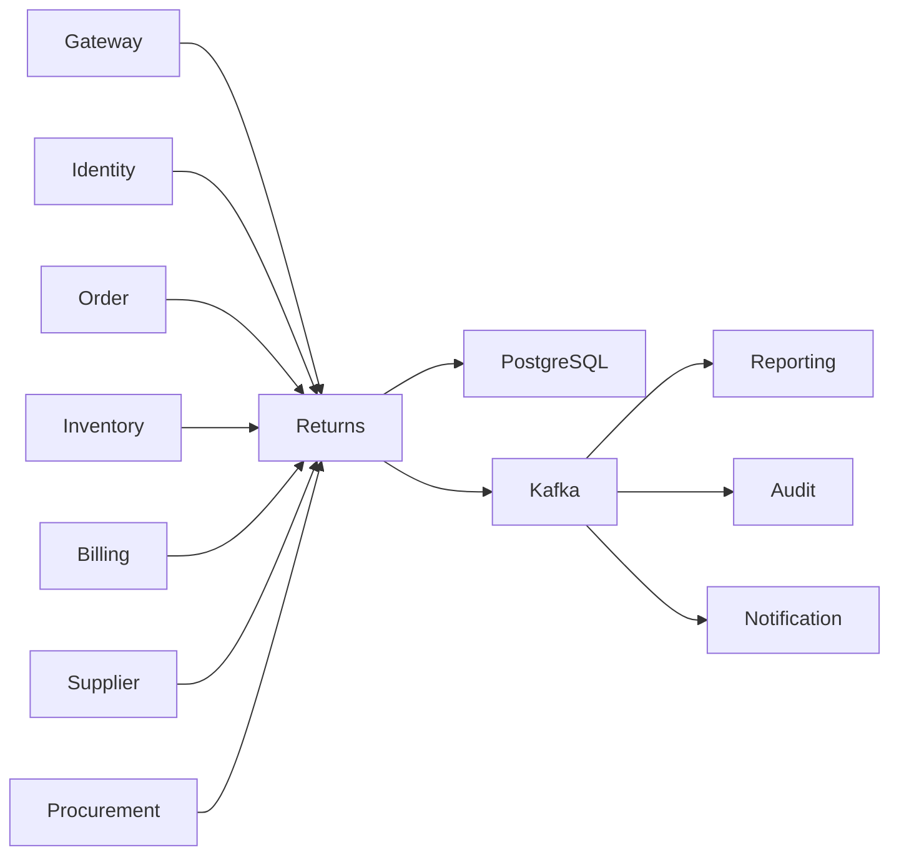

# SRS-015: Returns Service Software Requirements Specification

---

# 1. Document Information

| Field | Value |
|--------|-------|
| Project Name | Distributed Hub and Sales (DHS) Platform |
| Service Name | Returns Service |
| Document Title | Returns Service Software Requirements Specification |
| Document ID | SRS-015 |
| Repository | starone-dhs-platform |
| Module | returns-service |
| Document Type | Software Requirements Specification (SRS) |
| Standard | ISO/IEC/IEEE 29148 |
| Version | v1.0.0 |
| Status | Draft |
| Author | Sachin Salunke |
| Owner | Enterprise Architecture |
| Last Updated | 2026-06-27 |

---

# 2. Document Control

## 2.1 References

| Document | Description |
|----------|-------------|
| BRD-001 | Business Requirements Document |
| PRD-001 | Product Requirements Document |
| ADR-001 | Architecture Decision Record |
| HLD-001 | High-Level Design |
| FRD-Returns | Returns Functional Requirements |
| SRS-001 | Platform Foundation |
| SRS-004 | Customer Service |
| SRS-005 | Product Service |
| SRS-006 | Inventory Service |
| SRS-007 | Order Service |
| SRS-008 | Billing Service |
| SRS-009 | Dispatch Service |
| SRS-013 | Supplier Service |
| SRS-014 | Procurement Service |

---

## 2.2 Revision History

| Version | Date | Description |
|---------|------|-------------|
| v1.0.0 | 2026-06-27 | Initial Version |

---

## 2.3 Approval Matrix

| Role | Status |
|------|--------|
| Product Owner | Pending |
| Enterprise Architect | Pending |
| Platform Lead | Pending |
| QA Lead | Pending |

---

# 3. Introduction

## 3.1 Purpose

The Returns Service shall manage the complete lifecycle of customer returns and supplier returns.

The service shall provide Return Merchandise Authorization (RMA), return order processing, return receipts, inspection, disposition, refund initiation, replacement initiation, supplier return processing, and return audit.

The Returns Service shall be the authoritative source for all return transactions.

---

## 3.2 Scope

The Returns Service includes:

- Customer Return Requests
- Supplier Return Requests
- Return Merchandise Authorization (RMA)
- Return Orders
- Return Receipts
- Product Inspection
- Return Approval Workflow
- Refund Initiation
- Replacement Initiation
- Supplier Return Processing
- Return Audit
- Return Event Publishing

---

## 3.3 Out of Scope

The Returns Service shall not provide:

- Order Management
- Product Master
- Customer Master
- Supplier Master
- Inventory Ownership
- Billing Ownership
- Authentication
- Authorization

---

# 4. Service Overview

## Responsibilities

The Returns Service shall provide:

- Customer Returns
- Supplier Returns
- RMA Management
- Return Order Management
- Return Receipt Management
- Return Inspection
- Refund Initiation
- Replacement Initiation
- Return Audit

---

## Service Context



---

## Dependencies

| Dependency | Purpose |
|------------|---------|
| Platform Foundation | Shared Libraries |
| Gateway | API Routing |
| Eureka | Service Discovery |
| PostgreSQL | Returns Database |
| Kafka | Event Streaming |
| Order Service | Validate Customer Orders |
| Product Service | Product Validation |
| Inventory Service | Stock Updates |
| Billing Service | Refund Processing |
| Supplier Service | Supplier Validation |
| Procurement Service | Supplier Return Processing |

---

# 5. Business Process

## Customer Return Workflow



---

## Supplier Return Workflow


---

# 6. Functional Requirements

## Return Management

### RT-SYS-001

The Returns Service shall manage Customer Return Requests.

---

### RT-SYS-002

The Returns Service shall manage Supplier Return Requests.

---

### RT-SYS-003

The Returns Service shall generate Return Merchandise Authorizations (RMAs).

---

### RT-SYS-004

The Returns Service shall manage Return Orders.

---

### RT-SYS-005

The Returns Service shall manage Return Receipts.

---

### RT-SYS-006

The Returns Service shall manage Return Inspection.

---

### RT-SYS-007

The Returns Service shall initiate Refund Requests through Billing Service.

---

### RT-SYS-008

The Returns Service shall initiate Replacement Requests through Order Service.

---

### RT-SYS-009

The Returns Service shall publish Return Lifecycle Events.

---

### RT-SYS-010

The Returns Service shall expose secure REST APIs.

---

# 7. Aggregate Root

```text
Returns
│
├── CustomerReturn
├── SupplierReturn
├── ReturnOrder
├── ReturnOrderItem
├── ReturnReceipt
├── ReturnInspection
├── RMA
├── ReturnApproval
├── ReturnDisposition
└── ReturnAudit
```

---

## Aggregate Responsibilities

| Aggregate | Responsibility |
|------------|----------------|
| Returns | Aggregate Root |
| CustomerReturn | Customer Return |
| SupplierReturn | Supplier Return |
| ReturnOrder | Return Order |
| ReturnOrderItem | Returned Items |
| ReturnReceipt | Physical Receipt |
| ReturnInspection | Quality Inspection |
| RMA | Return Authorization |
| ReturnApproval | Approval Workflow |
| ReturnDisposition | Refund / Replacement / Scrap / Restock |
| ReturnAudit | Audit Trail |

---

# 8. Return Lifecycle



---

# 9. Integration Responsibilities

| Service | Purpose |
|----------|---------|
| Order Service | Validate Orders & Create Replacements |
| Billing Service | Refund Processing |
| Inventory Service | Inventory Adjustments |
| Supplier Service | Supplier Validation |
| Procurement Service | Supplier Return Coordination |
| Dispatch Service | Return Logistics |
| Notification Service | Customer Notifications |
| Audit Service | Audit Trail |
| Reporting Service | Return Analytics |

---

# 10. Kafka Events

## Published

- return.requested.v1
- return.approved.v1
- rma.created.v1
- return.received.v1
- return.inspected.v1
- return.refund.requested.v1
- return.replacement.requested.v1
- supplier.return.created.v1
- return.completed.v1

---

## Consumed

- order.delivered.v1
- billing.refund.completed.v1
- inventory.stock.updated.v1
- dispatch.return.received.v1
- supplier.updated.v1

---

# 11. Aggregate Summary

```text
Returns
│
├── Customer Return
├── Supplier Return
├── RMA
├── Return Order
├── Return Receipt
├── Inspection
├── Disposition
├── Refund
├── Replacement
└── Audit
```

---

# 8. Business Rules

The Returns Service shall enforce business rules governing Customer Returns, Supplier Returns, Return Merchandise Authorization (RMA), inspections, refunds, replacements, inventory adjustments, and supplier return processing.

The Returns Service shall act as the single source of truth for all return transactions.

---

# 8.1 Customer Return Rules

### RT-BR-001

Every Customer Return shall reference one completed Customer Order.

---

### RT-BR-002

Only Delivered Orders shall be eligible for Customer Returns.

---

### RT-BR-003

Customer Returns shall be initiated within the configurable Return Window.

---

### RT-BR-004

Products marked as Non-Returnable shall not be eligible for returns.

---

### RT-BR-005

Digital products shall not support physical returns unless explicitly configured.

---

### RT-BR-006

Return Quantity shall never exceed Delivered Quantity.

---

### RT-BR-007

One Order Item may support multiple partial returns until the delivered quantity is exhausted.

---

# 8.2 Return Merchandise Authorization (RMA)

### RT-BR-008

Every approved Customer Return shall generate one unique RMA Number.

---

### RT-BR-009

RMA Numbers shall remain immutable.

---

### RT-BR-010

Expired RMAs shall automatically become Invalid.

---

### RT-BR-011

Cancelled RMAs shall never be reused.

---

# 8.3 Return Receipt Rules

### RT-BR-012

Returned products shall be physically received before inspection.

---

### RT-BR-013

Return Receipt shall reference one valid RMA.

---

### RT-BR-014

Return Receipt shall record actual received quantities.

---

### RT-BR-015

Partial Return Receipts shall be supported.

---

# 8.4 Inspection Rules

### RT-BR-016

Every returned product shall undergo inspection.

---

### RT-BR-017

Inspection outcomes shall include:

- Accepted
- Damaged
- Defective
- Used
- Expired
- Wrong Item

---

### RT-BR-018

Inspection results shall determine Return Disposition.

---

### RT-BR-019

Inspection history shall remain immutable.

---

# 8.5 Return Disposition Rules

### RT-BR-020

Accepted products may be Restocked.

---

### RT-BR-021

Damaged products may be Scrapped.

---

### RT-BR-022

Defective products may generate Supplier Returns.

---

### RT-BR-023

Approved Customer Returns may initiate Refunds.

---

### RT-BR-024

Replacement requests shall initiate Replacement Orders.

---

# 8.6 Supplier Return Rules

### RT-BR-025

Supplier Returns shall reference one Supplier.

---

### RT-BR-026

Supplier Returns shall reference Procurement documents.

---

### RT-BR-027

Supplier Returns shall generate Return Dispatch Requests.

---

### RT-BR-028

Supplier Credit Notes shall be processed through Billing Service.

---

# 8.7 Integration Rules

### RT-BR-029

Inventory adjustments shall be performed only through Inventory Service.

---

### RT-BR-030

Refunds shall be initiated only through Billing Service.

---

### RT-BR-031

Replacement Orders shall be initiated only through Order Service.

---

### RT-BR-032

Supplier validation shall be performed through Supplier Service.

---

### RT-BR-033

Return events shall be published through Kafka.

---

# 9. REST API Specification

Base URL

```text
/api/v1/returns
```

---

# 9.1 API Overview

| Method | URI | Description |
|---------|-----|-------------|
| POST | /customer | Create Customer Return |
| GET | /customer/{returnId} | Get Customer Return |
| PUT | /customer/{returnId} | Update Customer Return |
| POST | /customer/{returnId}/approve | Approve Return |
| POST | /customer/{returnId}/reject | Reject Return |
| POST | /rma | Generate RMA |
| GET | /rma/{rmaId} | Get RMA |
| POST | /receipts | Record Return Receipt |
| POST | /inspection | Perform Inspection |
| POST | /refund | Initiate Refund |
| POST | /replacement | Initiate Replacement |
| POST | /supplier | Create Supplier Return |
| GET | /supplier/{returnId} | Get Supplier Return |
| GET | /search | Search Returns |

---

# 9.2 Request Headers

| Header | Required | Description |
|---------|----------|-------------|
| Authorization | Yes | JWT Bearer Token |
| X-Correlation-ID | Yes | Correlation ID |
| Content-Type | Yes | application/json |
| Accept | Yes | application/json |

---

# 9.3 Query Parameters

| Parameter | Description |
|-----------|-------------|
| page | Page Number |
| size | Page Size |
| sort | Sort Field |
| direction | ASC/DESC |
| returnNumber | Return Number |
| rmaNumber | RMA Number |
| orderId | Customer Order |
| supplierId | Supplier |
| status | Return Status |
| fromDate | Start Date |
| toDate | End Date |

---

# 9.4 Customer Return API

```http
POST /api/v1/returns/customer
```

Request

```json
{
  "orderId": "UUID",
  "customerId": "UUID",
  "reason": "Damaged Product",
  "items": [
    {
      "orderItemId": "UUID",
      "quantity": 2
    }
  ]
}
```

Response

```json
{
  "returnId": "UUID",
  "returnNumber": "RET000001",
  "status": "REQUESTED"
}
```

---

# 9.5 Generate RMA API

```http
POST /api/v1/returns/rma
```

Request

```json
{
  "returnId": "UUID"
}
```

Response

```json
{
  "rmaId": "UUID",
  "rmaNumber": "RMA000001",
  "status": "ISSUED"
}
```

---

# 9.6 Return Receipt API

```http
POST /api/v1/returns/receipts
```

Records received returned products.

---

# 9.7 Inspection API

```http
POST /api/v1/returns/inspection
```

Performs inspection and determines disposition.

---

# 9.8 Refund API

```http
POST /api/v1/returns/refund
```

Initiates refund through Billing Service.

---

# 9.9 Replacement API

```http
POST /api/v1/returns/replacement
```

Creates replacement request through Order Service.

---

# 9.10 Supplier Return API

```http
POST /api/v1/returns/supplier
```

Creates supplier return transaction.

---

# 10. Request Models

## CustomerReturnRequest

| Field | Type | Required |
|---------|------|----------|
| orderId | UUID | Yes |
| customerId | UUID | Yes |
| returnReason | String | Yes |
| remarks | String | No |
| items | List<CustomerReturnItemRequest> | Yes |

---

## CustomerReturnItemRequest

| Field | Type | Required |
|---------|------|----------|
| orderItemId | UUID | Yes |
| quantity | BigDecimal | Yes |

---

## ReturnReceiptRequest

| Field | Type | Required |
|---------|------|----------|
| rmaId | UUID | Yes |
| receivedDate | LocalDate | Yes |
| warehouseId | UUID | Yes |
| items | List<ReturnReceiptItemRequest> | Yes |

---

## InspectionRequest

| Field | Type | Required |
|---------|------|----------|
| receiptId | UUID | Yes |
| inspectorId | UUID | Yes |
| inspectionResult | InspectionResult | Yes |
| remarks | String | No |

---

## RefundRequest

| Field | Type | Required |
|---------|------|----------|
| returnId | UUID | Yes |
| refundAmount | BigDecimal | Yes |
| refundReason | String | Yes |

---

## SupplierReturnRequest

| Field | Type | Required |
|---------|------|----------|
| supplierId | UUID | Yes |
| procurementReferenceId | UUID | Yes |
| reason | String | Yes |
| items | List<SupplierReturnItemRequest> | Yes |

---

# 11. Response Models

## CustomerReturnResponse

| Field | Type |
|---------|------|
| returnId | UUID |
| returnNumber | String |
| status | ReturnStatus |

---

## RMAResponse

| Field | Type |
|---------|------|
| rmaId | UUID |
| rmaNumber | String |
| status | RMAStatus |

---

## ReturnReceiptResponse

| Field | Type |
|---------|------|
| receiptId | UUID |
| receiptNumber | String |
| status | ReceiptStatus |

---

## InspectionResponse

| Field | Type |
|---------|------|
| inspectionId | UUID |
| result | InspectionResult |
| disposition | ReturnDisposition |

---

## SupplierReturnResponse

| Field | Type |
|---------|------|
| supplierReturnId | UUID |
| supplierReturnNumber | String |
| status | SupplierReturnStatus |

---

# 12. Validation Rules

## Customer Return

- Order shall exist.
- Order shall be Delivered.
- Return Window shall not expire.
- Product shall be Returnable.
- Quantity shall be valid.

---

## RMA

- Customer Return shall be Approved.
- One active RMA per Return Request.

---

## Return Receipt

- RMA shall exist.
- Receipt quantity shall be positive.

---

## Inspection

- Receipt shall exist.
- Inspection result shall be mandatory.

---

## Refund

- Inspection shall approve refund.
- Refund amount shall not exceed original invoice amount.

---

## Supplier Return

- Supplier shall exist.
- Procurement reference shall exist.
- Supplier Return quantity shall be valid.

---

# 13. Permission Matrix

| API | Super Admin | Returns Manager | Returns Executive | Warehouse Manager | Finance | Viewer |
|------|-------------|-----------------|-------------------|-------------------|----------|--------|
| Create Customer Return | ✅ | ✅ | ✅ | ❌ | ❌ | ❌ |
| Approve Return | ✅ | ✅ | ❌ | ❌ | ❌ | ❌ |
| Generate RMA | ✅ | ✅ | ✅ | ❌ | ❌ | ❌ |
| Record Return Receipt | ✅ | ✅ | ✅ | ✅ | ❌ | ❌ |
| Perform Inspection | ✅ | ✅ | ✅ | ✅ | ❌ | ❌ |
| Initiate Refund | ✅ | ✅ | ❌ | ❌ | ✅ | ❌ |
| Initiate Replacement | ✅ | ✅ | ✅ | ❌ | ❌ | ❌ |
| Create Supplier Return | ✅ | ✅ | ✅ | ❌ | ❌ | ❌ |
| Search Returns | ✅ | ✅ | ✅ | ✅ | ✅ | ✅ |

---

# 14. Standard HTTP Status Codes

| Status | Description |
|---------|-------------|
| 200 | Success |
| 201 | Created |
| 204 | Updated |
| 400 | Validation Error |
| 401 | Unauthorized |
| 403 | Forbidden |
| 404 | Return Not Found |
| 409 | Duplicate Return |
| 422 | Business Rule Violation |
| 500 | Internal Server Error |

---

# 15. Aggregate Model

The Returns Service shall implement the Returns domain using Domain-Driven Design (DDD).

The **Returns** Aggregate shall own the complete return lifecycle for both Customer Returns and Supplier Returns.

The Returns Service shall not own Customers, Orders, Products, Suppliers, Inventory, Billing, or Procurement. It shall reference those domains using their respective identifiers.

---

# 15.1 Aggregate Structure

```text
Returns
│
├── CustomerReturn
├── CustomerReturnItem
├── SupplierReturn
├── SupplierReturnItem
├── ReturnOrder
├── ReturnReceipt
├── ReturnReceiptItem
├── ReturnInspection
├── ReturnDisposition
├── ReturnApproval
├── ReturnMerchandiseAuthorization (RMA)
├── ReturnRefund
├── ReplacementRequest
├── ReturnDocument
└── ReturnAudit
```

---

## Aggregate Responsibilities

| Aggregate | Responsibility |
|------------|----------------|
| Returns | Aggregate Root |
| CustomerReturn | Customer Return Request |
| CustomerReturnItem | Returned Customer Items |
| SupplierReturn | Supplier Return Request |
| SupplierReturnItem | Supplier Return Items |
| ReturnOrder | Return Order |
| ReturnReceipt | Physical Return Receipt |
| ReturnReceiptItem | Received Returned Items |
| ReturnInspection | Quality Inspection |
| ReturnDisposition | Final Decision |
| ReturnApproval | Approval Workflow |
| RMA | Return Authorization |
| ReturnRefund | Refund Reference |
| ReplacementRequest | Replacement Order Reference |
| ReturnDocument | Attachments |
| ReturnAudit | Audit Trail |

---

# 16. Entity Model

## 16.1 Entity Overview

| Entity | Description |
|----------|-------------|
| CustomerReturn | Customer Return Request |
| CustomerReturnItem | Customer Return Items |
| SupplierReturn | Supplier Return Request |
| SupplierReturnItem | Supplier Return Items |
| ReturnOrder | Return Order |
| ReturnReceipt | Return Receipt |
| ReturnReceiptItem | Returned Products |
| ReturnInspection | Inspection |
| ReturnDisposition | Final Disposition |
| ReturnApproval | Approval Workflow |
| RMA | Return Authorization |
| ReturnRefund | Refund Reference |
| ReplacementRequest | Replacement Reference |
| ReturnDocument | Attachments |
| ReturnAudit | Audit Trail |

---

# 16.2 Customer Return

| Attribute | Type | Constraint |
|------------|------|------------|
| id | UUID | Primary Key |
| returnNumber | VARCHAR(30) | Unique |
| orderId | UUID | Required |
| customerId | UUID | Required |
| branchId | UUID | Required |
| returnReason | ENUM | Required |
| status | ENUM | Required |
| requestedDate | DATE | Required |
| totalAmount | DECIMAL(18,2) | Required |
| createdBy | UUID | Required |
| createdAt | TIMESTAMP | Required |

---

# 16.3 Customer Return Item

| Attribute | Type |
|------------|------|
| id | UUID |
| customerReturnId | UUID |
| orderItemId | UUID |
| productId | UUID |
| quantity | DECIMAL(18,3) |
| unitPrice | DECIMAL(18,2) |
| lineAmount | DECIMAL(18,2) |

---

# 16.4 Supplier Return

| Attribute | Type |
|------------|------|
| id | UUID |
| supplierReturnNumber | VARCHAR(30) |
| supplierId | UUID |
| procurementReferenceId | UUID |
| returnReason | ENUM |
| status | ENUM |
| createdAt | TIMESTAMP |

---

# 16.5 Supplier Return Item

| Attribute | Type |
|------------|------|
| id | UUID |
| supplierReturnId | UUID |
| productId | UUID |
| quantity | DECIMAL(18,3) |
| unitPrice | DECIMAL(18,2) |

---

# 16.6 Return Order

| Attribute | Type |
|------------|------|
| id | UUID |
| returnOrderNumber | VARCHAR(30) |
| returnType | ENUM |
| referenceReturnId | UUID |
| status | ENUM |
| createdAt | TIMESTAMP |

---

# 16.7 Return Receipt

| Attribute | Type |
|------------|------|
| id | UUID |
| receiptNumber | VARCHAR(30) |
| rmaId | UUID |
| warehouseId | UUID |
| receivedDate | DATE |
| status | ENUM |

---

# 16.8 Return Receipt Item

| Attribute | Type |
|------------|------|
| id | UUID |
| receiptId | UUID |
| productId | UUID |
| receivedQuantity | DECIMAL(18,3) |
| acceptedQuantity | DECIMAL(18,3) |
| rejectedQuantity | DECIMAL(18,3) |

---

# 16.9 Return Inspection

| Attribute | Type |
|------------|------|
| id | UUID |
| receiptId | UUID |
| inspectorId | UUID |
| inspectionResult | ENUM |
| remarks | VARCHAR(500) |
| inspectedAt | TIMESTAMP |

---

# 16.10 Return Disposition

| Attribute | Type |
|------------|------|
| id | UUID |
| inspectionId | UUID |
| disposition | ENUM |
| inventoryAction | ENUM |
| completedAt | TIMESTAMP |

---

# 16.11 Return Approval

| Attribute | Type |
|------------|------|
| id | UUID |
| referenceId | UUID |
| approvalLevel | INTEGER |
| approverId | UUID |
| approvalStatus | ENUM |
| approvedAt | TIMESTAMP |

---

# 16.12 Return Merchandise Authorization (RMA)

| Attribute | Type |
|------------|------|
| id | UUID |
| rmaNumber | VARCHAR(30) |
| customerReturnId | UUID |
| expiryDate | DATE |
| status | ENUM |

---

# 16.13 Return Refund

| Attribute | Type |
|------------|------|
| id | UUID |
| customerReturnId | UUID |
| billingReferenceId | UUID |
| refundAmount | DECIMAL(18,2) |
| refundStatus | ENUM |

---

# 16.14 Replacement Request

| Attribute | Type |
|------------|------|
| id | UUID |
| customerReturnId | UUID |
| replacementOrderId | UUID |
| replacementStatus | ENUM |

---

# 16.15 Return Document

| Attribute | Type |
|------------|------|
| id | UUID |
| referenceId | UUID |
| documentType | ENUM |
| documentName | VARCHAR(255) |
| documentPath | VARCHAR(500) |

---

# 16.16 Return Audit

| Attribute | Type |
|------------|------|
| id | UUID |
| referenceId | UUID |
| eventType | VARCHAR(100) |
| correlationId | UUID |
| createdAt | TIMESTAMP |

---

# 17. Database Design

Database

```text
returns_db
```

Schema

```text
returns
```

---

## 17.1 Tables

| Table |
|---------|
| customer_return |
| customer_return_item |
| supplier_return |
| supplier_return_item |
| return_order |
| return_receipt |
| return_receipt_item |
| return_inspection |
| return_disposition |
| return_approval |
| rma |
| return_refund |
| replacement_request |
| return_document |
| return_audit |

---

## 17.2 Primary Keys

All tables shall use UUID as Primary Keys.

---

## 17.3 Service References

The following identifiers reference external bounded contexts and shall **not** be implemented as database foreign keys:

- orderId
- orderItemId
- customerId
- supplierId
- procurementReferenceId
- warehouseId
- branchId
- productId
- replacementOrderId
- billingReferenceId

---

## 17.4 Constraints

### Customer Return

- Return Number UNIQUE

---

### Supplier Return

- Supplier Return Number UNIQUE

---

### Return Order

- Return Order Number UNIQUE

---

### Return Receipt

- Receipt Number UNIQUE

---

### RMA

- RMA Number UNIQUE
- One Active RMA per Customer Return

---

## 17.5 Indexes

| Table | Index |
|---------|-------|
| customer_return | return_number |
| customer_return | order_id |
| customer_return | customer_id |
| customer_return | status |
| supplier_return | supplier_id |
| supplier_return | supplier_return_number |
| return_receipt | receipt_number |
| rma | rma_number |

---

# 18. Entity Relationship Diagram



---

# 19. Return Lifecycle State Machines

## 19.1 Customer Return Lifecycle



---

## 19.2 Supplier Return Lifecycle



---

## 19.3 Inspection Lifecycle



---

# 20. Security Requirements

The Returns Service shall delegate authentication and authorization to the Identity Service.

## Authentication

### RT-SEC-001

Every request shall contain a valid JWT Access Token.

### RT-SEC-002

Authentication shall be delegated to Identity Service.

### RT-SEC-003

Unauthenticated requests shall return HTTP 401.

---

## Authorization

### RT-SEC-004

Returns APIs shall enforce Role-Based Access Control.

### RT-SEC-005

Return approvals shall require Returns Manager authority.

### RT-SEC-006

Refund initiation shall require Finance approval.

### RT-SEC-007

Unauthorized requests shall return HTTP 403.

---

## Data Security

### RT-SEC-008

All communication shall use TLS 1.3.

### RT-SEC-009

Return evidence and attachments shall support encrypted storage.

### RT-SEC-010

Return audit history shall be immutable.

---

# 21. Kafka Event Specification

## 21.1 Published Events

| Topic | Event |
|---------|------|
| returns.customer.requested.v1 | CustomerReturnRequested |
| returns.customer.approved.v1 | CustomerReturnApproved |
| returns.rma.created.v1 | RMACreated |
| returns.receipt.recorded.v1 | ReturnReceiptRecorded |
| returns.inspection.completed.v1 | ReturnInspectionCompleted |
| returns.refund.requested.v1 | RefundRequested |
| returns.replacement.requested.v1 | ReplacementRequested |
| returns.supplier.created.v1 | SupplierReturnCreated |
| returns.completed.v1 | ReturnCompleted |

---

## 21.2 Consumed Events

| Topic | Source |
|---------|--------|
| order.delivered.v1 | Order Service |
| inventory.stock.updated.v1 | Inventory Service |
| billing.refund.completed.v1 | Billing Service |
| procurement.goods-received.v1 | Procurement Service |
| supplier.updated.v1 | Supplier Service |

---

## 21.3 Standard Event Structure

```json
{
  "eventId": "UUID",
  "eventType": "CustomerReturnApproved",
  "eventVersion": "1.0",
  "occurredAt": "2026-06-27T10:30:00Z",
  "correlationId": "UUID",
  "payload": {}
}
```

---

# 22. External Interfaces

| Interface | Purpose |
|------------|---------|
| API Gateway | REST APIs |
| Kafka | Event Streaming |
| PostgreSQL | Returns Database |
| Order Service | Order Validation |
| Inventory Service | Inventory Adjustments |
| Billing Service | Refund Processing |
| Supplier Service | Supplier Validation |
| Procurement Service | Supplier Returns |

---

# 23. OpenFeign Clients

| Client | Purpose |
|----------|---------|
| OrderClient | Validate Customer Orders |
| InventoryClient | Inventory Adjustments |
| BillingClient | Refund Requests |
| SupplierClient | Supplier Validation |
| ProcurementClient | Supplier Return Validation |
| IdentityClient | User Validation |

> OpenFeign shall be used only for synchronous validation and request initiation. Business lifecycle synchronization shall occur through Kafka events.

---

# 24. Configuration

Configuration shall be externalized using the centralized configuration repository.

## Configuration Categories

- Server
- Database
- Kafka
- Security
- Customer Returns
- Supplier Returns
- RMA
- Inspection
- Refund
- Replacement
- OpenFeign
- Logging
- Observability

---

## Configuration Properties

| Property | Default | Required | Description |
|------------|----------|-----------|-------------|
| returns.customer.auto-number | true | Yes | Auto-generate Customer Return Number |
| returns.supplier.auto-number | true | Yes | Auto-generate Supplier Return Number |
| returns.rma.auto-number | true | Yes | Auto-generate RMA Number |
| returns.window.days | 30 | Yes | Customer Return Window |
| returns.inspection.required | true | Yes | Mandatory Inspection |
| returns.kafka.retry.max-attempts | 3 | Yes | Kafka Retry Attempts |
| returns.search.max-page-size | 100 | Yes | Maximum Search Page Size |

---

# 25. Service Context Diagram



---

# 26. Error Handling

The Returns Service shall provide standardized error handling for customer returns, supplier returns, RMAs, inspections, refunds, replacements, return receipts, and external integrations.

All error responses shall comply with the Platform Foundation error model defined in **SRS-001 – Platform Foundation**.

---

## 26.1 Functional Requirements

### RT-SYS-011

The Returns Service shall return standardized error responses.

---

### RT-SYS-012

Business exceptions shall be distinguishable from technical exceptions.

---

### RT-SYS-013

Every error response shall include a Correlation ID.

---

### RT-SYS-014

Unhandled exceptions shall return HTTP 500.

---

### RT-SYS-015

Internal implementation details shall never be exposed to API consumers.

---

### RT-SYS-016

Failed Kafka publications shall follow the configured retry policy.

---

### RT-SYS-017

Messages exceeding retry attempts shall be published to the Dead Letter Queue (DLQ).

---

## 26.2 Standard Error Response

```json
{
  "timestamp": "2026-06-27T10:30:00Z",
  "status": 422,
  "error": "Return Validation Failed",
  "code": "RT-BUS-001",
  "message": "Return window has expired.",
  "correlationId": "UUID",
  "path": "/api/v1/returns/customer"
}
```

---

## 26.3 Business Error Catalog

| Error Code | Description | HTTP |
|------------|-------------|------|
| RT-VAL-001 | Validation Failed | 400 |
| RT-AUTH-001 | Authentication Required | 401 |
| RT-AUTH-002 | Access Denied | 403 |
| RT-BUS-001 | Return Window Expired | 422 |
| RT-BUS-002 | Order Not Eligible for Return | 422 |
| RT-BUS-003 | Return Not Found | 404 |
| RT-BUS-004 | RMA Not Found | 404 |
| RT-BUS-005 | Invalid Return State | 422 |
| RT-BUS-006 | Inspection Failed | 422 |
| RT-BUS-007 | Duplicate Return Request | 409 |
| RT-BUS-008 | Refund Already Initiated | 409 |
| RT-BUS-009 | Replacement Already Created | 409 |
| RT-BUS-010 | Supplier Return Not Found | 404 |
| RT-SYS-001 | Internal Server Error | 500 |

---

# 27. Logging Requirements

The Returns Service shall use the Platform Foundation logging framework.

---

## 27.1 Functional Requirements

### RT-SYS-018

Customer Return operations shall generate audit logs.

---

### RT-SYS-019

Supplier Return operations shall generate audit logs.

---

### RT-SYS-020

RMA generation shall generate audit logs.

---

### RT-SYS-021

Return Receipt operations shall generate audit logs.

---

### RT-SYS-022

Inspection operations shall generate audit logs.

---

### RT-SYS-023

Refund and Replacement initiation shall generate audit logs.

---

### RT-SYS-024

Business and technical exceptions shall be logged.

---

## 27.2 Log Attributes

Every log entry shall include:

- Timestamp
- Service Name
- Correlation ID
- Trace ID
- Span ID
- Customer Return ID
- Supplier Return ID
- RMA ID
- Return Receipt ID
- Inspection ID
- Order ID
- Customer ID
- Supplier ID
- User ID
- HTTP Method
- Request URI
- HTTP Status
- Processing Time

---

## 27.3 Sensitive Information

The following information shall never be logged:

- JWT Tokens
- Authorization Headers
- Customer Personal Information
- Supplier Financial Information
- Payment Details
- Refund Information
- Uploaded Return Evidence
- Passwords
- Encryption Keys

---

# 28. Observability Requirements

The Returns Service shall expose operational metrics through the Platform Foundation.

---

## 28.1 Functional Requirements

### RT-SYS-025

The Returns Service shall expose Health endpoints.

---

### RT-SYS-026

The Returns Service shall expose Metrics endpoints.

---

### RT-SYS-027

The Returns Service shall support Distributed Tracing.

---

### RT-SYS-028

Every return transaction shall propagate Correlation IDs.

---

### RT-SYS-029

Return lifecycle metrics shall be published.

---

## 28.2 Business Metrics

The Returns Service shall publish:

- Customer Returns Created
- Supplier Returns Created
- RMAs Generated
- Return Receipts Recorded
- Inspections Completed
- Refund Requests Initiated
- Replacement Requests Initiated
- Supplier Returns Completed
- Return Cycle Time
- Return Approval Time
- Kafka Consumer Lag
- API Response Time

---

# 29. Non-Functional Requirements

## 29.1 Performance

### RT-NFR-001

Customer Return creation shall complete within **1 second**.

---

### RT-NFR-002

RMA generation shall complete within **500 milliseconds**.

---

### RT-NFR-003

Inspection processing shall complete within **2 seconds**.

---

### RT-NFR-004

Return search APIs shall support pagination, filtering, and sorting within **500 milliseconds**.

---

## 29.2 Availability

### RT-NFR-005

The Returns Service shall maintain at least **99.9% availability**.

---

### RT-NFR-006

The Returns Service shall support horizontal scaling.

---

## 29.3 Reliability

### RT-NFR-007

Return lifecycle events shall guarantee at-least-once delivery.

---

### RT-NFR-008

Return operations shall be idempotent.

---

### RT-NFR-009

Return state shall remain consistent after service recovery.

---

### RT-NFR-010

Return records shall remain durable.

---

## 29.4 Scalability

### RT-NFR-011

The Returns Service shall support concurrent return requests.

---

### RT-NFR-012

The Returns Service shall support enterprise-scale return processing.

---

## 29.5 Security

### RT-NFR-013

All communication shall use TLS 1.3.

---

### RT-NFR-014

Every protected API shall enforce Role-Based Access Control (RBAC).

---

### RT-NFR-015

Return evidence and attachments shall be encrypted at rest.

---

### RT-NFR-016

Return audit history shall be immutable.

---

## 29.6 Maintainability

### RT-NFR-017

The Returns Service shall use Platform Foundation shared libraries.

---

### RT-NFR-018

The Returns Service shall comply with enterprise coding standards.

---

# 30. Requirement Traceability Matrix

| Requirement | Source | Verification |
|-------------|--------|--------------|
| RT-SYS-001 – RT-SYS-010 | FRD-Returns | Functional Testing |
| RT-SYS-011 – RT-SYS-029 | SRS-001 Platform Foundation | Integration Testing |
| RT-NFR-001 – RT-NFR-018 | PRD / HLD | Performance, Reliability & Security Testing |

---

# 31. Testability Matrix

| Requirement | Test Case |
|-------------|-----------|
| RT-SYS-001 | TC-RT-001 |
| RT-SYS-002 | TC-RT-002 |
| RT-SYS-003 | TC-RT-003 |
| RT-SYS-004 | TC-RT-004 |
| RT-SYS-005 | TC-RT-005 |
| RT-SYS-006 | TC-RT-006 |
| RT-SYS-007 | TC-RT-007 |
| RT-SYS-008 | TC-RT-008 |
| RT-SYS-009 | TC-RT-009 |
| RT-SYS-010 | TC-RT-010 |

---

# 32. Acceptance Criteria

The Returns Service shall be considered complete when:

- Customer Returns are created and managed successfully.
- Supplier Returns are processed successfully.
- RMAs are generated according to configured rules.
- Return Receipts are recorded accurately.
- Inspection determines the correct disposition.
- Inventory adjustments are initiated through Inventory Service.
- Refund requests are initiated through Billing Service.
- Replacement requests are initiated through Order Service.
- Supplier Returns integrate with Procurement Service.
- Return lifecycle events are published through Kafka.
- Standardized error responses are returned.
- Logging and observability are operational.
- Health endpoints are operational.
- Performance objectives are achieved.
- Security requirements are satisfied.
- Functional, integration, performance, security, and non-functional tests pass successfully.

---

# 33. Appendices

## Appendix A – API Summary

| Resource | Endpoints |
|----------|-----------|
| Customer Returns | Create, Update, Approve, Reject, Search, Get |
| Supplier Returns | Create, Search, Get |
| RMA | Generate, Search, Get |
| Return Receipt | Record, Search, Get |
| Inspection | Create, Update, Get |
| Refund | Initiate, Status |
| Replacement | Initiate, Status |
| Return Documents | Upload, Download, Delete |

---

## Appendix B – Aggregate Summary

| Aggregate | Description |
|------------|-------------|
| Returns | Aggregate Root |
| CustomerReturn | Customer Return Request |
| CustomerReturnItem | Returned Customer Items |
| SupplierReturn | Supplier Return Request |
| SupplierReturnItem | Returned Supplier Items |
| ReturnOrder | Return Order |
| ReturnReceipt | Return Receipt |
| ReturnReceiptItem | Received Items |
| ReturnInspection | Inspection |
| ReturnDisposition | Final Outcome |
| ReturnApproval | Approval Workflow |
| RMA | Return Merchandise Authorization |
| ReturnRefund | Refund Reference |
| ReplacementRequest | Replacement Reference |
| ReturnDocument | Attachments |
| ReturnAudit | Audit Trail |

---

## Appendix C – Service Dependencies

| Dependency | Purpose |
|------------|---------|
| Platform Foundation | Shared Frameworks |
| Gateway | API Routing |
| Eureka | Service Discovery |
| PostgreSQL | Returns Database |
| Kafka | Event Streaming |
| Identity Service | Authentication & Authorization |
| Order Service | Order Validation & Replacement Orders |
| Product Service | Product Validation |
| Inventory Service | Inventory Adjustments |
| Billing Service | Refund Processing |
| Supplier Service | Supplier Validation |
| Procurement Service | Supplier Return Processing |
| Dispatch Service | Return Logistics |
| Notification Service | Notifications |
| Audit Service | Audit Trail |
| Reporting Service | Return Analytics |

---

## Appendix D – Revision History

| Version | Description |
|---------|-------------|
| v1.0.0 | Initial Returns Service Software Requirements Specification |

---

# 34. Document Sign-off

| Role | Status |
|------|--------|
| Product Owner | Pending |
| Enterprise Architect | Pending |
| Platform Lead | Pending |
| Security Lead | Pending |
| QA Lead | Pending |

---

# End of Document